# JAVA代码审计-SpringSecurity权限绕过分析 - 先知社区

JAVA代码审计-SpringSecurity权限绕过分析

- - -

# 1 SpringSecurity

di0xide@深蓝攻防实验室天玄战队

## 1.1 前言

SpringSecurity 是在java开发中，很常用的一个库，用于身份验证、授权和安全性等功能上，在我们白盒测试的时候，可以通过分析代码是否使用SpringSecurity，从而来寻找是否存在权限绕过的漏洞。本文将介绍一些SpringSecurity常见的权限绕过漏洞。

这是CHATGPT对SpringSecurity库的介绍  
[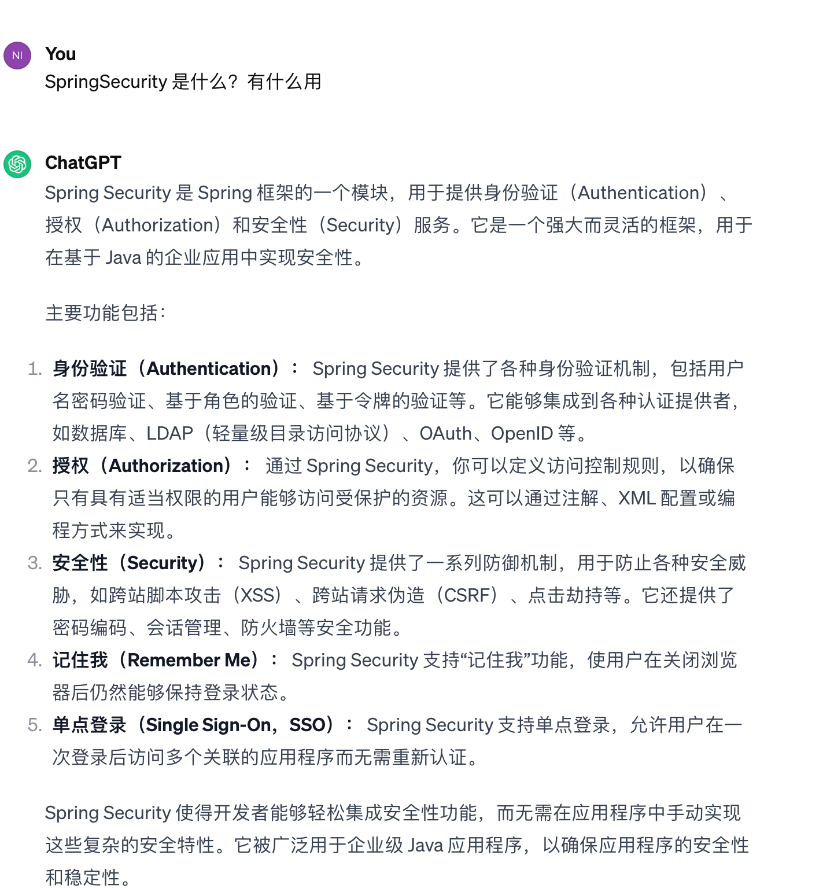](https://note-pic-di0xide.oss-cn-shenzhen.aliyuncs.com/notepic/202401080929495.png)

## 1.2 antMatchers 配置不当权限绕过

### 1.2.1 函数解释

`antMatchers()` 是 Spring Security 中用于匹配请求路径的方法。它基于 Ant 风格的路径匹配规则。在Spring Security中，`antMatchers()` 通常用于定义需要进行安全性配置的URL模式。

简单来说，`antMatchers()`是一个匹配路由的函数，当匹配到后面的路由后，会找到对应的权限规则。

```plain
? 匹配任意单个字符
* 匹配0个或多个字符
** 匹配0个或多个目录
```

例子：

```plain
antMatchers("/admin/**").access("hasRole('ADMIN')")
```

意思是：当访问的路由是`/admin/**`的时候，要求当前的权限是ADMIN

例子：

```plain
antMatchers(“/js/**”).permitAll()
```

意思是：放行所有js目录下的文件，无需权限校验

例子：

```plain
antMatchers(“/**/*.js”).permitAll()
```

也可以这么写，指的是放行所有的js

### 1.2.2 存在漏洞代码

```plain
package com.example.springsecdemo2.demos;

import org.springframework.context.annotation.Bean;
import org.springframework.context.annotation.Configuration;
import org.springframework.security.config.annotation.web.builders.HttpSecurity;
import org.springframework.security.config.annotation.web.configuration.EnableWebSecurity;
import org.springframework.security.core.userdetails.User;
import org.springframework.security.core.userdetails.UserDetails;
import org.springframework.security.provisioning.InMemoryUserDetailsManager;
import org.springframework.security.web.SecurityFilterChain;

@Configuration
@EnableWebSecurity
public class antMatchersConfig {
    @Bean
    public SecurityFilterChain securityFilterChain(HttpSecurity http) throws Exception {

        http
                .csrf().disable()
                .authorizeRequests()
                .antMatchers("/admin").access("hasRole('ADMIN')")
                .antMatchers("/**").permitAll();


        return http.build();
    }


    @Bean
    public InMemoryUserDetailsManager userDetailsService() {
        UserDetails user = User.withDefaultPasswordEncoder()
                .username("user")
                .password("password")
                .roles("USER")
                .build();
        return new InMemoryUserDetailsManager(user);
    }

}
```

这里使用了`antMatchers("/test").access("hasRole('ADMIN')")`,只有ADMIN才可以访问`test`,但是没有去按照正常的写法: /test/\*\* ,导致可以通过`/test/`，来绕过对`/test` 的校验  
[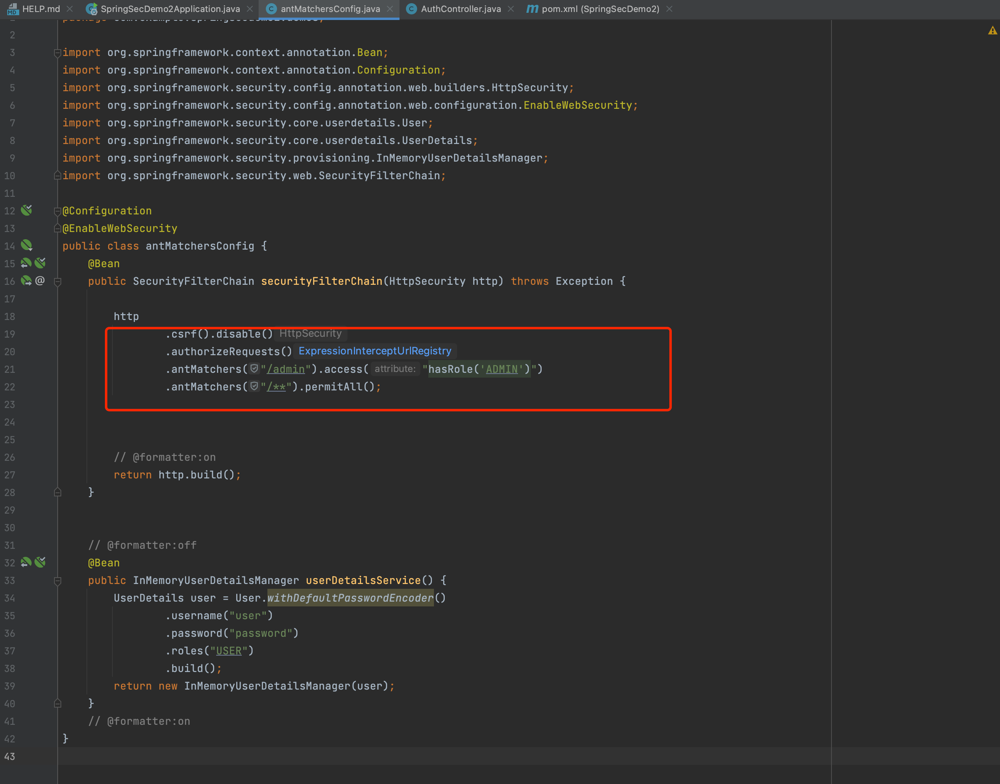](https://note-pic-di0xide.oss-cn-shenzhen.aliyuncs.com/notepic/202401021759319.png)

对应的controller  
[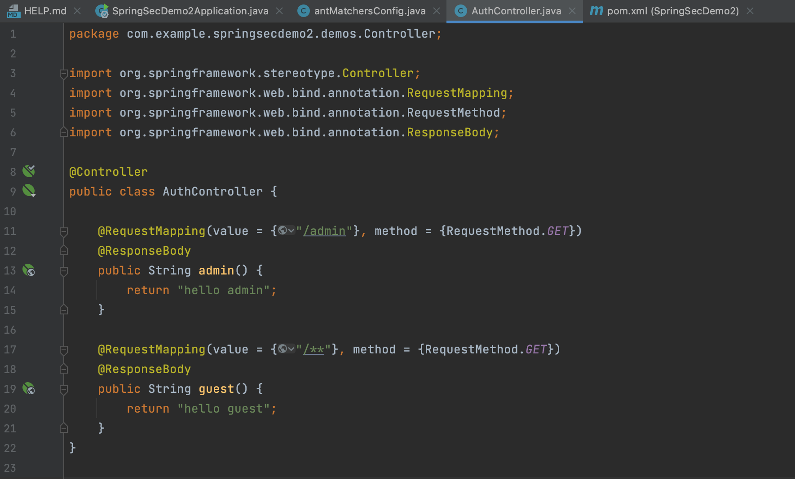](https://note-pic-di0xide.oss-cn-shenzhen.aliyuncs.com/notepic/202401021758899.png)

### 1.2.3 bypass方式

[http://127.0.0.1:8012/test/](http://127.0.0.1:8012/test/)

正常情况：  
[](https://note-pic-di0xide.oss-cn-shenzhen.aliyuncs.com/notepic/202401021757834.png)

访问/admin,提示403  
[](https://note-pic-di0xide.oss-cn-shenzhen.aliyuncs.com/notepic/202401021757751.png)

访问/admin/，通过校验  
[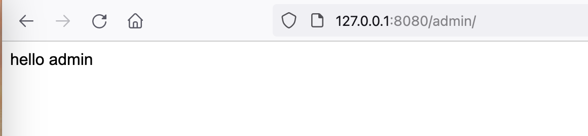](https://note-pic-di0xide.oss-cn-shenzhen.aliyuncs.com/notepic/202401021758643.png)

### 1.2.4 修复方式

可以使用

```plain
mvcMatchers(“/test”).access(“hasRole(‘ADMIN’)”)
```

或者

```plain
antMatchers(“/test/**”).access(“hasRole(‘ADMIN’)”)
```

## 1.3 regexMatchers 配置不当权限绕过

### 1.3.1 函数解释

使用正则表达式进行匹配。  
和 antMatchers()主要的区别就是参数，antMatchers()参数是 ant 表达式，regexMatchers()参数是正则表达式。

例子：

```plain
regexMatchers(“.+[.]js”).permitAll()
```

所有以.js结尾的都放行

例子：

```plain
regexMatchers("/manager.*?").access("hasRole('ADMIN')"
```

manager开头的路由，必须ADMIN权限才可以访问

### 1.3.2 存在漏洞代码

```plain
public class AuthConfig {
    @Bean  
    public SecurityFilterChain securityFilterChain(HttpSecurity http) throws Exception {  
        http  
            .csrf().disable()  
            .authorizeRequests()  
            .regexMatchers("/manager").access("hasRole('ADMIN')")  
            .regexMatchers("/**").access("anonymous");

            ······
```

[](https://note-pic-di0xide.oss-cn-shenzhen.aliyuncs.com/notepic/202401030907309.png)

这里的意思是通过正则匹配到admin路由后，判断权限是否为ADMIN，但是由于正则没有写完整。攻击者可以使用`/admin?` 的方式或者`/admin/` 来绕过权限校验

### 1.3.3 bypass方式

```plain
http://127.0.0.1:8012/test?

http://127.0.0.1:8012/test/
```

正常访问：  
[](https://note-pic-di0xide.oss-cn-shenzhen.aliyuncs.com/notepic/202401030912706.png)

bypass：  
[](https://note-pic-di0xide.oss-cn-shenzhen.aliyuncs.com/notepic/202401030912456.png)

[](https://note-pic-di0xide.oss-cn-shenzhen.aliyuncs.com/notepic/202401030913889.png)

### 1.3.4 修复方式

将正则写完整

```plain
.regexMatchers("/manager.*?").access("hasRole('ADMIN')")
```

除了上面两个旧的匹配函数，目前官方在推`requestMatcher`函数来进行匹配路由，会比较安全。

## 1.4 useSuffixPatternMatch 低版本 权限绕过

### 1.4.1 函数解释

spring-webmvc版本在<=4.3.25的情况下`suffixPatternMatch`默认为`True`。

该方法为是否启用后辍匹配,如果启用,则映射到`/users`的方法也可以匹配到`/users.*`，

`/users` 和`/users.*`是相等的。

网上说的都是小于5.3配置就为true，经过测试5.2.15的代码里，默认是False  
[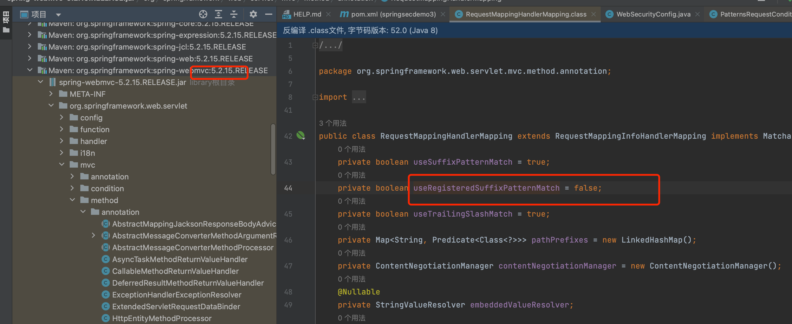](https://note-pic-di0xide.oss-cn-shenzhen.aliyuncs.com/notepic/202401031527200.png)

5.0.4 也不行  
[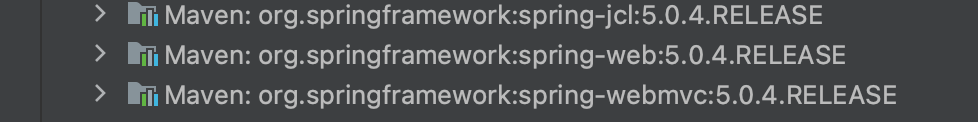](https://note-pic-di0xide.oss-cn-shenzhen.aliyuncs.com/notepic/202401031606930.png)

经过测试，需要满足条件：springboot <= 1.5.22.RELEASE  
[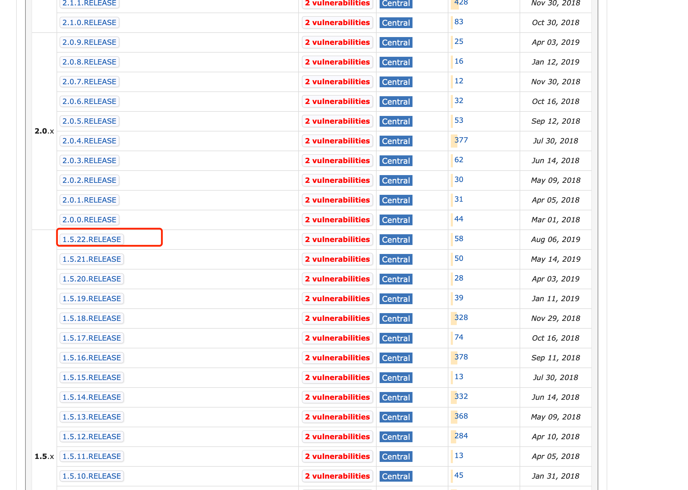](https://note-pic-di0xide.oss-cn-shenzhen.aliyuncs.com/notepic/202401031622940.png)

对应的mvc版本，即为<=4.3.25  
[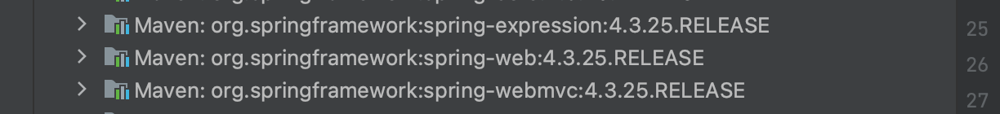](https://note-pic-di0xide.oss-cn-shenzhen.aliyuncs.com/notepic/202401031622435.png)

此时  
[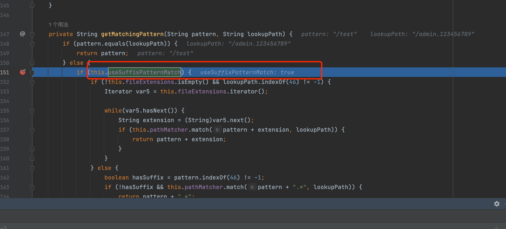](https://note-pic-di0xide.oss-cn-shenzhen.aliyuncs.com/notepic/202401031624923.png)

### 1.4.2 存在漏洞代码

Spring MVC版本在`<=4.3.25`的情况下`suffixPatternMatch`默认为`True`。  
新建项目，选择spring版本为低版本  
[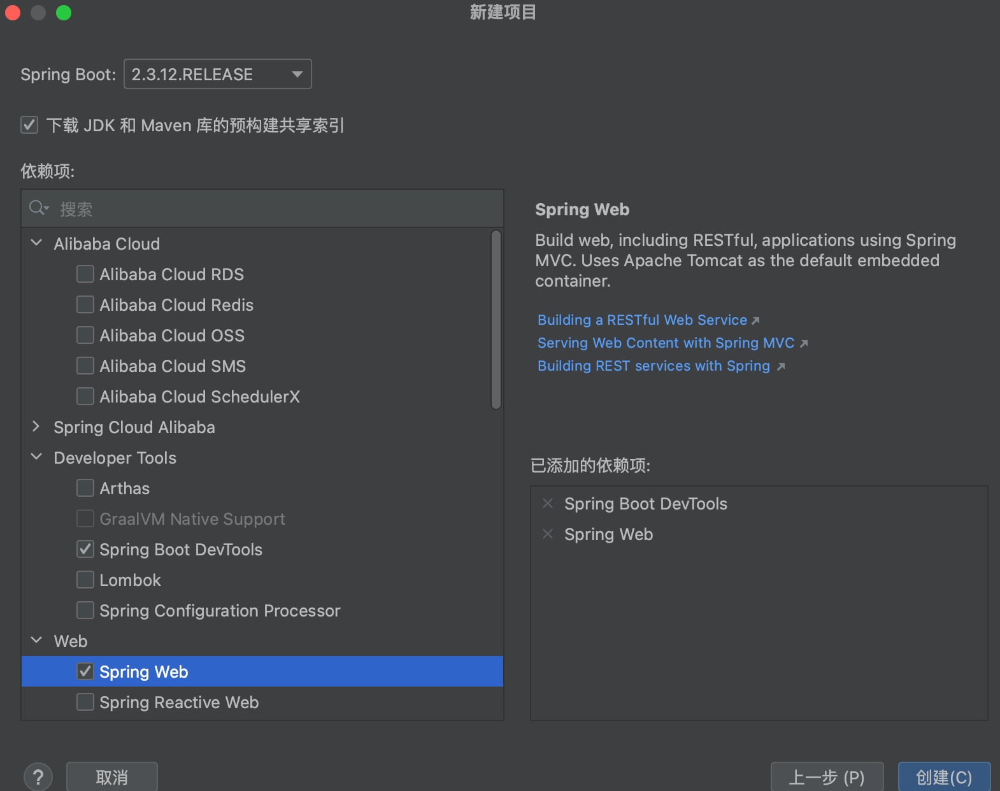](https://note-pic-di0xide.oss-cn-shenzhen.aliyuncs.com/notepic/202401031132882.png)

然后在pom.xml中修改版本

```plain
<properties>
        <java.version>1.8</java.version>
        <project.build.sourceEncoding>UTF-8</project.build.sourceEncoding>
        <project.reporting.outputEncoding>UTF-8</project.reporting.outputEncoding>
        <spring-boot.version>1.5.22.RELEASE</spring-boot.version>
    </properties>
```

[](https://note-pic-di0xide.oss-cn-shenzhen.aliyuncs.com/notepic/202401031625998.png)

然后可以看到Spring MVC版本以及相关组件的版本`<=4.3.25`  
[](https://note-pic-di0xide.oss-cn-shenzhen.aliyuncs.com/notepic/202401031622435.png)

在这种情况下，无论配置文件怎么写路由校验，都会出现漏洞，例如：  
场景1 ：

假设这里/admin 系列的路由都不允许访问

[](https://note-pic-di0xide.oss-cn-shenzhen.aliyuncs.com/notepic/202401031520540.png)

[](https://note-pic-di0xide.oss-cn-shenzhen.aliyuncs.com/notepic/202401031004292.png)

```plain
package com.example.springsecdemo2.demos.Controller;

import org.springframework.stereotype.Controller;
import org.springframework.web.bind.annotation.RequestMapping;
import org.springframework.web.bind.annotation.RequestMethod;
import org.springframework.web.bind.annotation.ResponseBody;

@Controller
public class AuthController {

    @RequestMapping(value = {"/admin"}, method = {RequestMethod.GET})
    @ResponseBody
    public String admin() {
        return "hello admin";
    }

    @RequestMapping(value = {"/test"}, method = {RequestMethod.GET})
    @ResponseBody
    public String test() {
        return "hello test";
    }
}
```

/admin这个路由看起来似乎也没有什么问题，常规的绕过方式也不起作用  
[](https://note-pic-di0xide.oss-cn-shenzhen.aliyuncs.com/notepic/202401031628361.png)

[](https://note-pic-di0xide.oss-cn-shenzhen.aliyuncs.com/notepic/202401031628790.png)

但在低版本（1.x）的springboot上还是能绕过，使用`/admin.` 即可

[](https://note-pic-di0xide.oss-cn-shenzhen.aliyuncs.com/notepic/202401031630736.png)  
[](https://note-pic-di0xide.oss-cn-shenzhen.aliyuncs.com/notepic/202401031630417.png)

### 1.4.3 bypass方式

[http://127.0.0.1:8080/admin.123456789](http://127.0.0.1:8080/admin.123456789)

### 1.4.4 修复方式

使用新版本即可

## 1.5 CVE-2022-22978 （regexMatchers）

| HttpSecurity | Controller | bypass |
| --- | --- | --- |
| `.regexMatchers("/admin/.*").access("hasRole('ADMIN')")` | /admin/api/ | ❌   |
| `.regexMatchers("/admin/.*").access("hasRole('ADMIN')")` | /admin/\*\* | ✅   |

### 1.5.1 漏洞介绍

Spring Security 是 Spring 家族中的一个安全管理框架。在特定版本中，使用regexMatchers去匹配路由的时候，会调用RegexRequestMatcher()，然而因为错误配置会导致使用==.==可以进行权限绕过。

**影响版本：**  
Spring Security 5.6.x < 5.6.4  
Spring Security 5.5.x < 5.5.7  
Spring Security 5.4.x <5.4.11

**说明**  
当然，该漏洞有些鸡肋，因为需要同时满足2个条件：

1.  在权限config配置的时候，正常情况下会匹配/admin/.\* 后所有的路由,并且必须使用regexMatchers()来进行正则匹配  
    [](https://note-pic-di0xide.oss-cn-shenzhen.aliyuncs.com/notepic/202401040910689.png)
2.  在Controller的代码中，只能对/admin/\*\* 这种匹配所有路径的语法才能生效，如果写死了/admin/upload，这样子是无法绕过的，因为就算绕过权限校验，但是程序无法匹配到路由。  
    [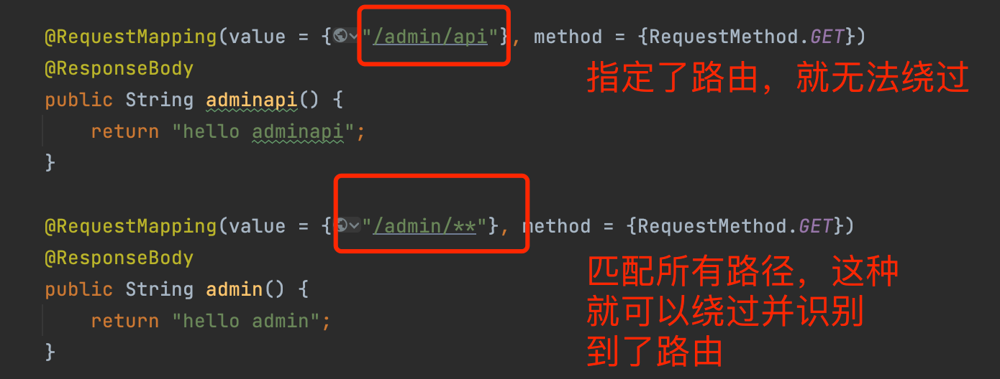](https://note-pic-di0xide.oss-cn-shenzhen.aliyuncs.com/notepic/202401040915810.png)

这种就会绕过，  
[](https://note-pic-di0xide.oss-cn-shenzhen.aliyuncs.com/notepic/202401040921355.png)

但是当访问写死的/admin/api的时候，虽然能绕过权限，但是无法匹配到路由

[](https://note-pic-di0xide.oss-cn-shenzhen.aliyuncs.com/notepic/202401040922111.png)  
[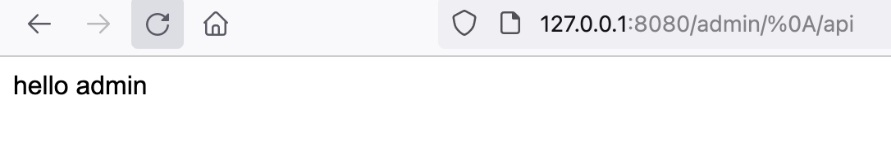](https://note-pic-di0xide.oss-cn-shenzhen.aliyuncs.com/notepic/202401040922575.png)

### 1.5.2 存在漏洞代码

Spring Security 5.6.x < 5.6.4  
Spring Security 5.5.x < 5.5.7  
Spring Security 5.4.x <5.4.11  
[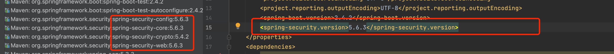](https://note-pic-di0xide.oss-cn-shenzhen.aliyuncs.com/notepic/202401041009649.png)

[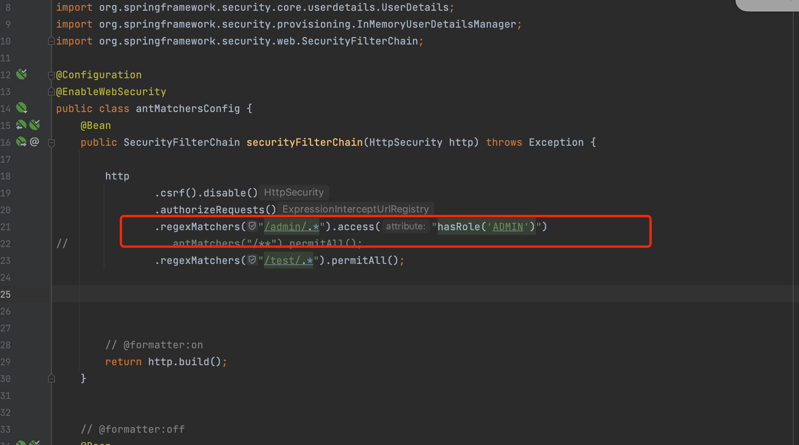](https://note-pic-di0xide.oss-cn-shenzhen.aliyuncs.com/notepic/202401041009736.png)

[](https://note-pic-di0xide.oss-cn-shenzhen.aliyuncs.com/notepic/202401041009864.png)

### 1.5.3 bypass方式

/admin/%0a  
/admin/%0d

### 1.5.4 修复方式

更新版本

## 1.6 CVE-2022-31692 (forward&include 转发)

### 1.6.1 漏洞介绍

当Spring Security 版本处于特定版本时，可能会存在通过 forward 或 include 调度类型绕过授权规则的风险。

影响版本未确认

具体来说，当使用Spring Security的时候，一般会创建一个SecurityFilterChain来为特定的路由设置权限，路由A为匿名访问权限，路由B为高权限，如果在Controller中定义低权限A路由return的时候，使用了forward 或 include 请求，将会导致将低权限的请求转发或包含到一个更高权限的安全端点，从而实现越权。

\==HttpSecurity==  
[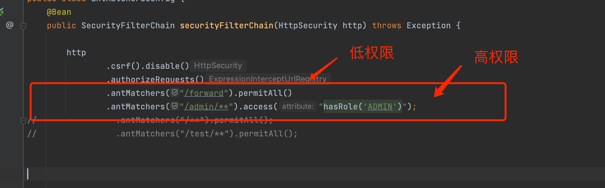](https://note-pic-di0xide.oss-cn-shenzhen.aliyuncs.com/notepic/202401041136956.png)

\==Controller==  
[](https://note-pic-di0xide.oss-cn-shenzhen.aliyuncs.com/notepic/202401041138054.png)

### 1.6.2 存在漏洞代码

```plain
package com.example.springsecdemo2.demos;

import org.springframework.context.annotation.Bean;
import org.springframework.context.annotation.Configuration;
import org.springframework.security.config.annotation.web.builders.HttpSecurity;
import org.springframework.security.config.annotation.web.configuration.EnableWebSecurity;
import org.springframework.security.core.userdetails.User;
import org.springframework.security.core.userdetails.UserDetails;
import org.springframework.security.provisioning.InMemoryUserDetailsManager;
import org.springframework.security.web.SecurityFilterChain;

@Configuration
@EnableWebSecurity
public class antMatchersConfig {
    @Bean
    public SecurityFilterChain securityFilterChain(HttpSecurity http) throws Exception {

        http
                .csrf().disable()
                .authorizeRequests()
                .antMatchers("/forward").permitAll()
                .antMatchers("/admin/**").access("hasRole('ADMIN')");
//                .antMatchers("/**").permitAll();
//                .antMatchers("/test/**").permitAll();


        // @formatter:on
        return http.build();
    }


    // @formatter:off
    @Bean
    public InMemoryUserDetailsManager userDetailsService() {
        UserDetails user = User.withDefaultPasswordEncoder()
                .username("user")
                .password("password")
                .roles("USER")
                .build();
        return new InMemoryUserDetailsManager(user);
    }
    // @formatter:on
}
```

```plain
package com.example.springsecdemo2.demos.Controller;

import org.springframework.stereotype.Controller;
import org.springframework.web.bind.annotation.GetMapping;
import org.springframework.web.bind.annotation.RequestMapping;
import org.springframework.web.bind.annotation.RequestMethod;
import org.springframework.web.bind.annotation.ResponseBody;

@Controller
public class AuthController {

    @RequestMapping(value = {"/forward"}, method = {RequestMethod.GET})
//    @GetMapping("/forward")
    public String forward() {
        return "include:/admin";
        //return "forward:/admin";
    }


    @RequestMapping(value = {"/admin/api"}, method = {RequestMethod.GET})
    @ResponseBody
    public String adminapi() {
        return "hello adminapi";
    }

    @RequestMapping(value = {"/admin/**"}, method = {RequestMethod.GET})
    @ResponseBody
    public String admin() {
        return "hello admin";
    }

    @RequestMapping(value = {"/test/api"}, method = {RequestMethod.GET})
    @ResponseBody
    public String testapi() {
        return "hello testapi";
    }

    @RequestMapping(value = {"/test/**"}, method = {RequestMethod.GET})
    @ResponseBody
    public String test() {
        return "hello test";
    }

//    @RequestMapping(value = {"/**"}, method = {RequestMethod.GET})
//    @ResponseBody
//    public String guest() {
//        return "hello guest";
//    }
}
```

### 1.6.3 bypass方式

通过访问低权限路由，然后转发请求到高权限上，实现越权，常出现在配置不当

### 1.6.4 修复方式

升级版本  
[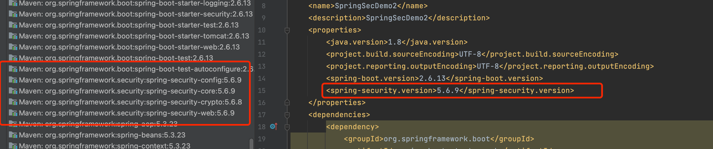](https://note-pic-di0xide.oss-cn-shenzhen.aliyuncs.com/notepic/202401041143788.png)

[](https://note-pic-di0xide.oss-cn-shenzhen.aliyuncs.com/notepic/202401041143744.png)

## 1.7 CVE-2023-34034 (WebFlux )

### 1.7.1 `ServerHttpSecurity`和`HttpSecurity`的区别

在Spring Security中，`ServerHttpSecurity`和`HttpSecurity`分别用于配置WebFlux和Web MVC应用程序的安全性。

#### 1.7.1.1 **ServerHttpSecurity:**

-   `ServerHttpSecurity`用于配置基于WebFlux的应用程序的安全性。它适用于使用Spring WebFlux框架构建的响应式Web应用程序。
-   在使用`ServerHttpSecurity`时，你可以配置基于函数式的路由，例如通过使用`RouterFunctions`和`HandlerFunctions`。
-   例子：  
    \`\`\`java  
    import org.springframework.context.annotation.Bean;  
    import org.springframework.security.config.web.server.ServerHttpSecurity;  
    import org.springframework.security.web.server.SecurityWebFilterChain;

public class SecurityConfig {

```plain
@Bean
public SecurityWebFilterChain securityWebFilterChain(ServerHttpSecurity http) {
    return http
        .authorizeExchange()
            .pathMatchers("/public/**").permitAll()
            .pathMatchers("/admin/**").hasRole("ADMIN")
            .anyExchange().authenticated()
            .and()
        .build();
}
```

}

````plain
#### 1.7.1.2 HttpSecurity:
- `HttpSecurity`用于配置基于Spring MVC的应用程序的安全性。它适用于使用传统的Spring MVC框架构建的Web应用程序。
- 在使用`HttpSecurity`时，你可以配置基于URL模式的安全性，例如通过使用`.antMatchers()`和`.authorizeRequests()`。
```java
import org.springframework.context.annotation.Bean;
import org.springframework.security.config.annotation.web.configuration.EnableWebSecurity;
import org.springframework.security.config.annotation.web.builders.HttpSecurity;
import org.springframework.security.config.annotation.web.configuration.WebSecurityConfigurerAdapter;

@EnableWebSecurity
public class SecurityConfig extends WebSecurityConfigurerAdapter {

    @Override
    protected void configure(HttpSecurity http) throws Exception {
        http
            .authorizeRequests()
                .antMatchers("/public/**").permitAll()
                .antMatchers("/admin/**").hasRole("ADMIN")
                .anyRequest().authenticated()
                .and()
            .formLogin()
                .and()
            .httpBasic();
    }
}
````

总的来说，`ServerHttpSecurity`用于响应式Web应用程序（WebFlux），而`HttpSecurity`用于传统的基于Spring MVC的Web应用程序。

### 1.7.2 漏洞介绍

[https://spring.io/security/cve-2023-34034/](https://spring.io/security/cve-2023-34034/)

在Spring Security配置中对WebFlux使用 `**` 作为匹配会导致Spring Security和Spring WebFlux之间的模式匹配不一致，并可能导致安全绕过。

通俗来说，就是在`HttpSecurity` 配置的时候，`.antMatchers("admin/**").access("hasRole('ADMIN')")`, 匹配规则里没有以==/== 开始，从而导致了Spring Security和Spring WebFlux之间的模式匹配不一致，可能导致绕过

影响版本：

Spring Security:

-   6.1.0 to 6.1.1
-   6.0.0 to 6.0.4
-   5.8.0 to 5.8.4
-   5.7.0 to 5.7.9
-   5.6.0 to 5.6.11

### 1.7.3 存在漏洞代码

\==HttpSecurity.java==

```plain
return http
            .authorizeExchange()
                .pathMatchers("/**").permitAll()
                .pathMatchers("admin/**").hasRole("ADMIN")
                .anyExchange().authenticated()
                .and()
            .build();
```

\==Controller.java==

```plain
@RequestMapping(value = {"/admin/**"}, method = {RequestMethod.GET})
    @ResponseBody
    public String admin() {
        return "hello admin";
    }
```

（环境一直报错，没能复现成功）  
[](https://note-pic-di0xide.oss-cn-shenzhen.aliyuncs.com/notepic/202401041454484.png)  
就可能会导致权限绕过（其实也不能算权限绕过，因为这样子配置，本身就是错误的，会导致配置失效）

### 1.7.4 bypass方式

正常访问即可  
[](https://note-pic-di0xide.oss-cn-shenzhen.aliyuncs.com/notepic/202401041454426.png)

### 1.7.5 修复方式

升级版本，写规则的时候以/开始
