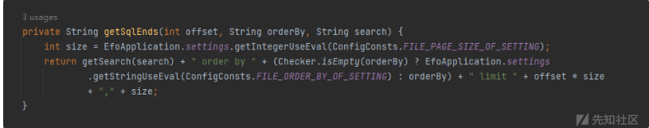

# JAVA代码审计-efo - 先知社区

JAVA代码审计-efo

- - -

# 环境搭建：

首先去修改源码中的配置文件，修改为你本地的用户名和密码。

然后启动环境之后，就进入了登录界面。

# 代码审计：

## 1.SQL注入漏洞

全局搜索关键字，然后去找到DAO⽂件，发现存在search用法。

跟进它。

然后再跟进listUserUploaded⽅法

但fileDAO接⼝只有三个参数，主要查询代码，映射FileSqlProvider这个类的getUserUploaded⽅法。

接着调⽤了getSqlEnds⽅法

最后调⽤getSearch⽅法，然后结束流程。

## 漏洞复现：

进入我的资源功能处，然后点击获取更多。

然后输入单引号，出现报错注入，证明此处确实存在SQL注入漏洞。

输入"进行验证。

成功看到报错注入。

使用sqlmap进行验证。

## 2.sql注入漏洞2

全局搜索关键字，然后定位到更新用户权限功能处。

然后跟进upadtePermission这个函数。

然后进入UserDAO层。

发现其未对用户的输入进行过滤，直接进行SQL查询。

## 漏洞复现：

进入系统设置功能处，然后点击获取更多。

发现该处存在时间盲注

也存在报错注入。

## 3.sql注入漏洞3

全局搜索关键字，接着进入AuthDAO层，

跟进它。

然后继续往下走。

发现未对用户输入进行处理，导致其存在SQL注入漏洞。

## 漏洞复现：

进入权限管理功能处，然后点击新增，然后使用burp抓包。

然后进行报错注入尝试，发现其存在报错注入。

也可以使用SQLMAP进行验证的。

## 4.sql注入漏洞4：

进入/file/all，在列出所有文件的地方传入参数 order by，并且没有做过滤，导致产生SQL注入漏洞，接口信息如下

发现orderBy 参数都是字符串，无过滤且是通过字符串拼接方式进行的传参

## 漏洞复现：

访问url地址。

发现其存在报错注入。

使用SQLMAP进行验证。

## 5、敏感信息泄露泄露

发现多个类中的 jsonObject 对象(一个用来按照json格式保存结果的变量)是共用的，导致认证后的 token 会在访问返回该对象的 未认证接口时泄露，就会成功进行返回。

## 漏洞复现：

成功获取随机生成的cookie。

## 6.未认证任意密码重置

进入重置密码验证码的接口 /common/{email}/code  
然后测试功能需要先修改下配置中的邮箱数据， 邮箱的 smtp 服务器是 smtp.qq.com  
这里向对应邮箱发送了一个验证码，并将其设置发送到对应的session中

## 漏洞复现

进入重置密码处。  
然后获取cookie  

然后利用返回的jessionid配合之前的SQL注入漏洞来修改密码。

