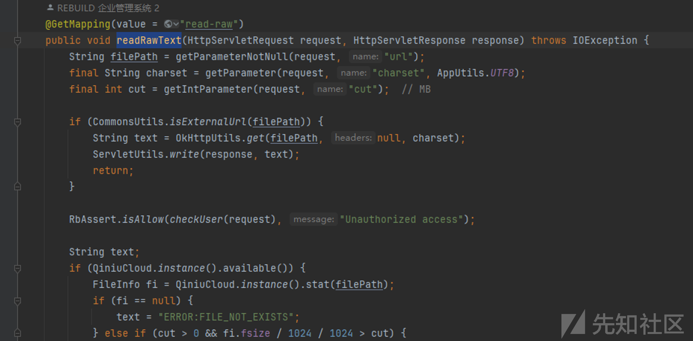

# JAVA代码审计-rebuild - 先知社区

JAVA代码审计-rebuild

- - -

## 0x01 前言

项目地址: gitee: [https://gitee.com/getrebuild/rebuild](https://gitee.com/getrebuild/rebuild)  
github: [https://github.com/getrebuild/rebuild.git](https://github.com/getrebuild/rebuild.git)

下载最新版3.5.4

rebuild是一个开源的企业管理系统,可用于CRM,ERP等企业内部管理平台

用到的一些技术栈

-   springboot
-   thymeleaf
-   mysql
-   fastjson
-   eacache(缓存技术)

## 0x02 审计

在正式开始挖掘漏洞之前,先熟悉一下系统,目录结构如下

-   api 系统全局配置
-   core 整个系统的核心业务代码
-   utils 工具库
-   web 控制层

源码下载完之后,直接运行,数据库的信息在初始化系统的时候配置

正常安装好之后如下:

比较重要的几个类

RebuildWebInterceptor: 拦截器

ControllerRespBodyAdvice: 对数据封装

然后开始看代码,先从登入功能开始,默认的用户名,密码admin admin

控制层类`LoginController`

先获取vcode验证码,默认不开启,所以不进入第一个if,接着获取user和password,然后判断user登入次数,超过3次就不行,然后进入*`checkUser`*

### 默认的用户名和密码登入

在第一个检查用户的地方,除了admin用户之外,还有俩额外的默认用户名和密码

-   system system
-   rebuild rebuild

system默认没激活,但是rebuild可以正常登入

接着往下看,获取对于用户名的User对象,然后进行判断,这里的sql都是预编译的,没什么可以利用的

后续的一些系统的配置,都需要进行管理员身份验证之后才可以操作

### ssrf

在类`FileDownloader` 的`readRawText` 方法中

首先获取到参数url,然后进入OkHttpUtils的get方法

这里就直接发送出去了

### 读取数据库信息

同样在`FileDownloader` 中的`proxyDownload` 方法中

*`getStorageFile` 方法*

这里对传入的filePath做了三种不同方式的处理

-   如果是网页链接,则发送请求,这里也有一个SSRF
-   如果是七牛云中的缓存则获取
-   最后一项,针对本地文件

进入*`getFileOfData` 方法中*

首先判断是否存在../防止任意文件的读取(后续的读取文件形式都是以拼接来读取的,..\\绕不过去貌似)

主要观察最后一行

`return filepath == null ? datadir : new File(datadir, filepath);`

datadir是配置文件的路径,也就是说,虽然不能随便读取,但是可以读取一些配置文件的信息,然后以下是win下的配置文件结构:

上面的文件都可以读取,最主要的就是.rebuild文件,这也就是为啥这个系统不用去改springboot的默认配置文件,他自己搞了一个配置文件,然后我们又可以读取配置文件夹,然后读取一下:

发现他这个安全意识还不错呢,但是没什么用,我们看他的加密方式

在com.rebuild.utils.AES类下面

AES比较熟悉啊,shiro550就是对称密钥的问题,他这里也可以提供默认密钥实现加密解密操作

然后解密一下:

直接用他的代码就行

最后就是找一下互联网的资产了,鹰图语法:

web.icon="125ec4bbe626268ec78340eb590acbb6”

ssrf和读数据库的只能在3.5这个大版本里面才有

## 0x03 总结

开发者对于漏洞的理解都写在代码里面了,比如针对命令执行的防护,在这个系统里面,对Runtime和ProcessBuilder 在执行命令的时候都没办法传入用户的数据进去,以及对于sql的防护,都采用预编译的方式来查询
