# JAVA代码审计-某mall - 先知社区

JAVA代码审计-某mall

- - -

# 环境搭建

启动mysql，然后创建数据库。

[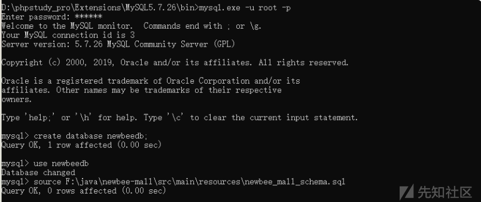](https://xzfile.aliyuncs.com/media/upload/picture/20231129171538-dc46be1c-8e97-1.png)

然后导入.sql文件。

[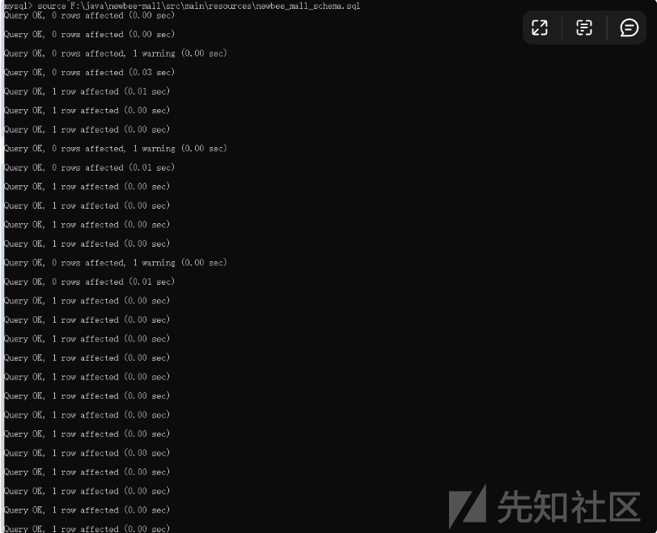](https://xzfile.aliyuncs.com/media/upload/picture/20231129171545-e07ce042-8e97-1.png)

修改数据库名和用户名。

[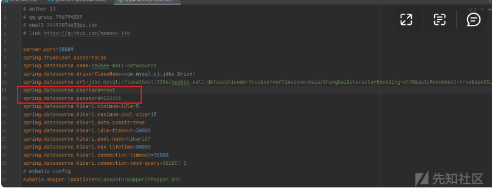](https://xzfile.aliyuncs.com/media/upload/picture/20231129171551-e45fd2f0-8e97-1.png)

# 代码审计：

## 1.sql注入漏洞

全局搜素 ${ ，查看那些地方调用了这些参数，主要是查看${} 拼接 SQL 语句的地方。

[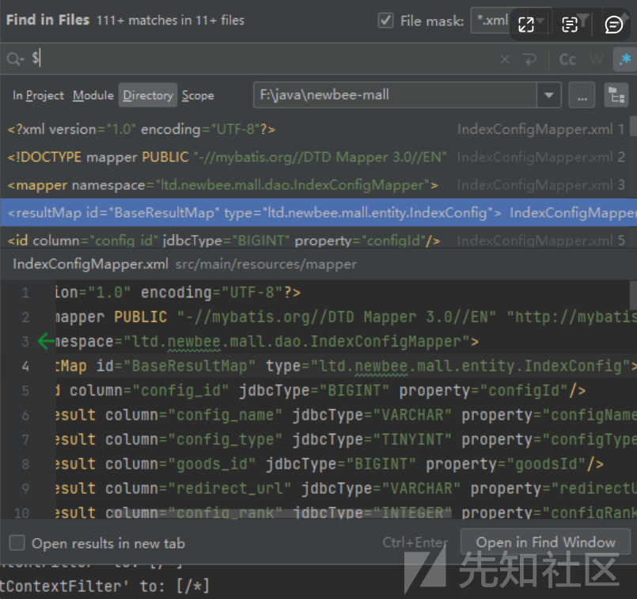](https://xzfile.aliyuncs.com/media/upload/picture/20231129171601-ea650472-8e97-1.png)

进入src/main/resources/mapper/NewBeeMallGoodsMapper.xml 第 70 行

[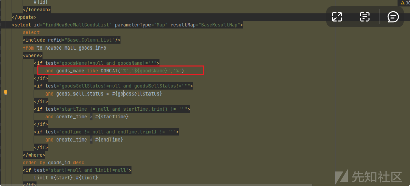](https://xzfile.aliyuncs.com/media/upload/picture/20231129171609-ef049952-8e97-1.png)

首发分析 NewBeeMallGoodsMapper.xml，该部分中 goodsName 参数存在 SQL 注入，使用了直接拼接的方式向数据库进行查询。

[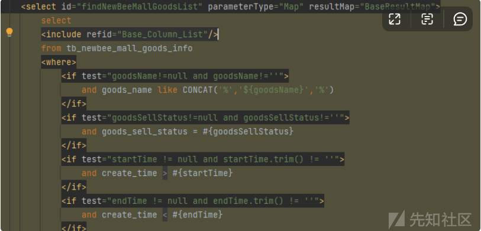](https://xzfile.aliyuncs.com/media/upload/picture/20231129171619-f50d8fa2-8e97-1.png)

进入src/main/java/ltd/newbee/mall/dao/NewBeeMallGoodsMapper.java 源码。

[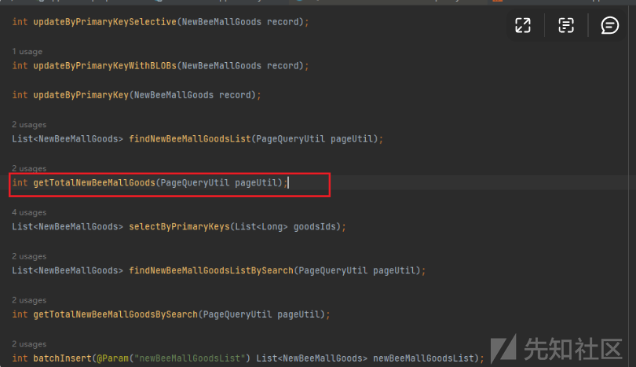](https://xzfile.aliyuncs.com/media/upload/picture/20231129171626-f8f62070-8e97-1.png)

逆向追踪findNewBeeMallGoodsList 方法  
[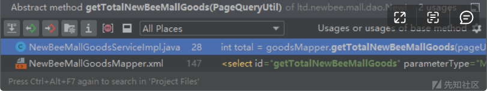](https://xzfile.aliyuncs.com/media/upload/picture/20231129171633-fd38af54-8e97-1.png)

进入src/main/java/ltd/newbee/mall/service/impl/NewBeeMallGoodsServiceImpl.java ，在  
getNewBeeMallGoodsPage 方法中使用了 goodsMapper.findNewBeeMallGoodsList 方法

[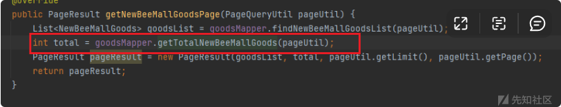](https://xzfile.aliyuncs.com/media/upload/picture/20231129171646-04c5b582-8e98-1.png)

追踪查看谁调用了getNewBeeMallGoodsPage 方法，  
定位到位于src/main/java/ltd/newbee/mall/controller/admin/NewBeeMallGoodsController.java 。

[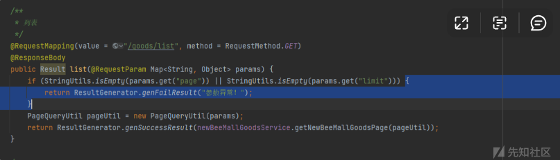](https://xzfile.aliyuncs.com/media/upload/picture/20231129171655-0a12519e-8e98-1.png)

点击 133 行中 params，可以看到该参数来自第 129 行，是一个 Map 对象，它需要从请求中获取参数。

[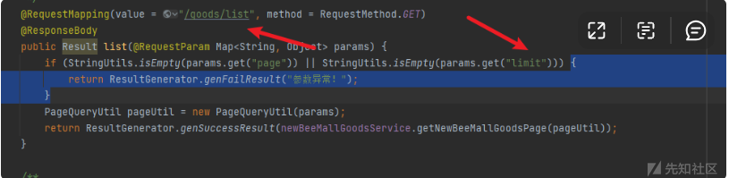](https://xzfile.aliyuncs.com/media/upload/picture/20231129171701-0dfc5e4e-8e98-1.png)

## 漏洞复现：

进入商品管理。使用添加商品。

[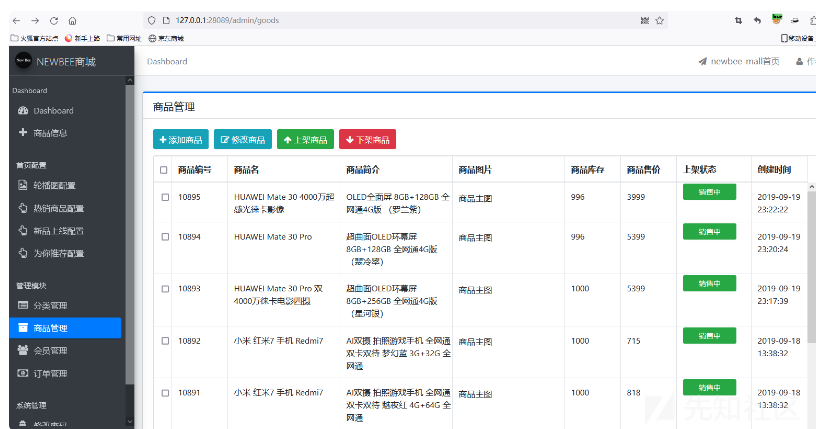](https://xzfile.aliyuncs.com/media/upload/picture/20231129171709-12cfa052-8e98-1.png)

然后使用burp抓包。

[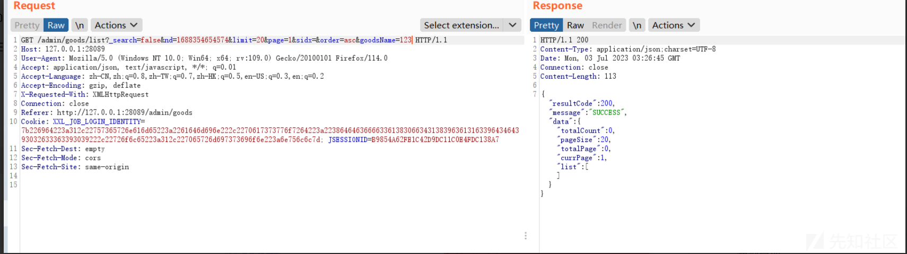](https://xzfile.aliyuncs.com/media/upload/picture/20231129171719-18ad7152-8e98-1.png)

然后在god参数后面添加分号，出现报错注入。

[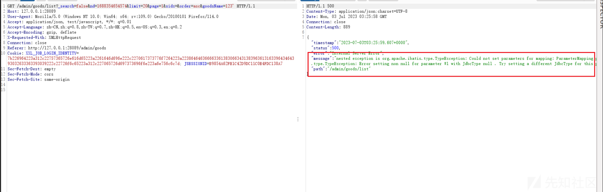](https://xzfile.aliyuncs.com/media/upload/picture/20231129171728-1dc8b0de-8e98-1.png)

也可以使用sqlmap来进行验证。

[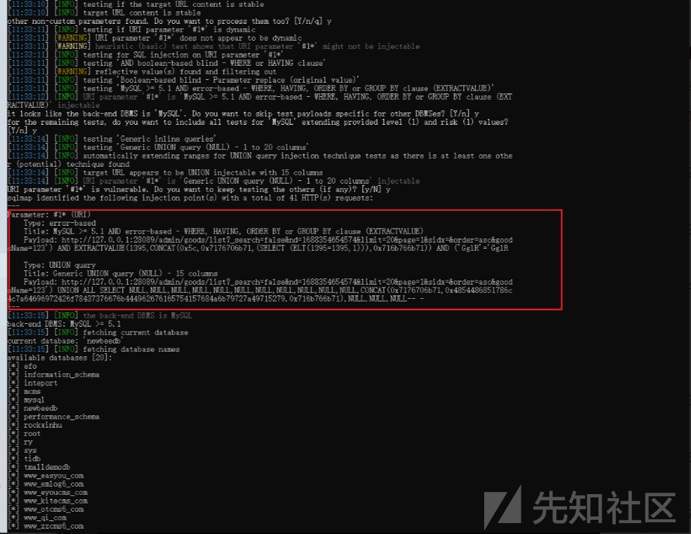](https://xzfile.aliyuncs.com/media/upload/picture/20231129171735-222d6f20-8e98-1.png)

## 2.后台权限绕过

进入src/main/java/ltd/newbee/mall/interceptor/AdminLoginInterceptor.java

[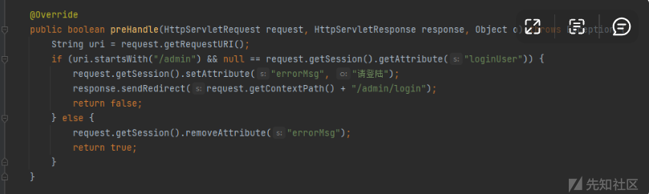](https://xzfile.aliyuncs.com/media/upload/picture/20231129171758-2fae7dba-8e98-1.png)

首先，关键点是第 23 行，使用了 request.getRequestURI() 方法获取路径。 getRequestURI 方法返回的路径是未经过服务器端处理的原始路径，可能包含特殊字符或路径跳转，从而绕过服务器端的安全控制。接着，第 24 行使用了 uri.startsWith("/admin") 判断 Uri 路径中是否以 /admin 开头，以及获取并判断Session 中的 loginUser 属性是否为 null，两个条件 && 在一起结果为 True 的话进入条件代码。

[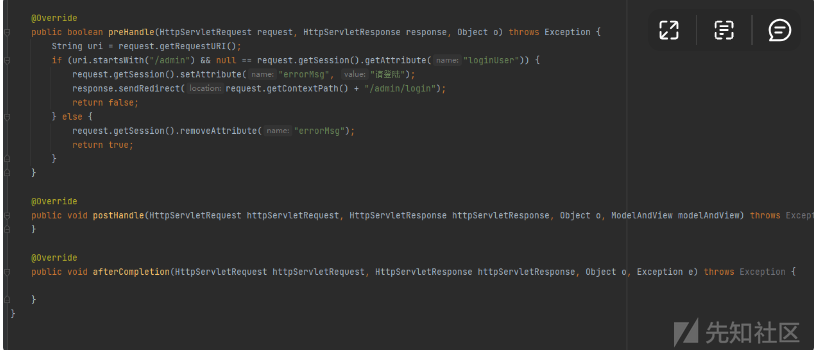](https://xzfile.aliyuncs.com/media/upload/picture/20231129171805-33e76b62-8e98-1.png)

## 漏洞复现：

登陆后台寻找一个后台接口。  
[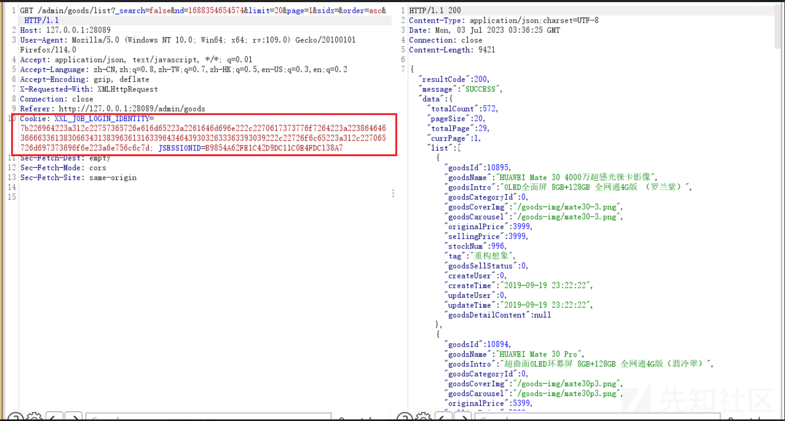](https://xzfile.aliyuncs.com/media/upload/picture/20231129171822-3deaa2aa-8e98-1.png)

删除 Cookie 后，也就是没有访问权限了。

[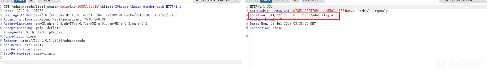](https://xzfile.aliyuncs.com/media/upload/picture/20231129171834-451a454e-8e98-1.png)

发送数据包，显示需要跳转到登录页面

[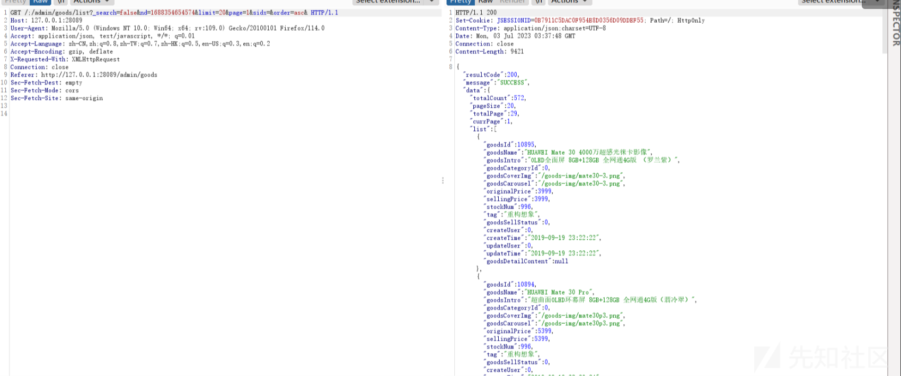](https://xzfile.aliyuncs.com/media/upload/picture/20231129171848-4dd5cd16-8e98-1.png)

## 3.SQL注入漏洞

${ 关键字进行全局搜索 ${  
定位到源码：src/main/java/ltd/newbee/mall/dao/NewBeeMallGoodsMapper.java

[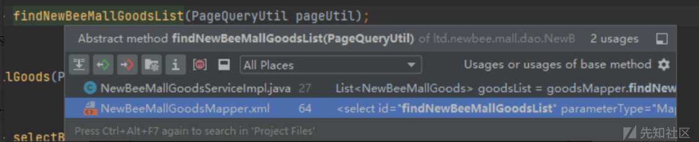](https://xzfile.aliyuncs.com/media/upload/picture/20231129171856-5281982c-8e98-1.png)

[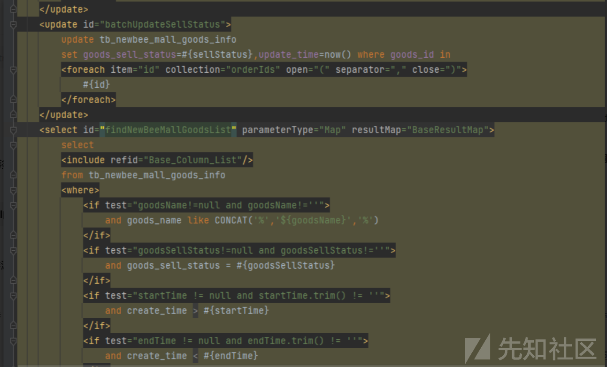](https://xzfile.aliyuncs.com/media/upload/picture/20231129171903-569f1e48-8e98-1.png)

继续向上追踪查看谁调用 searchNewBeeMallGoods 方法，最终跳转到  
GoodsController，位于src/main/java/ltd/newbee/mall/controller/mall/GoodsController.java

[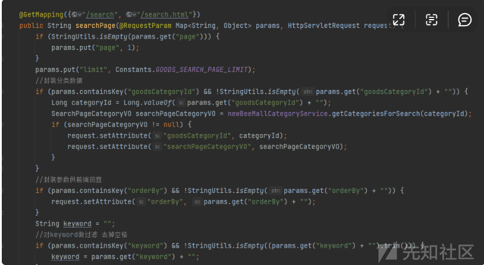](https://xzfile.aliyuncs.com/media/upload/picture/20231129171936-6a3ac6c8-8e98-1.png)

漏洞点在第 57 行，传入了 pageUtil 参数，而该参数同样通过 PageQueryUtil 类创建一个 pageUtil 对  
象，传入 params 作为参数，以及 params 同样是个 Map 对象。未对其进行过滤处理。

## 漏洞复现：

进入漏洞接口处，然后使用burp进行抓包，然后在参数处输入单引号。

[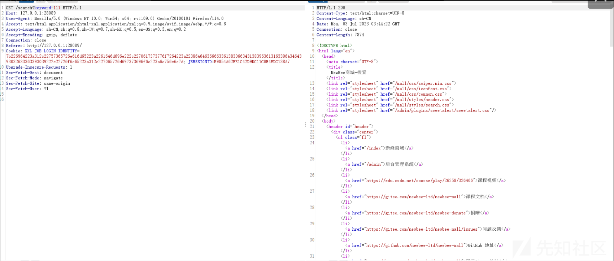](https://xzfile.aliyuncs.com/media/upload/picture/20231129171948-71865a64-8e98-1.png)

发现存在报错注入。

[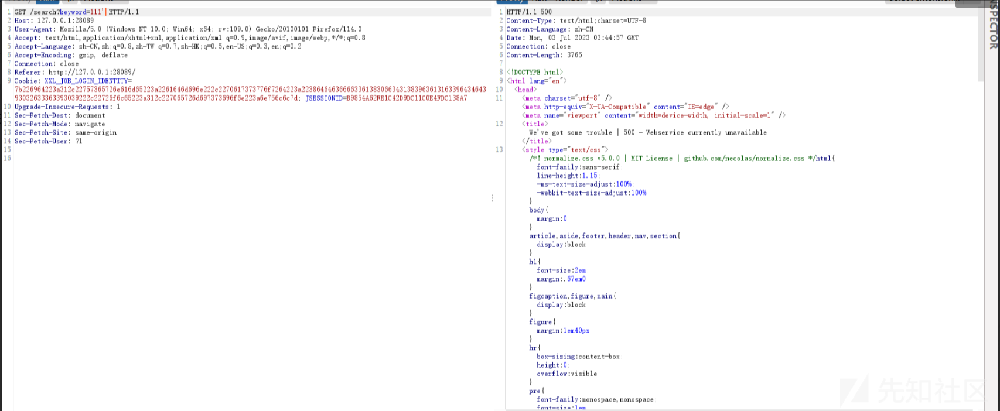](https://xzfile.aliyuncs.com/media/upload/picture/20231129171957-76fff4be-8e98-1.png)

可以使用sqlmap进行验证。

[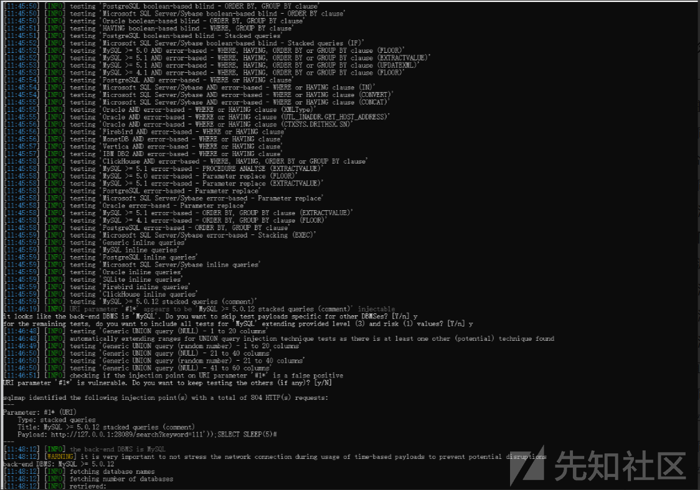](https://xzfile.aliyuncs.com/media/upload/picture/20231129172005-7bca92b0-8e98-1.png)

## 4.XSS漏洞

进入前端搜索框界面，然后输入xss的paylaod，进行黑盒测试。  
没有实现弹框，然后去xss当中去看看。

[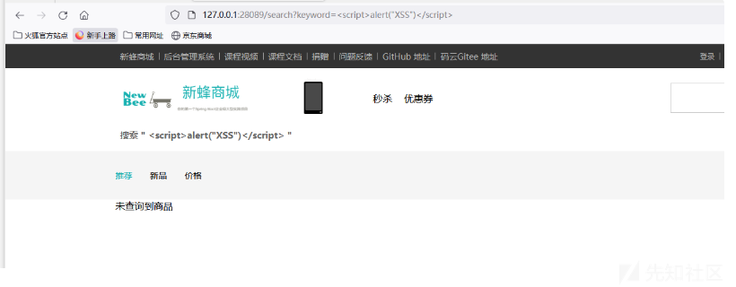](https://xzfile.aliyuncs.com/media/upload/picture/20231129172016-8268e31a-8e98-1.png)

去源码中看看，发现存在转义。

[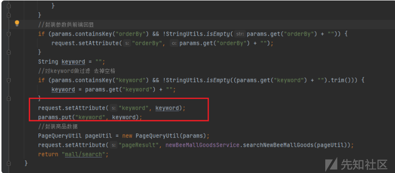](https://xzfile.aliyuncs.com/media/upload/picture/20231129172022-85e9692e-8e98-1.png)

thymeleaf模版在对th:text标签进行渲染的时候，默认对特殊字符进行了转义，  
接着进入/src/main/resources/templates/mall/search.html:33

[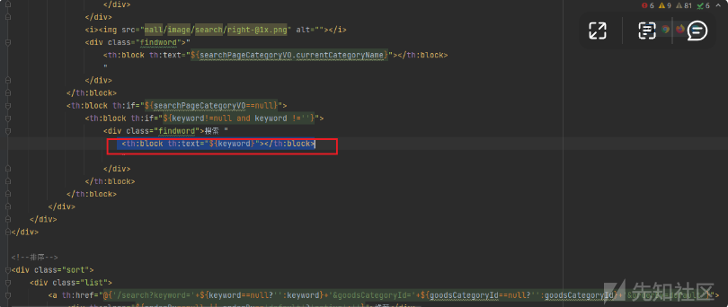](https://xzfile.aliyuncs.com/media/upload/picture/20231129172029-8a11ec6a-8e98-1.png)

找thymeleaf未作转义的输出，th:utext不会将字符转义  
发现以下模版中存在th:utext，所以这两个功能点存在XSS。其中第二个，detail.html因为显示的是商品信息，商品信息使用富文本编辑器，不能简单的转义处理，需要考虑正常的html标签传输，所以作者在这里使用th:utext来显示商品详细。

### xss漏洞1

进入商品信息，添加xss的payload

[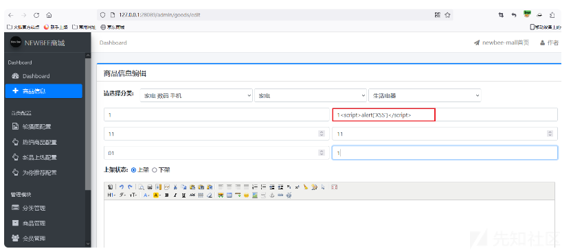](https://xzfile.aliyuncs.com/media/upload/picture/20231129172038-8f64d65a-8e98-1.png)

成功实现弹框。

[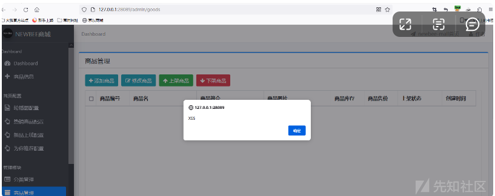](https://xzfile.aliyuncs.com/media/upload/picture/20231129172045-9333e348-8e98-1.png)

### xss漏洞2：

进入订单管理，然后添加payload

[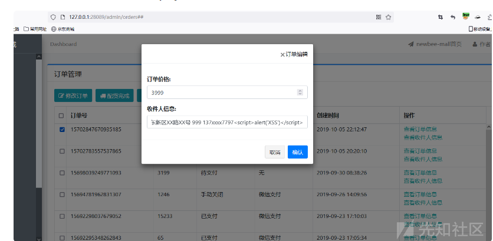](https://xzfile.aliyuncs.com/media/upload/picture/20231129172052-97541646-8e98-1.png)

成功实现弹框。

[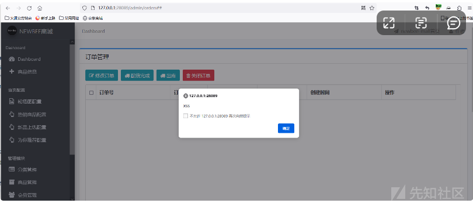](https://xzfile.aliyuncs.com/media/upload/picture/20231129172057-9ab27418-8e98-1.png)

### xss漏洞3：

进入新品上线配置模块  
添加xss的payload

[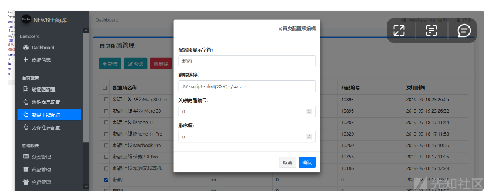](https://xzfile.aliyuncs.com/media/upload/picture/20231129172104-9f0901c6-8e98-1.png)

成功实现弹框。

[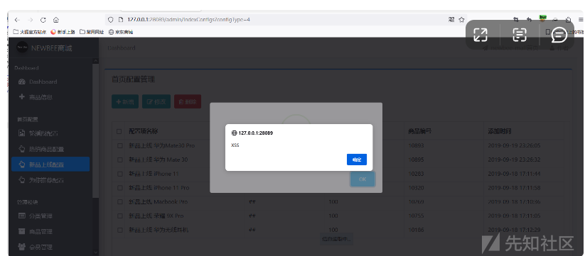](https://xzfile.aliyuncs.com/media/upload/picture/20231129172111-a318c03a-8e98-1.png)

## 5.垂直越权

进入/src/main/java/ltd/newbee/mall/config/NeeBeeMallWebMvcConfigurer.java中，发现针对url路径设置了不同的interceptor。addPathPatterns表示其中的路径会经过设置的拦截器，excludePathPatterns则不过该拦截器。其中两个星\**表示匹配任意字符。如果出现一个*则表示匹配单个路径

[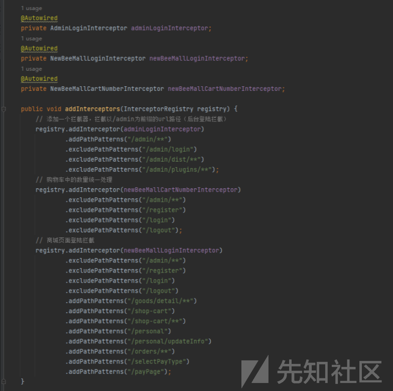](https://xzfile.aliyuncs.com/media/upload/picture/20231129172133-b012b26e-8e98-1.png)

对请求的路由进行判断是应该使用 getServletPath() 来获取最后真正分发到路由地方的 path  
getRequestURI() 只是获取了请求的 URI。

[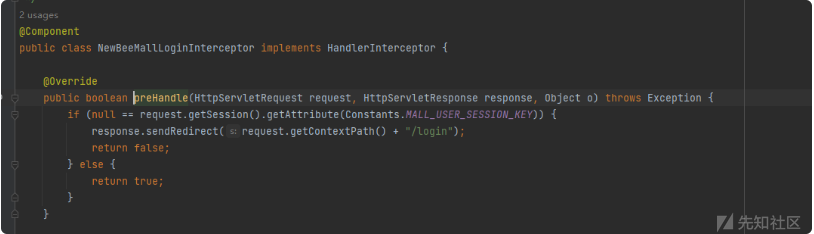](https://xzfile.aliyuncs.com/media/upload/picture/20231129172145-b704e632-8e98-1.png)

使用了 getRequestURI() 来获取URI来判断URI是否以 /admin 开头，如果是 /admin 开头则校验 session，不是则不用校验。

[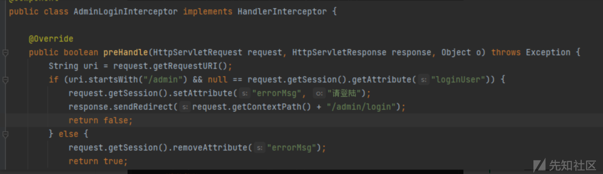](https://xzfile.aliyuncs.com/media/upload/picture/20231129172159-bfc2c140-8e98-1.png)

## 漏洞复现

进入dashboard模块

[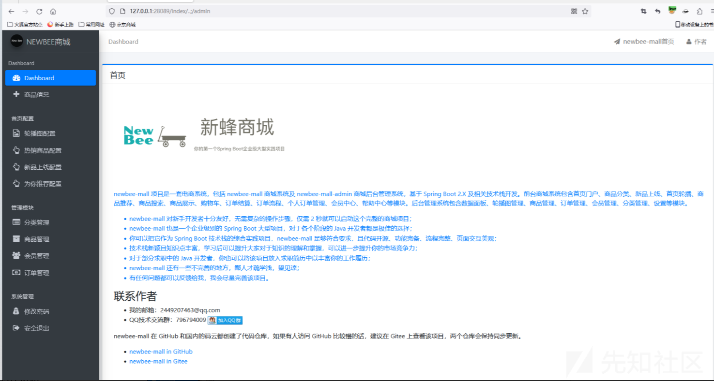](https://xzfile.aliyuncs.com/media/upload/picture/20231129172207-c4640e20-8e98-1.png)

然后输入//admin 或 /index/..;/admin也可以成功访问到页面。

成功绕过了目录访问字符限制。

[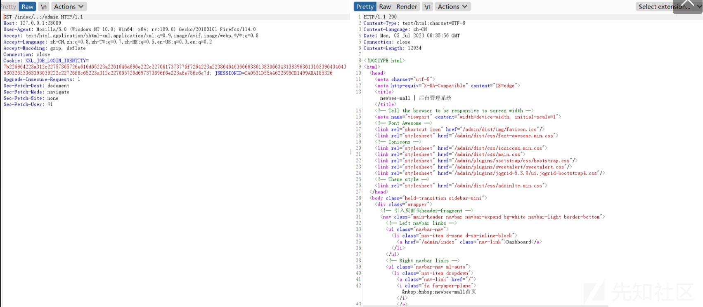](https://xzfile.aliyuncs.com/media/upload/picture/20231129172223-ce19e3c2-8e98-1.png)

## 6.水平越权漏洞1：

定位到源码：ltd/newbee/mall/controller/mall/PersonalController.java:114

[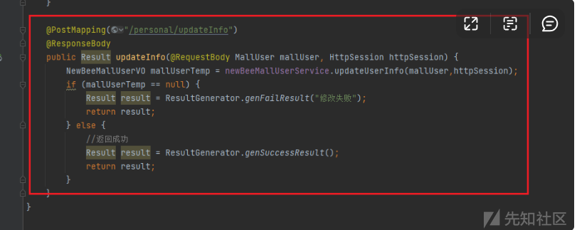](https://xzfile.aliyuncs.com/media/upload/picture/20231129172238-d68fe5ce-8e98-1.png)

接着看 updateUserInfo() 的实现，

[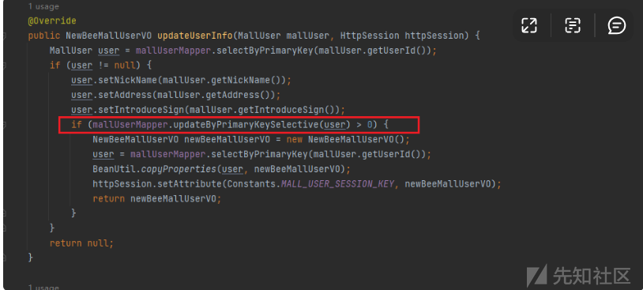](https://xzfile.aliyuncs.com/media/upload/picture/20231129172245-db366a9e-8e98-1.png)

发现这里从数据库查找用户并未用到 session ，而是直接以传递过来的 userId 为参数来查找并修改数据的，所以这里存在水平越权漏洞，修改 userId 便可修改其他用户的信息。

## 漏洞复现1：

注册一个用户，然后查看个人信息。

[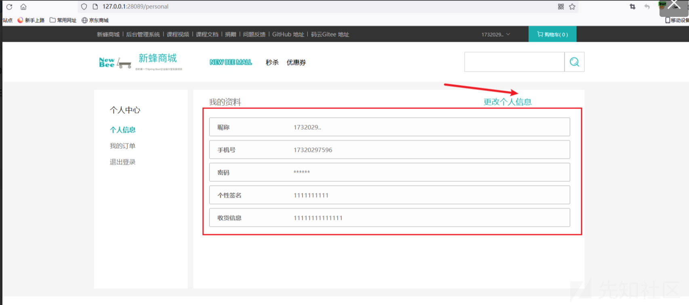](https://xzfile.aliyuncs.com/media/upload/picture/20231129172304-e661eb14-8e98-1.png)

使用burp抓包，用户 userId 为 9

[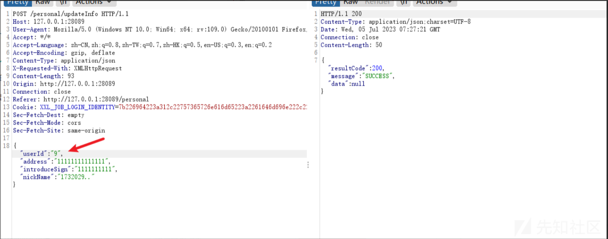](https://xzfile.aliyuncs.com/media/upload/picture/20231129172313-eb766e72-8e98-1.png)

然后修改userid，成功修改其它用户信息。

[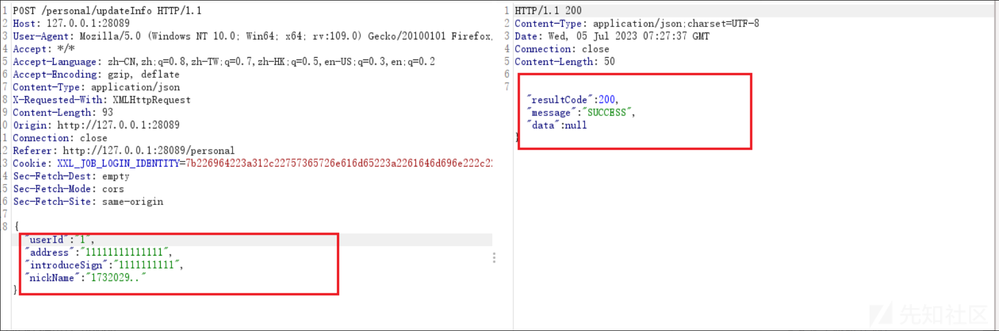](https://xzfile.aliyuncs.com/media/upload/picture/20231129172319-ef0a8104-8e98-1.png)

[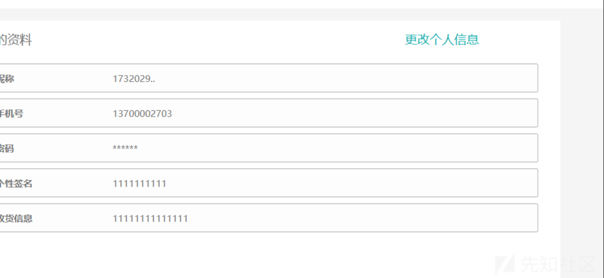](https://xzfile.aliyuncs.com/media/upload/picture/20231129172327-f439dcf6-8e98-1.png)

## 水平越权漏洞2

进入查询订单的源码：td/newbee/mall/controller/mall/OrderController.java:36  
[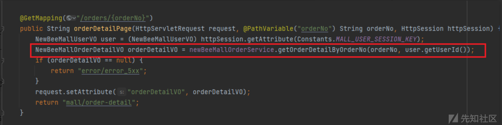](https://xzfile.aliyuncs.com/media/upload/picture/20231129172335-f8c43492-8e98-1.png)  
跟进getOrderDetailByOrderNo() 函数

[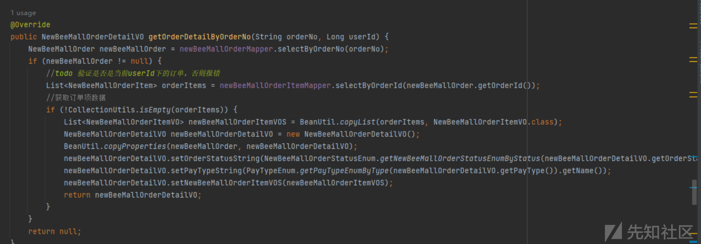](https://xzfile.aliyuncs.com/media/upload/picture/20231129172348-004c5f6e-8e99-1.png)

## 漏洞复现：

这里用户 userId 为9的用户下的单

[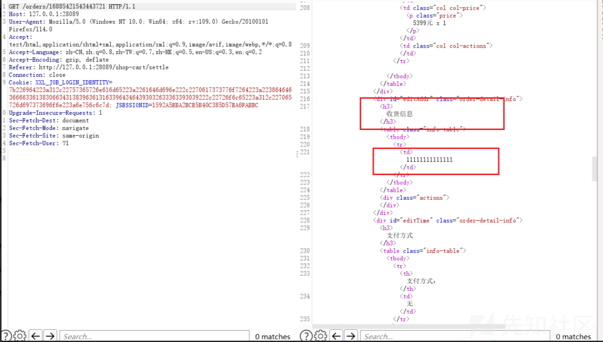](https://xzfile.aliyuncs.com/media/upload/picture/20231129172401-080998b6-8e99-1.png)

替换为其它用户cookie，也可以看到订单信息。

[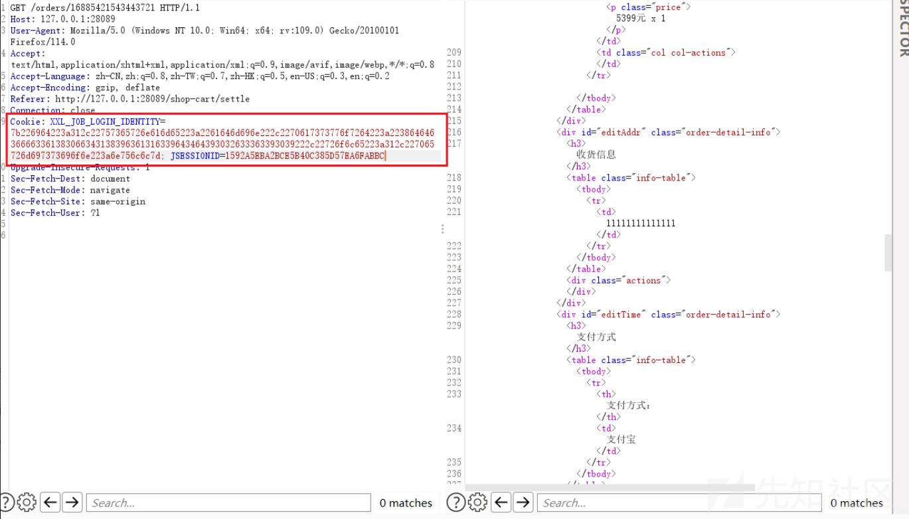](https://xzfile.aliyuncs.com/media/upload/picture/20231129172407-0bfbfd6a-8e99-1.png)

## 7.Csrf漏洞

我们使用添加购物车功能为例，请求内容为下，没有任何token值来进行校验。

[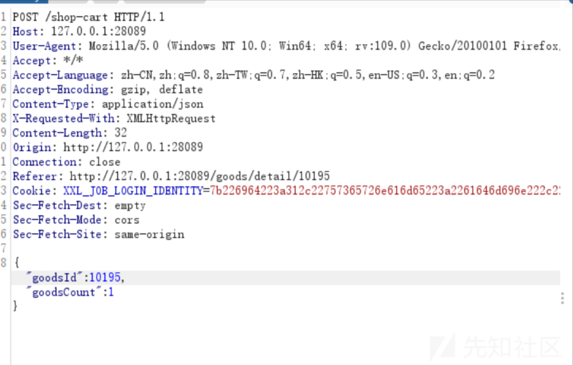](https://xzfile.aliyuncs.com/media/upload/picture/20231129172417-1194f04c-8e99-1.png)

由于是json格式的请求，不能直接使用burp Generate CSRF PoC，因为burp生成的PoC无法伪造Content-Type。burp生成的CSRF PoC请求内容如下，可以看到Content-Type: text/plain，并且post数据多出一个等号。

[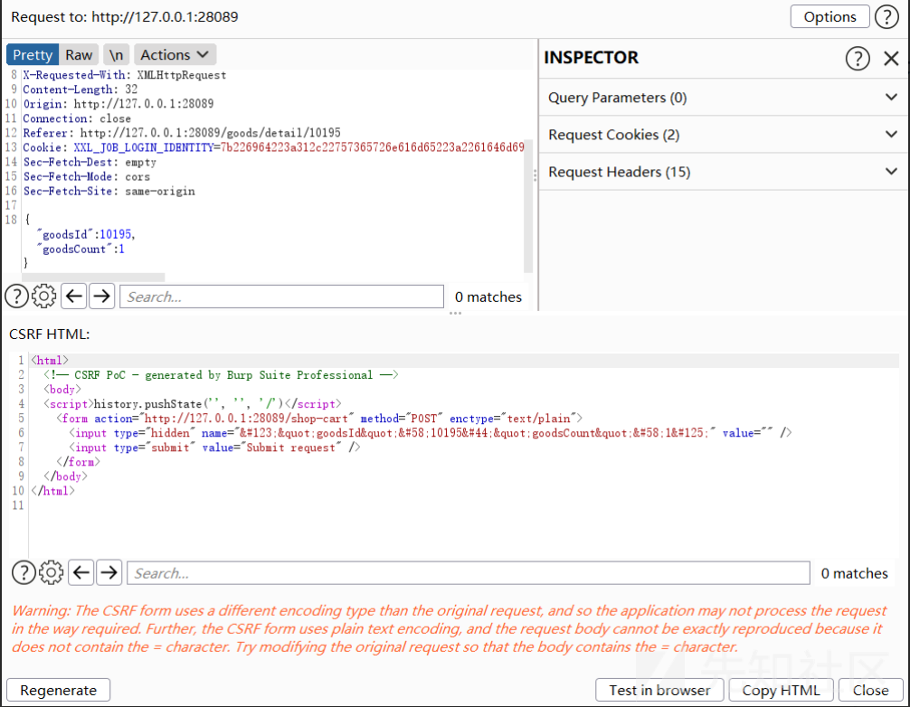](https://xzfile.aliyuncs.com/media/upload/picture/20231129172425-168934a0-8e99-1.png)

## 漏洞复现：

未授权访问商品 [http://localhost:8089/index/..;/admin/goods/edit/10896](http://localhost:8089/index/..;/admin/goods/edit/10896)

[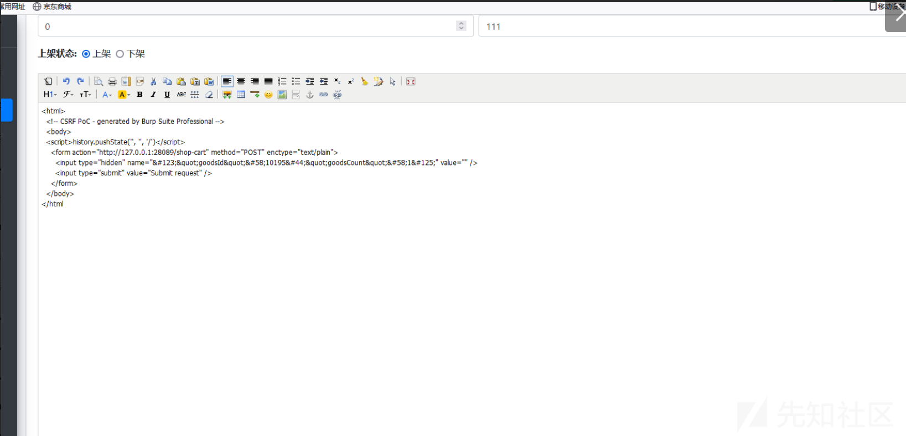](https://xzfile.aliyuncs.com/media/upload/picture/20231129172433-1b1c57a4-8e99-1.png)

然后生成csrf的poc。进行抓包。

[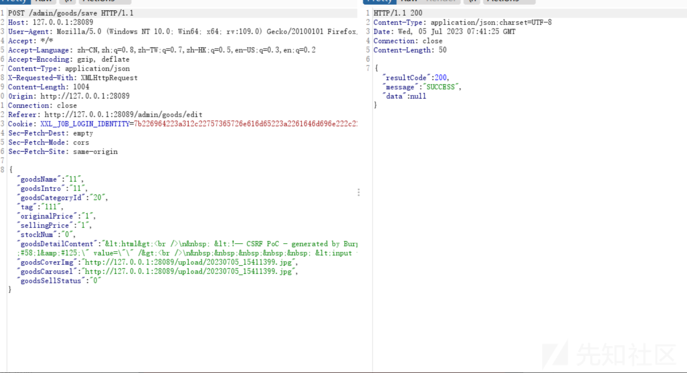](https://xzfile.aliyuncs.com/media/upload/picture/20231129172440-1fc4e5e6-8e99-1.png)

然后成功写入xss的payload。

[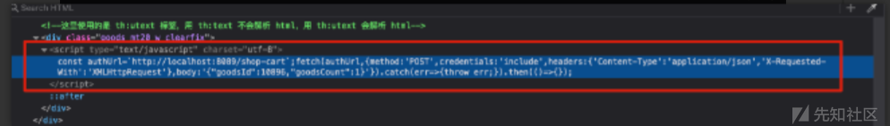](https://xzfile.aliyuncs.com/media/upload/picture/20231129172447-23f90246-8e99-1.png)

成功添加商品到购物车当中。

[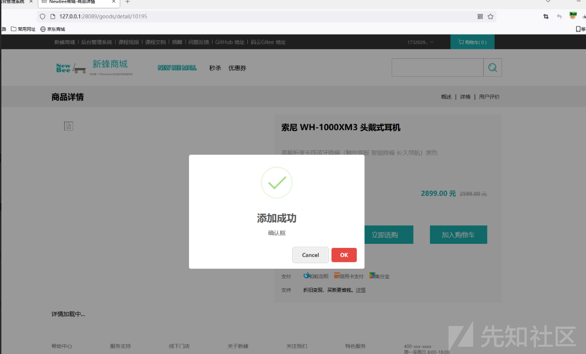](https://xzfile.aliyuncs.com/media/upload/picture/20231129172454-27fa124a-8e99-1.png)

## 8.逻辑漏洞

下订单但未支付时，访问/orders/{orderNo}/finish可直接完成交易。

[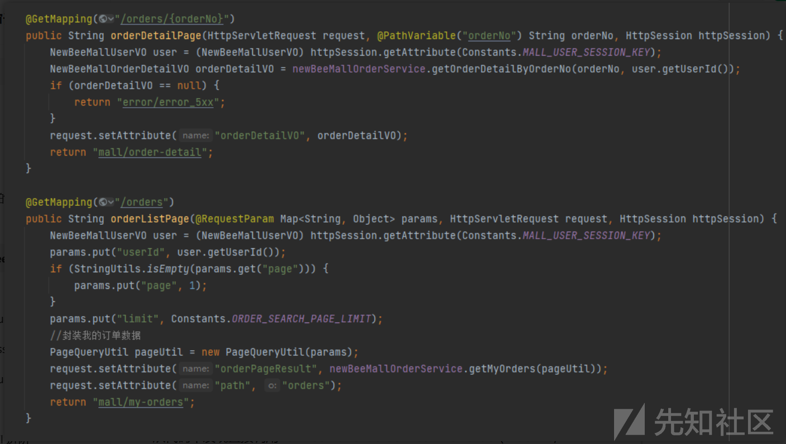](https://xzfile.aliyuncs.com/media/upload/picture/20231129172503-2d54cb9a-8e99-1.png)

从代码中发现直接调用newBeeMallOrderService.finishOrder(orderNo, user.getUserId())，对于该订单是否支付，是否出库等过程都没有校验。

[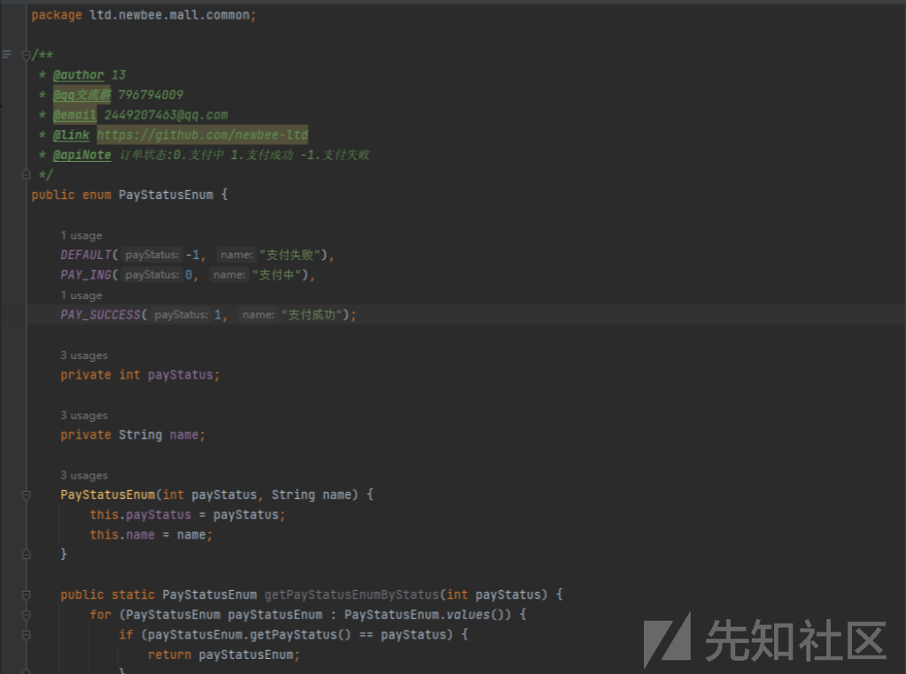](https://xzfile.aliyuncs.com/media/upload/picture/20231129172510-319e048c-8e99-1.png)

因为代码使用的是@PutMapping，使用PUT方法访问，其他请求方法不会被执行。

[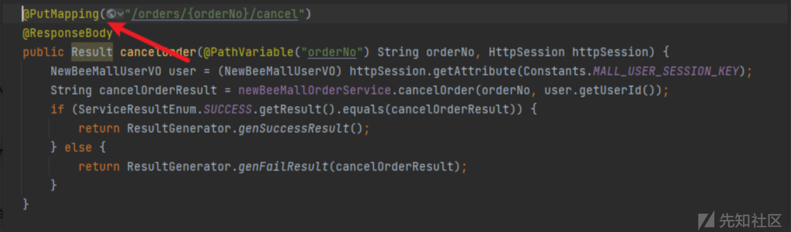](https://xzfile.aliyuncs.com/media/upload/picture/20231129172516-351b11b8-8e99-1.png)

[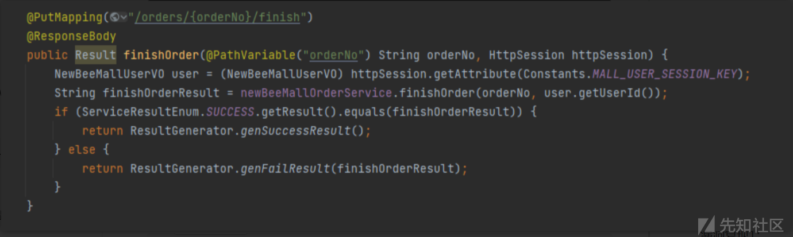](https://xzfile.aliyuncs.com/media/upload/picture/20231129172523-38e874e8-8e99-1.png)

## 漏洞复现：

添加一件物品到购物车，然后提交订单。

[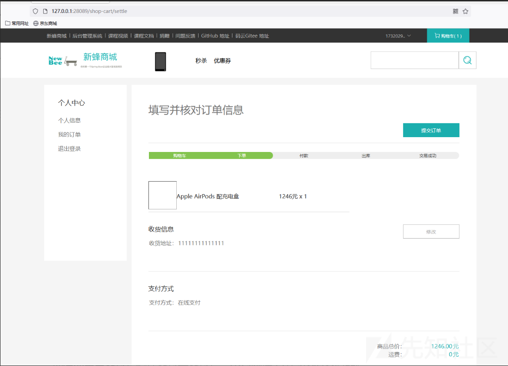](https://xzfile.aliyuncs.com/media/upload/picture/20231129172531-3db92dc8-8e99-1.png)

然后点击去支付，选择支付宝支付，一系列流程下来可以购买商品。

[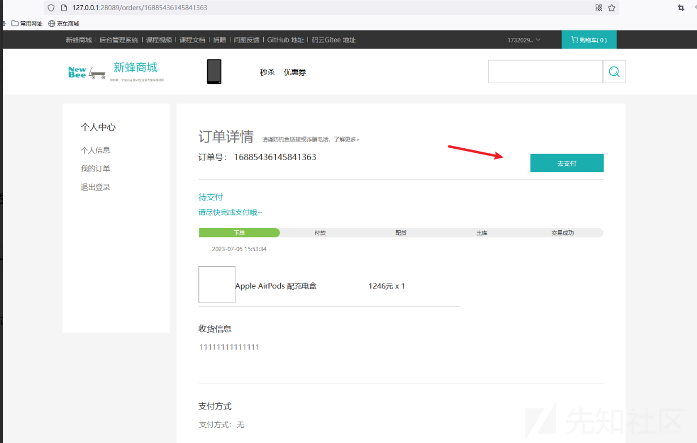](https://xzfile.aliyuncs.com/media/upload/picture/20231129172540-432eeec8-8e99-1.png)

我们进入商品后台，订单一开始是未支付。

[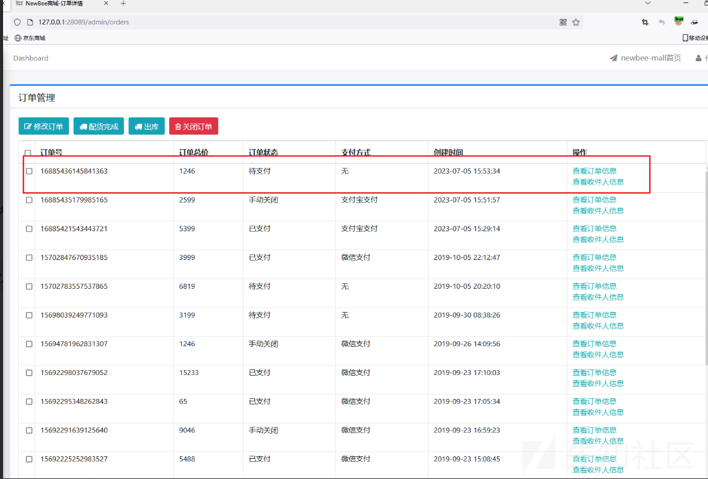](https://xzfile.aliyuncs.com/media/upload/picture/20231129172547-4737898a-8e99-1.png)

我们使用put方式去请求。

[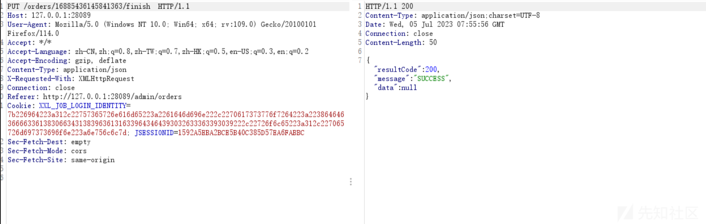](https://xzfile.aliyuncs.com/media/upload/picture/20231129172556-4c952e1e-8e99-1.png)

成功支付商品。

[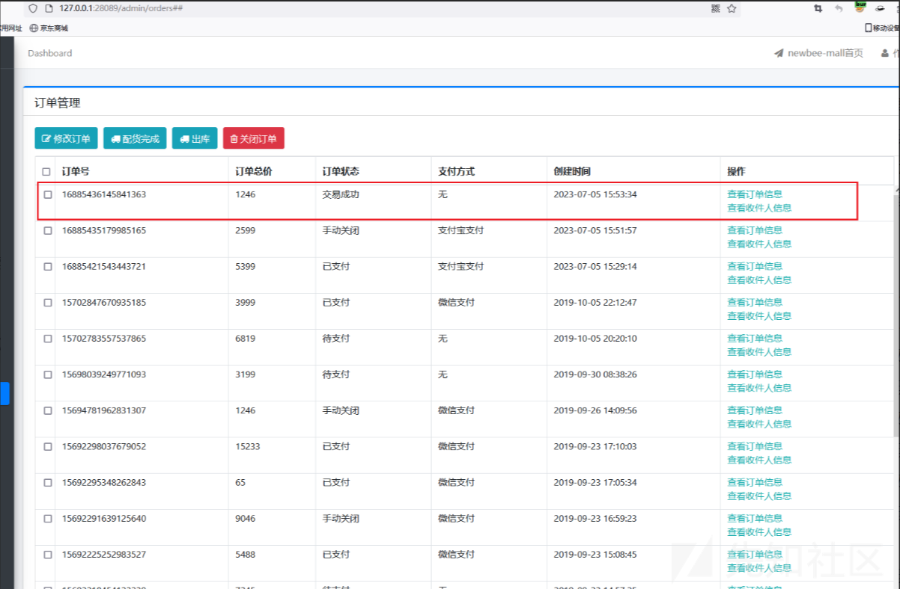](https://xzfile.aliyuncs.com/media/upload/picture/20231129172604-5170ea9a-8e99-1.png)

REF：  
[https://cloud.tencent.com/developer/article/2169674](https://cloud.tencent.com/developer/article/2169674)  
[https://s31k31.github.io/2020/04/25/JavaSpringBootCodeAudit-1-Preparation/](https://s31k31.github.io/2020/04/25/JavaSpringBootCodeAudit-1-Preparation/)
