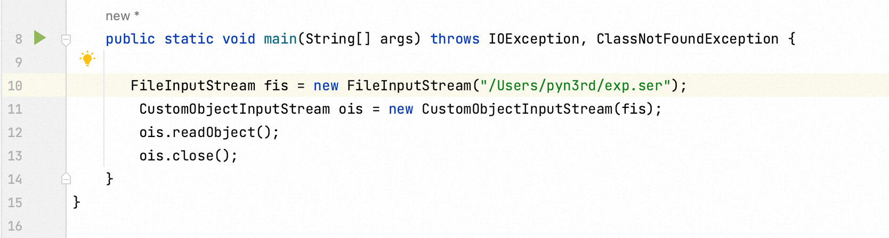

# Java Deserialization Vulnerability Still Alive

by pyn3rd

2023-10-20 (Updated: 2023-10-21)

Several months ago, the Constrast Security Team reported a Java deserialization vulnerability about Spring Kafka to VMWare Security Team. It immediately attracted my attention and I got started to analyse this bug. If you are interested in it, you could look up the details in my previous blog.  
几个月前，Constrast 安全团队向 VMWare 安全团队报告了一个关于 Spring Kafka 的 Java 反序列化漏洞。它立即引起了我的注意，我开始分析这个错误。如果你对它感兴趣，你可以在我之前的博客中查找详细信息。

[https://blog.pyn3rd.com/2023/09/15/CVE-2023-34040-Spring-Kafka-Deserialization-Remote-Code-Execution](https://blog.pyn3rd.com/2023/09/15/CVE-2023-34040-Spring-Kafka-Deserialization-Remote-Code-Execution)

After analyzing explicitly, I consider it a thought-provoking report. Hence, I instantly write this blog down.  
经过明确的分析，我认为这是一份发人深省的报告。因此，我立即写下了这篇博客。

Java deserialization vulnerability is on the top of the list when it comes to Java Security. I would like to talk about that with the recent Java deserialization vulnerability of Spring Kafka.  
在 Java 安全性方面，Java 反序列化漏洞位居榜首。我想用最近Spring Kafka的Java反序列化漏洞来谈谈这个问题。

People have been likely to know the fundamental reason is unsafe serialization stream from users without verification contributes to remote code execution.  
人们可能已经知道，根本原因是来自未经验证的用户的不安全序列化流会导致远程代码执行。

A majority of Java applications have more or less paid attention to the deserialization vulnerability, like Weblogic Server, Apache Shiro. Personally, overwriting the `ObjectInputStream` function becomes widespread use for defending against Java deserialization attack. It could make this problem alleviated. When overwriting the `ObjectInputStream`, the `resolveClass` would be hooked and potentially dangerous functions revoking might be found out.  
大多数 Java 应用程序或多或少都关注反序列化漏洞，例如 Weblogic Server、Apache Shiro。就个人而言，覆盖函数 `ObjectInputStream` 被广泛用于防御 Java 反序列化攻击。它可以缓解这个问题。当覆盖 `ObjectInputStream` 时， `resolveClass` 会被挂钩，并且可能会发现潜在的危险函数撤消。

Actually, Spring Kafka also utilizes the same way to defend against Java deserialization vulnerability. Observe the Java fragment up close.  
实际上，Spring Kafka 也使用相同的方式来防御 Java 反序列化漏洞。近距离观察 Java 片段。

Although the defensive programming apparentlly existing, why still does the Java deserialization vulnerability take place in Spring Kafka? I guess the confusion has manifested in someone’s face in front of the screen.  
虽然防御性编程显然存在，但为什么 Java 反序列化漏洞仍然发生在 Spring Kafka 中？我猜这种困惑已经体现在屏幕前某人的脸上。

-   Customize ObjectInputStream & Hook resolveClass  
    自定义 ObjectInputStream 和 Hook resolveClass

I just supply a demonstration with an overwritten `ObjectInputStream` function.Then, I attempt to deserialize the malicious deserialization stream.  
我只是提供了一个带有覆盖 `ObjectInputStream` 函数的演示。然后，我尝试反序列化恶意反序列化流。

Insecure attempt has been blocked successfully.  
已成功阻止不安全的尝试。

Then I mimic Spring Kafka’s code thoroughly. I replace the class `DeserializationException.class` with `Person.class`to make you aware that the exeception would be thrown.  
然后，我彻底模仿了Spring Kafka的代码。我用 替换 class `DeserializationException.class` 是为了 `Person.class` 让您知道会抛出 exception。

Consequently, I could simply escape this verification in a way of encapsulation. After initializating `CustomExceptionClass` , it could be inputted into the instance of `DeserializationExeception` as an argument.  
因此，我可以简单地以一种封装的方式逃避这种验证。初始化后 `CustomExceptionClass` ，可以将其作为参数输入到实例 `DeserializationExeception` 中。

Last step is to embed the `CommonCollection6` gadget in a static code block.  
最后一步是将 `CommonCollection6` 小工具嵌入到静态代码块中。

In conclusion, the weakness of customized `ObjectInputStream` contributes to Spring Kafka deserialization vulnerability. It only verifies the top layer function in stack.  
综上所述，定制 `ObjectInputStream` 的弱点导致了Spring Kafka反序列化漏洞。它只验证堆栈中的顶层功能。

Apart from the the way to customize `ObjectInputStream`function, there are some other choices for defence.  
除了自定义 `ObjectInputStream` 功能的方式外，还有一些其他的防御选择。

-   ValidatingObjectInputStream in Apache Commons IO library  
    Apache Commons IO 库中的 ValidatingObjectInputStream
    
    The Apache Commons IO library contains utility classes, stream implementations, etc. It offers a function `ValidatingObjectInputStream` to only allow the specific classes to be deserialized, equal to a whitelist.  
    Apache Commons IO 库包含实用程序类、流实现等。它提供了一个只允许对特定类进行反序列化的函数 `ValidatingObjectInputStream` ，相当于白名单。
    
    Besides the classes in the whitelist, any class could not be deserialized! As you see, the class `org.springframework.kafka.support.serializer.DeserializationException`has been blocked, because it’s not included in the whitelist.  
    除了白名单中的类之外，任何类都无法反序列化！如您所见，该类 `org.springframework.kafka.support.serializer.DeserializationException` 已被阻止，因为它未包含在白名单中。
    

-   JEP290 JEP290型
    
    JEP290 is a JDK-based detective pragramming. It provides a flexible mechanism to prevent Java applications from deserialization attack.  
    JEP290 是一个基于 JDK 的侦探程序。它提供了一种灵活的机制来防止 Java 应用程序受到反序列化攻击。
    
    Developers could customize a particular class as the filter. It permits the classes to be deserialized or not. In my illustration, the class `com.sun.org.apache.xalan.internal.xsltc.trax.TemplatesImpl` would be blocked.  
    开发人员可以自定义特定类作为筛选器。它允许类被反序列化或不被反序列化。在我的插图中，该类 `com.sun.org.apache.xalan.internal.xsltc.trax.TemplatesImpl` 将被阻止。
    

Unfortunately, this mechanism more or less has some shortages. I intend to talk about it next time.  
不幸的是，这种机制或多或少存在一些不足。我打算下次再谈。

