# Java 代码审计 - 背景

# Java 代码审计背景

## 1 Java Web 基础

### 1.1 Servlet

#### 1.1.1 概念

Java Servlet 是运行在 Web 服务器或应用服务器上的程序，它是作为来自 Web 浏览器或其他 HTTP 客户端的请求和 HTTP 服务器上的数据库或应用程序之间的中间层。

使用 Servlet，您可以收集来自网页表单的用户输入，呈现来自数据库或者其他源的记录，还可以动态创建网页。

Java Servlet 通常情况下与使用 CGI (Common Gateway Interface，公共网关接口)实现的程序可以达到异曲同工的效果。但是相比于 CGl，Servlet 有以下几点优势:

-   性能明显更好
-   Servlet 在 web 服务器的地址空间内执行这样它就没有必要再创建一个单独的进程来处理每个客户端请求
-   Servlet 是独立于平台的，因为它们是用 Java 编写的
-   服务器上的 Java 安全管理器执行了一系列限制以保护服务器计算机上的资源。因此，Servlet 是可信的。
-   Java 类库的全部功能对 Servlet 来说都是可用的。它可以通过 sockets 和 RMI 机制与 applets、数据库或其他软件进行交互。

#### 1.1.2 Servlet 架构

#### 1.1.3 Servlet 生命周期

Servlet 生命周期可被定义为从创建直到毁灭的整个过程。

以下是 Servlet 遵循的过程：

-   Servlet 初始化后调用 init() 方法。
-   Servlet 调用 service() 方法来处理客户端的请求。(调用 doGet、 doPost等方法)
-   Servlet 销毁前调用 destroy() 方法
-   最后，Servlet 是由 JVM 的垃圾回收器进行垃圾回收的

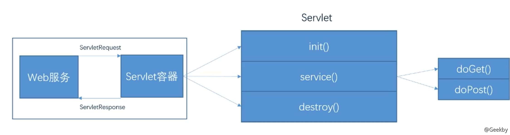

### 1.2 JSP

#### 1.2.1 概念

JSP 全称 Java Server Pages，是一种动态网页开发技术。它使用 JSP 标签在 HTML 网页中插入 Java 代码。标签通常以 `<%` 开头，以 `%>` 结束。

JSP 是一种 Java servlet，主要用于实现 Java web 应用程序的用户界面部分。网页开发者们通过结合 HTML 代码、 XHTML 代码、XML 元素以及嵌入 JSP 操作和命令来编写 JSP

JSP 通过网页表单获取用户输入数据、访问数据库及其他数据源，然后动态地创建网页。

JSP 标签有多种功能，比如访问数据库、记录用户选择信息、访问 JavaBeans 组件等,还可以在不同的网页中传递控制信息和共享信息。

#### 1.2.2 JSP 处理过程

就像其他普通的网页一样，浏览器发送一个 HTTP 请求给服务器。

Web 服务器识别出这是一个对 JSP 网页的请求，并且将该请求传递给 JSP 引擎。通过使用 URL 或者 .jsp 文件来完成

JSP 引擎从磁盘中载入 JSP 文件，然后将它们转化为 Servlet。这种转化只是简单地将所有模板文本改用 println() 语句，并且将所有的 JSP 元素转化成 Java 代码

JSP 引擎将 Servlet 编译成可执行类，并且将原始请求传递给 Servlet 引擎

Web 服务器的某组件将会调用 Servlet 引擎，然后载入并执行 Servlet 类。在执行过程中，Servlet 产生 HTML 格式的输出并将其内嵌于 HTTP response web 中上交给 Web 服务器。

Web 服务器以静态 HTML 网页的形式将 web response 返回到浏览器中

最终，Web 浏览器处理 web response 中动态产生的 HTML 网页，就好像在处理静态网页一样。

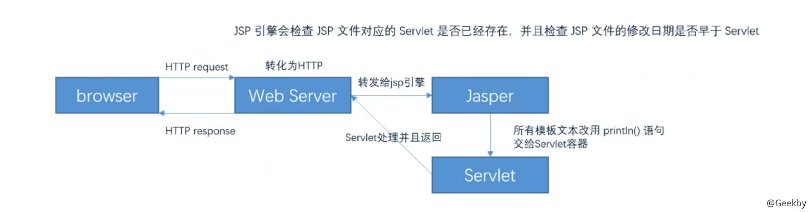

#### 1.2.3 JSP 的生命周期

**编译阶段**：Servlet 容器编译源文件，生成 Servlet 类

-   JSP 引擎会检查是否需要编译

**初始化阶段**：加载与 JSP 对应 Servlet 的类，创建其实例，并调用它的初始化方法

-   jsplnit()

**执行阶段**：调用与 JSP 对应 Servlet 的实例的服务方法

-   jspService()

**销毁阶段**：调用与 JSP 对应 Servlet 的实例的销毁方法，然后销毁 Servlet 实例

-   jspDestroy()

### 1.3 Filter

#### 1.3.1 概念

Servlet 过滤器可以动态地拦截请求和响应，以变换或使用包含在请求或响应中的信息。

可以将一个或多个 Servlet 过滤器附加到一个 Servlet 或一组 Servlet。Servlet 过滤器也可以附加到 JavaServer Pages(JSP) 文件和 HTML 页面。调用 Servlet 前调用所有附加的过滤器。

Servlet 过滤器是可用于编程的 Java 类，可以实现以下目的：

-   在客户端的请求访问后端资源之前，拦截这些请求。
-   在服务器的响应发送回客户端之前，处理这些响应。

#### 1.3.2 Filter 方法

**public void doFilter(ServletRequest, ServletRespor, FilterChain)**

该方法完成实际的过滤操作，当客户端请求方法与过滤器设置匹配的 URL 时，Servlet 容器将先调用过滤器的 doFilter 方法。FilterChain 用户访问后续过滤器。

**public void init(FilterConfig filterConfig)**

web 应用程序启动时，web 服务器将创建 Filter 的实例对象，并调用其 init 方法，读取 web.xml 配置，完成对象的初始化功能，从而为后续的用户请求作好拦截的准备工作(filter 对象只会创建一次，init 方法也只会执行一次)。开发人员通过 init 方法的参数，可获得代表当前 filter 配置信息的对象。

**public void destroy()**

Servlet 容器在销毁过滤器实例前调用该方法，在该方法中释放 Servlet 过滤器占用的资源。

### 1.4 Listener

监听器用于监听 web 应用中某些对象、信息的创建、销毁、增加，修改，删除等动作的发生，然后作出相应的响应处理。当范围对象的状态发生变化的时候，服务器自动调用监听器对象中的方法。

按监听的对象划分，可以分为：

-   ServletContext 对象监听器
-   HttpSession 对象监听器
-   ServletRequest 对象监听器

其中前两种都不适合作为内存 Webshell，因为涉及到服务器的启动跟停止，或者是 Session 的建立跟销毁，目光就聚集到第三种对于请求的监听上面，其中最适合作为 Webshell 的要数 ServletRequestListener，因为我们可以拿到每次请求的的事件：ServletRequestEvent，通过其中的 getServletRequest() 函数就可以拿到本次请求的 request 对象，从而加入我们的恶意逻辑 。

## 2 SSH 框架

### 2.1 MVC

MVC 模式是软件工程中的一种软件架构模式，把软件系统分为三个基本部分：模型（Model）、视图（View）和控制器（Controller）。

MVC 模式的目的是实现一种动态的程序设计，使后续对程序的修改和扩展简化，并且使程序某一部分的重复利用成为可能。除此之外，此模式透过对复杂度的简化，使程序结构更加直观。软件系统透过对自身基本部分分离的同时也赋予了各个基本部分应有的功能。

-   模型（Model）- 程序员编写程序应有的功能（实现算法等等）、数据库专家进行数据管理和数据库设计（可以实现具体的功能）。
-   视图（View）- 界面设计人员进行图形界面设计。
-   控制器（Controller）- 负责转发请求，对请求进行处理性能明显更好。

#### 2.1.1 MVC 早期架构

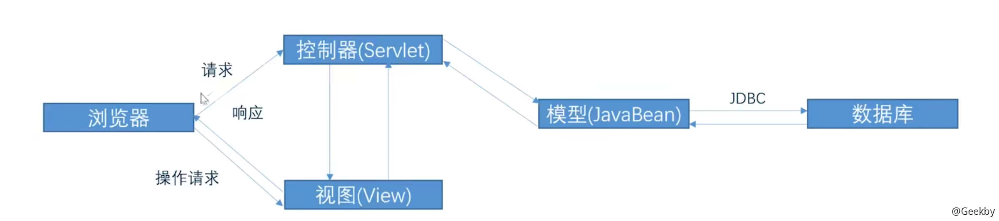

#### 2.1.2 MVC 现代架构

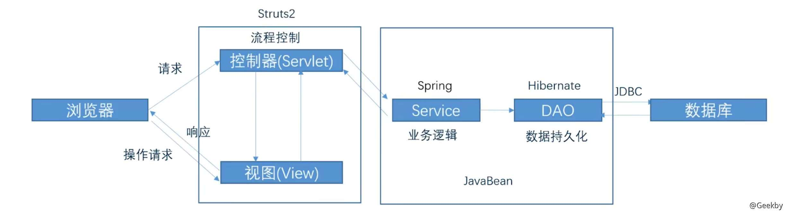

### 2.2 Struts2

Struts2 是一个基于 MVC 设计模式的 Web 应用框架，它本质上相当于一个Servlet。但是 J2EE 的 MVC 设计模式中，Struts2 作为控制器（Controller）来建立模型与视图的数据交互。Struts 2 是基于 Filter，为了实现 AOP 的思想。

#### 2.2.1 Struts2 架构

-   Servlet Filters：过滤器链，client 的全部请求都要经过 Filter 链的处理。
-   Struts Core：Struts2 的核心处理部分。
-   Interceptors： Struts2 的拦截器。Struts2 提供了非常多默认的拦截器。 也可以自己定义的拦截器，用来实现实际业务要的功能。
-   User Created：由开发者创建的。包含 struts.xml、Action、Template.

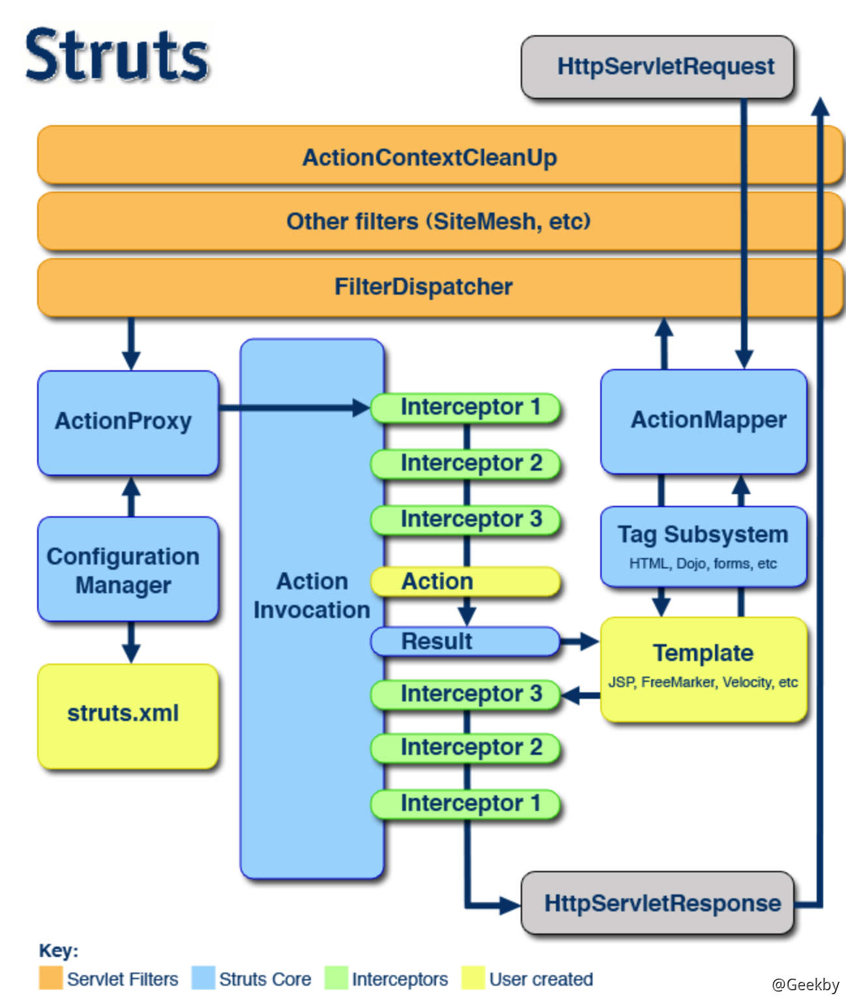

#### 2.2.2 Struts2 的 MVC

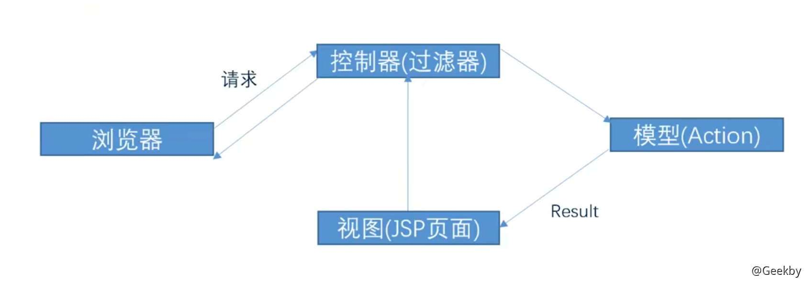

#### 2.2.3 OGNL 表达式

-   支持对象方法调用，形式如：objName.methodName()；
-   支持类静态的方法调用和值访问，表达式的格式为`@[类全名(包括包路径)]@[方法名|值名]`，例如：`@java.lang.String@add（'11'，'hahhaha'）`
-   支持赋值操作和表达式串联，例如：`number=18，price=100，calculatePrice(price*number)`；那么返回 1800；
-   访问 OGNL 上下文(OGNLcontext)在 Struts2 中是 ActionContext； 操作（创建）集合对象

### 2.3 Spring

-   方便解耦，简化开发（高内聚低耦合）。Spring 就是一个大工厂（IoC容器），可以将所有对象创建和依赖关系维护，交给 Spring 管理，Spring 工厂是用于生成 bean。
-   提供面向切面（AOP）编程。Spring 可以方便的实现对程序进行权限拦截、运行监控等功能。
-   方便集成各种优秀框架。Spring 不排斥各种优秀的开源框架，其内部提供了对各种优秀框架（如：Struts.Hibernate.、MyBatis 等）的直接支持。
-   降低 JavaEE API 的使用难度。Spring 对 JavaEE 开发中非常难用的一些 API（JDBC、JavaMail、远程调用等），都提供了封装，使这些 API 应用难度大大降低。

#### 2.3.1 Spring 核心概念 - IoC

IoC 是 Inversion of Control 的缩写，多数书籍翻译成「控制反转」。为了解决对象之间的耦合度过高的问题，软件专家Michael Mattson提出了 IoC 理论，用来实现对象之间的解耦。

2004 年，Martin Fowler 探讨了同一个问题，既然 IOC 是控制反转，那么到底是「哪些方面的控制被反转了呢？」，经过详细地分析和论证后，他得出了答案：「获得依赖对象的过程被反转了」。控制被反转之后，获得依赖对象的过程由自身管理变为了由 IOC 容器主动注入。于是，他给「控制反转」取了一个更合适的名字叫做「依赖注入（Dependency Injection）」。

他的这个答案，实际上给出了实现 IoC 的方法：注入。所谓依赖注入，就是由 IOC 容器在运行期间，动态地将某种依赖关系注入到对象之中。依赖注入（DI）和控制反转（IOC）是从不同的角度的描述的同一件事情，就是指通过引入 IOC 容器，利用依赖关系注入的方式，实现对象之间的解耦。

#### 2.3.2 IoC 优点

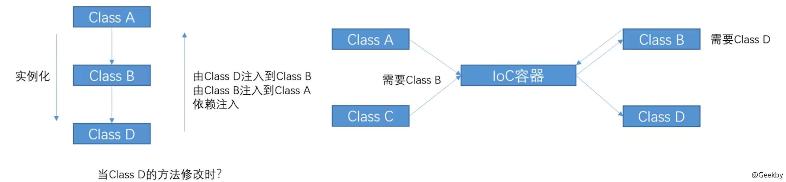

#### 2.3.3 Spring 核心概念 - Bean

Spring Bean 是一个被实例化，组装，并通过 Spring IoC 容器所管理的对象。

Spring Bean 是任何 Spring 应用程序的基本构建块。大多数应用程序的逻辑代码都将放在 Spring bean 中。

Spring Bean 的管理包括：

-   创建一个对象
-   提供依赖项（例如其他 bean，配置属性）。
-   拦截对象方法调用以提供额外的框架功能。
-   销毁一个对象

三种不同的方式定义 Spring bean：

-   使用构造型 `@Component` 注释（或其衍生物）注释类
-   编写在自定义 Java 配置类中使用 `@Bean` 注释的 Bean 工厂方法。
-   在 XML 配置文件中声明 Bean 定义

### 2.4 Hibernate

#### 2.4.1 定义

Hibernate 是由 Gavin King 于 2001 年创建的开放源代码的一种 ORM （Object\_Relative Mapping，即对象关系映射）框架，是 Java 对象和数据库服务器之间的桥梁，在 Java 对象与关系数据库之间建立某种映射，以实现直接存取 Java 对象，将开发人员从公共数据持续性编程工作中解放出来。

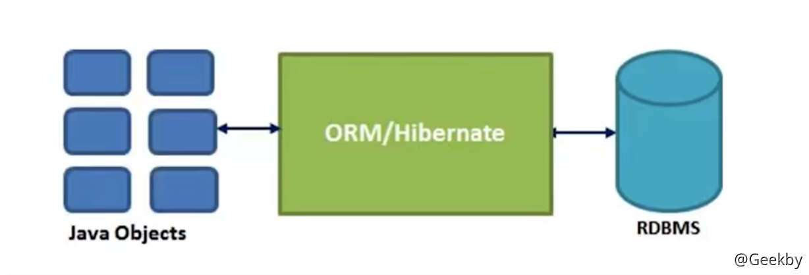

#### 2.4.2 ORM

ORM - 对象关系映射，ORM 关注的是对象与数据库中列的关系

## 3 SSM 框架

### 3.1 MVC

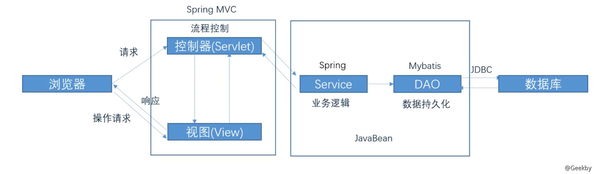

### 3.2 Spring MVC

Spring MVC 属于 Spring FrameWork 的后续产品，已经融合在 Spring Web Flow 里面。Spring 框架提供了构建 Web 应用程序的全功能 MVC 模块。使用 Spring 可插入的 MVC 架构，从而在使用 Spring 进行 WEB 开发时，可以选择使用 Spring 的 Spring MVC 框架或集成其他 MVC 开发框架，如 Struts1（现在一般不用），Struts2（一般老项目使用）等。

Spring MVC 已经成为目前最主流的 MVC 框架之一，从 Spring3.0 的发布，就已全面超越 Struts2，成为最优秀的 MVC 框架。它通过一套注解，让一个简单的 Java 类成为处理请求的控制器，而无须实现任何接口。同时它还支持 RESTful 编程风格的请求。

### 3.3 Spring MVC 执行流程

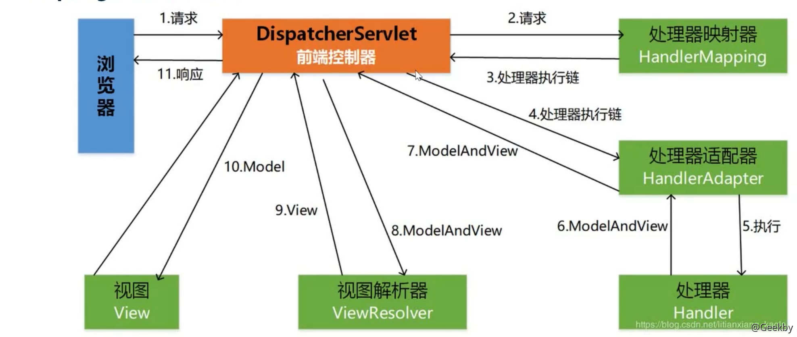

### 3.4 Spring MVC 与 Struts 2 的对比

#### 3.4.1 框架机制

Struts2 采用 Filter 实现，Spring MVC 则采用 Servlet 实现。

Filter 在容器启动之后即初始化；服务停止以后坠毁，晚于 Servlet。Servlet 在是在调用时初始化，先于 Filter 调用，服务停止后销毁。

Spring MVC 基于方法的拦截，有加载一次单例模式 bean 注入。而 struts2 是类级别的拦截，每次请求对应实例一个新的 Action，需要加载所有的属性值注入，所以，Spring MVC 开发效率和性能高于 Struts2。

Struts 2 更加符合 AOP 的编程思想，Spring MVC 比较谨慎，在 Servlet 上扩展。

#### 3.4.2 拦截机制

-   Struts2

Struts2 框架是类级别的拦截，每次请求就会创建一个Action，和 Spring 整合时 Struts2 的 Action Bean 注入作用域是原型模式 prototype，然后通过 setter，getter 把 request 数据注入到属性。

Struts2中，一个 Action 对应一个 request，response 上下文，在接收参数时，可以通过属性接收，这说明属性参数是让多个方法共享的。

Struts2 中 Action 的一个方法可以对应一个 url，而其类属性却被所有方法共享，这也就无法用注解或其他方式标识其所属方法了。

-   SpringMVC

Spring MVC 是方法级别的拦截，一个方法对应一个 Request 上下文，所以方法直接基本上是独立的，独享 request，response 数据。而每个方法同时又何一个 url 对应，参数的传递是直接注入到方法中的，是方法所独有的。处理结果通过 ModeMap 返回给框架。

在 Spring 整合时，Spring MVC 的 Controller Bean 默认单例模式 Singleton，所以默认对所有的请求，只会创建一个 Controller，有因为没有共享的属性，所以是线程安全的，如果要改变默认的作用域，需要添加 `@Scope` 注解修改。

### 3.5 Mybatis

MyBatis 是一个支持普通 SQL 查询、存储过程以及高级映射的持久层框架，它消除了几乎所有的 JDBC 代码和参数的手动设置以及对结果集的检索，并使用简单的 XML 或注解进行配置和原始映射，用以将接口和 Java 的 POJO （Plain Old Java Object，普通Java对象）映射成数据库中的记录，使得 Java 开发人员可以使用面向对象的编程思想来操作数据库。

## 4 Spring Boot & Spring Cloud

### 4.1 Spring Boot

#### 4.1.1 Spring Boot 定义

Spring Boot 是 Spring 开源组织下的一个子项目，也是 Spring 组件一站式解决方案，主要是为了简化使用 Spring 框架的难度，简省繁重的配置。

Spring Boot 提供了各种组件的启动器（starters），开发者只要能配置好对应组件参数，SpringBoot 就会自动配置，让开发者能快速搭建依赖于 Spring 组件的 Java 项目。

Spring Boot 不但能创建传统的 war 包应用，还能创建独立的不依赖于任何外部容器（如：tomcat）的独立应用，使用 java -jar 命令就能启动。同时，Spring Boot 地提供了一个命令行工具来执行 Spring 的脚本。

#### 4.1.2 Spring Boot 特点

-   独立运行：打包容器，生成 jar
-   简化 Maven 配置：spring-boot-starter-xx
-   自动配置：根据当前类路径下的类或者 jar 包里面来的类来自动配置 Spring Bean 。
-   无代码生成和 XML 配置：借助注解
-   应用监控：提供一系列端点可以监控服务及应用，能对 Spring 应用做健康检测。

### 4.2 Spring Cloud

#### 4.2.1 Spring Cloud 定义

Spring Cloud 是一系列框架的有序集合。它利用 Spring Boot 的开发便利性巧妙地简化了分布式系统基础设施的开发，如服务发现注册、配置中心、消息总线、负载均衡、断路器、数据监控等，都可以用 SpringBoot 的开发风格做到一键启动和部署。

Spring Cloud 并没有重复制造轮子，它只是将目前各家公司开发的比较成熟、经得起实际考验的服务框架组合起来，通过 Spring Boot 风格进行再封装屏蔽掉了复杂的配置和实现原理，最终给开发者留出了一套简单易懂、易部署和易维护的分布式系统开发工具包。

#### 4.2.2 Spring Cloud Alibaba 框架

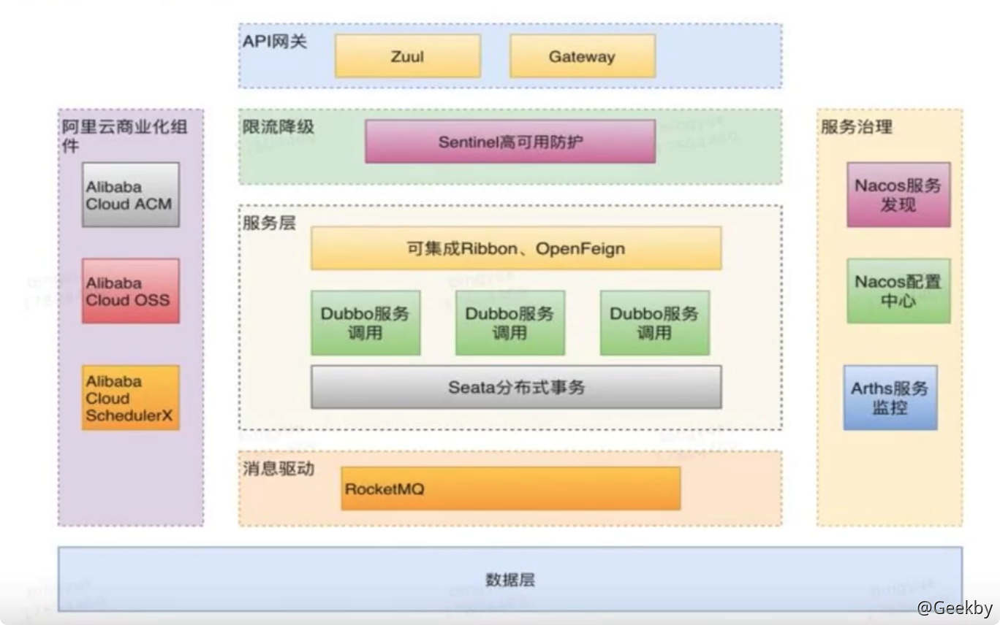
