# 【Java 代码审计入门-02】SQL 漏洞原理与实际案例介绍 - 先知社区

【Java 代码审计入门-02】SQL 漏洞原理与实际案例介绍

- - -

## 0x00 写在前面

为什么会有这一些列的文章呢？因为我发现网上没有成系列的文章或者教程，基本上是 Java 代码审计中某个点来阐述的，对于新人来说可能不是那么友好，加上本人也在学习 Java 审计，想做个学习历程的记录和总结，因此有了本系列的文章。  
本系列的文章面向人群主要是**拥有 Java 基本语法基础的朋友**，系列文章的内容主要包括，审计环境介绍、SQL 漏洞原理与实际案例介绍、XSS 漏洞原理与实际案例介绍、SSRF 漏洞原理与实际案例介绍、RCE 漏洞原理与实际案例介绍、包含漏洞原理与实际案例介绍、序列化漏洞原理与实际案例介绍、S2系列经典漏洞分析、WebLogic 系列经典漏洞分析、fastjson系列经典漏洞分析、jackson系列经典漏洞分析等，可能内容顺序会略有调整，但是总体内容不会改变，最后希望这系列的文章能够给你带来一点收获。

目前已完成内容如下：

【Java 代码审计入门-01】审计前的准备 [https://www.cnpanda.net/codeaudit/588.html](https://www.cnpanda.net/codeaudit/588.html)

## 0x01 前戏

首先创建一个数据库`sec_sql`

```plain
create database sec_sql charset utf8;
```

然后创建表`admin`、`userinfo`和插入数据：

```plain
DROP TABLE IF EXISTS `admin`;
CREATE TABLE `admin` (
  `uid` int(11) NOT NULL AUTO_INCREMENT COMMENT 'uid',
  `username` varchar(100) NOT NULL COMMENT '账号',
  `password` varchar(100) NOT NULL COMMENT '密码',
  PRIMARY KEY (`uid`)
) ENGINE=InnoDB AUTO_INCREMENT=2 DEFAULT CHARSET=utf8;

BEGIN;
INSERT INTO `admin` VALUES (1, 'admin', '7a57a5a743894a0e');
COMMIT;

DROP TABLE IF EXISTS `userinfo`;
CREATE TABLE `userinfo` (
  `id` int(11) NOT NULL AUTO_INCREMENT COMMENT 'id',
  `name` varchar(100) NOT NULL COMMENT '名称',
  `age` int(11) NOT NULL COMMENT '年龄',
  `content` varchar(100) NOT NULL COMMENT '联系方式',
  `address` varchar(255) NOT NULL COMMENT '家庭地址',
  PRIMARY KEY (`id`)
) ENGINE=InnoDB AUTO_INCREMENT=7 DEFAULT CHARSET=utf8;

BEGIN;
INSERT INTO `userinfo` VALUES (1, 'panda', 22, 'panda@cnpanda.net', '中国');
INSERT INTO `userinfo` VALUES (2, 'John', 29, 'test@cnpanda.net', '英国');
INSERT INTO `userinfo` VALUES (3, 'Tom', 45, 'hello@cnpanda.net', '美国');
INSERT INTO `userinfo` VALUES (4, 'Mr.Li', 33, 'li@cnpanda.net', '韩国');
INSERT INTO `userinfo` VALUES (5, 'Miss', 32, 'miss@cnpanda.net', '法国');
INSERT INTO `userinfo` VALUES (6, 'Ling', 17, 'ling@cnpanda.net', '中国');
COMMIT;

SET FOREIGN_KEY_CHECKS = 1;
```

下载 sql 测试源码

[https://github.com/cn-panda/JavaCodeAudit](https://github.com/cn-panda/JavaCodeAudit)

导入项目，可以得到以下目录

[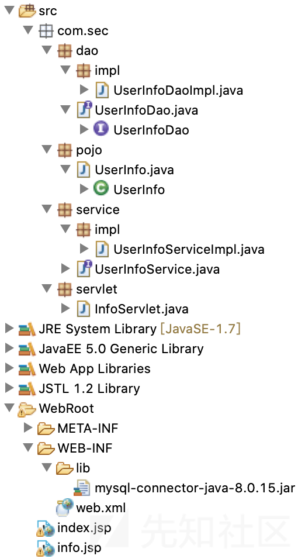](https://xzfile.aliyuncs.com/media/upload/picture/20191129155755-f3994c1e-127d-1.png)

修改连接数据库的账号密码：

[](https://xzfile.aliyuncs.com/media/upload/picture/20191129155822-03b01812-127e-1.png)

[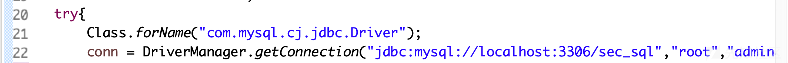](https://xzfile.aliyuncs.com/media/upload/picture/20191129155839-0da9d7ea-127e-1.png)

项目是一个简单的查询用户信息的实现，在 servlet 层接受到请求后，调`UserInfoServiceImpl`，`UserInfoServiceImpl`在调用`UserInfoDaoImpl`，`UserInfoDaoImpl`去操作数据库，然后封装 `UserInfo` 对象，再把`UserInfo` 对象返回给`UserInfoService`，最后 service 层再返回给 servlet 层，最终把查询的内容显示到`info.jsp`页面。

## 0x02 漏洞原理

所谓 SQL 注入，就是通过将 SQL 命令插入应用程序的 http 请求中，并在服务器端被接收后用于参与数据库操作，最终达到欺骗服务器执行恶意的 SQL 命令的效果，Java 的 SQL 注入和 PHP 中的 SQL 注入，其实差别不大，理论上来讲，应用程序中只要是与数据库存在数据交互，无论是增删改查，只要传入的数据完全受用户控制，且应用程序对用户传入的数据没有进行妥当的处理，那么这些地方都是可能存在 SQL 注入的。

拿上述的代码举例，在`UserInfoDaoImpl.java`中，存在如下代码：

```plain
public UserInfo UserInfoFoundDao(String id){

            Connection conn = null;
            PreparedStatement ps = null;
            ResultSet rs = null;
            UserInfo userinfo = null;
            try{
                Class.forName("com.mysql.cj.jdbc.Driver");
                conn = DriverManager.getConnection("jdbc:mysql://localhost:3306/sec_sql","root","admin888");
                String sql = "select * from userinfo where id = " + id;
                ps = conn.prepareStatement(sql);

                //ps.setInt(1,id);

                rs = ps.executeQuery();

                while(rs.next()){

                    userinfo = new UserInfo();
                    userinfo.setId(rs.getString("id"));
                    userinfo.setName(rs.getString("name"));
                    userinfo.setAge(rs.getInt("age"));
                    userinfo.setContent(rs.getString("content"));
                    userinfo.setAddress(rs.getString("address"));

                }

                ...

            return userinfo;
        }
```

可以看到在 sql 语句中，存在着拼接的String类型变量`id`，且没有进行任何的过滤处理，直接带入执行。这也就导致了 SQL 注入，如下图，带入参数`and 1=1`：

[](https://xzfile.aliyuncs.com/media/upload/picture/20191129155859-1a033cd4-127e-1.png)

监视 MySQL 的执行记录，如下图所示：

[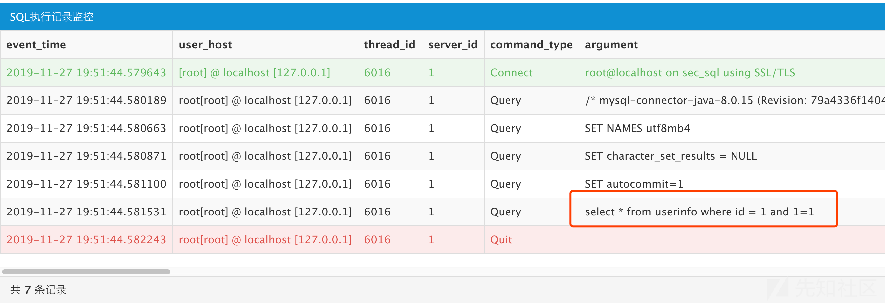](https://xzfile.aliyuncs.com/media/upload/picture/20191129155915-236cdca8-127e-1.png)

完整的把我们带入的参数给传了进去。

执行下述 payload 即可获取管理员的账号密码：

```plain
id=2 union select 1,2,3,group_concat(username),group_concat(password) from admin--
```

[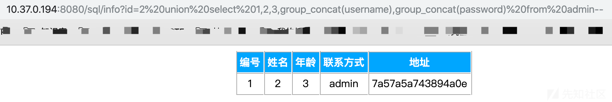](https://xzfile.aliyuncs.com/media/upload/picture/20191129155929-2bcb5c62-127e-1.png)

MySQL 执行记录如下：

[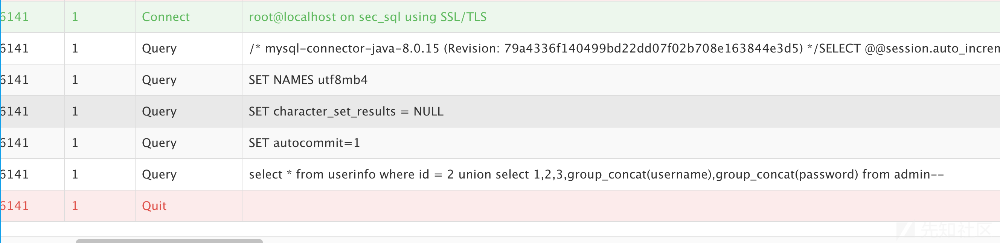](https://xzfile.aliyuncs.com/media/upload/picture/20191129155940-31f76630-127e-1.png)

## 0x03 修复方案

上述代码之所以造成 SQL 漏洞的原因，是程序将用户输入数据拼接到了 SQL 语句中，了解到这，所以修复方案也很清楚了。

### 1、使用预编译

在Java的JDBC中，有个预处理功能，这个功能一大优势就是能提高执行速度，尤其是多次操作数据库的情况，再一个优势就是预防SQL注入，严格的说，应该是预防绝大多数的SQL注入。下方代码就是利用 java 的预编译来防止 SQL 注入：

```plain
public UserInfo UserInfoFoundDao(String id){

            Connection conn = null;
            PreparedStatement ps = null;
            ResultSet rs = null;
            UserInfo userinfo = null;
            try{
                Class.forName("com.mysql.cj.jdbc.Driver");
                conn = DriverManager.getConnection("jdbc:mysql://localhost:3306/sec_sql","root","admin888");
                String sql = "select * from userinfo where id = ？";
                ps = conn.prepareStatement(sql);

        ps.setInt(1,id);

                rs = ps.executeQuery();

                while(rs.next()){

                    userinfo = new UserInfo();
                    userinfo.setId(rs.getString("id"));
                    userinfo.setName(rs.getString("name"));
                    userinfo.setAge(rs.getInt("age"));
                    userinfo.setContent(rs.getString("content"));
                    userinfo.setAddress(rs.getString("address"));

                }

                ...


            return userinfo;
        }
```

需要注意的是，预编译不是绝对安全的，是要看所使用的具体的 SQL 语句的，例如下述代码：

```plain
public UserInfo UserInfoFoundDao(String id, String age){

            Connection conn = null;
            PreparedStatement ps = null;
            ResultSet rs = null;
            UserInfo userinfo = null;
            try{
                Class.forName("com.mysql.cj.jdbc.Driver");
                conn = DriverManager.getConnection("jdbc:mysql://localhost:3306/sec_sql","root","admin888");
                String sql = "select * from userinfo where id = ？"+"order by ''" + age + "' asc'" ;
                ps = conn.prepareStatement(sql);

        ps.setInt(1,id);

                rs = ps.executeQuery();

                while(rs.next()){

                    userinfo = new UserInfo();
                    userinfo.setId(rs.getString("id"));
                    userinfo.setName(rs.getString("name"));
                    userinfo.setAge(rs.getInt("age"));
                    userinfo.setContent(rs.getString("content"));
                    userinfo.setAddress(rs.getString("address"));

                }

                ...


            return userinfo;
        }
```

类似于上面代码中的 SQL 语句，order by 后面的语句，是不能够用预编译进行处理的，只能通过拼接进行操作，因此需要手动过滤。

### 2、修改数据类型

上述代码中，变量 id的数据类型是 string 型，而其实对于这个用户信息查询的功能来说，只需要一个整数型的数字即可，因此可以修改变量 id 的数据类型，来达到修复的目的：

```plain
public UserInfo UserInfoFoundDao(int id){

            Connection conn = null;
            PreparedStatement ps = null;
            ResultSet rs = null;
            UserInfo userinfo = null;
            try{
                Class.forName("com.mysql.cj.jdbc.Driver");
                conn = DriverManager.getConnection("jdbc:mysql://localhost:3306/sec_sql","root","admin888");
                String sql = "select * from userinfo where id = " + id;
                ps = conn.prepareStatement(sql);

                rs = ps.executeQuery();

                while(rs.next()){

                    userinfo = new UserInfo();
                    userinfo.setId(rs.getString("id"));
                    userinfo.setName(rs.getString("name"));
                    userinfo.setAge(rs.getInt("age"));
                    userinfo.setContent(rs.getString("content"));
                    userinfo.setAddress(rs.getString("address"));

                }


            ...

            return userinfo;
        }
```

当然，这种方法只限定于特定情况下，如果有的参数其数据类型必须为 String 那么这种方法是行不通的。

以上，只是基于 java servlet上来解释 SQL 注入，但实际上在真实环境中，中间件框架使用占了绝大部分，但实际上原理基本类似，只是表面形式不同，如 Mybatis 框架中的 like、 in和 order by 语句、Hibernate 框架中的 createQuery()函数等，如果使用不当，依旧可能造成 sql 注入。

## 0x04 实际案例(CVE-2019-9615)分析

### 1、案例介绍

CVE 地址：[https://cve.mitre.org/cgi-bin/cvename.cgi?name=CVE-2019-9615](https://cve.mitre.org/cgi-bin/cvename.cgi?name=CVE-2019-9615)

OFCMS是基于Java技术的内容管理系统，在v1.1.3之前的OFCMS中发现了一个问题，在`admin / system / generate / create?sql =`路径可以进行SQL注入，与`SystemGenerateController.java`文件相关。

### 2、案例搭建

首先可以去官网下载 v1.1.2版本的 OFCMS：

[https://gitee.com/oufu/ofcms/releases](https://gitee.com/oufu/ofcms/releases)

然后打开 idea，点击`import Project`，选择`Import project from external model`中的 Maven

[](https://xzfile.aliyuncs.com/media/upload/picture/20191129160019-49ab417a-127e-1.png)

然后一路默认

[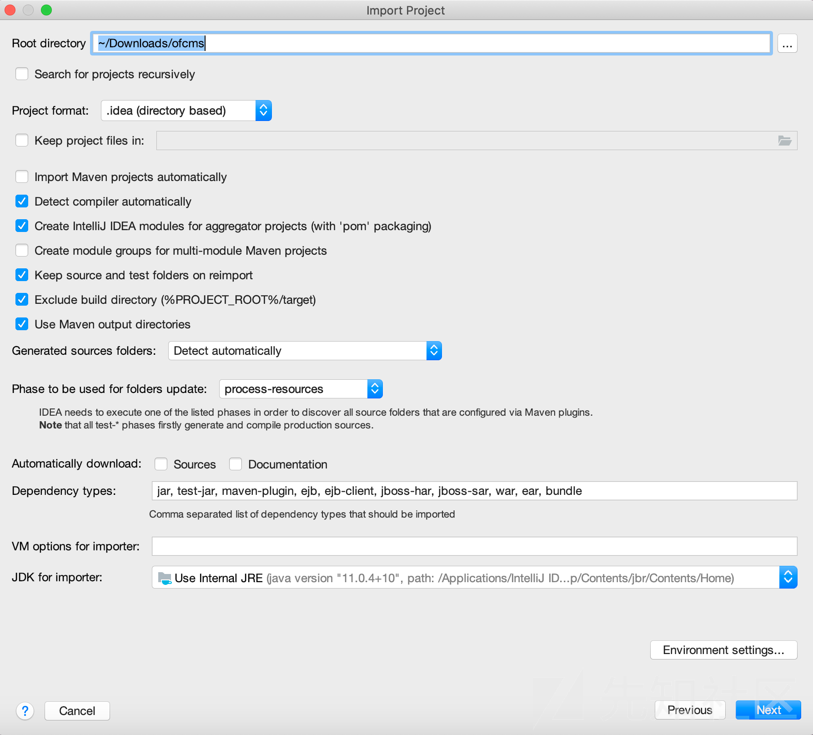](https://xzfile.aliyuncs.com/media/upload/picture/20191129160034-5265397e-127e-1.png)

[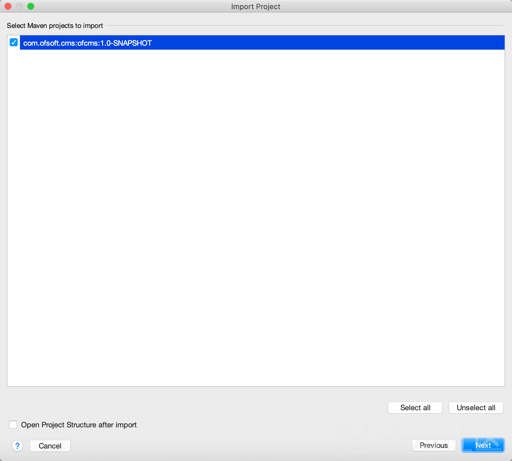](https://xzfile.aliyuncs.com/media/upload/picture/20191129160045-58d444bc-127e-1.png)

[](https://xzfile.aliyuncs.com/media/upload/picture/20191129160100-61cc6400-127e-1.png)

[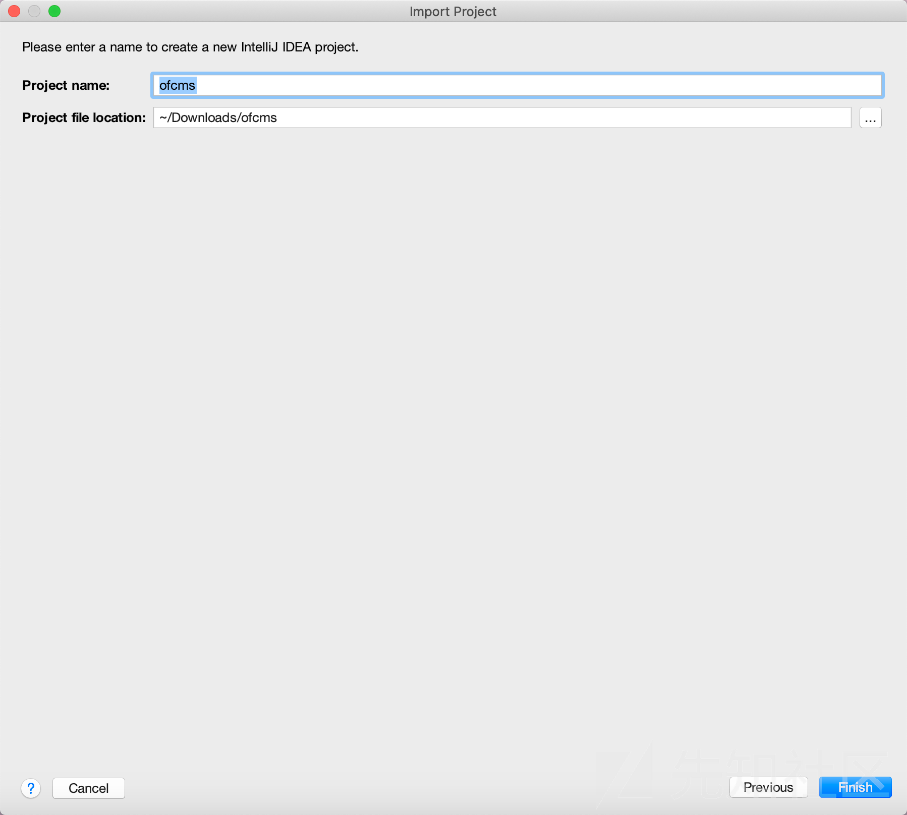](https://xzfile.aliyuncs.com/media/upload/picture/20191129160110-67a1ff16-127e-1.png)

然后在`ofcms-admin/src/main/resources/dev/conf/`文件夹下打开`db.properties`，修改数据的账号密码

[](https://xzfile.aliyuncs.com/media/upload/picture/20191129160133-7553e188-127e-1.png)

然后修改根目录下的 `pom.xml`，搜索 `mysql`，然后修改成自己机器上的装的版本，最后点击`import changes`

[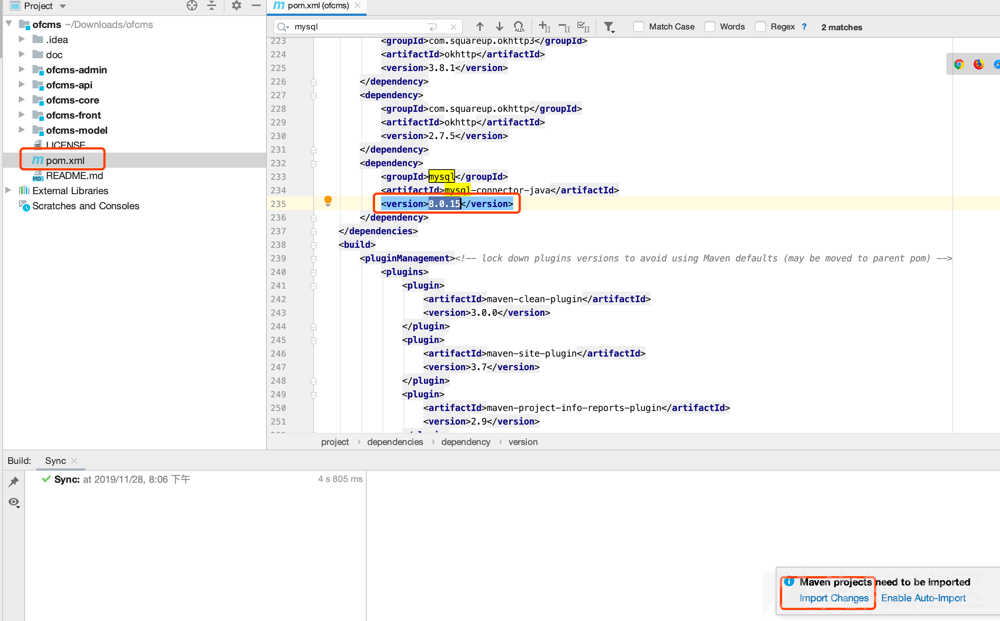](https://xzfile.aliyuncs.com/media/upload/picture/20191129160152-80cce672-127e-1.png)

然后下载需要的 jar 包资源：

[](https://xzfile.aliyuncs.com/media/upload/picture/20191129160211-8c6ff2d0-127e-1.png)

配置Tomcat 服务，点击 run-->edit configurations

[](https://xzfile.aliyuncs.com/media/upload/picture/20191129160233-992efbba-127e-1.png)

[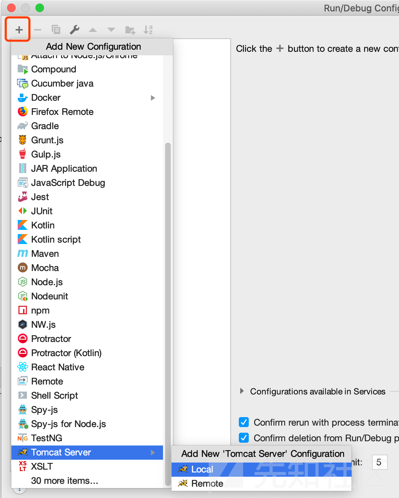](https://xzfile.aliyuncs.com/media/upload/picture/20191129160244-a00f1d0c-127e-1.png)

然后选择 Tomcat 的安装目录：

[](https://xzfile.aliyuncs.com/media/upload/picture/20191129160257-a7a16f02-127e-1.png)

端口按照本地情况修改：

[](https://xzfile.aliyuncs.com/media/upload/picture/20191129160309-ae7cac56-127e-1.png)

然后配置 Deployment

[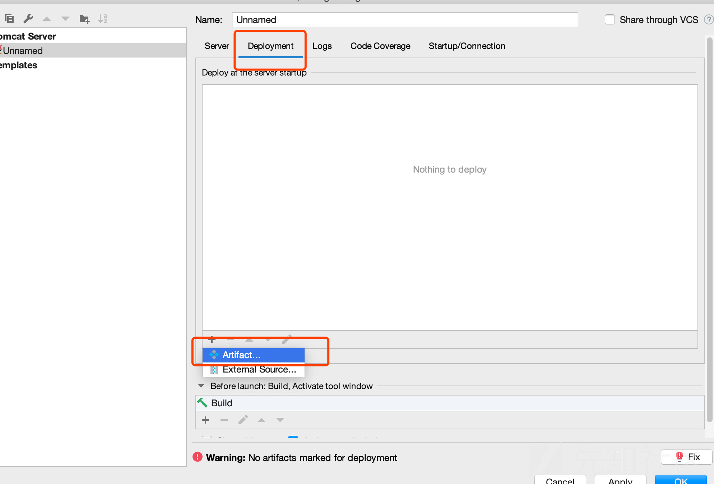](https://xzfile.aliyuncs.com/media/upload/picture/20191129160319-b4ee3a14-127e-1.png)

选择 ofcms-admin:war

[](https://xzfile.aliyuncs.com/media/upload/picture/20191129160333-bd4b8838-127e-1.png)

修改名字为`/ofcms-admin`

[](https://xzfile.aliyuncs.com/media/upload/picture/20191129160350-c76b9614-127e-1.png)

最后打开 MySQL，创建一个名为 ofcms 的数据库，导入`fcms/doc/sql`下的 sql 文件即可。

然后启动项目

[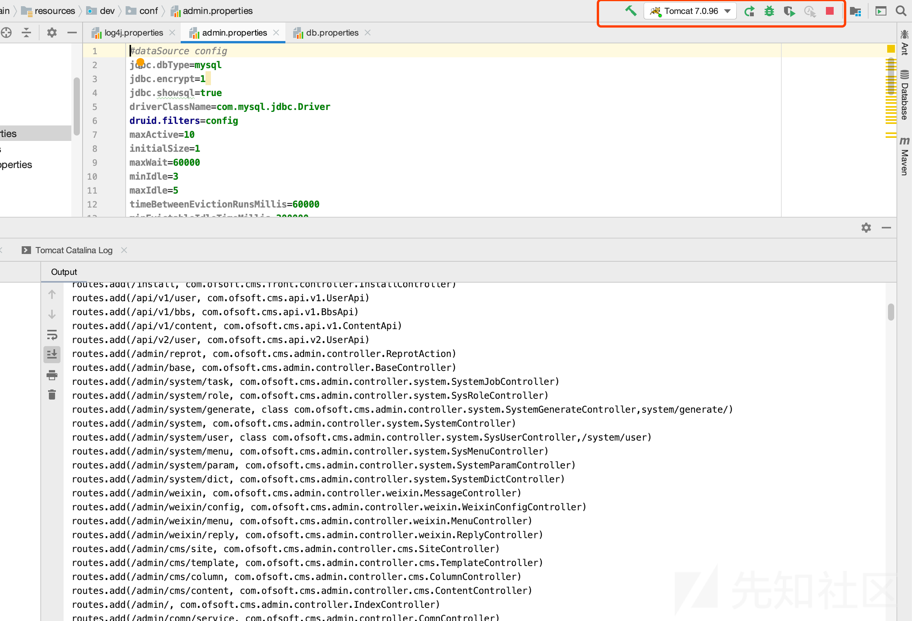](https://xzfile.aliyuncs.com/media/upload/picture/20191129160407-d1193fa4-127e-1.png)

即可访问该项目：

[](https://xzfile.aliyuncs.com/media/upload/picture/20191129160435-e1cedf48-127e-1.png)

站点地址：[http://localhost:8080/ofcms-admin/](http://localhost:8080/ofcms-admin/)

后台地址： [http://localhost:8080/ofcms-admin/admin/login.html](http://localhost:8080/ofcms-admin/admin/login.html)

用户名：admin

密码：123456

### 3、案例漏洞分析

漏洞存在的文件的位置为：

`ofcms-admin/src/main/java/com/ofsoft/cms/admin/controller/system/SystemGenerateController.java`

```plain
public void create() {
        try {
            String sql = getPara("sql");
            Db.update(sql);
            rendSuccessJson();
        } catch (Exception e) {
            e.printStackTrace();
            rendFailedJson(ErrorCode.get("9999"), e.getMessage());
        }
    }
```

使用 getPara 获取`sql`参数，然后update方法直接执行sql 语句，返回 json 格式的数据

很明显，这里对于传入的参数没有任何的处理就直接带入执行语句中，造成了 SQL 注入。

在后台中找到该段代码对应的功能：

[](https://xzfile.aliyuncs.com/media/upload/picture/20191129160457-eeff6458-127e-1.png)

抓包传入一句测试的语句：

```plain
update of_cms_link set link_name='panda' where link_id = 4
```

[](https://xzfile.aliyuncs.com/media/upload/picture/20191129160513-f896ac06-127e-1.png)

查看 SQL 执行记录：

[](https://xzfile.aliyuncs.com/media/upload/picture/20191129160531-03343994-127f-1.png)

完完全全的可以控制 update 型的 SQL 注入语句，因此可以利用以下语句进行注入：

```plain
update of_cms_link set link_name=updatexml(1,concat(0x7e,(user())),0) where link_id = 4
```

[](https://xzfile.aliyuncs.com/media/upload/picture/20191129160545-0b97d06e-127f-1.png)

### 4、修复方案

官网虽然更新版本到了 v1.1.4 ，但是没有对这些漏洞进行修复（可能是因为后台注入，比较鸡肋），这里我仅给出我个人的修复意见。

1、由于本注入是在后台产生的，因此危害性相比前台来说，很小，可以考虑限制后台使用人员对此功能使用的权限，加强管理员密码的管理。这种方法指标不治本，估计这也是官方的想法。

2、由于该注入是由后台中创建表而产生的，因此无法单纯的过滤一些关键字，否则可能导致业务出现问题，可以考虑改写业务功能，如：写死参数、取消直接对数据库进行操作的一些功能等。这种方法要求业务层上做出改变，在实际中不太现实。

3、过滤一些与 update 型注入相关的关键字，如`updatexml`、`extractvalue`、`name_const`、`floor`等。这种方法是黑名单的方式，还是存在缺陷的（万一有新姿势呢？）

4、设置 sql 语句操作白名单，即所用的关键词只能包含限定关键字，如 `update`、`set`等。这种方式可能更安全点，但是也有可能会限制业务功能。

## 0x05 总结

本文主要讨论了 Java 中的 SQL 注入漏洞，包括其原理、简单的 java代码示例以及 CVE 实例。希望对初入 java 代码审计的朋友有所帮助。  
本文的所有代码可以在 GitHub 上下载：  
[https://github.com/cn-panda/JavaCodeAudit](https://github.com/cn-panda/JavaCodeAudit)

## 0x06 参考

[https://gitee.com/oufu/ofcms](https://gitee.com/oufu/ofcms)

[https://cve.mitre.org/cgi-bin/cvename.cgi?name=CVE-2019-9615](https://cve.mitre.org/cgi-bin/cvename.cgi?name=CVE-2019-9615)

[https://blog.csdn.net/oufua/article/details/82584637](https://blog.csdn.net/oufua/article/details/82584637)

[https://github.com/cw1997/MySQL-Monitor](https://github.com/cw1997/MySQL-Monitor)
