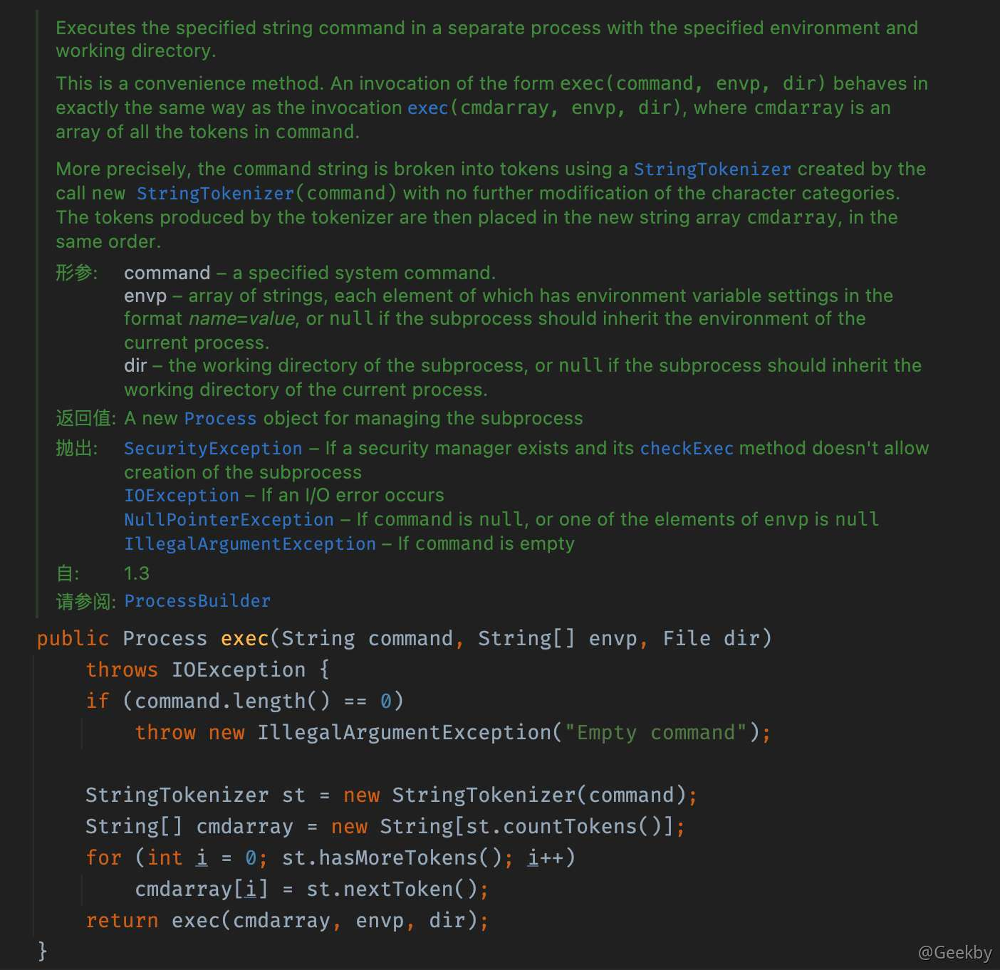
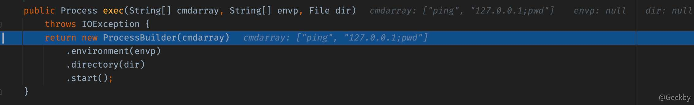
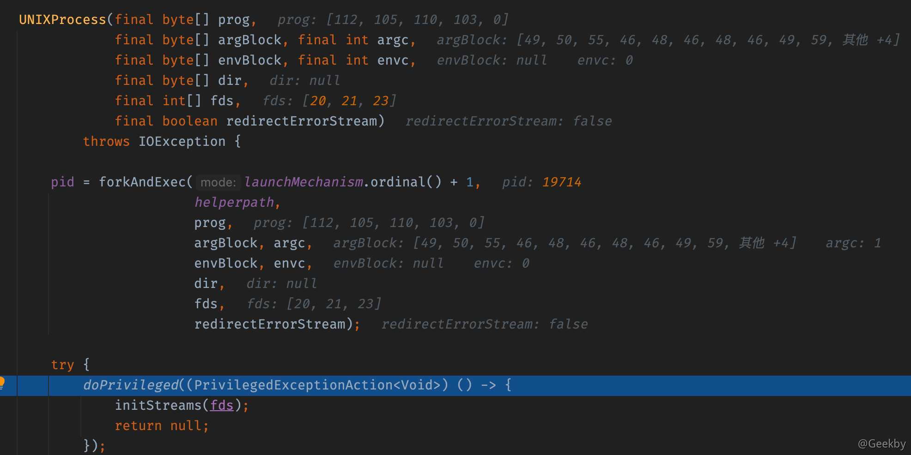
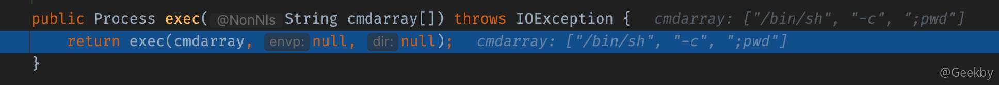
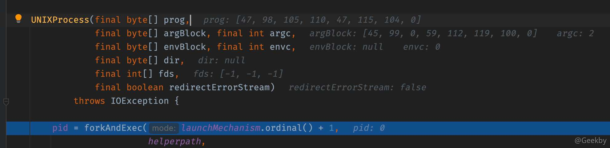
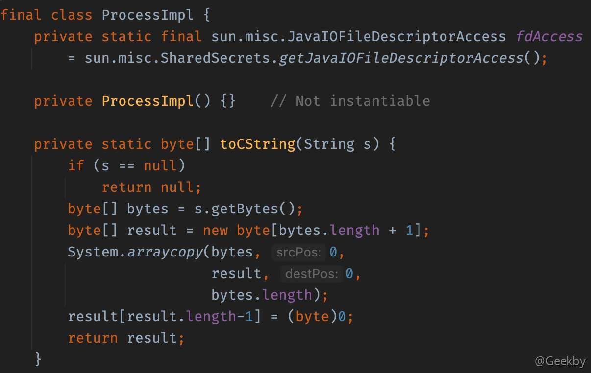

# [](#java-%E6%9C%AC%E5%9C%B0%E5%91%BD%E4%BB%A4%E6%89%A7%E8%A1%8C%E6%BC%8F%E6%B4%9E)Java 本地命令执行漏洞

## [](#%E8%83%8C%E6%99%AF)背景

JDK 原生提供了本地系统命令执行的函数，攻击者可以通过该漏洞在目标服务器中执行任意系统命令。在 Java 中可用于执行系统命令的方式有 API 有：

-   `java.lang.Runtime`
-   `java.lang.ProcessBuilder`
-   `java.lang.UNIXProcess`/`ProcessImpl`。

## [](#runtime-%E5%91%BD%E4%BB%A4%E6%89%A7%E8%A1%8C)Runtime 命令执行

### [](#execstring-command)exec(String command)

在 Java 中通常会使用 `java.lang.Runtime` 类的 `exec` 方法来执行本地系统命令。

以如下程序执行命令为例：

|     |     |     |
| --- | --- | --- |
| ```plain<br> 1<br> 2<br> 3<br> 4<br> 5<br> 6<br> 7<br> 8<br> 9<br>10<br>11<br>12<br>13<br>14<br>15<br>16<br>17<br>18<br>19<br>20<br>``` | ```java<br>package com.geekby;<br><br>import java.io.BufferedReader;<br>import java.io.IOException;<br>import java.io.InputStream;<br>import java.io.InputStreamReader;<br><br>public class Main {<br><br>    public static void main(String[] args) throws IOException {<br>        String cmd = "";<br>        Process p = Runtime.getRuntime().exec("ping 127.0.0.1" + cmd);<br>        InputStream fis = p.getInputStream();<br>        BufferedReader br = new BufferedReader(new InputStreamReader(fis));<br>        String line = null;<br>        while ((line = br.readLine()) != null) {<br>            System.out.println(line);<br>        }<br>    }<br>}<br>``` |

上面的程序可以成功执行 ping 命令。假设现在攻击者可以控制 cmd 参数，通过命令拼接，去执行其它命令。以 `cmd = ";pwd"` 为例，可以发现，命令无法执行，甚至连 ping 命令都无法将结果回显。


为了探究命令执行失败的原因，首先跟踪程序调用栈：

|     |     |     |
| --- | --- | --- |
| ```plain<br>1<br>2<br>3<br>4<br>5<br>6<br>7<br>8<br>``` | ```fallback<br>create:-1, ProcessImpl (java.lang)<br><init>:386, ProcessImpl (java.lang)<br>start:137, ProcessImpl (java.lang)<br>start:1029, ProcessBuilder (java.lang)<br>exec:620, Runtime (java.lang)<br>exec:450, Runtime (java.lang)<br>exec:347, Runtime (java.lang)<br>main:8, Main (com.geekby)<br>``` |

通过跟进调用链可以发现，exec 方法最终调用到了一个重载函数 `exec(String command, String[] envp, File dir)` 中：



命令以字符串出入到该函数后，首先通过 `StringTokenizer` 对其进行了处理，根据 `\t\n\r\f` 把传入的 command 分割：


经过处理之后，最后实例化了 ProcessBuilder 来处理传入的 cmdarray。在此处也可以发现，`Runtime.getRuntime.exec()` 的底层实际上也是 ProcessBuilder。



继续跟进 ProcessBuilder 类中的 start 方法，在 该方法中将 cmdarry 第一个参数 `cmdarry[0]` 当作要执行的命令，把后面的 `cmdarry[1:]` 作为命令执行的参数转换成 byte 数组 argBlock。



此时 prog 是要执行的命令 `ping`, argBlock 都是传给 ping 的参数 `127.0.0.1;pwd`，经过 StringTokenizer 对字符串的处理，改变了命令执行的语义，无法将分号作为命令分隔符，进而实现命令注入。

### [](#execstring-cmdarray)exec(String cmdarray\[\])

Java Runtime 包中存在 exec 函数的重载函数，其参数类型为字符串数组。

|     |     |     |
| --- | --- | --- |
| ```plain<br> 1<br> 2<br> 3<br> 4<br> 5<br> 6<br> 7<br> 8<br> 9<br>10<br>11<br>12<br>13<br>14<br>15<br>16<br>17<br>18<br>19<br>20<br>``` | ```java<br>package com.geekby;<br><br>import java.io.BufferedReader;<br>import java.io.IOException;<br>import java.io.InputStream;<br>import java.io.InputStreamReader;<br><br>public class Main {<br><br>    public static void main(String[] args) throws IOException {<br>        String cmd = ";pwd";<br>        Process p = Runtime.getRuntime().exec(new String[]{"/bin/sh", "-c", cmd});<br>        InputStream fis = p.getInputStream();<br>        BufferedReader br = new BufferedReader(new InputStreamReader(fis));<br>        String line = null;<br>        while ((line = br.readLine()) != null) {<br>            System.out.println(line);<br>        }<br>    }<br>}<br>``` |

跟进 exec 函数的底层代码，因为直接传入的是数组，所以没有经过 StringTokenizer 对字符串的处理



最终跟进到 `UNIXProcess` 方法



此时 prog 是要执行的命令 `/bin/sh` , argBlock 都是传给 ping 的参数 `-c\x00"ping 127.0.0.1;pwd"`

因此，在参数可控的情况下，不能采用命令分割的形式进行命令注入。根据具体情况，可以采取 [base64 编码](https://www.jackson-t.ca/runtime-exec-payloads.html)的形式。

### [](#load)load()

在 Java Runtime 包中，还有另一种加载外部库的形式去命令执行。通过加载动态链接库，如 linux 下的 so 文件，windows 下的 dll 文件。

|     |     |     |
| --- | --- | --- |
| ```plain<br>1<br>``` | ```bash<br>msfvenom -p windows/x64/exec --platform win -a x64 CMD=calc.exe EXITFUNC=thread -f dll> calc.dll<br>``` |

测试代码：

|     |     |     |
| --- | --- | --- |
| ```plain<br>1<br>2<br>3<br>4<br>5<br>6<br>``` | ```java<br>public class RCE {<br>    public static void main(String[] args) {<br>        Runtime rt = Runtime.getRuntime();<br>        rt.load("D:\\calc.dll");<br>    }<br>}<br>``` |

## [](#processbuilder)ProcessBuilder

使用 ProcessBuilder 类创建一个进程，创建 ProcessBuilder 实例，指定该进程的名称和所需参数

|     |     |     |
| --- | --- | --- |
| ```plain<br> 1<br> 2<br> 3<br> 4<br> 5<br> 6<br> 7<br> 8<br> 9<br>10<br>11<br>12<br>13<br>14<br>15<br>16<br>17<br>18<br>``` | ```java<br>package com.geekby;<br><br>import java.io.IOException;<br><br>public class Main {<br><br>    public static void main(String[] args) throws IOException {<br>        String cmd = ";pwd";<br>        ProcessBuilder pb = new ProcessBuilder("ping", "127.0.0.1", cmd);<br>        Process process = pb.start();<br>        InputStream fis = process.getInputStream();<br>        BufferedReader br = new BufferedReader(new InputStreamReader(fis));<br>        String line = null;<br>        while ((line = br.readLine()) != null) {<br>            System.out.println(line);<br>        }<br>    }<br>}<br>``` |

调用栈：

|     |     |     |
| --- | --- | --- |
| ```plain<br>1<br>2<br>3<br>4<br>5<br>``` | ```fallback<br>create:-1, ProcessImpl (java.lang)<br><init>:386, ProcessImpl (java.lang)<br>start:137, ProcessImpl (java.lang)<br>start:1029, ProcessBuilder (java.lang)<br>main:8, Main (com.geekby)<br>``` |

通过分析调用栈可以发现，ProcessBuilder 在底层调用的逻辑与 Runtime.getRuntime.exec 逻辑相似，在此不做赘述。

## [](#processimpl)ProcessImpl

由于 ProcessImpl 的构造函数是 private 属性的，因此，需要用反射的方式调用其静态方法 start。



|     |     |     |
| --- | --- | --- |
| ```plain<br> 1<br> 2<br> 3<br> 4<br> 5<br> 6<br> 7<br> 8<br> 9<br>10<br>11<br>12<br>13<br>14<br>15<br>16<br>17<br>``` | ```java<br>package com.geekby;<br><br>import java.io.IOException;<br>import java.lang.reflect.InvocationTargetException;<br>import java.lang.reflect.Method;<br>import java.util.Map;<br><br>public class Main {<br><br>    public static void main(String[] args) throws IOException, ClassNotFoundException, InvocationTargetException, IllegalAccessException, NoSuchMethodException {<br>        Class clazz = Class.forName("java.lang.ProcessImpl");<br>        Method start = clazz.getDeclaredMethod("start", String[].class, Map.class, String.class, ProcessBuilder.Redirect[].class, boolean.class);<br>        start.setAccessible(true);<br>        start.invoke(null, (Object) new String[]{"open", "-a", "Calculator"}, null, null, null, false);<br>    }<br>}<br>``` |

调用栈：

|     |     |     |
| --- | --- | --- |
| ```plain<br>1<br>2<br>3<br>4<br>5<br>6<br>7<br>8<br>``` | ```fallback<br>create:-1, ProcessImpl (java.lang)<br><init>:386, ProcessImpl (java.lang)<br>start:137, ProcessImpl (java.lang)<br>invoke0:-1, NativeMethodAccessorImpl (sun.reflect)<br>invoke:62, NativeMethodAccessorImpl (sun.reflect)<br>invoke:43, DelegatingMethodAccessorImpl (sun.reflect)<br>invoke:498, Method (java.lang.reflect)<br>main:14, main (com.geekby)<br>``` |

## [](#%E9%98%B2%E5%BE%A1)防御

本地命令执行是一种非常高风险的漏洞，在任何时候都应当非常谨慎的使用，在业务中如果使用到了本地系统命令那么应当禁止接收用户传入参数。在很多时候攻击者会利用某些漏洞（如：Struts2、反序列化等）来攻击我们的业务系统，最终利用 Java 本地命令执行达到控制 Web 服务器的目的。这种情况下用户执行的系统命令对我们来说就不再受控制了，我们除了可以配置`SecurityManager`规则限制命令执行以外，还可以使用 RASP 来防御本地命令执行就显得更加的便捷可靠。

### [](#rasp-%E9%98%B2%E5%BE%A1-java-%E6%9C%AC%E5%9C%B0%E5%91%BD%E4%BB%A4%E6%89%A7%E8%A1%8C)RASP 防御 Java 本地命令执行

在 Java 底层执行系统命令的 API 是 `java.lang.UNIXProcess/ProcessImpl#forkAndExec` 方法，`forkAndExec` 是一个 native 方法，如果想要 Hook 该方法需要使用 Agent 机制中的 `Can-Set-Native-Method-Prefix`，为 `forkAndExec` 设置一个别名，如：`__RASP__forkAndExec`，然后重写`__RASP__forkAndExec` 方法逻辑，即可实现对原 `forkAndExec` 方法 Hook。

|     |     |     |
| --- | --- | --- |
| ```plain<br> 1<br> 2<br> 3<br> 4<br> 5<br> 6<br> 7<br> 8<br> 9<br>10<br>11<br>12<br>13<br>14<br>15<br>16<br>17<br>18<br>19<br>20<br>21<br>22<br>23<br>24<br>25<br>26<br>27<br>28<br>29<br>30<br>31<br>``` | ```java<br>/**<br> * Hook Windows系统 ProcessImpl 类构造方法<br> */<br>@RASPMethodHook(<br>      className = "java.lang.ProcessImpl", methodName = CONSTRUCTOR_INIT,<br>      methodArgsDesc = ".*", methodDescRegexp = true<br>)<br>public static class ProcessImplHook extends RASPMethodAdvice {<br><br>   @Override<br>   public RASPHookResult<?> onMethodEnter() {<br>      try {<br>         String[] commands = null;<br><br>         // JDK9+的API参数不一样！<br>         if (getArg(0) instanceof String[]) {<br>            commands = getArg(0);<br>         } else if (getArg(0) instanceof byte[]) {<br>            commands = new String[]{new String((byte[]) getArg(0))};<br>         }<br><br>         // 检测执行的命令合法性<br>         return LocalCommandHookHandler.processCommand(commands, getThisObject(), this);<br>      } catch (Exception e) {<br>         RASPLogger.log(AGENT_NAME + "处理ProcessImpl异常:" + e, e);<br>      }<br><br>      return new RASPHookResult<?>(RETURN);<br>   }<br><br>}<br>``` |
