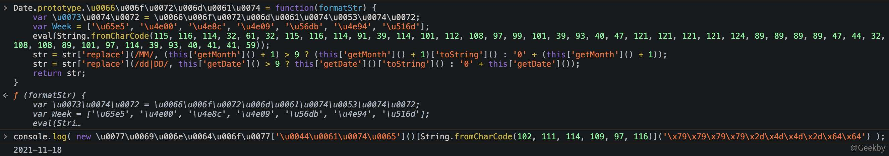

# [](#javascript-%E5%8F%8D%E6%B7%B7%E6%B7%86)JavaScript 反混淆

## [](#1-%E5%B8%B8%E9%87%8F%E7%9A%84%E6%B7%B7%E6%B7%86%E5%8E%9F%E7%90%86)1 常量的混淆原理

### [](#11-%E5%AF%B9%E8%B1%A1%E5%B1%9E%E6%80%A7%E7%9A%84%E4%B8%A4%E7%A7%8D%E8%AE%BF%E9%97%AE%E6%96%B9%E5%BC%8F)1.1 对象属性的两种访问方式

JavaScript 中，对象访问属性有两种方式。

-   用点访问
-   用括号访问

|     |     |     |
| --- | --- | --- |
| ```plain<br> 1<br> 2<br> 3<br> 4<br> 5<br> 6<br> 7<br> 8<br> 9<br>10<br>11<br>12<br>13<br>``` | ```javascript<br>function People(name) {<br>    this.name = name;<br>}<br>People.prototype.sayHello = function () {<br>    console.log('Hello');<br>}<br>var p = new People('pName');<br><br>console.log(p.name); 	//pName<br>p.sayHello(); 			//Hello<br><br>console.log(p['name']);	//pName<br>p['sayHello'](); 		//Hello<br>``` |

用括号访问的方式可以针对其中的字符串做混淆

### [](#12-%E5%B8%B8%E8%A7%81%E7%9A%84%E6%B7%B7%E6%B7%86%E6%96%B9%E5%BC%8F)1.2 常见的混淆方式

#### [](#121-%E5%8D%81%E5%85%AD%E8%BF%9B%E5%88%B6%E5%AD%97%E7%AC%A6%E4%B8%B2)1.2.1 十六进制字符串

以下面这段代码为例：

|     |     |     |
| --- | --- | --- |
| ```plain<br>1<br>2<br>3<br>4<br>5<br>6<br>7<br>8<br>9<br>``` | ```javascript<br>Date.prototype.format = function (formatStr) {<br>    var str = formatStr;<br>    var Week = ['日', '一', '二', '三', '四', '五', '六'];<br>    str = str.replace(/yyyy\|YYYY/, this.getFullYear());<br>    str = str.replace(/MM/, (this.getMonth() + 1) > 9 ? (this.getMonth() + 1).toString() : '0' + (this.getMonth() + 1));<br>    str = str.replace(/dd\|DD/, this.getDate() > 9 ? this.getDate().toString() : '0' + this.getDate());<br>    return str;<br>}<br>console.log(new Date().format('yyyy-MM-dd'));<br>``` |

针对代码中出现的字符串，可以将其转换为 16 进制。

|     |     |     |
| --- | --- | --- |
| ```plain<br> 1<br> 2<br> 3<br> 4<br> 5<br> 6<br> 7<br> 8<br> 9<br>10<br>``` | ```javascript<br>Date.prototype.format = function (formatStr) {<br>    var str = formatStr;<br>    var Week = ['日', '一', '二', '三', '四', '五', '六'];<br>    str = str.replace(/yyyy\|YYYY/, this.getFullYear());<br>    str = str.replace(/MM/, (this.getMonth() + 1) > 9 ? (this.getMonth() + 1).toString() : '0' + (this.getMonth() + 1));<br>    str = str.replace(/dd\|DD/, this.getDate() > 9 ? this.getDate().toString() : '0' + this.getDate());<br>    return str;<br>}<br><br>console.log(new Date().format('\x79\x79\x79\x79\x2d\x4d\x4d\x2d\x64\x64'));<br>``` |

#### [](#122-unicode-%E5%AD%97%E7%AC%A6%E4%B8%B2)1.2.2 unicode 字符串

在 JS 中，字符串除了可以表示成十六进制的形式外，还支持 unicode 编码。

以 `var Week = ['日', '一', '二', '三', '四', '五', '六'];` 为例，可以转换成：

|     |     |     |
| --- | --- | --- |
| ```plain<br>1<br>``` | ```javascript<br>var Week = ['\u65e5', '\u4e00', '\u4e8c', '\u4e09', '\u56db', '\u4e94', '\u516d'];<br>``` |

此外，JS 解析器同样支持 unicode 编码出现在标识符中：

|     |     |     |
| --- | --- | --- |
| ```plain<br> 1<br> 2<br> 3<br> 4<br> 5<br> 6<br> 7<br> 8<br> 9<br>10<br>``` | ```javascript<br>Date.prototype.\u0066\u006f\u0072\u006d\u0061\u0074 = function(formatStr) {<br>    var \u0073\u0074\u0072 = \u0066\u006f\u0072\u006d\u0061\u0074\u0053\u0074\u0072;<br>    var Week = ['\u65e5', '\u4e00', '\u4e8c', '\u4e09', '\u56db', '\u4e94', '\u516d'];<br>    str = str['replace'](/yyyy\|YYYY/, this['getFullYear']());<br>    str = str['replace'](/MM/, (this['getMonth']() + 1) > 9 ? (this['getMonth']() + 1)['toString']() : '0' + (this['getMonth']() + 1));<br>    str = str['replace'](/dd\|DD/, this['getDate']() > 9 ? this['getDate']()['toString']() : '0' + this['getDate']());<br>    return str;<br>}<br>console.log( new \u0077\u0069\u006e\u0064\u006f\u0077['\u0044\u0061\u0074\u0065']()['format']('\x79\x79\x79\x79\x2d\x4d\x4d\x2d\x64\x64') );<br>``` |

#### [](#123-%E5%AD%97%E7%AC%A6%E4%B8%B2%E7%9A%84-ascii-%E7%A0%81)1.2.3 字符串的 ASCII 码

为了完成字符串的 ASCII 码混淆，在这里需要使用两个函数，一个是 String 对象下的 charCodeAt 方法，另外一个是 String 类下的 fronCharCode 方法：

|     |     |     |
| --- | --- | --- |
| ```plain<br> 1<br> 2<br> 3<br> 4<br> 5<br> 6<br> 7<br> 8<br> 9<br>10<br>11<br>12<br>13<br>14<br>``` | ```javascript<br>console.log("G".charCodeAt(0)); // 71<br>console.log("e".charCodeAt(0)); // 101<br>console.log(String.fromCharCode(71, 101));<br><br><br>function stringToByte(str) {<br>    var byteArr = [];<br>    for (var i = 0; i < str.length; i++) {<br>        byteArr.push(str.charCodeAt(i));<br>    }<br>    return byteArr;<br>}<br>console.log(stringToByte('Geekby'));<br>``` |

将代码转换成字符串后，利用 eval 函数去执行：

|     |     |     |
| --- | --- | --- |
| ```plain<br> 1<br> 2<br> 3<br> 4<br> 5<br> 6<br> 7<br> 8<br> 9<br>10<br>``` | ```javascript<br>Date.prototype.\u0066\u006f\u0072\u006d\u0061\u0074 = function(formatStr) {<br>    var \u0073\u0074\u0072 = \u0066\u006f\u0072\u006d\u0061\u0074\u0053\u0074\u0072;<br>    var Week = ['\u65e5', '\u4e00', '\u4e8c', '\u4e09', '\u56db', '\u4e94', '\u516d'];<br>    eval(String.fromCharCode(115, 116, 114, 32, 61, 32, 115, 116, 114, 91, 39, 114, 101, 112, 108, 97, 99, 101, 39, 93, 40, 47, 121, 121, 121, 121, 124, 89, 89, 89, 89, 47, 44, 32, 116, 104, 105, 115, 91, 39, 103, 101, 116, 70, 117, 108, 108, 89, 101, 97, 114, 39, 93, 40, 41, 41, 59));<br>    str = str['replace'](/MM/, (this['getMonth']() + 1) > 9 ? (this['getMonth']() + 1)['toString']() : '0' + (this['getMonth']() + 1));<br>    str = str['replace'](/dd\|DD/, this['getDate']() > 9 ? this['getDate']()['toString']() : '0' + this['getDate']());<br>    return str;<br>}<br>console.log( new \u0077\u0069\u006e\u0064\u006f\u0077['\u0044\u0061\u0074\u0065']()[String.fromCharCode(102, 111, 114, 109, 97, 116)]('\x79\x79\x79\x79\x2d\x4d\x4d\x2d\x64\x64') );<br>//输出结果 2020-07-04<br>``` |



#### [](#124-%E5%AD%97%E7%AC%A6%E4%B8%B2%E5%B8%B8%E9%87%8F%E7%BC%96%E7%A0%81%E6%88%96%E5%8A%A0%E5%AF%86)1.2.4 字符串常量编码或加密

字符串常量编码或加密的核心思想是，先把字符串编码或加密得到密文，然后在使用之前，调用对应的解码或解密函数去解密，得到明文。

JS 中自带 Base64 编码解码的函数，`btoa` 用来编码，`atob` 用来解码。

但在实际的混淆应用中，最好还是采用自定义函数的方式，然后加以混淆。在这里就用 atob 来代替 Base64 解码，处理后的代码为：

|     |     |     |
| --- | --- | --- |
| ```plain<br>1<br>2<br>3<br>4<br>5<br>6<br>7<br>8<br>9<br>``` | ```javascript<br>Date.prototype.\u0066\u006f\u0072\u006d\u0061\u0074 = function(formatStr) {<br>    var \u0073\u0074\u0072 = \u0066\u006f\u0072\u006d\u0061\u0074\u0053\u0074\u0072;<br>    var Week = ['\u65e5', '\u4e00', '\u4e8c', '\u4e09', '\u56db', '\u4e94', '\u516d'];<br>    eval(String.fromCharCode(115, 116, 114, 32, 61, 32, 115, 116, 114, 91, 39, 114, 101, 112, 108, 97, 99, 101, 39, 93, 40, 47, 121, 121, 121, 121, 124, 89, 89, 89, 89, 47, 44, 32, 116, 104, 105, 115, 91, 39, 103, 101, 116, 70, 117, 108, 108, 89, 101, 97, 114, 39, 93, 40, 41, 41, 59));<br>	str = str[atob('cmVwbGFjZQ==')](/MM/, (this[atob('Z2V0TW9udGg=')]() + 1) > 9 ? (this[atob('Z2V0TW9udGg=')]() + 1)[atob('dG9TdHJpbmc=')]() : atob('MA==') + (this[atob('Z2V0TW9udGg=')]() + 1));<br>	str = str[atob('cmVwbGFjZQ==')](/dd\|DD/, this[atob('Z2V0RGF0ZQ==')]() > 9 ? this[atob('Z2V0RGF0ZQ==')]()[atob('dG9TdHJpbmc=')]() : atob('MA==') + this[atob('Z2V0RGF0ZQ==')]());<br>    return str;<br>}<br>console.log( new \u0077\u0069\u006e\u0064\u006f\u0077['\u0044\u0061\u0074\u0065']()[String.fromCharCode(102, 111, 114, 109, 97, 116)]('\x79\x79\x79\x79\x2d\x4d\x4d\x2d\x64\x64') );<br>``` |

#### [](#125-%E6%95%B0%E5%80%BC%E5%B8%B8%E9%87%8F%E8%BD%AC%E6%8D%A2)1.2.5 数值常量转换

算法加密过程中，会使用到一些固定的数值常量。比如，MD5 中的常量 `0x67452301，0xefcdab89，0x98badcfe, 0x10325476`。

SHA1 中的常量 `0x67452301，0xefcdab89，0x98badcfe，0x10325476，0xc3d2e1f0`。

因此，在标准算法逆向中，经常会通过搜索这些数值常量，来定位代码关键位置，或者确定使用的是哪个算法。当然，在代码中不一定会写十六进制形式。比如，`0x67452301`，在代码成可能会写成十进制的 `1732584193`。安全起见，可以把这些数值常量也简单加密下。

可以使用位异或的特性来加密。比如，`a^b=c`，那么 `c^b=a`。

以 SHA1 算法中的 `0xc3d2e1f0` 常量为例，`0xc3d2e1f0 ^ 0x12345678 = 0xd1e6b788`， 那么在代码中可以用 `0xd1e6b788 ^ 0x12345678` 来代替 `0xc3d2e1f0`，其中 `0x12345678` 可以理解成密钥，可以随机生成。

总之，混淆方案并不一定是单一使用，各种方案之间也可以结合使用。

## [](#2-%E5%A2%9E%E5%8A%A0%E9%80%86%E5%90%91%E5%B7%A5%E4%BD%9C%E9%87%8F)2 增加逆向工作量

### [](#21-%E6%95%B0%E7%BB%84%E6%B7%B7%E6%B7%86)2.1 数组混淆

把代码中所有的字符串，都提取到一个数组中，然后需要引用字符串的地方，全都以数组下标的方式去访问数组成员。

|     |     |     |
| --- | --- | --- |
| ```plain<br>1<br>2<br>3<br>4<br>``` | ```javascript<br>var bigArr = ['Date', 'getTime', 'log'];<br>console[bigArr[2]](new window[bigArr[0]]()[bigArr[1]]());<br><br>console["log"](new window.Date().getTime())<br>``` |

|     |     |     |
| --- | --- | --- |
| ```plain<br> 1<br> 2<br> 3<br> 4<br> 5<br> 6<br> 7<br> 8<br> 9<br>10<br>11<br>12<br>13<br>14<br>``` | ```javascript<br>var bigArr = [<br>	'\u65e5', '\u4e00', '\u4e8c', '\u4e09', '\u56db', '\u4e94', <br>	'\u516d', 'cmVwbGFjZQ==', 'Z2V0TW9udGg=', 'dG9TdHJpbmc=', <br>	'Z2V0RGF0ZQ==', 'MA==', ""['constructor']['fromCharCode']<br>];<br>Date.prototype.\u0066\u006f\u0072\u006d\u0061\u0074 = function(formatStr) {<br>    var \u0073\u0074\u0072 = \u0066\u006f\u0072\u006d\u0061\u0074\u0053\u0074\u0072;<br>    var Week = [bigArr[0], bigArr[1], bigArr[2], bigArr[3], bigArr[4], bigArr[5], bigArr[6]];<br>    eval(String.fromCharCode(115, 116, 114, 32, 61, 32, 115, 116, 114, 91, 39, 114, 101, 112, 108, 97, 99, 101, 39, 93, 40, 47, 121, 121, 121, 121, 124, 89, 89, 89, 89, 47, 44, 32, 116, 104, 105, 115, 91, 39, 103, 101, 116, 70, 117, 108, 108, 89, 101, 97, 114, 39, 93, 40, 41, 41, 59));<br>    str = str[atob(bigArr[7])](/MM/, (this[atob(bigArr[8])]() + 1) > 9 ? (this[atob(bigArr[8])]() + 1)[atob(bigArr[9])]() : atob(bigArr[11]) + (this[atob(bigArr[8])]() + 1));<br>    str = str[atob(bigArr[7])](/dd\|DD/, this[atob(bigArr[10])]() > 9 ? this[atob(bigArr[10])]()[atob(bigArr[9])]() : atob(bigArr[11]) + this[atob(bigArr[10])]());<br>    return str;<br>}<br>console.log( new \u0077\u0069\u006e\u0064\u006f\u0077['\u0044\u0061\u0074\u0065']()[bigArr[12](102, 111, 114, 109, 97, 116)]('\x79\x79\x79\x79\x2d\x4d\x4d\x2d\x64\x64') );<br>``` |

### [](#22-%E6%95%B0%E7%BB%84%E4%B9%B1%E5%BA%8F)2.2 数组乱序

将上述提取出来的数组顺序打乱，在取元素时，进行还原。

|     |     |     |
| --- | --- | --- |
| ```plain<br> 1<br> 2<br> 3<br> 4<br> 5<br> 6<br> 7<br> 8<br> 9<br>10<br>11<br>12<br>13<br>14<br>``` | ```javascript<br>var bigArr = [<br>	'\u65e5', '\u4e00', '\u4e8c', '\u4e09', '\u56db', '\u4e94', <br>	'\u516d', 'cmVwbGFjZQ==', 'Z2V0TW9udGg=', 'dG9TdHJpbmc=', <br>	'Z2V0RGF0ZQ==', 'MA==', ""['constructor']['fromCharCode']<br>];<br>(function(arr, num){<br>	var shuffer = function(nums){<br>		while(--nums){<br>			arr.unshift(arr.pop());<br>		}<br>	};<br>	shuffer(++num);<br>}(bigArr, 0x20));<br>console.log( bigArr );<br>``` |

### [](#23-%E8%8A%B1%E6%8C%87%E4%BB%A4)2.3 花指令

给代码添加一些没有意义的代码，是花指令的核心。例如：把 `this.getMonth() + 1` 这个二项式稍作变动：

|     |     |     |
| --- | --- | --- |
| ```plain<br>1<br>2<br>3<br>4<br>5<br>``` | ```javascript<br>function _0x20ab1fxe1(a, b){<br>	return a + b;<br>}<br>// _0x20ab1fxe1(this.getMonth(), 1);<br>_0x20ab1fxe1(new Date().getMonth(), 1);	//输出 11<br>``` |

还可以进一步嵌套：

|     |     |     |
| --- | --- | --- |
| ```plain<br>1<br>2<br>3<br>4<br>5<br>6<br>7<br>``` | ```javascript<br>function _0x20ab1fxe2(a, b){<br>	return a + b;<br>}<br>function _0x20ab1fxe1(a, b){<br>	return _0x20ab1fxe2(a, b);<br>}<br>_0x20ab1fxe1(new Date().getMonth(), 1);		//输出 11<br>``` |

此外，为了进一步增加代码复杂度，可以将相同功能的代码放到不同的函数当中：

|     |     |     |
| --- | --- | --- |
| ```plain<br> 1<br> 2<br> 3<br> 4<br> 5<br> 6<br> 7<br> 8<br> 9<br>10<br>11<br>12<br>13<br>14<br>``` | ```javascript<br>function _0x20ab1fxe2(a, b){<br>	return a + b;<br>}<br>function _0x20ab1fxe1(a, b){<br>	return _0x20ab1fxe2(a, b);<br>}<br>function _0x20ab1fxe3(a, b){<br>	return a + b;<br>}<br>function _0x20ab1fxe4(a, b){<br>	return _0x20ab1fxe3(a, b);<br>}<br>_0x20ab1fxe4('0', _0x20ab1fxe1(new Date().getMonth(), 1));<br>//输出 "11"<br>``` |

### [](#24-jsfuck)2.4 jsfuck

jsfuck 可以算是一种编码。它能把 JS 代码转化成只用 6 个字符就可以表示的代码，且完全可以正常执行。

这 6 个字符分别是 `[]()!+`。转换之后的 JS 代码难以阅读，可以作为些简单的混淆措施。

在线编码的网站：[http://www.jsfuck.com](http://www.jsfuck.com/)

## [](#3-%E4%BB%A3%E7%A0%81%E6%89%A7%E8%A1%8C%E6%B5%81%E7%A8%8B%E7%9A%84%E9%98%B2%E6%8A%A4%E5%8E%9F%E7%90%86)3 代码执行流程的防护原理

### [](#31-%E6%B5%81%E7%A8%8B%E5%B9%B3%E5%9D%A6%E5%8C%96)3.1 流程平坦化

代码本来是依照逻辑顺序执行的，控制流平坦化是把原来的代码的基本块拆分。

把本来顺序执行的代码块用 switch case 打乱分发，用分发器和一个变量，把原本代码的逻辑连接起来。

如下面这段代码：

|     |     |     |
| --- | --- | --- |
| ```plain<br> 1<br> 2<br> 3<br> 4<br> 5<br> 6<br> 7<br> 8<br> 9<br>10<br>``` | ```javascript<br>function test1(){<br>	var a = 1000;<br>	var b = a + 2000;<br>	var c = b + 3000;<br>	var d = c + 4000;<br>	var e = d + 5000;<br>	var f = e + 6000;<br>	return f;<br>}<br>console.log( test1() );<br>``` |

经过流程平坦化之后，变为：

|     |     |     |
| --- | --- | --- |
| ```plain<br> 1<br> 2<br> 3<br> 4<br> 5<br> 6<br> 7<br> 8<br> 9<br>10<br>11<br>12<br>13<br>14<br>15<br>16<br>17<br>18<br>19<br>20<br>21<br>22<br>23<br>24<br>25<br>26<br>27<br>28<br>29<br>30<br>31<br>``` | ```javascript<br>function test2(){<br>	var arrStr = '7\|5\|1\|3\|2\|4\|6'.split('\|'), i = 0;<br>	while (!![]) {<br>		switch(arrStr[i++]){<br>			case '1':<br>				var c = b + 3000;<br>				continue;<br>			case '2':<br>				var e = d + 5000;<br>				continue;<br>			case '3':<br>				var d = c + 4000;<br>				continue;<br>			case '4':<br>				var f = e + 6000;<br>				continue;<br>			case '5':<br>				var b = a + 2000;<br>				continue;<br>			case '6':<br>				return f;<br>				continue;<br>			case '7':<br>				var a = 1000;<br>				continue;<br>		}<br>		break;<br>	}<br>}<br>console.log( test2() );<br>//输出 21000<br>``` |

### [](#32-%E9%80%97%E5%8F%B7%E8%A1%A8%E8%BE%BE%E5%BC%8F%E6%B7%B7%E6%B7%86)3.2 逗号表达式混淆

逗号表达式混淆主要的作用是把多个表达式或语句连接成一个复合语句。上一节的原始代码等价于：

|     |     |     |
| --- | --- | --- |
| ```plain<br> 1<br> 2<br> 3<br> 4<br> 5<br> 6<br> 7<br> 8<br> 9<br>10<br>11<br>12<br>``` | ```javascript<br>function test1(){<br>	var a, b, c, d, e, f;<br>	return a = 1000,<br>	b = a + 2000,<br>	c = b + 3000,<br>	d = c + 4000,<br>	e = d + 5000,<br>	f = e + 6000,<br>	f<br>}<br>console.log( test1() );<br>//输出 21000<br>``` |

return 语句后面，通常只能跟一个表达式，它会返回这个表达式计算之后的结果。但是逗号运算符，可以把多个表达式，连接成一个复合语句。

因此上述代码中，这么使用 return 语句也是没有问题的，会返回最后一个表达式计算之后的结果，但是前面的表达式依然会执行。

上述案例只是单纯的连接语句，这种没有混淆力度，再来看一个案例：

|     |     |     |
| --- | --- | --- |
| ```plain<br>1<br>2<br>3<br>4<br>5<br>6<br>``` | ```javascript<br>function test2(){<br>	var a, b, c, d, e, f;<br>	return f = (e = (d = (c = (b = (a = 1000, a + 2000), b + 3000), c + 4000), d + 5000), e + 6000);<br>}<br>console.log( test2() );<br>//输出 21000<br>``` |

此外，逗号表达式混淆还可以处理调用表达式、成员表达式等。案例如下：

|     |     |     |
| --- | --- | --- |
| ```plain<br> 1<br> 2<br> 3<br> 4<br> 5<br> 6<br> 7<br> 8<br> 9<br>10<br>11<br>12<br>13<br>14<br>15<br>``` | ```javascript<br>var obj = {<br>	name: 'Geekby',<br>	add: function(a, b){<br>		return a + b;<br>	}<br>}<br>function sub(a, b){<br>	return a - b;<br>}<br>function test(){<br>	var a = 1000;<br>	var b = sub(a,3000) + 1;<br>	var c = b + obj.add(b, 2000);<br>	return c + obj.name<br>}<br>``` |

`test` 函数中有函数调用表达式 `sub()`，还有成员表达式 `obj.add` 等。

可以转换成如下形式：

|     |     |     |
| --- | --- | --- |
| ```plain<br> 1<br> 2<br> 3<br> 4<br> 5<br> 6<br> 7<br> 8<br> 9<br>10<br>11<br>12<br>13<br>``` | ```javascript<br>var obj = {<br>	name: 'Geekby',<br>	add: function(a, b){<br>		return a + b;<br>	}<br>}<br>function sub(a, b){<br>	return a - b;<br>}<br>function test() {<br>    return c = (b = (a = 1000, sub)(a, 3000) + 1, b + (0, obj).add(b, 2000)),<br>    c + (0, obj).name;<br>}<br>``` |

## [](#4-babel-%E7%9A%84-api)4 Babel 的 API

Javascript 的语法是非常灵活的，如果直接处理 JS 代码来做混淆或者还原，那无疑是很麻烦的，而且容易出错。但是把 JS 代码转换成抽象语法树以后，一切就变得简单了。

在编译原理里，从源码到机器码的过程，中间还需要经过很多步骤。比如，源码通过词法分析器变为 Token，再通过语法分析器变为 AST，再通过语义分析器，往下编译，最后变成机器码。所以，AST 实际上是一个概念性的东西，当实现了词法分析器和语法分析器，就能把不同的语言解析成 AST

把 JS 代码转换成 AST，可以使用现成的解析库。当使用的解析库不一样的时候，生成的 AST 会有所区别。本文采用的是 Babel，是一个 nodejs 库。在用 AST 自动化处理 JS 代码前，先对相关 API 进行阐述。

### [](#41-ast-%E7%9A%84%E5%9F%BA%E6%9C%AC%E7%BB%93%E6%9E%84)4.1 AST 的基本结构

JS 代码解析成 AST 以后，其实就相当于是 json 数据。经过 Babel 解析以后，通常把里 面的一些元素叫做节点(Node），同时 Babel 也提供了很多方法去操作这些节点。以一个案例来说明 AST 的基本结构，代码如下：

|     |     |     |
| --- | --- | --- |
| ```plain<br>1<br>2<br>3<br>4<br>5<br>6<br>7<br>8<br>9<br>``` | ```javascript<br>let obj = {<br>    name: 'Hello World',<br>    add: function (a, b) {<br>        return a + b + 1000;<br>    },<br>    mul: function (a, b) {<br>        return a * b + 1000;<br>    },<br>};<br>``` |

Babel 的在线版本：[https://astexplorer.net](https://astexplorer.net/)

### [](#42-babel-%E4%B8%AD%E7%9A%84%E7%BB%84%E4%BB%B6)4.2 Babel 中的组件

#### [](#421-parser-%E4%B8%8E-generator)4.2.1 parser 与 generator

parser 组件用来将 JS 代码转换成 AST，generator 用来将 AST 转换成 JS 代码。

使用 `let ast = parser. parse(jscode);` 即可完成 JS 代码转换到 AST 的过程。这时候 把 AST 输出来。输出前通常先使用 `JSON.stringify` 把对象转 json 数据。比如，`console.log (JSON. stringify(ast, null, 2))`。另外，parser 的 parse 方法，其实是有第二个參数的。

|     |     |     |
| --- | --- | --- |
| ```plain<br>1<br>2<br>3<br>``` | ```javascript<br>let ast = parser.parse(jscode, {<br>  sourceType: "module",<br>});<br>``` |

`sourceType` 默认是 `script`。当解析的 JS 代码中含有 `import`、`export` 等关键字的时候，需要指定 `sourceType` 为 `module`。不然会报错：

|     |     |     |
| --- | --- | --- |
| ```plain<br>1<br>``` | ```markdown<br>SyntaxError: 'import' and 'export' may appear only with 'sourceType: "module"' (1:0)<br>``` |

使用 `let code = generator(ast).code`，即可把 AST 转换为 JS 代码。

generator 返回的是一个对象，其中的 code 属性才是需要的代码。同时，generator 的第二个参数接收一个对象，可以设置一些选项，来影响输出的结果。完整的选项介绍，可参考 Babel 官方文档：[https://babeljs.io/docs/en/babel-generator](https://babeljs.io/docs/en/babel-generator)。

如：

|     |     |     |
| --- | --- | --- |
| ```plain<br>1<br>2<br>3<br>4<br>5<br>6<br>``` | ```javascript<br>// retainLines：表示是否使用与源代码相同的行号，默认为 false<br>let code = generator(ast, {retainLines: false});<br>// comments：表示是否保留注释，默认为 true<br>let code = generator(ast, {comments: false});<br>// compact 表示是否压缩代码，与其作用相同的选项还有 minified、concise，压缩程度不同<br>let code = generator(ast, {minified: true});<br>``` |

#### [](#422-traverse-%E4%B8%8E-visitor)4.2.2 traverse 与 visitor

traverse 组件用来遍历 AST。traverse 一般需要配合 visitor 使用。visitor 是一个对象，里面可以定义一些方法，用来过滤节点。举例如下：

|     |     |     |
| --- | --- | --- |
| ```plain<br>1<br>2<br>3<br>4<br>5<br>6<br>``` | ```javascript<br>// 遍历 FunctionExpression 节点<br>let visitor = {};<br>visitor.FunctionExpression = function(path){<br>	console.log("visitor");<br>};<br>traverse(ast, visitor);<br>``` |

另外一种遍历方式：

|     |     |     |
| --- | --- | --- |
| ```plain<br> 1<br> 2<br> 3<br> 4<br> 5<br> 6<br> 7<br> 8<br> 9<br>10<br>11<br>``` | ```javascript<br>const visitor = {<br>    FunctionExpression: {<br>        enter(path) {<br>            console.log("visitor enter");<br>        },<br>        exit(path) {<br>            console.log("visitor exit");<br>        }<br>    }<br>};<br>traverse(ast, visitor);<br>``` |

正确的选择节点处理时机，有助于提高代码效率。traverse 是一个深度优先的遍历过程。因此，如果存在父子节点，那么 enter 的处理时机是先处理父节点，再处理子节点。而 exit 的处理时机是先处理子节点，再处理父节点。traverse 默认就是在 enter 时候处理，如果要在 exit 时候处理，必须在 visitor 中写明。

#### [](#423-types)4.2.3 types

该组件主要用来判断节点类型，生成新的节点等。判断节点类型很简单。

|     |     |     |
| --- | --- | --- |
| ```plain<br> 1<br> 2<br> 3<br> 4<br> 5<br> 6<br> 7<br> 8<br> 9<br>10<br>``` | ```javascript<br>traverse(ast, {<br>	enter(path) {<br>		if (<br>			path.node.type === "Identifier" &&<br>			path.node.name === "n"<br>		){<br>			path.node.name = "x";<br>		}<br>	}<br>});<br>``` |

构造节点：

|     |     |     |
| --- | --- | --- |
| ```plain<br>1<br>2<br>3<br>4<br>5<br>6<br>``` | ```javascript<br>let obj = {};<br>obj.type = 'BinaryExpression';<br>obj.left = {type: 'NumericLiteral', value: 1000};<br>obj.operator = '/';<br>obj.right = {type: 'NumericLiteral', value: 2000};<br>let code = generator(obj).code;<br>``` |

#### [](#424-path-%E5%AF%B9%E8%B1%A1)4.2.4 path 对象
