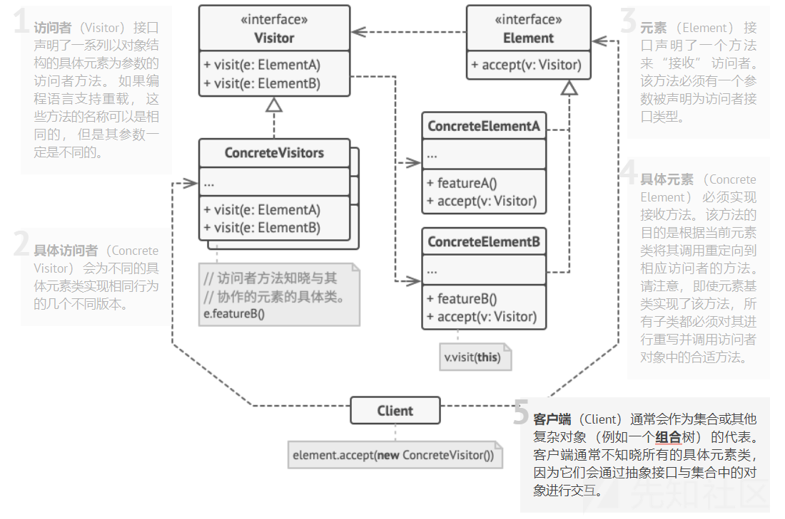

Java安全基础之字节码操作框架ASM学习

- - -

# Java安全基础之字节码操作框架ASM学习

## 1\. ASM基础

### 简单介绍

ASM 是一个通用的 Java 字节码操作和分析框架。它可直接以二进制形式用于修改现有类或动态生成类。应用场景有代码转换、优化、代码生成、动态字节码增强等。可以概括为**generation、transformation 和 analysis**

### 设计原理—访问者模式

**访问者**是一种行为设计模式， 允许你在不修改已有代码的情况下向已有类层次结构中增加新的行为。

访问者模式结构：

[](https://xzfile.aliyuncs.com/media/upload/picture/20240122162151-4b72c40c-b8ff-1.png)

**我的理解**：

假设存在对象A和B，现在需要向AB对象分别添加一个look操作，该怎么做？

**通常做法**：在AB对象加入一个look方法，但是这样会造成代码频繁改动

**改进方法**：编写一个vistor，同时有两个方法，分别为

-   lookA(Element A)
-   lookB(Element B)

这样会存在一个问题，假设现在存在一个元素e，需要先进行类型判断才能够确定是调用lookA还是lookB

**最终方法**：在AB对象初始设计的时候，加入一个accept方法，其传入的参数为visitor接口，函数体为调用接口中定义有关于A的方法，即lookA，这样在后面需要对对象进行如何操作时，只需要实现继承visitor接口的访问者类，并将操作写在lookA方法中

**参考**：[https://refactoringguru.cn/design-patterns/visitor/java/example](https://refactoringguru.cn/design-patterns/visitor/java/example)

### 通常处理流程

目标类 class bytes`->`ClassReader 解析`->`ClassVisitor 增强修改字节码`->`ClassWriter 生成增强后的 class bytes`->`通过 Instrumentation 解析加载为新的 Class

### 环境

Maven依赖：

```plain
<dependency>
    <groupId>org.ow2.asm</groupId>
    <artifactId>asm</artifactId>
    <version>9.3</version>
</dependency>
```

## 2\. 常用类与方法

### ClassVisitor

用于生成和转换已编译类的 ASM API 是基于 ClassVisitor 抽象类的，将它收到的所有方法调用都委托给另一个 ClassVisitor 类，会调用该类的visitXXX方法，**这个类可以看作一个事件筛选器**

**方法访问顺序**

```plain
visit visitSource? visitOuterClass? ( visitAnnotation | visitAttribute )*
( visitInnerClass | visitField | visitMethod )*
visitEnd
```

？表示最多一个，\*表示任意个

**相关方法**

```plain
public abstract class ClassVisitor {
    // 构造方法
    public ClassVisitor(int api);
    public ClassVisitor(int api, ClassVisitor cv);
    // 访问类的基本信息。version参数表示类的版本号，access参数表示类的访问标志，name参数表示类的内部名称，signature参数表示类的泛型签名（如果适用），superName参数表示父类的内部名称，interfaces参数表示类实现的接口的内部名称数组
    public void visit(int version, int access, String name, String signature, String superName, String[] interfaces);
    // 访问源文件和调试信息。source参数表示源文件的名称，debug参数表示调试信息
    public void visitSource(String source, String debug);
    // 访问外部类信息。owner参数表示外部类的内部名称，name参数表示外部类的名称，desc参数表示外部类的描述符
    public void visitOuterClass(String owner, String name, String desc);
    // 访问类的注解，返回一个AnnotationVisitor实例，用于访问注解的内容。desc参数表示注解的描述符，visible参数表示注解是否在运行时可见
    AnnotationVisitor visitAnnotation(String desc, boolean visible);
    // 访问类的属性（Attribute），例如SourceFile属性。attr参数表示要访问的属性
    public void visitAttribute(Attribute attr);
    // 访问内部类信息。name参数表示内部类的内部名称，outerName参数表示内部类的外部类的内部名称，innerName参数表示内部类的名称，access参数表示内部类的访问标志
    public void visitInnerClass(String name, String outerName, String innerName, int access);
    // 访问类的字段。access参数表示字段的访问标志，name参数表示字段的名称，desc参数表示字段的描述符，signature参数表示字段的泛型签名（如果适用），value参数表示字段的初始值
    public FieldVisitor visitField(int access, String name, String desc, String signature, Object value);
    // 访问类的方法。access参数表示方法的访问标志，name参数表示方法的名称，desc参数表示方法的描述符，signature参数表示方法的泛型签名（如果适用），exceptions参数表示方法声明的异常类型的内部名称数组
    public MethodVisitor visitMethod(int access, String name, String desc, String signature, String[] exceptions);
    // 访问类的结束，表示不再访问该类的任何内容
    void visitEnd();
}
```

### ClassReader

该类解析 ClassFile 内容，并针对遇到的每个字段、方法和字节码指令调用给定 ClassVisitor 的相应访问方法。**这个类可以看作一个事件生产者**

**构造方法**

```plain
public ClassReader(byte[] classFile)
// classFile - the JVMS ClassFile structure to be read.
```

**方法**

```plain
public void accept(ClassVisitor classVisitor, int parsingOptions)
// classVisitor - the visitor that must visit this class.
// parsingOptions - the options to use to parse this class. One or more of SKIP_CODE, SKIP_DEBUG,SKIP_FRAMES or EXPAND_FRAMES.
```

### ClassWriter

ClassWriter 类是 ClassVisitor 抽象类的一个子类，它直接以二进制形式生成编译后的类。它会生成一个字节数组形式的输出，其中包含了已编译类，可以用 toByteArray 方法来提取。**这个类可以看作一个事件消费者**

**构造方法**

```plain
public ClassWriter(int flags)
// Constructs a new ClassWriter object.
public ClassWriter(ClassReader classReader, int flags)
// Constructs a new ClassWriter object and enables optimizations for "mostly add" bytecode transformations.
```

**方法**

```plain
public byte[] toByteArray()
// Returns the content of the class file that was built by this ClassWriter.
// Returns:
// the binary content of the JVMS ClassFile structure that was built by this ClassWriter.
```

### MethodVisitor

访问Java方法的访问者类，用于生成和转换已编译方法的 ASM API 是基于 MethodVisitor 抽象类的，它由 ClassVisitor 的 visitMethod 方法返回。

**方法访问顺序**

```plain
visitAnnotationDefault?
( visitAnnotation | visitParameterAnnotation | visitAttribute )*
( visitCode
( visitTryCatchBlock | visitLabel | visitFrame | visitXxxInsn | visitLocalVariable | visitLineNumber )*
visitMaxs )?
visitEnd
```

对非抽象方法，如果存在注解和属性，必须先访问；其次是按顺序访问字节代码，这些访问在visitCode与visitMaxs之间

**相关方法**

```plain
abstract class MethodVisitor { // public accessors ommited
   // 构造方法
   MethodVisitor(int api);
   MethodVisitor(int api, MethodVisitor mv);

   // 访问方法的注解默认值
   AnnotationVisitor visitAnnotationDefault();
   // 访问方法的注解
   AnnotationVisitor visitAnnotation(String desc, boolean visible);
   // 访问方法参数的注解
   AnnotationVisitor visitParameterAnnotation(int parameter,
   String desc, boolean visible);
   // 访问方法的属性
   void visitAttribute(Attribute attr);
   // 访问方法的字节码指令部分
   void visitCode();

   // 访问方法的帧（Frame）。type参数表示帧的类型，nLocal参数表示局部变量的数量，local参数表示局部变量数组，nStack参数表示操作数栈的数量，stack参数表示操作数栈数组
   void visitFrame(int type, int nLocal, Object[] local, int nStack,
   Object[] stack);
   // 访问方法的一条指令，指令没有操作数
   void visitInsn(int opcode);
   // 访问方法的一条指令，指令操作数为单个整数
   void visitIntInsn(int opcode, int operand);
   // 访问方法的一条指令，指令操作数为局部变量索引
   void visitVarInsn(int opcode, int var);
   // 访问方法的一条指令，指令操作数为类型描述符
   void visitTypeInsn(int opcode, String desc);
   // 访问方法的一条指令，指令操作数为字段的信息。opc参数表示指令的操作码，owner参数表示字段所属的类名，name参数表示字段的名称，desc参数表示字段的描述符
   void visitFieldInsn(int opc, String owner, String name, String desc);
   // 访问方法的一条指令，指令操作数为方法的信息。opc参数表示指令的操作码，owner参数表示方法所属的类名，name参数表示方法的名称，desc参数表示方法的描述符
   void visitMethodInsn(int opc, String owner, String name, String desc);
   // 访问方法的一条动态方法调用指令。name参数表示方法的名称，desc参数表示方法的描述符，bsm参数表示引导方法（bootstrap method）的句柄，bsmArgs参数表示引导方法的参数。
   void visitInvokeDynamicInsn(String name, String desc, Handle bsm, Object... bsmArgs);
   // 访问方法的一条跳转指令
   void visitJumpInsn(int opcode, Label label);
   // 访问方法的标签（Label），用于标记代码的位置
   void visitLabel(Label label);
   // 访问方法的一条指令，将常量加载到操作数栈上
   void visitLdcInsn(Object cst);
   // 访问方法的一条指令，对局部变量进行增量操作
   void visitIincInsn(int var, int increment);
   // 访问方法的一条表格跳转指令。min参数表示最小的键值，max参数表示最大的键值，dflt参数表示默认跳转目标的标签，labels参数表示每个键值对应的跳转目标的标签数组
   void visitTableSwitchInsn(int min, int max, Label dflt, Label[] labels);
   // 访问方法的一条查找跳转指令。dflt参数表示默认跳转目标的标签，keys参数表示键值数组，labels参数表示每个键值对应的跳转目标的标签数组
   void visitLookupSwitchInsn(Label dflt, int[] keys, Label[] labels);
   // 访问方法的一条多维数组创建指令。desc参数表示数组的元素类型的描述符，dims参数表示数组的维度
   void visitMultiANewArrayInsn(String desc, int dims);
   // 访问方法的一个try-catch块。start参数表示try块的起始标签，end参数表示try块的结束标签，handler参数表示catch块的处理程序标签，type参数表示捕获的异常类型的描述符
   void visitTryCatchBlock(Label start, Label end, Label handler, String type);
   // 访问方法的局部变量。name参数表示局部变量的名称，desc参数表示局部变量的描述符，signature参数表示局部变量的泛型签名（如果适用），start参数表示变量的作用域的起始标签，end参数表示变量的作用域的结束标签，index参数表示局部变量的索引
   void visitLocalVariable(String name, String desc, String signature, Label start, Label end, int index);
   // 访问方法的行号信息。line参数表示行号，start参数表示行号对应的代码位置的标签
   void visitLineNumber(int line, Label start);
   // 访问方法的最大栈大小和最大局部变量数量。maxStack参数表示最大栈大小，maxLocals参数表示最大局部变量数量
   void visitMaxs(int maxStack, int maxLocals);
   // 访问方法的结束，表示不再访问该方法的任何内容
   void visitEnd();
}
```

**修改方法的步骤：原始方法和修改后的方法编译后进行对比，在通过visit操作进行修改**

## 3\. 解析字节码

### ClassReader加载字节码

该类解析 ClassFile 内容，并针对遇到的每个字段、方法和字节码指令调用给定 ClassVisitor 的相应访问方法。

**构造方法**

```plain
public ClassReader(byte[] classFile)
// classFile - the JVMS ClassFile structure to be read.
```

**方法**

```plain
public void accept(ClassVisitor classVisitor, int parsingOptions)
// classVisitor - the visitor that must visit this class.
// parsingOptions - the options to use to parse this class. One or more of SKIP_CODE, SKIP_DEBUG,SKIP_FRAMES or EXPAND_FRAMES.
```

**实例**

```plain
// 从文件系统中加载字节码
byte[] bytecode = Files.readAllBytes(Paths.get("path/to/MyClass.class"));
// 或者
 FileInputStream bytecode = new FileInputStream("path/to/MyClass.class");

// 从类加载器中加载字节码
InputStream is = getClass().getClassLoader().getResourceAsStream("com/example/MyClass.class");
byte[] bytecode = is.readAllBytes();

// 创建ClassReader实例
ClassReader classReader = new ClassReader(bytecode);
```

### ClassVisitor解析字节码

访问者，可根据具体要定义继承该类的访问类，并重写其方法

**构造方法**

```plain
protected ClassVisitor(int api)
protected ClassVisitor(int api, ClassVisitor classVisitor)
// api:该访问者执行的 ASM API 版本
// classVisitor:类访问者，该访问者必须将方法调用委托给该类访问者
```

**方法**

```plain
public void visit(int version, int access, String name, String signature, String superName, String[] interfaces)
// Visits the header of the class.
```

-   version：表示类文件的 JDK 版本
-   access：表示类的访问权限和属性
-   name：类的内部名称，用斜线代替点分隔包名和类名
-   signature：类的泛型签名，如果类没有泛型信息，此参数为 null
-   superName：父类的内部名称
-   interfaces：类实现的接口的内部名称数组。如果类没有实现任何接口，此参数为空数组

**实例**

实验类：bytecodeTest

```plain
package bytecode;

public class bytecodeTest extends Person implements helloInterface{
    private String sex;

    public bytecodeTest(String name, int age, String sex) {
        super(name, age);
        this.sex = sex;
    }

    public void sayHello() {
        System.out.println("Hello" + super.name);
    }
}
```

访问者类：MyClassVisitor

```plain
package javaasm;

import org.objectweb.asm.ClassVisitor;
import org.objectweb.asm.MethodVisitor;
import org.objectweb.asm.Opcodes;

public class MyClassVisitor extends ClassVisitor {
    // 调用父类构造方法，使用ASM Opcodes版本
    public MyClassVisitor() {
        super(Opcodes.ASM5);
    }

    // 重写visit方法，输出类名
    @Override
    public void visit(int version, int access, String name, String signature, String superName, String[] interfaces) {
        // print class name
        System.out.println("The class name:" + name);
        super.visit(version, access, name, signature, superName, interfaces);
    }

    // 重写visitMethod方法，输出方法名
    @Override
    public MethodVisitor visitMethod(int access, String name, String descriptor, String signature, String[] exceptions) {
        // print method name
        System.out.println("The method name:" + name);
        return super.visitMethod(access, name, descriptor, signature, exceptions);
    }
}
```

测试类：Main

```plain
package javaasm;

import org.objectweb.asm.ClassReader;
import java.io.FileInputStream;

public class Main {
    public static void main(String[] args) throws Exception{
        // 实例化自定义Visitor
        MyClassVisitor myClassVisitor = new MyClassVisitor();

        FileInputStream stream = new FileInputStream("target/classes/bytecode/bytecodeTest.class");
        // 加载字节码
        ClassReader reader = new ClassReader(stream);
        // 调用accept
        reader.accept(myClassVisitor, 0);
    }
}
```

结果：

```plain
The class name:bytecode/bytecodeTest
The method name:<init>
The method name:sayHello

Process finished with exit code 0
```

## 4\. 修改字节码

### 添加与删除Field

**实例**

删除sex属性，增加address属性

实验类：bytecodeTest

访问者类：UpdateFieldClassVisitor

```plain
package javaasm;

import org.objectweb.asm.ClassVisitor;
import org.objectweb.asm.FieldVisitor;
import org.objectweb.asm.Opcodes;

public class UpdateFieldClassVisitor extends ClassVisitor {
    // 删除字段的name
    private String deleteFieldName;
    // 添加字段的访问修饰符
    private int addFieldAcc;
    // 添加字段的name
    private String addFieldName;
    // 添加字段的描述符(类型)
    private String addFieldDesc;

    private Boolean flag = false;

    protected UpdateFieldClassVisitor(ClassVisitor cv, String deleteFieldName, int addFieldAcc, String addFieldName, String addFieldDesc) {
        super(Opcodes.ASM5, cv);
        this.deleteFieldName = deleteFieldName;
        this.addFieldAcc = addFieldAcc;
        this.addFieldName = addFieldName;
        this.addFieldDesc = addFieldDesc;
    }

    @Override
    public FieldVisitor visitField(int access, String name, String descriptor, String signature, Object value) {
        // 删除名为deleteFieldName的字段
        if (name.equals(deleteFieldName)) {
            return null;
        }
        if (name.equals(addFieldName)) flag = true;
        return super.visitField(access, name, descriptor, signature, value);
    }

    @Override
    public void visitEnd() {
        // 添加名为addFieldName的字段
        if (!flag) {
            FieldVisitor fieldVisitor = super.visitField(addFieldAcc, addFieldName, addFieldDesc, null, null);
            if (fieldVisitor != null) {
                fieldVisitor.visitEnd();
            }
        }
        super.visitEnd();
    }
}
```

测试类：Main

```plain
package javaasm;

import org.objectweb.asm.ClassReader;
import org.objectweb.asm.ClassWriter;
import org.objectweb.asm.Opcodes;

import java.io.FileInputStream;
import java.io.FileOutputStream;

public class Main {
    public static void main(String[] args) throws Exception{
        // -------------------添加与删除Field-------------------
        FileInputStream stream = new FileInputStream("target/classes/bytecode/bytecodeTest.class");
        // 加载字节码
        ClassReader reader = new ClassReader(stream);
        ClassWriter writer = new ClassWriter(reader, ClassWriter.COMPUTE_FRAMES);
        // 实例化修改Field Visitor
        UpdateFieldClassVisitor updateFieldClassVisitor = new UpdateFieldClassVisitor(writer, "sex", Opcodes.ACC_PRIVATE, "address", "Ljava/lang/String;");
        // 调用accept
        reader.accept(updateFieldClassVisitor, ClassReader.EXPAND_FRAMES);
        FileOutputStream fileOutputStream = new FileOutputStream("temp.class");
        byte[] updateByte = writer.toByteArray();
        fileOutputStream.write(updateByte);
        fileOutputStream.close();
        // 测试
        ClassReader classReader = new ClassReader(updateByte);
        MyClassVisitor myClassVisitor = new MyClassVisitor();
        classReader.accept(myClassVisitor, 0);
    }
}
```

结果：

```plain
The class name:bytecode/bytecodeTest
The field name:address
The method name:<init>
The method name:sayHello

Process finished with exit code 0
```

### 添加与删除Method

**实例**

删除sayHello方法，增加newMethod方法

实验类：bytecodeTest

访问者类：UpdateMethodClassVisitor

```plain
package javaasm;

import org.objectweb.asm.ClassVisitor;
import org.objectweb.asm.MethodVisitor;
import org.objectweb.asm.Opcodes;

public class UpdateMethodClassVisitor extends ClassVisitor {
    private String deleteMethodName;
    private String deleteMethodDesc;
    private int addMethodAcc;
    private String addMethodName;
    private String addMethodDesc;
    private boolean flag = false;

    protected UpdateMethodClassVisitor(ClassVisitor cv, String deleteMethodName, String deleteMethodDesc, int addMethodAcc,
                                       String addMethodName, String addMethodDesc) {
        super(Opcodes.ASM5, cv);
        this.deleteMethodName = deleteMethodName;
        this.deleteMethodDesc = deleteMethodDesc;
        this.addMethodAcc = addMethodAcc;
        this.addMethodName = addMethodName;
        this.addMethodDesc = addMethodDesc;
    }

    @Override
    public MethodVisitor visitMethod(int access, String name, String descriptor, String signature, String[] exceptions) {
        // 删除名为deleteMethodName且描述为deleteMethodDesc的方法
        // 因为有的方法可能name一致，但是参数不同
        if (name.equals(deleteMethodName) && descriptor.equals(deleteMethodDesc)) {
            return null;
        }
        if (name.equals(addMethodName) && descriptor.equals(addMethodDesc)) flag = true;
        return super.visitMethod(access, name, descriptor, signature, exceptions);
    }

    @Override
    public void visitEnd() {
        // 添加名为addMethodName且描述为addMethodDesc的方法
        if (!flag) {
            MethodVisitor methodVisitor = super.visitMethod(addMethodAcc, addMethodName, addMethodDesc, null, null);
            if (methodVisitor != null) {
                // 访问方法的字节码
                methodVisitor.visitCode();
                // 添加return指令
                methodVisitor.visitInsn(Opcodes.RETURN);
                // 设置方法的最大操作数栈深度和最大局部变量表大小，空方法设置00即可
                methodVisitor.visitMaxs(0, 0);
                // 结束访问
                methodVisitor.visitEnd();
            }
        }
        super.visitEnd();
    }
}
```

测试类Main

```plain
package javaasm;

import org.objectweb.asm.ClassReader;
import org.objectweb.asm.ClassWriter;
import org.objectweb.asm.Opcodes;

import java.io.FileInputStream;
import java.io.FileOutputStream;

public class Main {
    public static void main(String[] args) throws Exception{
        // -------------------添加与删除Method-------------------
        FileInputStream stream = new FileInputStream("target/classes/bytecode/bytecodeTest.class");
        // 加载字节码
        ClassReader reader = new ClassReader(stream);
        ClassWriter writer = new ClassWriter(reader, ClassWriter.COMPUTE_FRAMES);
        // 实例化修改Method Visitor
        UpdateMethodClassVisitor updateMethodClassVisitor = new UpdateMethodClassVisitor(writer, "sayHello", "()V", Opcodes.ACC_PUBLIC, "newMethod", "()V");
        reader.accept(updateMethodClassVisitor, ClassReader.EXPAND_FRAMES);
        // 写入新class中
        FileOutputStream fileOutputStream = new FileOutputStream("temp.class");
        byte[] updateByte = writer.toByteArray();
        fileOutputStream.write(updateByte);
        fileOutputStream.close();
        // 测试
        ClassReader classReader = new ClassReader(updateByte);
        MyClassVisitor myClassVisitor = new MyClassVisitor();
        classReader.accept(myClassVisitor, 0);
    }
}
```

结果

```plain
The class name:bytecode/bytecodeTest
The field name:sex
The method name:<init>
The method name:newMethod

Process finished with exit code 0
```

### 修改方法指令

**实例**

在方法开头加入输出语句

实验类：bytecodeTest

方法适配器：ModMethodAdapter

```plain
package javaasm;


import org.objectweb.asm.MethodVisitor;
import org.objectweb.asm.Opcodes;

public class ModMethodAdapter extends MethodVisitor {

    public ModMethodAdapter(MethodVisitor methodVisitor) {
        super(Opcodes.ASM5, methodVisitor);
    }

    @Override
    public void visitCode() {
        // 在方法前面添加输出
        // 从java/lang/System类中获取名为out的静态字段，该字段的类型为java/io/PrintStream
        // GETSTATIC指令将该字段的值压入操作数栈上
        mv.visitFieldInsn(Opcodes.GETSTATIC, "java/lang/System", "out", "Ljava/io/PrintStream;");
        // LDC指令用于将常量加载到栈上
        mv.visitLdcInsn("Hello, World!");
        // 调用java/io/PrintStream类的println方法，它接受一个java/lang/String类型的参数，并且没有返回值
        // INVOKEVIRTUAL指令用于调用实例方法
        mv.visitMethodInsn(Opcodes.INVOKEVIRTUAL, "java/io/PrintStream", "println", "(Ljava/lang/String;)V", false);
        super.visitCode();
    }
}
```

访问者类：ModMethodVisitor

```plain
package javaasm;

import org.objectweb.asm.ClassVisitor;
import org.objectweb.asm.MethodVisitor;
import org.objectweb.asm.Opcodes;

public class ModMethodVisitor extends ClassVisitor {

    protected ModMethodVisitor(ClassVisitor classVisitor) {
        super(Opcodes.ASM5, classVisitor);
    }

    @Override
    public MethodVisitor visitMethod(int access, String name, String descriptor, String signature, String[] exceptions) {
        MethodVisitor methodVisitor = super.visitMethod(access, name, descriptor, signature, exceptions);
        return new ModMethodAdapter(methodVisitor);
    }
}
```

测试类：Main

```plain
package javaasm;

import org.objectweb.asm.ClassReader;
import org.objectweb.asm.ClassWriter;
import org.objectweb.asm.Opcodes;

import java.io.FileInputStream;
import java.io.FileOutputStream;

public class Main {
    public static void main(String[] args) throws Exception{
        // -------------------修改Method：向方法开头加入输出-------------------
        FileInputStream stream = new FileInputStream("target/classes/bytecode/bytecodeTest.class");
        // 加载字节码
        ClassReader reader = new ClassReader(stream);
        ClassWriter writer = new ClassWriter(reader, ClassWriter.COMPUTE_FRAMES);
        // 实例化修改Method Visitor
        ModMethodVisitor modMethodVisitor = new ModMethodVisitor(writer);
        reader.accept(modMethodVisitor, ClassReader.EXPAND_FRAMES);
        // 写入新class中
        FileOutputStream fileOutputStream = new FileOutputStream("temp.class");
        byte[] updateByte = writer.toByteArray();
        fileOutputStream.write(updateByte);
        fileOutputStream.close();
        // 测试
        ClassReader classReader = new ClassReader(updateByte);
        MyClassVisitor myClassVisitor = new MyClassVisitor();
        classReader.accept(myClassVisitor, 0);
    }
}
```

## 5\. 用途

安全审计：ASM可以帮助进行Java代码的安全审计。通过解析和分析字节码，可以识别潜在的安全漏洞、代码注入、恶意操作等问题。ASM提供了丰富的API，能够检查和分析类、方法和指令，以发现可能的安全风险。

安全增强：ASM可以用于对Java应用程序进行安全增强。可以使用ASM修改字节码，以添加安全检查、权限验证、异常处理等安全相关的功能。这有助于在运行时保护应用程序免受潜在的攻击和漏洞利用。

加密和混淆：ASM可以与其他安全工具结合使用，以实现代码加密和混淆。通过修改字节码，可以对敏感的代码片段进行加密，以防止反编译和代码泄露。此外，ASM还可以帮助将代码进行混淆，使其更难以理解和分析。

本文为后续研究Java自动化漏洞挖掘IAST与RASP打基础

## 6\. 参考

[ASM 4.0 A Java bytecode engineering library (ow2.io)](https://asm.ow2.io/asm4-guide.pdf)  
[org.objectweb.asm (ASM 9.6) (ow2.io)](https://asm.ow2.io/javadoc/org/objectweb/asm/package-summary.html)
