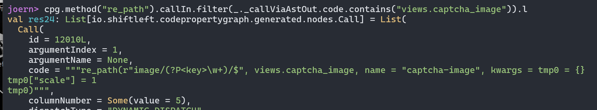

# Joern In RealWorld (2) - Jumpserver随机数种子泄露导致账户劫持漏洞（CVE-2023-42820）

Jumpserver是一个开源的django架构的堡垒机系统，由**lawliet & zhiniang peng(@edwardzpeng) with Sangfor**在上个月报送了这个漏洞

-   [https://github.com/jumpserver/jumpserver/security/advisories/GHSA-7prv-g565-82qp](https://github.com/jumpserver/jumpserver/security/advisories/GHSA-7prv-g565-82qp)

漏洞原理其实比较神奇，一个常用的第三方组件库[django-simple-captcha](https://github.com/mbi/django-simple-captcha)有**泄露随机数种子**的问题，再配合Jumpserver**使用了错误的随机数方案**导致了最终的漏洞。

# 漏洞成因

这里我们的目标不是分析漏洞，所以这里**简单快速的分析下漏洞的成因**，具体的漏洞分析可以看下面两篇文章

-   [https://www.leavesongs.com/PENETRATION/jumpserver-sep-2023-multiple-vulnerabilities-go-through.html](https://www.leavesongs.com/PENETRATION/jumpserver-sep-2023-multiple-vulnerabilities-go-through.html)
-   [https://www.cnblogs.com/zpchcbd/p/17747778.html](https://www.cnblogs.com/zpchcbd/p/17747778.html)

在分析代码级的漏洞成因之前，我想作为计算机相关的工作者，我们应该都有一个共识，就是**计算机中没有真正意义的伪随机**，无论是任何语言的随机数生成函数几乎都是从类似 `/dev/random`的地方取值，这里我们不讨论随机数底层的问题。

在代码的上层，我们几乎可以认为**如果你不知道随机数的种子，那么你就无法对随机数做出预测**。换言之，**如果我们知道随机数的种子，我们就有一定的概率预测随机数**。

**django-simple-captcha是Django的相关组件中非常流行的验证码生成库**，就像phith0n所说，在国内你几乎没有别的选择，引入的方式超级简单，只要在配置里引入对应库

```python
INSTALLED_APPS = [
    ...
    'captcha',
```

然后加入对应的验证码路由

```python
urlpatterns += [
	path('core/auth/captcha/', include('captcha.urls')),
]
```

最后只要在对应的form中加入验证码的字段就行了

```python
class CaptchaMixin(forms.Form):
    captcha = CaptchaField(widget=CustomCaptchaTextInput, label=_('Captcha'))
```

但事实上，看似简单的django-simple-captcha中实际包含着一个很大的问题。

## django-simple-captcha 随机数种子泄露[](#django-simple-captcha-%E9%9A%8F%E6%9C%BA%E6%95%B0%E7%A7%8D%E5%AD%90%E6%B3%84%E9%9C%B2)

这个问题在0.5.19版本中被修复

[](https://cdn.nlark.com/yuque/0/2023/png/26687441/1698115187427-c71622a1-ccb8-4f72-b854-7d2e8029b80a.png)

这里其实涉及到了django-simple-captcha的一个feature，**在设计上其实是允许通过key来指定随机数种子的**，这个feature是为了**让同一个key可以对应同一个验证码**，用来实现验证码的对应。

[](https://lorexxar-blog.oss-cn-shanghai.aliyuncs.com/blog/202310261538965.png)

而这里的key是一个已知的值，就是用于生成验证码的参数

[](https://cdn.nlark.com/yuque/0/2023/png/26687441/1698115998504-a596d5e9-fc1c-467b-afa6-462082cc5676.png)

换言之，我们可以**得知当前Random的随机数种子**，甚至可以控制这个种子。

修复的方案也很简单粗暴，只要在**生成结束之后用随机一个新种子**就可以了

-   [https://github.com/mbi/django-simple-captcha/commit/dcf1ccda3b12df179eaa5c0ebec95a897e96245f](https://github.com/mbi/django-simple-captcha/commit/dcf1ccda3b12df179eaa5c0ebec95a897e96245f)

[](https://lorexxar-blog.oss-cn-shanghai.aliyuncs.com/blog/202310261538104.png)

那么这对jumpserver又有什么影响呢？

## JumpServer 密码重置漏洞[](#JumpServer-%E5%AF%86%E7%A0%81%E9%87%8D%E7%BD%AE%E6%BC%8F%E6%B4%9E)

相比django-simple-captcha来说，**JumpServer更像是一个受害者，虽然存在一些安全隐患但本身并不致命。**我们可以猜想一下随机数在一般的系统里常用的场景。

-   重置密码
-   激活码、兑换码

相比激活码的场景来说，**重置密码的常见程度更高**，如果系统内没有刻意对管理员账号做限制，那么如果可以预测重置密码的验证结果，那么就可以获得一个超级管理员权限，而JumpServer的代码中是这样做的。

[](https://lorexxar-blog.oss-cn-shanghai.aliyuncs.com/blog/202310261538834.png)

/apps/authentication/api/password.py

[](https://lorexxar-blog.oss-cn-shanghai.aliyuncs.com/blog/202310261538890.png)

**重置密码用的code使用了random\_string来生成**，然后看看random\_string的定义

[](https://lorexxar-blog.oss-cn-shanghai.aliyuncs.com/blog/202310261538079.png)

这个函数在jumpserver中重做过好几次，但大同小异，其实就是**用random.choice从列表中选取随机字符**，最终生成最后的验证码。

这里我们不去细纠这个利用方式中的细节点，这不是本篇文章的讨论重点，简单来说就是

-   **通过\*\***django-simple-captcha泄露当前random的种子\*\*
-   **通过种子推测有限次的random结果**（其中不仅仅包括密码重置token，还有验证码噪点等）

这样我们就通过对随机数的预测实现进一步的漏洞利用，而修复的方案也很简单

在最初版本的修复方案中，**Jumpserver在获取密码重置token时重置了当前随机数种子**。这个修复方案也没什么问题。

[](https://lorexxar-blog.oss-cn-shanghai.aliyuncs.com/blog/202310261539892.png)

在后来的改动中，可能是因为看了P牛的文章，**Jumpserver把random换成了secrets**，相对来说比前一个方案更稳定一些，也是相关文档中推荐的方案

[](https://lorexxar-blog.oss-cn-shanghai.aliyuncs.com/blog/202310261539248.png)

# For Joern

从源代码的角度来讲，这个漏洞成因可以分成两部分

-   **存在泄露随机数种子，或者可以控制随机数种子的位置**
-   **在未显式重置随机数种子的基础上，引用了random来生成随机数**

## 随机数种子泄露[](#%E9%9A%8F%E6%9C%BA%E6%95%B0%E7%A7%8D%E5%AD%90%E6%B3%84%E9%9C%B2)

其实这个漏洞用Joern来处理挺吃力的，首先是**Joern只会处理目标目录下的源码**，而在正常的环境下，python引入的包其实**都在python的目录下**，也就是说理论上**我们无法在分析项目的时候，顺便分析django-simple-captcha。**

这里我们强行引入下分析django-simple-captcha包

```python
> .\joern

     ██╗ ██████╗ ███████╗██████╗ ███╗   ██╗
     ██║██╔═══██╗██╔════╝██╔══██╗████╗  ██║
     ██║██║   ██║█████╗  ██████╔╝██╔██╗ ██║
██   ██║██║   ██║██╔══╝  ██╔══██╗██║╚██╗██║
╚█████╔╝╚██████╔╝███████╗██║  ██║██║ ╚████║
 ╚════╝  ╚═════╝ ╚══════╝╚═╝  ╚═╝╚═╝  ╚═══╝
Version: 2.0.52
Type `help` to begin


joern> importCode("../captcha/")
```

先**找到random.seed调用的位置**

[](https://lorexxar-blog.oss-cn-shanghai.aliyuncs.com/blog/202310261539993.png)

先检查**调用位置到函数定义位置是否有数据联通**

```python
def source = cpg.method("seed").caller.parameter
def sink = cpg.method("seed").callIn

sink.reachableByFlows(source).p
```

[](https://lorexxar-blog.oss-cn-shanghai.aliyuncs.com/blog/202310261539466.png)

得到的答案是肯定的，**seed的参数key可控**，接着找对应的路由，**在django里路由一般是用path，而这个组件使用re\_path**

```python
from django.urls import path
from django.urls import re_path
```

我们可以直接快捷的**查看相应的路由函数调用位置**

[](https://lorexxar-blog.oss-cn-shanghai.aliyuncs.com/blog/202310261539226.png)

然后通过**对应的调用函数来获取指定的路由**

```python
cpg.method("re_path").callIn.filter(_._callViaAstOut.code.contains("views.captcha_image")).l
```

[](https://lorexxar-blog.oss-cn-shanghai.aliyuncs.com/blog/202310261539129.png)

当然可能也不用这么麻烦，理论上来说**直接设置source也是可以连起来的**，只不过**re\_path读取key的方式是正则匹配**，所以原装的**reachableByFlows无法处理这种情况**，我们只能强行做一些限制

```python
cpg.method("re_path").callIn.filter(_._callViaAstOut.code.contains("views.captcha_image")).filterNot(_.argument.code.contains("<key>")).l
```

由于这条命令可以获取结果，所以代表着**存在可以设置随机数种子的路由和对应的参数**。

当然，由于漏洞的特殊性不仅仅在于可控，还需要**后续没有进一步重置随机数种子**，所以我们还需要更多的条件来确认这一点。

其实要做到这点也并不复杂，只需要确认，**在设置seed种子的方法中，没有调用过无参的seed方法即可。**

```python
cpg.method("seed").caller.filter(_._callViaContainsOut.filter(_.name.contains("seed")).filter(_.argument.size<2).size==0).l
```

上面这条命令的意思是

-   **寻找seed方法的调用方法**
-   **寻找该方法中调用的方法中，名字为seed，并参数为0**(joern中，参数index为0的位置表示为this，也就是当前方法所属的类)
-   **展示调用方法中，满足条件的调用数量为0的方法**

[](https://lorexxar-blog.oss-cn-shanghai.aliyuncs.com/blog/202310261539623.png)

如果返回结果，则证明**该方法中没有重置新的随机数种子**，当然，到这里并不能完全的验证这个结论，毕竟这里指处理了显式重置，**如果是更严格的数据流分析，应该从重置随机数种子的位置入手**，确认是否有数据流经过，但**这种方案对于joern来说比较困难，这里先不深入到这个级别研究**。

## JumpServer密码重置漏洞[](#JumpServer%E5%AF%86%E7%A0%81%E9%87%8D%E7%BD%AE%E6%BC%8F%E6%B4%9E)

这里分析JumpServer的时候遇到的**最大的问题是JumpServer的代码量有点儿大**，导入到Joern里有83万个节点:<

其实相比Django-simple-captcha的问题来说，**JumpServer的问题在源代码的角度上来说更不像一个问题**，只能算是**一个使用错误的范例，有潜在的风险**。我们需要用joern完成的工作包括两部分

-   **在获取随机数之前，没有重置过随机数种子**
-   **在获取随机数之前，共执行了多少次随机操作**

先找到对应**调用random.choice方法的方法**

[](https://lorexxar-blog.oss-cn-shanghai.aliyuncs.com/blog/202310261539274.png)

而**调用过seed方法重置随机数种子的位置**只有一个，看了一下没有相关的引用关系，看上去像是一段测试代码

[](https://lorexxar-blog.oss-cn-shanghai.aliyuncs.com/blog/202310261539669.png)

由于场景特殊，这里我们用不到那么深入的数据流分析，只需要在**对应重置密码的路由中确认是否调用random.choice方法**就行了

[](https://lorexxar-blog.oss-cn-shanghai.aliyuncs.com/blog/202310261539469.png)

这里直接用repeat untils来实现就可以

[](https://lorexxar-blog.oss-cn-shanghai.aliyuncs.com/blog/202310261539253.png)

**repeat…untils…还是那个老问题，容易递归爆炸，路径重复问题严重**，我觉得这是joern实现里一个非常普遍的问题，但**至少可以确定两个调用位置的连通性**。

接下来我们的问题变成了，我们**如何知道在这条数据流中random调用了多少次**。

[](https://lorexxar-blog.oss-cn-shanghai.aliyuncs.com/blog/202310261539623.png)

我尝试了几次之后发现，**如果想要在语句上控制限制范围，以确认random的调用次数，会遇到比较多的问题**，**正向分析的深入深度**问题，以及**循环分支的次数数据**问题，问题比想象中的大，我暂且认为这不是joern的适用场景。

而相应的修复就更简单了，**直接换用secrets替代random会直接影响到前面的方法发现**，我们就无法获得对应的数据流了。
