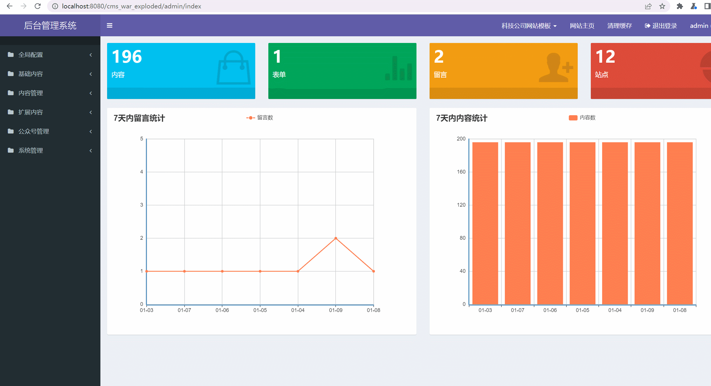
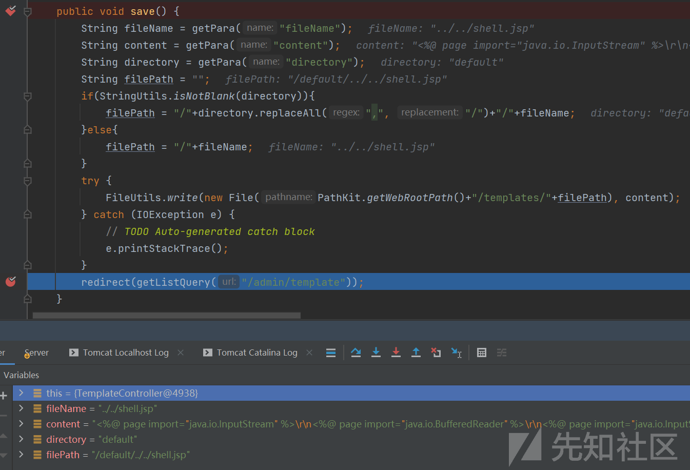

# JreCms代码审计 - 先知社区

JreCms代码审计

- - -

### 0x00 前言

JreCms是开源免费的JAVA企业网站开发建设管理系统。这次审计中我使用了几种常见的审计方法。1.通过功能点测试找到相应业务代码、2.直接从控制器开始翻看代码、3.通过javaweb开发的特点直接从entity目录翻看有没有SQL注入。

**源码下载：**  
[https://gitee.com/heyewei/JFinalcms](https://gitee.com/heyewei/JFinalcms)

**软件架构**  
MVC:JFinal  
页面:enjoy  
缓存:ehcache  
数据库:Mysql

### 0x01 反射型XSS

在com/cms/controller/admin/LoginController.java#index()里，用JFinal的getPara获取的数据被交给render渲染前端页面。

[](https://xzfile.aliyuncs.com/media/upload/picture/20240115173630-90371b2c-b389-1.png)

看一下前端页面，数据被插入到了<input>标签里，这样子是存在反射型XSS的。

[](https://xzfile.aliyuncs.com/media/upload/picture/20240115173753-c1a79f06-b389-1.png)

测试触发反射型XSS。

[](https://xzfile.aliyuncs.com/media/upload/picture/20240115174030-1f557812-b38a-1.png)

### 0x02 存储型XSS

在前台有留言功能。

[](https://xzfile.aliyuncs.com/media/upload/picture/20240109164132-e3c520d6-aeca-1.png)

找到留言功能的控制器com/cms/controller/front/GuestbookController.java#save()，这里使用了JFinal框架的[getModel](https://jfinal.com/doc/3-5 "getModel")将接收的表单传递给Guestbook对象，且没有做任何过滤。

[](https://xzfile.aliyuncs.com/media/upload/picture/20240109164635-9848065e-aecb-1.png)

跟进到com/jfinal/plugin/activerecord/Model.java#save()，可以看到表单的内容被写入数据库了。

[](https://xzfile.aliyuncs.com/media/upload/picture/20240109165831-430f8bb0-aecd-1.png)

留言是需要管理员审核的，到后台测试触发XSS。

[](https://xzfile.aliyuncs.com/media/upload/picture/20240109170838-acf46bbc-aece-1.gif)

### 0x03 任意文件读取

通过翻看controller目录的控制器类文件，看到一个简单的用于下载文件的控制器，在com/cms/controller/common/DownController.java#file()里可以看到，对传入的下载文件路径未作过滤。

[](https://xzfile.aliyuncs.com/media/upload/picture/20240109160455-c61ef23c-aec5-1.png)

[](https://xzfile.aliyuncs.com/media/upload/picture/20240109160536-dea2e6f6-aec5-1.png)

[](https://xzfile.aliyuncs.com/media/upload/picture/20240109160716-1a95fa86-aec6-1.png)

测试触发任意文件读取。

[](https://xzfile.aliyuncs.com/media/upload/picture/20240109160750-2ed335ea-aec6-1.png)

### 0x04 SSTI

在后台有模板管理功能，模板管理功能通常会存在SSTI或者文件写入漏洞。

[](https://xzfile.aliyuncs.com/media/upload/picture/20240109173915-f3db0294-aed2-1.png)

以下是存放模板文件的目录，网站搭建好后默认会使用default目录下的模板文件。

[](https://xzfile.aliyuncs.com/media/upload/picture/20240109135818-15f3b5e8-aeb4-1.png)

在com/cms/controller/admin/TemplateController.java找到更新模板文件的方法，可以看到方法里使用了JFinal的getPara来从请求中获取参数。

[](https://xzfile.aliyuncs.com/media/upload/picture/20240109140800-7116f272-aeb5-1.png)

通过编辑模板文件之后抓的包，可以看到模板文件内容通过content参数传递。

[](https://xzfile.aliyuncs.com/media/upload/picture/20240109141339-3b6a8c96-aeb6-1.png)

回到com/cms/controller/admin/TemplateController.java#update()，content参数没做任何处理就传递给了com/cms/util/TemplateUtils.java#write()。跟进到该方法，可以看到没有对content进行任何处理就写入到文件了，那么模板管理功能是存在SSTI的。

[](https://xzfile.aliyuncs.com/media/upload/picture/20240109141741-cba24ce0-aeb6-1.png)

尝试对模板文件注入恶意Payload。JFinal框架的模板引擎是[Enjoy](https://jfinal.com/doc/6-1 "Enjoy")，可以直接使用y4tacker师傅研究的[Payload](https://y4tacker.github.io/2022/04/14/year/2022/4/Enjoy%E6%A8%A1%E6%9D%BF%E5%BC%95%E6%93%8E%E5%88%86%E6%9E%90/#%E5%BC%95%E6%93%8E%E6%89%A7%E8%A1%8C%E6%B5%81%E7%A8%8B%E7%AE%80%E5%8D%95%E5%88%86%E6%9E%90 "Payload")。

```plain
#set((java.beans.Beans::instantiate(null,"javax.script.ScriptEngineManager")).getEngineByExtension("js").eval("function test(){ return java.lang.Runtime};r=test();r.getRuntime().exec(\"calc.exe\")"))
```

[](https://xzfile.aliyuncs.com/media/upload/picture/20240109134656-7f7c0f12-aeb2-1.png)

访问注入了恶意Payload的页面，可以看到成功执行了恶意代码。

[](https://xzfile.aliyuncs.com/media/upload/picture/20240109135514-a84951f6-aeb3-1.gif)

### 0x05 文件上传配合任意文件渲染RCE

在com/cms/controller/front/AjaxController.java#html()里，既没有鉴权也没有过滤，就直接将传入的文件路径拼接之后，使用JFinal框架的render渲染了。

[](https://xzfile.aliyuncs.com/media/upload/picture/20240114155230-de65af12-b2b1-1.png)

在后台找一个能回显上传文件路径的文件上传点，文件的内容为SSTI的Payload即可。

[](https://xzfile.aliyuncs.com/media/upload/picture/20240114154834-51a496a6-b2b1-1.png)

测试触发RCE，这里也存在任意文件读取的。

[](https://xzfile.aliyuncs.com/media/upload/picture/20240114155658-7defb2f8-b2b2-1.gif)

### 0x06 文件写入

模板管理功能除了有SSTI，一般还会存在文件写入漏洞。添加模板文件调试一下。

[](https://xzfile.aliyuncs.com/media/upload/picture/20240114135131-f7e74ba0-b2a0-1.png)

在com/cms/controller/admin/TemplateController.java#save()下断点，可以看到文件路径做了简单的拼接然后跟文件内容一起被传递给JFinal框架的FileUtils.write()写入新文件了。

[](https://xzfile.aliyuncs.com/media/upload/picture/20240114135328-3d346364-b2a1-1.png)

[](https://xzfile.aliyuncs.com/media/upload/picture/20240114135540-8bcf7144-b2a1-1.png)

JFinal框架较新的版本默认不能对.jsp文件直接进行访问。

[](https://xzfile.aliyuncs.com/media/upload/picture/20240114140032-3a5b5098-b2a2-1.png)

在Tomcat环境下可以通过对jsp字符进行URL编码绕过。

[](https://xzfile.aliyuncs.com/media/upload/picture/20240114135836-f4e86f0a-b2a1-1.png)

### 0x07 SQL注入

这个漏洞我是从entity目录开始找的，这个目录存放了数据库增删改查相关的类文件。在com/cms/entity/Admin.java#findPage()里，传入的name、username参数被拼接到filterSql变量，然后传递给了JFinal框架的paginate，在JFinal框架li这种写法是存在SQL注入的。使用IDEA找到使用findPage()的地方。

[](https://xzfile.aliyuncs.com/media/upload/picture/20240114164519-3f258f1e-b2b9-1.png)

找到了在com/cms/controller/admin/AdminController.java#index()里，传入的name、username参数未做任何处理就被传递给findPage()，那么这里是存在SQL注入的。

[](https://xzfile.aliyuncs.com/media/upload/picture/20240114164944-dcfa9414-b2b9-1.png)

表里有3条数据，测试触发SQL延时注入。

[](https://xzfile.aliyuncs.com/media/upload/picture/20240114170239-ab05169e-b2bb-1.gif)

### 参考

[https://forum.butian.net/share/1899](https://forum.butian.net/share/1899)  
[https://jfinal.com/doc](https://jfinal.com/doc)  
[https://y4tacker.github.io/2022/04/14/year/2022/4/Enjoy%E6%A8%A1%E6%9D%BF%E5%BC%95%E6%93%8E%E5%88%86%E6%9E%90/](https://y4tacker.github.io/2022/04/14/year/2022/4/Enjoy%E6%A8%A1%E6%9D%BF%E5%BC%95%E6%93%8E%E5%88%86%E6%9E%90/)
