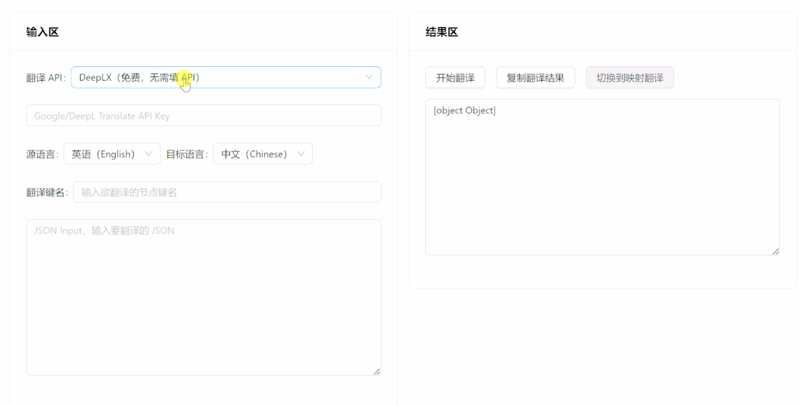
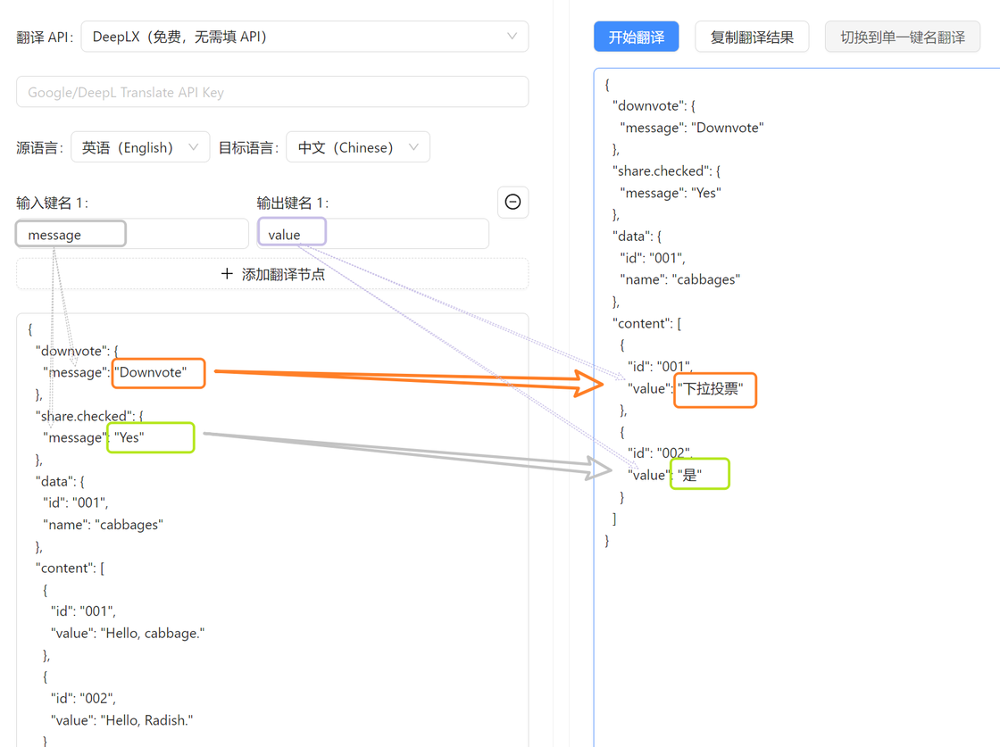

# JsonTranslate 实用指南：怎样让你的项目说上 13 种语言？ - 少数派

[JsonTranslate](https://sspai.com/link?target=https%3A%2F%2Ftools.newzone.top%2Fjson-translate)，一款专为开发者和内容创作者设计的多语言 JSON 翻译工具，支持 Google Translate、DeepL 和 DeepLX 翻译 API，助力项目国际化和本地化。无论你是在开发多语言网站、应用程序还是处理多语言数据集，JsonTranslate 都能提供简便的解决方案，轻松将 JSON 文件中的内容翻译为多种目标语言。


该工具的设计理念与市面上其他多语言翻译器不同。常见的翻译器虽然追求一键自动化，但通常配置繁琐，且往往需要付费订阅。JsonTranslate 的设计初衷是为了解决 ChatGPT Shortcut 和 IMGPrompt 等个人或开源项目中的英汉互译问题而设计，特别适合那些翻译文件不多的项目。

与传统的全站自动化翻译工具相比，JsonTranslate 更加注重根据用户需求进行精确翻译。用户可以方便地粘贴需要翻译的文本，甚至指定单个新增节点，从而简化多语言翻译流程，使得翻译工作更为高效和精确。

## 使用说明



### 1\. 选择翻译 API

在使用 JsonTranslate 时，你有多种翻译 API 的选择。首先是 Google Translate 和 DeepL Translate，这两者都需要用户自行获取 API 密钥。Google Translate 在常见句子的翻译上较为普遍，特别适合翻译用户界面 UI；而 DeepL 在长文本翻译方面表现更优，能提供更流畅的翻译结果。若想申请这些 API，可参考相关的[接口申请教程](https://sspai.com/link?target=https%3A%2F%2Fdocs.easyuseai.com%2Fplatform%2Ftranslate%2Fgoogle_fanyi.html)。

此外，JsonTranslate 还提供了 DeepLX 作为一个免费选项。DeepLX 通过将 DeepL Free API 转换为本地 API 接口，允许第三方应用进行调用。它无需 API 密钥，适合少量或偶尔的翻译需求。想了解更多关于 DeepLX 的信息，可以访问其 [GitHub 页面](https://sspai.com/link?target=https%3A%2F%2Fgithub.com%2FOwO-Network%2FDeepLX%2F)。


需要注意的是，使用 Google Translate 时，你的翻译数据会从客户端直接发送到 Google 服务器。而 DeepL API 则不支持在网页上使用。因此，JsonTranslate 在服务器端提供了一个专门的 DeepL 翻译转发接口，该接口仅用于数据转发，不会收集任何用户数据。用户可以选择在本地环境中部署并使用这一接口。

### 2\. 语言设置

你可以灵活地选择源语言和目标语言，以实现不同语言之间的相互翻译。目前，JsonTranslate 支持 13 种语言的互译，包括英语、中文、日语、韩语、西班牙语、法语、德语、意大利语、俄语、葡萄牙语、印地语、阿拉伯语和孟加拉语。这些语言涵盖了全球大部分主要语言区域，能满足多样化的用户需求。需要注意的是，印地语、阿拉伯语和孟加拉语目前仅能通过 Google Translate 进行翻译，因为 DeepL 尚未支持这三种语言。


### 3\. 翻译键名

键名（key）是访问 JSON 结构中特定信息的关键，可以由数字、英文字母、中文等非符号字符组成。在命名时需注意大小写的区别。对于包含数组`[]`的 JSON 数据，建议避免使用数字作为键名，因为这会被认为是数组索引，从而可能引起混淆或错误。

为了同时指定多个键名的翻译，你可以通过逗号进行分隔，不论是使用中文还是英文逗号均可。

如果你刚开始接触 JSON 的键名，不妨参考以下的示例说明。这些示例将帮助你更好地理解键名的格式和使用方式。

### 4\. 翻译内容

JsonTranslate 专为 JSON 内容翻译而设计，仅支持 JSON 格式输入。

输入内容变更时，应用会实时格式化 JSON 并验证格式正确性。请避免在输入框内进行大量修改，因为频繁的修改可能增加出错的风险。如果需要对 JSON 文件做大量的编辑或修改，建议先在其他专用的 JSON 编辑工具中完成编辑，确保格式无误后再将内容导入 JsonTranslate 进行翻译。

### 5\. 翻译结果

点击「开始翻译」按钮后，翻译完成可以选择「复制结果」。



结果界面右侧还设有灰色按钮，用于切换翻译节点模式，包括单一键名模式和映射翻译模式。单一键名模式下，翻译的输入输出使用相同节点，而映射翻译模式则涉及不同节点的翻译。例如，节点 A 的值将翻译至节点 B，节点 C 的值翻译至节点 D。

## JSON 键名及其局限性

JSON 数据是以键值对的形式存储的，其中“键”（也称为“名称”）是一个字符串，用于唯一标识数据记录中的特定项目或元素，是数据检索和操作的基础。JsonTranslate 正是利用了 JSON 键名的标识作用来实现精准化识别翻译。

以下是对示例中的几个键名的解释：

-   `downvote.message`：这是一个嵌套的键名。`downvote` 是外层对象的键名，而 `message` 是 `downvote` 对象内部的一个键名。
-   `提示词.message`：这里 `提示词` 是一个键名，它本身包含一个对象，该对象有一个键 `message`。
-   `share.owner`：这个键名包含了一个点（`.`），它是一个单独的键名而不是指示嵌套关系。在这种情况下，如果你想访问 `share.owner` 对象中的 `name`，你不能使用 `share.owner.name`，因为这会被错误解释为查找一个名为 `owner` 的对象内的 `name` 键，而实际上 `share.owner` 是一个完整的键名。

```null
{
  "downvote": {
    "message": "Downvote"
  },
  "提示词": {
    "message": "prompt"
  },
  "share.owner": {
    "name": "rabbit"
  },
  "data": {
    "title": {
      "id": "001",
      "name": "cabbages"
    }
  },
  "content": [
    {
      "id": "001",
      "value": "Hello, cabbage."
    },
    {
      "id": "002",
      "value": "Hello, Radish."
    }
  ]
```

目前，JsonTranslate 无法处理包含点（`.`）的 JSON 键名。这是因为点号在 JSONPath 中用于区分嵌套对象的键名，使得含点的键名可能被误解为多层嵌套对象。为避免这一问题，建议使用不含点的键名。

## 结语

JsonTranslate 是一款适合小型项目和个人开发者的多语言 JSON 翻译工具。它以简单直观的操作和对多种翻译 API 的支持，帮助用户高效处理多语言翻译任务。虽然不能与专业的全站自动化翻译工具如 Crowdin 相媲美，但对于那些追求便利性、面临有限资源或只需处理少量翻译任务的用户来说，JsonTranslate 提供了一种实用且易于上手的解决方案。
