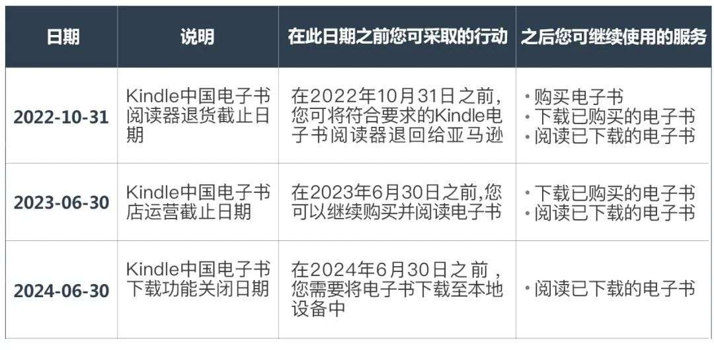
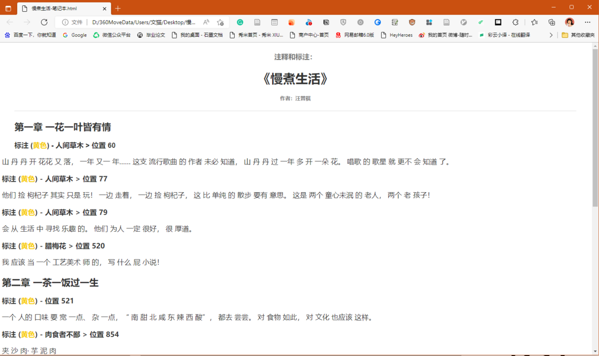
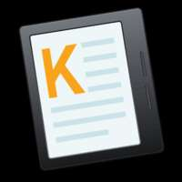
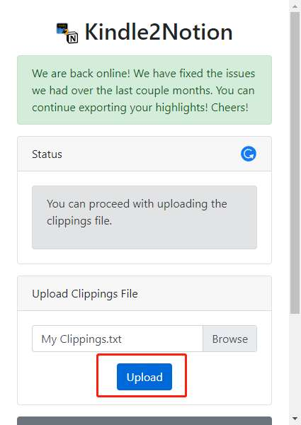

# Kindle 笔记导出方法大合集 - 少数派

6 月 2 日下午，亚马逊 Kindle 服务号发表了《重要通知 | Kindle 中国电子书店运营调整》，正式宣布退出中国市场。

官方也给出了具体的退出日期：

注意：在**2022 年 1 月 1 日**之后购买的 Kindle 电子书阅读器，亚马逊会提供非质量问题的退货服务，退货截止日期到 2022 年 10 月 31 日。

Kindle 退出中国市场，我们首先要做的是要把在商店购买的电子书下载到本地设备，两年后则需要思考如何把新的电子书弄到 Kindle 上，到时候最不济也就是用原始的 USB 传输方法。停服后中国区用邮箱 Send to Kindle 的服务也没有了，如果想继续使用这个服务可以选择注册并更换为美亚账号，也可以在美亚的电子书商店正常进行消费（切换账户会把 Kindle 上的内容清空，操作前记得备份一下）。

Kindle 上的读书笔记都存在 My Clippings.txt 文件里，这个文件是通过 Kindle 云服务同步的，因此也会受到停服的影响，不过切换为美亚账户以后就可以继续同步了。

想要方便快捷的导出 Kindle 上的读书笔记？本文给大家提供了官方导出笔记的渠道和几个第三方工具，下文会简单介绍一下每个工具的使用方法和局限。最后一部分是如何将 Kindle 读书笔记导入到自己常用的笔记软件里，祝大家阅读愉快~ 

**关联阅读：**[Kindle 停止运营，那些亚马逊回答和没有回答的问题](https://sspai.com/prime/story/kindle-migration-guide)

## 官方渠道

官方有三种导出读书笔记的方式，都是以给自己的邮箱发邮件的形式实现。用 Kindle 设备直接发送的是 CSV 和 PDF 格式的附件，而 PC 客户端和手机端发送的都是 HTML 格式的附件。

官方渠道有两个共同的 **限制**：

-   只能导出 ＜10% 的原书内容，但一般读书笔记也到不了这个比例，所以问题不大；
-   只针对从官方电子书商店下载的书，自己导入的文档不行。

### 用 Kindle 导出

打开 Kindle 上的一本书，点击右上角的三个点。点击导出笔记，发送至自己的邮箱。

导出的文件为 CSV 和 PDF 两个附件

与亚马逊账户绑定的邮箱就会收到一封邮件，内含 CSV 和 PDF 两个附件：

附件中的 CSV 文件打开如下图所示，内含书名、作者、批注的位置和具体内容。

附件中的 PDF 文件如下图所示，排版比较好看，但 PDF 文件难以进行后续的整理加工。

### 用电脑 / 手机

#### 电脑：Kindle 电脑客户端

我使用的是 Windows 端的 Kindle 客户端，不是很好用，怪不得没怎么见大家提过。书架不能同步 Kindle 上的所有书（包月借的书没显示），而且导出笔记的按钮会莫名消失，第一次打开是可以导出的，后来再打开就没有这个选项了，不知是不是个例。

打开一本书，点击右上角的导出。点击另存为，选择路径，就可以导出一个 HTML 文件。

导出的文件格式为 HTML

电脑端导出的 HTML 文件排版有一些问题，会有一些莫名奇妙的空格，而下面用手机 app 端导出的效果更好一些。用官方渠道（电脑客户端和手机 app）导出的 HTML 文件可以导入 flomo，方便对读书笔记进行后续加工。

#### 手机：Kindle app

⚠️ **需要注意的是**：Kindle app 将于 2024 年 6 月 30 日从应用商店下架。

用 Kindle app 打开一本书，点击右上角笔记图标，再点击分享图标，发送到自己的邮箱即可。

导出格式为 HTML 文件

虽然和电脑客户端格式一致，但相对而言排版更好一点。

## 第三方工具

Kindle 设备里有一个 My Clippings.txt 文件，这个文件保存了该 Kindle 的所有书籍的标注、笔记以及书签信息，以下的第三方工具基本都是基于这个文件做的，所以不论是从电子书商店下载的还是自己导入的，只要做过笔记都会存在这个 TXT 文件里。

由于这个 My Clippings.txt 文件是存在 Kindle 设备上的，下面介绍的第三方工具都需要**插数据线**来读取数据，通过解析这个 txt 文件，才能获取本 Kindle 上所有的读书笔记。

### Kindlemate

作为老 Kindle 玩家，应该都玩过 Kindlemate 吧？虽然 Kindlemate 上一次更新是 2017 年了，但我试了下还是好用的。连上数据线可以马上识别笔记，可以导出多种格式；除了看起来有点「复古」，没别的毛病了。

用 USB 链接 Kindle 和电脑，直到 「计算机」 或「我的电脑」中出现 Kindle 盘符。打开 Kindlemate，如果之前链接过则可以自动识别之前的笔记，并自动导入新笔记。

Kindlemate 比较像一个中转站的功能，读取了 Kindle 的笔记之后我们可以用 Kindlemate 导出，导出格式有 txt、xlsx、docx，可以选择方便自己后续整理加工的格式进行导出。

导出格式很多诸如： txt、xlsx、docx

### Clippings Fere

Clippings Fere 是一个由第三方开发者开发的笔记导出工具，是基于 My Clippings.txt 文件设计开发的一个电脑端的程序，主要功能就是读取 Kindle 文件，然后导出成 HTML 格式的读书笔记。Windows 平台和 macOS 平台均可下载，你可以在 [这里](https://sspai.com/link?target=https%3A%2F%2Fbookfere.com%2Fpost%2F110.html) 下载到这款软件。

用 USB 数据线将 Kindle 连接到电脑，直到 「计算机」 或「我的电脑」中出现 Kindle 盘符。运行 Clippings Fere，软件会自动检测 My Clippings.txt 文件，若没检测到请手动选择。选择输出目录并点击 「立即转换」，会在目标目录生成一个「MyClippings」 文件夹。

笔记很多的话导出一次有点慢，不要急，等他出现导出完成的标志，才算成功了。

导出格式为 HTML

导出的是一个文件夹，内含 index（目录，可显示所有笔记的书目），每一本书都是一个独立的 HTML 文件。但我不知道怎么把它导入到我常用的笔记软件里，无法进行后续加工，于我而言有点鸡肋了。

### 糯词笔记

糯词笔记 Knotes

高效全能的读书笔记管理工具，读书爱好者的最佳读书伴侣

¥8.00

去购买

一款读书笔记管理工具，也是 macOS 和 Windows 均适用。可以导入 Kindle 和微信读书上的笔记，方便高效的整理所有读书笔记，颜值也很在线。

导入 Kindle 读书笔记时可以选择导入 My Clippings.txt 文件或从手机客户端导出的 HTML 文件。还可以用糯词笔记把自己的读书笔记整理并导出，免费用户可以导出到印象笔记和 OneNote 或 PDF 格式，高级会员可以导出为 TXT 和 Markdown，可以有更多编辑和整理笔记的空间。

### 阅读记录

阅读记录

帮助更多人养成阅读习惯，还好书一次被读完的机会。

¥86.00 ¥88.00

去购买

一款阅读管理 app，可以添加书籍来追踪阅读进度，还有「读书日历」和「数据统计」等功能，可以管理自己的想读、在读和已读书籍。

在这款 app 的个人中心可以导入 Kindle 读书笔记，根据官方说明一步步跟着来即可。导入后可以从个人书架中选择已有的书籍进行匹配。如果没有匹配成功，会再进行系统书籍库匹配。

### 滴墨书摘

滴墨书摘

翻完最后一页不是终点，它让阅读的过程更完整。

¥88.00 ¥108.00

去购买

滴墨书摘是一款具备 OCR 识别功能的笔记管理应用，设定好一本书，把你划过线的地方 OCR 一下，摘录下来、加上自己的评注，就可以高效快捷的整理自己所有的读书笔记。

发现页可以选择导入 Kindle 笔记，根据指引操作即可。整理好的读书笔记可以就存在 app 中，或者按照笔记创建时间的升降序、页码的升降序，导出成 PDF、txt 或者 Markdown 格式，还可以导出到 Evernote。

### Klib

Klib 高级版

Kindle、Apple Books、多看标注都可以轻松管理。

¥98.00

去购买

Klib 是一款读书笔记管理工具，Mac 端适用。目前已支持导入 Kindle、Apple Books、多看等软件上的读书笔记。特点是不仅能导入笔记、整理笔记，还可以复制为 Markdown，存在其他笔记软件中。

## Kindle to somewhere

把 Kindle 笔记「搞出来」只是第一步，放到自己的笔记软件里我才会觉得踏实（虽然放进去也不一定会看）。

## to flomo

可以使用 [send to flomo](https://sspai.com/link?target=https%3A%2F%2Fhelp.flomoapp.com%2Fadvance%2Fextension%2Fkindle2flomo.html) 拓展把读书笔记导入到 flomo，需要用到官方渠道导出的 HTML 文件（电脑端或手机端导出），以及 flomo API（需要会员）。

首先，打开 [这个网址](https://sspai.com/link?target=https%3A%2F%2Ftit1e.github.io%2Fkindle2Flomo%2F)，选择 HTML 文件，并粘贴你的flomo API。

可以选择自己想导入的笔记，有些手滑标注的就可以在这步筛选掉。

设置好标签，方便后续查看和整理。在 flomo 里看到的是这样：

直接上传 My Clippings.txt 文件，可以一次性获取所有笔记。但每天只能导入 100 条，需要精挑细选一下再导入 flomo。

### to Obsidian

在社区插件里搜索 Kindle，添加 [Kindle Highlights 插件](https://sspai.com/link?target=https%3A%2F%2Fgithub.com%2Fhadynz%2Fobsidian-kindle-plugin)。

左边栏会出现一个 Sync 的图标，点击它。选择登陆亚马逊账号或上传 My Clippings.txt，再点击 Sync now。

完成后一本书是一个文件，亮点在于作者直接双链上了（如果原来的笔记里有这个页面的话）！

### to notion

在 Chrome 扩展程序商店里搜索下图的插件并安装：

点击插件，点击 Instructions/Steps to follow，把 My Kindle Clippings 复制到自己的 Workspace 里（先不要挪到其他 page 里）。打开自己 Workspace 里的 My Kindle Clippings 页面并选择 Share to web，并在这个页面打开插件：

选择 My Clippings.txt，点击 Upload，就可以开始等了，这个插件有点慢，1000 条笔记大约用时 3-5 分钟。等待中可以不用管它，过一会儿回到这个页面，点击刷新一下 Status 就可以看到状态，显示 Completed 就导入完成了。

导出完成后自己的读书笔记会变成这个 Database 里的一堆新 Page。默认的 Cardview 没有识别出封面，让我有点失望了。

每本书一个 Page，英文书可以识别页码和标注时间，中文书识别不了这两个信息，但考虑到 Notion 颜值比较高，这俩信息没有我也可以忍。

## 一些其他区域账户可以使用的小工具

亚马逊为位于美国的 Kindle 用户准备了一个官方的可以在线查看 My Clippings.txt 文件的 [平台](https://sspai.com/link?target=http%3A%2F%2Fread.amazon.com%2Fnotebook)，通过这个平台我们也可以导出我们的读书笔记。

此外，第三方平台 [Clippings](https://sspai.com/link?target=https%3A%2F%2Fwww.clippings.io%2Fzh%2F) 和 [Readwise](https://sspai.com/link?target=https%3A%2F%2Freadwise.io%2F) 也支持导出 Kindle 读书笔记，遗憾的是这两个工具国区并不支持，但在用外区的朋友依然值得一试。

## 小结

测试了这么多种导出 Kindle 笔记的方法，我已经有了不同格式同样内容的好几份 Kindle 读书笔记了。其实只要知道有这么多导出笔记的方法，也就不急着导出了，毕竟亚马逊还有两年才正式退出中国，到时候再把这篇文章拿出来，照着导出一下笔记，也不迟。

\> 下载 [少数派 2.0 客户端](https://sspai.com/page/client)、关注 [少数派公众号](https://sspai.com/s/J71e)，解锁全新阅读体验 📰

\> 实用、好用的 [正版软件](https://sspai.com/mall)，少数派为你呈现 🚀
