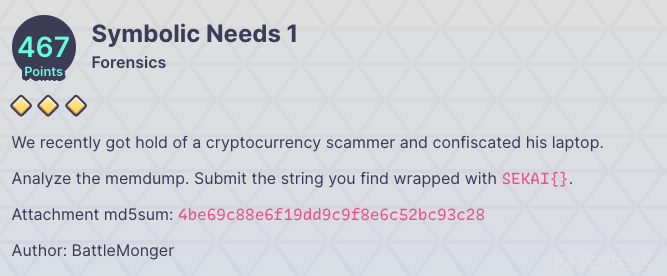
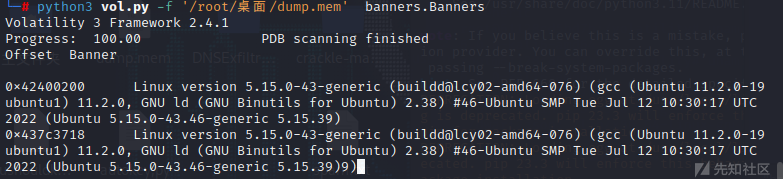
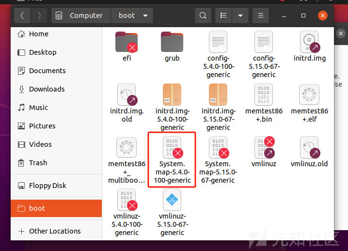
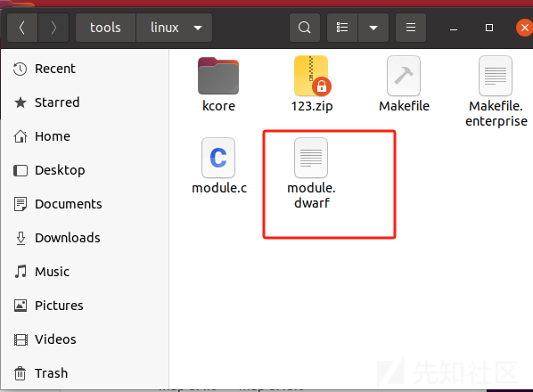

# Linux内存取证总结 - 先知社区

Linux内存取证总结

- - -

## 前言

从一个题目入手，那就是SEKAI的一道forensics，这个题目使用**LiME**对内核为**5.15.0-43-generic**的**Ubuntu**制作内存镜像, 需要自行制作**Symbols 进行分析**，这个题目的答题思路就是我们要找出内存的对应的linux 的内核版本，通过内核版本找出内存来着那个版本的Linux，然后制作相应的Symbols（vol3），然后就可以镜像常见的操作了

这里附件上传我的云盘力：

```plain
链接：https://pan.baidu.com/s/1bNCXioU31a9-rAXdVN8M4A 
提取码：dddk 
--来自百度网盘超级会员V2的分享
```

[](https://xzfile.aliyuncs.com/media/upload/picture/20231222215003-01e47844-a0d1-1.png)

## 开始之前

这里我们先来稍微解释一下一些简单的概念的问题，方便我们理解。

### Profile

Profile是特定操作系统版本以及硬件体系结构（x86、x64、ARM）中`VTypes`、共用体、对象类型的集合。

> Vtypes 是 Volatility 框架中数据结构定义以及解析的语言，大部分操作系统底层都是使用 C 语言编写的，其中大量使用数据结构来组织和管理相关的变量以及属性。
> 
> 因为 Volatility 是用 Python 语言编写的，所以我们需要一种方式在Python 源文件中表示 C 语言的数据结构。
> 
> VTypes 正是用于实现这一点的。

除了这些组件以外，`Profile` 还包括如下:

-   元数据：操作系统的名称(例如:“windows”,“mac”,“linux”)，内核版本，以及编译号。
-   系统调用信息：索引以及系统调用的名称。
-   常量值：全局变量-在某些操作系统中能够在硬编码的地址处找到的全局变量
-   系统映射：关键全局变量和函数的地址（仅限 Linux 和 Mac）

但在 Volatility3 中，不再使用配置文件`Profile`，取而代之，vol3自身带有一个扩展的符号表库`Symbols`，并且对于大多数Windows内存镜像，可以基于内存映像本身来生成新的符号表。它允许符号表包含基于该操作系统位置（符号位置）的特定偏移量。

也就是说利用官方调试信息提供的那些结构的已知偏移量，可以更轻松、更快速地识别操作系统中的结构。

## Symbol Tables

用于分析相关操作系统数据的内核符号表压缩包，其所有文件以JSON数据格式存储，可以是纯json文件`.json`，也可以是`.json.gz`或者`.json.xz`，Volatility3在使用它们时会自动解压。此外，Vol3会在用户主目录下的`.cache/volatility3`目录下会缓存他们的压缩内容，当前还无法更改这个缓存目录。

Vol3的symbol tables分为两类，上面的`Windows Symbol tables`作为一类，由于对Mac和Linux采用相同的识别机制，统分为另外一类。

### Windows

对于WIndows系统，符号表字符串由所需`PDB`文件的`GUID`和`Age`组成，Volatility会搜索windows子目录下配置的所有文件，并与包含`pdb`名称，`GUID`/`Age`（或者其他压缩形式）的所有元数据进行匹配、利用。如果找不到的话，会从 Microsoft 官方的符号表服务器下载相关的`PDB`文件，并自动转化成适当的`JSON`格式，并存储在合适的位置。

可以从适当的 PDB 文件手动构建 Windows 符号表，而执行此操作的主要工具已经内置在 Volatility3了：`pdbconv.py`。 该文件支持从`Volatility3`的根路径运行，命令如下：

```plain
┌──(kali㉿kali)-[~]
└─$ python3 ./volatility3/framework/symbols/windows/pdbconv.py
```

Volatility官方也已经给出了Windows符号表：[Volatility3官方：Windows符号表下载](https://downloads.volatilityfoundation.org/volatility3/symbols/windows.zip)

### Linux/Mac

[Volatility3官方：Mac符号表下载](https://downloads.volatilityfoundation.org/volatility3/symbols/mac.zip)

对于 Mac，它只有特定数量的内核，但我们不会经常更新包，因为它有点耗时。

[Volitility3官方：Linux符号表（不全）](https://downloads.volatilityfoundation.org/volatility3/symbols/linux.zip)

[dwarf2json](https://github.com/volatilityfoundation/dwarf2json) 可以从 `DWARF`文件生成 Linux 和 Mac 符号表。而当前，利用内核中包含的调试符号表，是大多数Volatility3插件恢复信息的唯一合适方法。

值得注意的是，只有`-- elf`的方案在 vol3 中可行,其他使用如`Sysmap` 解析出来的 json 都是不可行的。(在vol2中生成profile会用到 Sysmap )

```plain
./dwarf2json linux --elf /usr/lib/debug/boot/vmlinux-4.4.0-137-generic > output.json
```

此外，为什么上面说Linux符号表信息不全呢？因为Linux内核易于编译且唯一，无法区分它们，因此官方提供的Linux符号表并不详尽，因此在面对Linux内存取证时，要自行生成符号表；并且，标准内核是被剥离了调试信息的，若想获取带有调试信息的，则需从文件中单独获取。

下面是这几天找的制作符号表的一些奇技淫巧

#### 0x01-dwarf2json

很常规，就是找到目标内存对应版本的内存镜像

第一步找到版本

```plain
python3 vol.py -f '/root/桌面/dump.mem'  banners.Banners
```

[](https://xzfile.aliyuncs.com/media/upload/picture/20231222215027-10612fca-a0d1-1.png)

```plain
Ubuntu 5.15.0-43.46-generic 5.15.39
```

找到这个版本对应的内核镜像，ps这里的俺也不知道为啥为啥找不到源文件下载链接呜呜（哭

获取源文件网址：[https://launchpad.net/ubuntu/+archive/primary/+files/](https://launchpad.net/ubuntu/+archive/primary/+files/) ，按需选择下载。

我们的目标文件是vmlinux5.4.0-84-generic，

```plain
Linux 内核映像文件的名称，它包含了 Linux 操作系统内核的可执行代码。这个文件名中的各个部分的含义如下：

vmlinux: 这是 Linux 内核的可执行文件，包含了完整的符号信息，用于调试目的。它通常比实际用于引导的内核映像文件更大。

5.4.0-84-generic: 这部分指定了 Linux 内核的版本号。在这里，它表示 Linux 内核版本为 5.4.0，而 -84-generic 是特定于 Ubuntu 等发行版的标识，表示这是一个特定修订版本的内核。
```

**借助Docker直接获取`dbgsym`文件安装在指定系统**

我们拿到了这个内核镜像文件，然后还需要再一个相应的linux版本的环境来使用我们的工具（dwarf2json相应的glibc版本来编译这符号表文件）

```plain
docker run -it --rm -v $PWD:/volatility ubuntu:18.04 /bin/bash
cd volatility/dwarf2json
dpkg -i linux-image-unsigned-5.4.0-84-generic-dbgsym_5.4.0-84.94_amd64.ddeb
(这里如果提示储存不够，那就可以dpkg -c xxx.dded看一下内核映像文件的位置和名称，然后dpkg -x .ddeb vmlinux5.4.0-84-generic,提取出单个文件)
./dwarf2json linux --elf /usr/lib/debug/boot/vmlinux5.4.0-84-generic > linux-image-5.4.0-84-generic.json 
cp linux-image-5.4.0-84-generic.json ./volatility3/volatility3/framework/symbols/linux
```

#### 0x02 symbols\_maker

[https://github.com/kevthehermit/volatility\_symbols](https://github.com/kevthehermit/volatility_symbols)

```plain
py symbol_maker.py -d ubuntu -k ‘5.15.0-43-generic’
```

越南那哥们可以跑成功，我这里不行捏。。。

## 2022 Sekai CTF | symbolic-needs 1

按照上面构造符号表的方法，先判断当前系统版本和Linux 内核版本，再制作符号表，这个题目很巧，给了Ubuntu 22.04 Linux-version 5.15.0-43-generic，当前版本，Vol2是不支持的，必须用Vol3。

```plain
wget https://launchpad.net/ubuntu/+archive/primary/+files/linux-image-unsigned-5.15.0-43-generic-dbgsym_5.15.0-43.46-generic_amd64.ddeb
cd ../
docker run -it --rm -v $PWD:/volatility ubuntu:22.04 /bin/bash
cd volatility/dwarf2json
dpkg -i linux-image-unsigned-5.15.0-43-generic-dbgsym_5.15.0-43.46_amd64.ddeb
./dwarf2json linux --elf /usr/lib/debug/boot/vmlinux-5.15.0-43-generic > linux-image-5.15.0-43-generic.json
cp linux-image-5.4.0-84-generic.json ./volatility3/volatility3/framework/symbols/linux
python3 vol.py -f /mnt/f/20022Sekai/dump.mem linux.bash
Volatility 3 Framework 2.4.0


PID Process CommandTime Command

1863    bash    2022-08-29 13:45:56.000000    72.48.117.53.84.48.110.95.119.51.95.52.114.51.95.49.110.33.33.33
```

其实难点就是这自己制作symbols，也就是win7内存forensics的profiles部分需要我们自己制作，其他的思路和win7的取证思路一样。

## 相关ddeb快速查找

[https://mirrors.ustc.edu.cn/debian/pool/main/l/linux/](https://mirrors.ustc.edu.cn/debian/pool/main/l/linux/)

[https://mirrors.ustc.edu.cn/ubuntu/pool/main/l/linux/](https://mirrors.ustc.edu.cn/ubuntu/pool/main/l/linux/)

[http://ftp.us.debian.org/debian/pool/main/l/linux/](http://ftp.us.debian.org/debian/pool/main/l/linux/)

[http://ddebs.ubuntu.com/ubuntu/pool/main/l/linux/](http://ddebs.ubuntu.com/ubuntu/pool/main/l/linux/)

[http://security.ubuntu.com/ubuntu/pool/main/l/linux/](http://security.ubuntu.com/ubuntu/pool/main/l/linux/)

## vol2-profile制作

首先我们找到内存镜像对应的虚拟机版本，这里我们那qwb的题目为实例

我们通过bananer一下得知内存镜像的内核版本信息，我们找到对应信息的ubuntu发现内核版本不是我们想要的

### 虚拟机换内核

记住几个指令就好，网上的一些方法亲测无效

安装对应版本的内核镜像

```plain
sudo apt-get install linux-image-5.4.0-100-generic
```

安装对应版本的内核头文件

```plain
sudo apt-get install linux-headers-5.4.0-100-generic
```

安装对应版本的内核模块

```plain
sudo apt-get install linux-modules-5.4.0-100-generic
```

安装对应版本的驱动

```plain
sudo apt-get install linux-modules-extra-5.4.0-100-generic
```

查看已经安装的内核版本

```plain
dpkg -l |grep linux-image
```

完事之后重启虚拟机，安装shift+tab键进入ubuntu高级选项，选择第二个选项（A什么什么的）

选择我们想要加载的内核版本，启动就换好了。

### 制作profile

#### 制作符号表

找到boot路径下的这个文件，System.map文件。该文件包含系统的符号信息

[](https://xzfile.aliyuncs.com/media/upload/picture/20231222215046-1b4cf9d2-a0d1-1.png)

#### 创建vtypes

vtypes是内核数据结构，为创建该数据结构，我们需要检查我们的源码并针对我们要分析的系统内核编译module.c文件，这将会为我们生成一个名为module.dwarf文件，该文件包含了我们所需的内核调试信息。

然后把vol2源码文件中的/tool/linux文件加复制到我们的目标虚拟机中

执行两条命令之后

```plain
sudo apt-get install dwarfdump 
sudo apt-get install build-essential
```

然后make

[](https://xzfile.aliyuncs.com/media/upload/picture/20231222215051-1e618624-a0d1-1.png)

可以得到一个.dwarf文件

- - -

打包之后放到`volatility/plugins/overlays/linux`

```plain
sudo zip ./volatility/plugins/overlays/linux/Ubuntu.zip ./tools/linux/module.dwarf /boot/System.map-`uname -r`
```
