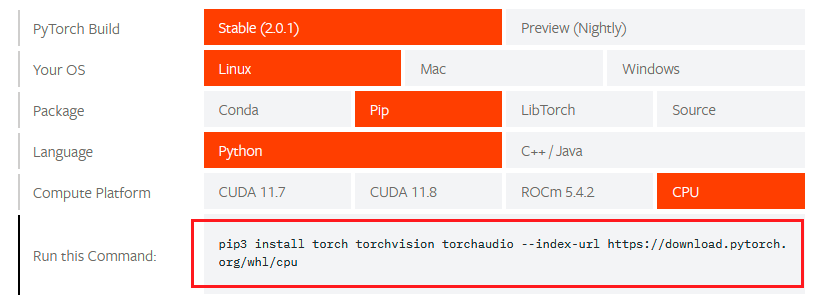

# 

[↓↓↓](https://www.cnblogs.com/Arthemis-z/p/17717859.html)  
  
Linux环境下sentence-transformers 之 all-MiniLM-L6-v2模型安装与使用  
  
[↑↑↑](https://www.cnblogs.com/Arthemis-z/p/17717859.html)

好记性不如烂笔头系列

一、背景：

1、之前使用chatgpt接口生成embeddings的向量维度为1536维，数据库中占用较大，所以找寻低维度的向量生成方法，减少数据占用

2、在[huggingface](https://huggingface.co/)上发现[all-mpnet-base-v2](https://huggingface.co/sentence-transformers/all-mpnet-base-v2 "all-mpnet-base-v2")及[all-MiniLM-L6-v2](https://huggingface.co/sentence-transformers/all-MiniLM-L6-v2 "all-MiniLM-L6-v2")两个模型不错，前者会生成768维的向量，后者会生成384维的向量

二、介绍：

　　1、huggingface下的[Sentence Transformers](https://huggingface.co/sentence-transformers?sort_models=downloads#models "sentence-transformers")是一个Python框架，用于最先进的句子，文本和图像嵌入。all-mpnet-base-v2、all-MiniLM-L6-v2则是该框架下下载量最多的两个模型

2、模型并不能直接使用，使用这些模型需要提前安装好环境

三、环境安装：

1、因为要使用python环境，所以我们使用[Anaconda（官网）](https://www.anaconda.com/download/#macos)来对环境进行统一管理，具体介绍可看这篇文章：[Anaconda介绍、安装及使用教程](https://zhuanlan.zhihu.com/p/32925500)

2、官网下载Anaconda linux环境安装包，并传到linux下


 3、执行安装Anaconda

```plain
1 bash Anaconda3-2023.07-2-Linux-x86_64.sh
```

按照说明一路向下回车，直到显示：Do you accept the license terms? \[yes|no\]，输入yes，回车，等待安装


**此时记得断开终端，重新连接，使安装后的Anaconda生效！**

 之后执行指令，来验证是否安装成功，成功会显示版本号

```plain
conda --version
```

执行指令，来更新conda，等待跳出更新列表，输入y，进行更新

```plain
conda update conda
```


4、创建python环境（此处看文章 [Anaconda介绍、安装及使用教程](https://zhuanlan.zhihu.com/p/32925500) 即可）

通过[Sentence Transformers github](https://github.com/UKPLab/sentence-transformers)页面可知，安装条件，在条件[transformers v4.6.0](https://github.com/huggingface/transformers/blob/main/README_zh-hans.md)中看到在python3.8+得到测试，为了稳妥起见，我这边使用了python3.9


 创建python3.9环境，输入y回车，开始创建

```plain
conda create --name python3.9 python=3.9
```


查看环境

```plain
conda info --envs
```


 切换到环境python3.9

```plain
source activate python3.9
```


 5、安装PyTorch

进入[pyTorch官网](https://pytorch.org/get-started/locally/)，获取安装pyTouch命令，根据自身情况选择



 回到python3.9环境下，执行命令，安装pyTorch

```plain
pip3 install torch torchvision torchaudio --index-url https://download.pytorch.org/whl/cpu
```


 6、安装[transformers](https://github.com/huggingface/transformers/blob/main/README_zh-hans.md)

 因为上面已经安装了pyTorch，所以此时可以安装transformers了

```plain
pip install transformers
```


7、上述依赖环境安装完成，开始安装`sentence-transformers`

建议使用conda安装，使用pip安装不知道会有何问题

```plain
conda install -c conda-forge sentence-transformers
```


 此时已全部安装完成，环境配置完成

8、下载模型

此处建议手动下载模型，否则执行python脚本时再下载会很耽误时间

模型地址上述提过：[all-MiniLM-L6-v2](https://huggingface.co/sentence-transformers/all-MiniLM-L6-v2 "all-MiniLM-L6-v2")，按照图中所示下载全部文件，再放到linux指定目录


9、执行测试python脚本

```plain
from sentence_transformers import SentenceTransformer

sentences = ["This is an example sentence", "Each sentence is converted"]

model = SentenceTransformer('/usr/local/zxx/huggingface_model/all-MiniLM-L6-v2')
embeddings = model.encode(sentences)
print(embeddings)
```


 完结撒花~（实测，384维的向量）
