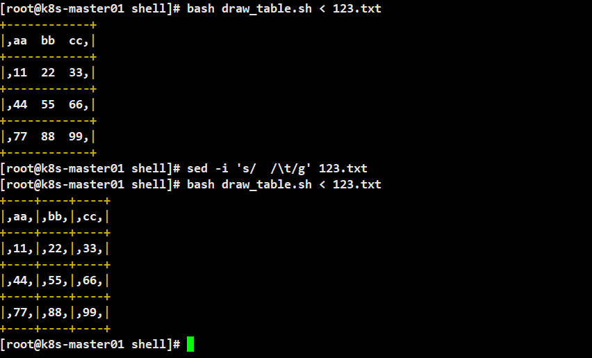
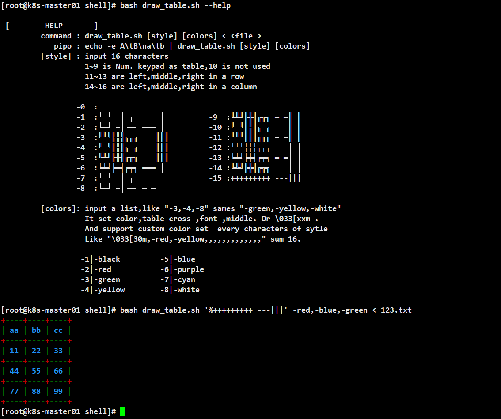
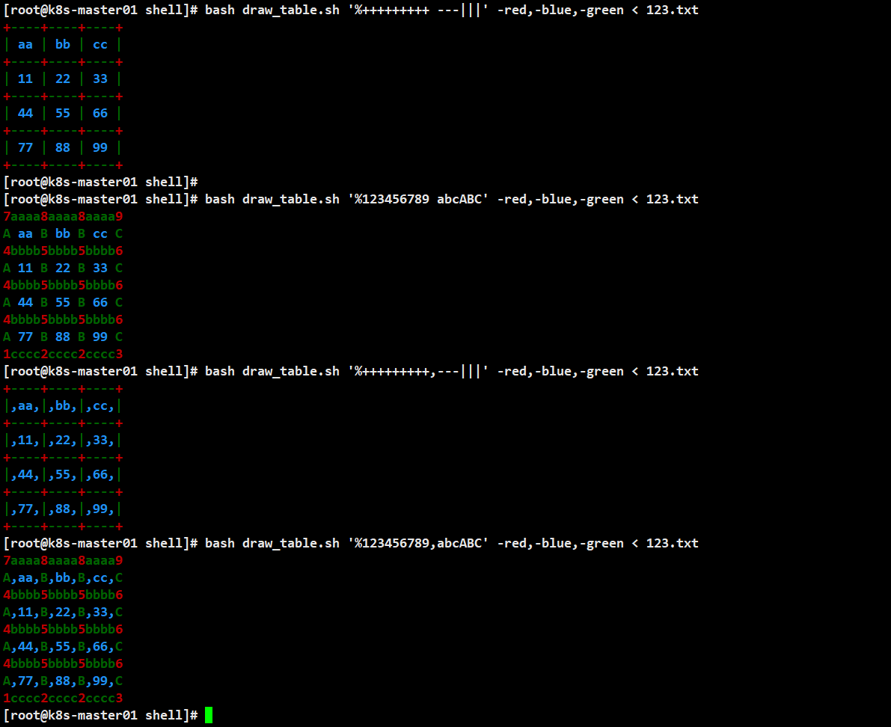

# 

[↓↓↓](https://www.cnblogs.com/chuyiwang/p/17471666.html)  
  
Linux终端数据处理 列表显示输出的脚本  
  
[↑↑↑](https://www.cnblogs.com/chuyiwang/p/17471666.html)

分享一个Linux终端数据处理 列表显示输出的脚本

测试数据

```shell
# cat 123.txt 
aa  bb  cc
11  22  33
44  55  66
77  88  99
```

  
  


脚本出处：[https://blog.csdn.net/weixin\_42596911/article/details/84934113](https://blog.csdn.net/weixin_42596911/article/details/84934113)

```cmake
#!/bin/bash
#################################################################
# 绘制表格
# 作者：banemon
# 邮箱：banemon@
# Git ：https://gitee.com/banemon/linux_sh_script
# 命令：draw_table.sh <file.txt
# 或者：echo -e "A\tB\na\tb"|draw_table.sh
# 帮助：draw_table.sh --help
# 制表符大全
# ─━│┃╌╍╎╏┄┅┆┇┈┉┊┋┌┍┎┏┐┑┒┓└┕┖┗┘┙┚┛├┝┞┟┠┡┢┣┤┥┦┧┨┩┪┫┬┭┮┯┰┱┲┳┴┵┶┷┸┹┺┻┼┽┾┿╀╁╂╃╄╅╆╇╈╉╊╋╪╫╬═║╒╓╔╕╖╗╘╙╚╛╜╝╞╟╠╡╢╣╤╥╦╧╨╩╔╗╝╚╬═╓╩┠┨┯┷┏┓┗┛┳⊥﹃﹄┌╮╭╯╰╳
# ╲╱
# ╱╲
tbc7="╭";tbc9="╮";
tbc1="╰";tbc3="╯";
tbx0="╳";
# 样式
style="$1"
case $style in
	# 1 2 3 4 5 6 7 8 9 10       11      12      13       14      15      16
	# 1 2 3 4 5 6 7 8 9 txt_empt top_row mid_row btm_row left_col mid_col right_col 
	-0)  tbs="                ";;
	-1)  tbs="└┴┘├┼┤┌┬┐ ───│││";;
	-2)  tbs="└─┘│┼│┌─┐ ───│││";;
	-3)  tbs="╚╩╝╠╬╣╔╦╗ ═══║║║";;
	-4)  tbs="╚═╝║╬║╔═╗ ═══║║║";;
	-5)  tbs="╙╨╜╟╫╢╓╥╖ ───║║║";;
	-6)  tbs="╘╧╛╞╪╡╒╤╕ ═══│││";;
	-7)  tbs="└┴┘├┼┤┌┬┐ ─ ─│ │";;
	-8)  tbs="└─┘│┼│┌─┐ ─ ─│ │";;
	-9)  tbs="╚╩╝╠╬╣╔╦╗ ═ ═║ ║";;
	-10) tbs="╚═╝║╬║╔═╗ ═ ═║ ║";;
	-11) tbs="╙╨╜╟╫╢╓╥╖ ─ ─║ ║";;
	-12) tbs="╘╧╛╞╪╡╒╤╕ ═ ═│ │";;
	-13) tbs="╘╧╛╞╪╡╒╤╕ ═ ═│ │";;
	-14) tbs="╚╩╝╠╬╣╔╦╗ ───│││";;
	-15) tbs="+++++++++ ---|||";;
	"%"*) tbs="${style/"%"/}";;
	-h*|--h*)
		echo -e '
 [  ---   HELP  ---  ]
\t command : draw_table.sh [style] [colors] < <file >
\t    pipo : echo -e A\\tB\\na\\tb | draw_table.sh [style] [colors]
\t [style] : input 16 characters
\t           1~9 is Num. keypad as table,10 is not used
\t           11~13 are left,middle,right in a row
\t           14~16 are left,middle,right in a column
\t
\t         -0  :                
\t         -1  :└┴┘├┼┤┌┬┐ ───│││         -9  :╚╩╝╠╬╣╔╦╗ ═ ═║ ║
\t         -2  :└─┘│┼│┌─┐ ───│││         -10 :╚═╝║╬║╔═╗ ═ ═║ ║
\t         -3  :╚╩╝╠╬╣╔╦╗ ═══║║║         -11 :╙╨╜╟╫╢╓╥╖ ─ ─║ ║
\t         -4  :╚═╝║╬║╔═╗ ═══║║║         -12 :╘╧╛╞╪╡╒╤╕ ═ ═│ │
\t         -5  :╙╨╜╟╫╢╓╥╖ ───║║║         -13 :╘╧╛╞╪╡╒╤╕ ═ ═│ │
\t         -6  :╘╧╛╞╪╡╒╤╕ ═══│││         -14 :╚╩╝╠╬╣╔╦╗ ───│││
\t         -7  :└┴┘├┼┤┌┬┐ ─ ─│ │         -15 :+++++++++ ---|||
\t         -8  :└─┘│┼│┌─┐ ─ ─│ │
\t
\t [colors]: input a list,like "-3,-4,-8" sames "-green,-yellow,-white"
\t           It set color,table cross ,font ,middle. Or \\033[xxm .
\t           And support custom color set  every characters of sytle
\t           Like "\\033[30m,-red,-yellow,,,,,,,,,,,,," sum 16.
\t
\t          -1|-black         -5|-blue
\t          -2|-red           -6|-purple
\t          -3|-green         -7|-cyan
\t          -4|-yellow        -8|-white
		'
		exit
		;;
esac
tbs="${tbs:-"+++++++++,---|||"}"
 
# 颜色
color="$2"
case $color in
	1) ;;
	2) ;;
	3) ;;
	"-"*|"\033"*)
		# 3位数标,词
		colors="$color"
		;;
	"%"*) :
		# 全自定义
		colors="${color/"%"/}"
		;;
esac
colors="${colors:-"-4,-8,-4"}"
 
# 主体
awk -F '\t' \
	-v table_s="$tbs" \
	-v color_s="$colors" \
	'BEGIN{
	}{
		for(i=1;i<=NF;i++){
			# 每列最大长度
			cols_len[i]=cols_len[i]<length($i)?length($i):cols_len[i]
			# 每行每列值
			rows[NR][i]=$i
		}
		# 前后行状态
		if(NR==1){
			befor=0
		}else if(1==2){
			after=0
		}
		rows[NR][0] = befor "," NF
		befor=NF
	}END{
		# 颜色表
		color_sum = split(color_s,clr_id,",")
		if(color_sum==3){
			# 简易自定义模式
			for(i=1;i<=3;i++){
				if(color_s~"-"){
					clr_id[i] = color_var(clr_id[i])
				}else if(colors~"\033["){
					clr_id[i] = cclr_id[i]
				}
			}
			# 组建色表
			for(i=1;i<=16;i++){
				if(i<10){
					colors[i] = clr_id[1]
				}else if(i==10){
					colors[i] = clr_id[2]
				}else if(i>10){
					colors[i] = clr_id[3]
				}
			}
		}else if(color_sum==16){
			# 全自定义模式
			for(i=1;i<=16;i++){
				if(color_s~"-"){
					clr_id[i] = color_var(clr_id[i])
				}else if(colors~"\033["){
					clr_id[i] = cclr_id[i]
				}
				#colors[i] = clr_id[i]
			}
		}
		#split(color_s,colors,",")
		clr_end = "\033[0m"
			clr_font = colors[10]
			#clr_cross = colrs[2]
			#clr_blank = colors[3]
		# 制表符二维表并着色
		for(i=1;i<=length(table_s);i++){
			if(colors[i]=="")
				tbs[i] = substr(table_s,i,1)
			else
				tbs[i] = colors[i] substr(table_s,i,1) clr_end
			fi
		}
		# 绘制上边框
		top_line=line_val("top")
		# 绘制文本行
		# 绘制分隔行
		mid_line=line_val("mid")
		# 绘制下边框
		btm_line=line_val("btm")
		# 行最大总长度
		line_len_sum=0
		for(i=1;i<=length(cols_len);i++){
			line_len_sum=line_len_sum + cols_len[i] + 2
		}
		line_len_sum=line_len_sum + length(cols_len) - 1
		# 所有表格线预存（提高效率）
		title_top = line_val("title_top")
		top = line_val("top")
		title_mid = line_val("title_mid")
		title_btm_mid = line_val("title_btm_mid")
		title_top_mid = line_val("title_top_mid")
		mid = line_val("mid")
		title_btm = line_val("title_btm")
		btm = line_val("btm")
		# 绘制表格 2
		line_rows_sum=length(rows)
		for(i=1;i<=line_rows_sum;i++){
			# 状态值
			split(rows[i][0],status,",")
			befors=int(status[1])
			nows=int(status[2])
			if(i==1 && befors==0){
				# 首行时
				if(nows<=1){
					# 单列
					print title_top
					print line_val("title_txt",rows[i][1],line_len_sum)
				
				}else if(nows>=2){
					# 多列
					print top
					print line_val("txt",rows[i])
				
				}	
			}else if(befors<=1){
				# 前一行为单列时
				if(nows<=1){
					# 单列
					print title_mid
					print line_val("title_txt",rows[i][1],line_len_sum)
				}else if(nows>=2){
					# 多列
					print title_btm_mid
					print line_val("txt",rows[i])
				}
			
			}else if(befors>=2){
				# 前一行为多列时
				if(nows<=1){
					# 单列
					print title_top_mid
					print line_val("title_txt",rows[i][1],line_len_sum)
				}else if(nows>=2){
					# 多列
					print mid
					print line_val("txt",rows[i])
				}
			}
			# 表格底边
			if(i==line_rows_sum && nows<=1){
				# 尾行单列时
				print title_btm
			}else if(i==line_rows_sum && nows>=2){
				# 尾行多列时
				print btm
			}
		}
	}
	function color_var(  color){
		# 颜色
		#local color=$1
		#case $color in
		if(color=="-1" ||color=="-black"){
			n=30
		}else if(color=="-2" || color=="-red"){
			n=31
		}else if(color=="-3" || color=="-green"){
			n=32
		}else if(color=="-4" || color=="-yellow"){
			n=33
		}else if(color=="-5" || color=="-blue"){
			n=34
		}else if(color=="-6" || color=="-purple"){
			n=35
		}else if(color=="-7" || color=="-cyan"){
			n=36
		}else if(color=="-8" || color=="-white"){
			n=37
		}else if(color=="-0" || color=="-reset"){
			n=0
		}else{
			n=0
		}
		return "\033[" n "m"
	}
	function line_val(   part,   txt,  cell_lens,  cell_len,  line,  i){
		# 更新本次行标
		if(part=="top"){
			tbs_l=tbs[7]
			tbs_m=tbs[8]
			tbs_r=tbs[9]
			tbs_b=tbs[11]
		}else if(part=="mid"){
			tbs_l=tbs[4]
			tbs_m=tbs[5]
			tbs_r=tbs[6]
			tbs_b=tbs[12]
		}else if(part=="txt"){
			tbs_l=tbs[14] tbs[10]
			tbs_m=tbs[10] tbs[15] tbs[10]
			tbs_r=tbs[10] tbs[16]
			tbs_b=tbs[10]
		}else if(part=="btm"){
			tbs_l=tbs[1]
			tbs_m=tbs[2]
			tbs_r=tbs[3]
			tbs_b=tbs[13]
		}else if(part=="title_top"){
			tbs_l=tbs[7]
			tbs_m=tbs[11]
			tbs_r=tbs[9]
			tbs_b=tbs[11]			
		}else if(part=="title_top_mid"){
			tbs_l=tbs[4]
			tbs_m=tbs[2]
			tbs_r=tbs[6]
			tbs_b=tbs[12]			
		}else if(part=="title_mid"){
			tbs_l=tbs[4]
			tbs_m=tbs[12]
			tbs_r=tbs[6]
			tbs_b=tbs[12]			
		}else if(part=="title_txt"){
			tbs_l=tbs[14]
			tbs_m=tbs[15]
			tbs_r=tbs[16]
			tbs_b=tbs[10]			
		}else if(part=="title_btm"){
			tbs_l=tbs[1]
			tbs_m=tbs[13]
			tbs_r=tbs[3]
			tbs_b=tbs[13]			
		}else if(part=="title_btm_mid"){
			tbs_l=tbs[4]
			tbs_m=tbs[8]
			tbs_r=tbs[6]
			tbs_b=tbs[12]			
		}
		# 制表符着色
		#	tbs_l = clr_cross tbs_l clr_end
		#	tbs_m = clr_cross tbs_m clr_end
		#	tbs_r = clr_cross tbs_r clr_end
		#	tbs_b = clr_blank tbs_b clr_end
		# title行只有一列文本
		if(part=="title_txt"){
			cols_count=1
		}else{
			cols_count=length(cols_len)
		}
		line_tail=""
		for(i=1;i<=cols_count;i++){
			# 定义当前单元格内容，长度
			if(part=="txt"){
				cell_tail=txt[i]
				cols_len_new=cols_len[i]-length(cell_tail)
			}else if(part=="title_txt"){
				# 单列居中
				cell_tail=txt
				cols_len_new = ( cell_lens - length(cell_tail) ) / 2
				cols_len_fix = ( cell_lens - length(cell_tail) ) % 2
				#print cols_len_new,cols_len_fix
			}else{
				cell_tail = ""
				cols_len_new = cols_len[i] + 2
			}
			# 单元格文本着色
			cell_tail = clr_font cell_tail clr_end
			# 单元格内空白补全
			if(part=="title_txt"){
				# 单列
				#cols_len_new=cols_len_new/2
				for(cell_len=1;cell_len<=cols_len_new;cell_len++){
					cell_tail= tbs_b cell_tail tbs_b
				}
				# 单列非偶长度补全
				if(cols_len_fix==1){
					cell_tail = cell_tail " "
				}
			}else{
				# 多列
				for(cell_len=1;cell_len<=cols_len_new;cell_len++){
					cell_tail=cell_tail tbs_b
				}
			}
			# 首格
			if(i==1){
				line_tail=line_tail cell_tail
			}else{
				# 中格
				line_tail=line_tail tbs_m cell_tail
			}
			# 尾格
			if(i==cols_count){
				line_tail=line_tail tbs_r
			}	
		}
		# 返回行
		return tbs_l line_tail
	}
	' 
```

本文作者：Chuyio

本文链接：https://www.cnblogs.com/chuyiwang/p/17471666.html

版权声明：本作品采用知识共享署名-非商业性使用-禁止演绎 2.5 中国大陆许可协议进行许可。

关于博主：评论和私信会在第一时间回复的
