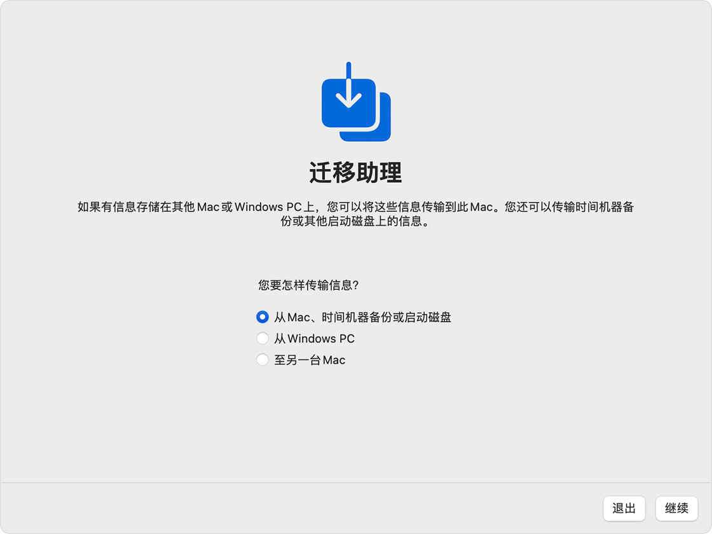
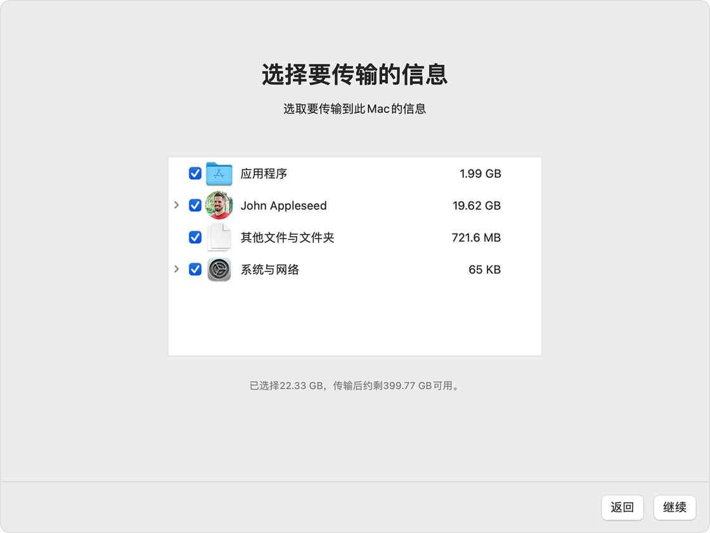

# Mac 迁移指南：换新机后的任务清单 - 少数派

[11 月 23 日更新：2023 年 11 月 23 日更新](#update-0)

**按：**本文原发布于 Apple silicon 最初亮相时的 2020 年底。三年后，Mac 产品线已全部完成架构迁移，Apple silicon 也发展到第三代。为此，我们对本文做了相应更新，希望对选择借这个时间点升级的朋友有所帮助。

- - -

## 引言

适逢年末，不少人可能已经有了升级换新 Mac 的计划。

但在享受新机带来的喜悦同时，还有一件不得不做的麻烦事——数据迁移。尽管听起来只是初始设置中的一个步骤，但数据迁移的效果很大程度上影响到新机的使用体验和之后的工作效率，因此须加重视。

对此，苹果官方有一些指导教程，包括：

-   [出售、赠送或折抵 Mac 前应该执行的步骤](https://support.apple.com/zh-cn/HT201065)；
-   [将内容迁移到一台新的 Mac](https://support.apple.com/zh-cn/HT204350)；

等等。但都略嫌简略，不足以解决迁移过程中的很多常见疑问。

对此，本文准备结合自己几次迁移的经验，从可选途径、考虑因素和具体步骤等方面介绍在 Mac 间迁移数据的方法，希望能为有此需要的读者提供帮助。

由于本文较长，为查阅方便，文中涉及的关键步骤如下图所示（或[下载 PDF 版](https://sspai.com/link?target=https%3A%2F%2Fp178.p0.n0.cdn.getcloudapp.com%2Fitems%2FKoulEmeg%2F5cc80180-2676-4c63-a987-8a3c7c647db5.pdf%3Fv%3D433209ce4d5779e9e7748ae1055bced2)）：

## 一、可选途径

### （一）使用「迁移助理」工具

作为系统内置和官方推荐的工具，[迁移助理](https://support.apple.com/zh-cn/guide/mac-help/mh27921/11.0/mac/11.0)是大多数情况下**最简单、效果最好的迁移方式**。对于 Apple silicon 机型，则几乎更是唯一可行的方式。 

*迁移助理*

迁移助理的使用方式很多：既可以作为初次开机时「设置助理」的一个步骤运行，也可以在完成初始设置、进入系统后单独运行；迁移数据的来源可以是另一台通过雷电、USB 或无线网络等方式连接的 Mac，也可以是外置磁盘上的 macOS 安装或时间机器备份。

但是，和大多数苹果系统的内置功能类似，迁移助理同样具有**简洁度有余、灵活性和信息量不足的缺点**。在迁移范围的选择上，除了少数几个语焉不详的选项，用户并没有太多定制的空间，迁移过程中显示的进度条和时间预测也基本属于娱乐性质。

此外，**迁移助理能否成功运行有一定运气成分**，在 MacRumors 等用户论坛上能看到大量「搬到一半卡住不动了」的哭诉。不过，这一问题似乎近年随系统升级有所改善；少数派编辑部成员多次使用迁移助理的经历也都比较顺利。

### （二）全盘恢复

有过 Windows 维护经验的读者一定对使用 Ghost 备份快速装机不陌生。类似地，Mac 系统的迁移也可以通过在新机上直接恢复旧机的全盘备份来实现。

最简单的方式还是使用时间机器备份：将备份盘连接到新机上，启动到恢复模式，然后选择「从时间机器恢复」即可。

显然，全盘恢复的吸引力在于它是一种「无损」的迁移方式——新机在恢复克隆后将与旧机完全一样，而不用费心考虑是否遗漏。但相应地，这么做也会导致「泥沙俱下」，在迁移范围上没有灵活性，只能将有用和无用的数据一股脑地带进新机；不少软件也不能自动适应新硬件，还是需要重新配置或者激活。因此，本文**并不推荐再继续使用这种方式。**

- - -

**插曲：macOS 磁盘布局的变化和失落的第三方备份软件**

有较长 macOS 使用经历的朋友可能记得，在过去，[SuperDuper!](https://sspai.com/link?target=https%3A%2F%2Fwww.shirt-pocket.com%2FSuperDuper%2F)、[Carbon Copy Cloner](https://sspai.com/link?target=https%3A%2F%2Fbombich.com%2F) 等第三方软件也可以创建具有完整启动盘结构（bootable）的克隆，将其[恢复到新机的内置硬盘](https://support.apple.com/zh-cn/guide/disk-utility/dskutl14062/mac)就实现了迁移的效果。

然而，随着 macOS 改用 APFS 文件系统并对系统分区施以越发严格的保护，磁盘克隆的创建和恢复都越来越困难，出现问题的几率也越来越高。

具体而言：

1.  从 macOS 10.15 Catalina 开始，苹果引入了「宗卷组」的概念，使得系统分区被一分为二成「系统」和「数据」两个宗卷，分别存放系统文件和用户数据，然后通过称为 firmlink 的机制缝合起来。
2.  而从 macOS 11 Big Sur 开始，苹果进一步对「系统」宗卷施以加密签名保护。用来启动系统的甚至都不是真实的「系统」宗卷，而是在启动时为它创建的一个快照。

macOS Ventura 以降的启动宗卷结构（来源：The Eclectic Light Company）

这些变化都是以安全性的名义做出的，但显然会给备份工具提出很大的难题。目前而言，第三方软件能做的仅仅是备份宗卷组中的「数据」部分。雪上加霜的是，苹果为此提供的命令行工具 `asr`（Apple Software Restore）一直处于扶不起的阿斗般的状态，缺乏文档而且故障频发。尽管 SuperDuper! 等工具的开发者已经非常努力地持续跟进，但对于系统迁移场景来说，试错成本还是太高，无法作为推荐方法。作为某种「补偿」，Apple silicon 机型内置的恢复功能也比 Intel 时代靠谱了一些，一定程度上让全盘备份不再是一种刚需。

- - -

### （三）手动迁移

如果你不信任迁移助理这类工具、不满足于其定制选项，或者干脆就是想从头开始设置新机，手动迁移仍然是一个最灵活的选项。事实上，尽管「无缝迁移」听起来是一个值得追求的目标，但旧系统可能随着多年使用积累了不少藏在「死角」的垃圾文件，和虽然用不上、却舍不得删除的资源。借着换新机的机会从头配置一遍使用环境，不仅可以避免四处清理的麻烦，也可以在此过程中进一步明确和了解自己的使用需求。

当然，手动迁移也有一个显而易见的缺点——麻烦。你不仅需要四处寻找要转移的数据，很多配置也无法通过简单的复制粘贴迁移到新机。因此，本文并不建议单独使用手动迁移方式，而是根据下一节讨论的因素，考虑如何在工具迁移和手动迁移间分配比例。

## 二、制定迁移方案的考虑因素

### （一）数据类型

「数据迁移」是一个非常笼统的说法。电脑上数据的价值、功能和位置各不相同，就迁移换机的场景而言，至少可以**将数据分为「文档」「软件」和「环境」三类并予以区分处理：**

**文档：** 指文本文件、PDF、照片、音视频等静态的，由用户主动创建或获取，具有实际内容的数据。尽管文档类数据因具有现实重要性而更受关注，但其迁移实际上是相对简单的：多数用户都会将文档集中存放、主动整理，对其位置和范围相对熟悉，不容易在迁移时遗忘；云存储的普及也进一步降低了管理和迁移的难度。因此，文档类数据可以**事后通过统一拷贝或云同步的方式迁移**，不一定要占用宝贵的初始设置时间。

**软件：** 这里讨论的「软件」仅指软件包本身，不包括其配置文件和附属资源文件。由于 macOS 下软件的安装位置非常统一，几乎都位于 `/Applications` 这一个地方，如果追求效率，可以**在迁移助理步骤先跳过，事后再通过拷贝方式手动迁移，或者用 App Store、Homebrew 等包管理工具统一安装。**

**环境：** 指应用程序设置、系统偏好设置等由软件生成，随使用不断变动，影响软件行为方式和用户使用方式的数据。这些数据不像文档、照片那样具有直接现实价值，但与使用体验和操作效率关系密切；同时位置零散、没有统一的同步方式，往往是在换机过程中比较让人头痛的部分。因此，最好**在初始设置阶段就用迁移助理等工具一步到位地迁移完成**，以免日后的麻烦。

### （二）新旧机器的差异

**硬件差异：** 新旧 Mac 之间的代际差别越大，旧机器上不适用于新硬件的软件、配置就越多，对迁移造成的潜在干扰也就越大。此外，Mac 产品线的移动型号（MacBook）和桌面型号（iMac、Mac mini 和 Mac Pro）在电源策略、硬件调度等方面有着不同的默认设置，同样可能不适合直接迁移。

最后，有时还会存在新机的硬盘容量小于旧机的情况。因此，如果你是从一台[不再受官方支持](https://support.apple.com/zh-cn/HT201624)的 Mac 上迁移，或者在桌面和移动型号 Mac 之间迁移，那么应该考虑提高手动迁移的比例，不要把旧机的配置囫囵吞枣地套用到新机上。

**软件差异：**迁移前最好将旧机器[升级到新版本](https://support.apple.com/HT213768)，避免因 macOS 新旧版本的底层差异造成迁移失败。如果旧机器不支持 macOS Sonoma（具体可以查阅[官方的支持列表](https://support.apple.com/zh-cn/105113)），那么最好不要使用迁移助理。

Mac 机型与支持系统对照图，名称为黑色的可运行 macOS Sonoma（来源：Anthony Reimer）

### （三）迁移条件

**旧机的处置方式：** 不少人都会在购入新机的同时将旧机出售或者转赠，因此在迁移后不久（甚至之前）就无法再操作旧机。

因此，迁移数据时应当向完整性倾斜，不要过多考虑是否会将无用数据导入新机，以免事后无法找回。相反，如果准备继续保留旧机或者不急着转手，就可以向整洁性倾斜，先将关键数据迁移到新机即可；如有遗漏，再随时回旧系统拷贝也不迟。

**可用的备份工具和连接方式：** 尽管迁移助理可以选择多种数据源和连接方式，但最稳定的还是通过雷电或 USB-C 方式连接的时间机器备份盘或 Mac，有线局域网次之，WiFi 传输则很容易出错，应该尽量避免。此外，如果从时间机器备份传输，最好能**使用固态移动硬盘作为备份介质**，机械硬盘在传输配置文件这类小文件时的低性能会很浪费时间。

综上所述，本文推荐**以迁移助理为主、手动迁移为辅的迁移方案**，后文也将以这种方案为主列举具体步骤。

## 三、具体步骤

### （一）旧机上的准备

#### 第一步：创建备份

备份是迁移工作的起点和基础。如果准备从时间机器迁移数据，备份的干净、完整性显然是迁移成功的关键。即使打算全部手动迁移，旧机的完整备份也可以在出现问题时作为安全网。

如前所述，在创建用于迁移的备份之前，应当先**将系统升级到与新机相同的高版本。此外，最好先花点时间清理系统中的垃圾文件**（可以使用 [OmniDiskSweeper](https://sspai.com/link?target=https%3A%2F%2Fwww.omnigroup.com%2Fmore%23OmniDiskSweeper) 等第三方工具，也可以使用内置的[「避免杂乱」功能](https://support.apple.com/zh-cn/HT206996#reduceclutter)），并使用磁盘工具中的[「急救」功能](https://support.apple.com/zh-cn/guide/disk-utility/dskutl1040/20.0/mac/11.0)**修复磁盘错误**，确保得到的是相对干净的备份。

备份步骤本身则非常简单：如果此前已经使用过时间机器备份系统，那么连上备份盘，点击菜单栏的时间机器图标 >「立刻备份」，等待创建一份最新的备份即可。否则，根据[官方指南](https://support.apple.com/zh-cn/HT201250)新建一份备份。

此外，还有一些值得额外关注和单独备份的重点位置：

**照片图库：** 虽然时间机器备份包括了照片图库的位置，即`~/Pictures/Photos Library.photoslibrary`，iCloud 也会同步照片，但考虑到 iCloud 并不完全靠谱，仍然建议将照片库**单独备份到安全位置**（如外置硬盘、NAS、其他云存储服务等）。

备份之前，注意确认在照片的偏好设置中选中了「将原片下载到此 Mac」而非「优化存储空间」，保证所备份的是完整的原始照片。

**音乐资料库：** Apple Music 本身是音乐流播服务，始终存在云端；但那些自行上传的音乐文件以及自建的播放列表（一般位于 `~/Music/Music/`）仍然建议单独备份。

与照片库的情况类似，这些本地音乐文件有时会在释放空间的过程中被清除（在音乐 app 中曲名右侧显示一个云图标），从而无法被备份涵盖。

避免遗漏的技巧是：点击「新建」>「智能播放列表」，将「云端状态」为「上传」设为筛选条件，即可找出所有自行上传的曲目；然后，在该播放列表上点击右键选择「下载」将其一次性保存到本地，单独备份即可。

**命令行工具配置：** 对于需要使用命令行工具的进阶用户，建议额外备份用户文件夹根目录下以 `.` 开头的配置文件或文件夹（dotfiles，如 `~/.zshrc`、`~/.vimrc`、`~/.config/`），并用 [Homebrew Bundle](https://sspai.com/link?target=https%3A%2F%2Fdocs.brew.sh%2FManpage%23bundle-subcommand) 功能导出已安装的软件包列表。

当然，dotfile 更好的备份方式或许是[使用 Git](https://sspai.com/link?target=https%3A%2F%2Fdotfiles.github.io%2F)。

#### 第二步：退出、解绑各类账号、软件

**退出 iCloud：** 打开「系统偏好设置」>「Apple ID」。在边栏中选择「概览」，然后点击「退出登录」。

退出过程中会提示是否将 iCloud 中的文档、照片、密码等信息从本机删除，可以根据旧机的处置计划自行判断：如果准备转手，由于后续步骤会抹除磁盘，这里可以暂时不删除以节省时间。

如果启用了「查找我的 Mac」功能，**务必根据系统提示在此时关闭**（特别是对于近年[配有 T2 芯片](https://support.apple.com/zh-cn/HT208862)的 Intel 机型 和 Apple silicon 机型），以免激活锁残留，影响之后的重置和转让。如果确实忘记关闭就直接重置了系统，补救方法是通过 iCloud 网页版或其他设备上的「查找」app [远程关闭激活锁](https://support.apple.com/zh-cn/guide/icloud/mmfc0eeddd/icloud)。

**解除 Apple Music/iTunes 授权：** 对于 Apple Music 或者从 iTunes 上购买的内容，DRM 保护机制要求只有经授权的电脑才能访问。因此，建议解除旧机的授权，以免其继续占用 5 台设备的限额。

方法是：打开音乐 app（或旧版系统中的 iTunes），点击「账户」>「授权」>「取消对这台电脑的授权」。如果重置旧机前忘记了取消授权，可以在新机上点击「账户」>「查看我的账户」，然后选择「取消对所有电脑的授权」。

**其他软件：** 大多数软件的授权都会限制同时安装的设备数量，因此在迁移之前应当进行反激活、退出登录等操作。简便起见，可以将软件的序列号、许可证文件等作为笔记和附件保存在备忘录 app 中，这样新机上打开 iCloud 同步即可直接找到；也可以用 1Password 等第三方软件管理。

除此之外，苹果的官方指引还提示[重置 NVRAM](https://support.apple.com/zh-cn/HT204063)（仅适用于 Intel 机型）、取消配对蓝牙设备等。实践角度，这些步骤并非特别必要，对于迁移流程影响不大，可以跳过。

### （二）新机上的配置

#### 第一步：运行迁移助理

完成了旧机上的备份和准备工作，就可以正式开始新机的设置了。在初次开机时，设置助理会提示是否将数据传输到新 Mac 上，点击确认并连接、选择准备使用的数据源。如之前讨论，**建议优先使用固态硬盘上的时间机器备份，或者通过雷电或 USB-C 方式连接旧机迁移。**

接着，迁移助理会提示选择要传输的信息，可选范围及其具体含义如下：

**应用程序：** 即位于 `/Applications` 下的各项应用程序，但不包括 Safari 等系统内置的受保护程序，这些程序会被替换为到新机自带的高版本。

**用户文件夹：** 即位于 `/Users` 下以用户名命名的文件夹中的数据，可以进一步选择要转移的范围，如桌面、文档、下载、日历、通讯录等。

**其他文件与文件夹：** 主要为位于 `/Library`、`~/Library` 等处的软件配置和数据等，也包括位于 `/usr/local` 等位置的命令行工具。

**系统与网络：** 包括壁纸、网络等设置。

如前文讨论，在同步盘的帮助下，文档的转移是相对容易的，而应用程序也可以比较方便地通过 App Store、Homebrew 等方式集中安装。因此，**如果追求迁移效率，可以有选择地取消「应用程序」和「用户文件夹」下部分项目的勾选，优先转移「其他文件和文件夹」和「系统与网络」两项**，以保证新机可以继承熟悉的使用环境。

选择完迁移范围后，就可以起身做点别的了。迁移所需的时间根据数据规模、数据源和连接方式而异。经验上，由于我的数据量不大（100 多 GB），在 USB-C 连接下半个多小时可以完成复制。

对于迁移助理在运行过程中不幸卡住的情况：

-   **如果发生在开始复制数据之前（即统计待迁移数据信息的环节）：** 直接取消即可，然后尝试换一种数据源或连接方式。
-   **如果发生在开始复制数据之后：** 长按电源键关闭系统，开机时按住 ⌘R（Intel 处理器机型）或长按电源键（Apple 芯片机型）重启进入恢复模式，重新安装 macOS，然后从头开始设置系统。

#### 第二步：安装、启用和授权软件

虽然迁移助理可以迁移软件，但并非所有软件都能在迁移后直接在新机上工作。因此，进入系统后建议按照以下优先级安装、启用和重新授权：

1\. **高权限软件：** 主要是驱动程序等关系到硬件或系统底层的软件，如 Paragon NTFS（需要安装内核扩展来支持 Windows 文件格式）、Audio Hijack（需要安装高权限辅助程序来截获系统音频）等。

随着 macOS 日益收紧第三方软件的权限，这些工具往往需要多次授权和重启才能完成安装，因此最好在系统比较干净时先做到一劳永逸，避免日后的麻烦。

2. **同步工具：** 如果使用 iCloud Drive 以外的同步服务，一般需要重新登录。关于新机启用同步工具的注意事项见下文。

3\. **（可选）命令行工具：** 尽管未明确提及，但迁移助理的「其他文件与文件夹」选项涵盖了 `/Library/Developer/`（[Command Line Tools 软件包](https://developer.apple.com/library/archive/technotes/tn2339/*index.html#//apple_ref/doc/uid/DTS40014588-CH1-WHAT_IS_THE_COMMAND_LINE_TOOLS_PACKAGE*)的安装位置）和 `/usr/local/bin/`（Homebrew 等用户自行安装软件包的位置）等与命令行环境相关的路径。

考虑到命令行软件用于存储配置的隐藏文件（「dotfiles」）一般位于用户文件夹根目录，同样会被迁移，因此检查是否迁移成功即可。如果发现有遗漏，可以通过之前步骤建立的备份和 Homebrew Bundle 功能找回。

4\. **操作辅助类工具：** 例如快速启动（Alfred）、窗口管理（Moom）、密码管理（1Password）、菜单栏整理（Bartender）等工具。这些工具虽然并非工作必须，但用惯后一旦缺失就会十分别扭，通常也需要授予辅助操控、磁盘访问等权限才能正常运行。因此，最好「长痛不如短痛」，尽早安装设置好，以免影响使用效率。

5\. **工作、学习中的常用软件：** Office、Adobe CC 等。

6\. 其他软件。

**如果是迁移到 Apple silicon，还需要考虑处理器架构带来的变化：**

-   **图形界面软件：** 可以到 [Does it ARM](https://sspai.com/link?target=https%3A%2F%2Fdoesitarm.com%2F) 等网站查阅其是否适配了 ARM 架构。不过，就 2023 年底的情况而言，绝大多数常用软件都已经完成了迁移，而对于剩余部分，经过 macOS 内置翻译工具 Rosetta 也一般是可以流畅使用的，无需担心。
-   **命令行工具：** 包管理工具 Homebrew 本身需要重新安装到新路径 `/opt/homebrew/`。其他工具可以到 [Homebrew 的 GitHub issue 页面](https://sspai.com/link?target=https%3A%2F%2Fgithub.com%2FHomebrew%2Fbrew%2Fissues%2F7857)查询适配情况。如果已经适配，则应该卸载旧版并重新安装针对 ARM 编译的版本到 `/opt`路径。具体步骤和注意事项可以参考我[之前的文章](https://sspai.com/link?target=https%3A%2F%2Ftype.cyhsu.xyz%2F2020%2F12%2Fuse-homebred-on-m1-macs%2F)。

#### 第三步：迁移软件配置和数据

如前所述，迁移助理选项中的「其他文件和文件夹」「系统和网络」两项已经涵盖了大多数软件数据和支持文件。如果事后发现存在遗漏，或者有手动迁移、备份的需求，则可以根据以下不同情况分别处理：

**自带配置同步功能的软件：** 如 Chrome、Firefox、VS Code 等，只要重新登录账号即可自动恢复原来的设置和插件。

**支持从外部路径导出和读取配置的软件：** 如 Alfred、Keyboard Maestro、Hazel 等。在旧机上将配置文件导出到一个同步盘中的位置，然后在新机上设置从该位置读取配置即可。

**不支持配置同步或导出的软件：** 根据 macOS 的惯例，绝大多数软件都会将配置文件和数据存在以下位置之一，其拷贝到新机上的对应位置即可实现相关数据的迁移：

|     |     |     |
| --- | --- | --- |
| **数据类型** | **路径** | **举例** |
| **所有用户共用的软件资源、软件设置** | `/Library/Application Support/<软件名称或 Bundle ID>/`  `/Library/Application Support/<Bundle ID>.plist` | 第三方应用现在一般很少使用 |
| **当前用户的软件资源、软件设置** | `~/Library/Application Support/<软件名称或 Bundle ID>/`  `~/Library/Preferences/<Bundle ID>.plist` | Chrome 的数据位于 `~/Library/Application Support/Google/Chrome` |
| **沙盒环境运行的软件（以 App Store 渠道下载的软件为主）的资源和设置** | `~/Library/Containers/<软件名称或 Bundle ID>/` | 微信的账号信息、聊天记录位于 `~/Library/Containers/com.tencent.xinWeChat/Data/Library/Application Support/com.tencent.xinWeChat/` |
| **若干沙盒环境运行的软件共享（如同一厂商开发的多个软件之间）的资源和设置** | `~/Library/Group Containers/<Group ID>/` | Office 的自定义模板、VBA 脚本位于 `~/Library/Group Containers/UBF8T346G9.Office/User Content.localized/` |

（如有兴趣进一步了解，可查阅官方文档 [*macOS Library Directory Details*](https://developer.apple.com/library/archive/documentation/FileManagement/Conceptual/FileSystemProgrammingGuide/MacOSXDirectories/MacOSXDirectories.html#//apple_ref/doc/uid/TP40010672-CH10-SW1) 和 [*Container Directories and File System Access*](https://developer.apple.com/library/archive/documentation/Security/Conceptual/AppSandboxDesignGuide/AppSandboxInDepth/AppSandboxInDepth.html#//apple_ref/doc/uid/TP40011183-CH3-SW6)。）

如果你不能确定某个软件的数据保存在何处，除了向搜索引擎求助，还可以使用免费的 [AppCleaner](https://sspai.com/link?target=https%3A%2F%2Ffreemacsoft.net%2Fappcleaner%2F) 软件。它的本职工作虽然是卸载，却也可以用来查找软件在系统各处的痕迹；将随意一个软件拖入其窗口，就可以看到所有相关的文件和目录，然后针对性地备份和拷贝即可。

用 AppCleaner 查找软件的关联路径

#### 第四步：迁移同步文件和媒体资料库

**iCloud Drive：** 如果使用 iCloud Drive 作为云同步工具，那么初始设置中已经完成了启用步骤，但仍然可能需要**手动启用「桌面」和「文稿」文件夹的同步**：打开「系统偏好设置」 > 「Apple ID」 > 「iCloud」，点击「iCloud 云盘」旁边的「选项」，然后勾选「桌面与文稿文件夹」。

**其他同步工具：** 如果使用其他同步服务，则一般需要重新登录。由于大多同步文件夹都在用户主目录下（如 `~/Dropbox/` 和 `~/OneDrive`），其内容可能已经被迁移助理带到了新机上，只要在登录过程中重新将其选为同步位置，同步工具就会自动将其与云端的数据合并。

不过，在此之前最好先**确认本地数据的完整性**，以免存在缺损，进而在合并过程中将云端数据覆盖。如果不放心，可以先删除这些同步文件夹，直接从云端重新同步。

**照片图库：** 默认情况下，系统会将位于 `~/Pictures/Photos Library.photoslibrary` 的图库作为「系统照片图库」并通过 iCloud 同步。如果你此前通过手动方式备份了图库，可以将其恢复到该位置以让系统识别。

如果希望将照片图库保持在非默认位置（例如为了节省空间放在外部磁盘上），可以在启动照片 app 的同时按住 Option 键，然后在「选取图库」对话框中选择要使用的外部图库。然后，在照片 app 的偏好设置中勾选「用作系统照片图库」并重新启用 iCloud 照片功能（如需）。该图库中的照片将与 iCloud 中的现有照片合并，并上传到 iCloud。

**音乐资料库：** 与照片图库类似，系统默认的音乐资料库位于 `~/Music/Music/`下，可以将手动备份恢复到该位置让系统识别。注意合法的资料库文件夹应该包含一个 `Music Library.musiclibrary`（记录偏好设置和曲库信息）和一个 `Music` 文件夹（存放媒体文件）。

如果系统没有正确识别复制而来的资料库（或者希望使用其他位置的资料库），可以在启动音乐 app 的同时按住 Option 键，然后选择资料库文件夹下的 `Music Library.musiclibrary`。然后，在音乐 app 的偏好设置中勾选「同步资料库」以启用 Apple Music 同步功能。

### （三）抹除和重置旧机

当确认所需的数据都迁移完成、新机使用基本正常后，就可以重置旧机以便后续处置。

如果旧机是 Apple silicon 机型，那么可以直接通过「系统设置」完成，功能位于「通用」>「传输或还原」>「抹掉所有内容和设置」。

如果旧机是 Intel 机型，则需要在恢复模式下完成，包括[抹除磁盘](https://support.apple.com/zh-cn/HT208496)和[重新安装系统](https://support.apple.com/zh-cn/HT204904)两步，官方[支持文章](https://support.apple.com/zh-cn/HT201065)都有详细的说明，在此不赘。

- - -

#### 插曲：关于抹除旧机数据的必要性

如果你准备将旧机转售，可能会顾虑仅仅抹除硬盘并重装系统是否足以保护隐私，是否需要一些额外步骤来保证数据已经被充分擦除。这当然是合理的顾虑；事实上，早期版本磁盘工具曾经提供「将所有数据清零」和「安全抹掉」等功能，通过向硬盘中反复填充空白数据，减少事后通过软件恢复的可能性。

但是，苹果已经在搭载固态硬盘的 Mac 上隐藏了这些功能。根据苹果一篇[支持文章](https://support.apple.com/zh-cn/HT201857)的说法，对固态硬盘执行标准的擦除操作已经能使数据难以恢复，因为固态硬盘的工作机制是将写入数据分散在各处（主要是出于减少磨损的考虑），擦除后很难从碎片中拼出完整的信息。

苹果指出，确保固态硬盘上数据安全的更好方式是使用「文件保险箱」（FileVault），这是 macOS 系统自带的硬件加密技术，一般情况下已经默认启用了（你可以到「系统偏好设置」>「安全和隐私」>「FileVault」确认或手动启用）。由于 FileVault 加密后的数据只能通过加密密钥和对应的密码解锁，而擦除操作会删除加密密钥，即使有数据残留，也因无法解密而完全无用。

当然，如果你确实希望通过反复写入方式擦除硬盘，仍然可以通过终端下的 `diskutil secureErase` 命令实现，具体方式参见该命令的手册（`man diskutil`）。你也可以阅读维基百科关于[固态硬盘数据遗留](https://sspai.com/link?target=https%3A%2F%2Fen.wikipedia.org%2Fwiki%2FData_remanence%23Data_on_solid-state_drives)的讨论和备份解决方案商 BackBlaze 的[博客文章](https://sspai.com/link?target=https%3A%2F%2Fwww.backblaze.com%2Fblog%2Fhow-to-wipe-a-mac-hard-drive%2F)来进一步了解这一话题。

- - -

## 结语

迁移并非能一步到位的工作。尽管八九成的事项可以在两三小时到半天之内完成，但剩下的一两成「长尾」则可能要在接下来的几天以至几周中，随着日常使用逐渐补齐。

事实上，大多数迁移失误都不是出于技术障碍，而是由于图快、图全，缺少耐心。值得时刻提醒自己的是：新机看起来再朝气蓬勃，也是一张白纸，需要经过磨合才能逐渐上道；旧机相比之下再黯然失色，也是掌握你使用习惯和重要数据的坚实后盾。迁移虽然是一件麻烦差事，但也是少有的全面整理数据、反思使用习惯的机会。成功迁移的回馈，不仅是熟悉却更顺畅的使用环境，还有对自身需求的进一步理解和工作流程的优化。

预祝迁移顺利。

\> 下载少数派 [客户端](https://sspai.com/page/client)、关注 [少数派公众号](https://sspai.com/s/J71e)，了解更多实用 Mac 技巧 💻

\> 特惠、好用的硬件产品，尽在 [少数派 sspai 官方店铺](https://shop549593764.taobao.com/?spm=a230r.7195193.1997079397.2.2ddc7e0bPqKQHc) 🛒

以下内容于 11 月 23 日更新

2023 年 11 月 23 日更新

本文原发布于 Apple silicon 最初亮相时的 2020 年底。三年后，Mac 产品线已全部完成架构迁移，Apple silicon 也发展到第三代。为此，我们对本文做了相应更新，希望对选择借这个时间点升级的朋友有所帮助。
