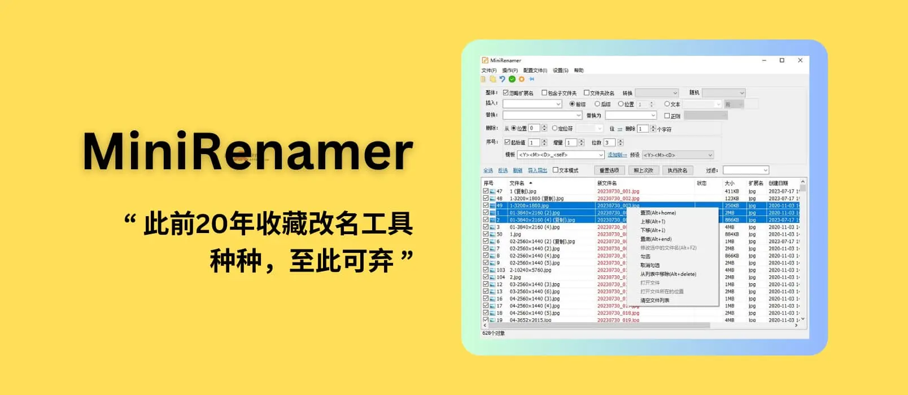

# MiniRenamer - 支持实时预览的批量重命名工具，用户：此前20年收藏改名工具种种，至此可弃[Win] - 小众软件

**MiniRenamer** 是一款被用户誉为「此前20年收藏改名工具种种，至此可弃」的工具，主要功能是实时预览重命名、正则，支持改名模板等功能。@[Appinn](https://www.appinn.com/minirenamer/)

来自

[↓↓↓](https://meta.appinn.net/c/faxian/10)  
  
**发现频道**  
  
[↑↑↑](https://meta.appinn.net/c/faxian/10)

，@lforl 同学推荐，以及 @Duah 进行了大量的反馈。

MiniRenamer 提供自由的文本改名模式，支持拖拽文件或文件夹，正则，并可自定义添加常用改名模板。提供序号、插入、删除、替换等改名方式，方便进行批量操作。能记住常用改名记录，通过文件创建时间、名字等智能排序。其小巧绿色且便携，资源高效，压缩后只有几十K。

![MiniRenamer - 支持实时预览的批量重命名工具，用户：此前20年收藏改名工具种种，至此可弃[Win] 1](assets/1698897797-663d2748f70741b07e26d323982576d3.gif "MiniRenamer - 支持实时预览的批量重命名工具，用户：此前20年收藏改名工具种种，至此可弃[Win] 2")

@lforl 同学这样评价：

非常轻巧灵活的改名工具。

集最近20年经典批量改名拖把更名(老了右键不灵了)、菲菲更名（太繁琐）、reName pro（国外收费软件）等各式常见改名软件的优点于一身！

没加壳没压缩250K不到。之前用.net写过，考虑到更精巧，更无框架依赖，特花很多心血采用C++写的，非常精巧。绿色、免费。

XP、WIN7、WIN10、WIN11下测试可用。

几千个文件发送到或者拖放到软件界面，批量改名，都很流畅。给你爱不释手，叹为观止的改名感受！

1.  支持文本自由改名模式（首创关键：自由直观即时预览），给你最灵活简便的体验:
2.  你可以轻松快捷的复制到其他文本编辑器中或者excel中，自由编辑后直接粘贴回来。
3.  支持拖拽文件或文件夹、支持右键、支持**右键发送到**；
4.  支持正则（可自定义添加），附送常用改名模板（可自定义添加）；
5.  常用改名方式：序号、插入、删除、替换，一目了然，便于批量操作；
6.  记忆常用改名记录（首创）；一键重复上次改名动作（首创）
7.  可以灵活排序，根据文件创建时间、名字等智能排序；
8.  可以**置顶**、文件列表可以灵活定义、可以快捷过滤排除例外的文件：
9.  支持正则表达式同时也支持简单的通配符?和\*（类似于everything和word的表现）
10.  轻巧绿色、便携（压缩后几十K，不压缩也很小）、节省资源高效。

![MiniRenamer - 支持实时预览的批量重命名工具，用户：此前20年收藏改名工具种种，至此可弃[Win] 2](assets/1698897797-c3adbb5ed8d1adfbad11c9ae62651af8.png "MiniRenamer - 支持实时预览的批量重命名工具，用户：此前20年收藏改名工具种种，至此可弃[Win] 3")

## **寄言**

创作windows桌面工具非常耗精力，全靠热情和毅力。无数次测试和调整，仅希望得到您的由衷喜欢和赞叹！充分把玩后，如您有体会或者心得，可以在此留言，也可以到官网留言簿提建议。

不建议你马上轻易提建议，建议你用过很多次以后，觉得真的的确是香，但是感觉到了不足，再提议。你想到的，我们可能早已经反复推敲多日！你必须真正反复用了，才能体会它的妙处！

## 获取

-   [↓↓↓](https://abc100.net/106/)  
      
    官网  
      
    [↑↑↑](https://abc100.net/106/)
    
-   [↓↓↓](https://meta.appinn.net/t/topic/45347)  
      
    发现频道  
      
    [↑↑↑](https://meta.appinn.net/t/topic/45347)
    

原文：https://www.appinn.com/minirenamer/
