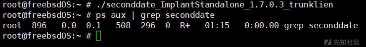
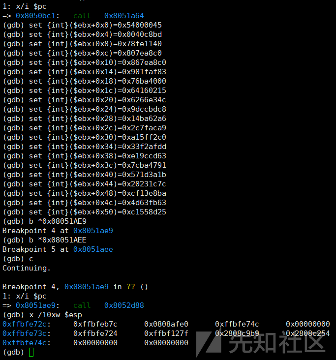

# NSA组织“二次约会”freebsd平台样本剖析 - 先知社区

NSA组织“二次约会”freebsd平台样本剖析

* * *

## 概述

在前两篇文章中，我们以NSA组织“二次约会”间谍软件的1048/1060通信载荷样本作为案例，对其样本代码、会话劫持原理、网络通信模型进行了详细的剖析；同时我们还对所有公开的“二次约会”间谍软件的版本信息、远控指令进行了梳理及对比分析，我们发现NSA组织“二次约会”间谍软件支持在Linux、FreeBSD、Solaris、JunOS等各类操作系统上运行，适用范围较广。

由于前两篇文章中，我们研究分析的1048/1060字节通信载荷样本均是在linux系统中运行，因此我们接下来尝试对适用于freebsd平台“二次约会”样本进行研究分析：

*   基于《NSA组织“二次约会”间谍软件通信模型剖析与对比》文章中“样本版本梳理及对比”章节内容，我们发现56字节通信载荷样本主要适用于freebsd系统，不定长字节通信载荷样本适用范围较广，适用于Linux、FreeBSD、Solaris等操作系统；
*   通过对比各版本样本的伪代码，发现NSA组织会随着样本版本迭代，从通信特征、通信算法、代码框架、编译选项、字符串加密等多个角度更新优化样本代码，加大逆向人员对其样本进行分析的难度；
*   通过多种尝试，构建freebsd系统环境，在对freebsd平台样本进行调试分析的过程中，由于程序触发多种异常导致进程退出，因此，笔者通过GDB指令对异常点函数进行绕过，强制向数据包处理函数传递IP载荷数据，并跳转至数据包处理函数处有效执行功能代码，实现在样本无法正常运行的情况下，仍可有效分析其核心功能代码的目的；
*   由于前期1048/1060字节通信载荷样本的通信解密程序无法成功解密56/60字节通信载荷样本的通信数据，因此，笔者又对通信模型进行了对比分析，发现其通信模型的不同点，并再次使用GO语言实现56/60字节通信载荷样本的通信模型解密；

## 迭代样本对比

通过对“二次约会”各版本样本的功能代码进行对比，发现随着样本的版本迭代，此系列样本存在以下几个方面的演变过程：

### 通信特征越来越隐蔽

基于《NSA组织“二次约会”间谍软件通信模型剖析与对比》文章中“样本版本梳理及对比”章节内容，笔者发现：

*   样本从最初的大载荷通信（1048、1060）演变为小载荷通信（56、60），再到最后的不定长通信；
*   若尝试在海量流量数据中对其进行检测：
    *   大载荷UDP通信数据肯定比小载荷UDP通信数据少，因此对检测系统的性能影响更小；
    *   针对不定长UDP通信数据，意味着需要对大多数UDP数据包进行校验检测，处理的流量数据越多，对性能的影响越大；
*   样本的大载荷通信、小载荷通信中均可直接基于明文进行校验，不定长通信载荷中暂未发现明文特征；
    *   通信载荷数据的output\[:4\]数据与output\[4:8\]数据相加等于0x61E57CC6；

### 通信算法优化

通过对比分析，笔者发现：

*   大载荷通信（1048、1060）使用的是修改后的RC6算法，通信算法中对RC6算子、keyWords循环次数进行了修改；
*   小载荷通信（56、60）也是使用的是修改后的RC6算法，通信算法中对RC6算子进行了修改；
*   不定长载荷通信使用的是Salsa20算法，算法的加解密性能更好；

### 代码框架优化

通过对比分析，笔者发现：

*   随着版本的迭代，样本逆向分析的难度越来越大，代码复杂程度越来越高；
*   大载荷通信（1048、1060）、小载荷通信（56、60）样本中，通过调用libpcap 库与 libnet 库中的函数实现网络流量嗅探及特定网络会话劫持篡改功能；
*   不定长载荷通信样本中，通过调用使用BPF技术捕获数据包；

### 编译选项优化

通过对比分析，笔者发现：

*   1048字节通信载荷样本中，部分反编译代码函数有明显符号标记；
*   56字节通信载荷样本中，反编译代码函数中的明显符号标记被删除，但调用的库代码相同；

### 远控指令操作简单化

通过对比分析，笔者发现：

*   随着版本的迭代，样本远控指令从最初只支持11个，到后续支持19个；
*   随着版本的迭代，从攻击操控者角度新增了部分远控指令，例如：rulewizard指令功能与rule指令功能一致，均是用于配置规则，但rule指令基于命令参数实现规则配置，rulewizard指令基于一步步的问题提示引导操控者填写规则内容，实现配置规则的功能；

rulewizard指令截图如下：

[](https://xzfile.aliyuncs.com/media/upload/picture/20231127094743-f4ad2036-8cc6-1.png)

### 字符串加密

通过对比分析，笔者发现：

*   在低版本样本中，样本中部分字符串是以明文形式进行存放的；
*   在高版本样本中，以明文形式进行存放的字符串已经被加密存放了，且相同字符串的加密数据不同；

低版本样本代码截图如下：

[](https://xzfile.aliyuncs.com/media/upload/picture/20231127094807-036d7f58-8cc7-1.png)

高版本样本代码截图如下：

[](https://xzfile.aliyuncs.com/media/upload/picture/20231127094822-0bd6c6fe-8cc7-1.png)

## Freebsd系统环境构建

需要对适用于freebsd平台的“二次约会”样本进行研究，则需要构建freebsd操作系统环境。

通过对比分析所有公开的freebsd平台样本，发现其指令集架构为x86、x86\_64，因此我们只需要安装对应的操作系统即可，相关文件信息如下：

[](https://xzfile.aliyuncs.com/media/upload/picture/20231127094837-15098a54-8cc7-1.png)

通过文件信息可知，相关freebsd间谍软件对应的系统版本为4.4（2001年发布）、5.0（2003年发布）、5.4（2004年发布），因此，笔者准备尝试安装上述操作系统，通过搜索引擎查找发现可通过 [http://ftp-archive.freebsd.org/pub/FreeBSD-Archive/old-releases/i386/ISO-IMAGES/4.4/](http://ftp-archive.freebsd.org/pub/FreeBSD-Archive/old-releases/i386/ISO-IMAGES/4.4/) 网站下载安装低版本的freebsd系统；成功下载待安装镜像后，笔者开始尝试构建低版本freebsd系统，逻辑上安装操作系统应该很简单，但上述操作系统版本实在太老且无相关资料，因此，在操作系统构建过程中发现了不少问题，导致一直无法在操作系统中执行第三方程序。

鉴于无法安装适当的操作系统运行环境，便只能更换方案，安装其他版本的操作系统。

最终，笔者最后选择使用的是 [https://mirrors.aliyun.com/freebsd/releases/i386/i386/ISO-IMAGES/12.4/?spm=a2c6h.25603864.0.0.7c632d0aqiXTjB](https://mirrors.aliyun.com/freebsd/releases/i386/i386/ISO-IMAGES/12.4/?spm=a2c6h.25603864.0.0.7c632d0aqiXTjB) 网站下的FreeBSD-12.4-RELEASE-i386-dvd1.iso镜像文件，基于此镜像文件，可成功安装操作系统和第三方包，第三方包包括：逆向分析所需的gdb、ssh等工具，以及间谍软件运行所需的库文件。

### 环境构建

*   逆向工具

```plain
#更新软件包索引
pkg update
#安装gdb
pkg install gdb
```

*   运行报错处理

在开始样本分析前，发现缺少"libc.so.4"、“libc.so.6”等链接库，相关截图如下：

[](https://xzfile.aliyuncs.com/media/upload/picture/20231127094859-21fe21ca-8cc7-1.png)

经过分析，发现可执行如下命令处理：

```plain
#提示找不到“libc.so.x”文件
pkg install misc/compat4x
pkg install misc/compat5x
pkg install misc/compat6x
pkg install misc/compat7x
pkg install misc/compat8x
pkg install misc/compat9x
```

## freebsd平台样本分析

本次案例中，使用seconddate\_ImplantStandalone\_1.7.0.3\_trunklien样本作为调试案例。

### 挫折-样本执行

在尝试对freebsd平台seconddate\_ImplantStandalone\_1.7.0.3\_trunklien样本进行调试时，发现运行样本后，进程列表中无此进程，并且使用控制端也无法正常连接；同时，运行样本后，也未发现任何报错情况，相关截图如下：

[](https://xzfile.aliyuncs.com/media/upload/picture/20231127094916-2c652028-8cc7-1.png)

### 曙光-环境没问题

由于程序无法运行，因此推测可能是由以下原因引起：

*   系统环境不适配；
*   程序调用的链接库代码不适配；
*   程序遇到异常退出了；

尝试使用gdb调试，发现可以使用gdb开展正常调试活动，确定此样本是可以在此系统环境中运行的，相关截图如下：

[](https://xzfile.aliyuncs.com/media/upload/picture/20231127094931-358cd51a-8cc7-1.png)

### 修复-fork函数问题

在确定此样本是可以在此系统环境中运行后，于是，笔者开始正常的调试活动，但在调试过程中，又发现在进入核心功能代码前，无论怎么下断点，程序均会异常退出调试，相关运行情况如下：

```plain
root@freebsdOS:~ # gdb seconddate_ImplantStandalone_1.7.0.3_trunklien
GNU gdb (GDB) 13.2 [GDB v13.2 for FreeBSD]
Copyright (C) 2023 Free Software Foundation, Inc.
......
(gdb) set follow-fork-mode child
(gdb) set disassembly-flavor intel
(gdb) display /i $pc
1: x/i $pc
<error: No registers.>
(gdb) b *0x080495F4     #start函数
Breakpoint 1 at 0x80495f4
(gdb) r
Starting program: /root/seconddate_ImplantStandalone_1.7.0.3_trunklien 

Breakpoint 1, 0x080495f4 in ?? ()
1: x/i $pc
=> 0x80495f4:   push   ebp
(gdb) b *0x0804992A
Breakpoint 2 at 0x804992a
(gdb) c
Continuing.
[Attaching after LWP 100128 of process 952 fork to child LWP 100126 of process 954]
[New inferior 2 (process 954)]
[Detaching after fork from parent process 952]
[Inferior 1 (process 952) detached]
[Attaching after LWP 100126 of process 954 fork to child LWP 100130 of process 955]
[New inferior 3 (process 955)]
[Detaching after fork from parent process 954]
[Inferior 2 (process 954) detached]
[Switching to LWP 100130 of process 955]

Thread 3.1 hit Breakpoint 2, 0x0804992a in ?? ()
(gdb)
```

相关截图如下：

[](https://xzfile.aliyuncs.com/media/upload/picture/20231127094947-3f0bbd5e-8cc7-1.png)

[](https://xzfile.aliyuncs.com/media/upload/picture/20231127095004-49053e5c-8cc7-1.png)

确定问题后，尝试对问题进行排查，对报错前的代码进行调试分析，发现在执行核心功能代码前，样本将执行部分初始化操作，例如开启子进程等行为，当样本调用fork函数开启子进程时，由于fork函数执行失败引发异常，相关引发异常截图如下：

[](https://xzfile.aliyuncs.com/media/upload/picture/20231127095020-523a08ea-8cc7-1.png)

**样本执行过程中引发异常，我们就无法继续往下分析了吗？**

**当然不是**，我们可以使用gdb修改EIP，强制程序绕过异常代码。

操作流程如下：

```plain
root@freebsdOS:~ # gdb seconddate_ImplantStandalone_1.7.0.3_trunklien
GNU gdb (GDB) 13.2 [GDB v13.2 for FreeBSD]
Copyright (C) 2023 Free Software Foundation, Inc.
......
(gdb) set follow-fork-mode child
(gdb) set disassembly-flavor intel
(gdb) display /i $pc
1: x/i $pc
<error: No registers.>
(gdb) b *0x080495F4
Breakpoint 1 at 0x80495f4
(gdb) r
Starting program: /root/seconddate_ImplantStandalone_1.7.0.3_trunklien 

Breakpoint 1, 0x080495f4 in ?? ()
1: x/i $pc
=> 0x80495f4:   push   ebp
(gdb) b *0x08049906
Breakpoint 2 at 0x8049906
(gdb) c
Continuing.

Breakpoint 2, 0x08049906 in ?? ()
1: x/i $pc
=> 0x8049906:   call   0x8049988
(gdb) set $eip=0x0804990B   #修改eip强制绕过fork函数
(gdb) ni
0x080498cb in ?? ()
1: x/i $pc
=> 0x80498cb:   mov    eax,DWORD PTR [ebp-0x80]
(gdb) b *0x0804992A     #相同断点处，成功执行
Breakpoint 3 at 0x804992a
(gdb) c
Continuing.

Breakpoint 3, 0x0804992a in ?? ()
1: x/i $pc
=> 0x804992a:   call   0x8049a80
(gdb)
```

[](https://xzfile.aliyuncs.com/media/upload/picture/20231127095038-5d0e1aea-8cc7-1.png)

### 修复-网络流量嗅探函数问题

继续调试样本，发现样本在sub\_8049AC0函数代码中调用获取网卡信息的函数时，获取网卡信息的函数无法成功获取网卡信息，因此在未执行网络流量嗅探代码前即将退出程序，相关代码截图如下：

[](https://xzfile.aliyuncs.com/media/upload/picture/20231127095055-6736bf68-8cc7-1.png)

**无法执行网络流量嗅探代码，就无法对后续远控指令及通信行为进行分析了吗？**

**不是**

虽然我们无法执行网络流量嗅探代码，但我们可以对比前期linux平台样本分析情况，了解网络流量嗅探功能代码只是用于筛选符合自身特征的数据包，因此在网络流量嗅探代码后，肯定有处理数据包的函数，我们可以尝试在不破坏程序堆栈平衡的情况下，手动将数据包数据传递给相应处理函数。

为快速查找处理数据包的函数，我们可以根据网络通信函数或者数据包中的部分特征16进制进行搜索，最终发现sub\_8051A64函数即为数据包处理函数，相关截图如下：

[](https://xzfile.aliyuncs.com/media/upload/picture/20231127095111-70b2ce4c-8cc7-1.png)

在经过多次尝试后，笔者最终构造如下gdb调试指令，可成功向数据包处理函数传递IP载荷数据，并跳转至数据包处理函数处有效执行功能代码，相关GDB调试指令如下：

```plain
#调试ip载荷
gdb seconddate_ImplantStandalone_1.7.0.3_trunklien
set follow-fork-mode child
set disassembly-flavor intel
display /i $pc
b *0x080495F4
r
b *0x08049906           #异常代码处：fork函数
c
set $eip=0x0804990B     #修改eip强制绕过fork函数
ni
b *0x08049A9B           #异常代码处：网络流量嗅探代码
c
set $ebx=0xffbfed00
set $eip=0x08050BC0     #强制跳转至数据包处理函数处
ni
set {int}($ebx+0x0)=0x54000045      #ip数据包载荷
set {int}($ebx+0x4)=0x0040c8bd 
set {int}($ebx+0x8)=0x78fe1140 
set {int}($ebx+0xc)=0x807ea8c0 
set {int}($ebx+0x10)=0x867ea8c0
set {int}($ebx+0x14)=0x901faf83
set {int}($ebx+0x18)=0x76ba4000
set {int}($ebx+0x1c)=0x64160215
set {int}($ebx+0x20)=0x6266e34c
set {int}($ebx+0x24)=0x9dccbdc8
set {int}($ebx+0x28)=0x14ba62a6
set {int}($ebx+0x2c)=0x2c7faca9
set {int}($ebx+0x30)=0xa15ff2c0
set {int}($ebx+0x34)=0x33f2afdd
set {int}($ebx+0x38)=0xe19ccd63
set {int}($ebx+0x3c)=0x7cba4791
set {int}($ebx+0x40)=0x571d3a1b
set {int}($ebx+0x44)=0x20231c7c
set {int}($ebx+0x48)=0xcf13e8ba
set {int}($ebx+0x4c)=0x4d63fb63
set {int}($ebx+0x50)=0xc1558d25
b *0x08051AE9   #udp数据载荷解密函数断点
b *0x08051AEE
c
x /10xw $esp
```

相关截图如下：

[](https://xzfile.aliyuncs.com/media/upload/picture/20231127095131-7cfaea18-8cc7-1.png)

尝试编写辅助程序，主要用于将ip数据包载荷进行拆分，打印成待执行的GDB调试指令，相关代码如下：

```plain
package main

import (
    "bytes"
    "encoding/binary"
    "encoding/hex"
    "fmt"
    "math/bits"
)

func main() {
    hex_data, _ := hex.DecodeString("45000054bdc840004011fe78c0a87e80c0a87e8683af1f900040ba76150216644ce36662c8bdcc9da662ba14a9ac7f2cc0f25fa1ddaff23363cd9ce19147ba7c1b3a1d577c1c2320bae813cf63fb634d258d55c1")
    for i := 0; i < len(hex_data); i = i + 4 {
        fmt.Printf("set {int}($ebx+0x%x)=0x", i)
        aa := bits.ReverseBytes32(uint32(BytesToInt(hex_data[i : i+4])))
        fmt.Println(hex.EncodeToString(IntToBytes(int(aa))))
    }
}

func BytesToInt(bys []byte) int {
    bytebuff := bytes.NewBuffer(bys)
    var data int32
    binary.Read(bytebuff, binary.BigEndian, &data)
    return int(data)
}

func IntToBytes(n int) []byte {
    data := int32(n)
    bytebuf := bytes.NewBuffer([]byte{})
    binary.Write(bytebuf, binary.BigEndian, data)
    return bytebuf.Bytes()
}
```

### 通信算法剖析

由于1048/1060字节通信载荷样本的通信解密程序无法成功解密此样本的通信数据，因此需要再次对此样本的通信算法进行剖析。

结合上述GDB调试方法，即可对通信算法进行调试分析，通过分析，发现此样本的通信模型与1048/1060字节通信载荷样本的通信模型一致（详见《NSA组织“二次约会”间谍软件通信模型剖析与对比》文章的“1048/1060通信载荷间谍软件网络通信模型剖析”章节内容），由于此样本通信模型中调用的RC6算法有所修改，导致无法使用1048/1060字节通信载荷样本的通信解密程序进行解密。

当前样本RC6算法初始化函数代码截图如下：

[](https://xzfile.aliyuncs.com/media/upload/picture/20231127095149-8745715a-8cc7-1.png)

1048/1060字节通信载荷样本RC6算法初始化函数代码截图如下：

[](https://xzfile.aliyuncs.com/media/upload/picture/20231127095205-91224522-8cc7-1.png)

通过GDB调试，提取RC6算法的相关rk值如下：

```plain
#rk
(gdb) x /44xw 0x0808afe0
0x808afe0:  0xfe7781ed  0x1083ccbd  0x123c7586  0x416ea88e
0x808aff0:  0x719ebc9d  0xe156726f  0xaa296314  0x56c34347
0x808b000:  0x0546da99  0x6068ca02  0x5ed6e10d  0xb70a7ccd
0x808b010:  0xbeb39fea  0xe938ba48  0xaa26e4b3  0x412cfa47
0x808b020:  0x41ba94fe  0xcc545c84  0x2fe3f9ee  0x33ff0d31
0x808b030:  0x23fa1524  0x0342d7c9  0xe034b94e  0xf8a60592
0x808b040:  0xa3a6f79f  0x3b7a2cab  0xbf4edfc2  0x8d826d74
0x808b050:  0x9681895a  0x5cdea507  0xee6894a5  0xc5bd0392
0x808b060:  0x146e5cde  0x5ec69503  0x3d72ae19  0x85aa5f59
0x808b070:  0xb455a4e3  0xde118e7d  0xce760941  0x4acef362
0x808b080:  0x479922f4  0x94a073fe  0x569dae63  0x19285df3
```

基于RC6算法的差异点，使用Go语言重新编写RC6解密脚本，重构RC6初始化函数如下：

```plain
//重构https://github.com/dgryski/go-rc6/blob/master/rc6.go代码中的New(key []byte)函数
func New(key []byte) (cipher.Block, error) {
    skeytable := make([]uint32, 44)
    skeytable[0] = uint32(0xb7e15163)

    for i := 1; i < 44; i++ {
        skeytable[i] = skeytable[i-1] - uint32(0x61C88647)
    }

    if l := len(key); l != 16 {
        return nil, KeySizeError(l)
    }
    c := &rc6cipher{}
    const keyWords = 4
    var L [keyWords]uint32

    for i := 0; i < keyWords; i++ {
        L[i] = binary.LittleEndian.Uint32(key[:4])
        key = key[4:]
    }

    copy(c.rk[:], skeytable)

    var A uint32
    var B uint32
    var i, j int

    for k := 0; k < 3*roundKeys; k++ {
        c.rk[i] = bits.RotateLeft32(c.rk[i]+(A+B), 3)

        A = c.rk[i]
        L[j] = bits.RotateLeft32(L[j]+(A+B), int(A+B))
        B = L[j]

        i = (i + 1) % roundKeys
        j = (j + 1) % keyWords
    }
    return c, nil
}
```

尝试对seconddate\_Client\_1.7.0.3\_UNKNOWN控制端程序的ping指令数据包进行解密，发现可正常解密。

数据包截图如下：

[](https://xzfile.aliyuncs.com/media/upload/picture/20231127095224-9c4d9e88-8cc7-1.png)

```plain
#加密数据
7ee0b85f    #0x7ee0b85f - 0x61E57CC6 = 0x1CFB3B99（第一层解密所需的异或值）
e304c467    #数据包校验：0xe304c467 + 0x1CFB3B99 = 0
31d66c5e    #用于校验第一层解密后的数据是否正确，第一层解密后的数据按4字节循环异或后的结果等于output[8:0xc]
d08b0669
85a6c2be
9967379e73f4043a4c3b2fcec3b6ba9d71dbd5c7af757e1aeaab6e3b242370570d388056

#解密数据
7ee0b85f    #0x7ee0b85f - 0x61E57CC6 = 0x1CFB3B99（第一层解密所需的异或值）
e304c467    #数据包校验：0xe304c467 + 0x1CFB3B99 = 0
31d66c5e    #用于校验第一层解密后的数据是否正确，第一层解密后的数据按4字节循环异或后的结果等于output[8:0xc]
cc703df0995df927    #RC6算法随机iv值
9e1a833a            #固定值
0833fa27            #序列号，每次指令交互后加1
00000001
00000009            #指令
0000000000000000000000000000000000000000
```

由于在调试环境中，网络流量嗅探相关的库函数无法正常运行，同时，样本处理远控指令后的响应发包也是调用的相同库中的函数代码，因此此样本暂无法正常发送响应数据包，相关代码截图如下：

[](https://xzfile.aliyuncs.com/media/upload/picture/20231127095243-a78239f8-8cc7-1.png)

[](https://xzfile.aliyuncs.com/media/upload/picture/20231127095257-b000dec2-8cc7-1.png)

虽然此样本无法发送响应数据包，但其实我们是可以找到发包内容的，所以我们可以自行构建程序发送响应数据包，至此，便能模拟实现此样本的所有通信行为，虽然环节过于繁琐复杂，但在无法正常运行木马程序的情况下，也算是一种较高效的问题解决思路。
