# NSA组织“二次约会”间谍软件功能复现及加解密分析 - 先知社区

NSA组织“二次约会”间谍软件功能复现及加解密分析

- - -

## 概述

前几个月，国家计算机病毒应急处理中心发布了一篇《“二次约会”间谍软件分析报告》，对“二次约会”间谍软件的背景及功能进行了简单介绍；本着研究学习的目的，近期本人尝试找到了报告中提到的“二次约会”间谍软件，并对“二次约会”间谍软件v1.1.1.1样本开展了一系列的研究分析：

-   通过多种技术手段（查看控制端程序中的字符串信息及逆向控制端、服务端程序的关键代码运行逻辑），对SecondDate v1.1.1.1间谍软件的网络流量嗅探功能、特定网络会话劫持篡改功能进行了完整的复现；
    
-   通过逆向分析，梳理SecondDate v1.1.1.1间谍软件的网络通信原理，对样本使用的多层加密算法进行逆向，通过编写解密脚本实现对此样本通信流量的解密还原；
    

## 样本基本情况

通过梳理，发现网络中有多个版本的“二次约会”间谍软件，由于各版本之间的代码有一些小小的差异，因此本人就随意选择了一对控制端/被控端程序，用作案例样本，样本基本信息如下：

-   控制端  
    文件名称：Seconddate\_CnC  
    文件大小：277864 字节  
    MD5 ：485A83B9175B50DF214519D875B2EC93  
    SHA1 ：0A7830FF10A02C80DEE8DDF1CEB13076D12B7D83  
    CRC32 ：5869735B
    
-   被控端  
    文件名称：Seconddate\_Implant  
    文件大小：223708 字节  
    MD5 ：4A1B659A517ACA1310AA98DB3508940C  
    SHA1 ：DA3CB8AB4632EC36C99C71417D21960846D1FEFE  
    CRC32 ：CB80FA6E
    

案例样本截图如下：  
[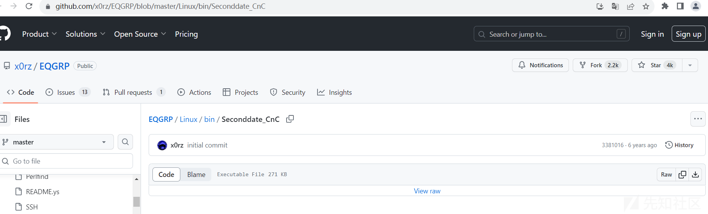](https://xzfile.aliyuncs.com/media/upload/picture/20231107094659-8aae4e92-7d0f-1.png)  
[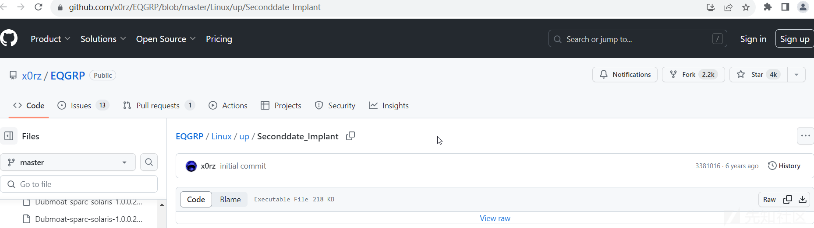](https://xzfile.aliyuncs.com/media/upload/picture/20231107094804-b0fc2038-7d0f-1.png)  
其他版本样本截图如下：  
[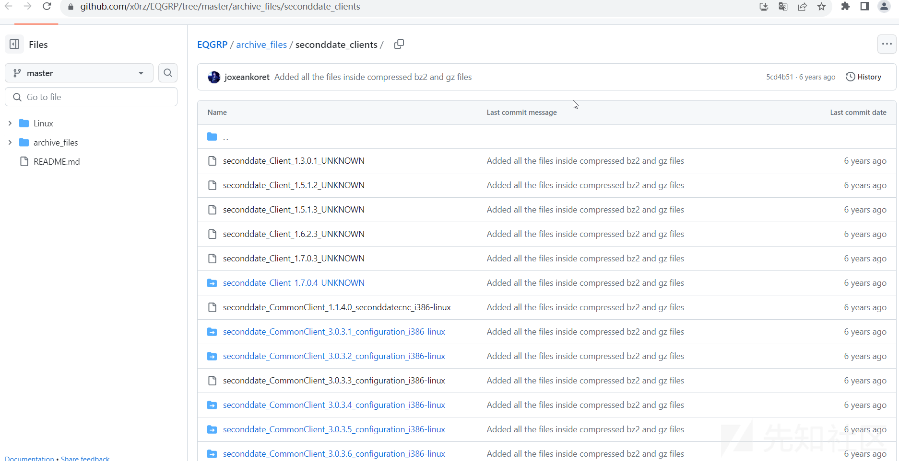](https://xzfile.aliyuncs.com/media/upload/picture/20231107094827-bee8609e-7d0f-1.png)  
[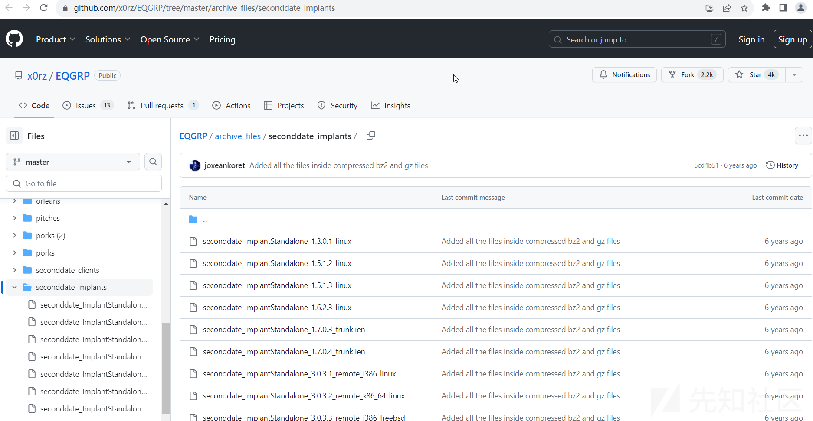](https://xzfile.aliyuncs.com/media/upload/picture/20231107094843-c871434c-7d0f-1.png)

## 功能复现

通过梳理网络中对此间谍软件的介绍，发现“SecondDate”间谍软件是一款中间人攻击专用工具，应用场景为：驻留在目标网络的边界设备上，嗅探网络流量并根据需要对特定网络会话进行劫持、篡改。

为复现“SecondDate”间谍软件的功能，整理“SecondDate”间谍软件的使用方法，笔者通过多种技术手段（查看控制端程序中的字符串信息及逆向控制端、服务端程序的关键代码运行逻辑；）将“SecondDate”间谍软件的功能有效的复现了出来，目前已可完整模拟对特定网络会话进行劫持、篡改的功能，详细复现流程如下：

### 受控端-Seconddate\_Implant

在受控主机中执行“./Seconddate\_Implant ”命令，即可正常运行木马程序；通过对此程序运行过程进行监控，未发现明显的网络行为及文件行为；

```plain
#受控主机--192.168.184.129运行Seconddate_Implant木马程序
root@kali:~/Desktop# ls
Seconddate_Implant
root@kali:~/Desktop# ./Seconddate_Implant 
root@kali:~/Desktop# ps -ef |grep Seconddate
root      5283     1  0 15:17 pts/0    00:00:00 ./Seconddate_Implant
root      5285  4006  0 15:17 pts/0    00:00:00 grep Seconddate
root@kali:~/Desktop# netstat -anp |grep Seconddate
root@kali:~/Desktop#
```

[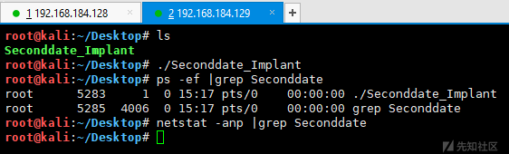](https://xzfile.aliyuncs.com/media/upload/picture/20231107095007-fa3e77e6-7d0f-1.png)

### 控制端-Seconddate\_CnC

由于“SecondDate”间谍软件要实现对特定网络会话进行劫持、篡改，因此需要提前构建篡改后的网络响应内容，然后在“SecondDate”间谍软件中配置网络流量嗅探规则，对特定网络会话进行处理。

#### 创建网络响应内容

```plain
root@kali:~/Desktop# cat response
HTTP/1.1 200 OK
Content-Type: text/html
Content-Length: 87

<html><body>Hello World!!<br><br>Test Seconddate_CnC Tools!!<br></iframe></body></html>
root@kali:~/Desktop#
```

[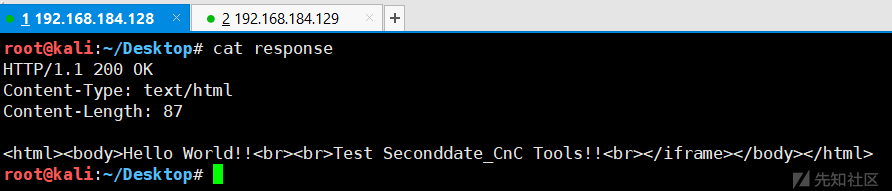](https://xzfile.aliyuncs.com/media/upload/picture/20231107095036-0b8bdc46-7d10-1.png)

#### 对特定网络会话进行劫持、篡改

```plain
#控制主机--192.168.184.128运行Seconddate_CnC控制端程序
root@kali:~/Desktop# ./Seconddate_CnC 192.168.184.129 8080
SECONDDATE> help
[#] Mon, 06 Nov 2023 18:00:01 +0800
Command:                              Description
--------                              --------------------------------------
clearlog                              Clears entire translation table.
                                      All rules must be disabled first.

disable [rulenum]                     Disables redirection/survey rule.

enable [rulenum]                      Enables redirection/survey rule.

help or ?                             Shows this command summary.

ping                                  Tests for connectivity to sd module.

quit or exit                          Exits.

rule [rulenum] [opts ...]             Sets options for a rule.
                                      where opts is one or more of the following options
                                      (defaults are shown in parentheses):
                                      [--srcaddr addr(0)] [--srcmask mask(255.255.255.255)]
                                      [--dstaddr addr(0)] [--dstmask mask(255.255.255.255)]
                                      [--protocol prot(6/TCP)] [--srcport port(0)] [--dstport port(0)]
                                      [--mininterval(60)] [--maxinjections(5)] [--injectwindow(0)]
                                      [--checkhttp (default) | --nocheckhttp]
                                      [--checkregex (default) | --nocheckregex]
                                      [--tcpflag (FIN ACK) URG | ACK | PSH | RST | SYN | FIN ]
                                      [--regexfile <filename>] [--injectfile <filename>

getinfo                               Show generic implant information.

showrule [--all | rulenum]            Shows contents of enabled rules.
                                      All rules are shown if the --all flag is used.

getlog [--log logfile ] [entrynum]    Shows contents of the log.
                                      Starts at entry entrynum if provided or 0 otherwise.
                                      Optionally writes its output to logfile.

uninstall                             Uninstalls (unloads) sd module from router.
                                      Requires sd to be reinstalled after this command
                                      for future operations using sd.

Configuring min interval, max injections and inject window examples:
All times are input in seconds
    10 injections per 2 hour window until manually disabled and injections are 5 minutes apart.
        min interval = 300, max injections = 10, inject window = 7200
    10 injections then disable and injections are 5 minutes apart
        min interval = 300, max injections = 10, inject window = 0
    inject every 5 minutes until manually disabled
        min interval = 300, max injections = 0, inject window = 0
    The default is 5 injections the disable and injections are 60 seconds apart

SECONDDATE> ping
[#] Mon, 06 Nov 2023 18:00:02 +0800
OK.
SECONDDATE> rule 1 --dstport 2345 --maxinjections 2 --injectwindow 600 --nocheckregex --injectfile /root/Desktop/response
[#] Mon, 06 Nov 2023 18:00:25 +0800
OK.
SECONDDATE> showrule 1
[#] Mon, 06 Nov 2023 18:00:34 +0800
Rule:           1
Enabled:        no
Src Addr:       0.0.0.0
Src Mask:       0.0.0.0
Dst Addr:       0.0.0.0
Dst Mask:       0.0.0.0
Protocol:       6
Src Port:       0
Dst Port:       2345
Min Interval:   60
Max Inject:     2
Inject Window:  600
Inject Length:  148
TCP Flags:      --- ACK PSH --- --- FIN 
Check HTTP:     yes
Custom Regex:   no
Next Injection Time:    0
Injection Window End Time:     0
Current Injections:   0
Total Injections:  0

Regex Pattern:
[ BEGIN ]
(NULL)
[ END ]

Inject Text:
[ BEGIN ]
HTTP/1.1 200 OK
Content-Type: text/html
Content-Length: 87

<html><body>Hello World!!<br><br>Test Seconddate_CnC Tools!!<br></iframe></body></html>

[ END ]
SECONDDATE> enable 1
[#] Mon, 06 Nov 2023 18:00:40 +0800
OK.
SECONDDATE>
```

### 校验劫持、篡改功能

#### 正常访问情况下

```plain
#受控主机--192.168.184.129 使用nc模拟网络请求行为
root@kali:~/Desktop# cat 1.txt
HTTP/1.1 200 OK
Content-Type: text/html
Content-Length: 52

<html><body>Hello World!!<br></iframe></body></html>
root@kali:~/Desktop# nc -l -p 2345 <1.txt
GET / HTTP/1.1
Host: 192.168.184.129:2345
User-Agent: Mozilla/5.0 (Windows NT 10.0; Win64; x64; rv:109.0) Gecko/20100101 Firefox/119.0
Accept: text/html,application/xhtml+xml,application/xml;q=0.9,image/avif,image/webp,*/*;q=0.8
Accept-Language: zh-CN,zh;q=0.8,zh-TW;q=0.7,zh-HK;q=0.5,en-US;q=0.3,en;q=0.2
Accept-Encoding: gzip, deflate
Connection: keep-alive
Upgrade-Insecure-Requests: 1

root@kali:~/Desktop#
```

[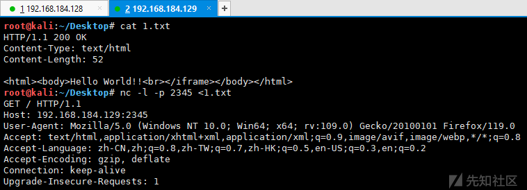](https://xzfile.aliyuncs.com/media/upload/picture/20231107095110-1fdf5682-7d10-1.png)  
[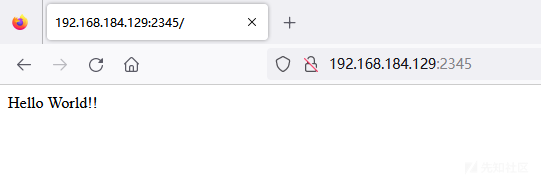](https://xzfile.aliyuncs.com/media/upload/picture/20231107095128-2adc394c-7d10-1.png)

#### 开启“SecondDate”间谍软件的嗅探篡改功能

```plain
#受控主机--192.168.184.129 使用nc模拟网络请求行为
root@kali:~/Desktop# ./Seconddate_Implant 
root@kali:~/Desktop# nc -l -p 2345 <1.txt
GET / HTTP/1.1
Host: 192.168.184.129:2345
User-Agent: Mozilla/5.0 (Windows NT 10.0; Win64; x64; rv:109.0) Gecko/20100101 Firefox/119.0
Accept: text/html,application/xhtml+xml,application/xml;q=0.9,image/avif,image/webp,*/*;q=0.8
Accept-Language: zh-CN,zh;q=0.8,zh-TW;q=0.7,zh-HK;q=0.5,en-US;q=0.3,en;q=0.2
Accept-Encoding: gzip, deflate
Connection: keep-alive
Upgrade-Insecure-Requests: 1
```

[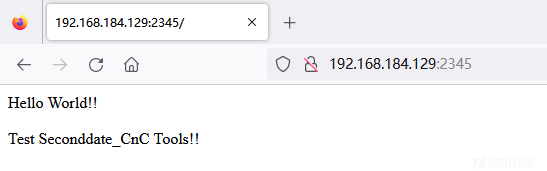](https://xzfile.aliyuncs.com/media/upload/picture/20231107095436-9a7edf48-7d10-1.png)

### 通信流量分析

通过抓取“SecondDate”间谍软件的网络通信流量，发现“SecondDate”间谍软件使用UDP协议进行网络通信，UDP载荷长度均为1048字节，且均为加密数据。

-   远控命令通信  
    [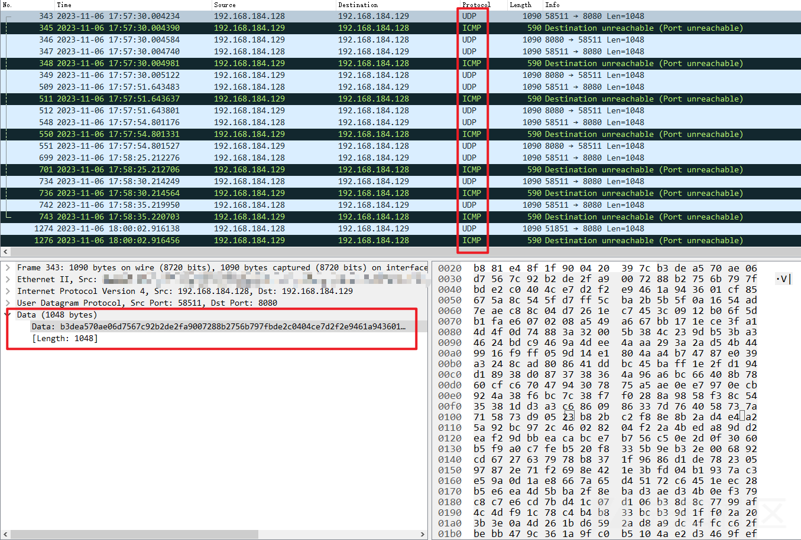](https://xzfile.aliyuncs.com/media/upload/picture/20231107095500-a914a592-7d10-1.png)

## 逆向分析

### Seconddate\_CnC

#### 版本信息

通过分析，发现此样本的版本为“1.1.1.1”，是同系列样本中版本最老的一个样本，代码截图如下：  
[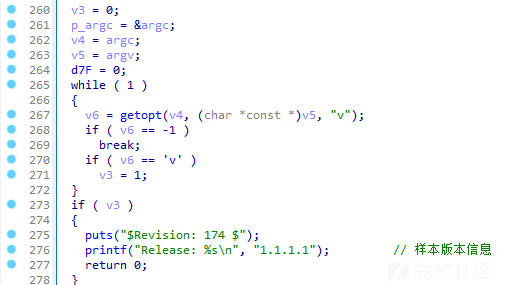](https://xzfile.aliyuncs.com/media/upload/picture/20231107095542-c2155f00-7d10-1.png)

#### 远控指令

通过分析，发现此样本支持多个远控指令，详细情况如下：

| 指令  | 功能说明 |
| --- | --- |
| clearlog | 清除规则触发日志 |
| disable \[rulenum\] | 关闭规则 |
| enable \[rulenum\] | 启用规则 |
| help or ? | 帮助说明 |
| ping | 测试木马通信是否畅通 |
| quit or exit | 退出  |
| rule \[rulenum\] \[opts ...\] | 配置规则 |
| getinfo | 获取程序基本信息及规则触发概要信息 |
| showrule \[--all or rulenum\] | 显示规则详情 |
| getlog \[--log logfile \] \[entrynum\] | 获取规则触发日志 |
| uninstall | 卸载程序 |

相关代码截图如下：  
[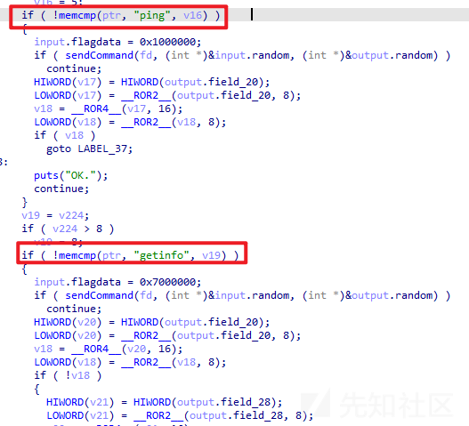](https://xzfile.aliyuncs.com/media/upload/picture/20231107095603-cee2553a-7d10-1.png)

### Seconddate\_Implant

#### 网络流量嗅探

​ 通过分析，发现此样本将开启网络流量嗅探，样本将对设备中的所有网络流量数据包进行过滤筛选，通过协议类型匹配和数据包载荷长度对比，提取特定恶意数据包，并解密提取有效数据开展后续恶意行为，相关代码截图如下：  
[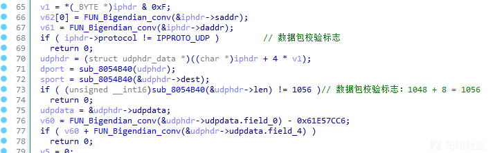](https://xzfile.aliyuncs.com/media/upload/picture/20231107095623-da524254-7d10-1.png)

#### 远控指令

​ 通过分析，发现此样本将通过多层解密算法从加密数据中提取有效数据，并根据解密数据中的对应字段执行对应的远控指令，相关代码截图如下：

[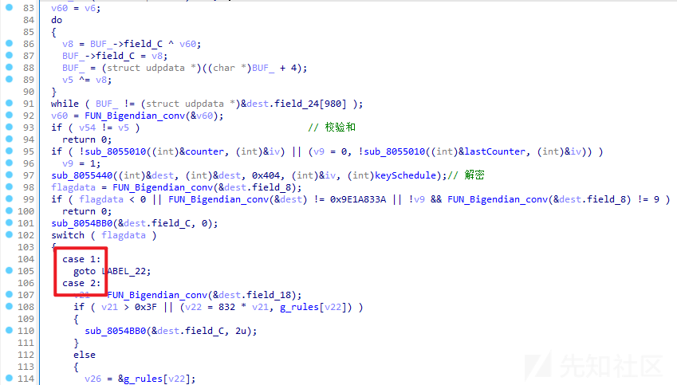](https://xzfile.aliyuncs.com/media/upload/picture/20231107095645-e7dab6ae-7d10-1.png)

### 通信数据解密

通过对“SecondDate”间谍软件的通信行为进行分析，发现“SecondDate”间谍软件将调用两层解密算法对UDP数据包载荷进行解密：

-   第一层解密算法为异或解密，主要用于提取第二层RC6算法的随机IV值及RC6加密数据；
-   第二层RC6算法为非标准的RC6算法，由于此算法的算子被修改，因此所计算的值也与标准RC6算法所计算的值不同；  
    详细情况如下：

#### 第一层解密算法：异或解密

通过分析，发现样本将提取载荷的前4个字节作为异或算子，随后将异或算子与加密数据按每4个字节一组进行异或解密，相关代码截图如下：  
[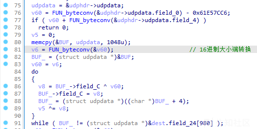](https://xzfile.aliyuncs.com/media/upload/picture/20231107095735-056df8f2-7d11-1.png)  
使用Go语言编写解密脚本，解密函数如下：

```plain
func main() {
    udpdata := "44a060291d451c9d632a58aad32b4ffadc52b6d01a1852afe715f746eb5e4e563ede652f390eb0690b63ff4017dd063f8dfdd22b020c21780f7389142f98f211f11826d62f3747d7ecd9fb68526eb351932f8440c3c819611f9a33a94cb20fcce1cab3c60d0f7e9f6975bce0f39957a93c87aeb7b131fc87983bbc8aefa3818e087a81cbce5cf7fa1032afc46265a2759fc5ab3b823584110de5323a082c924c532a2166fea804f84bafd340696707419e056ff494b3f0d8e91d3940aa897344bc2f8df4295056afcefa2ce8af3fca50b5092afb2272dd4f5a98330515451f94ea54b8731b7696b228ddaea0ddc15c0ba5d333831f61ddbc7d31dff841f2761fc9e792071cb717a8c2dd2f56cc39947efb072e0dca4d1d4ebdeb78dbd9088e7c70984cc171751cf346333bca29f51637cbafac78e44591259797dcc0d49f9b912c91e2647e9a3d6279ff94211411e9a64dac3141f0a8bcd00cf411d558de463bb9b24fd7e574df9f4592288444d2a36ad137b88b30cf42b12b4445da5957828e778de7b9021bc62020ffa9ef62282805a78475ea7048953fbcdfe2e39e76f7c8cd1ac600b06afb3d2a2b2c7946de1455d7195270babf378b1cfbc04d8b8f52d55f764acfa74d7ffe2bad06486439a385df3506d04991de2d3aab2a6c56c93b1f7d83371e73154a7fe6134c8350544eb1cf99942eaac6e18a6f25c8b8b55805e6e77c92656742d74b9f39ad8c4504e66a7ffa51c348e82c113d4c2cceeaaab9982902866efe2846b002ab4b2b4104e2c9a0517d1ae9dc328818a4f820d40f9ee90c5fc2dec443c45d38ef803b2149d88b5268a0fd4544e760ef4ccccc557aa1c846e0020c24a2208a2a1db03c78806ace3387f62d1ef51885b91b073b9c5a350ab6b7f8bba56b4002aeb60e5d0094480dda937f03c1cf7181e2ffecb2f819ad0a451ba8028d21968272a3b29d8ff709ec90842e374caf70aff8d504542e1ccd5b4eacab217eb43d5e643fc78f2cb07edfef79d3e673c9a6ec37975a5e19386f31898e59258fb814b1dd3bfd08700c5f4401e3b9408980e69efaec46c261ca3d73b9a7526609500f304ebc2cf8c1e9bcc1396ffba1d3e7ee2d609f5d1c220347d3d2457134bb008c3fede1d3182fbf6e634b2196282fe8a374522ac510a2b0fe6659b30cc665431fb46207a7c90e8e42068ba002fcb2e12ab8c40d3c26ba8becb1cd007c0bbc22a8e57bd1f8e8c1872ba8f6562681c51ef62a39388d8412f9715b85d58a233c9fe5c923ea3ce02a9110c0333d0d09909517c2cbef2cd1c6d87a7e9b607f6028a9a34babe4e069d3c082635a51e07496ba32a1faa303f80dc9c84bb9016e0abf850ec5c430a1db0f029cdbff8ad71c202a202b06b672bdcd310316df7e8fad271b4760ecd30e291d8e61c70b5917ccd8e356b7e7b255f9ac67776c1781482919d52b49d1ce03a6855a1679af86a662d195c58a"
    hex_data, _ := hex.DecodeString(udpdata)

    v83 := BytesToInt(hex_data[:4]) - 0x61E57CC6
    if (v83 + BytesToInt(hex_data[4:8])) != 0 {
        //return
    }
    output := []byte{}
    for i := 0xc; i < 1048; i = i + 4 {
        aa := bits.ReverseBytes32(uint32(BytesToInt(hex_data[i:i+4]))) ^ bits.ReverseBytes32(uint32(v83))
        output = append(output, IntToBytes(int(bits.ReverseBytes32(aa)))...)
    }
    fmt.Println(hex.EncodeToString(output))
}

func BytesToInt(bys []byte) int {
    bytebuff := bytes.NewBuffer(bys)
    var data int32
    binary.Read(bytebuff, binary.BigEndian, &data)
    return int(data)
}

func IntToBytes(n int) []byte {
    data := int32(n)
    bytebuf := bytes.NewBuffer([]byte{})
    binary.Write(bytebuf, binary.BigEndian, data)
    return bytebuf.Bytes()
}
```

#### 第二层解密算法：修改后的RC6算法

通过分析，发现此样本中内置的RC6算法与标准RC6算法的运行结果有所不同，进一步分析，发现样本中内置的RC6算法算子运算被修改，详细情况如下：

-   样本中内置的RC6算法  
    [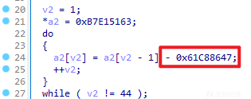](https://xzfile.aliyuncs.com/media/upload/picture/20231107095802-15d08282-7d11-1.png)
    
-   标准RC6算法  
    [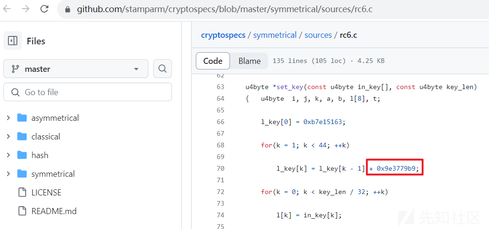](https://xzfile.aliyuncs.com/media/upload/picture/20231107095827-247dce02-7d11-1.png)
    

通过网络调研，发现其实早在2016年以前，卡巴斯基就曾曝光方程式组织在样本中使用“0x61C88647”作为RC6算法的算子，相关截图如下：  
[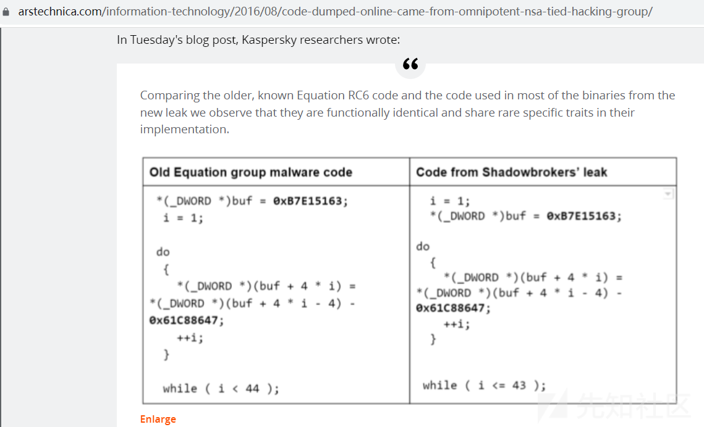](https://xzfile.aliyuncs.com/media/upload/picture/20231107095854-34809a3c-7d11-1.png)

进一步对其RC6算法进行分析，提取RC6算法key信息如下：  
[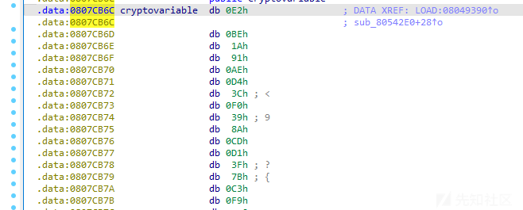](https://xzfile.aliyuncs.com/media/upload/picture/20231107095910-3e239080-7d11-1.png)

RC6算法的key值主要用于RC6算法的初始化（生成keySchedule数组），iv值用于每次加解密时调用，相关代码截图如下：  
[](https://xzfile.aliyuncs.com/media/upload/picture/20231107095933-4b90c292-7d11-1.png)

通过GDB调试，提取RC6算法的相关skeytable及rk值如下：

```plain
#skeytable
(gdb) x /44xw 0x808e008
0x808e008:  0xb7e15163  0x5618cb1c  0xf45044d5  0x9287be8e
0x808e018:  0x30bf3847  0xcef6b200  0x6d2e2bb9  0x0b65a572
0x808e028:  0xa99d1f2b  0x47d498e4  0xe60c129d  0x84438c56
0x808e038:  0x227b060f  0xc0b27fc8  0x5ee9f981  0xfd21733a
0x808e048:  0x9b58ecf3  0x399066ac  0xd7c7e065  0x75ff5a1e
0x808e058:  0x1436d3d7  0xb26e4d90  0x50a5c749  0xeedd4102
0x808e068:  0x8d14babb  0x2b4c3474  0xc983ae2d  0x67bb27e6
0x808e078:  0x05f2a19f  0xa42a1b58  0x42619511  0xe0990eca
0x808e088:  0x7ed08883  0x1d08023c  0xbb3f7bf5  0x5976f5ae
0x808e098:  0xf7ae6f67  0x95e5e920  0x341d62d9  0xd254dc92
0x808e0a8:  0x708c564b  0x0ec3d004  0xacfb49bd  0x4b32c376
#rk
(gdb) x /44xw 0x808e008
0x808e008:  0x60062079  0xbd0ed034  0x34f15395  0xc4629c68
0x808e018:  0xd3922b5f  0xfc162202  0x46105df4  0x8e950d62
0x808e028:  0x96b808c5  0x291d851d  0xb3c771e9  0x5b123aa3
0x808e038:  0xf851502a  0xb728d187  0x820e374e  0xb6acc903
0x808e048:  0x4a16c548  0xa341841c  0x5b456951  0x0fe3faa4
0x808e058:  0x460ee128  0x18f97386  0xf10b61b3  0x6b8e5b49
0x808e068:  0x207a1965  0x4adea552  0x78368ff4  0xf6a4c953
0x808e078:  0x0ff937fd  0x7e4656a4  0x9dc0960f  0x71fc97dc
0x808e088:  0x68582aa2  0x50e302c8  0x63a4a6e1  0xedfb9993
0x808e098:  0x19ae60a3  0x250efa65  0xe929b0e2  0xcfeaf311
0x808e0a8:  0x41c36d94  0x7add6824  0x2df61e1f  0xad5e87e2
```

使用Go语言编写RC6解密脚本，重构RC6初始化函数如下：

```plain
//重构https://github.com/dgryski/go-rc6/blob/master/rc6.go代码中的New(key []byte)函数
func New(key []byte) (cipher.Block, error) {
    skeytable := make([]uint32, 44)
    skeytable[0] = uint32(0xb7e15163)

    for i := 1; i < 44; i++ {
        skeytable[i] = skeytable[i-1] - uint32(0x61C88647)
    }

    if l := len(key); l != 16 {
        return nil, KeySizeError(l)
    }
    c := &rc6cipher{}
    const keyWords = 3
    var L [keyWords]uint32

    for i := 0; i < keyWords; i++ {
        L[i] = binary.LittleEndian.Uint32(key[:4])
        key = key[4:]
    }

    copy(c.rk[:], skeytable)

    var A uint32
    var B uint32
    var i, j int

    for k := 0; k < 3*roundKeys; k++ {
        c.rk[i] = bits.RotateLeft32(c.rk[i]+(A+B), 3)

        A = c.rk[i]
        L[j] = bits.RotateLeft32(L[j]+(A+B), int(A+B))
        B = L[j]

        i = (i + 1) % roundKeys
        j = (j + 1) % keyWords
    }
    return c, nil
}
```

#### 数据包解密流程

实际数据包截图如下：  
[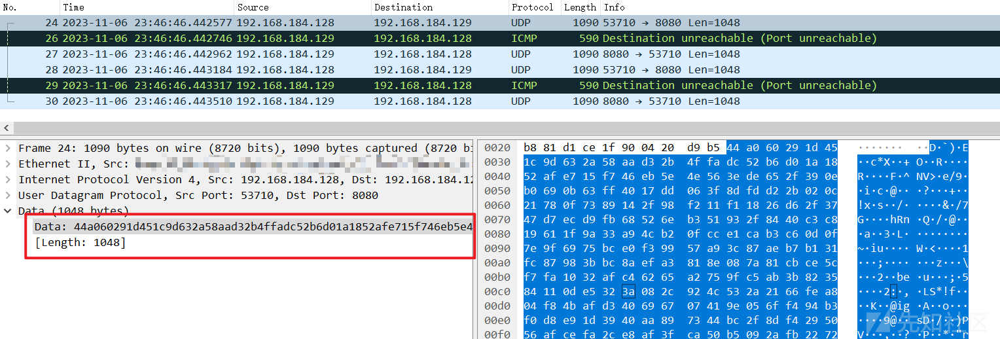](https://xzfile.aliyuncs.com/media/upload/picture/20231107095955-58d0f580-7d11-1.png)

```plain
44a06029    #0x44a06029 - 0x61E57CC6 = 0xe2bae363
1d451c9d    #数据包校验：0x1d451c9d + 0xe2bae363 = 0
632a58aa    #checksum
#加密数据
d32b4ffadc52b6d01a1852afe715f746eb5e4e563ede652f390eb0690b63ff4017dd063f8dfdd22b020c21780f7389142f98f211f11826d62f3747d7ecd9fb68526eb351932f8440c3c819611f9a33a94cb20fcce1cab3c60d0f7e9f6975bce0f39957a93c87aeb7b131fc87983bbc8aefa3818e087a81cbce5cf7fa1032afc46265a2759fc5ab3b823584110de5323a082c924c532a2166fea804f84bafd340696707419e056ff494b3f0d8e91d3940aa897344bc2f8df4295056afcefa2ce8af3fca50b5092afb2272dd4f5a98330515451f94ea54b8731b7696b228ddaea0ddc15c0ba5d333831f61ddbc7d31dff841f2761fc9e792071cb717a8c2dd2f56cc39947efb072e0dca4d1d4ebdeb78dbd9088e7c70984cc171751cf346333bca29f51637cbafac78e44591259797dcc0d49f9b912c91e2647e9a3d6279ff94211411e9a64dac3141f0a8bcd00cf411d558de463bb9b24fd7e574df9f4592288444d2a36ad137b88b30cf42b12b4445da5957828e778de7b9021bc62020ffa9ef62282805a78475ea7048953fbcdfe2e39e76f7c8cd1ac600b06afb3d2a2b2c7946de1455d7195270babf378b1cfbc04d8b8f52d55f764acfa74d7ffe2bad06486439a385df3506d04991de2d3aab2a6c56c93b1f7d83371e73154a7fe6134c8350544eb1cf99942eaac6e18a6f25c8b8b55805e6e77c92656742d74b9f39ad8c4504e66a7ffa51c348e82c113d4c2cceeaaab9982902866efe2846b002ab4b2b4104e2c9a0517d1ae9dc328818a4f820d40f9ee90c5fc2dec443c45d38ef803b2149d88b5268a0fd4544e760ef4ccccc557aa1c846e0020c24a2208a2a1db03c78806ace3387f62d1ef51885b91b073b9c5a350ab6b7f8bba56b4002aeb60e5d0094480dda937f03c1cf7181e2ffecb2f819ad0a451ba8028d21968272a3b29d8ff709ec90842e374caf70aff8d504542e1ccd5b4eacab217eb43d5e643fc78f2cb07edfef79d3e673c9a6ec37975a5e19386f31898e59258fb814b1dd3bfd08700c5f4401e3b9408980e69efaec46c261ca3d73b9a7526609500f304ebc2cf8c1e9bcc1396ffba1d3e7ee2d609f5d1c220347d3d2457134bb008c3fede1d3182fbf6e634b2196282fe8a374522ac510a2b0fe6659b30cc665431fb46207a7c90e8e42068ba002fcb2e12ab8c40d3c26ba8becb1cd007c0bbc22a8e57bd1f8e8c1872ba8f6562681c51ef62a39388d8412f9715b85d58a233c9fe5c923ea3ce02a9110c0333d0d09909517c2cbef2cd1c6d87a7e9b607f6028a9a34babe4e069d3c082635a51e07496ba32a1faa303f80dc9c84bb9016e0abf850ec5c430a1db0f029cdbff8ad71c202a202b06b672bdcd310316df7e8fad271b4760ecd30e291d8e61c70b5917ccd8e356b7e7b255f9ac67776c1781482919d52b49d1ce03a6855a1679af86a662d195c58a

#第一层解密数据
3191ac993ee855b3    #RC6算法随机iv值
f8a2b1cc05af142509e4ad35dc64864cdbb4530ae9d91c23f567e55c6f473148e0b6c21bedc96a77cd22117213a2c5b5cd8da4b40e63180bb0d45032719567232172fa02fd20d0caae08ecaf037050a5efb59dfc8bcf5f831123b4cade3d4dd4538b1fe47a815fe90d1962edeac062a82ce61499f2884ca780df41167d7f4858608f6772ef5fd159ea96712fb190c2051c12e79ba91530238bdde4227cbf8c97760913bb0ba7da23483390275e956e97cbeab5cc2c40cf8b4d85293357b3c998c0c83e2cb822d066f7fffcf708ee5b10f9cc75d1ca674dc33f7bbf684769d0e0fddb3edf9f8b3c9ba348957c2b5d7164fe0df4cb2067cc352e83771d19bdcd6e28f7fe2d5f519bb83bb26d1f9222afa293cfff90a489d8a9cb4ff55429154f1b06ff7246752d3fa3362578f2ce2b01079c20de019b457742f6ab0ac5af16d22212125fb3ee4ef2b6ba64a5585b08acb407ce3cfca728cbe7a6684009338d5be8d275a1d2c9fea6b9bbed61ed953704dae0a12543c2454a8c8092cb66453e968992f2765c5e6501807ccc14ab2fa0256352d0185ec891cf1aa464f73635a3b1135805d4e8fe41232e6935b1b6bdcca9ac45f79c9dc917e52b868340e63d8fe5b3ab2b3d4ed811c90fb473d87c9f39d47d91afa91c04a9afe0b2eeadd22d23774d487c02e98d9f2bdb57e2e68505c6710685f834287d834eefa7be05099d40b2a0aa52cf72dff6cfad08105afbcbb8650d1c92a5d3e011a848a3be01aa42eb9e790b66d1ebfa1e1b4336b57d8aeee521bd26f9273eda556358c3f33be8b0d2439ea7fe04030df62fafb7c042aba45ae16fc618c3e9c8a7535f9a3a89add13d154efc4ffbe65ba1e4587ee0d669540d1bd847d1a3614c0ced3ee22eab6e38299c60237592e200450fd11aa34e69a7a14b616f9b75e1901951fe6d4dea8f723ecd54ae1593cc1a6fe737cca62e38ac1648429c0ede3d868524ecce0a9dbc0dc330859173458fd52db93dfb828c526b34ba466d02f7d23f811e6b92b6bc27e3595a236b3a05fd1856a5a18370de105b1db105ebeaec53ac06cf9b23535fa2dbd518c2315d0d4e8225be7fc0b9a4b030ff925759ba6f5c0f5b307bcd058d00a99b754bcd524017b0902673400a1d05bb09efa587f9fcd780bd44aaec34a165691ae19f505bc9db26b7df4558310fd22fba9f685e984b86996b1b8b233dc8cb14ecc5e227a41549db826ee7f0439238676f6940de2506aac150df83c82bf3a3d187ee6a722ff4a12955cfb22462991d79da9c03ca134028495e030a317a6100b8eb03177400d1c21819e09bef732b285bbb8d695d3feda6268a42b8edb87fb81d30347fc290c348e40c91de2f8be0753dc46ccec5a1a4030e69ed4aff3482a4e9e3f4af3a59b5d40508b69a4edd940ff53bab4afb6fc82a3374e0c567e0f51a4d3c4501332f26e9

#第二层解密数据
66b832f6    #校验值
48dd9c90    #校验值
00000009    #远控指令
00000000000000000000000000000000000000000000000000000000000000000000000000000000000000000000000000000000000000000000000000000000c8ffffff3cfdedbf9ad361b758fdedbf3800000058fdedbf69cf0408d0ba76b7f4cf78b7ec5b5db70200000094fbedbf759477b7810064b7e99976b721000000c8fffffff42f73b7b02a130830c37300046e5db70100000000000000760f71b7000000000000000028feedbf00000000f42f7300c8ffffff30feedbfc8ffffff00000000010000000000000000000000a03373b700000000000000000000000000faedbf8a0771b7000000000a00000000010000ffffffff000000000100000058fdedbf01000000ffffffff01000000000000000100000008d978b790696500046e5db7f88d78b7f0fbedbf300000001900000034b25db70000000080fcedbf38fcedbf44fcedbf0000000004fcedbffb0564b788feedbf88feedbf1cfcedbf281a64b788feedbf69cf0408f42f73b7000000006cfeedbf57d561b718feedbf0000000088feedbf69cf040858be76b70200edbfe0ea77b769cf0408d0ba76b773cf78b740635db702000000d4fcedbfc8fffffff88d78b7b02a1308000000001f0000000100000000000000760f71b700000000210ceebf58ffedbfb0fcedbff9ffffffffffffff0c9d6ab7000000007d01000000000000f42f73b7f42f73b7e0cc130801000000ccfcedbfa5de63b764ee63b7f9ffffffffffffff01000000f42f73b778fdedbf2cf063b7e0cc1308f9ffffffffffffffef0071b70c0171b7505774b758fdedbf0000000000000000c04373b7de5264b7241264b7f04373b7db3064b7f42f73b758fdedbf3cfdedbf0800000058fdedbf000000000000000001faedbf38005c65f42f73b758fdedbf8c33130800feedbf916063b7c4935db71069690d84fdedbfa68d77b7305a5eb7450505088d33130869cf040858be76b70200edbfe0ea77b769cf0408d48c5db71069690db4fdedbfa68d77b7305a5eb7450505080000000069cf040858be76b70200edbfe0ea77b769cf0408d0ba76b7f4cf78b724515db70200000034feedbf259477b7c4935db72cbe76b7b3b60c90acfeedbf040000000000000030ca7700046e5db7f88d78b700feedbf38bb76b71c000000d48c5db72cbe76b7bcee90caf4cf78b704000000000000000000000001000000ed01000058be76b738bb76b773cf040854005eb7f0a5040801000000f4cf78b720ffedbfc0da78b7f4feedbf629677b7e4feedbff0a50408d8feedbf64da78b70000000058be76b701000000000000000100000008d978b72eef70b7e8cc1308601e73b7d0feedbf505774b7b0feedbf24000000002076b7d3a969b7f42f73b7f4ea63b701000000002076b724000000e03473b7
```
